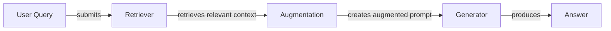
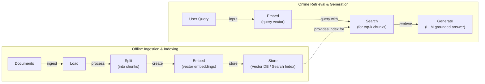
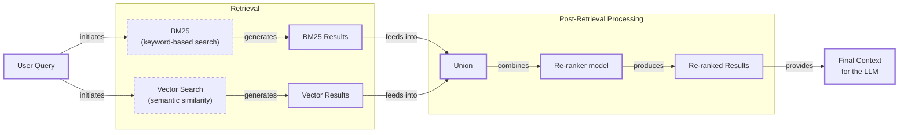
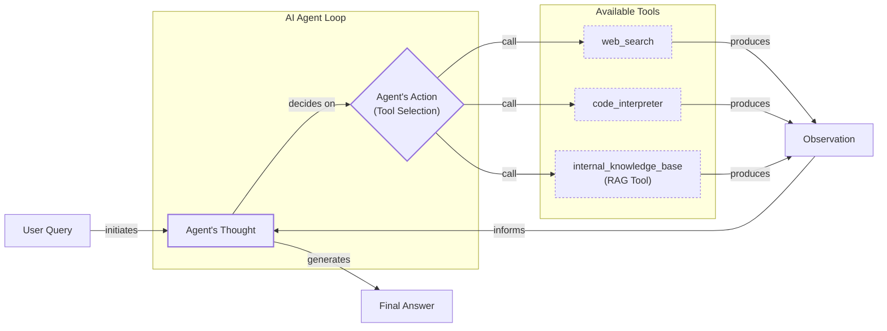

# Lesson 9: Retrieval-Augmented Generation

In our course so far, we have explored the landscape of AI engineering, distinguished between LLM workflows and agents, and introduced context engineering as the art of managing information flow to an LLM. We have also covered structured outputs, agent tools, and the ReAct framework for building reasoning agents. These concepts are the building blocks for creating sophisticated AI systems.

A core problem remains: LLMs are trained on a fixed dataset, making their knowledge static. Their training is like a "closed-book exam" on the world's information. This approach evolved from decades of Information Retrieval (IR) systems, starting with keyword-based methods like TF-IDF and BM25, moving to dense vector-based retrieval, and culminating in modern RAG, which combines retrieval with powerful generative models [[60]](https://medium.com/data-science-collective/journey-from-traditional-ir-to-rag-to-agentic-rag-b658210f46d4). Still, we do not yet have efficient techniques to enable models to learn new information over time after deployment.

We can fine-tune them, but this process is often inefficient and impractical for keeping knowledge current. Fine-tuning is resource-heavy, requiring powerful hardware and significant time. Constructing a high-quality training dataset is a complex and expensive task in itself, often requiring a dedicated team of annotators or even using other LLMs to generate question-answer pairs, which introduces its own potential for errors [[4]](https://neo4j.com/blog/developer/fine-tuning-vs-rag/). Furthermore, a multi-day training job might be needed just to incorporate new knowledge. This approach also carries the risk of "catastrophic forgetting," where the model loses previously learned information in the process of acquiring new facts. Even after a successful fine-tuning run, the model's knowledge is once again static, only pushing the knowledge cutoff date to a later point without solving the underlying problem [[4]](https://neo4j.com/blog/developer/fine-tuning-vs-rag/).

Even with modern LLMs boasting large context windows, simply feeding them vast amounts of information is not a silver bullet. Context windows are finite, and using them to their limit increases both cost and latency with every call. More importantly, models suffer from the "lost in the middle" phenomenon, where they struggle to recall information buried deep within a large context, paying more attention to the beginning and end of the prompt [[3]](https://openreview.net/forum?id=5sB6cSblDR). This "needle in a haystack" problem means that performance can degrade long before the physical token limit is reached. For knowledge bases smaller than about 500 pages, it might be feasible to include the entire corpus in the prompt, especially with features like prompt caching, but this approach does not scale [[24]](https://www.anthropic.com/news/contextual-retrieval).

This is where Retrieval-Augmented Generation (RAG) becomes a reliable solution. With RAG, we give the LLM an "open-book exam" by connecting it to external, real-time knowledge sources [[1]](https://blogs.nvidia.com/blog/what-is-retrieval-augmented-generation/). Instead of memorizing everything, the model can look up information as needed, similar to how humans use manuals or cheat sheets. This technique allows LLMs to access up-to-date, domain-specific, or private information without the need for constant retraining, making it a cost-effective and flexible approach [[35]](https://aws.amazon.com/what-is/retrieval-augmented-generation/).

RAG is a key method AI engineers use in context engineering, which we covered in Lesson 3. It allows us to precisely curate the information an LLM receives. In this lesson, we will explore the journey from basic RAG to advanced and agentic patterns. We will start by breaking down RAG into its core components, then examine the end-to-end pipeline. We will also explore advanced techniques for improving retrieval quality and see how RAG becomes a powerful tool in the hands of an agent. In our next lesson, we will discuss agent memory, which complements RAG by providing short- and long-term storage for interactions and learned information.

With the problem and motivation clear, we’ll first decompose RAG into its core components so you can see where each responsibility lives.

## The RAG System: Core Components

Understanding the components of a RAG system is the first step in the context engineering process of designing effective retrieval systems. At a high level, RAG can be broken down into three conceptual pillars: Retrieval, Augmentation, and Generation. This modular design is leveraged by major industry players; for instance, IBM's WatsonX platform uses RAG to ground its models in enterprise data, and NVIDIA offers RAG blueprints to help developers build their own grounded AI applications [[15]](https://www.ibm.com/think/topics/agentic-rag), [[1]](https://blogs.nvidia.com/blog/what-is-retrieval-augmented-generation/).

Image 1: A flowchart illustrating the conceptual flow of a Retrieval Augmented Generation (RAG) system.

**Retrieval** is the engine for finding relevant information. When a user submits a query, the retrieval system searches an external knowledge base to find documents or data snippets relevant to the query. The most common approach is semantic search, which relies on vector embeddings to find information that is contextually similar in meaning, even if the wording is different [[51]](https://apxml.com/courses/prompt-engineering-llm-application-development/chapter-6-integrating-llms-external-data-rag/implementing-semantic-search-retrieval).

Vector embeddings are numerical representations of data, such as text or images. An embedding model, typically a transformer-based neural network, processes a piece of text and converts it into a high-dimensional vector. This process involves tokenizing the text, mapping tokens to a vocabulary, and then using the transformer to generate a vector where each dimension captures some aspect of the content's semantic meaning. These vectors are then stored in a specialized vector database, which is optimized for performing efficient nearest-neighbor searches. When a query comes in, it is converted into a vector using the same embedding model. The database then searches for the vectors (and their corresponding text chunks) that are closest to the query vector in the high-dimensional space, often using distance metrics like cosine similarity [[6]](https://pub.towardsai.net/vector-databases-in-practice-building-a-realistic-hybrid-search-rag-system-with-qdrant-7b8f4a6e41e0), [[52]](https://medium.com/@robi.tomar72/how-rag-actually-works-embeddings-vector-databases-indexing-retrieval-explained-simply-3d1ca45fe1bf). The efficiency of this search is heavily dependent on the indexing strategy used by the vector database, such as Locality-Sensitive Hashing (LSH), which groups similar vectors to speed up the lookup process [[6]](https://pub.towardsai.net/vector-databases-in-practice-building-a-realistic-hybrid-search-rag-system-with-qdrant-7b8f4a6e41e0).

**Augmentation** is the process of taking the retrieved information and formatting it into the context of a prompt for the LLM. Once the retriever has identified the most relevant document chunks, this step constructs a new, "augmented" prompt. This prompt typically includes the original user query along with the retrieved content, providing the LLM with the external knowledge it needs to form a grounded response [[56]](https://www.topquadrant.com/resources/blog-retrieval-augmented-generation-explained/), [[29]](https://www.ibm.com/think/topics/retrieval-augmented-generation). A well-designed prompt template is crucial here. It instructs the model on how to use the provided context, ensuring it understands that this information is the primary source of truth and that it should base its answer on these facts. For example, the prompt might explicitly state, "Using the context above, answer the question. If the context does not contain the answer, say so" [[56]](https://www.topquadrant.com/resources/blog-retrieval-augmented-generation-explained/).

**Generation** is the final step where the LLM uses the augmented input to generate an answer. The model synthesizes the information from the retrieved context with its own pre-trained knowledge to produce a coherent, factually grounded, and contextually relevant response [[27]](https://www.aimon.ai/posts/rag_and_its_different_components/), [[28]](https://toloka.ai/blog/grounding-llms-driving-ai-to-deliver-contextually-relevant-data/). By grounding the generation process in external data, this step directly addresses the problems of hallucination and outdated knowledge. Instead of relying solely on its internal, parameterized knowledge, the LLM acts as a reasoning engine over the provided data, making the final output more accurate and trustworthy [[30]](https://galileo.ai/blog/rag-architecture). This also allows for answers to cite their sources, providing a level of transparency and verifiability that is not possible with a standalone LLM [[4]](https://neo4j.com/blog/developer/fine-tuning-vs-rag/).

Now that you can name each moving part, let’s see how they line up across the two phases of a real system.

## The RAG Pipeline: Ingestion and Retrieval

The end-to-end RAG workflow is typically split into two distinct phases: an offline ingestion and indexing phase, where the knowledge base is prepared, and an online retrieval and generation phase, which happens in real-time when a user submits a query. This separation is a key design principle, allowing the computationally intensive data preparation to happen offline, while the user-facing retrieval remains fast and responsive [[32]](https://newsletter.systemdesign.one/p/how-rag-works).

Image 2: A detailed flowchart illustrating the end-to-end RAG workflow, divided into two distinct phases: Offline Ingestion & Indexing and Online Retrieval & Generation.

### Phase 1: Offline Ingestion & Indexing

This phase is all about preparing your data to be searchable. It runs in the background, either on a schedule or whenever new data becomes available [[32]](https://newsletter.systemdesign.one/p/how-rag-works). It consists of four main steps:

1.  **Load:** The first step is to load your documents from their various sources. These could be PDFs, websites, APIs, or databases. The main challenge is handling the diversity of data formats; for example, extracting clean text from a PDF with complex tables and images requires different techniques than parsing a simple text file. This step often involves a "loader" component that connects to data sources and extracts raw text and metadata [[33]](https://towardsdatascience.com/ragops-guide-building-and-scaling-retrieval-augmented-generation-systems-3d26b3ebd627/).

2.  **Split:** Once loaded, large documents are broken down into smaller, more manageable pieces called chunks. This is a critical step because LLMs have a limited context window, and smaller chunks allow for more precise retrieval. The chunking strategy is one of the most important levers for improving RAG performance. While simple fixed-size chunking is a common starting point, more advanced methods, like splitting by paragraphs or sections using a tool like LangChain's `RecursiveCharacterTextSplitter`, help keep semantically related content together [[32]](https://newsletter.systemdesign.one/p/how-rag-works).

3.  **Embed:** Each chunk of text is then converted into a vector embedding using an embedding model. This numerical representation captures the semantic meaning of the text. There are many models to choose from, including proprietary ones from OpenAI (`text-embedding-3-large`), Google (`text-embedding-004`), and Cohere, as well as open-source alternatives like BGE variants on Hugging Face. The choice depends on factors like performance, cost, and the specific domain of your data. The embedding model acts as the "embedding machine" that transforms text snippets into vectors [[8]](https://qdrant.tech/articles/what-is-rag-in-ai/).

4.  **Store:** Finally, the embeddings and their corresponding text chunks are stored in a vector database. This specialized database is designed for fast similarity search. For small-scale applications or local development, a library like FAISS is a good choice. For production systems requiring scalability and management features, options include managed services like Milvus, Qdrant, and Pinecone, or vector search capabilities within existing platforms like Elasticsearch and Azure AI Search [[53]](https://learnopencv.com/vector-db-and-rag-pipeline-for-document-rag/). This indexed knowledge base is what the online phase will query against.

### Phase 2: Online Retrieval & Generation

This phase is triggered in real-time when a user interacts with the system. A prominent real-world example is ChatGPT's browsing feature, which performs this online retrieval from the web to answer questions with up-to-date information [[4]](https://neo4j.com/blog/developer/fine-tuning-vs-rag/).

1.  **Query:** The process starts when a user asks a question. This raw query might undergo preprocessing, such as normalization or expansion, to improve its chances of matching relevant documents. Frameworks like LangChain and LlamaIndex provide abstractions like `QueryEngine` to manage this process [[31]](https://medium.com/@derrickryangiggs/rag-pipeline-deep-dive-ingestion-chunking-embedding-and-vector-search-abd3c8bfc177/).

2.  **Embed:** The user's query is converted into a vector using the *same* embedding model that was used during the ingestion phase. This is crucial because it ensures that the query and the document chunks exist in the same vector space, making their comparison meaningful [[8]](https://qdrant.tech/articles/what-is-rag-in-ai/).

3.  **Search:** The query vector is used to search the vector database. The database performs a similarity search to find the top-k most similar document chunks. This search typically relies on metrics like cosine similarity, which measures the angle between two vectors to determine how similar they are in meaning [[54]](https://towardsdatascience.com/rag-explained-understanding-embeddings-similarity-and-retrieval/).

4.  **Generate:** The final step is to generate the answer. An augmented prompt is constructed, which includes the original user query, the retrieved chunks, and instructions for the LLM. The LLM then generates a response grounded in the provided information. As we discussed in Lesson 4, using structured outputs can help ensure the answer is well-formatted and includes citations back to the source documents, enhancing transparency and user trust.

With the end-to-end path in place, the next question is quality. What are the advanced techniques to make retrieval more accurate and useful across messy, real-world data?

## Advanced RAG Techniques

While the basic RAG pipeline is powerful, its performance in real-world scenarios can be limited by the quality of retrieval. Many systems that work well in a proof-of-concept fail in production due to issues that only appear at scale. To build production-grade systems, AI engineers employ a range of advanced techniques to make retrieval more precise, context-aware, and robust.

Image 3: A flowchart illustrating the hybrid retrieval flow, showing parallel BM25 and Vector Search paths merging into a union, followed by re-ranking to produce the final context for an LLM.

### Hybrid Search

Vector search is excellent at finding semantically similar content, but it can sometimes miss documents that contain exact keywords, especially for specific identifiers or rare terms. Hybrid search addresses this by combining vector search with traditional keyword-based search algorithms like BM25 [[38]](https://mlpills.substack.com/p/issue-76-optimize-rag-with-hybrid). BM25 ranks documents based on term frequency and rarity, making it highly effective for precise matches [[36]](https://pr-peri.github.io/blogpost/2026/03/05/blogpost-hybrid-search.html). By fusing the results of both methods, often using techniques like Reciprocal Rank Fusion (RRF), hybrid search provides a more comprehensive set of candidates that balances semantic relevance with keyword precision. For example, when a user searches for "my bill keeps rolling over," keyword search finds articles with "rollover," while semantic search might surface guides on "carryover balance," covering different phrasings of the same issue.

### Re-ranking

The initial retrieval step is optimized for speed and recall, meaning it casts a wide net to find potentially relevant documents. However, the initial ranking may not be perfect. Re-ranking introduces a second, more sophisticated model to refine this initial list [[42]](https://redis.io/blog/10-techniques-to-improve-rag-accuracy/). Cross-encoder models are commonly used for this task. Unlike bi-encoders, which create separate embeddings for the query and documents, a cross-encoder processes the query and each candidate document together as a single input [[43]](https://apxml.com/courses/optimizing-rag-for-production/chapter-2-advanced-retrieval-optimization/reranking-architectures-rag). This allows for deep interaction between their tokens via full cross-attention, resulting in a more accurate relevance score. This multiphase approach balances the precision-latency trade-off by running the computationally expensive cross-encoder only on a small set of promising candidates returned by the faster initial retrieval stage [[69]](https://thenewstack.io/eliminating-the-precision-latency-trade-off-in-large-scale-rag/).

### Query Transformations

Sometimes, the user's original query is not the best input for the retrieval system. Query transformation techniques modify the query to improve retrieval accuracy.
- **Decomposition:** This technique breaks down complex, multi-faceted questions into smaller, more focused sub-queries. For example, "What’s our travel policy for conferences in Europe this year?" could be split into separate queries about the travel policy, conference definitions, and rules specific to Europe and the current year. The system retrieves documents for each sub-query and then synthesizes the results [[19]](https://docs.nvidia.com/rag/latest/query_decomposition.html).
- **Hypothetical Document Embeddings (HyDE):** This approach bridges the gap between how questions and answers are phrased. It uses an LLM to generate a hypothetical, ideal answer to the user's query *before* searching. This hypothetical document is then embedded and used for the similarity search. The intuition is that an ideal answer is likely to be semantically closer to the actual relevant documents than the original, often shorter, query [[16]](https://47billion.com/blog/rag-system-in-production-why-it-fails-and-how-to-fix-it/).

### Advanced Chunking Strategies

How you split your documents into chunks fundamentally impacts retrieval quality. Moving beyond simple fixed-size chunking can significantly improve performance.
- **Semantic Chunking:** This method splits text based on conceptual integrity, aiming to keep related sentences and ideas together. This reduces the chance of retrieving irrelevant fragments and improves the quality of the embeddings by preserving context [[18]](https://cloudurable.com/blog/advanced-rag-techniques-that-will-transform-your-l/). For example, splitting a handbook by headings ensures that a section on "Reimbursements" remains intact, preventing critical information like spending caps from being separated from the main policy.
- **Layout-aware Chunking:** For documents with complex structures like tables, forms, or PDFs, layout-aware chunking preserves the visual and structural information. Instead of treating a table as a flat block of text, it keeps rows and columns intact, ensuring that data points are not separated from their labels.
- **Context-enriched Chunking:** Also known as contextual retrieval, this technique prepends each chunk with a summary or explanatory context derived from the parent document. For example, a chunk saying "revenue grew by 3%" might be prepended with "This is from ACME Corp's Q2 2023 SEC filing." This added context makes the chunk's embedding more specific and easier to retrieve accurately.

### GraphRAG

For queries that involve complex relationships and multi-hop reasoning, standard document retrieval can fall short. GraphRAG addresses this by first constructing a knowledge graph from the source documents, where nodes represent entities (like people, companies, or concepts) and edges represent their relationships [[37]](https://arxiv.org/html/2404.16130). This structure is often defined by an ontology or semantic layer that formally describes the concepts and relationships in a domain [[92]](https://www.poolparty.biz/events/webinar-semantic-layer-enable-graphrag-application-real-world/). Instead of searching for semantically similar text chunks, the system can traverse this graph to find interconnected information. For a query like "Which incidents were caused by weekend deploys that also touched the login service?", GraphRAG can link change records to deployment times, affected services, and incident tickets, surfacing a chain of evidence that would be difficult to assemble from isolated text chunks.

### Metadata Filtering

One of the most practical and effective techniques in production is metadata filtering. When documents are indexed, they can be tagged with metadata such as source, creation date, author, department, or language. During retrieval, these tags can be used to pre-filter the search space, ensuring that the similarity search is only performed on a relevant subset of documents. Temporal filters are particularly useful. For a query like "What changed between March and June 2025?", the system can restrict retrieval to chunks with an `effective_date` within that range. More advanced systems might use bitemporal logic, filtering by `effective_date` to find what was true at a certain time, while also tracking `indexed_at` to manage data freshness and avoid surfacing stale information.

These techniques increase retrieval quality. Next, we’ll see how retrieval becomes one tool that an agent can choose to use as it reasons.

## Agentic RAG

In Lessons 7 and 8, we introduced the ReAct framework, where an agent cycles through a loop of Thought, Action, and Observation to solve problems. Agentic RAG is the application of this principle, where retrieval is no longer a fixed step in a pipeline but a tool that a reasoning agent can choose to use. This represents the latest step in the evolution from early keyword search systems [[85]](https://www.cloudthat.com/resources/blog/unveiling-the-journey-the-evolution-of-rag-systems/). The agent thinks, decides to act by retrieving information, observes the results, and iterates.

While agents can use many tools like web search or code execution, the retrieval tool is often a core component. Labeling a system "agentic RAG" can be narrow; it's more accurate to see it as an agent that *uses* RAG.

Image 4: A conceptual flowchart illustrating an AI agent's main loop in an Agentic RAG system.

### The Core Distinction

The fundamental difference between standard and agentic RAG lies in their control structure.
- **Standard RAG** follows a linear, pre-determined workflow: Retrieve → Augment → Generate. It is powerful but rigid. Every query is processed the same way, and if the initial retrieval fails, the system has no mechanism to recover [[11]](https://towardsdatascience.com/agentic-rag-vs-classic-rag-from-a-pipeline-to-a-control-loop/).
- **Agentic RAG** is adaptive and iterative. An autonomous AI agent controls the process, deciding *when* to retrieve, *what* to retrieve, and whether one retrieval is enough. This turns the RAG pipeline into a dynamic control loop, allowing for more complex problem-solving [[12]](https://www.pingcap.com/article/agentic-rag-vs-traditional-rag-key-differences-benefits/).

### Agentic Capabilities

This agent-driven approach unlocks several advanced capabilities, but also introduces new challenges in latency, cost, and reliability. For example, a simple RAG system might make 2-3 LLM calls, but an agentic system with routing and validation can make 10-15 calls, causing costs to explode without careful monitoring [[64]](https://towardsai.net/p/machine-learning/why-90-of-agentic-rag-projects-fail-and-how-to-build-one-that-actually-works-in-production). Systems like "Adaptive RAG" aim to mitigate this by dynamically choosing a simple or complex workflow based on the query's difficulty [[68]](https://redis.io/blog/agentic-rag-how-enterprises-are-surmounting-the-limits-of-traditional-rag/).
- **Iterative Retrieval:** An agent can use the RAG tool multiple times, refining its query based on intermediate results. If the first retrieval returns a vague policy document, the agent can reason that it needs more specific information, formulate a new query like “EU customers, 2024 updates,” and retrieve again to find the relevant section.
- **Tool Selection:** In a system with multiple knowledge sources, an agent can choose the most appropriate one. For a question about a recent service outage, the agent might decide to use a `search_incident_runbooks` tool instead of a `search_marketing_pages` tool, directing its query to the most relevant data source [[34]](https://weaviate.io/blog/what-is-agentic-rag).
- **Information Fusion:** The agent can combine information from its RAG tool with outputs from other tools. For instance, it could retrieve an internal company policy, then use a web search tool to check for recent changes in external regulations, and finally synthesize both pieces of information into a comprehensive answer.
- **Knowledge Base Updates:** An agent can even decide to update the knowledge base with new information it discovers. This is a preview of what we will cover in Lesson 10 on Memory for Agents. Storing agent interactions and learned facts is an open research area, with key questions around how to consolidate episodic events into a durable, long-term memory [[78]](https://medium.com/@bhuvaneswari.subramani/agentic-rag-a-self-corrective-method-for-implementing-retrieval-augmented-generation-d6bbd583446f).

Here is a conceptual example of an agent's thought process:
*   **Thought:** The user is asking about "2024 EU data retention rules." Our internal policy document is from 2023 and mentions upcoming amendments but lacks details. This information is likely outdated.
*   **Action:** `retrieve(internal_policy, query="EU data retention 2024")`
*   **Observation:** The retrieved chunks mention that amendments were passed but do not provide citations to the official directive.
*   **Thought:** I need to find the official external source to verify the details.
*   **Action:** `web_search(query="EU data retention directive 2024 official text")`
*   **Observation:** The search returns a link to the updated EU directive.
*   **Thought:** I now have both the internal context and the external verification. I can synthesize these to provide a complete answer, highlighting the changes from the 2023 policy and citing both sources.

This transforms the interaction from a simple database lookup into a conversation with a knowledgeable research assistant, capable of navigating ambiguity and complexity.

You now understand both a linear RAG pipeline and how an agent can control retrieval when needed. Let’s wrap up by situating RAG in the wider AI Engineering toolkit and previewing what comes next.

## Conclusion

We have journeyed from the fundamentals of RAG to the frontiers of agentic retrieval. The key takeaway is that RAG is the most effective and widely used solution to the LLM knowledge problem. While basic RAG offers a solid foundation, advanced techniques are essential for achieving production-grade quality. The future of knowledge retrieval is agentic, where static pipelines give way to dynamic, reasoning-driven systems.

By grounding LLMs in external data, RAG directly addresses their core limitations. It reduces hallucinations, enables customization with proprietary data, and builds user trust by providing verifiable, source-backed answers. These benefits are not just incremental improvements; they are what make generative AI applications reliable enough for enterprise use cases [[22]](https://www.mindstudio.ai/blog/what-is-rag/). For the modern AI Engineer, RAG is not a niche skill but a foundational competency. It is a critical component of context engineering, allowing you to build AI systems that are not just intelligent but also knowledgeable and trustworthy.

In our next lesson, we will explore Memory for Agents, delving into how short-term and long-term memory systems work alongside RAG to create agents that learn from experience and maintain context over time. RAG provides on-demand access to vast external knowledge, but memory gives an agent persistence and a sense of self. As we have seen, effectively managing an agent's memory is a key challenge and an active area of research, with many open questions about how to best store and retrieve learned information [[76]](https://arxiv.org/html/2501.09136v4). We will also touch on other related topics later in the course, such as how to build robust evaluation pipelines for retrieval quality and how to monitor these systems in production to ensure they continue to perform reliably. These are not just afterthoughts but essential components for deploying and maintaining high-performing RAG systems in the real world.

## References

- [1] [What Is Retrieval-Augmented Generation, aka RAG?](https://blogs.nvidia.com/blog/what-is-retrieval-augmented-generation/)
- [2] [A Complete Guide to RAG](https://towardsai.net/p/l/a-complete-guide-to-rag)
- [3] [Lost in the Middle, and In-Between: Enhancing Language Models' Ability to Reason Over Long Contexts in Multi-Hop QA](https://openreview.net/forum?id=5sB6cSblDR)
- [4] [Knowledge Graphs and LLMs: Fine-Tuning vs. Retrieval-Augmented Generation](https://neo4j.com/blog/developer/fine-tuning-vs-rag/)
- [5] [Retrieval-Augmented Generation for Large Language Models](https://arxiv.org/html/2312.05934v3)
- [6] [Vector Databases in Practice: Building a Realistic Hybrid Search RAG System with Qdrant](https://pub.towardsai.net/vector-databases-in-practice-building-a-realistic-hybrid-search-rag-system-with-qdrant-7b8f4a6e41e0)
- [7] [AWS Vector Databases Explained: Powering Semantic Search and RAG Systems](https://tutorialsdojo.com/aws-vector-databases-explained-semantic-search-and-rag-systems/)
- [8] [What is RAG: Understanding Retrieval-Augmented Generation](https://qdrant.tech/articles/what-is-rag-in-ai/)
- [9] [Vector Embeddings in RAG Applications](https://wandb.ai/mostafaibrahim17/ml-articles/reports/Vector-Embeddings-in-RAG-Applications--Vmlldzo3OTk1NDA5)
- [10] [Your RAG is wrong: Here's how to fix it](https://decodingml.substack.com/p/your-rag-is-wrong-heres-how-to-fix?utm_source=publication-search)
- [11] [Agentic RAG vs Classic RAG: From a Pipeline to a Control Loop](https://towardsdatascience.com/agentic-rag-vs-classic-rag-from-a-pipeline-to-a-control-loop/)
- [12] [Agentic RAG vs Traditional RAG: Key Differences And Benefits](https://www.pingcap.com/article/agentic-rag-vs-traditional-rag-key-differences-benefits/)
- [13] [Build advanced retrieval-augmented generation systems](https://learn.microsoft.com/en-us/azure/developer/ai/advanced-retrieval-augmented-generation)
- [14] [RAG is dead, long live agentic retrieval](https://www.llamaindex.ai/blog/rag-is-dead-long-live-agentic-retrieval)
- [15] [What is agentic RAG?](https://www.ibm.com/think/topics/agentic-rag)
- [16] [RAG system in Production: Why it fails and how to fix it](https://47billion.com/blog/rag-system-in-production-why-it-fails-and-how-to-fix-it/)
- [17] [Retrieval-Augmented Generation (RAG) Fundamentals First](https://decodingml.substack.com/p/rag-fundamentals-first?utm_source=publication-search)
- [18] [Advanced RAG Techniques That Will Transform Your LLM Apps](https://cloudurable.com/blog/advanced-rag-techniques-that-will-transform-your-l/)
- [19] [Query Decomposition](https://docs.nvidia.com/rag/latest/query_decomposition.html)
- [20] [Advanced RAG Techniques: Revolutionizing GenAI with Enhanced Data Retrieval](https://neo4j.com/blog/genai/advanced-rag-techniques/)
- [21] [Retrieval-Augmented Generation: Building Grounded AI for Enterprise Knowledge](https://medium.com/@fahey_james/retrieval-augmented-generation-building-grounded-ai-for-enterprise-knowledge-6bc46277fee5)
- [22] [What is RAG (Retrieval-Augmented Generation)?](https://www.mindstudio.ai/blog/what-is-rag/)
- [23] [The Rise of RAG](https://highlearningrate.substack.com/p/the-rise-of-rag)
- [24] [Introducing Contextual Retrieval](https://www.anthropic.com/news/contextual-retrieval)
- [25] [RAG Inventor Talks Agents, Grounded AI, and Enterprise Impact](https://www.madrona.com/rag-inventor-talks-agents-grounded-ai-and-enterprise-impact/)
- [26] [RAG Architectures: An Overview of the Top 5](https://humanloop.com/blog/rag-architectures)
- [27] [RAG and its different components](https://www.aimon.ai/posts/rag_and_its_different_components/)
- [28] [Grounding LLMs: Driving AI to Deliver Contextually Relevant Data](https://toloka.ai/blog/grounding-llms-driving-ai-to-deliver-contextually-relevant-data/)
- [29] [What is retrieval-augmented generation?](https://www.ibm.com/think/topics/retrieval-augmented-generation)
- [30] [A Deep Dive into RAG Architecture](https://galileo.ai/blog/rag-architecture)
- [31] [RAG Pipeline Deep Dive: Ingestion (Chunking, Embedding) and Vector Search](https://medium.com/@derrickryangiggs/rag-pipeline-deep-dive-ingestion-chunking-embedding-and-vector-search-abd3c8bfc177/)
- [32] [How RAG Works](https://newsletter.systemdesign.one/p/how-rag-works)
- [33] [RAGOps Guide: Building and Scaling Retrieval-Augmented Generation Systems](https://towardsdatascience.com/ragops-guide-building-and-scaling-retrieval-augmented-generation-systems-3d26b3ebd627/)
- [34] [What is Agentic RAG](https://weaviate.io/blog/what-is-agentic-rag)
- [35] [What is Retrieval-Augmented Generation (RAG)?](https://aws.amazon.com/what-is/retrieval-augmented-generation/)
- [36] [Hybrid Search: The Best of Both Worlds for Production RAG](https://pr-peri.github.io/blogpost/2026/03/05/blogpost-hybrid-search.html)
- [37] [From Local to Global: A GraphRAG Approach to Query-Focused Summarization](https://arxiv.org/html/2404.16130)
- [38] [Optimize RAG with Hybrid search](https://mlpills.substack.com/p/issue-76-optimize-rag-with-hybrid)
- [39] [Hybrid Search Optimization: How BM25 and Dense Vector Retrieval Work Together for Superior AI Search](https://cubitrek.com/blog/hybrid-search-optimization-how-bm25-and-dense-vector-retrieval-work-together-for-superior-ai-search/)
- [40] [Hybrid RAG in the Real World: Graphs, BM25, and the End of Black Box Retrieval](https://community.netapp.com/t5/Tech-ONTAP-Blogs/Hybrid-RAG-in-the-Real-World-Graphs-BM25-and-the-End-of-Black-Box-Retrieval/ba-p/464834)
- [41] [Rethinking RAG: A Representation-Focused Approach](https://arxiv.org/html/2407.00072v5)
- [42] [10 Techniques to Improve RAG Accuracy](https://redis.io/blog/10-techniques-to-improve-rag-accuracy/)
- [43] [Reranking Architectures for RAG](https://apxml.com/courses/optimizing-rag-for-production/chapter-2-advanced-retrieval-optimization/reranking-architectures-rag)
- [44] [Advanced RAG Techniques: Revolutionizing GenAI with Enhanced Data Retrieval](https://neo4j.com/blog/genai/advanced-rag-techniques/)
- [45] [Advanced RAG Retrieval: Cross-Encoders & Reranking](https://towardsdatascience.com/advanced-rag-retrieval-cross-encoders-reranking/)
- [46] [From Local to Global: A GraphRAG Approach to Query-Focused Summarization](https://arxiv.org/html/2601.03014v1)
- [47] [Addressing AI hallucinations with retrieval-augmented generation](https://www.infoworld.com/article/2335043/addressing-ai-hallucinations-with-retrieval-augmented-generation.html)
- [48] [GraphRAG: A Graph-Based Approach to Retrieval-Augmented Generation](https://webhome.cs.uvic.ca/~thomo/papers/asonam2025-graphrag.pdf)
- [49] [What Is GraphRAG? How It Elevates Your RAG Systems](https://atlan.com/know/what-is-graphrag/)
- [50] [Graph-based Retrieval for Question Answering](https://arxiv.org/html/2501.00309v2)
- [51] [Implementing Semantic Search for Retrieval](https://apxml.com/courses/prompt-engineering-llm-application-development/chapter-6-integrating-llms-external-data-rag/implementing-semantic-search-retrieval)
- [52] [How RAG Actually Works: Embeddings, Vector Databases, Indexing & Retrieval Explained Simply](https://medium.com/@robi.tomar72/how-rag-actually-works-embeddings-vector-databases-indexing-retrieval-explained-simply-3d1ca45fe1bf)
- [53] [Vector DB and RAG Pipeline for Document RAG](https://learnopencv.com/vector-db-and-rag-pipeline-for-document-rag/)
- [54] [RAG Explained: Understanding Embeddings, Similarity, and Retrieval](https://towardsdatascience.com/rag-explained-understanding-embeddings-similarity-and-retrieval/)
- [55] [AWS Vector Databases Explained: Powering Semantic Search and RAG Systems](https://tutorialsdojo.com/aws-vector-databases-explained-semantic-search-and-rag-systems/)
- [56] [Retrieval-Augmented Generation (RAG) Explained](https://www.topquadrant.com/resources/blog-retrieval-augmented-generation-explained/)
- [57] [AI Agent vs. RAG: What's the Difference?](https://airbyte.com/agentic-data/ai-agent-vs-rag)
- [58] [RAG vs. Agentic AI: Which is Right for Your Business?](https://domino.ai/blog/rag-vs-agentic-ai)
- [59] [Retrieval Augmented Generation (RAG)](https://www.promptingguide.ai/research/rag)
- [60] [Journey from Traditional IR to RAG to Agentic RAG](https://medium.com/data-science-collective/journey-from-traditional-ir-to-rag-to-agentic-rag-b658210f46d4)
- [61] [Why RAG fails in production (And how to fix it)](https://www.aiacceleratorinstitute.com/why-rag-fails-in-production-and-how-to-fix-it/)
- [62] [Why RAG Systems Fail in Production](https://www.digitalocean.com/community/conceptual-articles/why-rag-systems-fail-in-production)
- [63] [Why 90% of Agentic RAG Projects Fail](https://towardsai.net/p/machine-learning/why-90-of-agentic-rag-projects-fail-and-how-to-build-one-that-actually-works-in-production)
- [64] [Why 90% of Agentic RAG Projects Fail](https://towardsai.net/p/machine-learning/why-90-of-agentic-rag-projects-fail-and-how-to-build-one-that-actually-works-in-production)
- [65] [Multi-Head RAG for Multi-Aspect Problems](https://arxiv.org/html/2406.05085v5)
- [66] [RAG Orchestrated Multi-Agent System](https://www.emergentmind.com/topics/rag-orchestrated-multi-agent-system)
- [67] [Building Hierarchical Agentic RAG Systems](https://www.infoq.com/articles/building-hierarchical-agentic-rag-systems/)
- [68] [Agentic RAG: How enterprises are surmounting the limits of traditional RAG](https://redis.io/blog/agentic-rag-how-enterprises-are-surmounting-the-limits-of-traditional-rag/)
- [69] [Eliminating the Precision-Latency Trade-off in Large-Scale RAG](https://thenewstack.io/eliminating-the-precision-latency-trade-off-in-large-scale-rag/)
- [70] [Dynamic metadata filtering for Amazon Bedrock Knowledge Bases with LangChain](https://aws.amazon.com/blogs/machine-learning/dynamic-metadata-filtering-for-amazon-bedrock-knowledge-bases-with-langchain/)
- [71] [Dynamic metadata filtering for Amazon Bedrock Knowledge Bases with LangChain](https://aws.amazon.com/blogs/machine-learning/dynamic-metadata-filtering-for-amazon-bedrock-knowledge-bases-with-langchain/)
- [72] [Breakthroughs in Bitemporal Metadata Filtering](https://arxiv.org/html/2510.24402v1)
- [73] [Two-Step RAG for Metadata Filtering](https://latamt.ieeer9.org/index.php/transactions/article/view/9793)
- [74] [Open Research Questions in Agentic RAG](https://arxiv.org/html/2501.09136v4)
- [75] [Building Hierarchical Agentic RAG Systems](https://www.infoq.com/articles/building-hierarchical-agentic-rag-systems/)
- [76] [Open Research Questions in Agentic RAG](https://arxiv.org/html/2501.09136v4)
- [77] [Agentic RAG: A Self-Corrective Method](https://medium.com/@bhuvaneswari.subramani/agentic-rag-a-self-corrective-method-for-implementing-retrieval-augmented-generation-d6bbd583446f)
- [78] [Agentic RAG: A Self-Corrective Method](https://medium.com/@bhuvaneswari.subramani/agentic-rag-a-self-corrective-method-for-implementing-retrieval-augmented-generation-d6bbd583446f)
- [79] [AgenticRAG-Survey](https://github.com/asinghcsu/AgenticRAG-Survey)
- [80] [Open Challenges in RAG-Enhanced Reasoning](https://aclanthology.org/2025.findings-emnlp.648.pdf)
- [81] [Journey from Traditional IR to RAG to Agentic RAG](https://medium.com/data-science-collective/journey-from-traditional-ir-to-rag-to-agentic-rag-b658210f46d4)
- [82] [The Evolution of Modern RAG Architectures](https://www.newsletter.swirlai.com/p/the-evolution-of-modern-rag-architectures)
- [83] [Evolution into Agentic RAG](https://arxiv.org/html/2501.09136v3)
- [84] [The Evolution from Traditional RAG to Agentic RAG](https://needle.app/blog/the-evolution-from-traditional-rag-to-agentic-rag)
- [85] [The Evolution of RAG Systems](https://www.cloudthat.com/resources/blog/unveiling-the-journey-the-evolution-of-rag-systems/)
- [86] [Symbolic AI Lessons for Agentic RAG](https://arxiv.org/html/2407.08516v5)
- [87] [Agentic Neuro-Symbolic Loops](https://www.emergentmind.com/topics/agentic-neuro-symbolic-loops)
- [88] [Neuro-Symbolic Agentic AI](https://www.sciencedirect.com/science/article/abs/pii/S1574013726000110)
- [89] [Neuro-Symbolic Approaches in RAG](https://arxiv.org/html/2502.11269v1)
- [90] [The Future of AI Lies in Neuro-Symbolic Agents](https://builder.aws.com/content/2uYUowZxjkh80uc0s2bUji0C9FP/from-logic-to-learning-the-future-of-ai-lies-in-neuro-symbolic-agents)
- [91] [From RAG to GraphRAG: Knowledge Graphs & Ontologies](https://www.gooddata.com/blog/from-rag-to-graphrag-knowledge-graphs-ontologies-and-smarter-ai/)
- [92] [How a Semantic Layer enables GraphRAG Applications](https://www.poolparty.biz/events/webinar-semantic-layer-enable-graphrag-application-real-world/)
- [93] [Retrieval-Augmented Generation with Graphs](https://arxiv.org/html/2501.00309v2)
- [94] [How Knowledge Graphs Give AI Real Understanding](https://medium.com/timbr-ai/the-next-evolution-of-rag-how-knowledge-graphs-give-ai-real-understanding-3cc7bbe0901b)
- [95] [How Microsoft GraphRAG works with Graph Databases](https://memgraph.com/blog/how-microsoft-graphrag-works-with-graph-databases)
- [96] [Domain-Specific Solutions for RAG](https://www.techaheadcorp.com/blog/more-than-rag-domain-specific-solutions/)
- [97] [RAGEval: Evaluating RAG in Specific Domains](https://www.getmaxim.ai/blog/rageval-rag-eval/)
- [98] [Adaptive Agents for RAG](https://pathway.com/framework/blog/adaptive-agents-rag)
- [99] [Why is RAG hard on medical records?](https://www.abstractivehealth.com/article/why-is-RAG-hard-on-medical-records-compared-to-other-domains)
- [100] [RAG in Medical Applications](https://pmc.ncbi.nlm.nih.gov/articles/PMC12059965/)