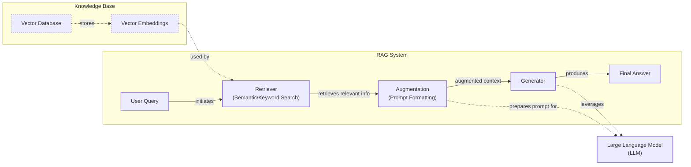
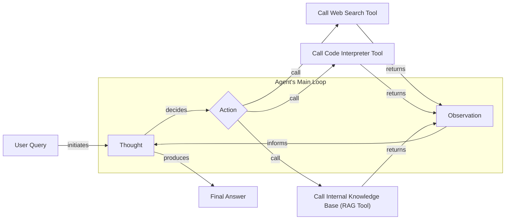

# Lesson 9: Retrieval-Augmented Generation

In our course so far, we have explored the landscape of AI Engineering, distinguished between LLM workflows and agents, and in Lesson 3, we covered Context Engineering—the art of managing information flow to an LLM. We have also built agents that can reason and use tools. Now, we will tackle one of the most critical challenges in building knowledgeable AI systems: giving them access to information beyond their training data.

LLMs are trained on a fixed dataset, which means their knowledge is static and can become outdated. When you ask an LLM a question, it is essentially taking a "closed-book exam" on the world's information as it existed at one point in time. This leads to two major problems: knowledge cutoffs and hallucinations [[1]](https://blogs.nvidia.com/blog/what-is-retrieval-augmented-generation/).

You could try to solve this by continuously fine-tuning the model with new data. However, fine-tuning is a resource-heavy and slow process. It requires curating large, high-quality datasets of question-answer pairs, which can be expensive and complex to create, especially for specialized domains [[2]](https://neo4j.com/blog/developer/fine-tuning-vs-rag/). The training jobs themselves can take days and demand powerful hardware like GPUs and TPUs, making it a costly endeavor. Furthermore, fine-tuning carries the risk of "catastrophic forgetting," where the model loses previously learned information as it adapts to new data.

Another approach is to stuff all the information into the LLM's context window. But even with massive context windows of up to two million tokens, this is not a scalable solution. It is expensive, as API costs are tied to the number of tokens processed, and it introduces significant latency. More importantly, it suffers from the "lost in the middle" problem, where the model struggles to recall information buried deep within a long prompt.

This phenomenon is not just an anecdotal failure but a well-documented positional bias. Research from Stanford, UC Berkeley, and Samaya AI in their 2023 paper, "Lost in the Middle," demonstrated a distinct U-shaped performance curve. Models are most effective at using information placed at the very beginning or end of their context window, while their accuracy plummets when critical details are buried in the middle. For example, GPT-3.5-Turbo's performance on a multi-document question-answering task dropped by over 20% when the relevant information was moved from the beginning to the middle of the context. This effect is surprisingly similar to the serial-position effect in human psychology, where we tend to remember the first (primacy) and last (recency) items in a list best [[3]](https://cs.stanford.edu/~nfliu/papers/lost-in-the-middle.arxiv2023.pdf).

Retrieval-Augmented Generation (RAG) provides a reliable solution to these challenges. RAG gives the LLM an "open-book exam" by connecting it to external, real-time knowledge sources. Instead of forcing the model to memorize everything, we give it the ability to look things up, just like a human using a cheat sheet or a procedures manual. RAG is a core technique within the discipline of Context Engineering we introduced in Lesson 3, focusing on curating the context fed to an LLM. The broad potential of this approach is why companies like AWS, IBM, Google, Microsoft, and NVIDIA are all adopting RAG to build more capable AI systems [[1]](https://blogs.nvidia.com/blog/what-is-retrieval-augmented-generation/).

This lesson will guide you through the fundamentals of RAG, from its core components to the advanced and agentic patterns used in production systems. You will learn the "what" and "how" of building RAG pipelines that make your AI applications grounded, trustworthy, and knowledgeable. We will also briefly touch on how retrieval complements an agent's memory, a topic we will explore in-depth in Lesson 10. With the problem and motivation clear, we will first decompose RAG into its core components so you can see where each responsibility lives.

## The RAG System: Core Components

Understanding the components of a RAG system is the first step in the Context Engineering process of designing effective AI applications. At a high level, RAG can be broken down into three conceptual pillars: Retrieval, Augmentation, and Generation.



Image 1: A flowchart illustrating the core components and information flow of a Retrieval Augmented Generation (RAG) system.

### Retrieval

Retrieval is the engine for finding relevant information. When a user submits a query, the retrieval system searches an external knowledge base to find documents or data snippets that are most relevant to the user's intent. The most common method for this is semantic search, which goes beyond simple keyword matching to understand the meaning behind the query.

This is made possible by vector embeddings. Vector embeddings are numerical representations of text, images, or other data, where similar concepts are located closer to each other in a high-dimensional space. During the data preparation phase, documents are split into chunks, and an embedding model like BERT converts each chunk into a dense vector where each dimension represents some aspect of the content's meaning [[4]](https://qdrant.tech/articles/what-is-rag-in-ai/), [[5]](https://tutorialsdojo.com/aws-vector-databases-explained-semantic-search-and-rag-systems/). These vectors are then stored in a specialized database called a vector database, which is optimized for fast similarity searches using nearest-neighbor algorithms [[6]](https://pub.towardsai.net/vector-databases-in-practice-building-a-realistic-hybrid-search-rag-system-with-qdrant-7b8f4a6e41e0). At query time, the user's query is also converted into a vector using the same embedding model. The system then searches the vector database to find the chunk embeddings that are "closest" to the query embedding, typically using a distance metric like cosine similarity [[7]](https://towardsdatascience.com/rag-explained-understanding-embeddings-similarity-and-retrieval/).

### Augmentation

Augmentation is the process of taking the retrieved information and preparing it for the LLM. Once the top-k most relevant chunks are identified, they are combined with the original user query to form an "augmented prompt."

This step is a form of prompt engineering. The goal is to structure the prompt in a way that clearly separates the user's question from the retrieved context. A common practice is to use a template that instructs the LLM to use the provided information to answer the question. For example, the prompt might look something like this: "Using the context below, answer the question. If the context does not contain the answer, say so. CONTEXT: <retrieved document excerpts> QUESTION: <user query>" [[8]](https://www.topquadrant.com/resources/blog-retrieval-augmented-generation-explained/). This integration layer creates a new, context-rich prompt that guides the LLM to generate a response grounded in the external data [[9]](https://www.ibm.com/think/topics/retrieval-augmented-generation). This ensures the model gives weight to the retrieved context and helps prevent it from relying on its internal, potentially outdated knowledge.

### Generation

Generation is the final step, where the LLM uses the augmented prompt to produce a response. The model synthesizes the information from the retrieved chunks to generate an answer that is grounded in the provided data. Because the answer is based on specific, citable sources, this process significantly reduces the risk of hallucination and increases user trust.

The generated response can also be formatted to include citations that link back to the original source documents, allowing users to verify the information for themselves. This traceability is a key advantage of RAG over other methods. As we covered in Lesson 4, using structured outputs is crucial here to ensure the final answer is consistent, machine-readable, and includes all necessary metadata like citations.

Now that you can name each moving part, let’s see how they line up across the two phases of a real system.

## The RAG Pipeline: Ingestion and Retrieval

The end-to-end RAG workflow can be divided into two distinct phases: an offline ingestion and indexing phase, where the knowledge base is prepared, and an online retrieval and generation phase, where user queries are answered in real-time.

```mermaid
flowchart LR
  %% Shared Components
  embedding_model["Embedding Model"]
  vector_database["Vector Database"]

  %% Offline Ingestion & Indexing Phase
  subgraph "Offline Ingestion & Indexing"
    raw_docs["Raw Documents<br/>(various sources)"] --> doc_loader["Document Loader & Preprocessing"]
    doc_loader --> text_splitter["Text Splitter & Chunking"]
    text_splitter -- "processed text" --> embedding_model
    embedding_model -- "creates" --> embeddings["Embeddings"]
    embeddings -- "for Indexing & Storage" --> vector_database
  end

  %% Online Retrieval & Generation Phase
  subgraph "Online Retrieval & Generation"
    user_query["User Query"] --> embedding_model
    embedding_model -- "for Query Vectorization" --> query_vector["Query Vector"]
    query_vector --> vector_database
    vector_database -- "Similarity Search" --> top_k_chunks["Top-K Chunks"]
    top_k_chunks --> reranking["Re-ranking & Filtering"]
    reranking --> prompt_builder["Contextual Prompt Builder"]
    prompt_builder -- "contextual prompt" --> llm["Large Language Model (LLM)<br/>(Response Generation)"]
    llm -- "generates" --> final_response["Final Response"]
  end

  %% Visual grouping
  classDef process_step fill:#e0f7fa,stroke:#00796b,stroke-width:1px
  classDef data_artifact fill:#fffde7,stroke:#fbc02d,stroke-width:1px
  classDef model_component fill:#e8f5e9,stroke:#388e3c,stroke-width:1px

  class raw_docs,user_query,embeddings,query_vector,top_k_chunks,final_response data_artifact
  class doc_loader,text_splitter,reranking,prompt_builder process_step
  class embedding_model,llm model_component
  class vector_database process_step
```



Image 2: A detailed Mermaid diagram depicting the end-to-end RAG workflow, clearly separating the offline ingestion and indexing phase from the online retrieval and generation phase.

### Phase 1: Offline Ingestion & Indexing

This phase is all about preparing your data to be searchable. It is a multi-step process that you run before your application is live, and you repeat it whenever your knowledge base needs to be updated [[10]](https://newsletter.systemdesign.one/p/how-rag-works).

1.  **Load:** The first step is to load your documents. These can come from various sources, such as PDFs, websites, databases, or APIs. The main challenge here is handling diverse formats and extracting clean text. Tools like Unstructured, LangChain's document loaders, and LlamaIndex's readers are commonly used for this purpose [[11]](https://medium.com/@derrickryangiggs/rag-pipeline-deep-dive-ingestion-chunking-embedding-and-vector-search-abd3c8bfc177).
2.  **Split:** Once the documents are loaded, they are broken down into smaller, more manageable pieces called chunks. This is a crucial step because you want each chunk to be a semantically meaningful unit of information. Simply splitting by a fixed number of characters can cut a sentence or idea in half, which hurts retrieval quality. More advanced strategies use recursive character splitting, which respects paragraph and sentence boundaries, or even semantic chunking, which splits text based on topic shifts.
3.  **Embed:** Next, each chunk is converted into a vector embedding using an embedding model. These models, such as OpenAI's `text-embedding-3-small`, Google's `text-embedding-004`, or open-source variants from Hugging Face, are trained to capture the semantic meaning of text in a dense vector. The choice of embedding model can have a significant impact on the quality of your retrieval system. For specialized domains like legal or medical text, domain-specific embeddings often outperform general-purpose ones [[12]](https://47billion.com/blog/rag-system-in-production-why-it-fails-and-how-to-fix-it/).
4.  **Store:** Finally, the embeddings and their corresponding text chunks are stored in a vector database. This database indexes the vectors for efficient similarity search. Popular options range from local libraries like FAISS for quick prototyping to scalable, production-ready solutions like Milvus, Qdrant, Pinecone, and vector search capabilities in traditional search engines like Elasticsearch [[12]](https://47billion.com/blog/rag-system-in-production-why-it-fails-and-how-to-fix-it/).

Here is a simple example of how you might implement a basic RAG pipeline using Python and LangChain to query a document.

1. First, we load a document, split it, and store it in a vector database.
    ```python
    from langchain.vectorstores import Qdrant
    from langchain.embeddings import OpenAIEmbeddings
    from langchain_community.document_loaders import BSHTMLLoader
    from langchain.text_splitter import RecursiveCharacterTextSplitter

    # Load text from a source
    loader = BSHTMLLoader("source_document.html", open_encoding='ISO-8859-1')
    documents = loader.load()

    # Split the document into chunks
    text_splitter = RecursiveCharacterTextSplitter(chunk_size=1000, chunk_overlap=100)
    texts = text_splitter.split_documents(documents)

    # Initialize embeddings and store in Qdrant
    embeddings = OpenAIEmbeddings()
    doc_store = Qdrant.from_documents(
        texts,
        embeddings,
        location=":memory:",
        collection_name="docs",
    )
    ```
    It outputs:

### Phase 2: Online Retrieval & Generation

This phase happens in real-time, whenever a user interacts with your application.

1.  **Query:** The process starts when a user asks a question. This query can be pre-processed to normalize it or expand it with additional context, but at its core, it is the input that drives the retrieval process.
2.  **Embed:** The user's query is then converted into a vector using the exact same embedding model that was used during the ingestion phase. This is critical to ensure that the query and the document chunks are in the same vector space, allowing for a meaningful comparison.
3.  **Search:** The query vector is used to search the vector database. The database performs a similarity search (e.g., cosine similarity) to find the top-k most similar document chunks. This step leverages the power of the indexed vectors to quickly find content that is semantically related to the query, even if the exact keywords are not present.
4.  **Generate:** The retrieved chunks are then used to augment the user's query in a prompt that is sent to an LLM. As we discussed in Lesson 4, you can use structured outputs to format the final answer, ensuring it is consistent and easy to parse. A well-designed prompt will instruct the LLM to synthesize the information from the chunks and generate a grounded answer, complete with citations pointing back to the source documents.

Continuing our example, here is how you would query the system.

1. We define a question and use a `RetrievalQA` chain to handle the retrieval and generation steps.
    ```python
    from langchain.chains import RetrievalQA
    from langchain import OpenAI

    question = "What are the main themes in War and Peace?"
    llm = OpenAI()
    qa = RetrievalQA.from_chain_type(
        llm=llm,
        chain_type="stuff",
        retriever=doc_store.as_retriever(),
        return_source_documents=False,
    )

    result = qa(question)
    print(f"Answer: {result}")
    ```
    It outputs:

For production systems, verifiability is non-negotiable. The format of your citations directly impacts grounding effectiveness. You must ensure the way you mark up documents in the context (e.g., `[Document 1]: ...`) matches the citation format you ask for in the output. Using structured formats like XML tags or clear delimiters helps the model distinguish document boundaries and reduces citation errors. This isn't just about formatting; it's about building a traceable chain of evidence from the generated claim back to the source text [[13]](https://mbrenndoerfer.com/writing/rag-prompt-engineering-context-citations).

With the end-to-end path in place, the next question is quality: what are the advanced techniques to make the retrieval more accurate and useful across messy, real-world data?

## Advanced RAG Techniques

While the vanilla RAG pipeline is a good starting point, production-grade systems often require more sophisticated techniques to achieve high accuracy. These advanced methods address the limitations of simple semantic search and help the system handle complex, real-world data.

```mermaid
flowchart LR
  %% Start
  A["User Query"]

  %% Retrieval Paths
  subgraph "Dense Retrieval (Semantic Matching)"
    B["Embedding Model"]
    C["Query Vector"]
    D["Semantic Search"]
    E[("Vector Database")]
    F["Dense Scores"]
  end

  subgraph "Sparse Retrieval (Keyword Matching)"
    G["Tokenizer & Stemmer"]
    H["Keyword Match"]
    I["Keyword Search"]
    J[("Keyword Index")]
    K["Sparse Scores"]
  end

  %% Hybrid Fusion and LLM
  subgraph "Hybrid Fusion & Response Generation"
    L["Hybrid Fusion<br/>(Normalization, Weighted Combination, Re-ranking)"]
    M["Final Ranked Results"]
    N["Context"]
    O["LLM"]
    P["Response"]
  end

  %% Connections
  A -- "processed by" --> B
  B -- "generates" --> C
  C -- "used for" --> D
  D -- "queries" --> E
  E -- "returns" --> F

  A -- "processed by" --> G
  G -- "generates" --> H
  H -- "used for" --> I
  I -- "queries" --> J
  J -- "returns" --> K

  F -- "input to" --> L
  K -- "input to" --> L

  L -- "produces" --> M
  M -- "provides" --> N
  N -- "input to" --> O
  O -- "generates" --> P

  %% Visual grouping
  classDef processNode stroke-width:2px
  class B,D,G,I,L,O processNode

  classDef dataNode stroke-dasharray:3,3
  class C,F,H,K,M,N dataNode
```



Image 3: Mermaid diagram illustrating the hybrid retrieval flow.

### Hybrid Search

Hybrid search combines the strengths of traditional keyword-based search (like BM25) with modern vector search. Keyword search excels at finding exact matches for specific terms, acronyms, or IDs, while vector search is better at understanding the semantic meaning and context of a query.

For example, in a customer support scenario, if a user writes "my bill keeps rolling over," a keyword search will find articles containing the exact term "rollover." A semantic search, on the other hand, might surface guides about "carryover balance," capturing the user's intent even with different phrasing. By combining both, you get a more comprehensive set of results [[14]](https://mlpills.substack.com/p/issue-76-optimize-rag-with-hybrid). The results from both searches are typically combined using a fusion technique like Reciprocal Rank Fusion (RRF) and then re-ranked to produce a final, more relevant set of documents.

However, hybrid search is not a silver bullet, especially with ambiguous enterprise queries. It can fail if the user's vocabulary doesn't match the document (e.g., "annual leave" vs. "vacation policy") or when exact identifiers like product codes are missed by the semantic search component and keyword search lacks context. Without proper tuning and domain-specific optimization, hybrid systems can inherit the weaknesses of both methods [[15]](https://wearefram.com/blog/enterprise-rag/).

### Re-ranking

Re-ranking introduces a second stage to the retrieval process to improve the relevance of the retrieved documents. After an initial retrieval step fetches a larger set of candidate documents (e.g., the top 50-100), a more powerful but slower model, called a re-ranker, is used to score and re-order these candidates.

Unlike the initial retrieval, which compares the query and documents independently, re-rankers like cross-encoders process the query and each document together. This allows for a deeper, more contextual assessment of relevance [[16]](https://redis.io/blog/10-techniques-to-improve-rag-accuracy/). For a query like "how to connect my account," a re-ranker can prioritize a step-by-step guide over a press release that happens to mention similar keywords, ensuring the most useful information is at the top. Production systems often use models like Cohere Rerank or open-source BGE Reranker models for this step [[12]](https://47billion.com/blog/rag-system-in-production-why-it-fails-and-how-to-fix-it/).

### Query Transformations

Sometimes, the user's original query is not the best one for retrieval. Query transformation techniques modify the query to improve its chances of finding the right information.

-   **Decomposition:** This technique breaks down a complex, multi-part question into several smaller, simpler sub-queries. For example, the question "What’s our travel policy for conferences in Europe this year?" could be decomposed into "What is the travel policy?", "What are the rules for conferences?", and "What are the specific rules for Europe in 2024?". The system retrieves documents for each sub-query and then synthesizes the results to form a comprehensive answer [[17]](https://docs.nvidia.com/rag/latest/query_decomposition.html).
-   **Hypothetical Document Embeddings (HyDE):** HyDE takes a creative approach by first asking an LLM to generate a hypothetical, ideal answer to the user's query. This hypothetical document is then converted into an embedding and used for the search. The idea is that this "perfect" answer is more likely to be semantically similar to the actual relevant documents than the original, often short and ambiguous, query [[18]](https://47billion.com/blog/rag-system-in-production-why-it-fails-and-how-to-fix-it/). While effective, this hypothetical step comes at a significant performance cost. Benchmarks on large-scale datasets have shown that HyDE can increase query latency by over 40%, making it a trade-off between retrieval quality for ambiguous queries and the speed required for real-time applications [[19]](https://arxiv.org/pdf/2506.21568).

### Advanced Chunking Strategies

The way you split your documents into chunks has a massive impact on retrieval quality. Moving beyond naive fixed-size chunking is one of the most effective ways to improve your RAG system.

-   **Semantic Chunking:** Instead of splitting by a fixed number of tokens, semantic chunking splits the text based on topic shifts. It uses embeddings to measure the semantic distance between sentences and creates a new chunk when the topic changes. This ensures that each chunk is a coherent, self-contained unit of information [[20]](https://sarthakai.substack.com/p/improve-your-rag-accuracy-with-a).
-   **Layout-Aware Chunking:** For documents with complex structures like PDFs, financial reports, or scientific papers, layout-aware chunking is essential. This method parses the document to identify structural elements like headers, tables, lists, and figures, and then chunks the document intelligently around these boundaries. For example, it ensures that a table and its title are kept together, preventing context loss [[20]](https://sarthakai.substack.com/p/improve-your-rag-accuracy-with-a).
-   **Context-Enriched Chunking:** This technique, also known as contextual retrieval, adds a summary of the surrounding context to each chunk before embedding it. For a sentence like "The company's revenue grew by 3%," the context might add "This chunk is from an SEC filing on ACME corp's performance in Q2 2023." This extra information makes the chunk's embedding more precise and easier to retrieve accurately.
-   **Parent Document Retrieval (Hierarchical Chunking):** This strategy directly addresses the tension between retrieval precision and generation context. It involves indexing small, precise child chunks (like a single paragraph) but linking them to their larger parent document (like a full page or section). At query time, the system fetches the specific child chunk but provides the entire parent chunk to the LLM. This gives you the best of both worlds: the targeted accuracy of small chunks for search and the complete context of a larger document for generation [[12]](https://47billion.com/blog/rag-system-in-production-why-it-fails-and-how-to-fix-it/). In a case study by 47Billion on university presentation content, this hierarchical approach improved answer accuracy from 61% with fixed-size chunking to 89% [[12]](https://47billion.com/blog/rag-system-in-production-why-it-fails-and-how-to-fix-it/).

### GraphRAG

GraphRAG introduces a powerful new dimension to retrieval by using knowledge graphs. Instead of treating documents as isolated chunks of text, GraphRAG extracts entities and their relationships to build a structured graph of the knowledge base. This approach excels at answering multi-hop questions that require reasoning across multiple documents or data points [[21]](https://arxiv.org/html/2601.03014v1).

For example, to answer "Which shoes get the most size-related returns and were featured in last month’s ads?", a GraphRAG system can traverse the graph from "returns" to "sizing issues," connect to specific shoe models, and then link those models to the "marketing calendar," pulling together information that would be scattered and disconnected in a standard vector search. However, this power comes with computational trade-offs. Building and maintaining the graph is more complex than a simple vector index, and for large, static datasets, the pre-computation of summaries can be slow and resource-intensive [[22]](https://www.techment.com/blogs/rag-optimization-techniques-production-ai/). The real advantage emerges with dynamic data. Systems like Zep AI's Graphiti use a temporally-aware knowledge graph that can be updated incrementally in real-time, avoiding the need to recompute the entire graph when new information arrives [[23]](https://neo4j.com/blog/developer/graphiti-knowledge-graph-memory/).

### Metadata Filtering

One of the most practical and powerful techniques in production is metadata filtering. When documents are chunked, you can attach metadata to each chunk, such as the source document, creation date, author, department, or policy version. During retrieval, you can use this metadata to pre-filter the search space before performing the vector search.

This is especially useful for handling temporal queries. If a user asks, "What changed between March and June 2025?", you can filter for chunks with an `effective_date` within that range. This drastically narrows down the search and improves the relevance of the results. You can even implement bitemporal logic, filtering by both the `effective_date` (when the information was valid) and the `indexed_at` date (when it was added to the system) to manage evolving and historical data accurately. For example, some advanced knowledge graphs implement this by attaching explicit validity intervals (e.g., `t_valid`, `t_invalid`) to every relationship, allowing the system to reconstruct the state of knowledge at any point in time and resolve version conflicts without discarding historical data [[23]](https://neo4j.com/blog/developer/graphiti-knowledge-graph-memory/).

These techniques increase retrieval quality. Next, we’ll see how retrieval becomes one tool that an agent can choose to use as it reasons.

## Agentic RAG

In Lessons 7 and 8, we explored the ReAct framework, where an agent cycles through Thought, Action, and Observation to solve problems. Agentic RAG is the application of this framework to information retrieval. It transforms RAG from a rigid, linear pipeline into an adaptive, iterative process where a ReAct-style agent is equipped with a retrieval tool.

The agent's toolkit can include many tools, such as web search, code execution, or database queries. The RAG tool, which accesses your internal knowledge base, is just one of these. This framing is important—labeling an entire system "agentic RAG" can be too narrow. It is more accurate to think of it as an agent that *uses* RAG.



Image 4: A conceptual Mermaid diagram illustrating an agent's main loop, demonstrating its iterative reasoning and ability to choose between various tools.

### Standard RAG vs. Agentic RAG

The core distinction lies in the control flow.

-   **Standard RAG** is a pre-determined, linear workflow: Retrieve → Augment → Generate. Every query follows this exact path. It is powerful but inflexible. If the initial retrieval fails to find the right information, the system has no way to recover [[24]](https://towardsdatascience.com/agentic-rag-vs-classic-rag-from-a-pipeline-to-a-control-loop/).
-   **Agentic RAG** is an adaptive control loop. The agent decides *when* to retrieve, *what* to search for, *which* source to use, and whether one retrieval is enough. It can reason about the information it finds and dynamically adjust its strategy [[25]](https://www.pingcap.com/article/agentic-rag-vs-traditional-rag-key-differences-benefits/).

### Capabilities of an Agentic Approach

This shift from a fixed pipeline to an agent-driven loop unlocks several powerful capabilities:

-   **Iterative Retrieval:** The agent can use the RAG tool multiple times, refining its query at each step. For instance, an initial query might return a vague policy document. The agent can then generate a more specific query, like "search for policy section on EU customers, 2024 updates," and retrieve again to find the precise details.
-   **Tool Selection:** An agent can choose the right tool for the job. If a query is about a recent public event, it might use a web search tool. If it is about an internal system failure, it will query the incident runbooks via its RAG tool.
-   **Information Fusion:** The agent can combine information from multiple sources. It might retrieve an internal policy using the RAG tool, then use a web search to check for recent regulatory changes, and finally synthesize both pieces of information into a comprehensive answer.
-   **Self-Correction and Reduced Hallucination:** The agent's reasoning loop is also a self-critique mechanism. After a retrieval step, the agent can evaluate the relevance of the information. If the retrieved documents are insufficient or contradictory, it can choose to rewrite its query and try again. This iterative refinement process, sometimes called a reflection pattern, allows the agent to double-check its sources and correct its course, which directly reduces the risk of generating a confident but incorrect answer [[26]](https://wandb.ai/wandb_fc/genai-research/reports/Agentic-RAG-Revolutionizing-AI-with-autonomous-retrieval--VmlldzoxNDIzMjA0MQ).
-   **Knowledge Base Updates:** An agent can even identify gaps or outdated information in the knowledge base and propose updates. This moves toward a system that not only consumes knowledge but also helps maintain it. We will explore this further in Lesson 10 when we discuss memory for agents.

Here is a conceptual thought process for an agent handling a complex query:

**Thought:** "The user is asking about '2024 EU data retention rules.' Our internal policy documents cite the 2023 version. This information is likely outdated."

**Action:** `retrieve(internal_policy, query="EU data retention 2024")`

**Observation:** "The retrieved document mentions amendments but lacks specific citations for the 2024 changes."

**Thought:** "I need to verify this externally."

**Action:** `web_search(query="official EU data retention directive 2024")`

**Observation:** "Found the official directive update on the EU's website."

**Thought:** "Now I can synthesize the internal policy with the official external update, highlight the changes from 2023, and cite both sources."

This is the difference between a simple database lookup and a conversation with a knowledgeable research assistant. The agent does not just fetch data; it reasons about it, verifies it, and synthesizes it to provide a trustworthy answer.

You now understand both a linear RAG pipeline and how an agent can control retrieval when needed. Let’s wrap up by situating RAG in the wider AI Engineering toolkit and previewing what comes next.

## Conclusion

In this lesson, we have journeyed from the fundamental limitations of LLMs to the sophisticated, agent-driven systems that represent the future of information retrieval. We have established that RAG is the most effective solution to the LLM knowledge problem, providing a way to ground models in factual, up-to-date, and proprietary data. For any AI Engineer, building production-grade quality requires moving beyond naive RAG and embracing advanced techniques like hybrid search, re-ranking, and GraphRAG. The future of knowledge retrieval is agentic, where RAG is not just a pipeline but a dynamic tool wielded by an intelligent agent.

The core benefits of this approach are clear: RAG reduces hallucinations, enables deep customization with private data, and builds user trust by providing verifiable, source-backed answers. These qualities are not just desirable; they are essential in high-stakes domains like healthcare and legal tech, where compliance, liability, and the cost of being wrong demand auditable, evidence-based AI systems [[27]](https://thescimus.com/blog/retrieval-augmented-generation-healthcare-guide/). It is not a niche skill but a foundational competency for the modern AI Engineer, and a critical component of the broader discipline of Context Engineering.

This lesson has set the stage for understanding how agents access external knowledge on demand. In our next lesson, we will explore a complementary concept: Memory for Agents. We will look at how short-term and long-term memory systems allow agents to retain information across interactions, learn from experience, and build a persistent understanding of their environment. While RAG provides the "open-book" for an exam, memory gives the agent the ability to remember what it has learned from previous exams. We will also touch on other important topics later in the course, such as how to build robust evaluation pipelines to measure retrieval quality and how to monitor these systems in production.

## References

- [1] [What Is Retrieval-Augmented Generation, aka RAG?](https://blogs.nvidia.com/blog/what-is-retrieval-augmented-generation/)
- [2] [Knowledge Graphs and LLMs: Fine-Tuning vs. Retrieval-Augmented Generation](https://neo4j.com/blog/developer/fine-tuning-vs-rag/)
- [3] [Lost in the Middle: How Language Models Use Long Contexts](https://cs.stanford.edu/~nfliu/papers/lost-in-the-middle.arxiv2023.pdf)
- [4] [What is RAG in AI?](https://qdrant.tech/articles/what-is-rag-in-ai/)
- [5] [AWS Vector Databases Explained: Semantic Search and RAG Systems](https://tutorialsdojo.com/aws-vector-databases-explained-semantic-search-and-rag-systems/)
- [6] [Vector Databases in Practice: Building a Realistic Hybrid Search RAG System with Qdrant](https://pub.towardsai.net/vector-databases-in-practice-building-a-realistic-hybrid-search-rag-system-with-qdrant-7b8f4a6e41e0)
- [7] [RAG Explained: Understanding Embeddings, Similarity, and Retrieval](https://towardsdatascience.com/rag-explained-understanding-embeddings-similarity-and-retrieval/)
- [8] [Retrieval-Augmented Generation Explained](https://www.topquadrant.com/resources/blog-retrieval-augmented-generation-explained/)
- [9] [What is retrieval-augmented generation?](https://www.ibm.com/think/topics/retrieval-augmented-generation)
- [10] [How RAG Works](https://newsletter.systemdesign.one/p/how-rag-works)
- [11] [RAG Pipeline Deep Dive: Ingestion, Chunking, Embedding, and Vector Search](https://medium.com/@derrickryangiggs/rag-pipeline-deep-dive-ingestion-chunking-embedding-and-vector-search-abd3c8bfc177)
- [12] [RAG System in Production: Why It Fails and How to Fix It](https://47billion.com/blog/rag-system-in-production-why-it-fails-and-how-to-fix-it/)
- [13] [RAG Prompt Engineering: Context & Citations](https://mbrenndoerfer.com/writing/rag-prompt-engineering-context-citations)
- [14] [Optimize RAG with Hybrid Search](https://mlpills.substack.com/p/issue-76-optimize-rag-with-hybrid)
- [15] [Enterprise RAG: A Practical Guide to Production Systems](https://wearefram.com/blog/enterprise-rag/)
- [16] [10 Techniques to Improve RAG Accuracy](https://redis.io/blog/10-techniques-to-improve-rag-accuracy/)
- [17] [Query Decomposition](https://docs.nvidia.com/rag/latest/query_decomposition.html)
- [18] [RAG System in Production: Why It Fails and How to Fix It](https://47billion.com/blog/rag-system-in-production-why-it-fails-and-how-to-fix-it/)
- [19] [Latency and Hallucination Trade-offs in Hypothesis-Driven RAG](https://arxiv.org/pdf/2506.21568)
- [20] [Improve Your RAG Accuracy With A Smarter Chunking Strategy](https://sarthakai.substack.com/p/improve-your-rag-accuracy-with-a)
- [21] [GraphRAG: A Graph-Based Approach to Retrieval-Augmented Generation](https://arxiv.org/html/2601.03014v1)
- [22] [RAG Optimization Techniques for Production AI](https://www.techment.com/blogs/rag-optimization-techniques-production-ai/)
- [23] [Graphiti: Knowledge Graph Memory for an Agentic World](https://neo4j.com/blog/developer/graphiti-knowledge-graph-memory/)
- [24] [Agentic RAG vs Classic RAG: From a Pipeline to a Control Loop](https://towardsdatascience.com/agentic-rag-vs-classic-rag-from-a-pipeline-to-a-control-loop/)
- [25] [Agentic RAG vs. Traditional RAG: Key Differences & Benefits](https://www.pingcap.com/article/agentic-rag-vs-traditional-rag-key-differences-benefits/)
- [26] [Agentic RAG: Revolutionizing AI with autonomous retrieval](https://wandb.ai/wandb_fc/genai-research/reports/Agentic-RAG-Revolutionizing-AI-with-autonomous-retrieval--VmlldzoxNDIzMjA0MQ)
- [27] [Retrieval-Augmented Generation in Healthcare: A Practical Guide](https://thescimus.com/blog/retrieval-augmented-generation-healthcare-guide/)