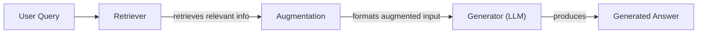
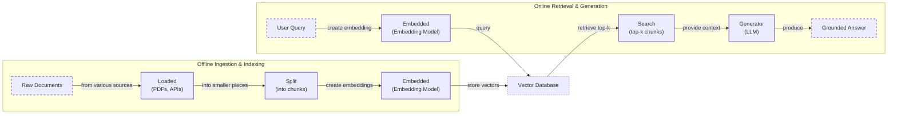
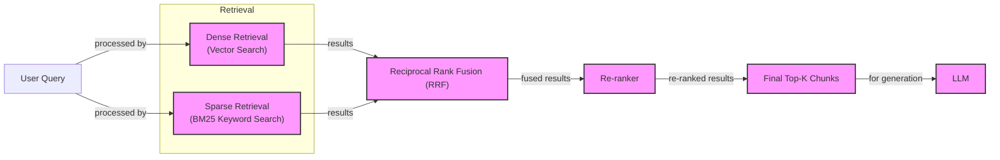

# Lesson 9: Retrieval-Augmented Generation (RAG)

In the last few lessons, we have built a solid foundation in AI Engineering. We have explored the difference between rule-based workflows and autonomous agents, learned the art of Context Engineering to manage information flow, and built a ReAct agent from scratch. We have seen how agents can reason and use tools to interact with their environment.

However, a core problem remains: Large Language Models are trained on a fixed dataset. Their knowledge is static, making them operate like a student taking a "closed-book exam" on the world's information. This limitation leads to two major issues in production systems: knowledge cutoffs, where the model is unaware of recent events, and hallucinations, where it confidently invents incorrect facts.

One common approach to inject new knowledge is fine-tuning, but this method is often impractical. It is a resource-heavy process that requires massive, carefully curated datasets and can take days or even weeks of training time. Furthermore, fine-tuning carries the risk of "catastrophic forgetting," where the model loses some of its original capabilities while learning new information. Even the expanding context windows of modern LLMs are not a silver bullet. While they can hold more information, they are still finite. Simply stuffing them with data leads to high costs, increased latency, and the "lost-in-the-middle" problem, where the model struggles to recall information buried in a long prompt [[3]](https://openreview.net/forum?id=5sB6cSblDR).

This is where Retrieval-Augmented Generation (RAG) comes in. RAG transforms the "closed-book" exam into an "open-book" one. Instead of relying solely on its memorized knowledge, the LLM is given access to external, real-time information sources at the moment it needs to answer a question. This is similar to how we, as humans, do not need to memorize everything; we use manuals, notes, and search engines to find the information we need.

RAG is a fundamental technique within the discipline of Context Engineering we covered in Lesson 3. It is the mechanism by which we select and provide the right external knowledge to the LLM. This lesson will dive deep into the "what" and "how" of RAG, starting with its core components and basic pipeline. We will then explore the advanced and agentic patterns that turn a simple RAG prototype into a production-ready system. As we will see, mastering RAG is not optional for an AI Engineer—it is a foundational skill for building agents that are grounded, trustworthy, and truly intelligent.

## The RAG System: Core Components

Before we build a full pipeline, it is essential to understand the three conceptual pillars of any RAG system. These components work together to find relevant information, prepare it for the LLM, and generate a grounded response. Understanding their distinct roles is the first step in the Context Engineering process of designing and debugging RAG applications.


Image 1: A flowchart illustrating the core components and data flow of a RAG system.

**Retrieval** is the engine of the RAG system, responsible for finding the most relevant information to answer a user's query. The dominant method for this is semantic search, which goes beyond simple keyword matching to find documents that are contextually similar in meaning. This is made possible by vector embeddings—numerical representations of text that capture its semantic essence [[51]](https://apxml.com/courses/prompt-engineering-llm-application-development/chapter-6-integrating-llms-external-data-rag/implementing-semantic-search-retrieval).

The process begins by converting chunks of text from your knowledge base into these high-dimensional vectors using an embedding model. These vectors are then stored and indexed in a specialized vector database. When a user submits a query, it is converted into a vector using the same embedding model. The system then searches the database to find the text chunks whose vectors are closest to the query vector, typically using a distance metric like cosine similarity [[52]](https://medium.com/@robi.tomar72/how-rag-actually-works-embeddings-vector-databases-indexing-retrieval-explained-simply-3d1ca45fe1bf), [[54]](https://towardsdatascience.com/rag-explained-understanding-embeddings-similarity-and-retrieval/). These closest chunks are considered the most semantically relevant.

**Augmentation** is the process of taking the retrieved information and preparing it for the LLM. This is the "augmented" part of RAG. The system constructs a new, enriched prompt that combines the original user query with the content of the retrieved document chunks. This is a critical step in prompt engineering, as the structure of this augmented prompt heavily influences the quality of the final answer [[56]](https://www.topquadrant.com/resources/blog-retrieval-augmented-generation-explained/). A typical template might look like this: "Using the context below, answer the following question. If the context does not contain the answer, say so. Context: <retrieved document excerpts>. Question: <user query>."

**Generation** is the final step where the LLM produces an answer. The model receives the augmented prompt and synthesizes the information from the retrieved context to generate a response that is grounded in the provided data [[27]](https://www.aimon.ai/posts/rag_and_its_different_components/). Instead of relying on its static, internal knowledge, the LLM's primary task becomes reasoning over the new information given to it. This process significantly reduces the likelihood of hallucinations and allows the model to provide accurate, up-to-date answers that can cite their sources [[1]](https://neo4j.com/blog/developer/fine-tuning-vs-rag/), [[22]](https://www.mindstudio.ai/blog/what-is-rag/what-is-rag/).

Now that you can name each moving part, let’s see how they line up across the two phases of a real system.

## The RAG Pipeline: Ingestion and Retrieval

A production-grade RAG system operates in two distinct phases: an offline ingestion pipeline that prepares the knowledge base, and an online retrieval pipeline that answers user queries in real-time. Understanding this separation is key to building scalable and maintainable systems.


Image 2: A detailed Mermaid diagram showing the two distinct phases of a RAG pipeline: Offline Ingestion & Indexing and Online Retrieval & Generation.

### Phase 1: Offline Ingestion & Indexing

This is the preparatory phase where you process your knowledge base. It runs asynchronously, before any user interaction, and only needs to be re-run when your source documents change [[32]](https://newsletter.systemdesign.one/p/how-rag-works). The pipeline consists of four main steps:

1.  **Load:** The first step is to load your data from its original source. Documents can come in many formats and from various locations, such as PDFs on a local file system, pages from a Confluence wiki, or records from a database. Tools like LlamaIndex Data Connectors or LangChain Document Loaders provide a unified interface to handle this diversity of sources. The main challenge here is extracting clean text, especially from complex formats like PDFs with tables and images [[31]](https://medium.com/@derrickryangiggs/rag-pipeline-deep-dive-ingestion-chunking-embedding-and-vector-search-abd3c8bfc177).

2.  **Split:** Once loaded, large documents are broken down into smaller "chunks." This is one of the most critical steps, as the quality of your chunks directly impacts retrieval performance. If chunks are too large, they may contain irrelevant noise; if they are too small, they may lack sufficient context. A common starting point is using a `RecursiveCharacterTextSplitter`, which tries to split text along natural boundaries like paragraphs and sentences [[jina-scraped-1.md]](https://47billion.com/blog/rag-system-in-production-why-it-fails-and-how-to-fix-it/).

3.  **Embed:** Each chunk of text is then converted into a vector embedding. This is done using a pre-trained embedding model. Popular choices include OpenAI's `text-embedding-3-large`, Google's `text-embedding-004`, or open-source models like BGE variants available on Hugging Face. The choice of model is important, as it determines the quality of the semantic representation.

4.  **Store:** Finally, the embeddings and their corresponding text chunks (along with any metadata) are loaded into a vector database. This database is optimized for efficient similarity search. Popular options range from lightweight, in-memory libraries like FAISS for smaller projects to scalable, dedicated databases like Milvus, Qdrant, or Pinecone for production applications [[53]](https://learnopencv.com/vector-db-and-rag-pipeline-for-document-rag/).

### Phase 2: Online Retrieval & Generation

This phase happens in real-time, triggered by a user's query [[31]](https://medium.com/@derrickryangiggs/rag-pipeline-deep-dive-ingestion-chunking-embedding-and-vector-search-abd3c8bfc177).

1.  **Query:** The user submits a query. This query can undergo optional preprocessing steps like normalization or expansion to improve its chances of matching relevant documents.

2.  **Embed:** The user's query is converted into a vector using the *same embedding model* used during the ingestion phase. This is crucial to ensure that the query and the document chunks exist in the same vector space, making their comparison meaningful [[51]](https://apxml.com/courses/prompt-engineering-llm-application-development/chapter-6-integrating-llms-external-data-rag/implementing-semantic-search-retrieval).

3.  **Search:** The query vector is used to search the vector database. The database performs a similarity search (e.g., using cosine similarity) to find the `top-k` document chunks whose embeddings are most similar to the query embedding. These chunks are considered the most relevant context.

4.  **Generate:** The retrieved chunks are assembled into a prompt along with the original user query and a set of instructions. This augmented prompt is then passed to an LLM, which generates a final, grounded answer. To ensure traceability, the answer can be formatted to include citations that link back to the source documents, a technique we discussed in Lesson 4 on Structured Outputs.

This naive pipeline provides a solid foundation. However, to build a system that performs reliably with messy, real-world data, you need to move beyond the basics.

## Advanced RAG Techniques

A naive RAG pipeline is a great starting point, but production systems often face challenges that require more sophisticated solutions. Issues like vocabulary mismatch, irrelevant retrieval, and fragmented context can degrade answer quality. Advanced RAG techniques are designed to address these failure modes by improving the precision and relevance of what the LLM sees.


Image 3: A flowchart illustrating the hybrid retrieval process from user query to LLM generation.

### Hybrid Search

Pure vector search excels at understanding semantic meaning but can fail when queries involve specific keywords, product codes, or acronyms. For example, a search for "Error code TS-999" might return general documents about errors instead of the specific one. On the other hand, traditional keyword search (like BM25) is great at finding exact matches but lacks semantic understanding [[36]](https://pr-peri.github.io/blogpost/2026/03/05/blogpost-hybrid-search.html).

**Hybrid search** combines the strengths of both. It runs a dense (vector) search and a sparse (keyword) search in parallel and then merges the results [[38]](https://mlpills.substack.com/p/issue-76-optimize-rag-with-hybrid). A common merging technique is Reciprocal Rank Fusion (RRF), which scores results based on their rank in each list, providing a balanced final ranking. This ensures you get both semantically related documents and those containing precise keywords [[jina-scraped-2.md]](https://neo4j.com/blog/genai/advanced-rag-techniques/).

### Re-ranking

The initial retrieval step is optimized for speed and recall, meaning it might return a broad set of candidate documents, some of which may not be highly relevant. A **re-ranker** is a second, more precise model that re-orders this initial set of documents. Unlike the initial retrieval which compares the query and documents independently (bi-encoder), a re-ranker (often a cross-encoder) processes the query and each document *together* [[42]](https://redis.io/blog/10-techniques-to-improve-rag-accuracy/), [[43]](https://apxml.com/courses/optimizing-rag-for-production/chapter-2-advanced-retrieval-optimization/reranking-architectures-rag). This allows for a deeper, more contextual assessment of relevance, pushing the most important documents to the top. For instance, in a product help scenario, a re-ranker would prioritize a step-by-step setup guide over a tangentially related press release.

### Query Transformations

Sometimes, the user's query isn't the best input for retrieval. Query transformation techniques rewrite or expand the query to improve its chances of matching the right documents.

*   **Decomposition:** This technique breaks down a complex, multi-part question into several simpler sub-queries. For example, the query "What’s our travel policy for conferences in Europe this year?" could be decomposed into: "What is the travel policy?", "What are the rules for conferences?", and "Are there specific rules for Europe in 2024?". Each sub-query is executed independently, and the results are merged to provide a comprehensive context for the final answer [[19]](https://docs.nvidia.com/rag/latest/query_decomposition.html).

*   **Hypothetical Document Embeddings (HyDE):** This method addresses the "phrasing gap" between questions and answers. Instead of embedding the user's query directly, an LLM is first used to generate a hypothetical, ideal answer. This hypothetical document is then embedded and used for the similarity search. The idea is that an answer is more likely to be semantically similar to other answers. For a query about travel policy, the system might generate a draft like, "Employees can book economy flights for approved conferences in Europe." Searching for documents that resemble this statement helps locate the actual policy document more effectively [[16]](https://47billion.com/blog/rag-system-in-production-why-it-fails-and-how-to-fix-it/).

### Advanced Chunking Strategies

As we discussed, chunking is a delicate balance. Naive fixed-size chunking often splits documents mid-sentence or separates a table from its explanation. Advanced strategies preserve the document's inherent structure.

*   **Semantic Chunking:** This method splits text based on topic shifts. It analyzes the semantic similarity between consecutive sentences and creates a new chunk when the similarity drops below a certain threshold, ensuring that each chunk contains a single, coherent idea [[17]](https://sarthakai.substack.com/p/improve-your-rag-accuracy-with-a).
*   **Layout-Aware Chunking:** For documents like PDFs or reports with complex layouts, this strategy uses parsers to identify structural elements like headers, tables, and lists. It then chunks the document respecting these boundaries, ensuring, for example, that a table and its title remain in the same chunk [[improve-your-rag-accuracy-with-a-smarter-chunking-strategy.md]](https://sarthakai.substack.com/p/improve-your-rag-accuracy-with-a).
*   **Context-Enriched Chunking:** This approach, also known as contextual retrieval, adds a summary of the surrounding context to each chunk before embedding. For instance, a chunk might be prepended with "This chunk is from Section 3 of the Q3 earnings report, discussing operating margins." This anchors the chunk in its original context, improving retrieval precision [[introducing-contextual-retrieval.md]](https://www.anthropic.com/news/contextual-retrieval).

### GraphRAG

For questions about complex relationships and interconnected data, standard document retrieval can fall short. **GraphRAG** addresses this by first constructing a knowledge graph from the source documents, where entities (like people, companies, or products) are nodes and their relationships are edges. Instead of searching for similar text, the system can traverse this graph to answer multi-hop questions [[46]](https://arxiv.org/html/2601.03014v1). For example, to answer, "Which shoes get the most size-related returns and were featured in last month’s ads?", the system can navigate from "returns" to "sizing issues," link to specific shoe SKUs, and then connect those SKUs to the marketing campaign data. This enables reasoning across different pieces of information that would be isolated in separate document chunks [[48]](https://webhome.cs.uvic.ca/~thomo/papers/asonam2025-graphrag.pdf).

### Metadata Filtering

One of the most practical and powerful techniques in production is **metadata filtering**. When documents are ingested, they are tagged with metadata such as `source`, `creation_date`, `department`, or `policy_version`. During retrieval, you can pre-filter the search space based on this metadata before performing the vector search [[jina-scraped-2.md]](https://neo4j.com/blog/genai/advanced-rag-techniques/). For temporal queries like "What changed in our policy between March and June 2025?", you can restrict the search to documents with an `effective_date` in that range. This not only improves relevance but also significantly speeds up the search process.

These techniques transform a basic RAG pipeline into a robust, production-ready system. But we can take it one step further by giving an agent control over the retrieval process itself.

## Agentic RAG

In Lessons 7 and 8, we explored the ReAct framework, where an agent follows a `Thought -> Action -> Observation` loop to reason and interact with its environment. **Agentic RAG** is the application of this principle to information retrieval. It is essentially a ReAct-style agent equipped with one or more retrieval tools. Instead of following a fixed pipeline, the agent decides when to search, what to search for, and how to use the results.

### The Core Distinction

The fundamental difference between standard and agentic RAG lies in control and adaptability.

*   **Standard RAG** is a linear, pre-determined workflow: `Query -> Retrieve -> Augment -> Generate`. It is powerful but rigid. Every query is processed in the same way, regardless of its complexity or the quality of the initial retrieval [[agentic-rag-vs-classic-rag-from-a-pipeline-to-a-control-loop.md]](https://towardsdatascience.com/agentic-rag-vs-classic-rag-from-a-pipeline-to-a-control-loop/).
*   **Agentic RAG** is an adaptive, iterative control loop. The agent is in charge. It can reason about the user's query, choose the best tool for the job, and refine its strategy based on the information it finds. This transforms retrieval from a single-shot lookup into a dynamic, multi-step reasoning process [[11]](https://towardsdatascience.com/agentic-rag-vs-classic-rag-from-a-pipeline-to-a-control-loop/), [[12]](https://www.pingcap.com/article/agentic-rag-vs-traditional-rag-key-differences-benefits/).

```mermaid
flowchart LR
  %% Main Agent Loop
  Agent["Agent"] --> Thought["Thought"]
  Thought --> Action["Action"]

  %% Tools Subgraph
  subgraph Tools["Tools"]
    WebSearch["web_search"]
    CodeInterpreter["code_interpreter"]
    InternalKB["internal_knowledge_base<br/>(RAG tool)"]
  end

  Action -- "uses" --> WebSearch
  Action -- "uses" --> CodeInterpreter
  Action -- "uses" --> InternalKB

  WebSearch --> Observation["Observation"]
  CodeInterpreter --> Observation
  InternalKB --> Observation

  Observation --> Thought: "informs new"

  %% Visual grouping
  classDef main_step stroke-width:2px
  classDef tool_node stroke-dasharray:3,3
  class Agent,Thought,Action,Observation main_step
  class WebSearch,CodeInterpreter,InternalKB tool_node
```
Image 4: A conceptual Mermaid diagram showing an agent's main loop, including thought, action, tool usage (web_search, code_interpreter, internal_knowledge_base), and observation, leading to iterative refinement.

### Agentic Capabilities

This agent-driven approach unlocks several powerful capabilities:

*   **Iterative Refinement:** If the initial retrieval results are insufficient, the agent can autonomously decide to reformulate its query and search again. For example, if a search for "EU data retention rules" returns a vague policy, the agent might refine its thought process and try a new search for "GDPR data storage limits for EU customers 2024" [[what-is-agentic-rag-1.md]](https://www.ibm.com/think/topics/agentic-rag).

*   **Tool and Source Selection:** An agent can be given multiple retrieval tools, each connected to a different knowledge source. It can then choose the most appropriate one for a given query. For an outage inquiry, it might select the `search_incident_runbooks` tool over `search_marketing_pages` [[what-is-agentic-rag.md]](https://weaviate.io/blog/what-is-agentic-rag).

*   **Information Fusion:** The agent can combine information from its internal RAG tool with results from other tools, like a web search or a database query. For instance, it could retrieve an internal company policy on travel expenses and then use a web search tool to find current currency conversion rates before providing a final, comprehensive answer [[25]](https://www.madrona.com/rag-inventor-talks-agents-grounded-ai-and-enterprise-impact/).

This shift in perspective is profound. RAG is no longer an isolated pipeline but a fundamental tool in an agent's toolkit. During its "thought" step, the agent identifies a knowledge gap and decides to call its `internal_knowledge_base` tool. This is the essence of agentic RAG—transforming a static data lookup into a dynamic conversation with a knowledgeable research assistant.

Consider this conceptual thought process for a complex query:

**User Query:** "Our 2024 EU data retention rules seem outdated compared to the latest regulations. What's the discrepancy?"

**Agent's Thought Process:**

1.  **Thought:** The user is asking about a potential conflict between our internal policy and current external regulations. I need to check both.
2.  **Action:** `internal_knowledge_base(query="EU data retention policy 2024")`
3.  **Observation:** The internal policy mentions the 2023 directive but lacks details on the latest 2024 amendments.
4.  **Thought:** The internal document is likely outdated. I need to verify the current external regulations.
5.  **Action:** `web_search(query="Official EU data retention directive update 2024")`
6.  **Observation:** The web search returns an official EU directive with updated retention periods.
7.  **Thought:** I have both the internal policy and the new external regulation. I can now synthesize an answer that highlights the changes and provides a clear comparison.

This iterative, multi-tool approach allows the agent to handle ambiguity, verify information, and provide a much more nuanced and reliable answer than a standard RAG pipeline ever could.

You now understand both a linear RAG pipeline and how an agent can control retrieval when needed. Let’s wrap up by situating RAG in the wider AI Engineering toolkit and previewing what comes next.

## Conclusion

We have journeyed from the fundamental problem of static LLM knowledge to the sophisticated, adaptive world of agentic retrieval. RAG stands out as the most practical and widely adopted solution to ground LLMs in factual, up-to-date information. For production-grade systems, advanced techniques like hybrid search, re-ranking, and structured data retrieval are not just nice-to-haves; they are essential for achieving the required levels of accuracy and reliability. The future of knowledge retrieval is agentic, where RAG transforms from a rigid pipeline into a dynamic tool wielded by an intelligent agent.

The core benefits of this approach are clear: it dramatically reduces hallucinations, enables deep customization with proprietary data, and builds user trust by providing verifiable, source-backed answers. For these reasons, RAG is not a niche skill but a foundational competency for any AI Engineer. It is a cornerstone of the broader discipline of Context Engineering, empowering us to build applications that are not only powerful but also dependable.

In our next lesson, we will explore Memory for Agents. We will see how persistent short-term and long-term memory systems complement RAG's on-demand retrieval, allowing agents to learn from past interactions and build a more comprehensive understanding of their world. We will also touch on other critical topics later in the course, such as robust evaluation frameworks for measuring retrieval quality and monitoring these complex systems in production.

## References

- [1] [Knowledge Graphs and LLMs: Fine-Tuning vs. Retrieval-Augmented Generation](https://neo4j.com/blog/developer/fine-tuning-vs-rag/)
- [3] [Lost in the middle, and In-Between: Enhancing language models' ability to reason over long contexts in Multi-Hop QA](https://openreview.net/forum?id=5sB6cSblDR)
- [11] [Agentic RAG vs Classic RAG: From a Pipeline to a Control Loop](https://towardsdatascience.com/agentic-rag-vs-classic-rag-from-a-pipeline-to-a-control-loop/)
- [12] [Agentic RAG vs. Traditional RAG: Key Differences and Benefits](https://www.pingcap.com/article/agentic-rag-vs-traditional-rag-key-differences-benefits/)
- [16] [RAG System in Production: Why It Fails and How to Fix It](https://47billion.com/blog/rag-system-in-production-why-it-fails-and-how-to-fix-it/)
- [17] [Improve Your RAG Accuracy With A Smarter Chunking Strategy](https://sarthakai.substack.com/p/improve-your-rag-accuracy-with-a)
- [19] [Query Decomposition](https://docs.nvidia.com/rag/latest/query_decomposition.html)
- [22] [What is RAG (Retrieval-Augmented Generation)?](https://www.mindstudio.ai/blog/what-is-rag/)
- [25] [RAG Inventor Talks Agents, Grounded AI, and Enterprise Impact](https://www.madrona.com/rag-inventor-talks-agents-grounded-ai-and-enterprise-impact/)
- [27] [RAG and its different Components](https://www.aimon.ai/posts/rag_and_its_different_components/)
- [31] [RAG Pipeline Deep Dive: Ingestion, Chunking, Embedding, and Vector Search](https://medium.com/@derrickryangiggs/rag-pipeline-deep-dive-ingestion-chunking-embedding-and-vector-search-abd3c8bfc177)
- [32] [How RAG Works](https://newsletter.systemdesign.one/p/how-rag-works)
- [36] [Hybrid search is a practical necessity for production RAG](https://pr-peri.github.io/blogpost/2026/03/05/blogpost-hybrid-search.html)
- [38] [Optimize RAG with Hybrid Search](https://mlpills.substack.com/p/issue-76-optimize-rag-with-hybrid)
- [42] [10 Techniques to Improve RAG Accuracy](https://redis.io/blog/10-techniques-to-improve-rag-accuracy/)
- [43] [Reranking Architectures for RAG](https://apxml.com/courses/optimizing-rag-for-production/chapter-2-advanced-retrieval-optimization/reranking-architectures-rag)
- [46] [From Local to Global: A GraphRAG Approach to Query-Focused Summarization](https://arxiv.org/html/2601.03014v1)
- [48] [From Local to Global: A GraphRAG Approach to Query-Focused Summarization](https://webhome.cs.uvic.ca/~thomo/papers/asonam2025-graphrag.pdf)
- [51] [Implementing Semantic Search for Retrieval](https://apxml.com/courses/prompt-engineering-llm-application-development/chapter-6-integrating-llms-external-data-rag/implementing-semantic-search-retrieval)
- [52] [How RAG Actually Works: Embeddings, Vector Databases, Indexing & Retrieval Explained Simply](https://medium.com/@robi.tomar72/how-rag-actually-works-embeddings-vector-databases-indexing-retrieval-explained-simply-3d1ca45fe1bf)
- [53] [Vector DB and RAG Pipeline for Document RAG](https://learnopencv.com/vector-db-and-rag-pipeline-for-document-rag/)
- [54] [RAG Explained: Understanding Embeddings, Similarity, and Retrieval](https://towardsdatascience.com/rag-explained-understanding-embeddings-similarity-and-retrieval/)
- [56] [Retrieval-Augmented Generation (RAG) Explained](https://www.topquadrant.com/resources/blog-retrieval-augmented-generation-explained/)
- [introducing-contextual-retrieval.md](https://www.anthropic.com/news/contextual-retrieval)
- [what-is-agentic-rag-1.md](https://www.ibm.com/think/topics/agentic-rag)
- [what-is-agentic-rag.md](https://weaviate.io/blog/what-is-agentic-rag)
- [jina-scraped-2.md](https://neo4j.com/blog/genai/advanced-rag-techniques/)
- [improve-your-rag-accuracy-with-a-smarter-chunking-strategy.md](https://sarthakai.substack.com/p/improve-your-rag-accuracy-with-a)