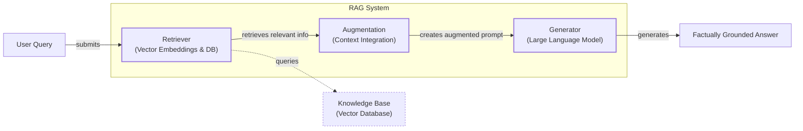
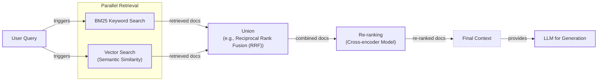
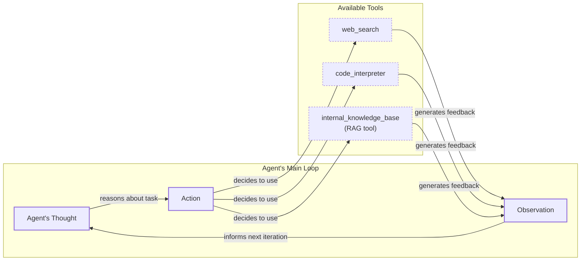

# Retrieval-Augmented Generation: The LLM's Open-Book Exam

In our previous lessons, we have explored the foundational concepts of AI Engineering. We learned about the agent landscape, the difference between LLM workflows and AI agents, and the importance of Context Engineering. As we covered in Lesson 3, context engineering is the art and science of managing the information flow to an LLM to guide its behavior and improve its performance. Now, we will explore one of the most critical techniques in an AI Engineer's toolkit: Retrieval-Augmented Generation (RAG).

LLMs are powerful, but they have a fundamental limitation: their knowledge is frozen in time. They are trained on a fixed dataset, which means they are essentially taking a "closed-book exam" on the world's information as it existed at one point [[1]](https://aws.amazon.com/what-is/retrieval-augmented-generation/). They cannot learn new information after their training is complete. While you can update a model's knowledge with fine-tuning, it is a slow, expensive, and resource-intensive process. It requires carefully curating large, high-quality datasets and running multi-day training jobs that consume significant computational resources [[2]](https://neo4j.com/blog/developer/fine-tuning-vs-rag/). Furthermore, it carries the risk of "catastrophic forgetting," a phenomenon where the model loses some of its original, general-purpose capabilities while learning new, specialized information.

You might think that ever-larger context windows solve this problem, but they introduce their own challenges. First, they are finite. There will always be more information in the world than can fit into any context window. Second, cost and latency scale with the amount of information you stuff into a prompt. Processing a one-million-token context is far more expensive and slower than processing a few thousand tokens. Finally, performance often degrades as context length increases due to the "lost-in-the-middle" problem. Models have a well-documented tendency to recall information from the beginning and end of a long context far more reliably than information buried deep within the middle.

RAG provides a practical and powerful solution. Instead of trying to force a model to memorize everything, we give it an "open-book exam." RAG connects the LLM to external, real-time knowledge sources, allowing it to retrieve relevant information on the fly. Just as a human expert does not need to memorize an entire library, an LLM with RAG can access cheat sheets, manuals, and documents to answer questions accurately and with up-to-date information [[3]](https://aclanthology.org/2024.emnlp-main.15.pdf). This approach directly addresses the core LLM limitations of knowledge cutoffs and hallucinations, building user trust by providing verifiable, source-backed answers [[4]](https://www.infoworld.com/article/2335043/addressing-ai-hallucinations-with-retrieval-augmented-generation.html).

This lesson will explore the "what" and "how" of RAG, from its core components to the advanced and agentic patterns that power modern AI systems. We will see how RAG is not just a technique but a foundational piece of context engineering. In our next lesson on Memory for Agents, we will discuss how short- and long-term memory stores complement the on-demand retrieval that RAG provides.

With the problem and motivation clear, we’ll first decompose RAG into its core components so you can see where each responsibility lives.

## The RAG System: Core Components

Understanding the components of a RAG system is the first step in the context engineering process of designing effective retrieval-based applications. At its core, a RAG system is built on three conceptual pillars: Retrieval, Augmentation, and Generation.



Image 1: A flowchart illustrating the core components and data flow of a Retrieval Augmented Generation (RAG) system.

**Retrieval** is the engine that finds relevant information. When a user asks a question, the retrieval system searches an external knowledge base to find documents or data snippets that are likely to contain the answer. The most common approach is semantic search, which relies on vector embeddings. Vector embeddings are numerical representations of text that capture its semantic meaning. To create them, a specialized embedding model like BERT processes a piece of text and outputs a list of numbers, which is called a vector. This vector represents the text's position in a high-dimensional space where texts with similar meanings are located close to each other [[5]](https://qdrant.tech/articles/what-is-rag-in-ai/). These embeddings are then stored in a vector database, a specialized database optimized for performing incredibly fast similarity searches across millions or even billions of vectors. These databases use advanced indexing algorithms like Hierarchical Navigable Small World (HNSW) to organize the vectors, enabling efficient and scalable retrieval [[6]](https://pub.towardsai.net/vector-databases-in-practice-building-a-realistic-hybrid-search-rag-system-with-qdrant-7b8f4a6e41e0).

**Augmentation** is the process of taking the retrieved information and integrating it into the prompt that will be sent to the LLM. This step is crucial for providing the model with the necessary context to answer the user's query accurately. The augmented prompt is carefully constructed to include the original user query, the retrieved document chunks, and a set of instructions telling the LLM how to use the provided information [[7]](https://www.ibm.com/think/topics/retrieval-augmented-generation). For example, the instructions might say: "Answer the user's question based only on the following context. If the answer is not in the context, say so." This creates a clear, structured input that grounds the model's generation process in factual data, ensuring the LLM gives weight to the retrieved context and respects constraints [[8]](https://www.topquadrant.com/resources/blog-retrieval-augmented-generation-explained/).

**Generation** is the final step where the LLM uses the augmented prompt to produce an answer. Because the prompt now contains relevant, factual information from the external knowledge base, the LLM can synthesize this information to generate a response that is grounded in the provided data [[9]](https://toloka.ai/blog/grounding-llms-driving-ai-to-deliver-contextually-relevant-data/). This greatly reduces the risk of hallucination and ensures that the answer is accurate and up-to-date. The final output is no longer just a guess based on the model's training data but an informed response backed by retrieved evidence. The LLM acts as a reasoning engine, interpreting the context and crafting a coherent answer rather than simply reciting facts from its training [[10]](https://humanloop.com/blog/rag-architectures).

Now that you can name each moving part, let’s see how they line up across the two phases of a real system.

## The RAG Pipeline: Ingestion and Retrieval

The end-to-end RAG workflow is split into two distinct phases: an offline ingestion phase, where the knowledge base is prepared, and an online retrieval phase, where user queries are answered in real-time [[11]](https://newsletter.systemdesign.one/p/how-rag-works).

```mermaid
flowchart LR
  %% Phase 1: Offline Ingestion & Indexing
  subgraph "Offline Ingestion & Indexing"
    Docs["Documents<br/>(PDFs, Websites, APIs)"]
    Load["Load Documents"]
    Split["Split Content<br/>(Chunking)"]
    EmbedChunks["Embed Chunks<br/>(Embedding Model)"]
    VectorDB["Vector Database<br/>(Embeddings & Text)"]

    Docs -- "raw data" --> Load
    Load -- "documents" --> Split
    Split -- "chunks" --> EmbedChunks
    EmbedChunks -- "vectors & text" --> VectorDB
  end

  %% Phase 2: Online Retrieval & Generation
  subgraph "Online Retrieval & Generation"
    UserQ["User Query"]
    NormalizeExpand["Normalize/Expand Query<br/>(Optional)"]
    EmbedQ["Embed Query<br/>(Embedding Model)"]
    Search["Search Vector DB<br/>(Top-k Chunks)"]
    ConstructPrompt["Construct Prompt<br/>(Query + Chunks + Instructions)"]
    LLM["Large Language Model"]
    Answer["Grounded Answer<br/>(Structured Output, Citations)"]

    UserQ -- "initial query" --> NormalizeExpand
    NormalizeExpand -- "processed query" --> EmbedQ
    UserQ -. "direct query" .-> EmbedQ
    EmbedQ -- "query vector" --> Search
    Search -- "retrieved chunks" --> ConstructPrompt
    ConstructPrompt -- "final prompt" --> LLM
    LLM -- "generated response" --> Answer
  end

  %% Inter-phase connection
  VectorDB -. "provides context for" .-> Search

  %% Visual grouping
  classDef dataStore stroke-dasharray:3,3
  classDef processStep stroke-width:2px
  class Docs,VectorDB dataStore
  class Load,Split,EmbedChunks,NormalizeExpand,EmbedQ,Search,ConstructPrompt,LLM,Answer processStep
```



Image 2: A detailed flowchart depicting the end-to-end RAG workflow, divided into two distinct phases: "Offline Ingestion & Indexing" and "Online Retrieval & Generation".

### Phase 1: Offline Ingestion & Indexing

This phase is all about preparing your data for efficient retrieval. It involves a series of steps to transform raw documents into a searchable knowledge base [[12]](https://towardsdatascience.com/ragops-guide-building-and-scaling-retrieval-augmented-generation-systems-3d26b3ebd627/).

First, we **Load** the data. This involves reading documents from various sources, which can include PDFs, websites, databases, or APIs. This step comes with its own challenges, such as dealing with complex PDF layouts with tables and images, extracting clean text from messy HTML, or connecting to proprietary database formats. Tools like LangChain's document loaders or LlamaIndex's readers are commonly used to handle these complexities.

Next, we **Split** the content into smaller, more manageable pieces. This process, known as chunking, is critical for retrieval quality. The goal is to create chunks that are semantically coherent and self-contained, avoiding splits in the middle of a sentence or idea. There's a trade-off between chunk size: smaller chunks are more precise for retrieval but may lack sufficient context, while larger chunks provide more context but can introduce noise. You can use rule-based splitters, like LangChain’s `RecursiveCharacterTextSplitter` which splits based on character counts, or more advanced semantic chunkers that use the model's understanding of language to find natural breakpoints in the text.

Then, we **Embed** each chunk. An embedding model, such as OpenAI's `text-embedding-3-small`, Google's `text-embedding-004`, or open-source variants like BGE models from Hugging Face, converts the text of each chunk into a vector embedding. The choice of embedding model is important, as it determines how well the semantic meaning of your documents is captured. Some models are optimized for performance, while others prioritize cost or can be run locally. Fine-tuning an embedding model on your specific domain can also improve retrieval accuracy.

Finally, we **Store** the embeddings and their corresponding text in a vector database. This database, which could be a local, file-based solution like FAISS for quick prototyping or a managed, scalable service like Milvus, Qdrant, or Pinecone for production, indexes the vectors for fast similarity lookups. This index is what allows the system to quickly find the most relevant chunks for a given query.

Here is a simple example of a naive RAG pipeline using LangChain to query a document.

1.  First, we load and split the document, create embeddings, and store them in a Qdrant vector database.
    ```python
    from langchain.vectorstores import Qdrant
    from langchain.embeddings import OpenAIEmbeddings
    from langchain_community.document_loaders import TextLoader
    from langchain.text_splitter import CharacterTextSplitter

    # Load and split the document
    loader = TextLoader("./data/war_and_peace.txt")
    documents = loader.load()
    text_splitter = CharacterTextSplitter(chunk_size=1000, chunk_overlap=0)
    docs = text_splitter.split_documents(documents)

    # Create embeddings and store in Qdrant
    embeddings = OpenAIEmbeddings()
    doc_store = Qdrant.from_documents(
        docs,
        embeddings,
        location=":memory:",
        collection_name="docs",
    )
    ```
2.  Next, we set up the retrieval and generation chain.
    ```python
    from langchain.chains import RetrievalQA
    from langchain_openai import OpenAI

    # Initialize the LLM and the RAG chain
    llm = OpenAI()
    qa = RetrievalQA.from_chain_type(
        llm=llm,
        chain_type="stuff",
        retriever=doc_store.as_retriever(),
    )
    ```

### Phase 2: Online Retrieval & Generation

This phase happens in real-time when a user interacts with the system.

It begins with a user **Query**. The user asks a question, which can optionally be normalized or expanded to improve its clarity and searchability. For example, query expansion might add synonyms to the original query to broaden the search.

The system then **Embeds** the query, using the same embedding model that was used during the ingestion phase. This is critical to ensure that the query and the document chunks are in the same vector space, allowing for a meaningful comparison.

Next, the system **Searches** the vector database. It uses the query vector to find the top-k most similar document chunks based on a similarity metric like cosine similarity, which measures the angle between two vectors. A smaller angle means higher similarity [[13]](https://towardsdatascience.com/rag-explained-understanding-embeddings-similarity-and-retrieval/). This step retrieves the context that will be used to answer the user's question.

The final step is to **Generate** an answer. The system constructs a prompt that includes the original user query, the retrieved chunks, and instructions for the LLM. As we discussed in Lesson 4, using structured outputs can help ensure the answer is well-formatted and includes citations back to the source documents, which is crucial for building user trust. The LLM then synthesizes this information to produce a grounded, accurate response.

1.  Finally, we can ask a question and get a grounded answer.
    ```python
    question = "What is the main theme of War and Peace?"
    result = qa.invoke(question)
    print(result)
    ```
    It outputs:
    ```text
    {'query': 'What is the main theme of War and Peace?', 'result': ' The main theme of War and Peace is the exploration of history and the role of individuals within it. It also delves into themes of love, war, and the search for meaning in life.'}
    ```

With the end-to-end path in place, the next question is quality. What are the advanced techniques to make the retrieval more accurate and useful across messy, real-world data?

## Advanced RAG Techniques

While a basic RAG pipeline is powerful, production-grade systems often require more sophisticated techniques to handle the complexities of real-world data and user queries. These advanced methods improve retrieval performance, leading to more accurate and relevant answers.

### Hybrid Search

Hybrid search combines the strengths of traditional keyword-based search (like BM25) with modern vector search. These keyword-based methods are not relics; they evolved from information retrieval systems of the 1990s that relied on algorithms like TF-IDF and BM25 [[14]](https://www.cloudthat.com/resources/blog/unveiling-the-journey-the-evolution-of-rag-systems). While vector search is great at understanding the semantic meaning of a query, it can sometimes miss exact matches for specific terms, names, or codes. BM25, on the other hand, excels at finding documents that contain the exact keywords from the query, making it a valuable tool for precision [[15]](https://redis.io/blog/10-techniques-to-improve-rag-accuracy/).

For example, in a customer support scenario, if a user asks, "my bill keeps rolling over," a keyword search will find articles containing the word "rollover." A semantic search might also surface guides about "carryover balance." By combining both, the system can cover different wordings of the same issue, improving recall and relevance [[16]](https://community.netapp.com/t5/Tech-ONTAP-Blogs/Hybrid-RAG-in-the-Real-World-Graphs-BM25-and-the-End-of-Black-Box-Retrieval/ba-p/464834).

Here is how you can implement a hybrid search retriever using LangChain's `EnsembleRetriever`.

1.  First, we set up a keyword-based `BM25Retriever` and a vector-based retriever from a `Chroma` vector store.
    ```python
    from langchain.retrievers import BM25Retriever, EnsembleRetriever
    from langchain_community.vectorstores import Chroma
    from langchain_openai import OpenAIEmbeddings

    # Assume doc_list is a list of document texts
    doc_list = ["...", "...", "..."] # Replace with your documents

    # Initialize the BM25 retriever
    bm25_retriever = BM25Retriever.from_texts(doc_list)
    bm25_retriever.k = 2

    # Initialize the vector store retriever
    embedding = OpenAIEmbeddings()
    vectorstore = Chroma.from_texts(doc_list, embedding)
    vectorstore_retriever = vectorstore.as_retriever(search_kwargs={"k": 2})
    ```
2.  Next, we combine them into an `EnsembleRetriever`, assigning weights to prioritize one over the other.
    ```python
    # Initialize the ensemble retriever
    ensemble_retriever = EnsembleRetriever(
        retrievers=[bm25_retriever, vectorstore_retriever],
        weights=[0.4, 0.6]
    )

    # Retrieve relevant documents
    docs = ensemble_retriever.invoke("War and Peace")
    ```

### Re-ranking

The initial retrieval step is optimized for speed and recall, meaning it quickly finds a broad set of potentially relevant documents. However, the best document might not always be at the top of the list. Re-ranking introduces a second, more sophisticated model, often a cross-encoder, to re-order this initial set of documents [[15]](https://redis.io/blog/10-techniques-to-improve-rag-accuracy/).

A cross-encoder model takes the user query and a candidate document as a pair and outputs a relevance score. This allows for a deeper interaction between the query and the document, leading to a much more accurate relevance ranking [[17]](https://towardsdatascience.com/advanced-rag-retrieval-cross-encoders-reranking/). For instance, when a user asks, "how to connect my account," a re-ranker can push a step-by-step setup guide to the top, above a less relevant press release or community forum thread.



Image 3: A flowchart illustrating the hybrid retrieval process in advanced RAG techniques.

### Query Transformations

Sometimes, the user's query is not in the ideal format for retrieval. Query transformation techniques modify the original query to improve its chances of matching the right documents.

-   **Decomposition:** This involves breaking down a complex, multi-part query into several simpler sub-questions [[18]](https://docs.nvidia.com/rag/latest/query_decomposition.html). For example, the question "What’s our travel policy for conferences in Europe this year?" could be decomposed into: "What is the travel policy?", "What are the rules for conferences?", and "Are there specific rules for Europe in 2024?". The system retrieves documents for each sub-question and then merges the results to form a comprehensive answer.
-   **Hypothetical Document Embeddings (HyDE):** This technique generates a hypothetical, ideal answer to the user's query before performing the search [[19]](https://neo4j.com/blog/genai/advanced-rag-techniques/). The system then embeds this hypothetical document and uses it for the similarity search. The idea is that an ideal answer is more likely to be semantically similar to the actual answer document than the original question. For a query about employee travel, the system might draft a short answer like, "Employees can book economy flights and up to three hotel nights," and then search for documents that match that statement.

### Advanced Chunking Strategies

How you split your documents into chunks has a massive impact on retrieval quality. Moving beyond simple fixed-size chunks can preserve more context and improve relevance.

-   **Semantic Chunking:** Instead of splitting by a fixed number of characters, semantic chunking splits documents along natural boundaries like paragraphs or sections. This ensures that complete ideas and their surrounding context are kept together. For example, splitting a 20-page handbook by section headings keeps the entire "Reimbursements" section intact, preventing critical information like spending caps from being separated from the main policy. This method often uses embedding similarity between consecutive sentences to identify topical shifts and find the best places to split the text.
-   **Layout-Aware Chunking:** For complex documents like PDFs with tables or forms, layout-aware chunking preserves the document's structure. When processing a pricing table, this method keeps each row (product, price, discount) together, rather than slicing the page by character count and separating numbers from their labels. This is crucial for accurately retrieving and interpreting structured data embedded within unstructured documents.
-   **Context-Enriched Chunking:** This technique, also known as contextual retrieval, adds a summary or contextual information to each chunk before embedding it. For example, a chunk from a financial report might be prepended with "This chunk is from ACME Corp's Q2 2023 report" to provide necessary context that is missing from the chunk itself. This helps the retrieval system better understand the relevance of ambiguous or context-dependent chunks.

### GraphRAG

GraphRAG introduces the use of knowledge graphs for retrieval. This approach excels at answering questions about complex relationships and interconnected entities, which are often lost in standard document chunks [[20]](https://arxiv.org/html/2601.03014v1). It helps solve problems where understanding the "how" and "why" between data points is crucial.

For example, in a retail scenario, a query like "Which shoes get the most size-related returns and were featured in last month’s ads?" requires connecting multiple pieces of information. A GraphRAG system can traverse the knowledge graph from returns to their reasons (sizing), to specific products, and then to the marketing calendar, assembling a precise answer from interconnected data [[21]](https://arxiv.org/html/2501.00309v2).

### Metadata Filtering

One of the most effective techniques in production is metadata filtering. By adding metadata tags to each chunk—such as `source`, `department`, `effective_date`, or `language`—you can precisely narrow down the search space before performing the vector search.

A key implementation choice is whether to apply these filters before or after the vector search. Pre-filtering applies metadata constraints first, which is efficient for highly selective filters but can sometimes miss the best semantic matches if the filter is too restrictive. Post-filtering finds the most semantically similar vectors first and then filters them, which guarantees finding the best matches but can be inefficient if many results are discarded [[22]](https://oneuptime.com/blog/post/2026-01-30-metadata-filtering/view). Most production systems use a hybrid approach.

This technique is also essential for implementing robust security and access control. In high-stakes domains like finance, RAG systems use "identity-aware" retrieval, where metadata filters automatically enforce user permissions based on their role or department. This ensures the AI is physically unable to retrieve and surface documents a user is not authorized to see [[23]](https://www.tericsoft.com/blogs/top-10-llm-rag-architectures-for-fintech-operations). However, be aware of platform limitations. Some managed services use metadata for filtering during retrieval but do not inject those attributes into the final prompt, meaning the LLM itself is unaware of the context (e.g., the source document ID) it is reasoning over [[24]](https://repost.aws/questions/QUikNkU5ZGRTGDuf4zXkmxVg/trouble-with-aws-bedrock-metadata-filtering-for-agents-kb-retrieve-apis).

Temporal filters are particularly powerful. For a query like, "What changed between March and June 2025?", the system can restrict the search to chunks with an `effective_date` within that range. You can even implement bitemporal logic, filtering by `effective_date` for what was true at a certain time, while also tracking `indexed_at` to ensure data freshness. This ensures that only relevant, time-sensitive information is retrieved, preventing outdated policies or information from cluttering the results.

These techniques increase retrieval quality. Next, we’ll see how retrieval becomes one tool that an agent can choose to use as it reasons.

## Agentic RAG

In Lessons 7 and 8, we explored the ReAct framework, where an agent cycles through a loop of Thought, Action, and Observation. Agentic RAG is essentially a ReAct-style agent equipped with a retrieval tool. Instead of following a fixed pipeline, the agent reasons about when it has a knowledge gap and decides to call its RAG tool to find the information it needs.

It is important to clarify that agents typically have access to many tools, such as web search, code interpreters, and database query tools. Labeling an entire system "agentic RAG" can be a bit narrow, as the retrieval tool is just one of several capabilities the agent can use [[25]](https://www.pingcap.com/article/agentic-rag-vs-traditional-rag-key-differences-benefits/).

The core distinction between standard and agentic RAG lies in their control structure:

*   **Standard RAG** follows a linear, pre-determined workflow: Retrieve → Augment → Generate. It is powerful but rigid, as every query follows the same path.
*   **Agentic RAG** is adaptive and iterative. An agent decides *when* to retrieve, *how* to reformulate a query, *which* knowledge source to search, and whether it needs to chain multiple retrieval and reasoning steps to answer a complex question [[26]](https://towardsdatascience.com/agentic-rag-vs-classic-rag-from-a-pipeline-to-a-control-loop/).

This agentic approach unlocks several advanced capabilities. The agent can iteratively use the RAG tool, refining its query based on initial results. For example, if a first pass yields a vague policy, the agent can narrow its scope by adding keywords like "EU customers, 2024 updates," retrieve again, and reconcile the differences. It can also choose which part of its knowledge base to search, for example, selecting `search_incident_runbooks` over `search_marketing_pages` for an outage inquiry. Furthermore, it can fuse information from its internal RAG tool with data from other tools, like a web search, to form a more comprehensive answer. For instance, an agent might retrieve an internal policy, then call a web search tool to check current regulatory thresholds before synthesizing a final response.

A particularly advanced capability is allowing the agent to update the knowledge base itself. When an agent learns new, verified information from an external source, it can propose a write-back to the long-term memory or RAG system. This creates a self-improving loop where the agent's knowledge base evolves over time. We will explore this concept of agent memory in detail in Lesson 10.

Here is a conceptual "thought process" for an agent tackling a query about outdated regulations:

**Thought:** "The user is asking about '2024 EU data retention rules.' Our internal policy documents cite the 2023 version, which is likely outdated."

**Action:** `retrieve(internal_policy, query="EU data retention 2024")`

**Observation:** "The retrieved documents mention amendments but are missing specific citations for the 2024 changes."

**Thought:** "I need external verification to confirm the latest updates."

**Action:** `web_search(query="EU data retention rules 2024 official directive")`

**Observation:** "Found the official EU directive with the 2024 updates."

**Thought:** "Now I can synthesize the information from our internal policy and the official directive, highlighting the changes from 2023 and citing both sources."



Image 4: A conceptual flowchart illustrating an agent's main loop in Agentic RAG, showing the iterative process of thought, action, tool use, and observation.

This agentic flexibility is powerful, but it comes with engineering trade-offs. The multi-step reasoning process can increase latency, and multiple calls to expensive LLMs can drive up costs. Furthermore, the increased system complexity introduces more potential points of failure. If any one of the agent's tools fails or the agent gets stuck in a reasoning loop, the entire process can break down, making reliability a significant challenge to address when moving from prototypes to production [[27]](https://redis.io/blog/agentic-rag-how-enterprises-are-surmounting-the-limits-of-traditional-rag/).

This represents a shift from viewing RAG as an isolated process to seeing it as a core tool in an agent's toolkit. It is the difference between a simple database lookup and a conversation with a knowledgeable research assistant who can reason, strategize, and synthesize information from multiple sources.

You now understand both a linear RAG pipeline and how an agent can control retrieval when needed. Let’s wrap up by situating RAG in the wider AI Engineering toolkit and previewing what comes next.

## Conclusion

We have journeyed from the fundamentals of RAG to the sophisticated patterns that define modern AI systems. The key takeaway is that RAG is the most effective and widely used solution to the LLM knowledge problem. While basic RAG provides a solid foundation, advanced techniques are essential for building production-grade applications that can handle the complexity of real-world data. The future of knowledge retrieval is agentic, where RAG transforms from a static pipeline into a dynamic tool that intelligent agents can use to reason and solve problems.

The core benefits of RAG are clear: it reduces hallucinations, enables customization with proprietary data, and builds user trust by providing verifiable, source-backed answers. These benefits are being realized today in high-stakes industries. For example, a regional bank implemented a RAG-based compliance assistant that reduced manual document review time by 68% and cut audit response time in half, transforming a reactive reporting process into proactive risk management [[28]](https://saison-technology-intl.com/resource/compliance-intelligence-rag-financial-services/). For the modern AI Engineer, mastering RAG is not a niche skill but a foundational competency. It is a critical component of the broader discipline of Context Engineering, allowing you to build AI systems that are not just intelligent but also grounded, reliable, and trustworthy.

In our next lesson, we will explore Memory for Agents, a topic that complements RAG. While RAG provides on-demand, just-in-time information retrieval, memory systems give agents the ability to learn and retain information across interactions. We will delve into the different types of memory—procedural, episodic, and semantic—and see how they work together with RAG to create truly intelligent and adaptive agents. We will also touch on other important topics later in this course, such as how to evaluate retrieval quality and monitor RAG systems in production to ensure they continue to perform at a high level.

## References

- [1] [What Is Retrieval-Augmented Generation, aka RAG?](https://aws.amazon.com/what-is/retrieval-augmented-generation/)
- [2] [Knowledge Graphs and LLMs: Fine-Tuning vs. Retrieval-Augmented Generation](https://neo4j.com/blog/developer/fine-tuning-vs-rag/)
- [3] [Retrieval-Augmented Generation for Knowledge-Intensive NLP Tasks](https://aclanthology.org/2024.emnlp-main.15.pdf)
- [4] [Addressing AI Hallucinations With Retrieval-Augmented Generation](https://www.infoworld.com/article/2335043/addressing-ai-hallucinations-with-retrieval-augmented-generation.html)
- [5] [What is RAG in AI?](https://qdrant.tech/articles/what-is-rag-in-ai/)
- [6] [Vector Databases in Practice: Building a Realistic Hybrid Search RAG System with Qdrant](https://pub.towardsai.net/vector-databases-in-practice-building-a-realistic-hybrid-search-rag-system-with-qdrant-7b8f4a6e41e0)
- [7] [What Is Retrieval-Augmented Generation, aka RAG?](https://www.ibm.com/think/topics/retrieval-augmented-generation)
- [8] [Retrieval Augmented Generation Explained](https://www.topquadrant.com/resources/blog-retrieval-augmented-generation-explained/)
- [9] [Grounding LLMs: Driving AI to Deliver Contextually Relevant Data](https://toloka.ai/blog/grounding-llms-driving-ai-to-deliver-contextually-relevant-data/)
- [10] [RAG Architectures and where to find them](https://humanloop.com/blog/rag-architectures)
- [11] [How RAG Works: The Details of a RAG System](https://newsletter.systemdesign.one/p/how-rag-works)
- [12] [RAGOps Guide: Building and Scaling Retrieval-Augmented Generation Systems](https://towardsdatascience.com/ragops-guide-building-and-scaling-retrieval-augmented-generation-systems-3d26b3ebd627/)
- [13] [RAG Explained: Understanding Embeddings, Similarity, and Retrieval](https://towardsdatascience.com/rag-explained-understanding-embeddings-similarity-and-retrieval/)
- [14] [Unveiling the Journey: The Evolution of RAG Systems](https://www.cloudthat.com/resources/blog/unveiling-the-journey-the-evolution-of-rag-systems)
- [15] [Improving RAG accuracy: 10 techniques that actually work](https://redis.io/blog/10-techniques-to-improve-rag-accuracy/)
- [16] [Hybrid RAG in the Real World: Graphs, BM25, and the End of Black-Box Retrieval](https://community.netapp.com/t5/Tech-ONTAP-Blogs/Hybrid-RAG-in-the-Real-World-Graphs-BM25-and-the-End-of-Black-Box-Retrieval/ba-p/464834)
- [17] [Advanced RAG: Retrieval with Cross-Encoders (ReRanking)](https://towardsdatascience.com/advanced-rag-retrieval-cross-encoders-reranking/)
- [18] [Query Decomposition](https://docs.nvidia.com/rag/latest/query_decomposition.html)
- [19] [Advanced RAG Techniques for High-Performance LLM Applications](https://neo4j.com/blog/genai/advanced-rag-techniques/)
- [20] [SentGraph: Hierarchical Sentence Graph for Multi-hop Retrieval-Augmented Question Answering](https://arxiv.org/html/2601.03014v1)
- [21] [GraphRAG for Multi-Hop Question Answering in Large Language Models](https://arxiv.org/html/2501.00309v2)
- [22] [How to Implement Metadata Filtering](https://oneuptime.com/blog/post/2026-01-30-metadata-filtering/view)
- [23] [Top 10 LLM RAG Architectures for FinTech Operations](https://www.tericsoft.com/blogs/top-10-llm-rag-architectures-for-fintech-operations)
- [24] [Trouble with AWS Bedrock Metadata Filtering for Agents KB retrieve APIs](https://repost.aws/questions/QUikNkU5ZGRTGDuf4zXkmxVg/trouble-with-aws-bedrock-metadata-filtering-for-agents-kb-retrieve-apis)
- [25] [Agentic RAG vs. Traditional RAG: Key Differences & Benefits](https://www.pingcap.com/article/agentic-rag-vs-traditional-rag-key-differences-benefits/)
- [26] [Agentic RAG vs Classic RAG: From a Pipeline to a Control Loop](https://towardsdatascience.com/agentic-rag-vs-classic-rag-from-a-pipeline-to-a-control-loop/)
- [27] [Agentic RAG: How enterprises are surmounting the limits of traditional RAG](https://redis.io/blog/agentic-rag-how-enterprises-are-surmounting-the-limits-of-traditional-rag/)
- [28] [Compliance Intelligence: How Financial Institutions Use RAG to Reinforce Trust and Transparency](https://saison-technology-intl.com/resource/compliance-intelligence-rag-financial-services/)
- [29] [A Survey of Retrieval-Augmented Generation](https://arxiv.org/html/2407.00072v5)
- [30] [What is GraphRAG?](https://atlan.com/know/what-is-graphrag/)
- [31] [GraphRAG: A Two-Level Approach for Question Answering on Knowledge Graphs](https://webhome.cs.uvic.ca/~thomo/papers/asonam2025-graphrag.pdf)
- [32] [Vector DB and RAG Pipeline for Document RAG](https://learnopencv.com/vector-db-and-rag-pipeline-for-document-rag/)
- [33] [AWS Vector Databases Explained: Semantic Search and RAG Systems](https://tutorialsdojo.com/aws-vector-databases-explained-semantic-search-and-rag-systems/)
- [34] [Retrieval-Augmented Generation (RAG)](https://www.promptingguide.ai/research/rag)
- [35] [What is Agentic RAG?](https://weaviate.io/blog/what-is-agentic-rag)
- [36] [RAG is dead, long live agentic retrieval](https://www.llamaindex.ai/blog/rag-is-dead-long-live-agentic-retrieval)
- [37] [What is agentic RAG?](https://www.ibm.com/think/topics/agentic-rag)
- [38] [Build advanced retrieval-augmented generation systems](https://learn.microsoft.com/en-us/azure/developer/ai/advanced-retrieval-augmented-generation)
- [39] [The Rise of RAG](https://highlearningrate.substack.com/p/the-rise-of-rag)
- [40] [Agentic RAG vs. RAG: What’s the Difference?](https://domino.ai/blog/rag-vs-agentic-ai)
- [41] [AI Agent vs RAG: What’s the Difference?](https://airbyte.com/agentic-data/ai-agent-vs-rag)
- [42] [What is RAG?](https://www.mindstudio.ai/blog/what-is-rag/)
- [43] [RAG Inventor Talks Agents, Grounded AI, and Enterprise Impact](https://www.madrona.com/rag-inventor-talks-agents-grounded-ai-and-enterprise-impact/)
- [44] [Vector Embeddings in RAG Applications](https://wandb.ai/mostafaibrahim17/ml-articles/reports/Vector-Embeddings-in-RAG-Applications--Vmlldzo3OTk1NDA5)
- [45] [Advanced RAG Techniques That Will Transform Your LLM’s Performance](https://cloudurable.com/blog/advanced-rag-techniques-that-will-transform-your-l/)
- [46] [A Complete Guide to RAG](https://towardsai.net/p/l/a-complete-guide-to-rag)
- [47] [Retrieval-Augmented Generation (RAG) Fundamentals First](https://decodingml.substack.com/p/rag-fundamentals-first?utm_source=publication-search)
- [48] [Your RAG Is Wrong, Here's How To Fix It](https://decodingml.substack.com/p/your-rag-is-wrong-heres-how-to-fix?utm_source=publication-search)
- [49] [From Local to Global: A GraphRAG Approach to Query-Focused Summarization](https://arxiv.org/html/2404.16130)
- [50] [Introducing Contextual Retrieval](https://www.anthropic.com/news/contextual-retrieval)
- [51] [Agentic RAG: The Future of Information Retrieval](https://www.linkedin.com/posts/shifa-martin-6550aa1a5_agenticrag-rag-aiengineering-activity-7401344853839818752-WS9b)
- [52] [Agentic RAG Systems for Enterprise-Scale Information Retrieval](https://toloka.ai/blog/agentic-rag-systems-for-enterprise-scale-information-retrieval/)
- [53] [A Comparative Analysis of RAG Paradigms](https://arxiv.org/html/2501.09136v4)
- [54] [Scaling Multi-Document Agentic RAG](https://www.analyticsvidhya.com/blog/2024/10/scaling-multi-document-agentic-rag/)
- [55] [Dynamic Metadata Filtering for Amazon Bedrock Knowledge Bases with LangChain](https://aws.amazon.com/blogs/machine-learning/dynamic-metadata-filtering-for-amazon-bedrock-knowledge-bases-with-langchain/)
- [56] [Dynamic Metadata Filtering for Knowledge Bases for Amazon Bedrock](https://github.com/aws-samples/amazon-bedrock-samples/blob/main/docs/rag/knowledge-bases/features-examples/03-advanced-concepts/dynamic-metadata-filtering/dynamic-metadata-filtering-KB.md)
- [57] [Amazon Bedrock Knowledge Bases now supports metadata filtering to improve retrieval accuracy](https://aws.amazon.com/blogs/machine-learning/amazon-bedrock-knowledge-bases-now-supports-metadata-filtering-to-improve-retrieval-accuracy/)
- [58] [How 1990s Information Retrieval Systems Shaped Modern RAG Architectures](https://www.iict.bas.bg/pecr/2025/83/3-PECR-MDimitrova.pdf)
- [59] [AI in Finance: Retrieval-Augmented Generation](https://www.lumenova.ai/blog/ai-finance-retrieval-augmented-generation/)
- [60] [Financial Services, RAG, and Compliance](https://www.linkedin.com/posts/abhishek-guha-thakurta_financialservices-rag-compliance-activity-7410650445649633280-fo4x)
- [61] [The Role of Retrieval-Augmented Generation (RAG) in Financial Document Processing](https://eajournals.org/ijmt/vol12-issue-3-2025/the-role-of-retrieval-augmented-generation-rag-in-financial-document-processing-automating-compliance-and-reporting/)
- [62] [A Survey of Retrieval-Augmented Generation](https://arxiv.org/html/2312.05934v3)
- [63] [What Is Retrieval-Augmented Generation, aka RAG?](https://blogs.nvidia.com/blog/what-is-retrieval-augmented-generation/)
- [64] [Advanced RAG Techniques for High-Performance LLM Applications](https://neo4j.com/blog/genai/advanced-rag-techniques/)
- [65] [Improving RAG accuracy: 10 techniques that actually work](https://redis.io/blog/10-techniques-to-improve-rag-accuracy/)