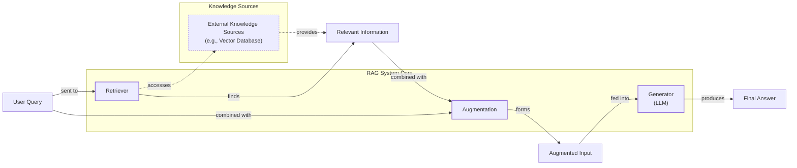
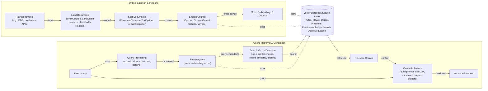
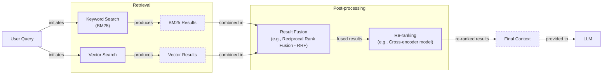
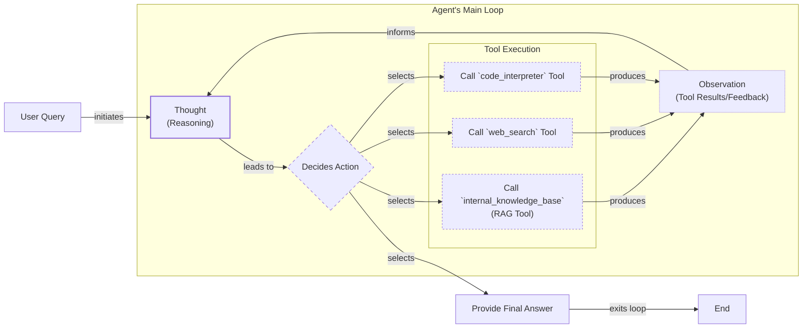

# Lesson 9: Retrieval-Augmented Generation (RAG)

In our previous lessons, we've explored the core components of AI engineering, from workflows and agents to the critical discipline of context engineering. We learned that managing the flow of information to an LLM is essential for building reliable applications. Now, we will dive deep into one of the most powerful techniques in our context engineering toolkit: Retrieval-Augmented Generation (RAG).

LLMs are trained on vast but fixed datasets, meaning their knowledge is frozen at a specific point in time. When you interact with a base model, it’s like giving it a "closed-book exam" on the world's information. This static knowledge leads to two major problems: the model can’t answer questions about recent events, and it’s prone to "hallucination"—confidently making up incorrect information.

You might think fine-tuning is the answer, but it's often not practical. Fine-tuning is resource-heavy, requiring massive datasets and multi-day training jobs, which is slow and expensive. It also risks "catastrophic forgetting," where the model loses some of its general capabilities while learning new information. Similarly, while models with million-token context windows seem promising, they have their own limits. Stuffing entire documents into the context is expensive, increases latency, and suffers from the "lost-in-the-middle" problem, where the model struggles to recall information buried deep within a long prompt.

This is where RAG comes in. Instead of trying to force a model to memorize everything, we give it an "open-book exam." RAG connects the LLM to external, real-time knowledge sources, allowing it to retrieve relevant information on demand. Just as we use notes or search the web to answer a difficult question, RAG gives an LLM a dynamic library to pull from, ensuring its answers are grounded in verifiable facts.

As a key method within context engineering, which we introduced in Lesson 3, RAG is fundamental for building AI agents that are trustworthy and knowledgeable. It represents the latest step in a long evolution of information retrieval systems. Early systems relied on sparse retrieval methods like TF-IDF and BM25, which were effective at matching keywords but failed to grasp the underlying meaning of a query. The advent of dense embeddings led to modern semantic search, but the real shift came with RAG, which combined retrieval with powerful generative models. Instead of just returning a list of documents, RAG synthesizes them into a coherent answer [[57]](https://medium.com/data-science-collective/journey-from-traditional-ir-to-rag-to-agentic-rag-b658210f46d4). In this lesson, we will explore the journey from basic RAG principles to the advanced and agentic patterns that power modern AI systems. With the problem and motivation clear, we’ll first decompose RAG into its core components so you can see where each responsibility lives.

## The RAG System: Core Components

Understanding the components of a RAG system is the first step in designing effective AI applications. Conceptually, the system can be broken down into three pillars: retrieval, augmentation, and generation. Each plays a distinct role in transforming a user's query into a factually grounded answer.

Image 1: A flowchart illustrating the core components and data flow of a RAG system.

**Retrieval:** This is the engine that finds relevant information. When a user asks a question, the retrieval component searches an external knowledge base to find documents or data snippets relevant to the query. The most common approach is semantic search, which relies on vector embeddings to find contextually similar information, even if the wording is different. This is fundamentally different from traditional keyword search, which only matches exact terms.

To enable semantic search, documents are first converted into vector embeddings—numerical representations that capture their meaning. These vectors are then stored in a specialized vector database. When a query comes in, it’s also converted into a vector, and the database finds the document vectors that are "closest" in the high-dimensional space, typically using a metric like cosine similarity [[44]](https://apxml.com/courses/prompt-engineering-llm-application-development/chapter-6-integrating-llms-external-data-rag/implementing-semantic-search-retrieval), [[45]](https://medium.com/@robi.tomar72/how-rag-actually-works-embeddings-vector-databases-indexing-retrieval-explained-simply-3d1ca45fe1bf).

**Augmentation:** Once the retriever has found relevant information, the augmentation step prepares it for the LLM. This process involves taking the retrieved text chunks and combining them with the original user query to form an augmented prompt. Effective prompt engineering is key here. The prompt must be structured to instruct the LLM to use the provided context as its primary source of truth, ensuring the final answer is grounded in the retrieved data [[29]](https://www.ibm.com/think/topics/retrieval-augmented-generation), [[49]](https://www.topquadrant.com/resources/blog-retrieval-augmented-generation-explained/). This step acts as a bridge, transforming raw retrieved data into a clear, actionable input for the generator.

**Generation:** The final step is generation, where the LLM produces an answer. The model receives the augmented prompt, which contains both the user’s question and the contextual information. Using its advanced reasoning capabilities, the LLM synthesizes this information to craft a coherent, accurate, and contextually relevant response [[24]](https://www.aimon.ai/posts/rag_and_its_different_components/). Because the answer is based on the provided external data, it is less likely to be a hallucination and can often include citations, allowing users to verify the information for themselves [[1]](https://neo4j.com/blog/developer/fine-tuning-vs-rag/).

Now that you can name each moving part, let’s see how they line up across the two phases of a real system.

## The RAG Pipeline: Ingestion and Retrieval

A production-ready RAG system operates in two distinct phases: an offline ingestion pipeline that prepares the knowledge base and an online retrieval pipeline that answers user queries in real-time. Understanding both is essential for building a robust system.

Image 2: RAG Pipeline: Offline Ingestion & Indexing and Online Retrieval & Generation Phases

### Phase 1: Offline Ingestion & Indexing

This phase is all about preparing your data to be searchable. It runs in the background, either as a one-time process or periodically, to keep your knowledge base up-to-date. It involves several key steps [[31]](https://newsletter.systemdesign.one/p/how-rag-works), [[32]](https://towardsdatascience.com/ragops-guide-building-and-scaling-retrieval-augmented-generation-systems-3d26b3ebd627/).

**Load:** The first step is to load your documents from their sources. These can be PDFs, web pages, database records, or API endpoints. Tools like Unstructured, LangChain’s document loaders, or LlamaIndex’s readers are commonly used to handle diverse data formats and extract clean text.

**Split:** Since LLMs have a limited context window, large documents must be broken down into smaller, manageable pieces, or "chunks." The chunking strategy is critical for retrieval quality. A simple approach is to use a fixed-size splitter, like LangChain’s `RecursiveCharacterTextSplitter`. More advanced methods, like LlamaIndex’s `SemanticSplitter`, divide text based on meaning to ensure that related sentences stay together and context is not lost across chunk boundaries.

**Embed:** Next, each chunk is transformed into a vector embedding using a specialized model. This numerical representation captures the semantic meaning of the text. Popular choices include models from OpenAI (e.g., `text-embedding-3-large`), Google (`text-embedding-004`), Cohere, Voyage, or open-source variants like BGE available through Hugging Face. The choice of embedding model depends on factors like performance, cost, and the specific domain of your data.

**Store:** Finally, the embeddings and their corresponding text chunks are stored in a vector database or a search index. This specialized database is optimized for fast similarity searches. Popular options range from local libraries like FAISS for smaller projects to scalable, managed solutions like Milvus, Qdrant, Pinecone, or vector search capabilities in traditional databases like Elasticsearch and Azure AI Search.

### Phase 2: Online Retrieval & Generation

This phase happens in real-time when a user interacts with your application [[30]](https://medium.com/@derrickryangiggs/rag-pipeline-deep-dive-ingestion-chunking-embedding-and-vector-search-abd3c8bfc177/).

**Query:** The process starts when a user submits a query. This raw input can be pre-processed to normalize text, expand acronyms, or correct typos to improve retrieval accuracy.

**Embed:** The processed query is then converted into a vector embedding using the exact same model that was used during the ingestion phase. This ensures that the query and the document chunks are represented in the same vector space, making them comparable.

**Search:** The query vector is used to search the vector database. The system performs a similarity search (e.g., using cosine similarity) to find the `top-k` document chunks that are most semantically similar to the query. This step may also involve metadata filtering to narrow down results based on criteria like date, source, or author.

**Generate:** In the final step, the retrieved chunks are combined with the original query and a set of instructions into a single prompt. This augmented prompt is then sent to an LLM, such as GPT-4o or Gemini. The LLM synthesizes the provided information to generate a final, grounded answer. As we covered in Lesson 4, using structured outputs can help ensure the answer is returned in a consistent format and includes citations back to the source documents.

With the end-to-end path in place, the next question is quality. What are the advanced techniques to make retrieval more accurate and useful across messy, real-world data?

## Advanced RAG Techniques

The vanilla RAG pipeline is a solid starting point, but what works in a proof-of-concept often fails in production. Real-world data is not static; it grows, changes, and drifts over time. According to Shubham Maurya, a Senior Data Scientist at Mastercard, up to 70% of RAG systems fail to deliver value in production due to unaddressed scalability challenges [[58]](https://www.aiacceleratorinstitute.com/why-rag-fails-in-production-and-how-to-fix-it/). These failures often fall into two categories:

*   **Knowledge Drift:** The information in the knowledge base becomes outdated. For example, a system built when interest rates were 4% will give wrong answers six months later when they are 5.5%. At Mastercard, a text-to-SQL system failed when a core transaction table was split into two, as the RAG system kept querying the old, non-existent table [[58]](https://www.aiacceleratorinstitute.com/why-rag-fails-in-production-and-how-to-fix-it/).
*   **Retrieval Decay:** As the volume of documents grows from thousands to millions, the system’s ability to find the relevant "needle in the haystack" diminishes, leading to irrelevant or noisy context.

Advanced RAG methods are designed to combat these production realities by optimizing every step of the retrieval process.

Image 3: A Mermaid diagram illustrating the hybrid retrieval flow.

### Hybrid Search

Vector search is powerful for understanding semantic meaning, but it can sometimes miss queries that depend on specific keywords, product codes, or names. **Hybrid search** solves this by combining the strengths of keyword-based search (like the BM25 algorithm) with dense vector search [[36]](https://mlpills.substack.com/p/issue-76-optimize-rag-with-hybrid). BM25 excels at finding exact term matches, while vector search captures contextual relevance.

For example, if a customer support user searches "my bill keeps rolling over," a keyword search will find articles containing the term "rollover." A vector search might also find guides that use the phrase "carryover balance." By fusing the results from both methods, often using a technique like Reciprocal Rank Fusion (RRF), the system provides a more comprehensive set of relevant documents, covering different ways of describing the same issue [[33]](https://pr-peri.github.io/blogpost/2026/03/05/blogpost-hybrid-search.html).

### Re-ranking

The initial retrieval step is designed for speed and recall, meaning it casts a wide net to find potentially relevant documents. However, the top-k results are not always ordered by true relevance. **Re-ranking** introduces a second, more precise scoring step. After the initial retrieval, a more powerful (and typically slower) model, like a cross-encoder, evaluates each query-document pair.

Unlike bi-encoders, which create separate embeddings for the query and document, a cross-encoder processes them together, allowing for deeper interaction between their tokens [[39]](https://towardsdatascience.com/advanced-rag-retrieval-cross-encoders-reranking/). This allows it to make much finer-grained relevance judgments. For a query like "how to connect my account," the re-ranker can promote a step-by-step setup guide above a less relevant press release, even if the press release had a higher initial similarity score [[38]](https://apxml.com/courses/optimizing-rag-for-production/chapter-2-advanced-retrieval-optimization/reranking-architectures-rag).

### Query Transformations

Sometimes, the user's original query is not the best input for a retrieval system. **Query transformations** rewrite or expand the query to improve retrieval accuracy. Two popular techniques are:

*   **Decomposition:** This method breaks down a complex, multi-part question into several simpler sub-queries. For example, the question “What’s our travel policy for conferences in Europe this year?” can be decomposed into: (1) “What is the company travel policy?”, (2) “What are the rules for conferences?”, and (3) “Are there specific rules for Europe in 2024?”. The system retrieves documents for each sub-query and then synthesizes the results to form a complete answer [[19]](https://docs.nvidia.com/rag/latest/query_decomposition.html).
*   **Hypothetical Document Embeddings (HyDE):** This technique addresses the fact that queries are often short and use different language than the detailed documents they are trying to find. With HyDE, an LLM first generates a hypothetical, ideal answer to the user's query. This generated document is then embedded and used for the similarity search. Because the hypothetical document is more similar in structure and language to the actual source documents, this often leads to more relevant retrieval results [[16]](https://47billion.com/blog/rag-system-in-production-why-it-fails-and-how-to-fix-it/).

### Advanced Chunking Strategies

How you split documents into chunks has a massive impact on retrieval quality. A naive fixed-size chunking strategy can easily separate related information. For example, splitting a handbook every 500 words might cut a "Reimbursements" section in half, separating the policy rules from the specific spending limits.

Advanced strategies preserve the document's structure:
*   **Semantic chunking** groups related sentences and paragraphs together, ensuring that a complete idea or topic is contained within a single chunk.
*   **Layout-aware chunking** is designed for complex documents like PDFs with tables, forms, or multiple columns. It analyzes the visual layout to keep related data together, such as ensuring a row in a pricing table isn't split across different chunks.
*   **Context-enriched chunking** (also known as contextual retrieval) prepends each chunk with a summary of its parent document or section. This gives the embedding model more context, helping it create a more accurate vector representation [[18]](https://cloudurable.com/blog/advanced-rag-techniques-that-will-transform-your-l/).

### GraphRAG

For queries that involve complex relationships and multi-hop reasoning, standard document retrieval can fall short. **GraphRAG** addresses this by transforming unstructured text into a structured knowledge graph. The process often begins by parsing documents to extract entities and their relationships as subject-object-predicate triples (e.g., "Steve Jobs - founded - Apple") [[59]](https://memgraph.com/blog/how-microsoft-graphrag-works-with-graph-databases). These relationships are then indexed into a graph database where entities are nodes and relationships are edges [[40]](https://arxiv.org/html/2601.03014v1).

This structured representation allows the system to answer complex questions by traversing the graph. When a query arrives, the system can identify relevant starting nodes and then explore their neighborhoods to gather context that might be spread across multiple documents [[60]](https://www.gooddata.com/blog/from-rag-to-graphrag-knowledge-graphs-ontologies-and-smarter-ai/). For a query like, “Which incidents were caused by weekend deploys that also touched the login service?” the system can follow connections from incident tickets to change records, deployment times, and affected services to assemble a comprehensive context that would be nearly impossible to find with simple semantic search [[43]](https://arxiv.org/html/2501.00309v2).

### Metadata Filtering

One of the most practical and effective techniques in a production RAG system is **metadata filtering**. When documents are indexed, they can be tagged with metadata such as their source, creation date, author, department, or language. During retrieval, these tags can be used to pre-filter the search space, ensuring that the similarity search is only performed on the most relevant subset of documents. This can be made dynamic, tailoring results to user-specific needs in real-time. For instance, a travel website could use a user's stated preferences for destination and activities to filter travel reviews before performing a semantic search, greatly improving relevance [[61]](https://aws.amazon.com/blogs/machine-learning/dynamic-metadata-filtering-for-amazon-bedrock-knowledge-bases-with-langchain/).

Temporal filters are especially powerful. For a query like, “What changed between March and June 2025?”, you can restrict the search to documents with an `effective_date` within that range. This not only improves accuracy but also significantly speeds up retrieval by reducing the number of vectors to search.

These advanced techniques transform a basic RAG system into a highly accurate and context-aware retrieval engine. Next, we’ll see how retrieval evolves from a fixed pipeline into a dynamic tool that an intelligent agent can choose to use as it reasons about a problem.

## Agentic RAG

In Lessons 7 and 8, we explored the ReAct framework, where an agent cycles through a loop of Thought, Action, and Observation to solve problems. **Agentic RAG** is the practical application of this concept, where retrieval is no longer a fixed, linear step but a dynamic tool that a reasoning agent can choose to use. The agent thinks about the problem, decides it has a knowledge gap, and takes the action to call its retrieval tool.

### The Core Distinction

The fundamental difference between standard and agentic RAG lies in control and adaptability.

*   **Standard RAG** is a pre-determined workflow. Every query follows the same rigid path: Retrieve → Augment → Generate. It is powerful but inflexible. If the first retrieval fails to find the right information, the system has no way to recover.
*   **Agentic RAG** is an adaptive and iterative process. It marks a shift from a single-shot retrieval task to an autonomous, multi-step reasoning process [[64]](https://needle.app/blog/the-evolution-from-traditional-rag-to-agentic-rag). An AI agent orchestrates the workflow, deciding *when* to retrieve information, *what* to search for, and whether one retrieval is enough. It can reformulate queries, chain multiple searches, and even decide to use other tools if retrieval is not the best action [[8]](https://weaviate.io/blog/what-is-agentic-rag), [[11]](https://towardsdatascience.com/agentic-rag-vs-classic-rag-from-a-pipeline-to-a-control-loop/). This turns the RAG pipeline into a dynamic control loop.

Image 4: A conceptual Mermaid diagram showing an agent's main loop, from user query to iterative thought, action, observation, and final answer.

### Capabilities of an Agentic Approach

By giving an agent control over the retrieval process, we unlock several powerful capabilities:

*   **Iterative Refinement:** The agent can use the RAG tool multiple times in a sequence. If the initial retrieval results are insufficient, the agent can reason about what's missing, refine its query, and search again. For example, a first pass might yield a vague policy document. The agent can then narrow its search to "EU customers, 2024 updates" and retrieve again to find the specific section it needs [[15]](https://domino.ai/blog/rag-vs-agentic-ai).
*   **Dynamic Tool and Source Selection:** An agent often has access to multiple tools and knowledge sources. It can intelligently choose the best one for the job. For an IT outage query, it might select `search_incident_runbooks` over `search_marketing_pages`. This routing capability ensures the most relevant knowledge base is queried for any given task.
*   **Information Fusion:** The agent can combine information from its retrieval tool with outputs from other tools, like a web search or a code interpreter. For instance, it could retrieve an internal company policy, then use a web search to verify that the policy complies with current government regulations, and finally synthesize both pieces of information into a comprehensive answer.
*   **Knowledge Base Updates:** A sophisticated agent can even decide to update its own knowledge base. If it discovers new, verified information from an external tool, it can propose writing that information to a long-term memory store. We will explore this concept of agent memory in detail in our next lesson.

### Production Challenges of Agentic RAG
While powerful, the iterative nature of agentic systems introduces new production challenges, particularly around cost and latency. A simple RAG pipeline might involve one or two LLM calls, but an agentic system with routing and refinement can easily make 10-15 calls per query. Without careful monitoring and optimization like prompt caching, costs can quickly escalate [[62]](https://towardsai.net/p/machine-learning/why-90-of-agentic-rag-projects-fail-and-how-to-build-one-that-actually-works-in-production).

Latency is also a critical trade-off. The additional reasoning steps directly add to response time. For example, one study on a hierarchical agentic system found that its p95 latency was 2.1 seconds, compared to just 0.8 seconds for a standard RAG pipeline. However, that extra 1.3 seconds yielded a 21.7 percentage point gain in accuracy—a trade-off many enterprise analytics teams find favorable [[63]](https://www.infoq.com/articles/building-hierarchical-agentic-rag-systems/). Managing this balance between performance and accuracy is a key task for AI Engineers.

This shift transforms RAG from a simple database lookup into a conversation with a knowledgeable research assistant. To make this concrete, here is a conceptual thought process for an agent handling a complex query:

*   **User Query:** "What are the latest 2024 EU data retention rules? Our internal policy document seems to be from 2023."
*   **Thought:** The user is asking about 2024 rules but notes our internal document is from 2023. The internal knowledge is likely outdated. I should first check the internal policy and then verify with an external search.
*   **Action:** `internal_knowledge_base.search(query="EU data retention policy 2024 updates")`
*   **Observation:** The internal document mentions that amendments were planned for 2024 but does not contain the final text or citations.
*   **Thought:** The internal document confirms it is out of date. I need to find the official 2024 directive externally.
*   **Action:** `web_search(query="official EU data retention directive 2024")`
*   **Observation:** The web search returns a link to the official EU portal with the updated directive.
*   **Thought:** I have both the old internal context and the new external directive. I can now synthesize an answer that explains the changes and cites both sources.
*   **Final Answer:** "The 2024 EU data retention directive introduces..."

This thought process demonstrates a simple reasoning loop. Emerging research is exploring how to make these loops more robust by integrating principles from symbolic AI. Neuro-symbolic agents can blend the adaptive capabilities of LLMs with the deterministic logic of symbolic reasoning, creating more verifiable and auditable reasoning pathways [[65]](https://builder.aws.com/content/2uYUowZxjkh80uc0s2bUji0C9FP/from-logic-to-learning-the-future-of-ai-lies-in-neuro-symbolic-agents).

You now understand both a linear RAG pipeline and how an agent can control retrieval when needed. Let’s wrap up by situating RAG in the wider AI Engineering toolkit and previewing what comes next.

## Conclusion

We have journeyed from the fundamental limitations of LLMs to the sophisticated, agent-driven systems that represent the future of information retrieval. RAG stands out as the most practical and widely used solution to the LLM knowledge problem. It grounds models in factual data, reduces hallucinations, and enables customization with proprietary information, building user trust through verifiable, source-backed answers. While basic RAG is a great start, we have seen that advanced techniques like hybrid search, re-ranking, and GraphRAG are essential for achieving production-grade quality.

Ultimately, the future of knowledge retrieval is agentic. By treating RAG as a tool within a reasoning loop, we empower AI systems to handle complex, multi-step queries with a level of adaptability that fixed pipelines cannot match. For the modern AI Engineer, mastering RAG is not a niche skill but a foundational competency—a core part of the broader discipline of Context Engineering.

This lesson has equipped you with the theory behind RAG, but our journey doesn't end here. In our next lesson, we will explore Memory for Agents, and you will learn how short-term and long-term memory systems work alongside RAG to give agents a persistent understanding of the world. This is an active area of research with many open questions, such as how to best store agentic memory—should it be a consolidation of episodic events over time, or should individual interactions be stored separately [[66]](https://medium.com/@bhuvaneswari.subramani/agentic-rag-a-self-corrective-method-for-implementing-retrieval-augmented-generation-d6bbd583446f)? Further on in the course, we will also cover how to build robust evaluation pipelines for retrieval quality and how to monitor these systems in production, ensuring they remain accurate and reliable over time.

## References

- [1] [Knowledge Graphs and LLMs: Fine-Tuning vs. Retrieval-Augmented Generation](https://neo4j.com/blog/developer/fine-tuning-vs-rag/)
- [2] [What Is Retrieval-Augmented Generation, aka RAG?](https://blogs.nvidia.com/blog/what-is-retrieval-augmented-generation/)
- [3] [A Complete Guide to RAG](https://towardsai.net/p/l/a-complete-guide-to-rag)
- [4] [Retrieval-Augmented Generation (RAG) Fundamentals First](https://decodingml.substack.com/p/rag-fundamentals-first?utm_source=publication-search)
- [5] [Your RAG is wrong: Here's how to fix it](https://decodingml.substack.com/p/your-rag-is-wrong-heres-how-to-fix?utm_source=publication-search)
- [6] [From Local to Global: A GraphRAG Approach to Query-Focused Summarization](https://arxiv.org/html/2404.16130)
- [7] [Introducing Contextual Retrieval](https://www.anthropic.com/news/contextual-retrieval)
- [8] [What is Agentic RAG](https://weaviate.io/blog/what-is-agentic-rag)
- [9] [RAG is dead, long live agentic retrieval](https://www.llamaindex.ai/blog/rag-is-dead-long-live-agentic-retrieval)
- [10] [What is agentic RAG?](https://www.ibm.com/think/topics/agentic-rag)
- [11] [Agentic RAG vs Classic RAG: From a Pipeline to a Control Loop](https://towardsdatascience.com/agentic-rag-vs-classic-rag-from-a-pipeline-to-a-control-loop/)
- [12] [Agentic RAG vs. Traditional RAG: Key Differences and Benefits](https://www.pingcap.com/article/agentic-rag-vs-traditional-rag-key-differences-benefits/)
- [13] [Build advanced retrieval-augmented generation systems](https://learn.microsoft.com/en-us/azure/developer/ai/advanced-retrieval-augmented-generation)
- [14] [The Rise of RAG](https://highlearningrate.substack.com/p/the-rise-of-rag)
- [15] [RAG vs Agentic AI: Which Is Right for Your Enterprise?](https://domino.ai/blog/rag-vs-agentic-ai)
- [16] [RAG System in Production: Why it Fails and How to Fix it](https://47billion.com/blog/rag-system-in-production-why-it-fails-and-how-to-fix-it/)
- [17] [Address AI Hallucinations with Retrieval-Augmented Generation](https://www.infoworld.com/article/2335043/addressing-ai-hallucinations-with-retrieval-augmented-generation.html)
- [18] [Advanced RAG Techniques That Will Transform Your LLM Applications](https://cloudurable.com/blog/advanced-rag-techniques-that-will-transform-your-l/)
- [19] [Query Decomposition](https://docs.nvidia.com/rag/latest/query_decomposition.html)
- [20] [Advanced RAG Techniques: from Theory to Production with Neo4j](https://neo4j.com/blog/genai/advanced-rag-techniques/)
- [21] [Retrieval-Augmented Generation: Building Grounded AI for Enterprise Knowledge](https://medium.com/@fahey_james/retrieval-augmented-generation-building-grounded-ai-for-enterprise-knowledge-6bc46277fee5)
- [22] [What is RAG (Retrieval-Augmented Generation)?](https://www.mindstudio.ai/blog/what-is-rag/)
- [23] [RAG Inventor Talks Agents, Grounded AI, and Enterprise Impact](https://www.madrona.com/rag-inventor-talks-agents-grounded-ai-and-enterprise-impact/)
- [24] [RAG and its different components](https://www.aimon.ai/posts/rag_and_its_different_components/)
- [25] [Grounding LLMs: Driving AI to Deliver Contextually Relevant Data](https://toloka.ai/blog/grounding-llms-driving-ai-to-deliver-contextually-relevant-data/)
- [26] [RAG Architecture: A Comprehensive Guide to RAG Systems](https://galileo.ai/blog/rag-architecture)
- [27] [What is RAG: Understanding Retrieval-Augmented Generation](https://qdrant.tech/articles/what-is-rag-in-ai/)
- [28] [What is Retrieval-Augmented Generation?](https://aws.amazon.com/what-is/retrieval-augmented-generation/)
- [29] [What is retrieval-augmented generation?](https://www.ibm.com/think/topics/retrieval-augmented-generation)
- [30] [RAG Pipeline Deep Dive: Ingestion (Chunking, Embedding, and Vector Search)](https://medium.com/@derrickryangiggs/rag-pipeline-deep-dive-ingestion-chunking-embedding-and-vector-search-abd3c8bfc177)
- [31] [How RAG works](https://newsletter.systemdesign.one/p/how-rag-works)
- [32] [RAGOps Guide: Building and Scaling Retrieval-Augmented Generation Systems](https://towardsdatascience.com/ragops-guide-building-and-scaling-retrieval-augmented-generation-systems-3d26b3ebd627/)
- [33] [Hybrid Search Is a Practical Necessity for Production RAG](https://pr-peri.github.io/blogpost/2026/03/05/blogpost-hybrid-search.html)
- [34] [Hybrid Search Optimization: How BM25 and Dense Vector Retrieval Work Together for Superior AI Search](https://cubitrek.com/blog/hybrid-search-optimization-how-bm25-and-dense-vector-retrieval-work-together-for-superior-ai-search/)
- [35] [Hybrid RAG in the Real World: Graphs, BM25, and the End of Black Box Retrieval](https://community.netapp.com/t5/Tech-ONTAP-Blogs/Hybrid-RAG-in-the-Real-World-Graphs-BM25-and-the-End-of-Black-Box-Retrieval/ba-p/464834)
- [36] [Issue #76 - Optimize RAG with Hybrid search](https://mlpills.substack.com/p/issue-76-optimize-rag-with-hybrid)
- [37] [An Introduction to Reranking in Retrieval Augmented Generation](https://redis.io/blog/10-techniques-to-improve-rag-accuracy/)
- [38] [Reranking Architectures in RAG](https://apxml.com/courses/optimizing-rag-for-production/chapter-2-advanced-retrieval-optimization/reranking-architectures-rag)
- [39] [Advanced RAG Retrieval: Cross-Encoders & Reranking](https://towardsdatascience.com/advanced-rag-retrieval-cross-encoders-reranking/)
- [40] [GraphRAG: A Graph-Based Approach for Question Answering Over Private Text Corpora](https://arxiv.org/html/2601.03014v1)
- [41] [GraphRAG: Unlocking the Power of Graph-Based Retrieval for Enhanced Language Model Performance](https://webhome.cs.uvic.ca/~thomo/papers/asonam2025-graphrag.pdf)
- [42] [What is GraphRAG? How It Works, Benefits, and More](https://atlan.com/know/what-is-graphrag/)
- [43] [A Survey on Graph-based Retrieval-Augmented Generation](https://arxiv.org/html/2501.00309v2)
- [44] [Implementing Semantic Search for Retrieval](https://apxml.com/courses/prompt-engineering-llm-application-development/chapter-6-integrating-llms-external-data-rag/implementing-semantic-search-retrieval)
- [45] [How RAG Actually Works: Embeddings, Vector Databases, Indexing & Retrieval Explained Simply](https://medium.com/@robi.tomar72/how-rag-actually-works-embeddings-vector-databases-indexing-retrieval-explained-simply-3d1ca45fe1bf)
- [46] [Vector DB and RAG Pipeline for Document RAG](https://learnopencv.com/vector-db-and-rag-pipeline-for-document-rag/)
- [47] [RAG Explained: Understanding Embeddings, Similarity and Retrieval](https://towardsdatascience.com/rag-explained-understanding-embeddings-similarity-and-retrieval/)
- [48] [Vector Databases Explained: A Deep Dive into Semantic Search and RAG Systems](https://tutorialsdojo.com/aws-vector-databases-explained-semantic-search-and-rag-systems/)
- [49] [Retrieval-Augmented Generation Explained](https://www.topquadrant.com/resources/blog-retrieval-augmented-generation-explained/)
- [50] [Retrieval Augmented Generation (RAG)](https://www.promptingguide.ai/research/rag)
- [51] [AI Agent vs RAG: What’s the Difference?](https://airbyte.com/agentic-data/ai-agent-vs-rag)
- [52] [RAG Architectures and where to find them](https://humanloop.com/blog/rag-architectures)
- [53] [Vector Databases in Practice: Building a Realistic Hybrid-Search RAG System with Qdrant](https://pub.towardsai.net/vector-databases-in-practice-building-a-realistic-hybrid-search-rag-system-with-qdrant-7b8f4a6e41e0)
- [54] [Unleashing the Power of RAG: A Deep Dive into Cross-Encoders and Re-rankers](https://arxiv.org/html/2407.00072v5)
- [55] [RAG vs Fine-tuning: Which is the best tool to boost your LLM application?](https://arxiv.org/html/2312.05934v3)
- [56] [To RAG or not to RAG? A Comprehensive Survey on Retrieval-Augmented Large Language Models](https://aclanthology.org/2024.emnlp-main.15.pdf)
- [57] [Journey from Traditional IR to RAG to Agentic RAG](https://medium.com/data-science-collective/journey-from-traditional-ir-to-rag-to-agentic-rag-b658210f46d4)
- [58] [Why RAG fails in production (And how to fix it)](https://www.aiacceleratorinstitute.com/why-rag-fails-in-production-and-how-to-fix-it/)
- [59] [How Microsoft's GraphRAG Works with Graph Databases](https://memgraph.com/blog/how-microsoft-graphrag-works-with-graph-databases)
- [60] [From RAG to GraphRAG: Knowledge Graphs, Ontologies, and Smarter AI](https://www.gooddata.com/blog/from-rag-to-graphrag-knowledge-graphs-ontologies-and-smarter-ai/)
- [61] [Dynamic metadata filtering for Amazon Bedrock Knowledge Bases with LangChain](https://aws.amazon.com/blogs/machine-learning/dynamic-metadata-filtering-for-amazon-bedrock-knowledge-bases-with-langchain/)
- [62] [Why 90% of Agentic RAG Projects Fail](https://towardsai.net/p/machine-learning/why-90-of-agentic-rag-projects-fail-and-how-to-build-one-that-actually-works-in-production)
- [63] [Building Production-Ready Hierarchical Agentic RAG Systems](https://www.infoq.com/articles/building-hierarchical-agentic-rag-systems/)
- [64] [The Evolution from Traditional RAG to Agentic RAG](https://needle.app/blog/the-evolution-from-traditional-rag-to-agentic-rag)
- [65] [From Logic to Learning: The Future of AI Lies in Neuro-Symbolic Agents](https://builder.aws.com/content/2uYUowZxjkh80uc0s2bUji0C9FP/from-logic-to-learning-the-future-of-ai-lies-in-neuro-symbolic-agents)
- [66] [Agentic RAG: A Self-Corrective Method for Implementing Retrieval Augmented Generation](https://medium.com/@bhuvaneswari.subramani/agentic-rag-a-self-corrective-method-for-implementing-retrieval-augmented-generation-d6bbd583446f)