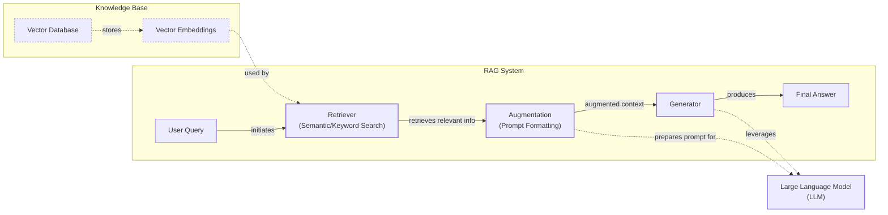
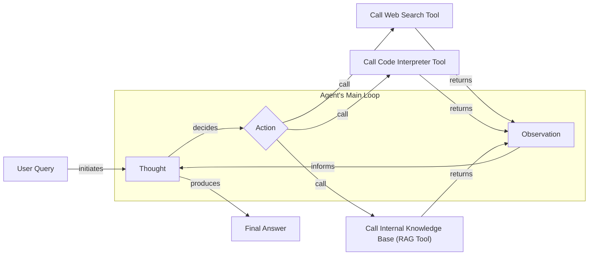

# Lesson 9: Retrieval-Augmented Generation

In our previous lessons, we built a solid foundation in AI Engineering. We explored the agent landscape, distinguished between rule-based workflows and autonomous agents, and in Lesson 3, we introduced Context Engineering—the art of managing the information an LLM sees. We have also covered how to get structured data out of LLMs, give them tools to act, and implement reasoning loops with ReAct.

A core problem we still face is that LLMs are trained on a fixed dataset. Their knowledge is static, making them prone to hallucination. During training, they essentially take a "closed-book exam" on the world's information. We do not yet have efficient techniques to enable models to continuously learn new information after deployment. While we can fine-tune them, this process is resource-heavy, slow, and risks catastrophic forgetting. It requires massive dataset curation and can take days to train. Empirical studies show that LLMs struggle to learn new facts via fine-tuning, indicating that it is not a reliable method for knowledge injection [[4]](https://aclanthology.org/2024.emnlp-main.15.pdf).

Even models with massive context windows have their limits; they are finite, expensive to use at scale, and suffer from the "lost-in-the-middle" problem, where they often overlook information placed in the middle of a long prompt. This "lost-in-the-middle" issue is not just a minor quirk; it is a systemic bias. Research has shown that LLMs exhibit a distinct U-shaped performance curve, where they are best at recalling information from the beginning or end of their context window [[83]](https://cs.stanford.edu/~nfliu/papers/lost-in-the-middle.arxiv2023.pdf). Performance drops significantly when critical details are buried in the middle. This phenomenon is analogous to the "serial-position effect" in human psychology, where we tend to remember the first and last items in a list better than those in the middle [[84]](https://cs.stanford.edu/~nfliu/papers/lost-in-the-middle.arxiv2023.pdf).

This is where Retrieval-Augmented Generation (RAG) comes in. It is a reliable solution that gives the LLM an "open-book exam" by connecting it to external, real-time knowledge sources. Instead of forcing an LLM to memorize everything, we give it a library it can reference on demand. RAG is a core method AI Engineers use for Context Engineering, allowing us to build grounded and trustworthy applications by curating what the LLM knows. It is a cost-effective approach to keeping an LLM's knowledge current without the need for constant retraining [[35]](https://aws.amazon.com/what-is/retrieval-augmented-generation/).

In this lesson, we will explore the "what" and "how" of RAG, starting with its fundamental components and moving toward the advanced and agentic patterns used in production systems. We will also see how RAG complements an agent's memory, a topic we will explore further in Lesson 10. With the problem and motivation clear, we will first decompose RAG into its core components so you can see where each responsibility lives.

## The RAG System: Core Components

Understanding the components of a RAG system is the first step in the Context Engineering process of designing effective AI applications. At its core, RAG is built on three conceptual pillars: Retrieval, Augmentation, and Generation. These pillars work together to provide LLMs with the right information at the right time, ensuring that their responses are both accurate and relevant.

**Retrieval** is the engine for finding relevant information. Given a user's query, the retrieval system searches an external knowledge base to find the most relevant pieces of information. The most common approach relies on semantic search, which finds text that is contextually similar in meaning, even if the wording is different [[51]](https://apxml.com/courses/prompt-engineering-llm-application-development/chapter-6-integrating-llms-external-data-rag/implementing-semantic-search-retrieval). This is made possible by vector embeddings. These are high-dimensional numerical arrays that capture the semantic essence of text, images, or audio. An embedding model transforms content into a dense vector where each dimension represents some aspect of its meaning. Chunks of text with similar meanings are located closer together in this vector space [[7]](https://tutorialsdojo.com/aws-vector-databases-explained-semantic-search-and-rag-systems/), [[51]](https://apxml.com/courses/prompt-engineering-llm-application-development/chapter-6-integrating-llms-external-data-rag/implementing-semantic-search-retrieval). These vectors are stored and indexed in a specialized vector database, which is optimized for fast nearest-neighbor searches [[6]](https://pub.towardsai.net/vector-databases-in-practice-building-a-realistic-hybrid-search-rag-system-with-qdrant-7b8f4a6e41e0). When a user submits a query, it is converted into a vector using the same model, and the system finds the chunks with the closest embeddings [[51]](https://apxml.com/courses/prompt-engineering-llm-application-development/chapter-6-integrating-llms-external-data-rag/implementing-semantic-search-retrieval).

**Augmentation** is the process of taking the retrieved information and integrating it into the prompt that will be sent to the LLM. This step is crucial because it bridges the gap between the raw data found by the retriever and the final response generated by the model. The augmented prompt is constructed using a template that combines the original user query, the retrieved document excerpts, and a set of instructions for the LLM [[56]](https://www.topquadrant.com/resources/blog-retrieval-augmented-generation-explained/). For example, the instructions might guide the model to use only the provided context to answer the question and to state if the answer is not found within the context. This structured approach ensures the LLM gives appropriate weight to the retrieved information and adheres to any constraints, which is a key part of effective prompt engineering [[29]](https://www.ibm.com/think/topics/retrieval-augmented-generation).

**Generation** is the final step, where the LLM uses the augmented prompt to produce an answer. Because the prompt now contains relevant, external information, the LLM can generate a response that is grounded in facts from the knowledge base, rather than relying solely on its pre-trained knowledge. This significantly reduces the risk of hallucinations and ensures that the answer is accurate and up-to-date [[26]](https://humanloop.com/blog/rag-architectures). The ability to cite sources from the retrieved documents also adds a layer of verifiability, which builds user trust [[57]](https://blogs.nvidia.com/blog/what-is-retrieval-augmented-generation/). This process transforms the LLM from a closed-book reasoner into an open-book expert that can synthesize information from provided materials.

Image 1: A flowchart illustrating the core components and information flow of a Retrieval Augmented Generation (RAG) system.

These three components form the backbone of any RAG system. Now that you can name each moving part, let’s see how they line up across the two phases of a real system.

## The RAG Pipeline: Ingestion and Retrieval

The end-to-end RAG workflow is split into two distinct phases: an offline ingestion pipeline that prepares your data and an online retrieval pipeline that answers user queries in real-time. This separation is crucial for building efficient and scalable systems [[32]](https://newsletter.systemdesign.one/p/how-rag-works).

### Phase 1: Offline Ingestion & Indexing

The ingestion phase is where you process your knowledge base and make it searchable. This happens offline, before any user queries are handled, and involves four key steps [[31]](https://medium.com/@derrickryangiggs/rag-pipeline-deep-dive-ingestion-chunking-embedding-and-vector-search-abd3c8bfc177).

First, you **Load** documents from various sources. This can include anything from PDFs and databases to APIs and websites. The challenge here is handling the diversity of formats. PDFs may contain complex layouts with tables and images that require specialized parsers. Web scraping involves dealing with dynamic content and cleaning HTML. Accessing databases or APIs means handling structured data alongside unstructured text. Tools like LangChain document loaders or LlamaIndex readers can help standardize this process, but often require custom logic to handle specific data sources effectively [[32]](https://newsletter.systemdesign.one/p/how-rag-works).

Next, you **Split** the loaded documents into smaller, semantically meaningful pieces called chunks. This is arguably one of the most critical steps, as poor chunking can lead to context loss and irrelevant retrieval. Instead of naive fixed-size splits, it is better to use strategies that respect document structure, like splitting by paragraphs or sections. This is often referred to as the "chunking paradox": chunks that are too small may lack sufficient context, while chunks that are too large can introduce noise and dilute the semantic meaning of the embedding [[94]](https://47billion.com/blog/rag-system-in-production-why-it-fails-and-how-to-fix-it/). Tools like LangChain's `RecursiveCharacterTextSplitter` offer a good starting point by attempting to split along natural boundaries [[17]](https://sarthakai.substack.com/p/improve-your-rag-accuracy-with-a).

Then, you **Embed** each chunk. An embedding model converts the text of each chunk into a high-dimensional vector. Choosing the right model is important. You need to consider the trade-offs between performance on benchmarks like MTEB, cost, context length support (e.g., Jina models are designed for long documents), and domain specificity. For specialized content like legal or medical texts, a domain-specific or fine-tuned embedding model will often outperform a general-purpose one [[89]](https://47billion.com/blog/rag-system-in-production-why-it-fails-and-how-to-fix-it/).

Finally, you **Store** these embeddings and their corresponding text in a vector database. This specialized database, like FAISS for local development or managed services like Qdrant, Pinecone, or Milvus, indexes the vectors for efficient similarity search [[9]](https://wandb.ai/mostafaibrahim17/ml-articles/reports/Vector-Embeddings-in-RAG-Applications--Vmlldzo3OTk1NDA5). This index is what allows the system to quickly find relevant information at query time.

### Phase 2: Online Retrieval & Generation

This phase happens in real-time when a user interacts with your application.

It starts with a **Query** from the user. This query is then passed through the same **Embed** step as the documents, using the exact same embedding model to create a query vector. This ensures that the query and the document chunks are represented in the same vector space, making them comparable. Using different models for indexing and querying is a common mistake that leads to meaningless comparisons [[31]](https://medium.com/@derrickryangiggs/rag-pipeline-deep-dive-ingestion-chunking-embedding-and-vector-search-abd3c8bfc177).

The **Search** step uses this query vector to perform a similarity search in the vector database. The database returns the top-k most similar document chunks, typically based on cosine similarity or another distance metric [[54]](https://towardsdatascience.com/rag-explained-understanding-embeddings-similarity-and-retrieval/). These chunks are the external knowledge that will ground the LLM's response.

In the final **Generate** step, the system constructs a prompt containing the user's original query, the retrieved chunks, and specific instructions. This augmented prompt is then passed to an LLM, which synthesizes the information to generate a factually grounded answer. As we discussed in Lesson 4, using structured outputs can help ensure the response is well-formatted and includes citations, linking the answer back to the source documents [[59]](https://www.promptingguide.ai/research/rag). The format of citations is critical for verifiability; the marker used to identify a source in the context (e.g., `[Document 1]: ...`) must match the format you instruct the model to produce in its output [[85]](https://mbrenndoerfer.com/writing/rag-prompt-engineering-context-citations). A common failure mode is to simply list all retrieved documents as sources, which is misleading. An effective system must cite only the specific documents the LLM actually used to generate its response [[86]](https://cianfrani.dev/posts/citations-in-the-key-of-rag/).

```mermaid
flowchart LR
  %% Offline Ingestion & Indexing Phase
  subgraph "Offline Ingestion & Indexing"
    RD["Raw Documents<br/>(PDFs, Websites, APIs)"] -- "loads & preprocesses" --> DLP["Document Loader & Preprocessing"]
    DLP -- "splits & chunks" --> TSC["Text Splitter & Chunking"]
    TSC -- "embeds" --> EM1["Embedding Model"]
    EM1 -- "generates" --> E["Embeddings"]
    E -- "indexes & stores" --> VD["Vector Database"]
  end

  %% Online Retrieval & Generation Phase
  subgraph "Online Retrieval & Generation"
    UQ["User Query"] -- "embeds" --> EM2["Embedding Model"]
    EM2 -- "generates" --> QV["Query Vector"]
    QV -- "similarity search" --> VD
    VD -- "retrieves" --> TKC["Top-K Chunks"]
    TKC -- "re-ranks & filters" --> RF["Re-ranking & Filtering"]
    RF -- "builds prompt" --> CPB["Contextual Prompt Builder"]
    CPB -- "generates response" --> LLM["Large Language Model (LLM)"]
    LLM -- "produces" --> FR["Final Response"]
  end

  %% Visual grouping
  classDef store stroke-dasharray:3,3
  classDef exec stroke-width:2px
  class RD,E,VD,UQ,QV,TKC,FR store
  class DLP,TSC,EM1,EM2,RF,CPB,LLM exec
```

Image 2: A detailed Mermaid diagram depicting the end-to-end RAG workflow, clearly separating the offline ingestion and indexing phase from the online retrieval and generation phase.

With the end-to-end path in place, the next question is quality. What are the advanced techniques to make retrieval more accurate and useful across messy, real-world data?

## Advanced RAG Techniques

While the vanilla RAG pipeline is a great starting point, production-grade systems require more sophisticated techniques to enhance retrieval accuracy and relevance. These advanced methods address the limitations of simple semantic search and help you build more robust applications.

### Hybrid Search

Hybrid search combines the strengths of traditional keyword-based search (like BM25) with modern vector-based semantic search. Keyword-based methods like BM25 rank documents based on term frequency and inverse document frequency, making them excellent at finding exact matches for specific terms, acronyms, or IDs. Vector search, on the other hand, excels at understanding the underlying meaning and context of a query, capturing semantic relationships even when the exact words don't match [[38]](https://mlpills.substack.com/p/issue-76-optimize-rag-with-hybrid).

For example, in a customer support scenario, a user might ask, “My bill keeps rolling over.” A keyword search for "rollover" would find relevant articles. However, a semantic search could also surface documents about a "carryover balance," capturing the user's intent even with different phrasing. By fusing the results from both methods, often using techniques like Reciprocal Rank Fusion (RRF), hybrid search provides more comprehensive and accurate retrieval [[38]](https://mlpills.substack.com/p/issue-76-optimize-rag-with-hybrid), [[39]](https://cubitrek.com/blog/hybrid-search-optimization-how-bm25-and-dense-vector-retrieval-work-together-for-superior-ai-search/). However, in enterprise settings with ambiguous queries and inconsistent data quality, hybrid search can still fail. Multiple document versions, outdated wikis, and a lack of clear data governance can pollute the knowledge base, leading to semantically related but contextually useless results [[87]](https://gradientflow.substack.com/p/a-pragmatic-guide-to-enterprise-search).

### Re-ranking

After an initial retrieval, a re-ranking step can significantly improve the relevance of the documents passed to the LLM. This is a two-stage process: a fast but less precise retrieval model (a bi-encoder) first gathers a large set of candidate documents, and then a more powerful but slower re-ranker model (a cross-encoder) re-orders them [[42]](https://redis.io/blog/10-techniques-to-improve-rag-accuracy/).

Re-rankers evaluate the relevance of each document to the query more thoroughly than the initial retrieval. They process the query and a candidate document together, allowing for a deeper, full cross-attention interaction between their tokens and a more accurate relevance score [[43]](https://apxml.com/courses/optimizing-rag-for-production/chapter-2-advanced-retrieval-optimization/reranking-architectures-rag). For instance, in a product help system, a query like "how to connect my account" might initially retrieve a press release and a community thread. A re-ranker would prioritize the step-by-step setup guide, pushing it to the top of the list for the LLM.

```mermaid
flowchart LR
  %% Start
  A["User Query"]

  %% Parallel Retrieval Paths
  subgraph "Dense Retrieval (Semantic Matching)"
    B["Embedding Model"]
    C["Query Vector"]
    D["Semantic Search"]
    E["Vector Database"]
    F["Dense Scores"]
  end

  subgraph "Sparse Retrieval (Keyword Matching)"
    G["Tokenizer & Stemmer"]
    H["Keyword Match"]
    I["Keyword Search"]
    J["Keyword Index"]
    K["Sparse Scores"]
  end

  %% Hybrid Fusion and LLM Generation
  subgraph "Fusion & Generation"
    L["Hybrid Fusion<br/>(Normalization, Weighted Combination, Re-ranking)"]
    M["Final Ranked Results"]
    N["Context"]
    O["LLM"]
    P["Response"]
  end

  %% Connections
  A -- "generates" --> B
  B -- "produces" --> C
  C -- "used by" --> D
  D -- "searches" --> E
  E -- "returns" --> F

  A -- "extracts terms" --> G
  G -- "produces" --> H
  H -- "used by" --> I
  I -- "searches" --> J
  J -- "returns" --> K

  F -- "input" --> L
  K -- "input" --> L
  L -- "produces" --> M
  M -- "provides" --> N
  N -- "as input to" --> O
  O -- "generates" --> P

  %% Visual grouping
  classDef io stroke-width:2px,fill:#e0e0e0
  classDef process fill:#bbf,stroke:#333,stroke-width:2px
  classDef data fill:#ffc,stroke:#333,stroke-width:1px

  class A,P io
  class B,D,G,I,L,O process
  class C,F,H,K,M,N data
  class E,J data
```

Image 3: A Mermaid diagram illustrating the hybrid retrieval flow, showing parallel dense and sparse retrieval paths converging into hybrid fusion and LLM generation.

### Query Transformations

Instead of taking the user's query at face value, you can transform it to improve retrieval. One common technique is **decomposition**, where a complex query is broken down into smaller, simpler sub-questions. For example, the query “What’s our travel policy for conferences in Europe this year?” could be split into separate queries about the general travel policy, conference rules, Europe-specific guidelines, and recent changes [[19]](https://docs.nvidia.com/rag/latest/query_decomposition.html). The system retrieves documents for each sub-question and then synthesizes the results.

Another powerful method is **Hypothetical Document Embeddings (HyDE)**. This technique addresses the "distribution gap" where user questions are phrased differently from the answers in documents. The system first asks an LLM to generate a short, hypothetical answer to the user's query. This "ideal" document is then embedded and used for the similarity search. For a query about travel policies, the system might generate a draft like: “Employees attending approved conferences in Europe can book economy flights and up to three hotel nights.” It then searches for documents that semantically match this hypothetical answer, which often leads directly to the relevant policy pages [[16]](https://47billion.com/blog/rag-system-in-production-why-it-fails-and-how-to-fix-it/). While effective, this technique comes at a high latency cost, slowing down response times by over 40% in billion-document benchmarks, making it suitable only when semantic depth outweighs performance constraints [[88]](https://arxiv.org/pdf/2506.21568).

### Advanced Chunking Strategies

The way you chunk your documents has a massive impact on retrieval quality. Moving beyond naive fixed-size chunking is essential. For instance, splitting a 20-page handbook every 500 words might awkwardly cut a section on "Reimbursements" in half, separating a policy from its specific monetary limits [[17]](https://sarthakai.substack.com/p/improve-your-rag-accuracy-with-a).

**Semantic chunking** addresses this by splitting text based on topic shifts, keeping conceptually coherent sections together. **Layout-aware chunking** is even more powerful for structured documents like PDFs with tables or forms. It respects visual boundaries, ensuring that a pricing table, for example, is treated as a single unit rather than being sliced apart by a character count [[17]](https://sarthakai.substack.com/p/improve-your-rag-accuracy-with-a). **Context-enriched chunking** prepends chunk-specific context before embedding to improve retrieval accuracy.

Two other advanced methods are worth noting. **Proposition-based chunking** uses an LLM to extract atomic factual claims from a passage, with each claim becoming a separate chunk. This delivers extremely high retrieval precision but is computationally expensive, making it best for high-stakes applications like legal or compliance analysis [[89]](https://47billion.com/blog/rag-system-in-production-why-it-fails-and-how-to-fix-it/). **Late chunking** inverts the standard process by first embedding the full document with a long-context model and then splitting the resulting token-level embeddings into chunks, which helps each chunk retain global context [[89]](https://47billion.com/blog/rag-system-in-production-why-it-fails-and-how-to-fix-it/).

### GraphRAG

For queries that require understanding complex relationships, **GraphRAG** offers a powerful alternative. This approach constructs a knowledge graph from your documents, with entities as nodes and relationships as edges. It excels at answering multi-hop questions that are difficult for standard RAG, as it can traverse the graph to connect disparate pieces of information [[46]](https://arxiv.org/html/2601.03014v1). However, this approach often relies on pre-computing summaries of graph communities, which can be slow and difficult to update, with latencies of tens of seconds [[90]](https://neo4j.com/blog/developer/graphiti-knowledge-graph-memory/).

For example, a retail query like “Which shoes get the most size-related returns and were featured in last month’s ads?” would require connecting information from returns data, product details, and marketing calendars. A GraphRAG system can navigate these connections to provide a synthesized answer [[50]](https://arxiv.org/html/2501.00309v2). Similarly, for an IT operations query like “Which incidents were caused by weekend deploys that also touched the login service?”, the system can traverse links between change records, deployment schedules, affected services, and incident tickets. The main challenge is balancing the richness of the graph context with model token limits and computational costs [[91]](https://www.techment.com/blogs/rag-optimization-techniques-production-ai/).

### Metadata Filtering

One of the most effective techniques in production is **metadata filtering**. By enriching each chunk with metadata—such as `source`, `department`, `language`, `policy_version`, or `effective_date`—you can dramatically narrow the search space before performing a vector search. This is especially useful for filtering by time. A query like “What changed between March and June 2025?” can be answered by first filtering for chunks with an `effective_date` within that range. You can also implement bitemporal logic, using `effective_date` to find what was true at a certain time and `indexed_at` to track data freshness, preventing stale information from being surfaced. Dynamic systems can track validity intervals for each piece of knowledge, allowing them to invalidate outdated information without discarding it, thereby preserving historical accuracy [[90]](https://neo4j.com/blog/developer/graphiti-knowledge-graph-memory/).

These advanced techniques elevate a RAG system from a simple prototype to a production-ready solution. They increase retrieval quality, and as we will see next, retrieval can become one of many tools that an agent can choose to use as it reasons.

## Agentic RAG

As we explored in Lessons 7 and 8, a ReAct-style agent operates in a loop of Thought, Action, and Observation. Agentic RAG is the application of this paradigm, where retrieval is not a fixed step in a pipeline but a tool that an agent can choose to use. While agents can use many tools—like web search, code interpreters, or database queries—the ability to query an internal knowledge base is a powerful addition to their toolkit.

The core distinction between standard and agentic RAG is the shift from a linear, predetermined workflow to an adaptive, iterative process. In standard RAG, every query follows the same rigid path: Retrieve → Augment → Generate. This is a "one-pass" pipeline. If the initial retrieval is weak or incomplete, the system has no way to recover. In agentic RAG, the agent is in control. It decides *when* to retrieve, *what* to retrieve, and whether one retrieval is enough. It transforms the system from a static pipeline into a dynamic control loop [[11]](https://towardsdatascience.com/agentic-rag-vs-classic-rag-from-a-pipeline-to-a-control-loop/).

This agentic approach unlocks several new capabilities. The agent can **iteratively** use the RAG tool, refining its query based on initial findings. For instance, if a first search for a policy returns a vague document, the agent can form a new, more specific query, such as “EU customers, 2024 updates,” and retrieve again. This iterative refinement allows the agent to actively seek out better evidence until it is confident in its answer [[11]](https://towardsdatascience.com/agentic-rag-vs-classic-rag-from-a-pipeline-to-a-control-loop/).

It can also **choose** which knowledge base to search, directing a query about a technical outage to `search_incident_runbooks` instead of `search_marketing_pages` [[60]](https://weaviate.io/blog/what-is-agentic-rag). This routing capability is essential in enterprise environments with multiple, specialized data sources. This iterative loop also enables a form of self-critique. By reflecting on the retrieved results, the agent can grade their relevance and decide whether to rewrite its query and try again, which sharpens precision and reduces hallucinations [[92]](https://www.linkedin.com/posts/stevenouri_self-rag-and-agentic-rag-still-deliver-the-activity-7356330443182411776-Pqxb).

Furthermore, an agent can **fuse** information from its RAG tool with data from other tools. It might retrieve an internal policy, then call a web search tool to check for recent regulatory changes, and finally synthesize both sources into a comprehensive answer [[61]](https://www.ibm.com/think/topics/agentic-rag). This transforms retrieval from a simple database lookup into a dynamic conversation with a knowledgeable research assistant.

Here is a conceptual thought process for an agent handling a complex query:

*   **Thought:** The user is asking about "2024 EU data retention rules." My internal knowledge base has a policy, but it cites 2023 regulations. This might be outdated.
*   **Action:** `retrieve(internal_policy, query="EU data retention 2024")`
*   **Observation:** The retrieved document mentions recent amendments but lacks specific citations.
*   **Thought:** I need external verification to provide a complete and accurate answer.
*   **Action:** `web_search(query="EU data retention rules 2024 official directive")`
*   **Observation:** The web search returns a link to a new EU directive that was recently published.
*   **Thought:** I have both the internal policy and the new external directive. I can now synthesize these, highlight the changes from the 2023 policy, and provide a fully sourced answer.

Image 4: A conceptual Mermaid diagram illustrating an agent's main loop, demonstrating its iterative reasoning and ability to choose between various tools.

In this model, RAG is not an isolated process but a fundamental capability that an agent can invoke as part of a broader reasoning strategy. You now understand both a linear RAG pipeline and how an agent can control retrieval when needed. Let’s wrap up by situating RAG in the wider AI Engineering toolkit and previewing what comes next.

## Conclusion

We have journeyed from the basic principles of RAG to the frontiers of agentic retrieval. The key takeaway is that RAG is the most effective solution to the LLM knowledge problem. It addresses critical limitations like knowledge cutoffs and hallucinations, enabling us to build AI systems that are grounded, trustworthy, and customized with proprietary data [[35]](https://aws.amazon.com/what-is/retrieval-augmented-generation/). For production-grade quality, advanced techniques like hybrid search, re-ranking, and intelligent chunking are not just options but necessities. The future of knowledge retrieval is agentic, where static pipelines give way to dynamic reasoning loops.

By providing verifiable, source-backed answers, RAG builds user trust, which is the cornerstone of any successful AI application. This is especially true in high-stakes domains like legal tech and healthcare, where accountability, compliance with standards like HIPAA, and explainability are non-negotiable requirements for any system that provides recommendations [[93]](https://thescimus.com/blog/retrieval-augmented-generation-healthcare-guide/). For the modern AI Engineer, mastering RAG is a foundational competency. It is a crucial part of the broader discipline of Context Engineering, allowing you to precisely control the information that guides an LLM's behavior.

In our next lesson, we will explore Memory for Agents. We will see how short-term and long-term memory systems work alongside RAG's on-demand retrieval to create agents that can learn from past interactions and maintain context over time. RAG provides the "on-demand" facts for a specific task, while memory provides the persistent context about the user and the conversation history. Together, they enable agents to be not just knowledgeable, but also personalized and stateful. We will also touch on other important topics later in the course, such as evaluating retrieval quality and monitoring RAG systems in production, which are vital for maintaining high performance and ensuring reliability at scale.

## References

- [1] [Knowledge Graphs and LLMs: Fine-Tuning vs. Retrieval-Augmented Generation](https://neo4j.com/blog/developer/fine-tuning-vs-rag/)
- [3] [Addressing AI hallucinations with retrieval-augmented generation](https://www.infoworld.com/article/2335043/addressing-ai-hallucinations-with-retrieval-augmented-generation.html)
- [4] [Retrieval-Augmented Generation for Large Language Models](https://aclanthology.org/2024.emnlp-main.15.pdf)
- [5] [A Survey on Retrieval-Augmented Text Generation](https://arxiv.org/html/2312.05934v3)
- [6] [Vector Databases in Practice: Building a Realistic Hybrid-Search RAG System with Qdrant](https://pub.towardsai.net/vector-databases-in-practice-building-a-realistic-hybrid-search-rag-system-with-qdrant-7b8f4a6e41e0)
- [7] [AWS Vector Databases Explained: Powering Semantic Search and RAG Systems](https://tutorialsdojo.com/aws-vector-databases-explained-semantic-search-and-rag-systems/)
- [8] [What is Retrieval-Augmented Generation (RAG) in AI?](https://qdrant.tech/articles/what-is-rag-in-ai/)
- [9] [Vector Embeddings in RAG Applications](https://wandb.ai/mostafaibrahim17/ml-articles/reports/Vector-Embeddings-in-RAG-Applications--Vmlldzo3OTk1NDA5)
- [11] [Agentic RAG vs Classic RAG: From a Pipeline to a Control Loop](https://towardsdatascience.com/agentic-rag-vs-classic-rag-from-a-pipeline-to-a-control-loop/)
- [12] [Agentic RAG vs Traditional RAG: Key Differences & Benefits](https://www.pingcap.com/article/agentic-rag-vs-traditional-rag-key-differences-benefits/)
- [14] [AI Agent vs. RAG: What’s the Difference?](https://airbyte.com/agentic-data/ai-agent-vs-rag)
- [15] [RAG vs. Agentic AI: Which is Right for Your Enterprise?](https://domino.ai/blog/rag-vs-agentic-ai)
- [16] [Why Your RAG System Is Lying To You (And How to Fix It)](https://47billion.com/blog/rag-system-in-production-why-it-fails-and-how-to-fix-it/)
- [17] [Improve Your RAG Accuracy With A Smarter Chunking Strategy](https://sarthakai.substack.com/p/improve-your-rag-accuracy-with-a)
- [18] [Advanced RAG Techniques that will Transform your LLM Application](https://cloudurable.com/blog/advanced-rag-techniques-that-will-transform-your-l/)
- [19] [Query Decomposition](https://docs.nvidia.com/rag/latest/query_decomposition.html)
- [20] [Advanced RAG Techniques: Full-Document RAG & More](https://neo4j.com/blog/genai/advanced-rag-techniques/)
- [21] [Retrieval-Augmented Generation: Building Grounded AI for Enterprise Knowledge](https://medium.com/@fahey_james/retrieval-augmented-generation-building-grounded-ai-for-enterprise-knowledge-6bc46277fee5)
- [25] [RAG Inventor Talks Agents, Grounded AI, and Enterprise Impact](https://www.madrona.com/rag-inventor-talks-agents-grounded-ai-and-enterprise-impact/)
- [26] [RAG Architectures: An Overview of Retrieval Augmented Generation](https://humanloop.com/blog/rag-architectures)
- [29] [What is retrieval-augmented generation (RAG)?](https://www.ibm.com/think/topics/retrieval-augmented-generation)
- [31] [RAG Pipeline Deep Dive: Ingestion (Chunking, Embedding, and Vector Search)](https://medium.com/@derrickryangiggs/rag-pipeline-deep-dive-ingestion-chunking-embedding-and-vector-search-abd3c8bfc177)
- [32] [How RAG works](https://newsletter.systemdesign.one/p/how-rag-works)
- [33] [RAGOps Guide: Building and Scaling Retrieval Augmented Generation Systems](https://towardsdatascience.com/ragops-guide-building-and-scaling-retrieval-augmented-generation-systems-3d26b3ebd627/)
- [35] [What is Retrieval-Augmented Generation?](https://aws.amazon.com/what-is/retrieval-augmented-generation/)
- [38] [Optimize RAG with Hybrid Search](https://mlpills.substack.com/p/issue-76-optimize-rag-with-hybrid)
- [39] [Hybrid Search Optimization: How BM25 and Dense Vector Retrieval Work Together for Superior AI Search](https://cubitrek.com/blog/hybrid-search-optimization-how-bm25-and-dense-vector-retrieval-work-together-for-superior-ai-search/)
- [40] [Hybrid RAG in the Real World: Graphs, BM25, and the End of Black-Box Retrieval](https://community.netapp.com/t5/Tech-ONTAP-Blogs/Hybrid-RAG-in-the-Real-World-Graphs-BM25-and-the-End-of-Black-Box-Retrieval/ba-p/464834)
- [41] [A Comprehensive Survey on Retrieval-Augmented Generation for Large Language Models](https://arxiv.org/html/2407.00072v5)
- [42] [10 Techniques to Improve RAG Accuracy](https://redis.io/blog/10-techniques-to-improve-rag-accuracy/)
- [43] [Reranking Architectures for RAG](https://apxml.com/courses/optimizing-rag-for-production/chapter-2-advanced-retrieval-optimization/reranking-architectures-rag)
- [44] [Advanced RAG Techniques: Full-Document RAG & More](https://neo4j.com/blog/genai/advanced-rag-techniques/)
- [45] [Advanced RAG: Retrieval with Cross-Encoders (Re-Ranking)](https://towardsdatascience.com/advanced-rag-retrieval-cross-encoders-reranking/)
- [46] [GraphRAG: A Graph-Based Retrieval-Augmented Generation Framework](https://arxiv.org/html/2601.03014v1)
- [48] [GraphRAG: A Graph-Based Approach to Retrieval-Augmented Generation](https://webhome.cs.uvic.ca/~thomo/papers/asonam2025-graphrag.pdf)
- [49] [What is GraphRAG? The Next Evolution of RAG Architecture](https://atlan.com/know/what-is-graphrag/)
- [50] [Retrieval-Augmented Generation with Graphs (GraphRAG)](https://arxiv.org/html/2501.00309v2)
- [51] [Implementing Semantic Search for Retrieval (RAG)](https://apxml.com/courses/prompt-engineering-llm-application-development/chapter-6-integrating-llms-external-data-rag/implementing-semantic-search-retrieval)
- [53] [Vector DB and RAG Pipeline for Document RAG](https://learnopencv.com/vector-db-and-rag-pipeline-for-document-rag/)
- [54] [RAG explained: Understanding Embeddings, Similarity and Retrieval](https://towardsdatascience.com/rag-explained-understanding-embeddings-similarity-and-retrieval/)
- [55] [AWS Vector Databases Explained: Powering Semantic Search and RAG Systems](https://tutorialsdojo.com/aws-vector-databases-explained-semantic-search-and-rag-systems/)
- [56] [Retrieval-Augmented Generation (RAG), Explained](https://www.topquadrant.com/resources/blog-retrieval-augmented-generation-explained/)
- [57] [What Is Retrieval-Augmented Generation, aka RAG?](https://blogs.nvidia.com/blog/what-is-retrieval-augmented-generation/)
- [58] [A Complete Guide to RAG](https://towardsai.net/p/l/a-complete-guide-to-rag)
- [59] [Retrieval-Augmented Generation (RAG)](https://www.promptingguide.ai/research/rag)
- [60] [What is Agentic RAG](https://weaviate.io/blog/what-is-agentic-rag)
- [61] [What is agentic RAG?](https://www.ibm.com/think/topics/agentic-rag)
- [62] [Your RAG Is Wrong, Here's How To Fix It](https://decodingml.substack.com/p/your-rag-is-wrong-heres-how-to-fix?utm_source=publication-search)
- [63] [From Local to Global: A GraphRAG Approach to Query-Focused Summarization](https://arxiv.org/html/2404.16130)
- [64] [Introducing Contextual Retrieval](https://www.anthropic.com/news/contextual-retrieval)
- [65] [RAG is dead, long live agentic retrieval](https://www.llamaindex.ai/blog/rag-is-dead-long-live-agentic-retrieval)
- [66] [The Rise of RAG](https://highlearningrate.substack.com/p/the-rise-of-rag)
- [67] [Build advanced retrieval-augmented generation systems](https://learn.microsoft.com/en-us/azure/developer/ai/advanced-retrieval-augmented-generation)
- [68] [Knowledge Graphs and LLMs: Fine-Tuning vs. Retrieval-Augmented Generation](https://neo4j.com/blog/developer/fine-tuning-vs-rag/)
- [69] [Improve Your RAG Accuracy With A Smarter Chunking Strategy](https://sarthakai.substack.com/p/improve-your-rag-accuracy-with-a)
- [70] [Retrieval-Augmented Generation with Graphs (GraphRAG)](https://arxiv.org/html/2501.00309v2)
- [71] [Agentic RAG vs Classic RAG: From a Pipeline to a Control Loop | Towards Data Science](https://towardsdatascience.com/agentic-rag-vs-classic-rag-from-a-pipeline-to-a-control-loop/)
- [72] [What is Agentic RAG?](https://weaviate.io/blog/what-is-agentic-rag)
- [73] [What is agentic RAG?](https://www.ibm.com/think/topics/agentic-rag)
- [74] [RAG is dead, long live agentic retrieval](https://www.llamaindex.ai/blog/rag-is-dead-long-live-agentic-retrieval)
- [75] [The Rise of RAG](https://highlearningrate.substack.com/p/the-rise-of-rag)
- [76] [Build advanced retrieval-augmented generation systems](https://learn.microsoft.com/en-us/azure/developer/ai/advanced-retrieval-augmented-generation)
- [77] [Introducing Contextual Retrieval](https://www.anthropic.com/news/contextual-retrieval)
- [78] [From Local to Global: A GraphRAG Approach to Query-Focused Summarization](https://arxiv.org/html/2404.16130)
- [79] [Your RAG Is Wrong, Here's How To Fix It](https://decodingml.substack.com/p/your-rag-is-wrong-heres-how-to-fix?utm_source=publication-search)
- [80] [Retrieval-Augmented Generation (RAG) Fundamentals First](https://decodingml.substack.com/p/rag-fundamentals-first?utm_source=publication-search)
- [81] [A Complete Guide to RAG](https://towardsai.net/p/l/a-complete-guide-to-rag)
- [82] [What Is Retrieval-Augmented Generation, aka RAG?](https://blogs.nvidia.com/blog/what-is-retrieval-augmented-generation/)
- [83] [Lost in the Middle: How Language Models Use Long Contexts](https://cs.stanford.edu/~nfliu/papers/lost-in-the-middle.arxiv2023.pdf)
- [84] [Lost in the Middle: How Language Models Use Long Contexts](https://cs.stanford.edu/~nfliu/papers/lost-in-the-middle.arxiv2023.pdf)
- [85] [RAG Prompt Engineering: Context & Citations](https://mbrenndoerfer.com/writing/rag-prompt-engineering-context-citations)
- [86] [Citations in the Key of RAG](https://cianfrani.dev/posts/citations-in-the-key-of-rag/)
- [87] [A Pragmatic Guide to Enterprise Search](https://gradientflow.substack.com/p/a-pragmatic-guide-to-enterprise-search)
- [88] [HyDE: Hypothetical Document Embeddings](https://arxiv.org/pdf/2506.21568)
- [89] [RAG System in Production: Architecture, Chunking & Evaluation Guide](https://47billion.com/blog/rag-system-in-production-why-it-fails-and-how-to-fix-it/)
- [90] [Graphiti: Knowledge Graph Memory for an Agentic World](https://neo4j.com/blog/developer/graphiti-knowledge-graph-memory/)
- [91] [RAG Optimization Techniques for Production-Ready AI](https://www.techment.com/blogs/rag-optimization-techniques-production-ai/)
- [92] [Self-RAG and Agentic RAG](https://www.linkedin.com/posts/stevenouri_self-rag-and-agentic-rag-still-deliver-the-activity-7356330443182411776-Pqxb)
- [93] [Retrieval-Augmented Generation in Healthcare: A Practical Guide](https://thescimus.com/blog/retrieval-augmented-generation-healthcare-guide/)
- [94] [The Chunking Paradox](https://47billion.com/blog/rag-system-in-production-why-it-fails-and-how-to-fix-it/)