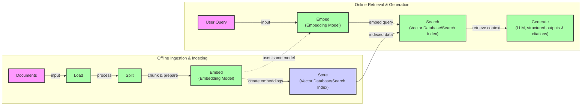
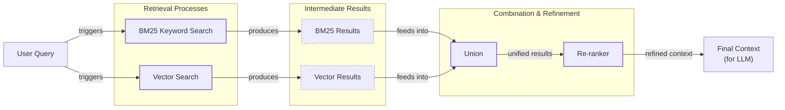
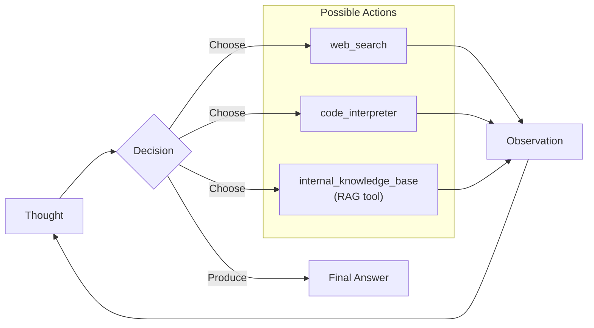

# Lesson 9: Retrieval-Augmented Generation

In our previous lessons, we explored the foundational skills of AI Engineering. We covered Context Engineering, the art of managing information flow to an LLM, and saw how to implement ReAct agents that can reason and plan. Now, we will tackle one of the most critical components in building knowledgeable AI systems: Retrieval-Augmented Generation (RAG).

LLMs are trained on fixed datasets, which means their knowledge is static and they can't access information created after their training cutoff. They are essentially taking a "closed-book exam" on the world's information. When faced with questions about recent events or private company documents, they are prone to hallucination, confidently inventing plausible but incorrect answers. While fine-tuning can update a model, it is an expensive and inefficient way to teach it new facts.

RAG offers a more practical solution. Instead of relying only on its internal knowledge, we give the LLM an "open-book exam." We connect it to external, real-time knowledge sources, allowing it to retrieve relevant information on the fly. This is similar to how we as humans operate; we do not memorize everything but instead use manuals, notes, and search engines to find what we need. RAG is a core method AI Engineers use within the broader discipline of Context Engineering, which we introduced in Lesson 3, to build grounded and reliable applications.

In this lesson, we will explore the fundamentals of RAG, from its core components to the advanced and agentic patterns that power modern AI systems. We will also see how retrieval complements the agent memory systems we will discuss in Lesson 10.

## The RAG System: Core Components

To design effective RAG systems, you first need to understand their three conceptual pillars. This knowledge is a key part of the Context Engineering process we discussed in Lesson 3, as it helps you structure how information is found and presented to the LLM.

- **Retrieval:** This is the engine responsible for finding relevant information. The process typically starts by converting both the user's query and the documents in your knowledge base into numerical representations called vector embeddings. These embeddings capture the semantic meaning of the text. They are stored in a specialized vector database that allows for efficient semantic similarity searches, finding the document chunks whose meanings are closest to the query's meaning [[8]](https://qdrant.tech/articles/what-is-rag-in-ai/), [[52]](https://medium.com/@robi.tomar72/how-rag-actually-works-embeddings-vector-databases-indexing-retrieval-explained-simply-3d1ca45fe1bf). This can be supplemented with traditional keyword-based search methods like BM25, which excel at finding exact matches [[38]](https://mlpills.substack.com/p/issue-76-optimize-rag-with-hybrid).

- **Augmentation:** Once the most relevant pieces of information are retrieved, they are assembled and injected into the prompt alongside the original user query [[27]](https://www.aimon.ai/posts/rag_and_its_different_components/), [[56]](https://www.topquadrant.com/resources/blog-retrieval-augmented-generation-explained/). This step "augments" the LLM's knowledge with external context, giving it the specific facts it needs to form a grounded response.

- **Generation:** In the final step, the LLM receives the augmented prompt. It then synthesizes the retrieved information to generate a coherent, context-aware answer. The goal is for the model to base its response on the provided data, reducing the risk of hallucination and allowing it to cite its sources [[26]](https://humanloop.com/blog/rag-architectures).

```mermaid
flowchart LR
  "User's Query" -- "sends" --> "Retriever"
  "Retriever" -- "passes info to" --> "Augmentation"
  "Augmentation" -- "feeds into" --> "Generator"
  "Generator" -- "produces" --> "Answer"
```
Image 1: A flowchart illustrating the conceptual flow of a RAG system's core components.

Understanding these three components is the first step. Now that you can name each moving part, let’s see how they line up across the two phases of a real system.

## The RAG Pipeline: Ingestion and Retrieval

An end-to-end RAG workflow is typically split into two distinct phases: an offline pipeline for preparing data and an online pipeline for answering user queries in real-time [[32]](https://newsletter.systemdesign.one/p/how-rag-works), [[33]](https://towardsdatascience.com/ragops-guide-building-and-scaling-retrieval-augmented-generation-systems-3d26b3ebd627/).

### Phase 1: Offline Ingestion & Indexing

This phase prepares your knowledge base for efficient retrieval. It is an offline process that you run whenever your source documents are added or updated.

1.  **Load:** The pipeline begins by loading your documents from various sources, which could be anything from PDFs and web pages to APIs and databases.
2.  **Split:** Large documents are broken down into smaller, semantically meaningful chunks. This is a critical step because if chunks are too large, they can contain irrelevant noise, and if they are too small, they can lack sufficient context. The goal is to create chunks that represent coherent ideas.
3.  **Embed:** Each chunk of text is passed through an embedding model, which converts it into a vector embedding. This numerical representation captures the semantic meaning of the text.
4.  **Store:** The embeddings and their corresponding text chunks are loaded into a vector database or a search index. This specialized database is optimized for performing fast similarity searches across millions or even billions of vectors [[6]](https://pub.towardsai.net/vector-databases-in-practice-building-a-realistic-hybrid-search-rag-system-with-qdrant-7b8f4a6e41e0), [[31]](https://medium.com/@derrickryangiggs/rag-pipeline-deep-dive-ingestion-chunking-embedding-and-vector-search-abd3c8bfc177/).

### Phase 2: Online Retrieval & Generation

This phase happens in real-time when a user interacts with your system.

1.  **Query:** The user submits a query to the system.
2.  **Embed:** The user's query is converted into a vector embedding using the *same* embedding model from the ingestion phase. This ensures the query and document vectors exist in the same semantic space, making them comparable [[8]](https://qdrant.tech/articles/what-is-rag-in-ai/).
3.  **Search:** The query vector is used to search the vector database. The system retrieves the top-k most similar document chunks based on a distance metric like cosine similarity [[54]](https://towardsdatascience.com/rag-explained-understanding-embeddings-similarity-and-retrieval/).
4.  **Generate:** The retrieved chunks are combined with the original query and a set of instructions into a single prompt. This augmented prompt is then passed to an LLM, which generates a final, grounded answer. To ensure the response is verifiable, you can instruct the model to include citations, and as we saw in Lesson 4, you can use structured outputs to format the final answer predictably.


Image 2: A detailed flowchart showing the end-to-end RAG workflow, split into two distinct phases: 'Offline Ingestion & Indexing' and 'Online Retrieval & Generation'.

With the end-to-end path in place, the next question is quality. What are the advanced techniques to make retrieval more accurate and useful across messy, real-world data?

## Advanced RAG Techniques

A naive RAG pipeline is a good start, but production systems require more sophisticated techniques to handle the complexities of real-world data and user queries. Here are some of the most effective methods for improving retrieval performance.

### Hybrid Search

Vector search is great at understanding semantic meaning, but it can miss queries that rely on specific keywords, product codes, or jargon. **Hybrid search** addresses this by combining dense (vector) retrieval with sparse (keyword-based) retrieval methods like BM25 [[39]](https://cubitrek.com/blog/hybrid-search-optimization-how-bm25-and-dense-vector-retrieval-work-together-for-superior-ai-search/). For example, if a user asks about "my bill rollover," a keyword search will find documents with the exact term "rollover," while a vector search can find related concepts like "carryover balance." By fusing the results of both searches, the system provides more comprehensive coverage [[38]](https://mlpills.substack.com/p/issue-76-optimize-rag-with-hybrid), [[40]](https://community.netapp.com/t5/Tech-ONTAP-Blogs/Hybrid-RAG-in-the-Real-World-Graphs-BM25-and-the-End-of-Black-Box-Retrieval/ba-p/464834).

### Re-ranking

The initial retrieval step is optimized for speed and recall, meaning it casts a wide net to find potentially relevant documents. However, the initial ranking may not be perfect. **Re-ranking** introduces a second, more precise model, often a cross-encoder, to re-evaluate the top candidates from the initial retrieval [[43]](https://apxml.com/courses/optimizing-rag-for-production/chapter-2-advanced-retrieval-optimization/reranking-architectures-rag). Unlike the first-stage model that embeds the query and documents separately, a cross-encoder processes the query and each document *together*, allowing for a deeper assessment of relevance. This significantly improves the quality of the context passed to the LLM [[42]](https://redis.io/blog/10-techniques-to-improve-rag-accuracy/).

### Query Transformations

Sometimes, the user's original query is not the best one for searching a knowledge base. **Query transformation** techniques rewrite or expand the query to improve retrieval results.

-   **Decomposition** breaks a complex, multi-part question into smaller, focused sub-queries [[19]](https://docs.nvidia.com/rag/latest/query_decomposition.html). For instance, "What’s our travel policy for conferences in Europe this year?" could be broken into separate queries about the general travel policy, conference-specific rules, European guidelines, and recent changes. Each sub-query is executed independently, and the results are merged.
-   **Hypothetical Document Embeddings (HyDE)** addresses the mismatch between the language of questions and the language of answers. It uses an LLM to generate a hypothetical, ideal answer to the user's query first. The embedding of this *hypothetical document* is then used for the vector search, which often yields more relevant results than the embedding of the original, shorter query [[16]](https://47billion.com/blog/rag-system-in-production-why-it-fails-and-how-to-fix-it/).

### Advanced Chunking Strategies

Fixed-size chunking is simple but often breaks documents in awkward places, separating related ideas. Advanced strategies create more coherent chunks. **Semantic chunking** splits text based on topical shifts, ensuring each chunk contains a single, complete idea [[17]](https://sarthakai.substack.com/p/improve-your-rag-accuracy-with-a), [[18]](https://cloudurable.com/blog/advanced-rag-techniques-that-will-transform-your-l/). **Layout-aware chunking** is essential for documents like PDFs, where structure (tables, headers, pages) carries meaning. For example, it keeps table rows intact instead of splitting them arbitrarily.

### GraphRAG

For questions about complex relationships, standard document retrieval can fall short. **GraphRAG** builds a knowledge graph from the source documents, extracting entities and their relationships [[46]](https://arxiv.org/html/2601.03014v1). Instead of searching for text similarity, it traverses this graph to answer multi-hop questions. For example, to answer, "Which incidents were caused by weekend deploys that also touched the login service?" the system can navigate connections between change records, deployment times, affected services, and incident tickets to synthesize an answer that would be nearly impossible to assemble from disconnected text chunks [[50]](https://arxiv.org/html/2501.00309v2), [[48]](https://webhome.cs.uvic.ca/~thomo/papers/asonam2025-graphrag.pdf).


Image 3: A flowchart illustrating the hybrid retrieval flow, starting from a user query, through parallel BM25 and vector searches, result union, re-ranking, and finally generating the final context for an LLM.

These techniques significantly increase retrieval quality. Next, we will see how retrieval becomes one of many tools that an agent can choose to use as it reasons.

## Agentic RAG

In Lessons 7 and 8, we learned about the ReAct framework, where an agent cycles through Thought, Action, and Observation to solve problems. **Agentic RAG** is the application of this principle, where retrieval is not a fixed step in a pipeline but a tool that a reasoning agent can choose to use.

The core distinction is the shift from a static workflow to a dynamic control loop [[11]](https://towardsdatascience.com/agentic-rag-vs-classic-rag-from-a-pipeline-to-a-control-loop/).

-   **Standard RAG** is a linear, pre-determined process: Retrieve → Augment → Generate. It is powerful but rigid, following the same path for every query.
-   **Agentic RAG** is adaptive and iterative. An agent, powered by an LLM, decides *if*, *when*, and *how* to retrieve information. It can reason about its knowledge gaps and actively seek out information until it has enough context to provide a confident answer.

This agentic approach unlocks several new capabilities. The agent can **iteratively** use its RAG tool, refining a query based on initial, partial results. It can **choose** which knowledge source to search, for example, deciding between `search_tech_docs` and `search_emails` based on the query's content. It can also **fuse** information from its internal RAG tool with data from other tools, like a web search, to form a more comprehensive answer [[12]](https://www.pingcap.com/article/agentic-rag-vs-traditional-rag-key-differences-benefits/), [[13]](https://medium.com/@gaddam.rahul.kumar/agentic-rag-vs-traditional-rag-b1a156f72167).

Consider a brief "thought process" for an agent handling a complex query:

*   **Thought:** The user is asking about our '2024 EU data retention rules.' My internal policy documents mention 2023 rules and reference upcoming amendments, but lack specifics. The information is likely outdated.
*   **Action:** `retrieve(internal_policy, query="EU data retention 2024")`
*   **Observation:** The retrieved text confirms amendments were planned but provides no citations for the final rules.
*   **Thought:** I need external verification to find the official 2024 directive.
*   **Action:** `web_search(query="official EU data retention directive 2024")`
*   **Observation:** The search returns a link to the official EU legislation portal with the updated directive.
*   **Thought:** I now have both the internal context and the external, verifiable source. I will synthesize these, highlight the changes from the 2023 policy, and cite both sources.

This transforms RAG from a simple database lookup into a conversation with a knowledgeable research assistant who can navigate multiple sources and reconcile information.


Image 4: A conceptual flowchart showing an agent's main loop, demonstrating its ability to choose between various tools.

You now understand both a linear RAG pipeline and how an agent can control retrieval when needed. Let’s wrap up by situating RAG in the wider AI Engineering toolkit and previewing what comes next.

## Conclusion

We have covered the essentials of Retrieval-Augmented Generation, from its core components to advanced, agentic implementations. RAG is the industry's most widely adopted solution to the LLM's inherent knowledge limitations. By grounding models in external data, we can significantly reduce hallucinations, enable customization with proprietary information, and build user trust through verifiable, source-backed answers [[3]](https://www.infoworld.com/article/2335043/addressing-ai-hallucinations-with-retrieval-augmented-generation.html), [[1]](https://neo4j.com/blog/developer/fine-tuning-vs-rag/). As research shows, RAG is consistently a more reliable and flexible choice for knowledge injection than fine-tuning [[4]](https://aclanthology.org/2024.emnlp-main.15.pdf), [[5]](https://arxiv.org/html/2312.05934v3).

The future of knowledge retrieval is agentic, where RAG is not just a static pipeline but a dynamic tool that intelligent agents can use as part of a broader reasoning process [[25]](https://www.madrona.com/rag-inventor-talks-agents-grounded-ai-and-enterprise-impact/), [[21]](https://medium.com/@fahey_james/retrieval-augmented-generation-building-grounded-ai-for-enterprise-knowledge-6bc46277fee5). For the modern AI Engineer, mastering RAG is a foundational competency and a key pillar of Context Engineering.

In our next lesson, we will explore Memory for Agents, and see how short-term and long-term memory systems work alongside retrieval to create agents that can learn and adapt over time. Later in the course, we will also cover how to properly evaluate and monitor these complex systems in production.

## References

- [1] https://neo4j.com/blog/developer/fine-tuning-vs-rag/
- [2] https://www.topquadrant.com/resources/blog-retrieval-augmented-generation-explained/
- [3] https://www.infoworld.com/article/2335043/addressing-ai-hallucinations-with-retrieval-augmented-generation.html
- [4] https://aclanthology.org/2024.emnlp-main.15.pdf
- [5] https://arxiv.org/html/2312.05934v3
- [6] https://pub.towardsai.net/vector-databases-in-practice-building-a-realistic-hybrid-search-rag-system-with-qdrant-7b8f4a6e41e0
- [7] https://www.promptingguide.ai/research/rag
- [8] https://qdrant.tech/articles/what-is-rag-in-ai/
- [9] https://wandb.ai/mostafaibrahim17/ml-articles/reports/Vector-Embeddings-in-RAG-Applications--Vmlldzo3OTk1NDA5
- [10] https://medium.com/@tejpal.abhyuday/retrieval-augmented-generation-rag-from-basics-to-advanced-a2b068fd576c
- [11] https://towardsdatascience.com/agentic-rag-vs-classic-rag-from-a-pipeline-to-a-control-loop/
- [12] https://www.pingcap.com/article/agentic-rag-vs-traditional-rag-key-differences-benefits/
- [13] https://medium.com/@gaddam.rahul.kumar/agentic-rag-vs-traditional-rag-b1a156f72167
- [14] https://www.ibm.com/think/topics/retrieval-augmented-generation
- [15] https://www.ibm.com/think/topics/agentic-rag
- [16] https://47billion.com/blog/rag-system-in-production-why-it-fails-and-how-to-fix-it/
- [17] https://sarthakai.substack.com/p/improve-your-rag-accuracy-with-a
- [18] https://cloudurable.com/blog/advanced-rag-techniques-that-will-transform-your-l/
- [19] https://docs.nvidia.com/rag/latest/query_decomposition.html
- [20] https://neo4j.com/blog/genai/advanced-rag-techniques/
- [21] https://medium.com/@fahey_james/retrieval-augmented-generation-building-grounded-ai-for-enterprise-knowledge-6bc46277fee5
- [22] https://decodingml.substack.com/p/rag-fundamentals-first?utm_source=publication-search
- [23] https://decodingml.substack.com/p/your-rag-is-wrong-heres-how-to-fix?utm_source=publication-search
- [24] https://weaviate.io/blog/what-is-agentic-rag
- [25] https://www.madrona.com/rag-inventor-talks-agents-grounded-ai-and-enterprise-impact/
- [26] https://humanloop.com/blog/rag-architectures
- [27] https://www.aimon.ai/posts/rag_and_its_different_components/
- [28] https://blogs.nvidia.com/blog/what-is-retrieval-augmented-generation/
- [29] https://www.ibm.com/think/topics/retrieval-augmented-generation
- [30] https://www.llamaindex.ai/blog/rag-is-dead-long-live-agentic-retrieval
- [31] https://medium.com/@derrickryangiggs/rag-pipeline-deep-dive-ingestion-chunking-embedding-and-vector-search-abd3c8bfc177
- [32] https://newsletter.systemdesign.one/p/how-rag-works
- [33] https://towardsdatascience.com/ragops-guide-building-and-scaling-retrieval-augmented-generation-systems-3d26b3ebd627/
- [34] https://learn.microsoft.com/en-us/azure/developer/ai/advanced-retrieval-augmented-generation
- [35] https://aws.amazon.com/what-is/retrieval-augmented-generation/
- [36] https://www.anthropic.com/news/contextual-retrieval
- [37] https://highlearningrate.substack.com/p/the-rise-of-rag
- [38] https://mlpills.substack.com/p/issue-76-optimize-rag-with-hybrid
- [39] https://cubitrek.com/blog/hybrid-search-optimization-how-bm25-and-dense-vector-retrieval-work-together-for-superior-ai-search/
- [40] https://community.netapp.com/t5/Tech-ONTAP-Blogs/Hybrid-RAG-in-the-Real-World-Graphs-BM25-and-the-End-of-Black-Box-Retrieval/ba-p/464834
- [41] https://arxiv.org/html/2407.00072v5
- [42] https://redis.io/blog/10-techniques-to-improve-rag-accuracy/
- [43] https://apxml.com/courses/optimizing-rag-for-production/chapter-2-advanced-retrieval-optimization/reranking-architectures-rag
- [44] https://neo4j.com/blog/genai/advanced-rag-techniques/
- [45] https://towardsdatascience.com/advanced-rag-retrieval-cross-encoders-reranking/
- [46] https://arxiv.org/html/2601.03014v1
- [47] https://arxiv.org/html/2404.16130
- [48] https://webhome.cs.uvic.ca/~thomo/papers/asonam2025-graphrag.pdf
- [49] https://towardsai.net/p/l/a-complete-guide-to-rag
- [50] https://arxiv.org/html/2501.00309v2
- [51] https://www.youtube.com/watch?v=bZQun8Y4L2A
- [52] https://medium.com/@robi.tomar72/how-rag-actually-works-embeddings-vector-databases-indexing-retrieval-explained-simply-3d1ca45fe1bf
- [53] https://learnopencv.com/vector-db-and-rag-pipeline-for-document-rag/
- [54] https://towardsdatascience.com/rag-explained-understanding-embeddings-similarity-and-retrieval/
- [55] https://www.reddit.com/r/ArtificialInteligence/comments/1co90z4/comment/l3ci9cd/?utm_source=share&utm_medium=web3x&utm_name=web3xcss&utm_term=1&utm_content=share_button
- [56] https://www.topquadrant.com/resources/blog-retrieval-augmented-generation-explained/
- [57] https://www.youtube.com/watch?v=bZQun8Y4L2A
- [58] https://www.reddit.com/r/ArtificialInteligence/comments/1co90z4/comment/l3ci9cd/?utm_source=share&utm_medium=web3x&utm_name=web3xcss&utm_term=1&utm_content=share_button
- [59] https://www.promptingguide.ai/research/rag
- [60] https://medium.com/@tejpal.abhyuday/retrieval-augmented-generation-rag-from-basics-to-advanced-a2b068fd576c# Lesson 9: Retrieval-Augmented Generation

In our previous lessons, we explored the foundational skills of AI Engineering. We covered Context Engineering, the art of managing information flow to an LLM, and saw how to implement ReAct agents that can reason and plan. Now, we will tackle one of the most critical components in building knowledgeable AI systems: Retrieval-Augmented Generation (RAG).

LLMs are trained on fixed datasets, which means their knowledge is static and they can't access information created after their training cutoff. They are essentially taking a "closed-book exam" on the world's information. When faced with questions about recent events or private company documents, they are prone to hallucination, confidently inventing plausible but incorrect answers. While fine-tuning can update a model, it is an expensive and inefficient way to teach it new facts.

RAG offers a more practical solution. Instead of relying only on its internal knowledge, we give the LLM an "open-book exam." We connect it to external, real-time knowledge sources, allowing it to retrieve relevant information on the fly. This is similar to how we as humans operate; we do not memorize everything but instead use manuals, notes, and search engines to find what we need. RAG is a core method AI Engineers use within the broader discipline of Context Engineering, which we introduced in Lesson 3, to build grounded and reliable applications.

In this lesson, we will explore the fundamentals of RAG, from its core components to the advanced and agentic patterns that power modern AI systems. We will also see how retrieval complements the agent memory systems we will discuss in Lesson 10.

## The RAG System: Core Components

To design effective RAG systems, you first need to understand their three conceptual pillars. This knowledge is a key part of the Context Engineering process we discussed in Lesson 3, as it helps you structure how information is found and presented to the LLM.

-   **Retrieval:** This is the engine responsible for finding relevant information. The process typically starts by converting both the user's query and the documents in your knowledge base into numerical representations called vector embeddings. These embeddings capture the semantic meaning of the text. They are stored in a specialized vector database that allows for efficient semantic similarity searches, finding the document chunks whose meanings are closest to the query's meaning [[8]](https://qdrant.tech/articles/what-is-rag-in-ai/), [[52]](https://medium.com/@robi.tomar72/how-rag-actually-works-embeddings-vector-databases-indexing-retrieval-explained-simply-3d1ca45fe1bf). This can be supplemented with traditional keyword-based search methods like BM25, which excel at finding exact matches [[38]](https://mlpills.substack.com/p/issue-76-optimize-rag-with-hybrid).

-   **Augmentation:** Once the most relevant pieces of information are retrieved, they are assembled and injected into the prompt alongside the original user query [[27]](https://www.aimon.ai/posts/rag_and_its_different_components/), [[56]](https://www.topquadrant.com/resources/blog-retrieval-augmented-generation-explained/). This step "augments" the LLM's knowledge with external context, giving it the specific facts it needs to form a grounded response.

-   **Generation:** In the final step, the LLM receives the augmented prompt. It then synthesizes the retrieved information to generate a coherent, context-aware answer. The goal is for the model to base its response on the provided data, reducing the risk of hallucination and allowing it to cite its sources [[26]](https://humanloop.com/blog/rag-architectures).

```mermaid
flowchart LR
  "User's Query" -- "sends" --> "Retriever"
  "Retriever" -- "passes info to" --> "Augmentation"
  "Augmentation" -- "feeds into" --> "Generator"
  "Generator" -- "produces" --> "Answer"
```
Image 1: A flowchart illustrating the conceptual flow of a RAG system's core components.

Understanding these three components is the first step. Now that you can name each moving part, let’s see how they line up across the two phases of a real system.

## The RAG Pipeline: Ingestion and Retrieval

An end-to-end RAG workflow is typically split into two distinct phases: an offline pipeline for preparing data and an online pipeline for answering user queries in real-time [[32]](https://newsletter.systemdesign.one/p/how-rag-works), [[33]](https://towardsdatascience.com/ragops-guide-building-and-scaling-retrieval-augmented-generation-systems-3d26b3ebd627/).

### Phase 1: Offline Ingestion & Indexing

This phase prepares your knowledge base for efficient retrieval. It is an offline process that you run whenever your source documents are added or updated.

1.  **Load:** The pipeline begins by loading your documents from various sources, which could be anything from PDFs and web pages to APIs and databases.
2.  **Split:** Large documents are broken down into smaller, semantically meaningful chunks. This is a critical step because if chunks are too large, they can contain irrelevant noise, and if they are too small, they can lack sufficient context. The goal is to create chunks that represent coherent ideas.
3.  **Embed:** Each chunk of text is passed through an embedding model, which converts it into a vector embedding. This numerical representation captures the semantic meaning of the text.
4.  **Store:** The embeddings and their corresponding text chunks are loaded into a vector database or a search index. This specialized database is optimized for performing fast similarity searches across millions or even billions of vectors [[6]](https://pub.towardsai.net/vector-databases-in-practice-building-a-realistic-hybrid-search-rag-system-with-qdrant-7b8f4a6e41e0), [[31]](https://medium.com/@derrickryangiggs/rag-pipeline-deep-dive-ingestion-chunking-embedding-and-vector-search-abd3c8bfc177/).

### Phase 2: Online Retrieval & Generation

This phase happens in real-time when a user interacts with your system.

1.  **Query:** The user submits a query to the system.
2.  **Embed:** The user's query is converted into a vector embedding using the *same* embedding model from the ingestion phase. This ensures the query and document vectors exist in the same semantic space, making them comparable [[8]](https://qdrant.tech/articles/what-is-rag-in-ai/).
3.  **Search:** The query vector is used to search the vector database. The system retrieves the top-k most similar document chunks based on a distance metric like cosine similarity [[54]](https://towardsdatascience.com/rag-explained-understanding-embeddings-similarity-and-retrieval/).
4.  **Generate:** The retrieved chunks are combined with the original query and a set of instructions into a single prompt. This augmented prompt is then passed to an LLM, which generates a final, grounded answer. To ensure the response is verifiable, you can instruct the model to include citations, and as we saw in Lesson 4, you can use structured outputs to format the final answer predictably.


Image 2: A detailed flowchart showing the end-to-end RAG workflow, split into two distinct phases: 'Offline Ingestion & Indexing' and 'Online Retrieval & Generation'.

With the end-to-end path in place, the next question is quality. What are the advanced techniques to make retrieval more accurate and useful across messy, real-world data?

## Advanced RAG Techniques

A naive RAG pipeline is a good start, but production systems require more sophisticated techniques to handle the complexities of real-world data and user queries. Here are some of the most effective methods for improving retrieval performance.

### Hybrid Search

Vector search is great at understanding semantic meaning, but it can miss queries that rely on specific keywords, product codes, or jargon. **Hybrid search** addresses this by combining dense (vector) retrieval with sparse (keyword-based) retrieval methods like BM25 [[39]](https://cubitrek.com/blog/hybrid-search-optimization-how-bm25-and-dense-vector-retrieval-work-together-for-superior-ai-search/). For example, if a user asks about "my bill rollover," a keyword search will find documents with the exact term "rollover," while a vector search can find related concepts like "carryover balance." By fusing the results of both searches, the system provides more comprehensive coverage [[38]](https://mlpills.substack.com/p/issue-76-optimize-rag-with-hybrid), [[40]](https://community.netapp.com/t5/Tech-ONTAP-Blogs/Hybrid-RAG-in-the-Real-World-Graphs-BM25-and-the-End-of-Black-Box-Retrieval/ba-p/464834).

### Re-ranking

The initial retrieval step is optimized for speed and recall, meaning it casts a wide net to find potentially relevant documents. However, the initial ranking may not be perfect. **Re-ranking** introduces a second, more precise model, often a cross-encoder, to re-evaluate the top candidates from the initial retrieval [[43]](https://apxml.com/courses/optimizing-rag-for-production/chapter-2-advanced-retrieval-optimization/reranking-architectures-rag). Unlike the first-stage model that embeds the query and documents separately, a cross-encoder processes the query and each document *together*, allowing for a deeper assessment of relevance. This significantly improves the quality of the context passed to the LLM [[42]](https://redis.io/blog/10-techniques-to-improve-rag-accuracy/).

### Query Transformations

Sometimes, the user's original query is not the best one for searching a knowledge base. **Query transformation** techniques rewrite or expand the query to improve retrieval results.

-   **Decomposition** breaks a complex, multi-part question into smaller, focused sub-queries [[19]](https://docs.nvidia.com/rag/latest/query_decomposition.html). For instance, "What’s our travel policy for conferences in Europe this year?" could be broken into separate queries about the general travel policy, conference-specific rules, European guidelines, and recent changes. Each sub-query is executed independently, and the results are merged.
-   **Hypothetical Document Embeddings (HyDE)** addresses the mismatch between the language of questions and the language of answers. It uses an LLM to generate a hypothetical, ideal answer to the user's query first. The embedding of this *hypothetical document* is then used for the vector search, which often yields more relevant results than the embedding of the original, shorter query [[16]](https://47billion.com/blog/rag-system-in-production-why-it-fails-and-how-to-fix-it/).

### Advanced Chunking Strategies

Fixed-size chunking is simple but often breaks documents in awkward places, separating related ideas. Advanced strategies create more coherent chunks. **Semantic chunking** splits text based on topical shifts, ensuring each chunk contains a single, complete idea [[17]](https://sarthakai.substack.com/p/improve-your-rag-accuracy-with-a), [[18]](https://cloudurable.com/blog/advanced-rag-techniques-that-will-transform-your-l/). **Layout-aware chunking** is essential for documents like PDFs, where structure (tables, headers, pages) carries meaning. For example, it keeps table rows intact instead of splitting them arbitrarily.

### GraphRAG

For questions about complex relationships, standard document retrieval can fall short. **GraphRAG** builds a knowledge graph from the source documents, extracting entities and their relationships [[46]](https://arxiv.org/html/2601.03014v1). Instead of searching for text similarity, it traverses this graph to answer multi-hop questions. For example, to answer, "Which incidents were caused by weekend deploys that also touched the login service?" the system can navigate connections between change records, deployment times, affected services, and incident tickets to synthesize an answer that would be nearly impossible to assemble from disconnected text chunks [[50]](https://arxiv.org/html/2501.00309v2), [[48]](https://webhome.cs.uvic.ca/~thomo/papers/asonam2025-graphrag.pdf).


Image 3: A flowchart illustrating the hybrid retrieval flow, starting from a user query, through parallel BM25 and vector searches, result union, re-ranking, and finally generating the final context for an LLM.

These techniques significantly increase retrieval quality. Next, we will see how retrieval becomes one of many tools that an agent can choose to use as it reasons.

## Agentic RAG

In Lessons 7 and 8, we learned about the ReAct framework, where an agent cycles through Thought, Action, and Observation to solve problems. **Agentic RAG** is the application of this principle, where retrieval is not a fixed step in a pipeline but a tool that a reasoning agent can choose to use.

The core distinction is the shift from a static workflow to a dynamic control loop [[11]](https://towardsdatascience.com/agentic-rag-vs-classic-rag-from-a-pipeline-to-a-control-loop/).

-   **Standard RAG** is a linear, pre-determined process: Retrieve → Augment → Generate. It is powerful but rigid, following the same path for every query.
-   **Agentic RAG** is adaptive and iterative. An agent, powered by an LLM, decides *if*, *when*, and *how* to retrieve information. It can reason about its knowledge gaps and actively seek out information until it has enough context to provide a confident answer.

This agentic approach unlocks several new capabilities. The agent can **iteratively** use its RAG tool, refining a query based on initial, partial results. It can **choose** which knowledge source to search, for example, deciding between `search_tech_docs` and `search_emails` based on the query's content. It can also **fuse** information from its internal RAG tool with data from other tools, like a web search, to form a more comprehensive answer [[12]](https://www.pingcap.com/article/agentic-rag-vs-traditional-rag-key-differences-benefits/), [[13]](https://medium.com/@gaddam.rahul.kumar/agentic-rag-vs-traditional-rag-b1a156f72167).

Consider a brief "thought process" for an agent handling a complex query:

*   **Thought:** The user is asking about our '2024 EU data retention rules.' My internal policy documents mention 2023 rules and reference upcoming amendments, but lack specifics. The information is likely outdated.
*   **Action:** `retrieve(internal_policy, query="EU data retention 2024")`
*   **Observation:** The retrieved text confirms amendments were planned but provides no citations for the final rules.
*   **Thought:** I need external verification to find the official 2024 directive.
*   **Action:** `web_search(query="official EU data retention directive 2024")`
*   **Observation:** The search returns a link to the official EU legislation portal with the updated directive.
*   **Thought:** I now have both the internal context and the external, verifiable source. I will synthesize these, highlight the changes from the 2023 policy, and cite both sources.

This transforms RAG from a simple database lookup into a conversation with a knowledgeable research assistant who can navigate multiple sources and reconcile information.


Image 4: A conceptual flowchart showing an agent's main loop, demonstrating its ability to choose between various tools.

You now understand both a linear RAG pipeline and how an agent can control retrieval when needed. Let’s wrap up by situating RAG in the wider AI Engineering toolkit and previewing what comes next.

## Conclusion

We have covered the essentials of Retrieval-Augmented Generation, from its core components to advanced, agentic implementations. RAG is the industry's most widely adopted solution to the LLM's inherent knowledge limitations. By grounding models in external data, we can significantly reduce hallucinations, enable customization with proprietary information, and build user trust through verifiable, source-backed answers [[3]](https://www.infoworld.com/article/2335043/addressing-ai-hallucinations-with-retrieval-augmented-generation.html), [[1]](https://neo4j.com/blog/developer/fine-tuning-vs-rag/). As research shows, RAG is consistently a more reliable and flexible choice for knowledge injection than fine-tuning [[4]](https://aclanthology.org/2024.emnlp-main.15.pdf), [[5]](https://arxiv.org/html/2312.05934v3).

The future of knowledge retrieval is agentic, where RAG is not just a static pipeline but a dynamic tool that intelligent agents can use as part of a broader reasoning process [[25]](https://www.madrona.com/rag-inventor-talks-agents-grounded-ai-and-enterprise-impact/), [[21]](https://medium.com/@fahey_james/retrieval-augmented-generation-building-grounded-ai-for-enterprise-knowledge-6bc46277fee5). For the modern AI Engineer, mastering RAG is a foundational competency and a key pillar of Context Engineering.

In our next lesson, we will explore Memory for Agents, and see how short-term and long-term memory systems work alongside retrieval to create agents that can learn and adapt over time. Later in the course, we will also cover how to properly evaluate and monitor these complex systems in production.

## References

- [1] https://neo4j.com/blog/developer/fine-tuning-vs-rag/
- [2] https://www.topquadrant.com/resources/blog-retrieval-augmented-generation-explained/
- [3] https://www.infoworld.com/article/2335043/addressing-ai-hallucinations-with-retrieval-augmented-generation.html
- [4] https://aclanthology.org/2024.emnlp-main.15.pdf
- [5] https://arxiv.org/html/2312.05934v3
- [6] https://pub.towardsai.net/vector-databases-in-practice-building-a-realistic-hybrid-search-rag-system-with-qdrant-7b8f4a6e41e0
- [7] https://www.promptingguide.ai/research/rag
- [8] https://qdrant.tech/articles/what-is-rag-in-ai/
- [9] https://wandb.ai/mostafaibrahim17/ml-articles/reports/Vector-Embeddings-in-RAG-Applications--Vmlldzo3OTk1NDA5
- [10] https://medium.com/@tejpal.abhyuday/retrieval-augmented-generation-rag-from-basics-to-advanced-a2b068fd576c
- [11] https://towardsdatascience.com/agentic-rag-vs-classic-rag-from-a-pipeline-to-a-control-loop/
- [12] https://www.pingcap.com/article/agentic-rag-vs-traditional-rag-key-differences-benefits/
- [13] https://medium.com/@gaddam.rahul.kumar/agentic-rag-vs-traditional-rag-b1a156f72167
- [14] https://www.ibm.com/think/topics/retrieval-augmented-generation
- [15] https://www.ibm.com/think/topics/agentic-rag
- [16] https://47billion.com/blog/rag-system-in-production-why-it-fails-and-how-to-fix-it/
- [17] https://sarthakai.substack.com/p/improve-your-rag-accuracy-with-a
- [18] https://cloudurable.com/blog/advanced-rag-techniques-that-will-transform-your-l/
- [19] https://docs.nvidia.com/rag/latest/query_decomposition.html
- [20] https://neo4j.com/blog/genai/advanced-rag-techniques/
- [21] https://medium.com/@fahey_james/retrieval-augmented-generation-building-grounded-ai-for-enterprise-knowledge-6bc46277fee5
- [22] https://decodingml.substack.com/p/rag-fundamentals-first?utm_source=publication-search
- [23] https://decodingml.substack.com/p/your-rag-is-wrong-heres-how-to-fix?utm_source=publication-search
- [24] https://weaviate.io/blog/what-is-agentic-rag
- [25] https://www.madrona.com/rag-inventor-talks-agents-grounded-ai-and-enterprise-impact/
- [26] https://humanloop.com/blog/rag-architectures
- [27] https://www.aimon.ai/posts/rag_and_its_different_components/
- [28] https://blogs.nvidia.com/blog/what-is-retrieval-augmented-generation/
- [29] https://www.ibm.com/think/topics/retrieval-augmented-generation
- [30] https://www.llamaindex.ai/blog/rag-is-dead-long-live-agentic-retrieval
- [31] https://medium.com/@derrickryangiggs/rag-pipeline-deep-dive-ingestion-chunking-embedding-and-vector-search-abd3c8bfc177
- [32] https://newsletter.systemdesign.one/p/how-rag-works
- [33] https://towardsdatascience.com/ragops-guide-building-and-scaling-retrieval-augmented-generation-systems-3d26b3ebd627/
- [34] https://learn.microsoft.com/en-us/azure/developer/ai/advanced-retrieval-augmented-generation
- [35] https://aws.amazon.com/what-is/retrieval-augmented-generation/
- [36] https://www.anthropic.com/news/contextual-retrieval
- [37] https://highlearningrate.substack.com/p/the-rise-of-rag
- [38] https://mlpills.substack.com/p/issue-76-optimize-rag-with-hybrid
- [39] https://cubitrek.com/blog/hybrid-search-optimization-how-bm25-and-dense-vector-retrieval-work-together-for-superior-ai-search/
- [40] https://community.netapp.com/t5/Tech-ONTAP-Blogs/Hybrid-RAG-in-the-Real-World-Graphs-BM25-and-the-End-of-Black-Box-Retrieval/ba-p/464834
- [41] https://arxiv.org/html/2407.00072v5
- [42] https://redis.io/blog/10-techniques-to-improve-rag-accuracy/
- [43] https://apxml.com/courses/optimizing-rag-for-production/chapter-2-advanced-retrieval-optimization/reranking-architectures-rag
- [44] https://neo4j.com/blog/genai/advanced-rag-techniques/
- [45] https://towardsdatascience.com/advanced-rag-retrieval-cross-encoders-reranking/
- [46] https://arxiv.org/html/2601.03014v1
- [47] https://arxiv.org/html/2404.16130
- [48] https://webhome.cs.uvic.ca/~thomo/papers/asonam2025-graphrag.pdf
- [49] https://towardsai.net/p/l/a-complete-guide-to-rag
- [50] https://arxiv.org/html/2501.00309v2
- [51] https://www.youtube.com/watch?v=bZQun8Y4L2A
- [52] https://medium.com/@robi.tomar72/how-rag-actually-works-embeddings-vector-databases-indexing-retrieval-explained-simply-3d1ca45fe1bf
- [53] https://learnopencv.com/vector-db-and-rag-pipeline-for-document-rag/
- [54] https://towardsdatascience.com/rag-explained-understanding-embeddings-similarity-and-retrieval/
- [55] https://www.reddit.com/r/ArtificialInteligence/comments/1co90z4/comment/l3ci9cd/?utm_source=share&utm_medium=web3x&utm_name=web3xcss&utm_term=1&utm_content=share_button
- [56] https://www.topquadrant.com/resources/blog-retrieval-augmented-generation-explained/
- [57] https://www.youtube.com/watch?v=bZQun8Y4L2A
- [58] https://www.reddit.com/r/ArtificialInteligence/comments/1co90z4/comment/l3ci9cd/?utm_source=share&utm_medium=web3x&utm_name=web3xcss&utm_term=1&utm_content=share_button
- [59] https://www.promptingguide.ai/research/rag
- [60] https://medium.com/@tejpal.abhyuday/retrieval-augmented-generation-rag-from-basics-to-advanced-a2b068fd576c