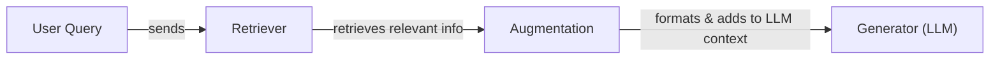
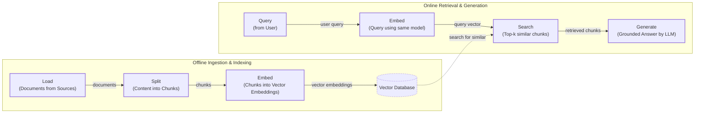
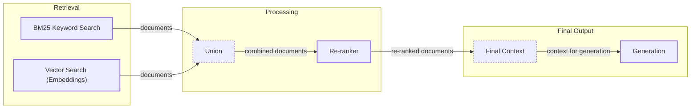
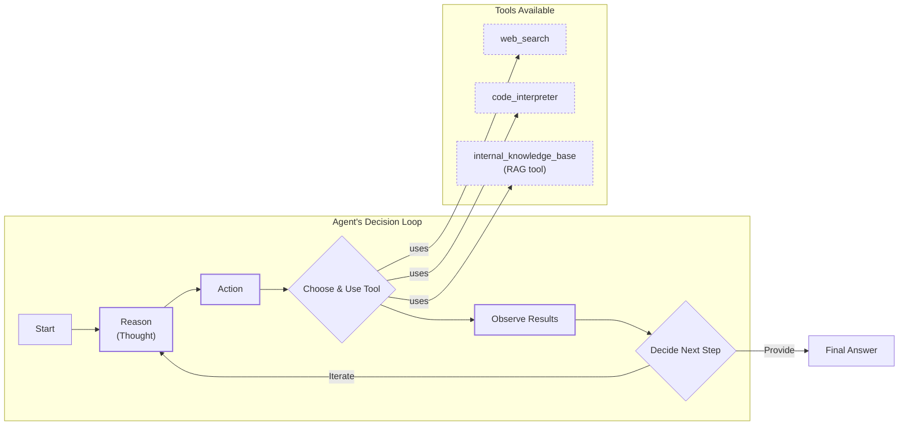

# Lesson 9: Retrieval-Augmented Generation (RAG)

In the last few lessons, we built a solid foundation in AI Engineering. We explored the agent landscape, learned how to engineer context, produce structured outputs, and build reasoning agents with the ReAct framework. A core problem we have touched on but not yet solved is that LLMs are trained on a fixed dataset. Their knowledge is static, making them prone to hallucination. They are essentially taking a "closed-book exam" on the world's information. While we can fine-tune them, it is an inefficient way to teach them new facts [[1]](https://neo4j.com/blog/developer/fine-tuning-vs-rag/).

Retrieval-Augmented Generation (RAG) offers a reliable solution. Instead of trying to update the model's weights, we can insert new knowledge through the context window [[2]](https://blogs.nvidia.com/blog/what-is-retrieval-augmented-generation/). With RAG, we give the LLM an "open-book exam" by connecting it to external, real-time knowledge sources. This is a key method within the discipline of Context Engineering we covered in Lesson 3. It allows us to build applications with curated, up-to-date information. This approach is more flexible and cost-effective for keeping knowledge current, as you only need to update your external data source, not retrain the entire model.

In this lesson, we will explore the what and how of basic RAG before moving on to the advanced and agentic patterns that power modern AI systems. In the next lesson, we will contrast retrieval with agent memory, where we discuss short- and long-term memory stores that complement RAG.

With the problem and motivation clear, we’ll first decompose RAG into its core components so you can see where each responsibility lives.

## The RAG System: Core Components

Understanding the components of RAG is the first step in the Context Engineering process of designing effective systems. We can break down any RAG application into three conceptual pillars.

**Retrieval** is the engine for finding relevant information. The goal is to search a knowledge base and pull out the most relevant documents for a given query. This is often done using semantic similarity, which relies on vector embeddings—numerical representations of text that capture meaning. These embeddings are high-dimensional arrays where similar concepts are located close to each other. They are stored in a vector database, which is optimized for efficient searching by measuring the distance between the query vector and the document vectors using metrics like cosine similarity [[3]](https://qdrant.tech/articles/what-is-rag-in-ai/). Keyword-based search methods like BM25 can also be used, often in combination with vector search [[4]](https://towardsai.net/p/l/a-complete-guide-to-rag).

**Augmentation** is the process of taking the retrieved information and formatting it into the context of a prompt for the LLM. This step is where prompt engineering is crucial, as the retrieved text is carefully combined with the original query and system instructions. This constructs the "open book" the model will use to answer the user's query, ensuring the LLM understands how to use the provided context to form its response [[5]](https://www.topquadrant.com/resources/blog-retrieval-augmented-generation-explained/).

**Generation** is the final step where the LLM uses the augmented input to generate an answer. This response is grounded in the provided data, which reduces the risk of hallucination and ensures the answer is based on the single source of truth you provided [[6]](https://decodingml.substack.com/p/rag-fundamentals-first?utm_source=publication-search). The LLM's role shifts from being a memorizer of facts to a reasoning engine that synthesizes information from the given context.

Image 1: A flowchart illustrating the core components and sequential flow of a RAG system.

Now that you can name each moving part, let’s see how they line up across the two phases of a real system.

## The RAG Pipeline: Ingestion and Retrieval

The end-to-end RAG workflow is split into two distinct phases: an offline phase for preparing the data and an online phase for answering queries in real-time.

**Phase 1: Offline Ingestion & Indexing**

This phase prepares your knowledge base so it can be searched efficiently. It involves a sequence of steps to process your documents and is typically run whenever your source data changes [[7]](https://newsletter.systemdesign.one/p/how-rag-works).

1.  **Load:** The first step is to load your documents from their sources. These can be PDFs, websites, databases, or APIs. Frameworks like LangChain and LlamaIndex provide ready-made document loaders for this purpose.
2.  **Split:** Next, the content is broken down into smaller, semantically meaningful pieces called chunks. The chunking strategy is critical; you want to keep related ideas together and avoid splitting sentences or paragraphs awkwardly. You can use tools like LangChain’s `RecursiveCharacterTextSplitter` or LlamaIndex's `SemanticSplitter`.
3.  **Embed:** An embedding model converts each chunk into a vector embedding. This numerical format captures the semantic meaning of the text. Popular models include OpenAI's `text-embedding-3` series, Google's `text-embedding-004`, and open-source variants from Hugging Face.
4.  **Store:** Finally, the embeddings and their corresponding text, along with any useful metadata, are loaded into a vector database. Options range from local libraries like FAISS to managed services like Qdrant, Pinecone, or Milvus.

**Phase 2: Online Retrieval & Generation**

This phase is triggered when a user submits a query to the system.

1.  **Query:** The user asks a question. This is often handled by an orchestration layer, such as a LangChain `Runnable` or a LlamaIndex `QueryEngine`.
2.  **Embed:** The query is converted into a vector using the same embedding model from the ingestion phase. This ensures that the query and the document chunks are in the same vector space, allowing for meaningful comparison.
3.  **Search:** The system uses the query vector to search the vector database and find the top-k most similar document chunks. This can involve simple vector similarity search using cosine similarity or more advanced methods.
4.  **Generate:** A prompt is constructed that includes the original user query, the retrieved chunks, and instructions for the LLM. The model then generates a grounded answer based on this context. As we saw in Lesson 4, you can use structured outputs to format the answer and include citations for traceability [[7]](https://newsletter.systemdesign.one/p/how-rag-works).

Image 2: A detailed flowchart depicting the end-to-end RAG workflow, divided into two main phases: Offline Ingestion & Indexing and Online Retrieval & Generation.

With the end-to-end path in place, the next question is quality: what are the advanced techniques to make retrieval more accurate and useful across messy, real-world data?

## Advanced RAG Techniques

While the basic RAG pipeline is powerful, its performance in production often depends on more advanced techniques to improve retrieval quality. Here are some of the most effective methods.

**Hybrid Search** combines keyword-based search (like BM25) with vector search. Vector search is great for understanding the meaning of a query, but it can miss exact matches for specific keywords. By using both, you get semantic understanding and keyword precision. The results from both are often merged using a method like Reciprocal Rank Fusion (RRF) to create a single, more relevant list [[8]](https://pr-peri.github.io/blogpost/2024/03/05/blogpost-hybrid-search.html). For example, a query for "rollover" finds articles with that keyword, while vector search also finds "carryover balance" guides.

**Re-ranking** is a two-stage process where an initial retrieval fetches a broad set of documents, and a second, more precise model re-orders them for relevance. These re-rankers, often cross-encoders, evaluate the query and each document together by processing their tokens jointly, providing a more accurate relevance score than the initial search [[9]](https://apxml.com/courses/optimizing-rag-for-production/chapter-2-advanced-retrieval-optimization/reranking-architectures-rag). For a "how-to" query, a re-ranker would prioritize a step-by-step guide over a press release.

**Query Transformations** modify the user's query to improve retrieval. **Decomposition** breaks a complex question like "What's our travel policy for conferences in Europe this year?" into sub-questions about the policy location, conference definitions, and regional rules [[10]](https://47billion.com/blog/rag-system-in-production-why-it-fails-and-how-to-fix-it/). **HyDE** generates a hypothetical answer, like "Employees can book economy flights...", and searches for documents that match this ideal text, which helps bridge the phrasing gap between questions and answers.

**Advanced Chunking Strategies** move beyond fixed-size splits. **Semantic chunking** keeps related sentences together, ensuring a whole "Reimbursements" section isn't split in half. **Layout-aware chunking** preserves the structure of tables and forms in documents like PDFs, keeping product names and prices connected [[11]](https://learn.microsoft.com/en-us/azure/developer/ai/advanced-retrieval-augmented-generation). **Context-enriched chunking** adds summary information to each chunk to provide more context during retrieval.

**GraphRAG** uses knowledge graphs to answer questions about complex relationships. It excels at multi-hop queries that standard RAG struggles with by traversing entities and their connections [[12]](https://arxiv.org/html/2404.16130). For instance, to answer "Which shoes have size-related returns and were in last month's ads?", it connects returns data to product SKUs and marketing calendars, using community detection and hierarchical summaries to reason across the entire dataset.

Image 3: A flowchart illustrating the hybrid retrieval flow, showing parallel BM25 and Vector Search, followed by union, re-ranking, and final context generation.

These techniques increase retrieval quality. Next, we’ll see how retrieval becomes one tool that an agent can choose to use as it reasons.

## Agentic RAG

As we learned in Lessons 7 and 8, a ReAct-style agent reasons about a problem, decides on an action, observes the result, and iterates. Agentic RAG is simply a ReAct agent that has retrieval as one of its available tools. While agents can use many tools, such as web search or code interpreters, the retrieval tool is often a core component for grounding the agent in specific knowledge [[13]](https://weaviate.io/blog/what-is-agentic-rag).

The core distinction between standard and agentic RAG is the shift from a linear workflow to an adaptive loop.
*   **Standard RAG** is a pre-determined pipeline: Retrieve → Augment → Generate. It's powerful but rigid, following the same path for every query.
*   **Agentic RAG** is iterative and dynamic. The agent decides *when* to retrieve, *what* to retrieve, and whether one retrieval is enough. It can reformulate queries, choose between different knowledge sources, and chain multiple retrieval and reasoning steps together [[14]](https://towardsdatascience.com/agentic-rag-vs-classic-rag-from-a-pipeline-to-a-control-loop/).

This agentic approach allows the agent to iteratively refine searches, choose between different knowledge sources (e.g., technical docs vs. marketing materials), and fuse retrieved information with data from other tools like a web search to form a complete answer [[15]](https://www.ibm.com/think/topics/agentic-rag). It can even decide to update the RAG system's knowledge base with new information it learns. This falls into the domain of agent memory, which we will cover in the next lesson.

Consider this simplified thought process for an agent:
*   **Thought:** User asks about '2024 EU data retention rules'. My internal policy is from 2023 and might be outdated.
*   **Action:** `retrieve(internal_policy, query="EU data retention 2024")`
*   **Observation:** The retrieved text mentions amendments but lacks specific citations.
*   **Thought:** I need external verification to be sure.
*   **Action:** `web_search(query="EU data retention 2024 official directive")`
*   **Observation:** Found the updated directive.
*   **Thought:** Now I can synthesize both sources and highlight the changes from 2023.

This is the difference between a simple database lookup and a conversation with a knowledgeable research assistant. However, this approach introduces trade-offs in latency and cost, and the agent's control loop can sometimes get stuck in repetitive or inefficient searches, a failure mode known as "retrieval thrash" [[16]](https://towardsdatascience.com/agentic-rag-failure-modes-retrieval-thrash-tool-storms-and-context-bloat-and-how-to-spot-them-early/).

Image 4: A conceptual Mermaid diagram showing an agent's main loop, including reasoning, action, tool utilization, observation, and decision-making, with paths for iteration and final answers.

You now understand both a linear RAG pipeline and how an agent can control retrieval when needed. Let’s wrap up by situating RAG in the wider AI Engineering toolkit and previewing what comes next.

## Conclusion

We have seen that RAG is the most widely used solution to the LLM knowledge problem. It reduces hallucinations, enables customization with proprietary data, and builds user trust through verifiable, source-backed answers. While basic RAG provides a solid foundation, advanced techniques are important for production-grade quality, and the future of knowledge retrieval is agentic. RAG is not a niche skill but a foundational competency for the modern AI Engineer, falling under the umbrella of Context Engineering.

In our next lesson, we will explore Memory for Agents, seeing how systems designed for memory augmentation can complement the retrieval mechanisms we have discussed here [[17]](https://arxiv.org/html/2401.03236v2). Later in the course, we will also cover how to build robust evaluation pipelines to measure retrieval quality and how to monitor these systems in production.

## References

- [1] [Knowledge Graphs and LLMs: Fine-Tuning vs. Retrieval-Augmented Generation](https://neo4j.com/blog/developer/fine-tuning-vs-rag/)
- [2] [What Is Retrieval-Augmented Generation, aka RAG?](https://blogs.nvidia.com/blog/what-is-retrieval-augmented-generation/)
- [3] [What is RAG: Understanding Retrieval-Augmented Generation](https://qdrant.tech/articles/what-is-rag-in-ai/)
- [4] [A Complete Guide to RAG](https://towardsai.net/p/l/a-complete-guide-to-rag)
- [5] [Retrieval-Augmented Generation Explained](https://www.topquadrant.com/resources/blog-retrieval-augmented-generation-explained/)
- [6] [Retrieval-Augmented Generation (RAG) Fundamentals First](https://decodingml.substack.com/p/rag-fundamentals-first?utm_source=publication-search)
- [7] [RAG - A Deep Dive](https://newsletter.systemdesign.one/p/how-rag-works)
- [8] [Hybrid Search: The Secret to Production RAG](https://pr-peri.github.io/blogpost/2024/03/05/blogpost-hybrid-search.html)
- [9] [Reranking Architectures in RAG](https://apxml.com/courses/optimizing-rag-for-production/chapter-2-advanced-retrieval-optimization/reranking-architectures-rag)
- [10] [Why Your RAG System Fails in Production and How to Fix It](https://47billion.com/blog/rag-system-in-production-why-it-fails-and-how-to-fix-it/)
- [11] [Build advanced retrieval-augmented generation systems](https://learn.microsoft.com/en-us/azure/developer/ai/advanced-retrieval-augmented-generation)
- [12] [From Local to Global: A GraphRAG Approach to Query-Focused Summarization](https://arxiv.org/html/2404.16130)
- [13] [What is Agentic RAG](https://weaviate.io/blog/what-is-agentic-rag)
- [14] [Agentic RAG vs Classic RAG: From a Pipeline to a Control Loop](https://towardsdatascience.com/agentic-rag-vs-classic-rag-from-a-pipeline-to-a-control-loop/)
- [15] [What is agentic RAG?](https://www.ibm.com/think/topics/agentic-rag)
- [16] [Agentic RAG Failure Modes: Retrieval Thrash, Tool Storms, and Context Bloat (and How to Spot Them Early)](https://towardsdatascience.com/agentic-rag-failure-modes-retrieval-thrash-tool-storms-and-context-bloat-and-how-to-spot-them-early/)
- [17] [MAGMA: A Multi-Graph based Agentic Memory Architecture for AI](https://arxiv.org/html/2401.03236v2)</article>