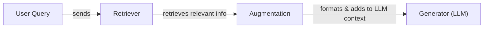
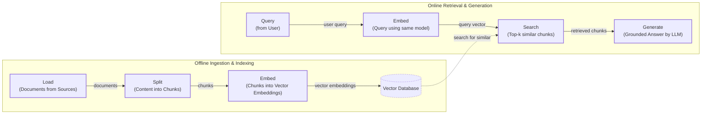
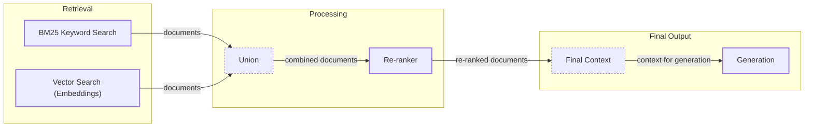
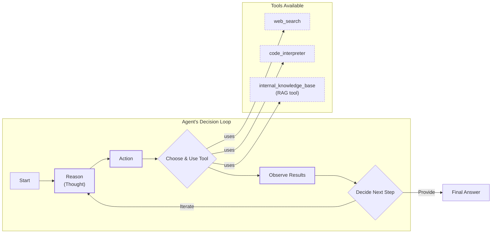

# Lesson 9: Retrieval-Augmented Generation (RAG)

In the last few lessons, we built a solid foundation in AI Engineering. We explored the agent landscape, learned how to engineer context, produce structured outputs, and build reasoning agents with the ReAct framework. A core problem we have touched on but not yet solved is that LLMs are trained on a fixed dataset. Their knowledge is static, making them prone to hallucination. They are essentially taking a "closed-book exam" on the world's information. While we can fine-tune them, it is an inefficient way to teach them new facts [[1]](https://neo4j.com/blog/developer/fine-tuning-vs-rag/).

Retrieval-Augmented Generation (RAG) offers a reliable solution. Instead of trying to update the model's weights, we can insert new knowledge through the context window [[2]](https://blogs.nvidia.com/blog/what-is-retrieval-augmented-generation/). With RAG, we give the LLM an "open-book exam" by connecting it to external, real-time knowledge sources. This is a key method within the discipline of Context Engineering we covered in Lesson 3. It allows us to build applications with curated, up-to-date information.

In this lesson, we will explore the what and how of basic RAG before moving on to the advanced and agentic patterns that power modern AI systems. In the next lesson, we will contrast retrieval with agent memory, where we discuss short- and long-term memory stores that complement RAG.

With the problem and motivation clear, we’ll first decompose RAG into its core components so you can see where each responsibility lives.

## The RAG System: Core Components

Understanding the components of RAG is the first step in the Context Engineering process of designing effective systems. We can break down any RAG application into three conceptual pillars.

**Retrieval** is the engine for finding relevant information. The goal is to search a knowledge base and pull out the most relevant documents for a given query. This is often done using semantic similarity, which relies on vector embeddings—numerical representations of text that capture meaning. These embeddings are stored in a vector database, which allows for efficient searching [[3]](https://qdrant.tech/articles/what-is-rag-in-ai/). Keyword-based search methods like BM25 can also be used, often in combination with vector search [[4]](https://towardsai.net/p/l/a-complete-guide-to-rag).

**Augmentation** is the process of taking the retrieved information and formatting it into the context of a prompt for the LLM. This step constructs the "open book" the model will use to answer the user's query [[5]](https://www.ibm.com/think/topics/retrieval-augmented-generation).

**Generation** is the final step where the LLM uses the augmented input to generate an answer. This response is grounded in the provided data, which significantly reduces the risk of hallucination and ensures the answer is based on the single source of truth you provided [[6]](https://decodingml.substack.com/p/rag-fundamentals-first?utm_source=publication-search).

Image 1: A flowchart illustrating the core components and sequential flow of a RAG system.

Now that you can name each moving part, let’s see how they line up across the two phases of a real system.

## The RAG Pipeline: Ingestion and Retrieval

The end-to-end RAG workflow is split into two distinct phases: an offline phase for preparing the data and an online phase for answering queries in real-time.

### Phase 1: Offline Ingestion & Indexing

This phase prepares your knowledge base so it can be searched efficiently. It involves a sequence of steps to process your documents [[7]](https://newsletter.systemdesign.one/p/how-rag-works).

1.  **Load:** The first step is to load your documents from their sources. These can be PDFs, websites, databases, or APIs.
2.  **Split:** Next, the content is broken down into smaller, semantically meaningful pieces called chunks. This is important because you want to retrieve only the most relevant information without overwhelming the model.
3.  **Embed:** An embedding model converts each chunk into a vector embedding. This numerical format captures the semantic meaning of the text.
4.  **Store:** Finally, the embeddings and their corresponding text are loaded into a vector database. This database is optimized for fast similarity lookups, which is the core of the retrieval process.

### Phase 2: Online Retrieval & Generation

This phase is triggered when a user submits a query to the system.

1.  **Query:** The user asks a question.
2.  **Embed:** The query is converted into a vector using the same embedding model from the ingestion phase. This ensures that the query and the document chunks are in the same vector space.
3.  **Search:** The system uses the query vector to search the vector database and find the top-k most similar document chunks.
4.  **Generate:** A prompt is constructed that includes the original user query, the retrieved chunks, and instructions for the LLM. The model then generates a grounded answer based on this context. As we saw in Lesson 4, you can use structured outputs to format the answer and include citations for traceability [[7]](https://newsletter.systemdesign.one/p/how-rag-works).

Image 2: A detailed flowchart depicting the end-to-end RAG workflow, divided into two main phases: Offline Ingestion & Indexing and Online Retrieval & Generation.

With the end-to-end path in place, the next question is quality: what are the advanced techniques to make retrieval more accurate and useful across messy, real-world data?

## Advanced RAG Techniques

While the basic RAG pipeline is powerful, its performance in production often depends on more sophisticated techniques to improve retrieval quality. Here are some of the most effective advanced methods.

**Hybrid Search** combines keyword-based search (like BM25) with vector search. Vector search is great for understanding the meaning or semantics of a query, but it can miss exact matches for specific keywords, IDs, or acronyms. BM25 excels at finding these exact terms. By using both, you get the best of both worlds: semantic understanding and keyword precision [[8]](https://pr-peri.github.io/blogpost/2026/03/05/blogpost-hybrid-search.html). For example, if a user asks, "my bill keeps rolling over," vector search might find articles about "carryover balances," while keyword search would find documents that explicitly mention "rollover."

**Re-ranking** is a two-stage process. First, an initial retrieval fetches a large set of potentially relevant documents. Then, a more powerful (and often slower) model, typically a cross-encoder, re-orders these documents based on their relevance to the query. Cross-encoders process the query and a document together, allowing for a deeper understanding of their relationship compared to the separate encoding used in initial retrieval [[9]](https://apxml.com/courses/optimizing-rag-for-production/chapter-2-advanced-retrieval-optimization/reranking-architectures-rag). This ensures the most relevant documents are placed at the top.

**Query Transformations** modify the user's query to improve retrieval results. Two common techniques are decomposition and HyDE.
*   **Decomposition** breaks down a complex, multi-part question into smaller, simpler sub-queries. The system retrieves documents for each sub-query and then synthesizes the results to form a complete answer [[10]](https://47billion.com/blog/rag-system-in-production-why-it-fails-and-how-to-fix-it/).
*   **HyDE (Hypothetical Document Embeddings)** works by first generating a hypothetical answer to the user's query. This "ideal" document is then embedded and used to search the vector database, which can help bridge the gap between the phrasing of the query and the language used in the documents [[10]](https://47billion.com/blog/rag-system-in-production-why-it-fails-and-how-to-fix-it/).

**Advanced Chunking Strategies** move beyond simply splitting documents into fixed-size pieces.
*   **Semantic chunking** aims to divide documents along conceptual boundaries, keeping related sentences together.
*   **Layout-aware chunking** is designed for complex documents like PDFs with tables and figures, preserving the document's structure. For example, it ensures that rows in a pricing table are kept together rather than being split across different chunks [[11]](https://learn.microsoft.com/en-us/azure/developer/ai/advanced-retrieval-augmented-generation).

**GraphRAG** leverages knowledge graphs to answer questions about complex relationships and interconnected entities. Standard RAG can struggle with multi-hop queries where the answer requires connecting information across multiple documents. By representing information as a graph of entities and relationships, GraphRAG can traverse these connections to assemble a more comprehensive context [[12]](https://arxiv.org/html/2404.16130). For example, to answer "Which incidents were caused by weekend deploys that also touched the login service?", the system can link change records, deployment times, affected services, and incident tickets. This approach can be effective; one study found that a graph-based approach achieved 86% comprehensiveness on multi-hop tasks compared to 57% for traditional vector RAG [[16]](https://towardsai.net/p/machine-learning/why-90-of-agentic-rag-projects-fail-and-how-to-build-one-that-actually-works-in-production).

Image 3: A flowchart illustrating the hybrid retrieval flow, showing parallel BM25 and Vector Search, followed by union, re-ranking, and final context generation.

These techniques increase retrieval quality. Next, we’ll see how retrieval becomes one tool that an agent can choose to use as it reasons.

## Agentic RAG

As we learned in Lessons 7 and 8, a ReAct-style agent reasons about a problem, decides on an action, observes the result, and iterates. Agentic RAG is simply a ReAct agent that has retrieval as one of its available tools. While agents can use many tools, such as web search or code interpreters, the retrieval tool is often a core component for grounding the agent in specific knowledge [[13]](https://weaviate.io/blog/what-is-agentic-rag).

The core distinction between standard and agentic RAG is the shift from a linear workflow to an adaptive loop.
*   **Standard RAG** is a pre-determined pipeline: Retrieve → Augment → Generate. It's powerful but rigid, following the same path for every query.
*   **Agentic RAG** is iterative and dynamic. The agent decides *when* to retrieve, *what* to retrieve, and whether one retrieval is enough. It can reformulate queries, choose between different knowledge sources, and chain multiple retrieval and reasoning steps together [[14]](https://towardsdatascience.com/agentic-rag-vs-classic-rag-from-a-pipeline-to-a-control-loop/).

However, this approach introduces trade-offs in latency, cost, and complexity [[17]](https://redis.io/blog/agentic-rag-how-enterprises-are-surmounting-the-limits-of-traditional-rag/). The agent's control loop can also fail, getting stuck in repetitive searches (**retrieval thrash**) or triggering excessive tool calls (**tool storms**), which bloat the context with low-quality information [[18]](https://towardsdatascience.com/agentic-rag-failure-modes-retrieval-thrash-tool-storms-and-context-bloat-and-how-to-spot-them-early/).

This agentic approach allows the agent to iteratively refine searches, choose between different knowledge sources (e.g., technical docs vs. marketing materials), and fuse retrieved information with data from other tools like a web search to form a complete answer [[15]](https://www.ibm.com/think/topics/agentic-rag).

Consider this simplified thought process for an agent handling a complex query:
*   **Thought:** Internal policy on '2024 EU data retention' is from 2023.
*   **Action:** `retrieve(internal_policy, query="...")`
*   **Observation:** Mentions amendments, no citations.
*   **Thought:** Need external check.
*   **Action:** `web_search(query="...")`
*   **Observation:** Found new directive.
*   **Thought:** Synthesize both, highlight changes.

This is the difference between a simple database lookup and a conversation with a knowledgeable research assistant.

Image 4: A conceptual Mermaid diagram showing an agent's main loop, including reasoning, action, tool utilization, observation, and decision-making, with paths for iteration and final answers.

You now understand both a linear RAG pipeline and how an agent can control retrieval when needed. Let’s wrap up by situating RAG in the wider AI Engineering toolkit and previewing what comes next.

## Conclusion

We have seen that RAG is the most widely used solution to the LLM knowledge problem. It reduces hallucinations, enables customization with proprietary data, and builds user trust through verifiable, source-backed answers. While basic RAG provides a solid foundation, advanced techniques are essential for production-grade quality, and the future of knowledge retrieval is increasingly agentic. RAG is not a niche skill but a foundational competency for the modern AI Engineer, falling under the umbrella of Context Engineering.

In our next lesson, we will explore Memory for Agents, seeing how systems designed for memory augmentation can complement the retrieval mechanisms we have discussed here [[19]](https://arxiv.org/html/2601.03236v2). Later in the course, we will also cover how to build robust evaluation pipelines to measure retrieval quality and how to monitor these systems in production.

## References

- [1] https://neo4j.com/blog/developer/fine-tuning-vs-rag/
- [2] https://blogs.nvidia.com/blog/what-is-retrieval-augmented-generation/
- [3] https://qdrant.tech/articles/what-is-rag-in-ai/
- [4] https://towardsai.net/p/l/a-complete-guide-to-rag
- [5] https://www.ibm.com/think/topics/retrieval-augmented-generation
- [6] https://decodingml.substack.com/p/rag-fundamentals-first?utm_source=publication-search
- [7] https://newsletter.systemdesign.one/p/how-rag-works
- [8] https://pr-peri.github.io/blogpost/2026/03/05/blogpost-hybrid-search.html
- [9] https://apxml.com/courses/optimizing-rag-for-production/chapter-2-advanced-retrieval-optimization/reranking-architectures-rag
- [10] https://47billion.com/blog/rag-system-in-production-why-it-fails-and-how-to-fix-it/
- [11] https://learn.microsoft.com/en-us/azure/developer/ai/advanced-retrieval-augmented-generation
- [12] https://arxiv.org/html/2404.16130
- [13] https://weaviate.io/blog/what-is-agentic-rag
- [14] https://towardsdatascience.com/agentic-rag-vs-classic-rag-from-a-pipeline-to-a-control-loop/
- [15] https://www.ibm.com/think/topics/agentic-rag
- [16] https://towardsai.net/p/machine-learning/why-90-of-agentic-rag-projects-fail-and-how-to-build-one-that-actually-works-in-production
- [17] https://redis.io/blog/agentic-rag-how-enterprises-are-surmounting-the-limits-of-traditional-rag/
- [18] https://towardsdatascience.com/agentic-rag-failure-modes-retrieval-thrash-tool-storms-and-context-bloat-and-how-to-spot-them-early/
- [19] https://arxiv.org/html/2601.03236v2