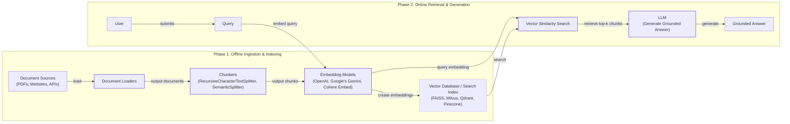
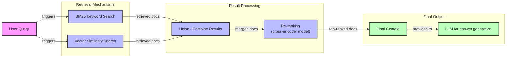
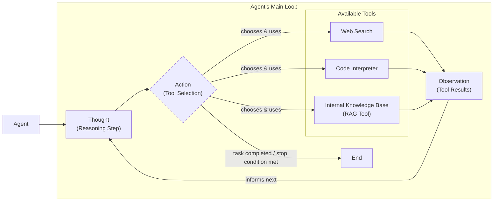

# Lesson 9: Retrieval-Augmented Generation (RAG)

In our previous lessons, we have covered the fundamentals of AI Engineering, from context engineering and structured outputs to building reasoning agents with ReAct. You have learned how to give Large Language Models (LLMs) the ability to use tools and plan actions. However, even the most sophisticated agent is limited by its internal knowledge, which is static and prone to hallucination. During training, models take a "closed-book exam" on the world's information. We do not yet have efficient techniques to update their knowledge after deployment; fine-tuning is often too slow and expensive for rapidly changing data [[1]](https://neo4j.com/blog/developer/fine-tuning-vs-rag/).

Retrieval-Augmented Generation (RAG) provides an essential solution to this problem. It is a method for connecting an LLM to external, real-time knowledge sources, effectively giving it an "open-book exam." Instead of relying on memorization, the model can look up facts when it needs them, similar to how we use manuals or cheat sheets [[2]](https://blogs.nvidia.com/blog/what-is-retrieval-augmented-generation/). As we discussed in Lesson 3 on Context Engineering, RAG is a core technique for curating the information an LLM sees. It provides a practical way to inject new knowledge directly into the model's context window, ensuring responses are both current and accurate.

This lesson will explore the "what" and "how" of RAG, starting with its basic components and moving toward the advanced and agentic patterns that power modern AI systems. While RAG is a powerful tool for information retrieval, it complements the agent memory systems we will discuss in Lesson 10, which manage conversational history and user preferences.

With the problem and motivation clear, we will first decompose RAG into its core components so you can see where each responsibility lives.

## The RAG System: Core Components

Understanding the components of a RAG system is the first step in the Context Engineering process of designing effective AI applications. At its core, the RAG framework is built on three conceptual pillars that work together to ground an LLM's response in external data.

*   **Retrieval:** This is the engine responsible for finding relevant information. When a user submits a query, the retrieval system searches an external knowledge base to find the most relevant documents or data chunks. This search commonly uses a combination of semantic similarity, powered by vector embeddings, and traditional keyword-based search like BM25 [[3]](https://mlpills.substack.com/p/issue-76-optimize-rag-with-hybrid). Vector embeddings are numerical representations of text that capture its underlying meaning. These vectors are stored in a specialized vector database, which allows for efficient searching based on semantic closeness rather than just keyword matches [[4]](https://medium.com/@robi.tomar72/how-rag-actually-works-embeddings-vector-databases-indexing-retrieval-explained-simply-3d1ca45fe1bf), [[5]](https://medium.com/@derrickryangiggs/rag-pipeline-deep-dive-ingestion-chunking-embedding-and-vector-search-abd3c8bfc177/).
*   **Augmentation:** Once the retriever finds the relevant information, the augmentation step takes this data and combines it with the original user query. This process creates an "augmented prompt" that provides the LLM with the necessary context to formulate an accurate and informed response [[6]](https://www.topquadrant.com/resources/blog-retrieval-augmented-generation-explained/), [[7]](https://www.ibm.com/think/topics/retrieval-augmented-generation). The goal is to construct a prompt that clearly instructs the model to use the provided information as its primary source of truth.
*   **Generation:** In the final step, the augmented prompt is passed to the LLM. The model then uses this enriched context to generate a final answer. Because the response is based on the provided external data, it is "grounded," which means it is less likely to be a hallucination and can often include citations to the source material [[8]](https://humanloop.com/blog/rag-architectures), [[1]](https://neo4j.com/blog/developer/fine-tuning-vs-rag/).

```mermaid
flowchart LR
  %% Core components of a RAG system
  User["User"]
  Query["User Query"]
  Retriever["Retriever"]
  Augmentation["Augmentation"]
  Generator["Generator (LLM)"]
  Answer["Grounded Answer"]

  %% Sequential interactions
  User -- "submits" --> Query
  Query -- "processed by" --> Retriever
  Retriever -- "retrieved information" --> Augmentation
  Augmentation -- "augmented input" --> Generator
  Generator -- "produces" --> Answer
```

Image 1: A flowchart illustrating the core components and sequential interactions of a RAG system.

Now that you can name each moving part, let’s see how they line up across the two phases of a real system.

## The RAG Pipeline: Ingestion and Retrieval

The end-to-end RAG workflow is divided into two distinct phases: an offline ingestion pipeline that prepares the knowledge base and an online retrieval pipeline that answers user queries in real-time [[9]](https://newsletter.systemdesign.one/p/how-rag-works), [[10]](https://towardsdatascience.com/ragops-guide-building-and-scaling-retrieval-augmented-generation-systems-3d26b3ebd627/).

### Phase 1: Offline Ingestion & Indexing

This phase is about preparing your external data so it can be efficiently searched. It involves several steps:

*   **Load:** The process begins by loading documents from various sources, such as PDFs, websites, or APIs, using tools like LangChain document loaders or LlamaIndex readers.
*   **Split:** Large documents are broken down into smaller, more manageable "chunks." This is a critical step because it ensures that the retrieved context is focused and relevant. This can be done with rule-based tools like LangChain's `RecursiveCharacterTextSplitter` or more advanced methods like LlamaIndex's `SemanticSplitter` [[4]](https://medium.com/@robi.tomar72/how-rag-actually-works-embeddings-vector-databases-indexing-retrieval-explained-simply-3d1ca45fe1bf).
*   **Embed:** An embedding model converts each text chunk into a numerical vector. These vectors capture the semantic meaning of the text. Popular models for this task include OpenAI's `text-embedding-3` series, Google's `text-embedding-004`, and open-source alternatives from Hugging Face [[11]](https://qdrant.tech/articles/what-is-rag-in-ai/).
*   **Store:** The vector embeddings and their corresponding text chunks are stored in a vector database like FAISS, Milvus, or Pinecone. This specialized database is optimized for fast similarity searches, allowing the system to quickly find the chunks that are most relevant to a user's query [[12]](https://pub.towardsai.net/vector-databases-in-practice-building-a-realistic-hybrid-search-rag-system-with-qdrant-7b8f4a6e41e0).

### Phase 2: Online Retrieval & Generation

This phase happens in real-time when a user interacts with the system.

*   **Query:** The user submits a question, which can be processed through a framework like LangChain's `Runnable` chains or a LlamaIndex `QueryEngine`.
*   **Embed:** The same embedding model used during ingestion converts the user's query into a vector. This ensures that the query and the document chunks are represented in the same vector space, making them comparable [[13]](https://apxml.com/courses/prompt-engineering-llm-application-development/chapter-6-integrating-llms-external-data-rag/implementing-semantic-search-retrieval).
*   **Search:** The system uses the query vector to search the vector database, identifying the `top-k` document chunks with the highest semantic similarity, often measured by cosine similarity [[14]](https://towardsdatascience.com/rag-explained-understanding-embeddings-similarity-and-retrieval/).
*   **Generate:** The retrieved chunks are combined with the original query and system instructions to form a comprehensive prompt. This prompt is then sent to the LLM, which generates a final, grounded answer. As we learned in Lesson 4, using structured outputs can help ensure the answer is well-formatted and includes citations [[15]](https://www.promptingguide.ai/research/rag).

Image 2: A detailed flowchart depicting the end-to-end RAG pipeline, separated into two main phases: 'Phase 1: Offline Ingestion & Indexing' and 'Phase 2: Online Retrieval & Generation'.

With the end-to-end path in place, the next question is quality. What are the advanced techniques to make the retrieval more accurate and useful across messy, real-world data?

## Advanced RAG Techniques

While the basic RAG pipeline is powerful, its performance can be significantly improved with more advanced techniques. These methods address the limitations of simple semantic search and help deliver more accurate and relevant results in production environments.

### Hybrid Search

This technique combines traditional keyword-based search, like BM25, with modern vector search. Keyword search excels at finding exact matches for specific terms, while vector search is better at understanding semantic meaning. By combining the results of both, hybrid search uses the strengths of each approach, leading to more robust retrieval [[3]](https://mlpills.substack.com/p/issue-76-optimize-rag-with-hybrid), [[16]](https://cubitrek.com/blog/hybrid-search-optimization-how-bm25-and-dense-vector-retrieval-work-together-for-superior-ai-search/).

### Re-ranking

After an initial retrieval fetches candidate documents, a re-ranker refines their order. These are often cross-encoder models that process the query and each document together for a more nuanced relevance score, ensuring the best documents are prioritized for the LLM [[17]](https://apxml.com/courses/optimizing-rag-for-production/chapter-2-advanced-retrieval-optimization/reranking-architectures-rag), [[18]](https://towardsdatascience.com/advanced-rag-retrieval-cross-encoders-reranking/). However, this accuracy has a latency cost; the computational overhead of cross-encoders can make them too slow for real-time applications with strict budgets [[19]](https://medium.com/@chinmayd49/rag-production-optimizations-and-trade-offs-a623e5834e65).

### Query Transformations

Instead of using the user's query as-is, we can transform it to improve retrieval accuracy. Two common techniques are:

*   **Decomposition:** A complex query is broken down into simpler sub-questions. The system retrieves documents for each and then merges the results [[20]](https://docs.nvidia.com/rag/latest/query_decomposition.html).
*   **Hypothetical Document Embeddings (HyDE):** This method involves generating a hypothetical, ideal answer to the user's query first. This "hypothetical document" is then embedded and used for the similarity search, which can bridge the gap between the phrasing of a query and the language used in the source documents [[21]](https://47billion.com/blog/rag-system-in-production-why-it-fails-and-how-to-fix-it/).

### Advanced Chunking Strategies

The way documents are split into chunks has a major impact on retrieval quality. Fixed-size chunking can awkwardly cut sentences or separate related ideas. More advanced strategies include semantic chunking, which splits text based on semantic boundaries, and layout-aware chunking, which preserves the structure of documents like PDFs with tables or forms.

### GraphRAG

For questions about complex relationships, GraphRAG is a powerful approach. Standard RAG often fails at multi-hop reasoning because it retrieves isolated text chunks [[22]](https://www.freecodecamp.org/news/how-to-solve-5-common-rag-failures-with-knowledge-graphs/). GraphRAG avoids this by constructing a knowledge graph of entities and their relationships. Instead of just vector search, the system can traverse this explicit structure to answer complex queries [[23]](https://www.gooddata.com/blog/from-rag-to-graphrag-knowledge-graphs-ontologies-and-smarter-ai/). For example, a retail query like, “Which shoes get the most size-related returns and were featured in last month’s ads?” can be answered by connecting returns data to product SKUs and marketing calendars. Similarly, an IT operations query like, "Which incidents were caused by weekend deploys that also touched the login service?" can be solved by linking change records to deployment times, affected services, and incident tickets.

Image 3: A flowchart illustrating the Hybrid Retrieval Flow, from user query to LLM answer generation.

These techniques increase retrieval quality. Next, we will see how retrieval becomes one tool that an agent can choose to use as it reasons.

## Agentic RAG

As we explored in Lessons 7 and 8, a ReAct-style agent operates in a loop of Thought, Action, and Observation. Agentic RAG applies this pattern by making retrieval one of the tools available to the agent. This transforms the process into a more adaptive and intelligent system.

The core distinction lies in control flow:

*   **Standard RAG:** Follows a linear, predetermined workflow: Retrieve → Augment → Generate. It is powerful but rigid.
*   **Agentic RAG:** An adaptive, iterative process where the agent decides when and how to retrieve information. This approach is an example of neuro-symbolic AI, combining the pattern-matching strengths of neural networks with the structured reasoning of symbolic systems [[24]](https://arxiv.org/html/2407.08516v5).

This agentic approach unlocks several new capabilities. The agent can **iteratively** use its RAG tool, refining its query based on initial findings. It can also **choose** which knowledge source to search and **fuse** information from its RAG tool with data from other tools, like a web search, to construct a comprehensive answer [[25]](https://towardsdatascience.com/agentic-rag-vs-classic-rag-from-a-pipeline-to-a-control-loop/). Furthermore, an agent can decide to **update** the RAG system's knowledge base with new information it learns. We will cover this concept of memory in the next lesson.

Consider a conceptual thought process.
*   **Thought:** The user asks about '2024 EU data retention rules.' Our internal policy cites 2023. It might be outdated.
*   **Action:** `retrieve(internal_policy, query="EU data retention 2024")`
*   **Observation:** The internal policy mentions amendments but lacks detail. I need external verification.
*   **Action:** `web_search(query="Official EU data retention directive 2024")`
*   **Observation:** I found the new directive. I will synthesize both.

This transforms the interaction from a simple lookup into a conversation with a research assistant.

Image 4: A conceptual flowchart illustrating an Agent's Main Loop in an Agentic RAG system, emphasizing iterative decision-making and tool selection.

You now understand both a linear RAG pipeline and how an agent can control retrieval when needed. Let’s wrap up by situating RAG in the wider AI Engineering toolkit and previewing what comes next.

## Conclusion

We have seen that RAG is the industry-standard solution to the LLM knowledge problem. Advanced techniques are important for production-grade quality, and the future of knowledge retrieval is agentic. By grounding responses in external data, RAG reduces hallucinations, enables customization with proprietary data, and builds user trust through verifiable, source-backed answers. For the modern AI Engineer, RAG is a foundational competency within Context Engineering.

In our next lesson, we will explore Memory for Agents and how it complements retrieval. Later in the course, we will cover the evaluation and monitoring needed for production systems. The field continues to evolve, with ongoing research into how RAG can collaborate with long-context models and the development of new paradigms like neuro-vector-symbolic architectures [[26]](https://medium.com/@infiniflowai/from-rag-to-context-a-2025-year-end-review-of-rag), [[24]](https://arxiv.org/html/2407.08516v5).

## References

- [1] Knowledge Graphs and LLMs: Fine-Tuning vs. Retrieval-Augmented Generation (https://neo4j.com/blog/developer/fine-tuning-vs-rag/)
- [2] What Is Retrieval-Augmented Generation, aka RAG? (https://blogs.nvidia.com/blog/what-is-retrieval-augmented-generation/)
- [3] Optimize RAG with Hybrid Search (https://mlpills.substack.com/p/issue-76-optimize-rag-with-hybrid)
- [4] How RAG Actually Works: Embeddings, Vector Databases, Indexing, & Retrieval Explained Simply (https://medium.com/@robi.tomar72/how-rag-actually-works-embeddings-vector-databases-indexing-retrieval-explained-simply-3d1ca45fe1bf)
- [5] RAG Pipeline Deep-Dive: Ingestion (Chunking, Embedding, and Vector Search) (https://medium.com/@derrickryangiggs/rag-pipeline-deep-dive-ingestion-chunking-embedding-and-vector-search-abd3c8bfc177)
- [6] Retrieval-Augmented Generation (RAG) Explained (https://www.topquadrant.com/resources/blog-retrieval-augmented-generation-explained/)
- [7] What is retrieval-augmented generation (RAG)? (https://www.ibm.com/think/topics/retrieval-augmented-generation)
- [8] RAG Architectures: An Overview of Retrieval Augmented Generation Methods (https://humanloop.com/blog/rag-architectures)
- [9] How RAG works (https://newsletter.systemdesign.one/p/how-rag-works)
- [10] RAGOps Guide: Building and Scaling Retrieval-Augmented Generation Systems (https://towardsdatascience.com/ragops-guide-building-and-scaling-retrieval-augmented-generation-systems-3d26b3ebd627/)
- [11] What is RAG in AI? (https://qdrant.tech/articles/what-is-rag-in-ai/)
- [12] Vector Databases in Practice: Building a Realistic Hybrid-Search RAG System with Qdrant (https://pub.towardsai.net/vector-databases-in-practice-building-a-realistic-hybrid-search-rag-system-with-qdrant-7b8f4a6e41e0)
- [13] Implementing Semantic Search for Retrieval (https://apxml.com/courses/prompt-engineering-llm-application-development/chapter-6-integrating-llms-external-data-rag/implementing-semantic-search-retrieval)
- [14] RAG Explained: Understanding Embeddings, Similarity and Retrieval (https://towardsdatascience.com/rag-explained-understanding-embeddings-similarity-and-retrieval/)
- [15] Retrieval-Augmented Generation (RAG) (https://www.promptingguide.ai/research/rag)
- [16] Hybrid Search Optimization: How BM25 and Dense Vector Retrieval Work Together for Superior AI Search (https://cubitrek.com/blog/hybrid-search-optimization-how-bm25-and-dense-vector-retrieval-work-together-for-superior-ai-search/)
- [17] Reranking Architectures in RAG (https://apxml.com/courses/optimizing-rag-for-production/chapter-2-advanced-retrieval-optimization/reranking-architectures-rag)
- [18] Advanced RAG Retrieval: Cross-Encoders & Reranking (https://towardsdatascience.com/advanced-rag-retrieval-cross-encoders-reranking/)
- [19] RAG Production Optimizations and Trade-offs (https://medium.com/@chinmayd49/rag-production-optimizations-and-trade-offs-a623e5834e65)
- [20] Query Decomposition (https://docs.nvidia.com/rag/latest/query_decomposition.html)
- [21] RAG System in Production: Why it Fails and How to Fix it (https://47billion.com/blog/rag-system-in-production-why-it-fails-and-how-to-fix-it/)
- [22] How to Solve 5 Common RAG Failures with Knowledge Graphs (https://www.freecodecamp.org/news/how-to-solve-5-common-rag-failures-with-knowledge-graphs/)
- [23] From RAG to GraphRAG: Knowledge Graphs, Ontologies, and Smarter AI (https://www.gooddata.com/blog/from-rag-to-graphrag-knowledge-graphs-ontologies-and-smarter-ai/)
- [24] Converging Paradigms: The Synergy of Symbolic and Connectionist AI in LLM-Empowered Autonomous Agents (https://arxiv.org/html/2407.08516v5)
- [25] Agentic RAG vs Classic RAG: From a Pipeline to a Control Loop (https://towardsdatascience.com/agentic-rag-vs-classic-rag-from-a-pipeline-to-a-control-loop/)
- [26] From RAG to Context: A 2025 Year-End Review of RAG (https://medium.com/@infiniflowai/from-rag-to-context-a-2025-year-end-review-of-rag-03740f1a0528)