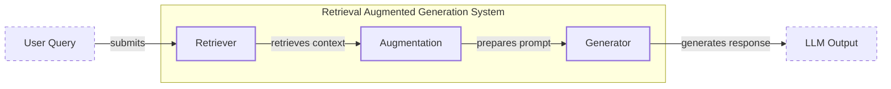
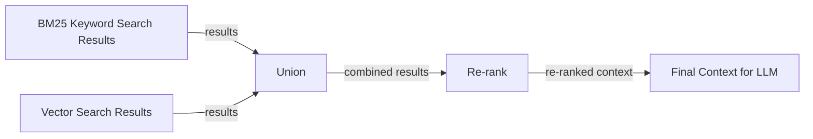
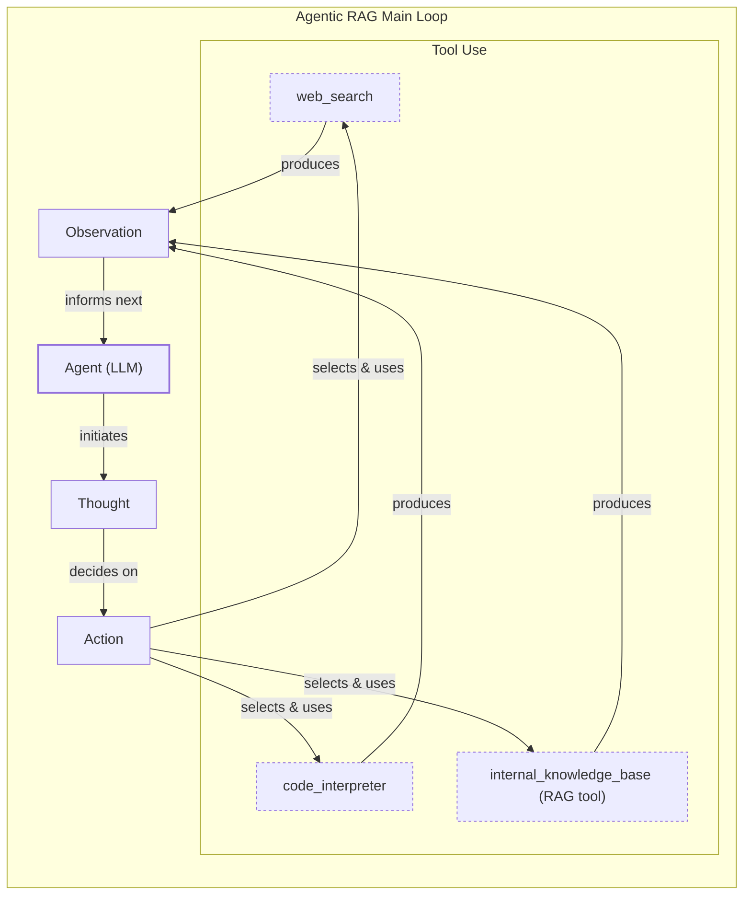

# Retrieval-Augmented Generation (RAG)

In our previous lessons, we built a solid foundation in AI engineering. We explored the agent landscape, distinguished between rule-based workflows and autonomous agents, and in Lesson 3, we introduced Context Engineering—the art of managing the information an LLM sees. We have also covered how to give agents tools and make them reason with the ReAct framework. Now, we will dive into one of the most critical techniques in an AI Engineer's toolkit.

The core problem with LLMs is that their knowledge is frozen in time. They are trained on a fixed dataset, which means they are essentially taking a "closed-book exam" on the world's information. This static knowledge leads to outdated answers and a tendency to "hallucinate"—confidently inventing facts when they do not know the answer. While fine-tuning can update a model, it is slow, expensive, and quickly becomes stale.

Retrieval-Augmented Generation (RAG) offers a practical and powerful solution. Instead of relying on memorized facts, we give the LLM an "open-book exam." RAG connects the model to external, up-to-date knowledge sources at the moment it needs to answer a question. This is a core method within the Context Engineering discipline we covered in Lesson 3, ensuring we provide the LLM with the most relevant and accurate context.

This lesson will walk you through the fundamentals of RAG, from its core components and pipeline architecture to the advanced and agentic patterns that power modern AI systems. We will also briefly touch on how RAG complements an agent's memory, a topic we will explore fully in Lesson 10. With the problem and motivation clear, we’ll first decompose RAG into its core components.

## The RAG System: Core Components

To design effective RAG systems, you first need to understand their three conceptual pillars. This is the first step in the Context Engineering process, as it helps you map out where each responsibility lives within your application.

-   **Retrieval:** This is the engine that finds relevant information. When a user asks a question, the retriever searches an external knowledge base to find the most relevant documents or data chunks. This search often relies on vector embeddings, which are numerical representations of text that capture semantic meaning. These embeddings are stored in a vector database, allowing the system to find information that is conceptually similar to the user's query, not just matching keywords [[51]](https://apxml.com/courses/prompt-engineering-llm-application-development/chapter-6-integrating-llms-external-data-rag/implementing-semantic-search-retrieval).

-   **Augmentation:** Once the retriever finds the relevant information, the augmentation step takes this retrieved context and combines it with the original user query. This creates an "augmented prompt" that provides the LLM with both the question and the necessary background information to answer it accurately.

-   **Generation:** In the final step, the augmented prompt is sent to the LLM. The model then generates a response that is grounded in the provided context. This ensures the answer is not only relevant but also factually based on the retrieved data, often with citations pointing back to the source [[22]](https://www.mindstudio.ai/blog/what-is-rag/).


Image 1: A flowchart illustrating the conceptual flow of a Retrieval Augmented Generation (RAG) system.

Now that you can name each moving part, let’s see how they line up across the two phases of a real system.

## The RAG Pipeline: Ingestion and Retrieval

A production-ready RAG system operates in two distinct phases: an offline phase for preparing data and an online phase for answering queries in real-time. Understanding this separation is key to building a scalable and maintainable system.

### Phase 1: Offline Ingestion & Indexing

This phase is all about preparing your knowledge base so that it can be efficiently searched. It happens before your users ever ask a question and typically runs as a batch process [[32]](https://newsletter.systemdesign.one/p/how-rag-works).

1.  **Load:** The first step is to load your documents from their various sources. These could be PDFs, web pages, or data from APIs. Tools like LangChain's document loaders or LlamaIndex's readers are commonly used for this task.
2.  **Split:** Large documents are broken down into smaller, semantically meaningful chunks. This is a critical step; you want to avoid splitting a coherent idea across two different chunks. You can use rule-based splitters, like LangChain’s `RecursiveCharacterTextSplitter`, or more advanced semantic chunkers.
3.  **Embed:** Each chunk is converted into a vector embedding using a specialized model. Popular choices include models from OpenAI, Google, or open-source alternatives like BGE variants, which transform text into numerical representations that capture its meaning [[9]](https://wandb.ai/mostafaibrahim17/ml-articles/reports/Vector-Embeddings-in-RAG-Applications--Vmlldzo3OTk1NDA5).
4.  **Store:** The embeddings and their corresponding text chunks are loaded into a vector database. This database is optimized for fast similarity searches, allowing the system to quickly find the most relevant chunks for a given query. Examples include local libraries like FAISS or managed services like Qdrant, Milvus, and Pinecone [[6]](https://pub.towardsai.net/vector-databases-in-practice-building-a-realistic-hybrid-search-rag-system-with-qdrant-7b8f4a6e41e0).

### Phase 2: Online Retrieval & Generation

This phase happens in real-time when a user interacts with your application [[31]](https://medium.com/@derrickryangiggs/rag-pipeline-deep-dive-ingestion-chunking-embedding-and-vector-search-abd3c8bfc177).

1.  **Embed Query:** The user’s question is converted into a vector embedding using the *same* model from the ingestion phase. This ensures the query and the documents exist in the same vector space, making comparison possible.
2.  **Search:** The system uses the query vector to search the vector database, retrieving the top-k most similar document chunks. This is typically done using a similarity metric like cosine similarity.
3.  **Generate:** The retrieved chunks are combined with the original query and instructions into a final prompt. This augmented prompt is then passed to an LLM, which generates an answer grounded in the provided context. As we learned in Lesson 4, using structured outputs here can help format the final answer and include citations.

```mermaid
flowchart LR
  %% Offline Ingestion & Indexing Phase
  subgraph "Offline Ingestion & Indexing"
    A["Documents<br/>(Various Sources)"]
    B["Load<br/>(e.g., Unstructured, LangChain loaders)"]
    C["Split<br/>(e.g., RecursiveCharacterTextSplitter, SemanticSplitter)"]
    D["Embed<br/>(e.g., OpenAI, Google Gemini, Cohere)"]
    E[(Store<br/>(Vector DB: FAISS, Milvus, Qdrant, Pinecone, Elasticsearch/OpenSearch))]
  end

  %% Online Retrieval & Generation Phase
  subgraph "Online Retrieval & Generation"
    F["User Query"]
    G["Embed<br/>(Same embedding model as ingestion)"]
    H["Search<br/>(Vector DB for top-k similar chunks)"]
    I["Generate<br/>(Prompt with query & chunks, LLM call, Structured outputs)"]
    J["Answer"]
  end

  %% Primary Data Flows - Ingestion
  A -- "input" --> B
  B -- "parses" --> C
  C -- "chunks" --> D
  D -- "creates embeddings" --> E

  %% Primary Data Flows - Retrieval & Generation
  F -- "submits" --> G
  G -- "embeds query" --> H
  H -- "retrieves" --> I
  I -- "generates" --> J

  %% Connection between phases
  E -- "indexed data" -.-> H

  %% Visual grouping
  classDef db_store stroke-dasharray:3,3
  class E db_store
```
Image 2: A detailed flowchart depicting the end-to-end RAG workflow, divided into two distinct phases: "Offline Ingestion & Indexing" and "Online Retrieval & Generation".

With the end-to-end path in place, the next question is quality. What advanced techniques can make retrieval more accurate and useful across messy, real-world data?

## Advanced RAG Techniques

While a basic RAG pipeline is a good start, production systems need more advanced techniques to improve retrieval quality for complex, real-world data.

### Hybrid Search

This technique combines the strengths of two different search methods: keyword-based search (like BM25) and semantic vector search. Keyword search is excellent for finding exact matches, such as product codes or specific names, while vector search is better at understanding the meaning and intent behind a query [[36]](https://pr-peri.github.io/blogpost/2026/03/05/blogpost-hybrid-search.html). For example, if a user asks about a "bill rolling over," keyword search would find documents with "rollover," while semantic search could also find conceptually similar articles about "carryover balances." By fusing the results of both, hybrid search ensures better coverage and precision.


Image 3: A flowchart illustrating the hybrid retrieval flow.

### Re-ranking

Initial retrieval is optimized for speed and recall, meaning it casts a wide net to find potentially relevant documents. However, the best document might not be at the top of the initial list. Re-ranking introduces a second, more precise model to re-order this initial set of results [[42]](https://redis.io/blog/10-techniques-to-improve-rag-accuracy/). Cross-encoder models are often used for this, as they evaluate the relevance of a query and a document pair together, providing a more accurate score than the initial similarity search. This ensures the most relevant information is prioritized in the context sent to the LLM.

### Query Transformations

Sometimes, the user's query is not in the best format for retrieval. Query transformation techniques rewrite or expand the query to improve its chances of matching the right documents.
-   **Decomposition:** A complex question like “What’s our travel policy for conferences in Europe this year?” can be broken down into smaller sub-questions: “What is the travel policy?”, “What are the rules for Europe?”, and “What changed this year?” The system retrieves answers for each and then synthesizes a complete response [[19]](https://docs.nvidia.com/rag/latest/query_decomposition.html). The risk is error propagation, where a mistake in an early sub-question compromises the final result [[63]](https://apxml.com/courses/large-scale-distributed-rag/chapter-6-advanced-rag-architectures-techniques/multi-hop-iterative-rag-scale).
-   **Hypothetical Document Embeddings (HyDE):** This method generates a hypothetical, ideal answer to the user's query first. It then searches for documents that are similar to this generated answer, rather than the original query. This often bridges the gap between the language of questions and the language of answers [[16]](https://47billion.com/blog/rag-system-in-production-why-it-fails-and-how-to-fix-it/). However, this method has trade-offs, as the extra LLM call adds latency and cost, and the generated document can introduce hallucinations [[61]](https://arxiv.org/pdf/2506.21568)[[62]](https://www.linkedin.com/posts/avi-chawla_rag-vs-hyde-visually-explained-rag-is-activity-7394672682056753153-EG6q).

### Advanced Chunking Strategies

How you split your documents can significantly impact retrieval quality. Fixed-size chunking can awkwardly cut sentences or ideas in half. Advanced strategies respect the document's structure:
-   **Semantic chunking:** Splits text based on topical shifts, ensuring that each chunk contains a coherent thought.
-   **Layout-aware chunking:** Preserves the structure of documents like PDFs or tables, keeping headers with their corresponding data or rows in a table intact [[17]](https://sarthakai.substack.com/p/improve-your-rag-accuracy-with-a). Many strategies also use a small overlap between chunks to avoid splitting a complete thought across a boundary [[64]](https://docs.cohere.com/page/chunking-strategies)[[65]](https://oneuptime.com/blog/post/2026-01-30-rag-overlap-strategies/view).

### GraphRAG

For questions about complex relationships, standard document retrieval can fall short. GraphRAG builds a knowledge graph from your data, connecting entities (like people, products, or companies) and their relationships [[46]](https://arxiv.org/html/2601.03014v1). This allows the system to answer multi-hop questions that require traversing these connections. For example, a query like “Which incidents were caused by weekend deploys that also touched the login service?” can be answered by following the links between deployments, services, and incident reports in the graph. However, building and querying large knowledge graphs at scale introduces significant cost and performance challenges [[66]](https://www.equitus.ai/post/knowledge-graph).

These techniques increase retrieval quality. Next, we’ll see how retrieval becomes one of several tools that an agent can choose to use as it reasons.

## Agentic RAG

So far, we have treated RAG as a linear pipeline: retrieve, augment, and generate. This is effective, but it is also rigid. What happens if the first retrieval pass fails to find the right information? A standard RAG system has no way to recover. This is where agentic RAG comes in, transforming retrieval from a fixed process into an adaptive, iterative loop. As we saw in Lessons 7 and 8, Agentic RAG is essentially a ReAct-style agent with a retrieval tool. It reasons (Thought), acts (Action), and uses the results (Observation) to decide its next step.

The key distinction is the shift from a fixed workflow to an adaptive, decision-making process where the agent decides when, what, and how to retrieve information [[11]](https://towardsdatascience.com/agentic-rag-vs-classic-rag-from-a-pipeline-to-a-control-loop/). Retrieval is just one of many tools an agent might have, like web search or code execution. But this autonomy adds risks. Agents can loop, misinterpret tool outputs, or have reasoning errors cascade [[67]](https://www.okta.com/identity-101/agentic-rag-architecture/)[[68]](https://arxiv.org/html/2603.07379v1). These cycles are also more expensive, requiring strict stop conditions to control costs [[69]](https://www.digitalapplied.com/blog/agentic-rag-patterns-multi-step-reasoning-guide)[[70]](https://www.vellum.ai/blog/agentic-rag).

An agentic approach unlocks several powerful capabilities:

-   **Iterative Retrieval:** If the initial search results are insufficient, the agent can refine its query and try again. For example, after a vague first pass, it might narrow its search to "EU customers, 2024 updates" to get more specific results.
-   **Tool Selection:** The agent can choose the most appropriate knowledge source to search. For an IT outage, it might query `search_incident_runbooks` instead of `search_marketing_pages`.
-   **Information Fusion:** The agent can combine information from its RAG tool with outputs from other tools, like a live web search, to construct a more comprehensive answer.
-   **Knowledge Base Updates:** An agent can even decide to update the knowledge base with new information it learns, creating a self-improving system. We will explore this concept of memory in more detail in the next lesson.

Consider this simplified thought process for an agent handling a query about "2024 EU data retention rules":

> **Thought:** “User asks about ‘2024 EU data retention rules’—our internal policy cites 2023. Likely outdated.”
> **Action:** `retrieve(internal_policy, query=“EU data retention 2024”)`
> **Observation:** Mentions amendments but missing citations.
> **Thought:** “Need external verification.”
> **Action:** `web_search(“EU data retention 2024 official” )`
> **Observation:** Finds directive update.
> **Thought:** “Synthesize and cite both; highlight changes from 2023.”

This turns a simple lookup into a dynamic research process, orchestrated by the agent.


Image 4: A conceptual flowchart illustrating an agent's main loop in Agentic RAG.

You now understand both a linear RAG pipeline and how an agent can control retrieval when needed. Let’s wrap up by situating RAG in the wider AI Engineering toolkit and previewing what comes next.

## Conclusion

We have seen that Retrieval-Augmented Generation is the most widely adopted solution to the LLM's inherent knowledge limitations. By connecting models to external data, RAG reduces hallucinations, enables customization with proprietary information, and builds user trust through verifiable, source-backed answers. For the modern AI Engineer, mastering RAG is not just a useful skill but a foundational competency and a key part of the broader discipline of Context Engineering.

The journey from a simple, naive pipeline to a sophisticated, agentic system shows the evolution of the field. Advanced techniques are crucial for production-grade quality, and the future of knowledge retrieval is increasingly agentic, where retrieval is one of many tools an intelligent system can use to reason and act.

In our next lesson, we will explore Memory for Agents, and see how short- and long-term memory stores complement the retrieval mechanisms we have discussed here. Later in the course, we will also cover how to build robust evaluation and monitoring systems to ensure your RAG pipelines are performing as expected in production.

## References

- [1] https://neo4j.com/blog/developer/fine-tuning-vs-rag/
- [2] https://medium.com/@tahirbalarabe2/retrieval-augmented-generation-vs-fine-tuning-enhancing-llms-697e7a0cf7e0
- [3] https://www.infoworld.com/article/2335043/addressing-ai-hallucinations-with-retrieval-augmented-generation.html
- [4] https://aclanthology.org/2024.emnlp-main.15.pdf
- [5] https://arxiv.org/html/2312.05934v3
- [6] https://pub.towardsai.net/vector-databases-in-practice-building-a-realistic-hybrid-search-rag-system-with-qdrant-7b8f4a6e41e0
- [7] https://tutorialsdojo.com/aws-vector-databases-explained-semantic-search-and-rag-systems/
- [8] https://qdrant.tech/articles/what-is-rag-in-ai/
- [9] https://wandb.ai/mostafaibrahim17/ml-articles/reports/Vector-Embeddings-in-RAG-Applications--Vmlldzo3OTk1NDA5
- [10] https://samirpaulb.github.io/posts/vector-databases-rag-llm/
- [11] https://towardsdatascience.com/agentic-rag-vs-classic-rag-from-a-pipeline-to-a-control-loop/
- [12] https://www.pingcap.com/article/agentic-rag-vs-traditional-rag-key-differences-benefits/
- [13] https://medium.com/@gaddam.rahul.kumar/agentic-rag-vs-traditional-rag-b1a156f72167
- [14] https://airbyte.com/agentic-data/ai-agent-vs-rag
- [15] https://domino.ai/blog/rag-vs-agentic-ai
- [16] https://47billion.com/blog/rag-system-in-production-why-it-fails-and-how-to-fix-it/
- [17] https://sarthakai.substack.com/p/improve-your-rag-accuracy-with-a
- [18] https://cloudurable.com/blog/advanced-rag-techniques-that-will-transform-your-l/
- [19] https://docs.nvidia.com/rag/latest/query_decomposition.html
- [20] https://neo4j.com/blog/genai/advanced-rag-techniques/
- [21] https://medium.com/@fahey_james/retrieval-augmented-generation-building-grounded-ai-for-enterprise-knowledge-6bc46277fee5
- [22] https://www.mindstudio.ai/blog/what-is-rag/
- [23] https://zerogravitymarketing.com/blog/the-science-behind-rag
- [24] https://www.kernshell.com/how-rag-reduces-ai-hallucinations-and-improves-accuracy/
- [25] https://www.madrona.com/rag-inventor-talks-agents-grounded-ai-and-enterprise-impact/
- [26] https://humanloop.com/blog/rag-architectures
- [27] https://www.aimon.ai/posts/rag_and_its_different_components/
- [28] https://toloka.ai/blog/grounding-llms-driving-ai-to-deliver-contextually-relevant-data/
- [29] https://www.ibm.com/think/topics/retrieval-augmented-generation
- [30] https://galileo.ai/blog/rag-architecture
- [31] https://medium.com/@derrickryangiggs/rag-pipeline-deep-dive-ingestion-chunking-embedding-and-vector-search-abd3c8bfc177
- [32] https://newsletter.systemdesign.one/p/how-rag-works
- [33] https://towardsdatascience.com/ragops-guide-building-and-scaling-retrieval-augmented-generation-systems-3d26b3ebd627/
- [34] https://apxml.com/courses/optimizing-rag-for-production/chapter-6-advanced-rag-evaluation-monitoring/rag-offline-online-evaluation
- [35] https://aws.amazon.com/what-is/retrieval-augmented-generation/
- [36] https://pr-peri.github.io/blogpost/2026/03/05/blogpost-hybrid-search.html
- [37] https://www.chitika.com/hybrid-retrieval-rag/
- [38] https://mlpills.substack.com/p/issue-76-optimize-rag-with-hybrid
- [39] https://cubitrek.com/blog/hybrid-search-optimization-how-bm25-and-dense-vector-retrieval-work-together-for-superior-ai-search/
- [40] https://community.netapp.com/t5/Tech-ONTAP-Blogs/Hybrid-RAG-in-the-Real-World-Graphs-BM25-and-the-End-of-Black-Box-Retrieval/ba-p/464834
- [41] https://arxiv.org/html/2407.00072v5
- [42] https://redis.io/blog/10-techniques-to-improve-rag-accuracy/
- [43] https://apxml.com/courses/optimizing-rag-for-production/chapter-2-advanced-retrieval-optimization/reranking-architectures-rag
- [44] https://neo4j.com/blog/genai/advanced-rag-techniques/
- [45] https://towardsdatascience.com/advanced-rag-retrieval-cross-encoders-reranking/
- [46] https://arxiv.org/html/2601.03014v1
- [47] https://www.chitika.com/graph-based-retrieval-rag/
- [48] https://webhome.cs.uvic.ca/~thomo/papers/asonam2025-graphrag.pdf
- [49] https://atlan.com/know/what-is-graphrag/
- [50] https://arxiv.org/html/2501.00309v2
- [51] https://apxml.com/courses/prompt-engineering-llm-application-development/chapter-6-integrating-llms-external-data-rag/implementing-semantic-search-retrieval
- [52] https://medium.com/@robi.tomar72/how-rag-actually-works-embeddings-vector-databases-indexing-retrieval-explained-simply-3d1ca45fe1bf
- [53] https://learnopencv.com/vector-db-and-rag-pipeline-for-document-rag/
- [54] https://towardsdatascience.com/rag-explained-understanding-embeddings-similarity-and-retrieval/
- [55] https://tutorialsdojo.com/aws-vector-databases-explained-semantic-search-and-rag-systems/
- [56] https://www.topquadrant.com/resources/blog-retrieval-augmented-generation-explained/
- [57] https://www.linkedin.com/posts/haruiz_building-trustworthy-rag-systems-with-in-activity-7310729777227669505-nd6u
- [58] https://medium.com/@rahulraut.techuse/introduction-to-augmenting-llms-using-retrieval-augmented-generation-rag-6530123dbb91
- [59] https://www.promptingguide.ai/research/rag
- [60] https://medium.com/@tejpal.abhyuday/retrieval-augmented-generation-rag-from-basics-to-advanced-a2b068fd576c
- [61] https://arxiv.org/pdf/2506.21568
- [62] https://www.linkedin.com/posts/avi-chawla_rag-vs-hyde-visually-explained-rag-is-activity-7394672682056753153-EG6q
- [63] https://apxml.com/courses/large-scale-distributed-rag/chapter-6-advanced-rag-architectures-techniques/multi-hop-iterative-rag-scale
- [64] https://docs.cohere.com/page/chunking-strategies
- [65] https://oneuptime.com/blog/post/2026-01-30-rag-overlap-strategies/view
- [66] https://www.equitus.ai/post/knowledge-graph
- [67] https://www.okta.com/identity-101/agentic-rag-architecture/
- [68] https://arxiv.org/html/2603.07379v1
- [69] https://www.digitalapplied.com/blog/agentic-rag-patterns-multi-step-reasoning-guide
- [70] https://www.vellum.ai/blog/agentic-rag