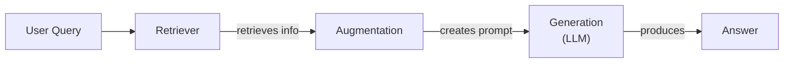
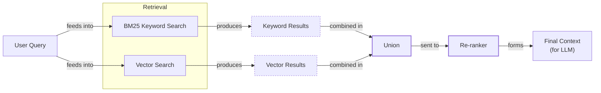
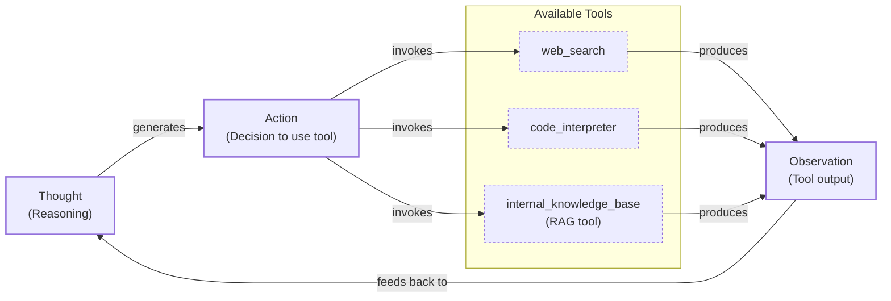

# Lesson 9: Retrieval-Augmented Generation

In our previous lessons, we built a foundation in AI Engineering. We explored the agent landscape, distinguished between LLM workflows and autonomous agents, and covered the essentials of context engineering, structured outputs, and agentic reasoning with ReAct. We saw how LLMs, when trained, are essentially taking a "closed-book exam" on the world's information. Their knowledge is static, frozen at the time of training, which makes them prone to hallucination when faced with topics beyond their scope.

Fine-tuning can teach a model new skills, but it is an inefficient way to inject new facts. We do not yet have techniques that allow models to continuously learn from experience after deployment. This is where Retrieval-Augmented Generation (RAG) comes in. RAG is a core method within the context engineering discipline we introduced in Lesson 3. Instead of forcing the model to memorize everything, we give it an "open-book exam." We connect the LLM to external, real-time knowledge sources, allowing it to retrieve information on the fly.

This lesson will cover the fundamentals of RAG, from its core components to the end-to-end pipeline. We will explore advanced techniques for improving retrieval quality and, finally, see how RAG becomes a powerful tool in the hands of an autonomous agent. This approach complements the agent memory systems we will discuss in Lesson 10, which store and recall information from past interactions.

## The RAG System: Core Components

To design effective RAG systems, you first need to understand its three conceptual pillars. This is the first step in the context engineering process we covered in Lesson 3. Each pillar has a distinct responsibility in transforming a user's query into a factually grounded answer.

-   **Retrieval:** This is the search engine of the system. Its job is to find the most relevant pieces of information from a knowledge base in response to a user's query. The most common approach is semantic search, which relies on vector embeddings—numerical representations of text—stored in a specialized vector database. When a user asks a question, it is also converted into an embedding, and the system searches for the stored text chunks with the closest embeddings. Keyword-based search methods like BM25 can also be used to find exact matches [[38]](https://mlpills.substack.com/p/issue-76-optimize-rag-with-hybrid).
-   **Augmentation:** Once the retriever finds the relevant information, this step takes that data and "augments" the user's original query. It involves formatting the retrieved text chunks and the user's question into a clear and structured prompt that will be sent to the LLM.
-   **Generation:** This is the final step where the LLM receives the augmented prompt. The model uses the provided context to generate a coherent and factually grounded answer, effectively using the retrieved information as its source of truth for the response [[27]](https://www.aimon.ai/posts/rag_and_its_different_components/).

Image 1: A flowchart illustrating the core components of a RAG system.

Now that you can name each moving part, we will see how they line up across the two phases of a real system.

## The RAG Pipeline: Ingestion and Retrieval

The end-to-end RAG workflow is split into two distinct phases. The first phase happens offline to prepare the knowledge base, while the second happens online in real-time to answer user queries [[32]](https://newsletter.systemdesign.one/p/how-rag-works).

### Phase 1: Offline Ingestion & Indexing

This is the preparatory phase where you process your source documents and build a searchable index. It involves a sequence of steps:

1.  **Load:** The process starts by loading your documents from various sources, which could be anything from PDFs and websites to APIs. Tools like LangChain's document loaders or LlamaIndex's readers are commonly used for this [[32]](https://newsletter.systemdesign.one/p/how-rag-works).
2.  **Split:** Large documents are broken down into smaller, manageable chunks. This is a critical step because you want each chunk to be semantically meaningful and not cut off mid-idea. Strategies range from simple fixed-size splitting to more advanced methods like using a `RecursiveCharacterTextSplitter` or a `SemanticSplitter` [[52]](https://medium.com/@robi.tomar72/how-rag-actually-works-embeddings-vector-databases-indexing-retrieval-explained-simply-3d1ca45fe1bf).
3.  **Embed:** Each text chunk is then converted into a vector embedding using a specialized model. Popular choices include models from OpenAI, Google, Cohere, or open-source variants like BGE available through Hugging Face [[8]](https://qdrant.tech/articles/what-is-rag-in-ai/).
4.  **Store:** Finally, these embeddings and their corresponding text are loaded into a vector database or a search index that supports fast similarity lookups. Examples include local libraries like FAISS or scalable databases like Milvus, Qdrant, Pinecone, and search engines like Elasticsearch with k-NN capabilities [[52]](https://medium.com/@robi.tomar72/how-rag-actually-works-embeddings-vector-databases-indexing-retrieval-explained-simply-3d1ca45fe1bf).

### Phase 2: Online Retrieval & Generation

This phase is triggered when a user submits a query:

1.  **Embed:** The user's query is converted into a vector using the same embedding model used during the ingestion phase. This ensures that the query and the documents are represented in the same vector space [[8]](https://qdrant.tech/articles/what-is-rag-in-ai/).
2.  **Search:** The system uses the query vector to search the vector database and retrieve the top-k most similar document chunks. This is typically done using a similarity metric like cosine similarity [[54]](https://towardsdatascience.com/rag-explained-understanding-embeddings-similarity-and-retrieval/).
3.  **Generate:** The retrieved chunks are combined with the original user query and a set of instructions into a single prompt. This augmented prompt is then passed to an LLM, which generates a final answer grounded in the retrieved context. Here, you can use structured outputs, as we learned in Lesson 4, to ensure the answer includes citations back to the source documents.

```mermaid
flowchart LR
  %% Phase 1: Offline Ingestion & Indexing
  subgraph "Offline Ingestion & Indexing"
    Documents["Documents"]
    Load["Load<br/>(Unstructured, LangChain, LlamaIndex)"]
    Split["Split<br/>(RecursiveCharacterTextSplitter, SemanticSplitter)"]
    Chunks["Chunks"]
    Embed_offline["Embed<br/>(OpenAI, Google Gemini, Cohere, Voyage, bge)"]
    VectorEmbeddings["Vector Embeddings"]
    Store["Store<br/>(FAISS, Milvus, Qdrant, Pinecone, Elasticsearch/OpenSearch)"]
    VectorDatabase["Vector Database"]

    Documents -- "processed by" --> Load
    Load -- "outputs" --> Split
    Split -- "creates" --> Chunks
    Chunks -- "sent to" --> Embed_offline
    Embed_offline -- "creates" --> VectorEmbeddings
    VectorEmbeddings -- "sent to" --> Store
    Store -- "stores in" --> VectorDatabase
  end

  %% Phase 2: Online Retrieval & Generation
  subgraph "Online Retrieval & Generation"
    UserQuery["User Query"]
    Embed_online["Embed<br/>(same model as ingestion)"]
    QueryVector["Query Vector"]
    Search["Search<br/>(vector similarity in Elasticsearch/OpenSearch, Pinecone, FAISS)"]
    TopKChunks["Top-K Chunks"]
    Generate["Generate<br/>(structured outputs, LLM call)"]
    GroundedAnswer["Grounded Answer"]

    UserQuery -- "initiated" --> Embed_online
    Embed_online -- "creates" --> QueryVector
    QueryVector -- "used to" --> Search
    Search -- "finds" --> TopKChunks
    TopKChunks -- "used by" --> Generate
    UserQuery -- "context for" --> Generate
    Generate -- "produces" --> GroundedAnswer
  end

  %% Cross-phase interaction
  VectorDatabase -- "queried by" --> Search

  %% Visual grouping
  classDef phase_header fill:#f9f,stroke:#333,stroke-width:2px
  class Documents,UserQuery phase_header
```

Image 2: A detailed flowchart showing the end-to-end RAG workflow, split into two main phases: Offline Ingestion & Indexing and Online Retrieval & Generation.

With the end-to-end path in place, the next question is quality. What are the advanced techniques to make retrieval more accurate and useful across messy, real-world data?

## Advanced RAG Techniques

A naive RAG pipeline is a great starting point, but production systems often require more sophisticated techniques to handle the complexities of real-world data and user queries. Here are some advanced methods that significantly improve retrieval performance.

### Hybrid Search

This technique combines the strengths of two different search methods: keyword-based search (like BM25) and semantic vector search [[38]](https://mlpills.substack.com/p/issue-76-optimize-rag-with-hybrid). Keyword search excels at finding exact matches for specific terms, jargon, or IDs, while vector search is great at understanding the meaning and context behind a query. For example, if a customer support query is "my bill keeps rolling over," a keyword search will find articles with the exact word "rollover." A semantic search might also find documents that talk about a "carryover balance," capturing the user's intent even with different phrasing [[42]](https://redis.io/blog/10-techniques-to-improve-rag-accuracy/). By fusing the results of both, you get more comprehensive and relevant results.

Image 3: A flowchart illustrating the hybrid retrieval flow.

### Re-ranking

Initial retrieval is optimized for speed and recall, meaning it casts a wide net to find potentially relevant documents. However, the best match might not always be at the top of the list. Re-ranking introduces a second, more precise model to re-order this initial set of results [[43]](https://apxml.com/courses/optimizing-rag-for-production/chapter-2-advanced-retrieval-optimization/reranking-architectures-rag). A cross-encoder, for example, evaluates the query against each retrieved document jointly, providing a more accurate relevance score. For a product help query like "how to connect my account," a re-ranker can push the official step-by-step guide to the top, above less relevant press releases or community forum posts.

### Query Transformations

Sometimes, the user's query is not in the best form for retrieval. Query transformation techniques modify the original query to improve its chances of matching the right documents.
-   **Decomposition:** This breaks down a complex, multi-part question into several simpler sub-questions. For a query like, “What’s our travel policy for conferences in Europe this year?” the system might generate sub-questions about the general travel policy, conference-specific rules, and any recent updates for Europe [[19]](https://docs.nvidia.com/rag/latest/query_decomposition.html). It retrieves documents for each sub-question and then merges the results.
-   **HyDE (Hypothetical Document Embeddings):** This method first generates a hypothetical, ideal answer to the user's query. It then embeds this hypothetical document and uses that embedding for the search [[16]](https://47billion.com/blog/rag-system-in-production-why-it-fails-and-how-to-fix-it/). Because the hypothetical answer is phrased in the language of the documents, it often leads to better semantic matches.

### Advanced Chunking Strategies

How you split your documents can have a massive impact on retrieval quality. Moving beyond simple fixed-size chunking is often necessary.
-   **Semantic Chunking:** This method splits text based on topical shifts, ensuring that each chunk contains a single coherent idea [[17]](https://sarthakai.substack.com/p/improve-your-rag-accuracy-with-a). For example, in a 20-page handbook, this would keep the entire "Reimbursements" section together, rather than splitting it in half and losing crucial context like spending limits.
-   **Layout-aware Chunking:** For documents like PDFs with tables or forms, this strategy preserves the visual and structural layout. It ensures that a row in a pricing table, with its product, price, and discount, remains intact instead of being arbitrarily split by character count [[17]](https://sarthakai.substack.com/p/improve-your-rag-accuracy-with-a).

### GraphRAG

This technique involves building a knowledge graph from your documents, where entities are nodes and relationships are edges. Retrieval then happens over this graph. This approach excels at answering multi-hop questions that require understanding complex relationships between different pieces of information [[46]](https://arxiv.org/html/2601.03014v1). For an IT operations query like, “Which incidents were caused by weekend deploys that also touched the login service?” GraphRAG can traverse connections between change records, deployment times, affected services, and incident tickets to synthesize a comprehensive answer.

These techniques increase retrieval quality. Next, we will see how retrieval becomes one tool that an agent can choose to use as it reasons.

## Agentic RAG

In Lessons 7 and 8, we introduced the ReAct framework, where an agent cycles through Thought, Action, and Observation to solve problems. Agentic RAG is the application of this principle, where retrieval is not a fixed step in a pipeline but a tool that a reasoning agent can choose to use [[11]](https://towardsdatascience.com/agentic-rag-vs-classic-rag-from-a-pipeline-to-a-control-loop/). The agent reasons about its knowledge gaps and decides when and how to query its knowledge base.

The core distinction lies in the control flow.
-   **Standard RAG** is a linear, predetermined workflow: Retrieve → Augment → Generate. It is powerful but rigid, following the same path for every query.
-   **Agentic RAG** is an adaptive, iterative loop. The agent decides whether to retrieve, what to retrieve, and if it needs to retrieve again. It can reformulate queries, choose between different knowledge sources, or even combine information from multiple tools [[13]](https://medium.com/@gaddam.rahul.kumar/agentic-rag-vs-traditional-rag-b1a156f72167).

This agentic approach unlocks several advanced capabilities. The agent can iteratively refine its search. If the first retrieval pass on a vague policy document is unhelpful, it can narrow the scope with a more specific query ("EU customers, 2024 updates") and retrieve again. It can also choose the most appropriate knowledge base to search, for instance, selecting `search_incident_runbooks` over `search_marketing_pages` for a technical outage query [[13]](https://medium.com/@gaddam.rahul.kumar/agentic-rag-vs-traditional-rag-b1a156f72167).

Furthermore, the agent can fuse information from its RAG tool with outputs from other tools, like a web search. For example, it might retrieve an internal policy on data retention, then use a web search to verify current regulatory laws before synthesizing a final answer. A conceptual thought process might look like this:

1.  **Thought:** The user is asking about "2024 EU data retention rules." My internal policy document is from 2023, so it might be outdated. I need to verify this externally.
2.  **Action:** `retrieve(internal_policy, query="EU data retention 2024")`
3.  **Observation:** The internal document mentions upcoming amendments but lacks details.
4.  **Thought:** I need to find the official 2024 directive. I will use a web search.
5.  **Action:** `web_search(query="EU data retention directive 2024 official")`
6.  **Observation:** The search returns the updated official directive.
7.  **Thought:** Now I have both the internal context and the latest external rules. I can synthesize an answer that highlights the changes from 2023.

This transforms RAG from a simple database lookup into a dynamic conversation with a research assistant.

Image 4: Circular flowchart illustrating an agent's main loop in Agentic RAG.

You now understand both a linear RAG pipeline and how an agent can control retrieval when needed. Let’s wrap up by situating RAG in the wider AI Engineering toolkit and previewing what comes next.

## Conclusion

We have seen that RAG is the most widely used solution to the LLM knowledge problem. It reduces hallucinations, enables customization with proprietary data, and builds user trust by providing verifiable, source-backed answers. For production-grade quality, advanced techniques like hybrid search and re-ranking are essential. The future of knowledge retrieval is agentic, where an LLM can reason and decide how to best use its retrieval tools.

RAG is not a niche skill but a foundational competency for the modern AI Engineer, forming a key part of context engineering. In our next lesson, we will explore memory for agents, and see how short-term and long-term memory systems complement the retrieval capabilities we have discussed here. Later in the course, we will also cover the critical topics of evaluating retrieval quality and monitoring these complex systems in production.

## References

-   [1] [Knowledge Graphs and LLMs: Fine-Tuning vs. Retrieval-Augmented Generation](https://neo4j.com/blog/developer/fine-tuning-vs-rag/)
-   [3] [Addressing AI hallucinations with retrieval-augmented generation](https://www.infoworld.com/article/2335043/addressing-ai-hallucinations-with-retrieval-augmented-generation.html)
-   [4] [Fine-Tuning or Retrieval? Comparing Knowledge Injection in LLMs](https://aclanthology.org/2024.emnlp-main.15.pdf)
-   [5] [Fine-Tuning or Retrieval? Comparing Knowledge Injection in LLMs](https://arxiv.org/html/2312.05934v3)
-   [6] [Vector Databases in Practice: Building a Realistic Hybrid-Search RAG System with Qdrant](https://pub.towardsai.net/vector-databases-in-practice-building-a-realistic-hybrid-search-rag-system-with-qdrant-7b8f4a6e41e0)
-   [8] [What is RAG: Understanding Retrieval-Augmented Generation](https://qdrant.tech/articles/what-is-rag-in-ai/)
-   [9] [Vector Embeddings in RAG Applications](https://wandb.ai/mostafaibrahim17/ml-articles/reports/Vector-Embeddings-in-RAG-Applications--Vmlldzo3OTk1NDA5)
-   [11] [Agentic RAG vs Classic RAG: From a Pipeline to a Control Loop](https://towardsdatascience.com/agentic-rag-vs-classic-rag-from-a-pipeline-to-a-control-loop/)
-   [12] [Agentic RAG vs Traditional RAG: Key Differences and Benefits](https://www.pingcap.com/article/agentic-rag-vs-traditional-rag-key-differences-benefits/)
-   [13] [Agentic RAG vs Traditional RAG](https://medium.com/@gaddam.rahul.kumar/agentic-rag-vs-traditional-rag-b1a156f72167)
-   [16] [RAG System in Production: Why It Fails and How to Fix It](https://47billion.com/blog/rag-system-in-production-why-it-fails-and-how-to-fix-it/)
-   [17] [Improve your RAG accuracy with a simple trick: Layout-aware chunking](https://sarthakai.substack.com/p/improve-your-rag-accuracy-with-a)
-   [18] [Advanced RAG Techniques That Will Transform Your LLM Applications](https://cloudurable.com/blog/advanced-rag-techniques-that-will-transform-your-l/)
-   [19] [Query Decomposition](https://docs.nvidia.com/rag/latest/query_decomposition.html)
-   [20] [Advanced RAG Techniques](https://neo4j.com/blog/genai/advanced-rag-techniques/)
-   [21] [Retrieval-Augmented Generation: Building Grounded AI for Enterprise Knowledge](https://medium.com/@fahey_james/retrieval-augmented-generation-building-grounded-ai-for-enterprise-knowledge-6bc46277fee5)
-   [25] [RAG Inventor Talks Agents, Grounded AI and Enterprise Impact](https://www.madrona.com/rag-inventor-talks-agents-grounded-ai-and-enterprise-impact/)
-   [26] [RAG Architectures and Best Practices For Any LLM](https://humanloop.com/blog/rag-architectures)
-   [27] [RAG and its different components](https://www.aimon.ai/posts/rag_and_its_different_components/)
-   [29] [What is retrieval-augmented generation?](https://www.ibm.com/think/topics/retrieval-augmented-generation)
-   [31] [RAG Pipeline Deep-Dive: Ingestion (Chunking, Embedding) and Vector Search](https://medium.com/@derrickryangiggs/rag-pipeline-deep-dive-ingestion-chunking-embedding-and-vector-search-abd3c8bfc177)
-   [32] [How RAG works](https://newsletter.systemdesign.one/p/how-rag-works)
-   [33] [RAGOps Guide: Building and Scaling Retrieval-Augmented Generation Systems](https://towardsdatascience.com/ragops-guide-building-and-scaling-retrieval-augmented-generation-systems-3d26b3ebd627/)
-   [35] [What is Retrieval-Augmented Generation (RAG)?](https://aws.amazon.com/what-is/retrieval-augmented-generation/)
-   [38] [Issue #76 - Optimize RAG with Hybrid search](https://mlpills.substack.com/p/issue-76-optimize-rag-with-hybrid)
-   [39] [Hybrid Search Optimization: How BM25 and Dense Vector Retrieval Work Together for Superior AI Search](https://cubitrek.com/blog/hybrid-search-optimization-how-bm25-and-dense-vector-retrieval-work-together-for-superior-ai-search/)
-   [40] [Hybrid RAG in the Real World: Graphs, BM25, and the End of Black Box Retrieval](https://community.netapp.com/t5/Tech-ONTAP-Blogs/Hybrid-RAG-in-the-Real-World-Graphs-BM25-and-the-End-of-Black-Box-Retrieval/ba-p/464834)
-   [41] [A Survey on Retrieval-Augmented Generation for Large Language Models](https://arxiv.org/html/2407.00072v5)
-   [42] [10 techniques to improve RAG accuracy](https://redis.io/blog/10-techniques-to-improve-rag-accuracy/)
-   [43] [Reranking Architectures in RAG](https://apxml.com/courses/optimizing-rag-for-production/chapter-2-advanced-retrieval-optimization/reranking-architectures-rag)
-   [44] [Advanced RAG Techniques](https://neo4j.com/blog/genai/advanced-rag-techniques/)
-   [45] [Advanced RAG Retrieval: Cross-Encoders Re-ranking](https://towardsdatascience.com/advanced-rag-retrieval-cross-encoders-reranking/)
-   [46] [Corrective Retrieval Augmented Generation](https://arxiv.org/html/2601.03014v1)
-   [48] [From Local to Global: A GraphRAG Approach to Query-Focused Summarization](https://webhome.cs.uvic.ca/~thomo/papers/asonam2025-graphrag.pdf)
-   [50] [A Survey on Graph-based Retrieval-Augmented Generation](https://arxiv.org/html/2501.00309v2)
-   [52] [How RAG Actually Works: Embeddings, Vector Databases, Indexing, & Retrieval Explained Simply](https://medium.com/@robi.tomar72/how-rag-actually-works-embeddings-vector-databases-indexing-retrieval-explained-simply-3d1ca45fe1bf)
-   [53] [Vector DB and RAG Pipeline for Document RAG](https://learnopencv.com/vector-db-and-rag-pipeline-for-document-rag/)
-   [54] [RAG Explained: Understanding Embeddings, Similarity, and Retrieval](https://towardsdatascience.com/rag-explained-understanding-embeddings-similarity-and-retrieval/)
-   [56] [Retrieval-Augmented Generation (RAG) Explained](https://www.topquadrant.com/resources/blog-retrieval-augmented-generation-explained/)
-   [59] [Retrieval-Augmented Generation (RAG)](https://www.promptingguide.ai/research/rag)
-   [60] [Retrieval-Augmented Generation (RAG) from basics to advanced](https://medium.com/@tejpal.abhyuday/retrieval-augmented-generation-rag-from-basics-to-advanced-a2b068fd576c)
-   [61] [What Is Retrieval-Augmented Generation, aka RAG?](https://blogs.nvidia.com/blog/what-is-retrieval-augmented-generation/)
-   [62] [A Complete Guide to RAG](https://towardsai.net/p/l/a-complete-guide-to-rag)
-   [63] [Retrieval-Augmented Generation (RAG) Fundamentals First](https://decodingml.substack.com/p/rag-fundamentals-first?utm_source=publication-search)
-   [64] [Your RAG is wrong: Here's how to fix it](https://decodingml.substack.com/p/your-rag-is-wrong-heres-how-to-fix?utm_source=publication-search)
-   [65] [From Local to Global: A GraphRAG Approach to Query-Focused Summarization](https://arxiv.org/html/2404.16130)
-   [66] [Introducing Contextual Retrieval](https://www.anthropic.com/news/contextual-retrieval)
-   [67] [What is Agentic RAG](https://weaviate.io/blog/what-is-agentic-rag)
-   [68] [RAG is dead, long live agentic retrieval](https://www.llamaindex.ai/blog/rag-is-dead-long-live-agentic-retrieval)
-   [69] [What is agentic RAG?](https://www.ibm.com/think/topics/agentic-rag)
-   [70] [Build advanced retrieval-augmented generation systems](https://learn.microsoft.com/en-us/azure/developer/ai/advanced-retrieval-augmented-generation)
-   [71] [The Rise of RAG](https://highlearningrate.substack.com/p/the-rise-of-rag)