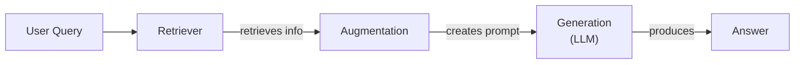
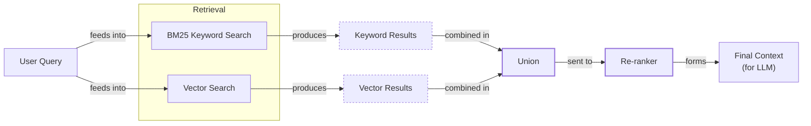
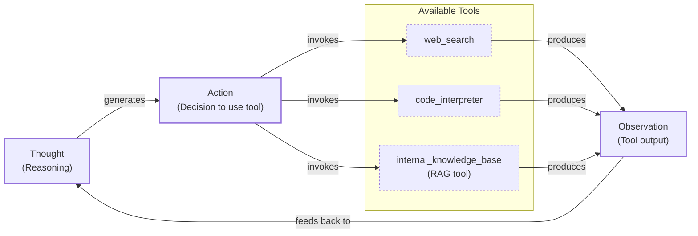

# Lesson 9: Retrieval-Augmented Generation

In our previous lessons, we built a foundation in AI Engineering. We explored the agent landscape, distinguished between LLM workflows and autonomous agents, and covered the essentials of context engineering, structured outputs, and agentic reasoning with ReAct. We saw how LLMs, when trained, are essentially taking a "closed-book exam" on the world's information. Their knowledge is static, frozen at the time of training, which makes them prone to hallucination when faced with topics beyond their scope.

Fine-tuning can teach a model new skills, but it is an inefficient way to inject new facts. We do not yet have techniques that allow models to continuously learn from experience after deployment. This is where Retrieval-Augmented Generation (RAG) comes in. RAG is a core method within the context engineering discipline we introduced in Lesson 3. Instead of forcing the model to memorize everything, we give it an "open-book exam." We connect the LLM to external, real-time knowledge sources, allowing it to retrieve information on the fly.

This lesson will cover the fundamentals of RAG, from its core components to the end-to-end pipeline. We will explore advanced techniques for improving retrieval quality and, finally, see how RAG becomes a powerful tool in the hands of an autonomous agent. This approach complements the agent memory systems we will discuss in Lesson 10, which store and recall information from past interactions.

## The RAG System: Core Components

To design effective RAG systems, you first need to understand its three conceptual pillars. This is the first step in the context engineering process we covered in Lesson 3. Each pillar has a distinct responsibility in transforming a user's query into a factually grounded answer.

**Retrieval** is the search engine of the system. Its job is to find the most relevant information from a knowledge base. The most common approach is semantic search, which relies on vector embeddings. These are numerical representations of text that capture semantic meaning, stored in a specialized vector database [[4]](https://qdrant.tech/articles/what-is-rag-in-ai/). Models like BERT are used to encode text into these dense vectors, which act as "compact meaning snapshots" [[5]](https://medium.com/@robi.tomar72/how-rag-actually-works-embeddings-vector-databases-indexing-retrieval-explained-simply-3d1ca45fe1bf). When a user asks a question, it is also converted into an embedding, and the system finds the stored text chunks with the closest embeddings. Keyword-based search methods like BM25 can also be used to find exact matches [[1]](https://mlpills.substack.com/p/issue-76-optimize-rag-with-hybrid).

**Augmentation** takes the retrieved information and formats it into the context of a prompt for the LLM. This step combines the user's original query with the retrieved text chunks to create a clear and structured input [[15]](https://www.topquadrant.com/resources/blog-retrieval-augmented-generation-explained/).

**Generation** is the final step where the LLM uses the augmented prompt to generate an answer. The model's response is grounded in the provided data, which serves as its source of truth [[2]](https://www.aimon.ai/posts/rag_and_its_different_components/).

Image 1: A flowchart illustrating the core components of a RAG system.

Now that you can name each moving part, we will see how they line up across the two phases of a real system.

## The RAG Pipeline: Ingestion and Retrieval

The end-to-end RAG workflow is split into two distinct phases. The first phase happens offline to prepare the knowledge base, while the second happens online in real-time to answer user queries [[3]](https://newsletter.systemdesign.one/p/how-rag-works).

### Phase 1: Offline Ingestion & Indexing

This is the preparatory phase where you process your source documents and build a searchable index. It involves a sequence of steps:

1.  **Load:** The process starts by loading your documents from various sources, which could be anything from PDFs and websites to APIs. Tools like LangChain's document loaders or LlamaIndex's readers are commonly used for this [[3]](https://newsletter.systemdesign.one/p/how-rag-works).
2.  **Split:** Large documents are broken down into smaller, manageable chunks. This is a critical step because you want each chunk to be semantically meaningful and not cut off mid-idea. Strategies range from simple fixed-size splitting to more advanced methods like using a `RecursiveCharacterTextSplitter` or a `SemanticSplitter` [[5]](https://medium.com/@robi.tomar72/how-rag-actually-works-embeddings-vector-databases-indexing-retrieval-explained-simply-3d1ca45fe1bf).
3.  **Embed:** Each text chunk is then converted into a vector embedding using a specialized model. Popular choices include models from OpenAI, Google, Cohere, or open-source variants like BGE available through Hugging Face [[4]](https://qdrant.tech/articles/what-is-rag-in-ai/).
4.  **Store:** Finally, these embeddings and their corresponding text are loaded into a vector database or a search index that supports fast similarity lookups. Examples include local libraries like FAISS or scalable databases like Milvus, Qdrant, Pinecone, and search engines like Elasticsearch with k-NN capabilities [[5]](https://medium.com/@robi.tomar72/how-rag-actually-works-embeddings-vector-databases-indexing-retrieval-explained-simply-3d1ca45fe1bf).

### Phase 2: Online Retrieval & Generation

This phase is triggered when a user submits a query:

1.  **Embed:** The user's query is converted into a vector using the same embedding model used during the ingestion phase. This ensures that the query and the documents are represented in the same vector space [[4]](https://qdrant.tech/articles/what-is-rag-in-ai/).
2.  **Search:** The system uses the query vector to search the vector database and retrieve the top-k most similar document chunks. This is typically done using a similarity metric like cosine similarity [[6]](https://towardsdatascience.com/rag-explained-understanding-embeddings-similarity-and-retrieval/).
3.  **Generate:** The retrieved chunks are combined with the original user query and a set of instructions into a single prompt. This augmented prompt is then passed to an LLM, which generates a final answer grounded in the retrieved context. Here, you can use structured outputs, as we learned in Lesson 4, to ensure the answer includes citations back to the source documents.

```mermaid
flowchart LR
  %% Phase 1: Offline Ingestion & Indexing
  subgraph "Offline Ingestion & Indexing"
    Documents["Documents"]
    Load["Load<br/>(Unstructured, LangChain, LlamaIndex)"]
    Split["Split<br/>(RecursiveCharacterTextSplitter, SemanticSplitter)"]
    Chunks["Chunks"]
    Embed_offline["Embed<br/>(OpenAI, Google Gemini, Cohere, Voyage, bge)"]
    VectorEmbeddings["Vector Embeddings"]
    Store["Store<br/>(FAISS, Milvus, Qdrant, Pinecone, Elasticsearch/OpenSearch)"]
    VectorDatabase["Vector Database"]

    Documents -- "processed by" --> Load
    Load -- "outputs" --> Split
    Split -- "creates" --> Chunks
    Chunks -- "sent to" --> Embed_offline
    Embed_offline -- "creates" --> VectorEmbeddings
    VectorEmbeddings -- "sent to" --> Store
    Store -- "stores in" --> VectorDatabase
  end

  %% Phase 2: Online Retrieval & Generation
  subgraph "Online Retrieval & Generation"
    UserQuery["User Query"]
    Embed_online["Embed<br/>(same model as ingestion)"]
    QueryVector["Query Vector"]
    Search["Search<br/>(vector similarity in Elasticsearch/OpenSearch, Pinecone, FAISS)"]
    TopKChunks["Top-K Chunks"]
    Generate["Generate<br/>(structured outputs, LLM call)"]
    GroundedAnswer["Grounded Answer"]

    UserQuery -- "initiated" --> Embed_online
    Embed_online -- "creates" --> QueryVector
    QueryVector -- "used to" --> Search
    Search -- "finds" --> TopKChunks
    TopKChunks -- "used by" --> Generate
    UserQuery -- "context for" --> Generate
    Generate -- "produces" --> GroundedAnswer
  end

  %% Cross-phase interaction
  VectorDatabase -- "queried by" --> Search

  %% Visual grouping
  classDef phase_header fill:#f9f,stroke:#333,stroke-width:2px
  class Documents,UserQuery phase_header
```

Image 2: A detailed flowchart showing the end-to-end RAG workflow, split into two main phases: Offline Ingestion & Indexing and Online Retrieval & Generation.

With the end-to-end path in place, the next question is quality. What are the advanced techniques to make retrieval more accurate and useful across messy, real-world data?

## Advanced RAG Techniques

A naive RAG pipeline is a great starting point, but production systems often require more sophisticated techniques to handle the complexities of real-world data and user queries. Here are some advanced methods that significantly improve retrieval performance.

### Hybrid Search

This technique combines keyword-based search (like BM25) for precision with semantic vector search for meaning [[1]](https://mlpills.substack.com/p/issue-76-optimize-rag-with-hybrid). Keyword search finds exact terms, while vector search understands context. For a query like "my bill keeps rolling over," keyword search finds "rollover," while semantic search finds "carryover balance" [[7]](https://redis.io/blog/10-techniques-to-improve-rag-accuracy/). Fusing both results provides more comprehensive coverage.

Image 3: A flowchart illustrating the hybrid retrieval flow.

### Re-ranking

Initial retrieval prioritizes speed, but the best documents may not be ranked first. Re-ranking uses a second, more precise model (like a cross-encoder) to re-order the initial results for better relevance [[8]](https://apxml.com/courses/optimizing-rag-for-production/chapter-2-advanced-retrieval-optimization/reranking-architectures-rag). It evaluates the query and each document together. For a query like "how to connect my account," a re-ranker would prioritize a step-by-step guide over a press release.

### Query Transformations

Sometimes, the user's query is not optimal for retrieval. Query transformation techniques modify it to improve matches. **Decomposition** breaks a complex question into simpler sub-questions, retrieves for each, and merges the results [[9]](https://docs.nvidia.com/rag/latest/query_decomposition.html). **HyDE (Hypothetical Document Embeddings)** generates a hypothetical answer to the query first, then uses that answer's embedding to perform the search, which often yields better semantic matches [[10]](https://47billion.com/blog/rag-system-in-production-why-it-fails-and-how-to-fix-it/).

### Advanced Chunking Strategies

How you split documents is critical. **Semantic Chunking** splits text based on topical shifts, ensuring each chunk contains one coherent idea [[11]](https://sarthakai.substack.com/p/improve-your-rag-accuracy-with-a). For a handbook, this keeps the "Reimbursements" section intact. **Layout-aware Chunking** preserves the structure of documents like PDFs, keeping tables and their labels together instead of splitting them arbitrarily [[11]](https://sarthakai.substack.com/p/improve-your-rag-accuracy-with-a).

### GraphRAG

This technique builds a knowledge graph from your documents, with entities as nodes and relationships as edges. It excels at answering multi-hop questions that require understanding complex connections [[12]](https://arxiv.org/html/2601.03014v1). For an IT query like, “Which incidents were caused by weekend deploys that also touched the login service?” it can traverse links between change records, deploy times, and incident tickets. Similarly, for a retail query like, “Which shoes get the most size-related returns and were featured in last month’s ads?” the system connects returns data to sizing reasons, specific products, and the marketing calendar.

These techniques increase retrieval quality. Next, we will see how retrieval becomes one tool that an agent can choose to use as it reasons.

## Agentic RAG

In Lessons 7 and 8, we introduced the ReAct framework, where an agent cycles through Thought, Action, and Observation to solve problems. Agentic RAG applies this principle by treating retrieval not as a fixed step, but as a tool a reasoning agent can choose to use [[13]](https://towardsdatascience.com/agentic-rag-vs-classic-rag-from-a-pipeline-to-a-control-loop/). The agent assesses its knowledge gaps and decides when and how to query its knowledge base.

The core distinction is the control flow.
-   **Standard RAG** is a linear workflow: Retrieve → Augment → Generate. It is powerful but rigid.
-   **Agentic RAG** is an adaptive loop. The agent decides whether to retrieve, what to retrieve, and if it needs to retrieve again. It can reformulate queries, choose between different knowledge sources, or combine information from multiple tools [[14]](https://medium.com/@gaddam.rahul.kumar/agentic-rag-vs-traditional-rag-b1a156f72167).

This agentic approach unlocks advanced capabilities. The agent can iteratively refine its search, choose the most appropriate knowledge base, and fuse information from its RAG tool with outputs from other tools, like a web search.

For a query about "2024 EU data retention rules," the agent might first think its internal 2023 policy is outdated. It would then perform an action to retrieve the internal policy, observe that it's missing details, and form a new thought to verify externally. It would then use a `web_search` action to find the official 2024 directive, observe the new information, and finally synthesize an answer combining both sources. This transforms RAG from a simple database lookup into a dynamic conversation with a research assistant.

Image 4: Circular flowchart illustrating an agent's main loop in Agentic RAG.

You now understand both a linear RAG pipeline and how an agent can control retrieval when needed. Let’s wrap up by situating RAG in the wider AI Engineering toolkit and previewing what comes next.

## Conclusion

We have seen that RAG is the most used solution to the LLM knowledge problem. It reduces hallucinations, enables customization with proprietary data, and builds user trust by providing verifiable, source-backed answers. For production-grade quality, advanced techniques like hybrid search and re-ranking are essential. The future of knowledge retrieval is agentic, where an LLM can reason and decide how to best use its retrieval tools.

RAG is not a niche skill but a foundational competency for the modern AI Engineer, forming a key part of context engineering. In our next lesson, we will explore memory for agents, and see how short-term and long-term memory systems complement the retrieval capabilities we have discussed here. Later in the course, we will also cover the critical topics of evaluating retrieval quality and monitoring these complex systems in production.

## References

-   [1] [Issue #76 - Optimize RAG with Hybrid search](https://mlpills.substack.com/p/issue-76-optimize-rag-with-hybrid)
-   [2] [RAG and its different components](https://www.aimon.ai/posts/rag_and_its_different_components/)
-   [3] [How RAG works](https://newsletter.systemdesign.one/p/how-rag-works)
-   [4] [What is RAG: Understanding Retrieval-Augmented Generation](https://qdrant.tech/articles/what-is-rag-in-ai/)
-   [5] [How RAG Actually Works: Embeddings, Vector Databases, Indexing, & Retrieval Explained Simply](https://medium.com/@robi.tomar72/how-rag-actually-works-embeddings-vector-databases-indexing-retrieval-explained-simply-3d1ca45fe1bf)
-   [6] [RAG Explained: Understanding Embeddings, Similarity, and Retrieval](https://towardsdatascience.com/rag-explained-understanding-embeddings-similarity-and-retrieval/)
-   [7] [10 techniques to improve RAG accuracy](https://redis.io/blog/10-techniques-to-improve-rag-accuracy/)
-   [8] [Reranking Architectures in RAG](https://apxml.com/courses/optimizing-rag-for-production/chapter-2-advanced-retrieval-optimization/reranking-architectures-rag)
-   [9] [Query Decomposition](https://docs.nvidia.com/rag/latest/query_decomposition.html)
-   [10] [RAG System in Production: Why It Fails and How to Fix It](https://47billion.com/blog/rag-system-in-production-why-it-fails-and-how-to-fix-it/)
-   [11] [Improve your RAG accuracy with a simple trick: Layout-aware chunking](https://sarthakai.substack.com/p/improve-your-rag-accuracy-with-a)
-   [12] [Corrective Retrieval Augmented Generation](https://arxiv.org/html/2601.03014v1)
-   [13] [Agentic RAG vs Classic RAG: From a Pipeline to a Control Loop](https://towardsdatascience.com/agentic-rag-vs-classic-rag-from-a-pipeline-to-a-control-loop/)
-   [14] [Agentic RAG vs Traditional RAG](https://medium.com/@gaddam.rahul.kumar/agentic-rag-vs-traditional-rag-b1a156f72167)
-   [15] [Retrieval-Augmented Generation (RAG) Explained](https://www.topquadrant.com/resources/blog-retrieval-augmented-generation-explained/)
-   [16] [What Is Retrieval-Augmented Generation, aka RAG?](https://blogs.nvidia.com/blog/what-is-retrieval-augmented-generation/)
-   [17] [A Complete Guide to RAG](https://towardsai.net/p/l/a-complete-guide-to-rag)
-   [18] [Retrieval-Augmented Generation (RAG) Fundamentals First](https://decodingml.substack.com/p/rag-fundamentals-first?utm_source=publication-search)
-   [19] [Your RAG is wrong: Here's how to fix it](https://decodingml.substack.com/p/your-rag-is-wrong-heres-how-to-fix?utm_source=publication-search)
-   [20] [From Local to Global: A GraphRAG Approach to Query-Focused Summarization](https://arxiv.org/html/2404.16130)
-   [21] [Introducing Contextual Retrieval](https://www.anthropic.com/news/contextual-retrieval)
-   [22] [What is Agentic RAG](https://weaviate.io/blog/what-is-agentic-rag)
-   [23] [RAG is dead, long live agentic retrieval](https://www.llamaindex.ai/blog/rag-is-dead-long-live-agentic-retrieval)
-   [24] [What is agentic RAG?](https://www.ibm.com/think/topics/agentic-rag)
-   [25] [Build advanced retrieval-augmented generation systems](https://learn.microsoft.com/en-us/azure/developer/ai/advanced-retrieval-augmented-generation)
-   [26] [The Rise of RAG](https://highlearningrate.substack.com/p/the-rise-of-rag)
-   [27] [Knowledge Graphs and LLMs: Fine-Tuning vs. Retrieval-Augmented Generation](https://neo4j.com/blog/developer/fine-tuning-vs-rag/)
-   [28] [Addressing AI hallucinations with retrieval-augmented generation](https://www.infoworld.com/article/2335043/addressing-ai-hallucinations-with-retrieval-augmented-generation.html)
-   [29] [Fine-Tuning or Retrieval? Comparing Knowledge Injection in LLMs](https://aclanthology.org/2024.emnlp-main.15.pdf)
-   [30] [Fine-Tuning or Retrieval? Comparing Knowledge Injection in LLMs](https://arxiv.org/html/2312.05934v3)
-   [31] [Vector Databases in Practice: Building a Realistic Hybrid-Search RAG System with Qdrant](https://pub.towardsai.net/vector-databases-in-practice-building-a-realistic-hybrid-search-rag-system-with-qdrant-7b8f4a6e41e0)
-   [32] [Vector Embeddings in RAG Applications](https://wandb.ai/mostafaibrahim17/ml-articles/reports/Vector-Embeddings-in-RAG-Applications--Vmlldzo3OTk1NDA5)
-   [33] [Agentic RAG vs Traditional RAG: Key Differences and Benefits](https://www.pingcap.com/article/agentic-rag-vs-traditional-rag-key-differences-benefits/)
-   [34] [Advanced RAG Techniques That Will Transform Your LLM Applications](https://cloudurable.com/blog/advanced-rag-techniques-that-will-transform-your-l/)
-   [35] [Advanced RAG Techniques](https://neo4j.com/blog/genai/advanced-rag-techniques/)
-   [36] [Retrieval-Augmented Generation: Building Grounded AI for Enterprise Knowledge](https://medium.com/@fahey_james/retrieval-augmented-generation-building-grounded-ai-for-enterprise-knowledge-6bc46277fee5)
-   [37] [RAG Inventor Talks Agents, Grounded AI and Enterprise Impact](https://www.madrona.com/rag-inventor-talks-agents-grounded-ai-and-enterprise-impact/)
-   [38] [RAG Architectures and Best Practices For Any LLM](https://humanloop.com/blog/rag-architectures)
-   [39] [What is retrieval-augmented generation?](https://www.ibm.com/think/topics/retrieval-augmented-generation)
-   [40] [RAG Pipeline Deep-Dive: Ingestion (Chunking, Embedding) and Vector Search](https://medium.com/@derrickryangiggs/rag-pipeline-deep-dive-ingestion-chunking-embedding-and-vector-search-abd3c8bfc177)
-   [41] [RAGOps Guide: Building and Scaling Retrieval-Augmented Generation Systems](https://towardsdatascience.com/ragops-guide-building-and-scaling-retrieval-augmented-generation-systems-3d26b3ebd627/)
-   [42] [What is Retrieval-Augmented Generation (RAG)?](https://aws.amazon.com/what-is/retrieval-augmented-generation/)
-   [43] [Hybrid Search Optimization: How BM25 and Dense Vector Retrieval Work Together for Superior AI Search](https://cubitrek.com/blog/hybrid-search-optimization-how-bm25-and-dense-vector-retrieval-work-together-for-superior-ai-search/)
-   [44] [Hybrid RAG in the Real World: Graphs, BM25, and the End of Black Box Retrieval](https://community.netapp.com/t5/Tech-ONTAP-Blogs/Hybrid-RAG-in-the-Real-World-Graphs-BM25-and-the-End-of-Black-Box-Retrieval/ba-p/464834)
-   [45] [A Survey on Retrieval-Augmented Generation for Large Language Models](https://arxiv.org/html/2407.00072v5)
-   [46] [Advanced RAG Retrieval: Cross-Encoders Re-ranking](https://towardsdatascience.com/advanced-rag-retrieval-cross-encoders-reranking/)
-   [47] [From Local to Global: A GraphRAG Approach to Query-Focused Summarization](https://webhome.cs.uvic.ca/~thomo/papers/asonam2025-graphrag.pdf)
-   [48] [A Survey on Graph-based Retrieval-Augmented Generation](https://arxiv.org/html/2501.00309v2)
-   [49] [Vector DB and RAG Pipeline for Document RAG](https://learnopencv.com/vector-db-and-rag-pipeline-for-document-rag/)
-   [50] [Retrieval-Augmented Generation (RAG)](https://www.promptingguide.ai/research/rag)
-   [51] [Retrieval-Augmented Generation (RAG) from basics to advanced](https://medium.com/@tejpal.abhyuday/retrieval-augmented-generation-rag-from-basics-to-advanced-a2b068fd576c)