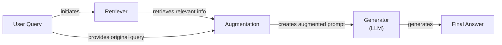
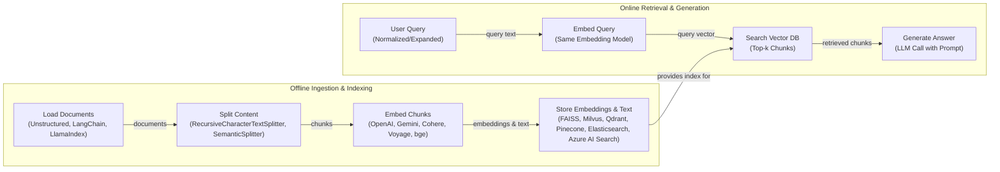
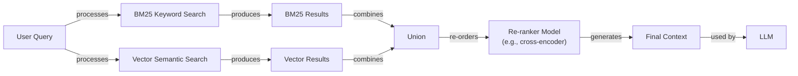

# Retrieval-Augmented Generation (RAG)

In our previous lessons, we have explored the foundational concepts of AI engineering, from context engineering and structured outputs to building reasoning agents with the ReAct framework. We have learned that to build effective AI applications, it is not enough to have a powerful LLM; you must also master the flow of information to and from the model. This brings us to a core challenge we have yet to solve: an LLM’s knowledge is frozen in time.

LLMs are trained on fixed datasets, which means they are essentially taking a "closed-book exam" on the world's information. Their knowledge becomes outdated the moment their training is complete, and they are prone to hallucination when asked about topics they were not trained on. While we can fine-tune them, this process is slow, expensive, and inefficient for keeping knowledge current. We need a way to give our models access to new information after they have been deployed.

This is where Retrieval-Augmented Generation (RAG) comes in. RAG is a technique that gives an LLM an "open-book exam" by connecting it to external, real-time knowledge sources through its context window. It is a fundamental method in context engineering, allowing us to build applications that are grounded, trustworthy, and knowledgeable.

In this lesson, we will cover the what and how of RAG, from its core components to the advanced and agentic patterns that power modern AI systems. We will also see how retrieval complements an agent's memory, a topic we will explore further in Lesson 10.

## The RAG System: Core Components

Understanding the components of RAG is the first step in designing effective systems. At a high level, RAG can be broken down into three conceptual pillars: Retrieval, Augmentation, and Generation. Each plays a distinct role in transforming a user's query into a source-backed, reliable answer.

**Retrieval** is the engine that finds relevant information. When a user asks a question, the retriever searches an external knowledge base to find the most relevant pieces of information. This search is most commonly done using semantic similarity, which relies on vector embeddings. Text is converted into numerical representations (embeddings) that capture its meaning, and these are stored in a specialized vector database. The user's query is also converted into an embedding, and the database finds the text chunks with the closest embeddings.

**Augmentation** is the process of taking the retrieved information and combining it with the original user query to create a new, enriched prompt. This augmented prompt provides the LLM with the necessary context to answer the question accurately.

**Generation** is the final step, where the LLM receives the augmented prompt and generates a response. Because the prompt now contains specific, relevant facts, the LLM can produce an answer that is grounded in the provided data, rather than relying solely on its pre-trained knowledge. This significantly reduces the risk of hallucinations and allows the model to cite its sources.


Image 1: A flowchart illustrating the conceptual flow of a basic Retrieval Augmented Generation (RAG) system.

With the problem and motivation clear, we’ll first decompose RAG into its core components so you can see where each responsibility lives. Now that you can name each moving part, let’s see how they line up across the two phases of a real system.

## The RAG Pipeline: Ingestion and Retrieval

The end-to-end RAG workflow is split into two distinct phases: an offline ingestion pipeline to prepare the knowledge base and an online retrieval pipeline to answer user queries in real time.

### Phase 1: Offline Ingestion & Indexing

This phase is all about preparing your data to be searchable. It is typically run as a batch process whenever your knowledge base needs to be updated.

1.  **Load:** The process begins by loading documents from various sources, such as PDFs, websites, or APIs. Frameworks like LangChain and LlamaIndex provide a wide range of document loaders for this purpose.
2.  **Split:** The loaded documents are then broken down into smaller, semantically meaningful chunks. This is a critical step, as you want to avoid splitting a single idea across multiple chunks. Tools like LangChain's `RecursiveCharacterTextSplitter` are commonly used here.
3.  **Embed:** Each chunk is converted into a vector embedding using a specialized model. Popular choices include models from OpenAI, Google (Gemini), Cohere, and open-source alternatives like BGE.
4.  **Store:** Finally, the embeddings and their corresponding text chunks are loaded into a vector database. These databases, such as FAISS, Qdrant, or Pinecone, are optimized for fast similarity searches over large volumes of vectors.

### Phase 2: Online Retrieval & Generation

This phase happens in real time, whenever a user submits a query.

1.  **Query:** The user asks a question. This query may be pre-processed to normalize it or expand it for better results.
2.  **Embed:** The user's query is converted into a vector embedding using the *same* model that was used during the ingestion phase. This is essential to ensure that the query and the documents exist in the same vector space.
3.  **Search:** The query vector is used to search the vector database, which returns the top-k most similar document chunks. This is typically done using a distance metric like cosine similarity.
4.  **Generate:** A prompt is constructed that includes the original user query, the retrieved chunks as context, and instructions for the LLM. The LLM then generates a final answer grounded in the provided information. As we learned in Lesson 4, this is a perfect use case for structured outputs to ensure the answer includes citations.


Image 2: A detailed flowchart depicting the end-to-end RAG workflow, split into two main phases: "Offline Ingestion & Indexing" and "Online Retrieval & Generation".

With the end-to-end path in place, the next question is quality: what are the advanced techniques to make the retrieval more accurate and useful across messy, real-world data?

## Advanced RAG Techniques

While a basic RAG pipeline is powerful, its performance in a production environment often depends on more advanced techniques that improve retrieval quality. Here are some of the most effective methods for building a robust RAG system.

**Hybrid Search** combines traditional keyword-based search (like BM25) with modern vector search. Vector search is excellent at understanding the semantic meaning of a query, but it can sometimes miss exact keywords or rare terms. BM25, on the other hand, excels at finding precise matches. By fusing the results of both, you get the best of both worlds. For example, if a user asks, “my bill keeps rolling over,” keyword search will find articles with the term “rollover,” while vector search might find documents discussing “carryover balance.” Hybrid search ensures both are retrieved.


Image 3: A flowchart illustrating the hybrid retrieval process.

**Re-ranking** introduces a second, more sophisticated model to re-order the documents retrieved in the initial search. The first-pass retrieval is optimized for speed and recall, but it may not always place the most relevant document at the top. A re-ranker, often a cross-encoder model, takes the user's query and each retrieved document as a pair and outputs a more accurate relevance score. For a query like “how to connect my account,” the re-ranker would push a step-by-step guide to the top, above a less relevant press release.

**Query Transformations** modify the user’s query to improve retrieval accuracy. Two common techniques are:
*   **Decomposition:** A complex query is broken down into simpler sub-questions. For example, “What’s our travel policy for conferences in Europe this year?” could be split into questions about the general policy, conference definitions, Europe-specific rules, and recent changes. The system retrieves documents for each sub-question and then synthesizes the answers.
*   **Hypothetical Document Embeddings (HyDE):** The system generates a hypothetical, ideal answer to the user's query, embeds this hypothetical answer, and then searches for documents that are semantically similar to it. This helps bridge the gap between the phrasing of a question and the phrasing of its answer.

**Advanced Chunking Strategies** move beyond simply splitting documents by a fixed number of characters.
*   **Semantic chunking** aims to keep related sentences together, preventing a single idea from being split across multiple chunks.
*   **Layout-aware chunking** is designed for complex documents like PDFs with tables or forms. It ensures that related data, like a product and its price in a table, remains in the same chunk.

**GraphRAG** leverages knowledge graphs to answer questions about complex relationships that are often lost in unstructured text. Instead of just retrieving text chunks, GraphRAG can traverse relationships between entities. For a query like, “Which incidents were caused by weekend deploys that also touched the login service?” the system can navigate connections between deployment records, incident tickets, and service logs to find the answer. This approach is particularly effective for complex, multi-hop queries. For instance, research from Microsoft found that a GraphRAG approach achieved 86% comprehensiveness on multi-hop tasks, compared to just 57% for a traditional vector-based RAG system [[54]](https://towardsai.net/p/machine-learning/why-90-of-agentic-rag-projects-fail-and-how-to-build-one-that-actually-works-in-production).

These techniques increase retrieval quality. Next, we’ll see how retrieval becomes one tool that an agent can choose to use as it reasons.

## Agentic RAG

In Lessons 7 and 8, we introduced the ReAct framework, where an agent cycles through a loop of Thought, Action, and Observation. Agentic RAG applies this concept by equipping a ReAct-style agent with a retrieval tool. This transforms RAG from a static pipeline into a dynamic, adaptive process.

The core distinction is that standard RAG is a fixed workflow (Retrieve -> Augment -> Generate), while agentic RAG is adaptive. The agent uses an iterative reasoning loop to decide *when* to retrieve, *what* to retrieve, and *whether* to search again, treating retrieval as one of many tools to use when it identifies a knowledge gap.

This agentic approach unlocks several new capabilities:
*   **Iteratively refine its search:** If initial results are vague, the agent can reformulate its query and search again.
*   **Choose between knowledge sources:** For an outage, an agent might query incident runbooks instead of marketing pages.
*   **Fuse information from multiple tools:** It can retrieve an internal policy, then use a web search to find recent regulatory changes and synthesize an answer.
*   **Update its knowledge base:** It can propose updates to its long-term memory, a topic we will cover in the next lesson.

However, this freedom introduces new risks. The agent's reasoning loop is powerful but also fragile. Without proper constraints, it can lead to failure modes like "retrieval thrash," where the agent gets stuck in a cycle of reformulating queries without making progress. This is why production systems often implement hard limits, such as capping retrieval attempts per query, to prevent runaway costs and latency [[55]](https://towardsdatascience.com/agentic-rag-failure-modes-retrieval-thrash-tool-storms-and-context-bloat-and-how-to-spot-them-early/).

```mermaid
stateDiagram-v2
    [*] --> "Thought"
    "Thought" --> "Action" : "reasons about task"
    "Action" --> "Web Search" : "utilize tool"
    "Action" --> "Code Interpreter" : "utilize tool"
    "Action" --> "Internal Knowledge Base (RAG Tool)" : "utilize tool"
    "Web Search" --> "Observation" : "tool output"
    "Code Interpreter" --> "Observation" : "tool output"
    "Internal Knowledge Base (RAG Tool)" --> "Observation" : "tool output"
    "Observation" --> "Thought" : "refine understanding / plan next step"
```
Image 4: A conceptual state diagram illustrating an agent's main loop and its decision-making process for tool selection.

Consider this conceptual thought process for an agent handling a query about data retention rules:

> **Thought:** User asks about "2024 EU data retention rules." Our internal policy is likely outdated. I'll search externally first.
> **Action:** `web_search("EU data retention rules 2024 official")`
> **Observation:** Finds a new directive.
> **Thought:** Now I'll retrieve our internal policy to compare and synthesize an answer.
> **Action:** `retrieve_internal_knowledge("EU data retention policy")`

This is the difference between a simple database lookup and a conversation with a knowledgeable research assistant. You now understand both a linear RAG pipeline and how an agent can control retrieval when needed. Let’s wrap up by situating RAG in the wider AI Engineering toolkit and previewing what comes next.

## Conclusion

RAG is the most effective solution to the LLM problems of knowledge cutoffs and hallucinations. It grounds models in factual information, building user trust through source-backed answers. For production-grade quality, advanced techniques like hybrid search and re-ranking are essential. The future is agentic, where RAG becomes a tool in a broader reasoning process.

Mastering RAG is a foundational competency for any AI Engineer. It is a core part of Context Engineering, enabling the creation of customized, reliable, and intelligent AI systems.

In our next lesson, we will explore Memory for Agents and see how short-term and long-term memory systems, such as those inspired by operating-system hierarchies like MemGPT, complement the retrieval mechanisms we have discussed here [[56]](https://arxiv.org/html/2601.03236v2). Later in the course, we will also cover how to build robust evaluation and monitoring pipelines to ensure your RAG systems perform reliably in production.

## References

*   [1] https://neo4j.com/blog/developer/fine-tuning-vs-rag/
*   [2] https://www.infoworld.com/article/2335043/addressing-ai-hallucinations-with-retrieval-augmented-generation.html
*   [3] https://aclanthology.org/2024.emnlp-main.15.pdf
*   [4] https://arxiv.org/html/2312.05934v3
*   [5] https://pub.towardsai.net/vector-databases-in-practice-building-a-realistic-hybrid-search-rag-system-with-qdrant-7b8f4a6e41e0
*   [6] https://qdrant.tech/articles/what-is-rag-in-ai/
*   [7] https://wandb.ai/mostafaibrahim17/ml-articles/reports/Vector-Embeddings-in-RAG-Applications--Vmlldzo3OTk1NDA5
*   [8] https://samirpaulb.github.io/posts/vector-databases-rag-llm/
*   [9] https://towardsdatascience.com/agentic-rag-vs-classic-rag-from-a-pipeline-to-a-control-loop/
*   [10] https://medium.com/@gaddam.rahul.kumar/agentic-rag-vs-traditional-rag-b1a156f72167
*   [11] https://47billion.com/blog/rag-system-in-production-why-it-fails-and-how-to-fix-it/
*   [12] https://docs.nvidia.com/rag/latest/query_decomposition.html
*   [13] https://neo4j.com/blog/genai/advanced-rag-techniques/
*   [14] https://medium.com/@fahey_james/retrieval-augmented-generation-building-grounded-ai-for-enterprise-knowledge-6bc46277fee5
*   [15] https://www.madrona.com/rag-inventor-talks-agents-grounded-ai-and-enterprise-impact/
*   [16] https://humanloop.com/blog/rag-architectures
*   [17] https://www.ibm.com/think/topics/retrieval-augmented-generation
*   [18] https://medium.com/@derrickryangiggs/rag-pipeline-deep-dive-ingestion-chunking-embedding-and-vector-search-abd3c8bfc177
*   [19] https://newsletter.systemdesign.one/p/how-rag-works
*   [20] https://towardsdatascience.com/ragops-guide-building-and-scaling-retrieval-augmented-generation-systems-3d26b3ebd627/
*   [21] https://aws.amazon.com/what-is/retrieval-augmented-generation/
*   [22] https://pr-peri.github.io/blogpost/2026/03/05/blogpost-hybrid-search.html
*   [23] https://mlpills.substack.com/p/issue-76-optimize-rag-with-hybrid
*   [24] https://cubitrek.com/blog/hybrid-search-optimization-how-bm25-and-dense-vector-retrieval-work-together-for-superior-ai-search/
*   [25] https://community.netapp.com/t5/Tech-ONTAP-Blogs/Hybrid-RAG-in-the-Real-World-Graphs-BM25-and-the-End-of-Black-Box-Retrieval/ba-p/464834
*   [26] https://arxiv.org/html/2407.00072v5
*   [27] https://redis.io/blog/10-techniques-to-improve-rag-accuracy/
*   [28] https://apxml.com/courses/optimizing-rag-for-production/chapter-2-advanced-retrieval-optimization/reranking-architectures-rag
*   [29] https://towardsdatascience.com/advanced-rag-retrieval-cross-encoders-reranking/
*   [30] https://arxiv.org/html/2601.03014v1
*   [31] https://webhome.cs.uvic.ca/~thomo/papers/asonam2025-graphrag.pdf
*   [32] https://atlan.com/know/what-is-graphrag/
*   [33] https://arxiv.org/html/2501.00309v2
*   [34] https://apxml.com/courses/prompt-engineering-llm-application-development/chapter-6-integrating-llms-external-data-rag/implementing-semantic-search-retrieval
*   [35] https://medium.com/@robi.tomar72/how-rag-actually-works-embeddings-vector-databases-indexing-retrieval-explained-simply-3d1ca45fe1bf
*   [36] https://learnopencv.com/vector-db-and-rag-pipeline-for-document-rag/
*   [37] https://towardsdatascience.com/rag-explained-understanding-embeddings-similarity-and-retrieval/
*   [38] https://tutorialsdojo.com/aws-vector-databases-explained-semantic-search-and-rag-systems/
*   [39] https://www.topquadrant.com/resources/blog-retrieval-augmented-generation-explained/
*   [40] https://medium.com/@rahulraut.techuse/introduction-to-augmenting-llms-using-retrieval-augmented-generation-rag-6530123dbb91
*   [41] https://www.promptingguide.ai/research/rag
*   [42] https://medium.com/@tejpal.abhyuday/retrieval-augmented-generation-rag-from-basics-to-advanced-a2b068fd5762
*   [43] https://blogs.nvidia.com/blog/what-is-retrieval-augmented-generation/
*   [44] https://towardsai.net/p/l/a-complete-guide-to-rag
*   [45] https://decodingml.substack.com/p/rag-fundamentals-first?utm_source=publication-search
*   [46] https://decodingml.substack.com/p/your-rag-is-wrong-heres-how-to-fix?utm_source=publication-search
*   [47] https://arxiv.org/html/2404.16130
*   [48] https://www.anthropic.com/news/contextual-retrieval
*   [49] https://weaviate.io/blog/what-is-agentic-rag
*   [50] https://www.llamaindex.ai/blog/rag-is-dead-long-live-agentic-retrieval
*   [51] https://www.ibm.com/think/topics/agentic-rag
*   [52] https://learn.microsoft.com/en-us/azure/developer/ai/advanced-retrieval-augmented-generation
*   [53] https://highlearningrate.substack.com/p/the-rise-of-rag
*   [54] https://towardsai.net/p/machine-learning/why-90-of-agentic-rag-projects-fail-and-how-to-build-one-that-actually-works-in-production
*   [55] https://towardsdatascience.com/agentic-rag-failure-modes-retrieval-thrash-tool-storms-and-context-bloat-and-how-to-spot-them-early/
*   [56] https://arxiv.org/html/2601.03236v2