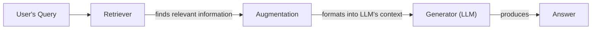
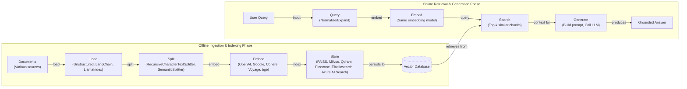
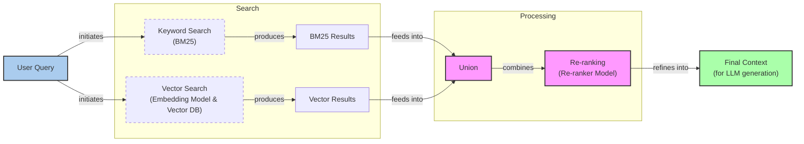
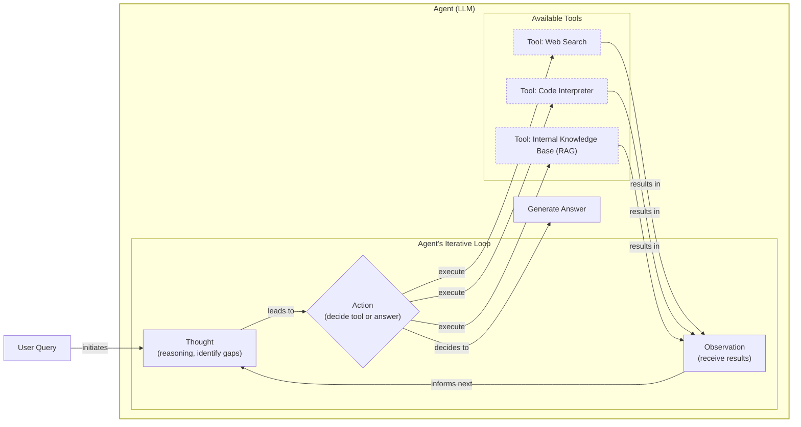

# Lesson 9: Retrieval-Augmented Generation (RAG)

In our previous lessons, we built a foundation in AI Engineering. We explored the agent landscape, distinguished between rule-based workflows and autonomous agents, and, in Lesson 3, introduced Context Engineering. This is the art of managing the information an LLM sees. We have also covered how to get structured data from LLMs and how to equip them with tools to perform actions and reason using frameworks like ReAct.

A core problem we have not yet fully addressed is that LLMs are trained on fixed datasets. Their knowledge is static, making them prone to hallucination. During training, they essentially take a "closed-book exam" on the world's information. We do not yet have efficient techniques to enable models to continuously learn new information after deployment. While fine-tuning can adapt a model, it is expensive and does not solve the knowledge cutoff problem; it only pushes the date back.

This is where Retrieval-Augmented Generation (RAG) provides a reliable solution. Instead of trying to force a model to memorize everything, RAG gives it an "open-book exam" [[1]](https://blogs.nvidia.com/blog/what-is-retrieval-augmented-generation/). It connects the LLM to external, real-time knowledge sources, allowing it to look up information as needed. RAG is a key method AI Engineers implement in the Context Engineering process.

The rise of LLMs with long context windows has led to questions about RAG's future. In practice, the two are complementary. Instead of replacing RAG, long context windows can be used to hold more complete information retrieved by RAG, improving the final generation [[15]](https://medium.com/@infiniflowai/from-rag-to-context-a-2025-year-end-review-of-rag-03740f1a0528). This synergy is a key part of modern Context Engineering, focusing on the entire information pipeline [[16]](https://research.google/blog/chain-of-agents-large-language-models-collaborating-on-long-context-tasks/).

This lesson will guide you through the fundamentals of RAG, from its core components to the advanced and agentic patterns that power modern AI systems. We will also contrast retrieval with agent memory in Lesson 10, where we discuss the short- and long-term memory stores that complement RAG.

## The RAG System: Core Components

Understanding the components of a RAG system is the first step in the Context Engineering process of designing an effective application. At a high level, RAG is built on three conceptual pillars.

Image 1: A flowchart illustrating the core conceptual pillars of a RAG system.

**Retrieval** is the engine responsible for finding relevant information. When a user asks a question, the retriever searches an external knowledge base to find documents or data snippets that are likely to contain the answer. This search is typically powered by vector embeddings. These are numerical representations of text created by models like BERT, which are designed to capture semantic meaning. These embeddings are stored in a specialized vector database, allowing for efficient semantic similarity searches [[2]](https://towardsai.net/p/l/a-complete-guide-to-rag).

**Augmentation** is the process of taking the retrieved information and preparing it for the LLM. The relevant text snippets are formatted and inserted into the prompt, along with the original user query and system instructions. This step effectively "augments" the user's input with external context, giving the model the specific information it needs to formulate a grounded response.

**Generation** is the final step where the LLM uses this augmented prompt to produce an answer. Because the model now has access to relevant, factual data within its context window, it can generate a response that is not only accurate but also verifiable. The LLM acts as a reasoning engine, synthesizing the provided information rather than relying solely on its static, internal knowledge [[3]](https://decodingml.substack.com/p/rag-fundamentals-first?utm_source=publication-search).

Now that you can name each moving part, let’s see how they line up across the two phases of a real system.

## The RAG Pipeline: Ingestion and Retrieval

The end-to-end RAG workflow is split into two distinct phases: an offline ingestion phase where knowledge is prepared, and an online retrieval phase where answers are generated in real-time.

Image 2: A detailed flowchart illustrating the end-to-end RAG workflow, separating offline ingestion and online retrieval phases.

The **offline ingestion and indexing phase** is where you prepare your knowledge base. This process runs in the background, before any user interaction [[4]](https://newsletter.systemdesign.one/p/how-rag-works).
1.  **Load:** Documents are gathered from various sources, such as PDFs, websites, or APIs. Tools like Unstructured or loaders from libraries like LangChain and LlamaIndex are commonly used for this step.
2.  **Split:** The loaded documents are broken down into smaller, meaningful chunks. This is crucial because you want to provide the LLM with concise, relevant context. Splitting can be done based on rules (e.g., character count) or semantics to avoid cutting off ideas mid-sentence.
3.  **Embed:** Each chunk is passed through an embedding model, which converts the text into a numerical vector. It is important to choose a model that aligns with your specific domain and use case.
4.  **Store:** Finally, these vector embeddings and their corresponding text chunks are loaded into a vector database. This database indexes the vectors for fast and scalable similarity search.

The **online retrieval and generation phase** happens in real-time when a user submits a query [[3]](https://decodingml.substack.com/p/rag-fundamentals-first?utm_source=publication-search).
1.  **Query:** The user's question is received. It can be optionally pre-processed to normalize it or expand it for better matching.
2.  **Embed:** The processed query is converted into a vector using the *same* embedding model that was used during the ingestion phase.
3.  **Search:** This query vector is used to search the vector database. The database returns the top-k most similar document chunks based on a distance metric like cosine similarity.
4.  **Generate:** A prompt is constructed containing the user's query, the retrieved chunks, and instructions for the LLM. The LLM then generates a grounded answer, often including citations back to the source documents, which can be formatted using the structured output techniques we covered in Lesson 4.

With the end-to-end path in place, the next question is quality. Let's look at advanced techniques to make retrieval more accurate and useful across messy, real-world data.

## Advanced RAG Techniques

A simple RAG pipeline is a great start, but production systems often require more sophisticated techniques to handle the complexities of real-world data and user queries. These advanced methods focus on improving the quality and relevance of the retrieved context.

Image 3: A flowchart illustrating the Hybrid Search process, showing parallel keyword and vector search paths merging into a union, followed by re-ranking to produce a final context.

**Hybrid Search** combines traditional keyword-based search (like BM25) with modern vector search. Vector search excels at finding semantically similar concepts, but it can sometimes miss exact keyword matches. BM25, on the other hand, is great for precision when specific terms are important. By fusing the results of both, you get the best of both worlds, capturing both semantic relevance and keyword accuracy [[5]](https://mlpills.substack.com/p/issue-76-optimize-rag-with-hybrid).

**Re-ranking** introduces a second stage to the retrieval process. After an initial retrieval fetches a broad set of candidate documents, a more sophisticated re-ranker model evaluates these candidates more carefully [[6]](https://towardsdatascience.com/advanced-rag-retrieval-cross-encoders-reranking/). Cross-encoders are often used for this, as they process the query and document *together* for a more accurate relevance score [[7]](https://arxiv.org/html/2407.00072v5). This adds latency, which can be unacceptable in production systems that require fast responses, creating a trade-off between accuracy and speed [[17]](https://medium.com/@chinmayd49/rag-production-optimizations-and-trade-offs-a623e5834e65).

**Query Transformations** modify the user's input to improve retrieval. One technique is **decomposition**, which breaks a complex question into simpler sub-queries, retrieving and synthesizing results for each [[8]](https://docs.nvidia.com/rag/latest/query_decomposition.html). Another is **Hypothetical Document Embeddings (HyDE)**, where an LLM first generates a hypothetical, ideal answer to the query. This generated answer is then embedded and used for the similarity search, which can help bridge the gap between the phrasing of a question and the phrasing of its answer in the documents [[9]](https://47billion.com/blog/rag-system-in-production-why-it-fails-and-how-to-fix-it/).

**Advanced Chunking Strategies** move beyond simple fixed-size chunks. **Semantic chunking** splits text based on topical shifts to keep related ideas together. **Layout-aware chunking** is designed for complex documents like PDFs with tables and figures, preserving the document's structure. **Context-enriched chunking** adds summary metadata or surrounding sentences to each chunk, giving the embedding model more context to work with [[10]](https://www.anthropic.com/news/contextual-retrieval).

**GraphRAG** uses knowledge graphs to answer "multi-hop" questions that require connecting facts across documents [[18]](https://www.freecodecamp.org/news/how-to-solve-5-common-rag-failures-with-knowledge-graphs/). It builds a graph of entities and their relationships, allowing the system to traverse these connections to synthesize answers [[11]](https://arxiv.org/html/2404.16130), [[12]](https://arxiv.org/html/2601.03014v1). This structured approach is powerful but can fail if the underlying graph is incomplete, leading to missed connections or hallucinations [[18]](https://www.freecodecamp.org/news/how-to-solve-5-common-rag-failures-with-knowledge-graphs/).

These techniques increase retrieval quality. Next, we will see how retrieval becomes one of many tools an agent can choose to use as part of a dynamic reasoning process.

## Agentic RAG

The advanced techniques we have discussed so far optimize a linear RAG workflow. Agentic RAG, however, represents a paradigm shift. It integrates retrieval into a dynamic reasoning loop, as seen in the ReAct framework from Lessons 7 and 8. RAG becomes a tool an agent uses when it detects a knowledge gap [[13]](https://towardsdatascience.com/agentic-rag-vs-classic-rag-from-a-pipeline-to-a-control-loop/).

Image 4: A conceptual flowchart illustrating an agent's main loop, emphasizing its iterative and adaptive nature, and its ability to choose between various tools.

This approach is a form of neuro-symbolic AI, combining a neural sub-system (the LLM) for understanding with a symbolic sub-system (the agent's workflow) for structured reasoning and tool use [[19]](https://arxiv.org/html/2407.08516v5), [[20]](https://builder.aws.com/content/2uYUowZxjkh80uc0s2bUji0C9FP/from-logic-to-learning-the-future-of-ai-lies-in-neuro-symbolic-agents). This fusion creates systems that are both adaptable and auditable. Instead of a rigid Retrieve → Augment → Generate path, an agent can:
- **Iteratively** use the RAG tool, refining its query based on initial results.
- **Choose** which part of its knowledge base to search (e.g., `search_emails` vs. `search_tech_docs`).
- **Fuse** information from the RAG tool with data from other tools, like a web search, to form a comprehensive answer [[14]](https://weaviate.io/blog/what-is-agentic-rag).
- Decide to **update** the RAG system's knowledge base with new information it learns. This touches on the concept of agent memory, which we will cover in the next lesson.

This scales to multi-agent systems where specialized agents collaborate on complex retrieval tasks, improving modularity and allowing for greater task specialization [[21]](https://arxiv.org/html/2501.09136v4), [[22]](https://www.okta.com/identity-101/agentic-rag-architecture/). This transforms RAG from a database lookup into a dynamic conversation with a research assistant.

## Conclusion

You now understand RAG, from linear pipelines to agentic control. It is the primary solution to the LLM knowledge problem, with advanced techniques being essential for production quality. The future of knowledge retrieval is agentic, where RAG acts as a tool within a reasoning loop [[15]](https://medium.com/@infiniflowai/from-rag-to-context-a-2025-year-end-review-of-rag-03740f1a0528).

This approach reduces hallucinations, enables customization with proprietary data, and builds user trust through verifiable answers. For the modern AI Engineer, RAG is a foundational competency within Context Engineering. In our next lesson, we will explore Memory for Agents and how it complements the on-demand knowledge access RAG provides. We will also cover retrieval evaluation and production monitoring later in the course.

## References

- [1] [What Is Retrieval-Augmented Generation, aka RAG?](https://blogs.nvidia.com/blog/what-is-retrieval-augmented-generation/)
- [2] [A Complete Guide to RAG](https://towardsai.net/p/l/a-complete-guide-to-rag)
- [3] [Retrieval-Augmented Generation (RAG) Fundamentals First](https://decodingml.substack.com/p/rag-fundamentals-first?utm_source=publication-search)
- [4] [How RAG Works](https://newsletter.systemdesign.one/p/how-rag-works)
- [5] [Optimize RAG with Hybrid Search](https://mlpills.substack.com/p/issue-76-optimize-rag-with-hybrid)
- [6] [Advanced RAG Retrieval: Cross-Encoders & Reranking](https://towardsdatascience.com/advanced-rag-retrieval-cross-encoders-reranking/)
- [7] [A Survey on Retrieval-Augmented Generation for Large Language Models](https://arxiv.org/html/2407.00072v5)
- [8] [Query Decomposition](https://docs.nvidia.com/rag/latest/query_decomposition.html)
- [9] [RAG System in Production: Why it Fails and How to Fix it](https://47billion.com/blog/rag-system-in-production-why-it-fails-and-how-to-fix-it/)
- [10] [Introducing Contextual Retrieval](https://www.anthropic.com/news/contextual-retrieval)
- [11] [From Local to Global: A GraphRAG Approach to Query-Focused Summarization](https://arxiv.org/html/2404.16130)
- [12] [SentGraph: Hierarchical Sentence Graph for Multi-hop Retrieval-Augmented Question Answering](https://arxiv.org/html/2601.03014v1)
- [13] [Agentic RAG vs Classic RAG: From a Pipeline to a Control Loop](https://towardsdatascience.com/agentic-rag-vs-classic-rag-from-a-pipeline-to-a-control-loop/)
- [14] [What is Agentic RAG](https://weaviate.io/blog/what-is-agentic-rag)
- [15] [From RAG to Context: A 2025 Year-End Review of RAG](https://medium.com/@infiniflowai/from-rag-to-context-a-2025-year-end-review-of-rag-03740f1a0528)
- [16] [Chain of Agents: Large Language Models Collaborating on Long-Context Tasks](https://research.google/blog/chain-of-agents-large-language-models-collaborating-on-long-context-tasks/)
- [17] [RAG Production Optimizations and Trade-offs](https://medium.com/@chinmayd49/rag-production-optimizations-and-trade-offs-a623e5834e65)
- [18] [How to Solve 5 Common RAG Failures with Knowledge Graphs](https://www.freecodecamp.org/news/how-to-solve-5-common-rag-failures-with-knowledge-graphs/)
- [19] [Converging Paradigms: The Synergy of Symbolic and Connectionist AI in LLM-Empowered Autonomous Agents](https://arxiv.org/html/2407.08516v5)
- [20] [From Logic to Learning: The Future of AI Lies in Neuro-Symbolic Agents](https://builder.aws.com/content/2uYUowZxjkh80uc0s2bUji0C9FP/from-logic-to-learning-the-future-of-ai-lies-in-neuro-symbolic-agents)
- [21] [Agentic RAG: A Survey of Retrieval-Augmented Agents](https://arxiv.org/html/2501.09136v4)
- [22] [Agentic RAG Architecture](https://www.okta.com/identity-101/agentic-rag-architecture/)
</article>