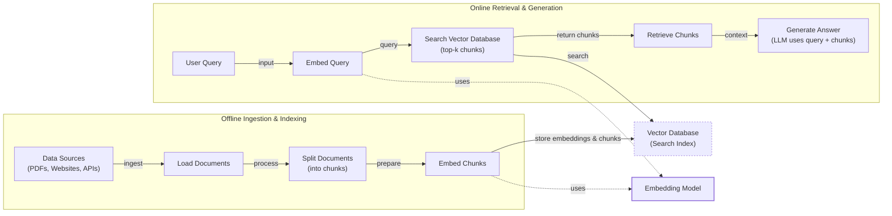
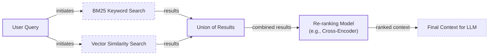

# Lesson 9: Retrieval-Augmented Generation

In our course so far, we have built a solid foundation in AI Engineering. We have explored the agent landscape, distinguished between LLM workflows and AI agents, and mastered context engineering—the art of feeding the right information to an LLM. We have also learned how to get structured data out of models, give them tools to perform actions, and implement reasoning loops with ReAct.

Now, we address a fundamental problem with LLMs: their knowledge is frozen in time. Models are trained on a fixed dataset, which means they are essentially taking a "closed-book exam" on the world's information. They cannot learn new information after deployment, making their knowledge static and prone to hallucination. While fine-tuning can inject new data, it is slow, expensive, and quickly becomes outdated.

Retrieval-Augmented Generation (RAG) offers a more practical solution. Instead of trying to force a model to memorize everything, we give it an "open-book exam." RAG connects the LLM to external, real-time knowledge sources, allowing it to retrieve relevant information on the fly. This is a core technique in context engineering, which we introduced in Lesson 3. It allows us to build applications that are grounded in verifiable facts. In this lesson, we will explore the what and how of basic RAG, from its core components to advanced and agentic patterns.

## The RAG System: Core Components

Understanding the components of a RAG system is the first step in designing effective retrieval strategies as part of the context engineering process. At its core, RAG can be broken down into three conceptual pillars that work together to ground an LLM's response in external data.

The process begins with **Retrieval**, the engine responsible for finding relevant information. When a user asks a question, the retrieval system searches an external knowledge base to find the most relevant documents. This search is often powered by vector embeddings, which are numerical representations of text that capture semantic meaning. These embeddings are stored in a specialized vector database, allowing the system to find text chunks that are conceptually similar to the user's query, even if they do not share the same keywords [[52]](https://medium.com/@robi.tomar72/how-rag-actually-works-embeddings-vector-databases-indexing-retrieval-explained-simply-3d1ca45fe1bf).

Next is **Augmentation**. In this step, the system takes the retrieved information and strategically injects it into the prompt that will be sent to the LLM. This process combines the original user query with the newly found context, effectively giving the model the specific information it needs to formulate a relevant and accurate answer [[56]](https://www.topquadrant.com/resources/blog-retrieval-augmented-generation-explained/).

Finally, there is **Generation**. The LLM receives the augmented prompt—containing both the user’s question and the retrieved context—and generates a final answer. Because the model now has access to specific, relevant data, its response is grounded in that information rather than relying solely on its pre-trained knowledge. This significantly reduces the risk of hallucination and allows the model to provide answers that are both accurate and verifiable [[29]](https://www.ibm.com/think/topics/retrieval-augmented-generation).


Image 1: A flowchart illustrating the core components and sequential flow of a RAG system.

Now that you can name each moving part, we will examine how they are organized across the two main phases of a production RAG system.

## The RAG Pipeline: Ingestion and Retrieval

A complete RAG workflow is divided into two distinct phases: an offline phase for preparing data and an online phase for answering user queries in real-time.

The first phase is **Offline Ingestion & Indexing**, where you prepare your knowledge base. This process is not performed at runtime and is triggered whenever your data sources change [[32]](https://newsletter.systemdesign.one/p/how-rag-works). It involves four key steps:
1.  **Load:** Documents are ingested from various sources, such as PDFs, websites, or APIs.
2.  **Split:** The loaded documents are broken down into smaller, semantically meaningful chunks. This is a critical step, as splitting content in the middle of a sentence or idea can degrade retrieval quality.
3.  **Embed:** Each chunk is converted into a numerical vector using an embedding model. This vector captures the semantic meaning of the text.
4.  **Store:** The embeddings and their corresponding text chunks are loaded into a vector database, which creates an efficient search index for fast retrieval.

The second phase is **Online Retrieval & Generation**, which happens in real-time when a user interacts with the system [[31]](https://medium.com/@derrickryangiggs/rag-pipeline-deep-dive-ingestion-chunking-embedding-and-vector-search-abd3c8bfc177). This phase consists of the following steps:
1.  **Query:** The user submits a question.
2.  **Embed:** The user's query is converted into a vector using the same embedding model from the ingestion phase. This ensures the query and the documents exist in the same vector space.
3.  **Search:** The system uses the query vector to search the vector database and retrieve the top-k most similar document chunks based on a similarity metric like cosine similarity.
4.  **Generate:** A prompt is constructed containing the user's original query, the retrieved chunks, and instructions for the LLM. The LLM then generates a final answer grounded in the provided context. To ensure the response is machine-readable, we often use structured outputs, a technique we covered in Lesson 4.


Image 2: A detailed flowchart depicting the two main phases of a RAG pipeline: Offline Ingestion & Indexing and Online Retrieval & Generation.

With this end-to-end pipeline in place, the next challenge is ensuring high-quality retrieval. We will now explore advanced techniques that make RAG more accurate and useful for messy, real-world data.

## Advanced RAG Techniques

While a basic RAG pipeline is a good starting point, production systems require more sophisticated techniques to improve performance. These advanced methods focus on enhancing retrieval quality, ensuring the most relevant and complete context is provided to the LLM.

### Hybrid Search

This technique combines traditional keyword-based search, like BM25, with modern semantic vector search. Keyword search excels at finding exact matches for specific terms, acronyms, or IDs, while vector search is better at capturing conceptual similarity and understanding user intent [[36]](https://pr-peri.github.io/blogpost/2026/03/05/blogpost-hybrid-search.html). By running both in parallel and fusing their results, hybrid search leverages the strengths of both approaches, leading to more robust and accurate retrieval. For example, when a user searches for "my bill keeps rolling over," keyword search finds articles with "rollover," while semantic search finds guides on "carryover balance," ensuring comprehensive coverage.

### Re-ranking

Initial retrieval is optimized for speed and recall, often returning a broad set of potentially relevant documents. However, the most relevant document might not be at the top of the list. A re-ranking model, such as a cross-encoder, is used as a second-pass mechanism to refine this initial list. Cross-encoders process the query and each candidate document together, providing a more accurate relevance score than the initial retrieval model [[42]](https://redis.io/blog/10-techniques-to-improve-rag-accuracy/). This ensures that the most useful information is placed at the beginning of the context, where the LLM is most likely to see it.


Image 3: A flowchart illustrating the hybrid retrieval process.

### Query Transformations

Users often phrase questions in ways that do not perfectly align with the text in the knowledge base. Query transformations help bridge this gap. **Decomposition** breaks down complex questions into focused sub-queries, but this introduces a risk of error propagation, where a misinterpretation in an early step degrades the entire chain of retrieval [[72]](https://apxml.com/courses/large-scale-distributed-rag/chapter-6-advanced-rag-architectures-techniques/multi-hop-iterative-rag-scale). Another technique, **Hypothetical Document Embeddings (HyDE)**, generates a hypothetical answer and searches for documents matching its embedding [[16]](https://47billion.com/blog/rag-system-in-production-why-it-fails-and-how-to-fix-it/). This can improve relevance but comes at the cost of higher latency and a risk of hallucination if the hypothetical answer is inaccurate [[73]](https://arxiv.org/pdf/2506.21568).

### Advanced Chunking Strategies

The way documents are split into chunks impacts retrieval quality. Simple fixed-size chunking can cut off important context. Strategies like adding **chunk overlap** can mitigate this by ensuring a complete idea is captured in at least one chunk, though at the cost of some data redundancy [[74]](https://docs.cohere.com/page/chunking-strategies). **Semantic chunking** goes further by grouping related sentences to preserve coherent ideas [[17]](https://sarthakai.substack.com/p/improve-your-rag-accuracy-with-a). For complex documents, **layout-aware chunking** maintains the integrity of tables and other structural elements, ensuring retrieved context is complete.

### GraphRAG

For questions about complex relationships and interconnected data, GraphRAG is an effective approach. This technique first builds a knowledge graph from the documents, extracting key entities and their relationships [[46]](https://arxiv.org/html/2601.03014v1). Instead of just retrieving text chunks, the system traverses this graph to find interconnected information. For example, to answer, “Which incidents were caused by weekend deploys that also touched the login service?” it can follow connections between deploy times, services, and incident tickets. While powerful, this approach can face scalability bottlenecks as graphs grow into billions of nodes, where query performance can degrade and ingestion pipelines struggle to keep up [[75]](https://www.equitus.ai/post/knowledge-graph).

These techniques increase retrieval quality. Next, we will see how retrieval becomes one of several tools that an agent can choose to use as it reasons about a problem.

## Agentic RAG

So far, we have treated RAG as a linear, predetermined workflow. But what if the system could adapt its retrieval strategy on the fly? This is where Agentic RAG comes in, a concept that ties directly into our previous lessons on ReAct agents. In essence, Agentic RAG is a ReAct-style agent equipped with a retrieval tool. The agent reasons about a user's query, decides if and when to retrieve information, and can iterate on its approach until it finds a satisfactory answer [[11]](https://towardsdatascience.com/agentic-rag-vs-classic-rag-from-a-pipeline-to-a-control-loop/).

The core distinction is control structure. Standard RAG is a rigid pipeline: Retrieve → Augment → Generate. In contrast, Agentic RAG is adaptive. The agent acts as an intelligent orchestrator, deciding whether to use its retrieval tool, how to reformulate the query, or whether to combine information from multiple sources [[13]](https://medium.com/@gaddam.rahul.kumar/agentic-rag-vs-traditional-rag-b1a156f72167).

This agentic approach unlocks powerful capabilities like **iterative refinement**, where an agent can analyze retrieval results, reformulate its query, and search again if the initial context is insufficient. It can also perform **tool selection**, choosing the right knowledge base for the job, and **information fusion**, combining retrieved data with outputs from other tools. However, this autonomy introduces new risks. While standard RAG reduces hallucinations, agentic systems can suffer from cascading reasoning errors, where a mistake early in a multi-step plan leads to a completely wrong final answer [[76]](https://www.okta.com/identity-101/agentic-rag-architecture/). The iterative loops can also lead to high costs and latency, or even get stuck in an infinite loop without proper stop conditions [[77]](https://www.digitalapplied.com/blog/agentic-rag-patterns-multi-step-reasoning-guide).

This transforms RAG from a simple lookup mechanism into a dynamic research assistant. In the ReAct framework, the agent's "Thought" process allows it to recognize knowledge gaps and decide to call its RAG tool as an "Action."

```mermaid
flowchart LR
  %% Agent's Main Reasoning Loop
  A["Agent (LLM)"] --> "initiates" B["Thought"]

  B["Thought"] --> "decides" C["Action"]

  subgraph "Tools"
    D["Web Search Tool"]
    E["Code Interpreter Tool"]
    F["Internal Knowledge Base (RAG Tool)"]
  end

  C["Action"] --> "uses" D
  C["Action"] --> "uses" E
  C["Action"] --> "uses" F

  D --> "returns" G["Observation"]
  E --> "returns" G
  F --> "returns" G

  G["Observation"] --> "informs" B

  C["Action"] --> "provides" H["Final Answer"]

  %% Visual grouping
  classDef main_process stroke-width:2px
  classDef tool_node stroke-dasharray:3,3

  class A,B,C main_process
  class D,E,F tool_node
  class G,H main_process
```
Image 4: A flowchart representing an agent's main reasoning loop in an Agentic RAG system.

You now understand both a linear RAG pipeline and how an agent can control retrieval when needed. Let’s wrap up by situating RAG in the wider AI Engineering toolkit and previewing what comes next.

## Conclusion

We have seen that RAG is a powerful solution to the inherent knowledge limitations of LLMs. By connecting models to external data sources, we can reduce hallucinations, enable customization with proprietary data, and build user trust through verifiable, source-backed answers. Advanced techniques are essential for achieving production-grade quality, and the future of knowledge retrieval is increasingly agentic, where retrieval is just one tool in an intelligent system's toolkit. RAG is not a niche skill but a foundational competency for any AI Engineer, forming a key part of context engineering.

In our next lesson, we will explore Memory for Agents, where we will see how short-term and long-term memory systems complement retrieval to create even more capable and context-aware agents. We will also touch on other important topics later in the course, such as evaluating retrieval quality and monitoring RAG systems in production.

## References

- [1] https://neo4j.com/blog/developer/fine-tuning-vs-rag/
- [2] https://medium.com/@tahirbalarabe2/retrieval-augmented-generation-vs-fine-tuning-enhancing-llms-697e7a0cf7e0
- [3] https://www.infoworld.com/article/2335043/addressing-ai-hallucinations-with-retrieval-augmented-generation.html
- [4] https://aclanthology.org/2024.emnlp-main.15.pdf
- [5] https://arxiv.org/html/2312.05934v3
- [6] https://pub.towardsai.net/vector-databases-in-practice-building-a-realistic-hybrid-search-rag-system-with-qdrant-7b8f4a6e41e0
- [7] https://tutorialsdojo.com/aws-vector-databases-explained-semantic-search-and-rag-systems/
- [8] https://qdrant.tech/articles/what-is-rag-in-ai/
- [9] https://wandb.ai/mostafaibrahim17/ml-articles/reports/Vector-Embeddings-in-RAG-Applications--Vmlldzo3OTk1NDA5
- [10] https://samirpaulb.github.io/posts/vector-databases-rag-llm/
- [11] https://towardsdatascience.com/agentic-rag-vs-classic-rag-from-a-pipeline-to-a-control-loop/
- [12] https://www.pingcap.com/article/agentic-rag-vs-traditional-rag-key-differences-benefits/
- [13] https://medium.com/@gaddam.rahul.kumar/agentic-rag-vs-traditional-rag-b1a156f72167
- [14] https://airbyte.com/agentic-data/ai-agent-vs-rag
- [15] https://domino.ai/blog/rag-vs-agentic-ai
- [16] https://47billion.com/blog/rag-system-in-production-why-it-fails-and-how-to-fix-it/
- [17] https://sarthakai.substack.com/p/improve-your-rag-accuracy-with-a
- [18] https://cloudurable.com/blog/advanced-rag-techniques-that-will-transform-your-l/
- [19] https://docs.nvidia.com/rag/latest/query_decomposition.html
- [20] https://neo4j.com/blog/genai/advanced-rag-techniques/
- [21] https://medium.com/@fahey_james/retrieval-augmented-generation-building-grounded-ai-for-enterprise-knowledge-6bc46277fee5
- [22] https://www.mindstudio.ai/blog/what-is-rag/
- [23] https://zerogravitymarketing.com/blog/the-science-behind-rag
- [24] https://www.kernshell.com/how-rag-reduces-ai-hallucinations-and-improves-accuracy/
- [25] https://www.madrona.com/rag-inventor-talks-agents-grounded-ai-and-enterprise-impact/
- [26] https://humanloop.com/blog/rag-architectures
- [27] https://www.aimon.ai/posts/rag_and_its_different_components/
- [28] https://toloka.ai/blog/grounding-llms-driving-ai-to-deliver-contextually-relevant-data/
- [29] https://www.ibm.com/think/topics/retrieval-augmented-generation
- [30] https://galileo.ai/blog/rag-architecture
- [31] https://medium.com/@derrickryangiggs/rag-pipeline-deep-dive-ingestion-chunking-embedding-and-vector-search-abd3c8bfc177
- [32] https://newsletter.systemdesign.one/p/how-rag-works
- [33] https://towardsdatascience.com/ragops-guide-building-and-scaling-retrieval-augmented-generation-systems-3d26b3ebd627/
- [34] https://apxml.com/courses/optimizing-rag-for-production/chapter-6-advanced-rag-evaluation-monitoring/rag-offline-online-evaluation
- [35] https://aws.amazon.com/what-is/retrieval-augmented-generation/
- [36] https://pr-peri.github.io/blogpost/2026/03/05/blogpost-hybrid-search.html
- [37] https://www.chitika.com/hybrid-retrieval-rag/
- [38] https://mlpills.substack.com/p/issue-76-optimize-rag-with-hybrid
- [39] https://cubitrek.com/blog/hybrid-search-optimization-how-bm25-and-dense-vector-retrieval-work-together-for-superior-ai-search/
- [40] https://community.netapp.com/t5/Tech-ONTAP-Blogs/Hybrid-RAG-in-the-Real-World-Graphs-BM25-and-the-End-of-Black-Box-Retrieval/ba-p/464834
- [41] https://arxiv.org/html/2407.00072v5
- [42] https://redis.io/blog/10-techniques-to-improve-rag-accuracy/
- [43] https://apxml.com/courses/optimizing-rag-for-production/chapter-2-advanced-retrieval-optimization/reranking-architectures-rag
- [44] https://neo4j.com/blog/genai/advanced-rag-techniques/
- [45] https://towardsdatascience.com/advanced-rag-retrieval-cross-encoders-reranking/
- [46] https://arxiv.org/html/2601.03014v1
- [47] https://www.chitika.com/graph-based-retrieval-rag/
- [48] https://webhome.cs.uvic.ca/~thomo/papers/asonam2025-graphrag.pdf
- [49] https://atlan.com/know/what-is-graphrag/
- [50] https://arxiv.org/html/2501.00309v2
- [51] https://apxml.com/courses/prompt-engineering-llm-application-development/chapter-6-integrating-llms-external-data-rag/implementing-semantic-search-retrieval
- [52] https://medium.com/@robi.tomar72/how-rag-actually-works-embeddings-vector-databases-indexing-retrieval-explained-simply-3d1ca45fe1bf
- [53] https://learnopencv.com/vector-db-and-rag-pipeline-for-document-rag/
- [54] https://towardsdatascience.com/rag-explained-understanding-embeddings-similarity-and-retrieval/
- [55] https://tutorialsdojo.com/aws-vector-databases-explained-semantic-search-and-rag-systems/
- [56] https://www.topquadrant.com/resources/blog-retrieval-augmented-generation-explained/
- [57] https://www.linkedin.com/posts/haruiz_building-trustworthy-rag-systems-with-in-activity-7310729777227669505-nd6u
- [58] https://medium.com/@rahulraut.techuse/introduction-to-augmenting-llms-using-retrieval-augmented-generation-rag-6530123dbb91
- [59] https://www.promptingguide.ai/research/rag
- [60] https://medium.com/@tejpal.abhyuday/retrieval-augmented-generation-rag-from-basics-to-advanced-a2b068fd576c
- [61] https://blogs.nvidia.com/blog/what-is-retrieval-augmented-generation/
- [62] https://towardsai.net/p/l/a-complete-guide-to-rag
- [63] https://decodingml.substack.com/p/rag-fundamentals-first?utm_source=publication-search
- [64] https://decodingml.substack.com/p/your-rag-is-wrong-heres-how-to-fix?utm_source=publication-search
- [65] https://arxiv.org/html/2404.16130
- [66] https://www.anthropic.com/news/contextual-retrieval
- [67] https://weaviate.io/blog/what-is-agentic-rag
- [68] https://www.llamaindex.ai/blog/rag-is-dead-long-live-agentic-retrieval
- [69] https://www.ibm.com/think/topics/agentic-rag
- [70] https://learn.microsoft.com/en-us/azure/developer/ai/advanced-retrieval-augmented-generation
- [71] https://highlearningrate.substack.com/p/the-rise-of-rag
- [72] https://apxml.com/courses/large-scale-distributed-rag/chapter-6-advanced-rag-architectures-techniques/multi-hop-iterative-rag-scale
- [73] https://arxiv.org/pdf/2506.21568
- [74] https://docs.cohere.com/page/chunking-strategies
- [75] https://www.equitus.ai/post/knowledge-graph
- [76] https://www.okta.com/identity-101/agentic-rag-architecture/
- [77] https://www.digitalapplied.com/blog/agentic-rag-patterns-multi-step-reasoning-guide