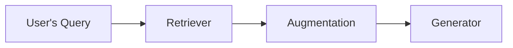
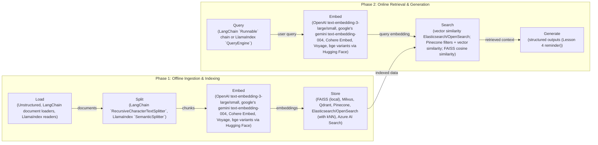
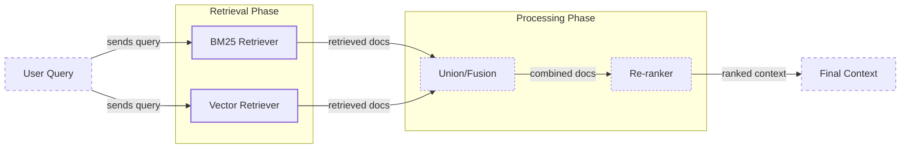
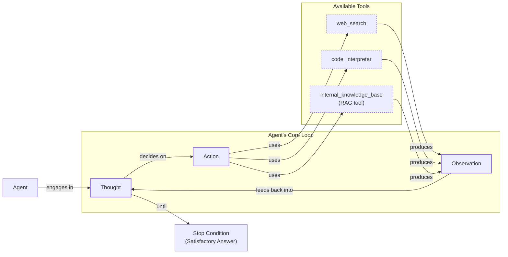

# Lesson 9: Retrieval-Augmented Generation

In our previous lessons, we built a solid foundation in AI Engineering. We explored the agent landscape, distinguished between LLM workflows and agents, and dove into context engineering, the art of managing information flow to an LLM. We also gave our agents the ability to reason and act using tools. Now, we will tackle a fundamental challenge: an LLM’s knowledge is frozen in time.

LLMs are trained on massive, but fixed, datasets. This process is like a "closed-book exam" on the world's information. Once training is complete, the model's internal knowledge becomes static. It cannot learn new facts or access real-time information on its own. While fine-tuning can update a model's weights, it is slow, expensive, and not a practical way to keep up with constantly changing data. This limitation leads to two major problems: knowledge cutoffs and hallucinations. The model might not know about recent events or, worse, confidently invent plausible but incorrect answers.

Retrieval-Augmented Generation (RAG) is a reliable solution to this problem. Instead of trying to force new knowledge into the model's weights, we give it an "open-book exam." RAG connects the LLM to external, up-to-date knowledge sources at the moment it needs to answer a question. Much like how we use cheat sheets or manuals, RAG allows an LLM to look up relevant information and use it to construct an accurate, grounded response.

As we covered in Lesson 3 on Context Engineering, curating the information an LLM sees is crucial for building effective applications. RAG is a core technique in this process. It is the mechanism that retrieves specific, relevant data to be engineered into the final context. In the next lesson, we will explore how agent memory complements RAG by storing information from past interactions, but for now, we will focus on retrieval from external knowledge bases.

This lesson will guide you through the fundamentals of RAG, from its basic components to the advanced and agentic patterns that power modern AI systems. You will learn the "what" and "how" of building pipelines that ground LLMs in verifiable facts, turning them into trustworthy and knowledgeable assistants. With the problem and motivation clear, we will first decompose RAG into its core components so you can see where each responsibility lives.

## The RAG System: Core Components

Understanding the core components of a RAG system is the first step in the context engineering process of designing effective retrieval pipelines. At a high level, RAG can be broken down into three conceptual pillars: Retrieval, Augmentation, and Generation. Each plays a distinct role in transforming a user's query into a factually grounded answer.

Image 1: A flowchart illustrating the core conceptual pillars of a RAG system: Retrieval, Augmentation, and Generation.

**Retrieval** is the engine responsible for finding relevant information from an external knowledge base. When a user asks a question, the retriever’s job is to search through vast amounts of data—like company documents, articles, or a database—and pull out the specific pieces of information that are most likely to help answer the query. The most common approach for this is semantic similarity search, which goes beyond simple keyword matching.

This process relies on vector embeddings. An embedding is a numerical representation of a piece of text, capturing its semantic meaning. An embedding model converts text chunks into these vectors, which are then stored in a specialized database called a vector database. When a user query comes in, it is also converted into a vector. The retriever then searches the vector database to find the text chunks whose embeddings are mathematically closest to the query's embedding, indicating a strong semantic match [[52]](https://medium.com/@robi.tomar72/how-rag-actually-works-embeddings-vector-databases-indexing-retrieval-explained-simply-3d1ca45fe1bf).

**Augmentation** is the process of preparing the retrieved information to be used by the LLM. Once the retriever has identified the most relevant text chunks, this step involves taking that information and formatting it into the prompt that will be sent to the LLM. The augmented prompt typically includes the original user query along with the retrieved content, which serves as the context. This step is crucial because it directly provides the LLM with the external knowledge it needs to formulate its answer [[56]](https://www.topquadrant.com/resources/blog-retrieval-augmented-generation-explained/).

**Generation** is the final step where the LLM produces the answer. The model receives the augmented prompt, which contains both the user’s question and the contextual information retrieved from the knowledge base. Using this combined input, the LLM generates a response that is grounded in the provided data. This ensures the answer is not only relevant and coherent but also factually accurate and verifiable, as it is based on specific, retrieved sources rather than just the model's pre-trained knowledge [[29]](https://www.ibm.com/think/topics/retrieval-augmented-generation).

Now that you can name each moving part, let’s see how they line up across the two phases of a real system.

## The RAG Pipeline: Ingestion and Retrieval

An end-to-end RAG workflow is split into two distinct phases: an offline ingestion pipeline that prepares the knowledge base, and an online retrieval pipeline that answers user queries in real-time. Understanding this separation is key to building and maintaining an efficient RAG system.

Image 2: A detailed flowchart illustrating the end-to-end RAG workflow, clearly separating it into two distinct phases: "Phase 1: Offline Ingestion & Indexing" and "Phase 2: Online Retrieval & Generation".

### Phase 1: Offline Ingestion & Indexing

The ingestion phase is an offline process where you prepare your external data to be searchable [[32]](https://newsletter.systemdesign.one/p/how-rag-works). This pipeline runs whenever new data is available or when existing data is updated. It consists of four main steps:

1.  **Load:** The first step is to load your documents from their various sources. These can be PDFs, web pages, database records, or any other form of unstructured or semi-structured data. Tools like LangChain’s document loaders or LlamaIndex’s readers are commonly used to handle different file formats and data sources.
2.  **Split:** Since LLMs have a limited context window, large documents must be broken down into smaller, manageable pieces called chunks. The chunking strategy is critical for retrieval quality. A simple approach is to split text by a fixed number of characters, but more advanced methods like semantic chunking aim to keep related ideas together by splitting along paragraphs or sections. This prevents cutting off important context mid-sentence [[52]](https://medium.com/@robi.tomar72/how-rag-actually-works-embeddings-vector-databases-indexing-retrieval-explained-simply-3d1ca45fe1bf).
3.  **Embed:** Each chunk of text is then converted into a numerical vector using an embedding model. This vector captures the semantic meaning of the text. Popular embedding models include OpenAI’s `text-embedding-3` series, Google's Gemini models, and various open-source models available through platforms like Hugging Face. The choice of model can significantly impact the quality of your semantic search.
4.  **Store:** Finally, the generated embeddings and their corresponding text chunks are stored in a vector database. This specialized database is optimized for efficient similarity search. It indexes the vectors, allowing for fast retrieval of the chunks that are most semantically similar to a given query vector. Examples of vector databases include FAISS for local development, and scalable solutions like Qdrant, Pinecone, or Milvus [[7]](https://tutorialsdojo.com/aws-vector-databases-explained-semantic-search-and-rag-systems/).

### Phase 2: Online Retrieval & Generation

The online phase happens in real-time when a user interacts with the system. This pipeline is responsible for understanding the user's query, finding relevant information, and generating a grounded response [[31]](https://medium.com/@derrickryangiggs/rag-pipeline-deep-dive-ingestion-chunking-embedding-and-vector-search-abd3c8bfc177).

1.  **Query:** The process begins when a user submits a query. This query can be a question, a command, or any natural language input. In some systems, this step might also involve pre-processing the query, such as expanding acronyms or correcting typos, to improve retrieval accuracy.
2.  **Embed:** The user's query is converted into a vector using the *same* embedding model that was used during the ingestion phase. This is essential to ensure that the query and the document chunks are represented in the same vector space, making the similarity comparison meaningful [[8]](https://qdrant.tech/articles/what-is-rag-in-ai/).
3.  **Search:** The query vector is used to search the vector database. The database performs a similarity search (often using cosine similarity) to find the top-k document chunks whose embeddings are closest to the query vector. These top-k chunks are considered the most relevant context for answering the user's question.
4.  **Generate:** The retrieved chunks are combined with the original user query and a set of instructions into a single prompt. This augmented prompt is then passed to an LLM. The LLM synthesizes the information from the retrieved context to generate a final, coherent answer. As we learned in Lesson 4, using structured outputs at this stage can help ensure the response is consistently formatted and includes citations back to the source documents, enhancing verifiability.

With the end-to-end path in place, the next question is quality: what are the advanced techniques to make the retrieval more accurate and useful across messy, real-world data?

## Advanced RAG Techniques

While a basic RAG pipeline is powerful, production-grade applications often require more sophisticated techniques to handle the complexities of real-world data and user queries. These advanced methods focus on improving the quality and relevance of the retrieved context, which directly impacts the accuracy of the final answer.

Image 3: A flowchart illustrating the hybrid retrieval flow, combining keyword-based search (BM25) and dense vector search, with parallel processing, fusion, and re-ranking steps.

### Hybrid Search

Vector search is excellent at understanding semantic meaning, but it can sometimes miss exact keywords, acronyms, or specific identifiers. Hybrid search addresses this by combining dense vector retrieval with a sparse retrieval method like BM25, which is a traditional keyword-based search algorithm [[38]](https://mlpills.substack.com/p/issue-76-optimize-rag-with-hybrid).

For example, if a user asks about a specific error code like "TS-999," a vector search might return general documents about error codes, while BM25 will pinpoint the exact document that mentions "TS-999." By running both searches in parallel and fusing the results (often using a technique called Reciprocal Rank Fusion), you get the best of both worlds: the semantic understanding of vector search and the precision of keyword matching [[39]](https://cubitrek.com/blog/hybrid-search-optimization-how-bm25-and-dense-vector-retrieval-work-together-for-superior-ai-search/).

### Re-ranking

The initial retrieval step is optimized for speed and recall, meaning it aims to quickly find a broad set of potentially relevant documents. However, the most relevant document might not always be at the top of this initial list. Re-ranking introduces a second, more precise scoring step to re-order these candidates.

A common approach is to use a cross-encoder model. Unlike the bi-encoder used for initial retrieval (which creates separate embeddings for the query and documents), a cross-encoder takes the query and a candidate document together as a single input and outputs a relevance score [[43]](https://apxml.com/courses/optimizing-rag-for-production/chapter-2-advanced-retrieval-optimization/reranking-architectures-rag). This allows for a deeper interaction between the query and document tokens, resulting in a more accurate relevance judgment. Because this is computationally more expensive, it is only applied to the small set of top candidates from the first retrieval pass [[42]](https://redis.io/blog/10-techniques-to-improve-rag-accuracy/).

### Query Transformations

Sometimes, the user's original query is not the best one for retrieval. Query transformation techniques modify or expand the query to improve its chances of matching relevant documents.

-   **Decomposition:** This involves breaking down a complex, multi-part question into several simpler sub-queries. For instance, the question "What is the difference in travel policies for conferences in Europe versus the US this year?" could be decomposed into separate queries about the European policy, the US policy, and any recent changes. The system retrieves documents for each sub-query and then synthesizes the results to form a comprehensive answer [[19]](https://docs.nvidia.com/rag/latest/query_decomposition.html).
-   **Hypothetical Document Embeddings (HyDE):** This technique addresses the fact that user queries are often phrased differently from the documents that contain the answers. With HyDE, you first use an LLM to generate a hypothetical, ideal answer to the user's query. Then, you create an embedding of this *hypothetical answer* and use that embedding for the vector search. The idea is that a well-formed answer is more likely to be semantically similar to the actual documents containing the information [[16]](https://47billion.com/blog/rag-system-in-production-why-it-fails-and-how-to-fix-it/).

### Advanced Chunking Strategies

How you split your documents can have a huge impact on retrieval quality. Moving beyond simple fixed-size chunks can preserve crucial context.

-   **Semantic Chunking:** Instead of splitting text based on a fixed number of tokens, semantic chunking groups sentences or paragraphs based on their conceptual similarity. This ensures that a single, coherent idea is not split across multiple chunks, providing the LLM with more complete context [[18]](https://cloudurable.com/blog/advanced-rag-techniques-that-will-transform-your-l/).
-   **Layout-Aware Chunking:** For documents with complex structures like PDFs with tables, headers, and footers, layout-aware chunking preserves this structural information. For example, it ensures that a row in a table is kept together with its corresponding header, preventing the model from receiving isolated numbers without their meaning.
-   **Context-Enriched Chunking:** This technique, also known as contextual retrieval, involves generating a short, explanatory context for each chunk before embedding it. An LLM is used to create a summary of where the chunk fits within the overall document. This prepended context helps the embedding model create a more accurate representation, significantly improving retrieval, especially when individual chunks lack context on their own.

### GraphRAG

For questions about complex relationships and interconnected data, standard document retrieval can fall short. GraphRAG addresses this by first constructing a knowledge graph from the source documents. In this graph, entities (like people, companies, or products) are nodes, and their relationships are edges [[46]](https://arxiv.org/html/2601.03014v1).

This structured representation excels at multi-hop queries that require connecting information across multiple documents. For example, to answer "Which products designed by teams in Berlin are facing supply chain issues reported in Q4?", a GraphRAG system can traverse the graph from "Berlin" to "teams," then to "products," and finally connect to "supply chain issues" from Q4 reports. This allows it to assemble a precise context that would be difficult to find with a simple vector search over disconnected text chunks [[50]](https://arxiv.org/html/2501.00309v2).

These techniques increase retrieval quality. Next, we will see how retrieval becomes one tool that an agent can choose to use as it reasons.

## Agentic RAG

In Lessons 7 and 8, we explored the ReAct framework, where an agent cycles through a loop of Thought, Action, and Observation to solve problems. Agentic RAG is the practical application of this concept, where retrieval is not a fixed step in a pipeline but a dynamic tool that a reasoning agent can choose to use.

Image 4: A conceptual flowchart illustrating an agent's main loop, emphasizing its ability to reason and choose between various tools.

The core distinction between standard and agentic RAG lies in their control flow. Standard RAG is a linear, predetermined workflow: Retrieve → Augment → Generate. It is powerful but rigid. In contrast, Agentic RAG is adaptive and iterative [[11]](https://towardsdatascience.com/agentic-rag-vs-classic-rag-from-a-pipeline-to-a-control-loop/). The agent decides *when* to retrieve, *what* to retrieve, and whether one retrieval is enough.

This agentic approach unlocks several advanced capabilities:

-   **Iterative Retrieval:** An agent can use the RAG tool multiple times, refining its query based on the results of previous steps. For example, if an initial search for "company travel policy" returns a vague document, the agent can reason that it needs more specific information and issue a new query like "travel policy for international conferences 2024."
-   **Dynamic Tool Use:** Retrieval from an internal knowledge base is just one of many tools an agent might have. For a single query, an agent could decide to first search its internal documents, then use a web search tool to find recent public information, and finally use a code interpreter to analyze the combined data [[13]](https://medium.com/@gaddam.rahul.kumar/agentic-rag-vs-traditional-rag-b1a156f72167).
-   **Autonomous Validation:** The agent can assess the quality of the retrieved information. If the context is insufficient or contradictory, it can decide to perform another retrieval or even ask the user a clarifying question before attempting to generate a final answer.

Consider this simplified thought process for an agent tackling a complex query:

*   **User Query:** "What are the latest EU data retention rules, and how do they differ from our internal 2023 policy?"
*   **Thought 1:** The user is asking for two things: the current EU rules and a comparison with our internal policy. I should start by checking our internal knowledge base.
*   **Action 1:** `internal_knowledge_base.search(query="EU data retention policy 2023")`
*   **Observation 1:** Retrieved our internal policy, which cites a 2023 EU directive. It mentions that amendments were expected in 2024.
*   **Thought 2:** The internal policy might be outdated. I need to verify the current official rules. I will use the web search tool.
*   **Action 2:** `web_search(query="official EU data retention directive 2024")`
*   **Observation 2:** Found a new directive published by the European Commission with updated retention periods.
*   **Thought 3:** I now have both the old internal policy and the new external directive. I can synthesize this information to answer the user's question, highlighting the specific changes.

This iterative process transforms RAG from a simple database lookup into a dynamic conversation with a knowledgeable research assistant. The agent does not just follow a script; it reasons about its information needs and actively seeks out the best evidence to construct a reliable answer.

You now understand both a linear RAG pipeline and how an agent can control retrieval when needed. Let’s wrap up by situating RAG in the wider AI Engineering toolkit and previewing what comes next.

## Conclusion

We have journeyed from the basic principles of RAG to its advanced and agentic forms. The key takeaway is that RAG is the most widely adopted solution to the LLM knowledge problem. It addresses critical limitations like knowledge cutoffs and hallucinations, enabling the creation of trustworthy AI systems grounded in verifiable data. For production-grade quality, advanced techniques like hybrid search and re-ranking are essential, and the future of complex information retrieval is undeniably agentic.

By grounding LLM responses in external data, RAG builds user trust and allows for customization with proprietary information. It is not just a niche technique but a foundational competency for any AI Engineer. As a core part of Context Engineering, mastering RAG is a crucial step toward building intelligent, reliable, and useful AI applications.

In our next lesson, we will explore Memory for Agents. You will learn how short-term and long-term memory systems complement RAG, allowing agents to remember past interactions and build a persistent understanding of their environment. We will also touch upon other important topics later in the course, such as evaluating retrieval quality and monitoring these complex systems in production.

## References

- [1] Fine-Tuning or Retrieval? Comparing Knowledge Injection in LLMs. (https://aclanthology.org/2024.emnlp-main.15.pdf)
- [3] Addressing AI hallucinations with retrieval-augmented generation. (https://www.infoworld.com/article/2335043/addressing-ai-hallucinations-with-retrieval-augmented-generation.html)
- [4] Fine-Tuning or Retrieval? Comparing Knowledge Injection in LLMs. (https://aclanthology.org/2024.emnlp-main.15.pdf)
- [5] Fine-Tuning or Retrieval? Comparing Knowledge Injection in LLMs. (https://arxiv.org/html/2312.05934v3)
- [6] Vector Databases in Practice: Building a Realistic Hybrid Search RAG System with Qdrant. (https://pub.towardsai.net/vector-databases-in-practice-building-a-realistic-hybrid-search-rag-system-with-qdrant-7b8f4a6e41e0)
- [7] AWS Vector Databases Explained: Semantic Search and RAG Systems. (https://tutorialsdojo.com/aws-vector-databases-explained-semantic-search-and-rag-systems/)
- [8] What is RAG in AI?. (https://qdrant.tech/articles/what-is-rag-in-ai/)
- [9] Vector Embeddings in RAG Applications. (https://wandb.ai/mostafaibrahim17/ml-articles/reports/Vector-Embeddings-in-RAG-Applications--Vmlldzo3OTk1NDA5)
- [11] Agentic RAG vs Classic RAG: From a Pipeline to a Control Loop. (https://towardsdatascience.com/agentic-rag-vs-classic-rag-from-a-pipeline-to-a-control-loop/)
- [12] Agentic RAG vs. Traditional RAG: Key Differences and Benefits. (https://www.pingcap.com/article/agentic-rag-vs-traditional-rag-key-differences-benefits/)
- [13] Agentic RAG vs Traditional RAG. (https://medium.com/@gaddam.rahul.kumar/agentic-rag-vs-traditional-rag-b1a156f72167)
- [14] AI Agent vs RAG: What’s the Difference?. (https://airbyte.com/agentic-data/ai-agent-vs-rag)
- [15] RAG vs. Agentic AI: Which Is Right for Your Enterprise?. (https://domino.ai/blog/rag-vs-agentic-ai)
- [16] Why Your RAG System Fails in Production and How to Fix It. (https://47billion.com/blog/rag-system-in-production-why-it-fails-and-how-to-fix-it/)
- [18] Advanced RAG Techniques That Will Transform Your LLM Applications. (https://cloudurable.com/blog/advanced-rag-techniques-that-will-transform-your-l/)
- [19] Query Decomposition. (https://docs.nvidia.com/rag/latest/query_decomposition.html)
- [20] Advanced RAG Techniques for High-Performance LLM Applications. (https://neo4j.com/blog/genai/advanced-rag-techniques/)
- [21] Retrieval-Augmented Generation: Building Grounded AI for Enterprise Knowledge. (https://medium.com/@fahey_james/retrieval-augmented-generation-building-grounded-ai-for-enterprise-knowledge-6bc46277fee5)
- [22] What is RAG (Retrieval-Augmented Generation)?. (https://www.mindstudio.ai/blog/what-is-rag/)
- [25] RAG Inventor Talks Agents, Grounded AI and Enterprise Impact. (https://www.madrona.com/rag-inventor-talks-agents-grounded-ai-and-enterprise-impact/)
- [26] A Guide to RAG Architectures. (https://humanloop.com/blog/rag-architectures)
- [27] RAG and its different components. (https://www.aimon.ai/posts/rag_and_its_different_components/)
- [28] Grounding LLMs: Driving AI to Deliver Contextually Relevant Data. (https://toloka.ai/blog/grounding-llms-driving-ai-to-deliver-contextually-relevant-data/)
- [29] What is retrieval-augmented generation?. (https://www.ibm.com/think/topics/retrieval-augmented-generation)
- [30] RAG Architecture Explained. (https://galileo.ai/blog/rag-architecture)
- [31] RAG Pipeline Deep Dive: Ingestion (Chunking, Embedding) and Vector Search. (https://medium.com/@derrickryangiggs/rag-pipeline-deep-dive-ingestion-chunking-embedding-and-vector-search-abd3c8bfc177)
- [32] How RAG Works. (https://newsletter.systemdesign.one/p/how-rag-works)
- [33] RAGOps Guide: Building and Scaling Retrieval-Augmented Generation Systems. (https://towardsdatascience.com/ragops-guide-building-and-scaling-retrieval-augmented-generation-systems-3d26b3ebd627/)
- [35] What is Retrieval-Augmented Generation (RAG)?. (https://aws.amazon.com/what-is/retrieval-augmented-generation/)
- [37] Hybrid Retrieval for RAG: Combining BM25 and FAISS. (https://www.chitika.com/hybrid-retrieval-rag/)
- [38] Optimize RAG with Hybrid Search. (https://mlpills.substack.com/p/issue-76-optimize-rag-with-hybrid)
- [39] Hybrid Search Optimization: How BM25 and Dense Vector Retrieval Work Together for Superior AI Search. (https://cubitrek.com/blog/hybrid-search-optimization-how-bm25-and-dense-vector-retrieval-work-together-for-superior-ai-search/)
- [40] Hybrid RAG in the Real World: Graphs, BM25, and the End of Black Box Retrieval. (https://community.netapp.com/t5/Tech-ONTAP-Blogs/Hybrid-RAG-in-the-Real-World-Graphs-BM25-and-the-End-of-Black-Box-Retrieval/ba-p/464834)
- [41] Pistis-RAG: Enhancing Retrieval-Augmented Generation with Human Feedback. (https://arxiv.org/html/2407.00072v5)
- [42] 10 techniques to improve RAG accuracy. (https://redis.io/blog/10-techniques-to-improve-rag-accuracy/)
- [43] Reranking Architectures in RAG. (https://apxml.com/courses/optimizing-rag-for-production/chapter-2-advanced-retrieval-optimization/reranking-architectures-rag)
- [44] Advanced RAG Techniques for High-Performance LLM Applications. (https://neo4j.com/blog/genai/advanced-rag-techniques/)
- [45] Advanced RAG: Retrieval with Cross-Encoders & Re-ranking. (https://towardsdatascience.com/advanced-rag-retrieval-cross-encoders-reranking/)
- [46] GraphRAG: A Graph-Based Approach for Retrieval-Augmented Generation. (https://arxiv.org/html/2601.03014v1)
- [47] Graph-Based Retrieval for RAG: Enhancing Contextual Reasoning. (https://www.chitika.com/graph-based-retrieval-rag/)
- [48] GraphRAG: Enhancing Large Language Models with Knowledge Graphs. (https://webhome.cs.uvic.ca/~thomo/papers/asonam2025-graphrag.pdf)
- [49] What is GraphRAG? A Deep Dive into Graph-Augmented RAG. (https://atlan.com/know/what-is-graphrag/)
- [50] Graph-based Retrieval for Retrieval-Augmented Generation. (https://arxiv.org/html/2501.00309v2)
- [51] Implementing Semantic Search for Retrieval. (https://apxml.com/courses/prompt-engineering-llm-application-development/chapter-6-integrating-llms-external-data-rag/implementing-semantic-search-retrieval)
- [52] How RAG Actually Works: Embeddings, Vector Databases, Indexing & Retrieval Explained Simply. (https://medium.com/@robi.tomar72/how-rag-actually-works-embeddings-vector-databases-indexing-retrieval-explained-simply-3d1ca45fe1bf)
- [53] Vector DB and RAG Pipeline for Document RAG. (https://learnopencv.com/vector-db-and-rag-pipeline-for-document-rag/)
- [54] RAG Explained: Understanding Embeddings, Similarity, and Retrieval. (https://towardsdatascience.com/rag-explained-understanding-embeddings-similarity-and-retrieval/)
- [55] AWS Vector Databases Explained: Semantic Search and RAG Systems. (https://tutorialsdojo.com/aws-vector-databases-explained-semantic-search-and-rag-systems/)
- [56] Retrieval-Augmented Generation (RAG) Explained. (https://www.topquadrant.com/resources/blog-retrieval-augmented-generation-explained/)
- [58] Introduction to Augmenting LLMs using Retrieval Augmented Generation (RAG). (https://medium.com/@rahulraut.techuse/introduction-to-augmenting-llms-using-retrieval-augmented-generation-rag-6530123dbb91)
- [59] Retrieval-Augmented Generation (RAG). (https://www.promptingguide.ai/research/rag)
- [60] Retrieval Augmented Generation (RAG) from Basics to Advanced. (https://medium.com/@tejpal.abhyuday/retrieval-augmented-generation-rag-from-basics-to-advanced-a2b068fd576c)
- [61] What Is Retrieval-Augmented Generation, aka RAG?. (https://blogs.nvidia.com/blog/what-is-retrieval-augmented-generation/)
- [62] A Complete Guide to RAG. (https://towardsai.net/p/l/a-complete-guide-to-rag)
- [63] Retrieval-Augmented Generation (RAG) Fundamentals First. (https://decodingml.substack.com/p/rag-fundamentals-first?utm_source=publication-search)
- [64] Your RAG is wrong: Here's how to fix it. (https://decodingml.substack.com/p/your-rag-is-wrong-heres-how-to-fix?utm_source=publication-search)
- [65] From Local to Global: A GraphRAG Approach to Query-Focused Summarization. (https://arxiv.org/html/2404.16130)
- [66] Introducing Contextual Retrieval. (https://www.anthropic.com/news/contextual-retrieval)
- [67] What is Agentic RAG. (https://weaviate.io/blog/what-is-agentic-rag)
- [68] RAG is dead, long live agentic retrieval. (https://www.llamaindex.ai/blog/rag-is-dead-long-live-agentic-retrieval)
- [69] What is agentic RAG?. (https://www.ibm.com/think/topics/agentic-rag)
- [70] Build advanced retrieval-augmented generation systems. (https://learn.microsoft.com/en-us/azure/developer/ai/advanced-retrieval-augmented-generation)
- [71] The Rise of RAG. (https://highlearningrate.substack.com/p/the-rise-of-rag)