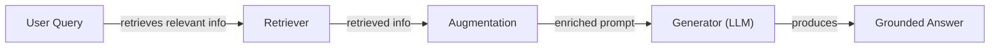
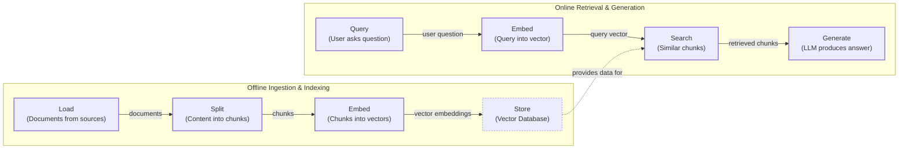
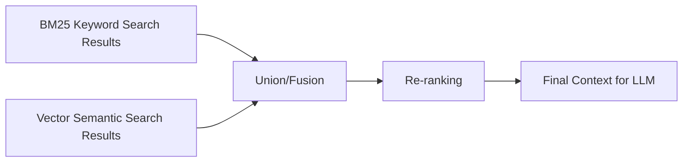
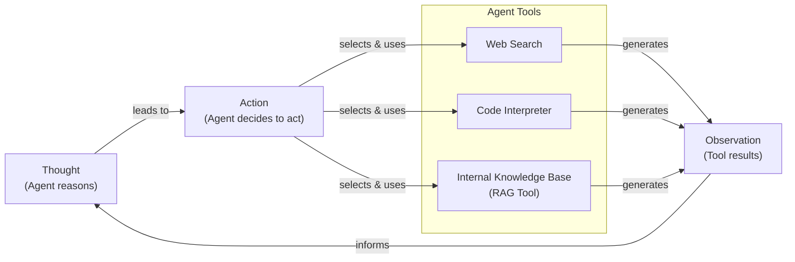

# Lesson 9: Retrieval-Augmented Generation

In our previous lessons, we built a solid foundation in AI Engineering. We explored the agent landscape, distinguished between LLM workflows and AI agents, and, in Lesson 3, introduced Context Engineering—the art of managing the information an LLM sees. We have also built a ReAct agent from scratch, giving it the ability to reason and use tools. Now, we will tackle one of the most essential techniques in an AI Engineer's toolkit: Retrieval-Augmented Generation (RAG).

LLMs are trained on a fixed dataset, which means their knowledge is static and they can become outdated. They are essentially taking a "closed-book exam" on the world's information. This limitation leads to two major problems: they cannot access real-time or private data, and they are prone to "hallucination," where they invent plausible but incorrect facts [[1]](https://neo4j.com/blog/developer/fine-tuning-vs-rag/). This happens because their knowledge is frozen the moment their training ends. While we can update a model's knowledge through fine-tuning, this process is expensive, time-consuming, and impractical for information that changes frequently. Empirical studies have shown that LLMs struggle to learn new factual information through fine-tuning alone, making it an unreliable method for keeping them current [[2]](https://aclanthology.org/2024.emnlp-main.15.pdf).

RAG offers a more practical and effective solution. Instead of trying to force the model to memorize an ever-expanding universe of information, we give it an "open-book exam." RAG connects the LLM to external, up-to-date knowledge sources at the exact moment it needs to answer a question [[3]](https://blogs.nvidia.com/blog/what-is-retrieval-augmented-generation/). This approach is a core method within the Context Engineering discipline we covered in Lesson 3, as it allows us to dynamically inject the most relevant information into the LLM's context window. This is similar to how humans operate; we do not memorize every single fact but instead rely on our ability to look up information in books, manuals, or search engines when needed.

This lesson will guide you through the fundamentals of RAG, from its core components to the advanced and agentic patterns that power modern AI systems. We will explore how retrieval provides agents with the external knowledge they need to perform complex tasks, a concept that complements an agent's internal memory, which we will explore further in Lesson 10.

With the problem and motivation clear, we’ll first decompose RAG into its core components so you can see where each responsibility lives.

## The RAG System: Core Components

Understanding the components of a RAG system is the first step in the Context Engineering process of designing and building effective AI applications. At its heart, a RAG system is built on three conceptual pillars: Retrieval, Augmentation, and Generation.

**Retrieval** is the system's engine for finding relevant information. When a user asks a question, the retriever searches an external knowledge base to find documents or data snippets that are most likely to contain the answer. The most common approach is semantic search, which finds text that is contextually similar in meaning, even if the wording is different [[4]](https://apxml.com/courses/prompt-engineering-llm-application-development/chapter-6-integrating-llms-external-data-rag/implementing-semantic-search-retrieval). This is made possible by vector embeddings, which are high-dimensional numerical arrays that capture the semantic essence of text. These embeddings are stored in a specialized vector database, a type of database designed to perform efficient nearest-neighbor searches across billions of vectors, making it a foundational component for fast and scalable retrieval [[5]](https://pub.towardsai.net/vector-databases-in-practice-building-a-realistic-hybrid-search-rag-system-with-qdrant-7b8f4a6e41e0).

**Augmentation** is the process of taking the information found by the retriever and preparing it for the LLM. The retrieved text snippets are combined with the original user query and inserted into a prompt template. This step "augments" the original prompt with fresh, relevant context, giving the LLM the specific information it needs to craft an accurate response [[6]](https://www.topquadrant.com/resources/blog-retrieval-augmented-generation-explained/). The design of this augmented prompt is a crucial piece of prompt engineering, as it must clearly instruct the model on how to use the provided context to answer the user's question.

**Generation** is the final step. The augmented prompt, now rich with retrieved context, is sent to an LLM. The model uses this information as its source of truth to generate a final answer that is grounded in the provided data, not just its internal training. This process helps reduce hallucinations and allows the model to cite its sources, which builds user trust [[7]](https://www.ibm.com/think/topics/retrieval-augmented-generation). By instructing the LLM to answer based only on the provided context, we create a verifiable link between the answer and the source material.

Image 1 illustrates the flow between these three components.

Image 1: A flowchart illustrating the core components and data flow of a Retrieval Augmented Generation (RAG) system.

Now that you can name each moving part, let’s see how they line up across the two phases of a real system.

## The RAG Pipeline: Ingestion and Retrieval

An end-to-end RAG workflow is composed of two distinct phases: an offline ingestion pipeline that prepares the knowledge base, and an online retrieval pipeline that answers user queries in real-time.

### Phase 1: Offline Ingestion & Indexing

This phase is all about preparing your external data so it can be efficiently searched. It typically runs as a batch or streaming process before your application is live. The first step is to **Load** your documents from various sources, which can be anything from PDFs and text files to web pages or data from an API. Tools like LangChain's document loaders or LlamaIndex's readers are commonly used to handle different data formats and sources [[8]](https://newsletter.systemdesign.one/p/how-rag-works).

Next, you **Split** these documents into smaller, more manageable pieces called chunks. Since LLMs have limited context windows and retrieval is more effective with focused snippets of information, this step is essential. You can use simple rule-based splitters, like LangChain's `RecursiveCharacterTextSplitter`, or more advanced semantic chunkers that break up text based on topical shifts to ensure that related ideas are not separated across different chunks [[9]](https://medium.com/@derrickryangiggs/rag-pipeline-deep-dive-ingestion-chunking-embedding-and-vector-search-abd3c8bfc177).

Each chunk of text is then passed through an embedding model to **Embed** it, converting the text into a numerical vector that captures its semantic meaning. A wide range of models are available for this task, including proprietary ones like OpenAI's `text-embedding-3-small` and Google's `text-embedding-004`, as well as powerful open-source models from Hugging Face [[10]](https://qdrant.tech/articles/what-is-rag-in-ai/).

Finally, you **Store** these vector embeddings and their corresponding text chunks in a vector database. This database indexes the vectors for fast similarity search, creating the searchable knowledge base for your RAG system. Options range from local libraries like FAISS for quick prototyping to production-grade databases such as Qdrant, Milvus, and Pinecone for large-scale applications [[11]](https://medium.com/@robi.tomar72/how-rag-actually-works-embeddings-vector-databases-indexing-retrieval-explained-simply-3d1ca45fe1bf).

### Phase 2: Online Retrieval & Generation

This phase happens in real-time whenever a user interacts with your application. It begins when a user submits a **Query**. This raw query might first be pre-processed to normalize it or expand it with related terms to improve search results.

The system then uses the *same* embedding model from the ingestion phase to **Embed** the user's query into a vector. This step is critical because it ensures that the query and the documents exist in the same vector space, which is a prerequisite for performing a meaningful similarity comparison [[4]](https://apxml.com/courses/prompt-engineering-llm-application-development/chapter-6-integrating-llms-external-data-rag/implementing-semantic-search-retrieval).

With the query vector, the system can **Search** the vector database. The database performs a similarity search, often using a metric like cosine similarity, to find the `top-k` document chunks whose embeddings are mathematically closest to the query's embedding [[12]](https://towardsdatascience.com/rag-explained-understanding-embeddings-similarity-and-retrieval/). These `top-k` chunks are the most semantically relevant pieces of information for answering the user's question.

In the final step, you **Generate** the answer. The retrieved chunks are combined with the original query into an augmented prompt, which is then sent to an LLM. The LLM uses this context to generate a final answer that is grounded in the retrieved information. As we learned in Lesson 4 on structured outputs, you can design this step to include citations back to the source documents, which enhances the transparency and trustworthiness of your application.

Image 2 shows a more detailed view of these two interconnected pipelines.

Image 2: A detailed flowchart illustrating the two distinct phases of the RAG pipeline: Offline Ingestion & Indexing and Online Retrieval & Generation.

With the end-to-end path in place, the next question is quality. What are the advanced techniques to make the retrieval more accurate and useful across messy, real-world data?

## Advanced RAG Techniques

A naive RAG pipeline is a great starting point, but production systems often require more sophisticated techniques to handle the complexities of real-world data and user queries. These advanced methods focus on improving the quality and relevance of the retrieved information before it ever reaches the LLM.

### Hybrid Search

Vector search is excellent at understanding semantic meaning, but it can sometimes miss exact keywords, product codes, or specific names. **Hybrid search** solves this by combining the strengths of keyword-based search (like the classic BM25 algorithm) with semantic vector search [[13]](https://mlpills.substack.com/p/issue-76-optimize-rag-with-hybrid). BM25, which is based on principles like Term Frequency-Inverse Document Frequency (TF-IDF), excels at finding documents with precise term matches. Vector search, on the other hand, captures broader contextual relationships. For example, if a user asks about a bill that "keeps rolling over," keyword search finds articles with the term "rollover," while semantic search might find documents discussing "carryover balance." By fusing the results of both searches, often using a method called Reciprocal Rank Fusion (RRF) to merge the two ranked lists, hybrid search provides more comprehensive and accurate retrieval [[14]](https://cubitrek.com/blog/hybrid-search-optimization-how-bm25-and-dense-vector-retrieval-work-together-for-superior-ai-search/).

### Re-ranking

The initial retrieval step is optimized for speed and recall, meaning it aims to quickly find a broad set of potentially relevant documents. However, the best document might not always be ranked at the very top. **Re-ranking** introduces a second, more precise scoring step. After the initial retrieval, a more powerful model, like a cross-encoder, re-evaluates the top candidates [[15]](https://apxml.com/courses/optimizing-rag-for-production/chapter-2-advanced-retrieval-optimization/reranking-architectures-rag). Unlike standard embedding models (bi-encoders), which process the query and documents separately, a cross-encoder examines the query and each document *together*. This allows for a deeper, more contextual understanding of their relevance. Think of it as the difference between looking up two words in a dictionary separately versus reading them in the same sentence. This process improves the final ordering of documents sent to the LLM, ensuring the most relevant information gets the most attention [[16]](https://redis.io/blog/10-techniques-to-improve-rag-accuracy/).

Image 3: A flowchart illustrating the hybrid retrieval flow.

### Query Transformations

Sometimes, the user's query is not the best input for a search system. **Query transformations** rewrite or expand the user's question to improve retrieval results. One common technique is **Decomposition**, which breaks a complex, multi-part question into several simpler sub-queries. For instance, the question "What is our company's travel policy for conferences in Europe this year?" could be broken down into separate queries about the general travel policy, conference-specific rules, European travel, and recent updates. The system retrieves documents for each sub-query and then synthesizes the results [[17]](https://docs.nvidia.com/rag/latest/query_decomposition.html). Another powerful method is **Hypothetical Document Embeddings (HyDE)**. Here, an LLM first generates a hypothetical, ideal answer to the user's query. This generated answer, which is often phrased in the language of the source documents, is then converted to an embedding and used for the search. This can bridge the vocabulary gap between a user's question and the content in the knowledge base, leading to more relevant results [[18]](https://47billion.com/blog/rag-system-in-production-why-it-fails-and-how-to-fix-it/).

### Advanced Chunking Strategies

How you split your documents into chunks has a huge impact on retrieval quality. A fixed-size chunking strategy might awkwardly cut a sentence or table in half, separating related information. **Semantic chunking** aims to split documents along conceptual boundaries, keeping related sentences together in the same chunk. For example, instead of splitting a document every 500 words, you could split it after every major section heading, ensuring that the entire "Reimbursements" section of a policy manual stays together. **Layout-aware chunking** is crucial for complex documents like PDFs with tables, headers, and footnotes. This approach analyzes the visual layout of the document to ensure that a row in a pricing table is not separated from its corresponding product name and price. Finally, **context-enriched chunking**, also known as contextual retrieval, involves adding a summary or context about the parent document to each chunk. For a chunk that says, "The company's revenue grew by 3%," this method might prepend, "This chunk is from ACME Corp's Q2 2023 financial report," making the chunk independently meaningful and easier to retrieve accurately.

### GraphRAG

For questions that involve complex relationships and multiple entities, standard document retrieval can fall short. **GraphRAG** addresses this by first constructing a knowledge graph from the source documents, where entities (like people, companies, or products) are nodes and their relationships are edges [[19]](https://arxiv.org/html/2404.16130). Instead of just searching for similar text, the system can traverse this graph to answer multi-hop questions. For example, to answer, “Which incidents were caused by weekend deploys that also touched the login service?” the system can navigate connections from incident tickets to change records, filter by deploy time, and check the affected services. This allows for a deeper, more structured understanding of the data that is impossible with simple text chunks alone, especially for queries that require reasoning across multiple documents or data points [[20]](https://arxiv.org/html/2501.00309v2).

These techniques increase retrieval quality. Next, we’ll see how retrieval becomes one tool that an agent can choose to use as it reasons.

## Agentic RAG

In Lessons 7 and 8, we explored ReAct, a framework that enables agents to reason and act. Agentic RAG is the natural evolution of this concept, where the RAG pipeline is no longer a fixed, linear process but a dynamic tool that a reasoning agent can use. Essentially, an Agentic RAG system is a ReAct-style agent equipped with a retrieval tool. The agent follows a "Thought, Action, Observation" loop, deciding *when* and *how* to use its retrieval capabilities.

The core distinction between standard and agentic RAG is the shift from a predetermined workflow to an adaptive, iterative loop [[21]](https://www.ibm.com/think/topics/agentic-rag). Standard RAG is a rigid, one-pass pipeline: Retrieve → Augment → Generate. It follows the same steps for every query. In contrast, Agentic RAG is a control loop. An agent assesses the query, decides if it needs more information, chooses the best tool, and can even refine its search based on initial findings [[22]](https://towardsdatascience.com/agentic-rag-vs-classic-rag-from-a-pipeline-to-a-control-loop/).

This agentic approach unlocks several powerful capabilities. The agent can **iteratively** use the RAG tool, refining its query if the first retrieval returns vague or incomplete information. It can **choose** which knowledge source to search, routing a query to `search_internal_docs` or `search_emails` based on the context. It can also **fuse** information from multiple sources, retrieving an internal policy document and then using a web search to verify a regulatory detail before synthesizing a final answer. The agent can even decide when **not** to retrieve at all, handling conversational queries like "Hello" without needlessly searching a knowledge base.

It is important to clarify that agents typically use many tools, such as web search, code execution, and database queries. Labeling a whole system “agentic RAG” can be too narrow. The retrieval tool is just one of several capabilities an agent might have. A more accurate description for such a system would be a "tool-using agent" that happens to have a RAG component.

Consider a conceptual thought process for an agent handling a complex query:
*Thought:* "The user is asking about our '2024 EU data retention rules.' Our internal policy documents mention 2023 rules, which are likely outdated. I need to verify this."
*Action:* `retrieve(internal_policy, query="EU data retention 2024")`
*Observation:* "The internal document mentions upcoming amendments but lacks specific citations."
*Thought:* "The internal information is incomplete. I need external verification from an authoritative source."
*Action:* `web_search(query="official EU data retention directive 2024")`
*Observation:* "Found a new directive from the European Commission with updated regulations."
*Thought:* "Now I have both the internal context and the latest external rules. I will synthesize these, highlight the changes from 2023, and cite both sources."

This transforms the interaction from a simple database lookup into a conversation with a knowledgeable research assistant. The agent doesn't just fetch data; it plans, verifies, and reasons to construct the best possible answer.

Image 4: A conceptual Mermaid diagram illustrating an agent's main loop in an Agentic RAG system.

You now understand both a linear RAG pipeline and how an agent can control retrieval when needed. Let’s wrap up by situating RAG in the wider AI Engineering toolkit and previewing what comes next.

## Conclusion

We have journeyed from the fundamental problem of static LLM knowledge to the sophisticated, reasoning-driven approach of Agentic RAG. RAG is the most widely used solution to ground LLMs, reduce hallucinations, and enable the use of proprietary or real-time data. For production-grade applications, advanced techniques like hybrid search, re-ranking, and GraphRAG are essential for achieving high-quality results. The future of information retrieval is agentic, where RAG is not just a pipeline but a dynamic tool wielded by an intelligent agent.

By mastering these patterns, you build user trust through verifiable, source-backed answers. RAG is not a niche skill but a foundational competency for any modern AI Engineer, forming an essential part of the broader discipline of Context Engineering.

In our next lesson, we will explore Memory for Agents. You will learn how agents use short-term and long-term memory to maintain context, remember user preferences, and learn from past interactions. This complements retrieval by giving agents a persistent understanding of their world, making them more personalized and effective over time. We will also cover other important topics like evaluating retrieval quality and monitoring these complex systems in production in future parts of the course.

## References

- [1] [Knowledge Graphs and LLMs: Fine-Tuning vs. Retrieval-Augmented Generation](https://neo4j.com/blog/developer/fine-tuning-vs-rag/)
- [2] [Fine-Tuning or Retrieval? Comparing Knowledge Injection in LLMs](https://aclanthology.org/2024.emnlp-main.15.pdf)
- [3] [What Is Retrieval-Augmented Generation, aka RAG?](https://blogs.nvidia.com/blog/what-is-retrieval-augmented-generation/)
- [4] [Implementing Semantic Search for Retrieval](https://apxml.com/courses/prompt-engineering-llm-application-development/chapter-6-integrating-llms-external-data-rag/implementing-semantic-search-retrieval)
- [5] [Vector Databases in Practice: Building a Realistic Hybrid-Search RAG System with Qdrant](https://pub.towardsai.net/vector-databases-in-practice-building-a-realistic-hybrid-search-rag-system-with-qdrant-7b8f4a6e41e0)
- [6] [Retrieval-Augmented Generation Explained](https://www.topquadrant.com/resources/blog-retrieval-augmented-generation-explained/)
- [7] [What is retrieval-augmented generation?](https://www.ibm.com/think/topics/retrieval-augmented-generation)
- [8] [How RAG Works](https://newsletter.systemdesign.one/p/how-rag-works)
- [9] [RAG Pipeline Deep Dive: Ingestion (Chunking, Embedding) and Vector Search](https://medium.com/@derrickryangiggs/rag-pipeline-deep-dive-ingestion-chunking-embedding-and-vector-search-abd3c8bfc177)
- [10] [What is RAG: Understanding Retrieval-Augmented Generation](https://qdrant.tech/articles/what-is-rag-in-ai/)
- [11] [How RAG Actually Works: Embeddings, Vector Databases, Indexing, and Retrieval Explained Simply](https://medium.com/@robi.tomar72/how-rag-actually-works-embeddings-vector-databases-indexing-retrieval-explained-simply-3d1ca45fe1bf)
- [12] [RAG Explained: Understanding Embeddings, Similarity and Retrieval](https://towardsdatascience.com/rag-explained-understanding-embeddings-similarity-and-retrieval/)
- [13] [Optimize RAG with Hybrid Search](https://mlpills.substack.com/p/issue-76-optimize-rag-with-hybrid)
- [14] [Hybrid Search Optimization: How BM25 and Dense Vector Retrieval Work Together for Superior AI Search](https://cubitrek.com/blog/hybrid-search-optimization-how-bm25-and-dense-vector-retrieval-work-together-for-superior-ai-search/)
- [15] [Reranking Architectures in RAG](https://apxml.com/courses/optimizing-rag-for-production/chapter-2-advanced-retrieval-optimization/reranking-architectures-rag)
- [16] [10 techniques to improve RAG accuracy](https://redis.io/blog/10-techniques-to-improve-rag-accuracy/)
- [17] [Query Decomposition](https://docs.nvidia.com/rag/latest/query_decomposition.html)
- [18] [Why Your RAG System Fails in Production and How to Fix It](https://47billion.com/blog/rag-system-in-production-why-it-fails-and-how-to-fix-it/)
- [19] [From Local to Global: A GraphRAG Approach to Query-Focused Summarization](https://arxiv.org/html/2404.16130)
- [20] [GraphRAG: A Graph-based Retrieval Method for Multi-hop Question Answering](https://arxiv.org/html/2501.00309v2)
- [21] [What is agentic RAG?](https://www.ibm.com/think/topics/agentic-rag)
- [22] [Agentic RAG vs Classic RAG: From a Pipeline to a Control Loop](https://towardsdatascience.com/agentic-rag-vs-classic-rag-from-a-pipeline-to-a-control-loop/)
- [23] [Addressing AI Hallucinations with Retrieval-Augmented Generation](https://www.infoworld.com/article/2335043/addressing-ai-hallucinations-with-retrieval-augmented-generation.html)
- [24] [Fine-Tuning or Retrieval? Comparing Knowledge Injection in LLMs](https://arxiv.org/html/2312.05934v3)
- [25] [AWS Vector Databases Explained: Powering Semantic Search and RAG Systems](https://tutorialsdojo.com/aws-vector-databases-explained-semantic-search-and-rag-systems/)
- [26] [Vector Embeddings in RAG Applications](https://wandb.ai/mostafaibrahim17/ml-articles/reports/Vector-Embeddings-in-RAG-Applications--Vmlldzo3OTk1NDA5)
- [27] [A Complete Guide to RAG](https://towardsai.net/p/l/a-complete-guide-to-rag)
- [28] [What is agentic RAG?](https://www.pingcap.com/article/agentic-rag-vs-traditional-rag-key-differences-benefits/)
- [29] [Agentic RAG vs. Traditional RAG](https://medium.com/@gaddam.rahul.kumar/agentic-rag-vs-traditional-rag-b1a156f72167)
- [30] [AI Agent vs. RAG: What’s the Difference?](https://airbyte.com/agentic-data/ai-agent-vs-rag)
- [31] [RAG vs. Agentic AI: Which Is Right for Your Enterprise?](https://domino.ai/blog/rag-vs-agentic-ai)
- [32] [Your RAG is wrong: Here's how to fix it](https://decodingml.substack.com/p/your-rag-is-wrong-heres-how-to-fix?utm_source=publication-search)
- [33] [Advanced RAG Techniques That Will Transform Your LLM Application](https://cloudurable.com/blog/advanced-rag-techniques-that-will-transform-your-l/)
- [34] [Advanced RAG Techniques for High-Performance LLM Applications](https://neo4j.com/blog/genai/advanced-rag-techniques/)
- [35] [Retrieval-Augmented Generation: Building Grounded AI for Enterprise Knowledge](https://medium.com/@fahey_james/retrieval-augmented-generation-building-grounded-ai-for-enterprise-knowledge-6bc46277fee5)
- [36] [What is RAG? (Retrieval-Augmented Generation)](https://www.mindstudio.ai/blog/what-is-rag/)
- [37] [Retrieval-Augmented Generation (RAG) Fundamentals First](https://decodingml.substack.com/p/rag-fundamentals-first?utm_source=publication-search)
- [38] [Build advanced retrieval-augmented generation systems](https://learn.microsoft.com/en-us/azure/developer/ai/advanced-retrieval-augmented-generation)
- [39] [RAG’s Inventor Talks Agents, Grounded AI, and Enterprise Impact](https://www.madrona.com/rag-inventor-talks-agents-grounded-ai-and-enterprise-impact/)
- [40] [RAG Architectures: A Comprehensive Guide to RAG for LLMs](https://humanloop.com/blog/rag-architectures)
- [41] [RAG and its different components](https://www.aimon.ai/posts/rag_and_its_different_components/)
- [42] [Grounding LLMs: Driving AI to Deliver Contextually Relevant Data](https://toloka.ai/blog/grounding-llms-driving-ai-to-deliver-contextually-relevant-data/)
- [43] [What Is RAG? A Deep Dive Into RAG Architecture](https://galileo.ai/blog/rag-architecture)
- [44] [RAGOps Guide: Building and Scaling Retrieval-Augmented Generation Systems](https://towardsdatascience.com/ragops-guide-building-and-scaling-retrieval-augmented-generation-systems-3d26b3ebd627)
- [45] [What is Agentic RAG](https://weaviate.io/blog/what-is-agentic-rag)
- [46] [What is Retrieval-Augmented Generation?](https://aws.amazon.com/what-is/retrieval-augmented-generation/)
- [47] [RAG is dead, long live agentic retrieval](https://www.llamaindex.ai/blog/rag-is-dead-long-live-agentic-retrieval)
- [48] [Hybrid Retrieval for RAG: Combining BM25 and FAISS](https://www.chitika.com/hybrid-retrieval-rag/)
- [49] [Hybrid RAG in the Real World: Graphs, BM25, and the End of Black Box Retrieval](https://community.netapp.com/t5/Tech-ONTAP-Blogs/Hybrid-RAG-in-the-Real-World-Graphs-BM25-and-the-End-of-Black-Box-Retrieval/ba-p/464834)
- [50] [Pistis-RAG: Enhancing Retrieval-Augmented Generation with Human Feedback](https://arxiv.org/html/2407.00072v5)
- [51] [Advanced RAG: Retrieval with Cross-Encoders for Reranking](https://towardsdatascience.com/advanced-rag-retrieval-cross-encoders-reranking/)
- [52] [From Local to Global: A GraphRAG Approach to Query-Focused Summarization](https://arxiv.org/html/2601.03014v1)
- [53] [Graph-Based Retrieval for RAG: A New Paradigm in Information Retrieval](https://www.chitika.com/graph-based-retrieval-rag/)
- [54] [GraphRAG: A Graph-Based Approach for Improving Retrieval-Augmented Generation](https://webhome.cs.uvic.ca/~thomo/papers/asonam2025-graphrag.pdf)
- [55] [What is GraphRAG? The Next Evolution of Retrieval Augmented Generation](https://atlan.com/know/what-is-graphrag/)
- [56] [Vector DB and RAG Pipeline for Document RAG](https://learnopencv.com/vector-db-and-rag-pipeline-for-document-rag/)
- [57] [The Rise of RAG](https://highlearningrate.substack.com/p/the-rise-of-rag)
- [58] [Introduction to Augmenting LLMs using Retrieval Augmented Generation (RAG)](https://medium.com/@rahulraut.techuse/introduction-to-augmenting-llms-using-retrieval-augmented-generation-rag-6530123dbb91)
- [59] [Retrieval-Augmented Generation (RAG)](https://www.promptingguide.ai/research/rag)
- [60] [Retrieval Augmented Generation (RAG) from Basics to Advanced](https://medium.com/@tejpal.abhyuday/retrieval-augmented-generation-rag-from-basics-to-advanced-a2b068fd576c)
- [61] [Introducing Contextual Retrieval](https://www.anthropic.com/news/contextual-retrieval)
</article>