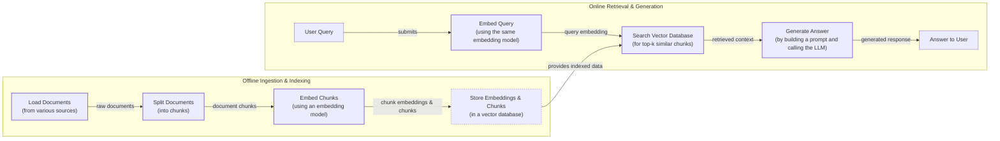
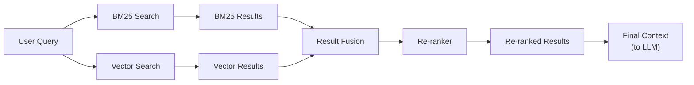
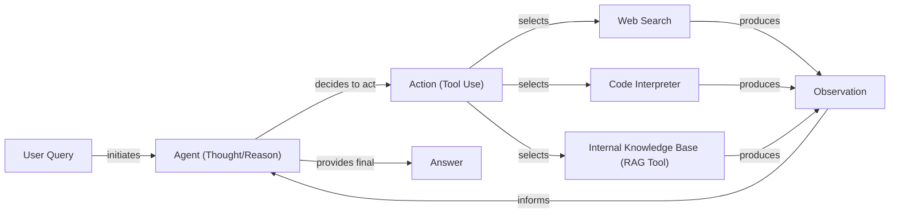

# Lesson 9: Retrieval-Augmented Generation (RAG)

In our previous lessons, we explored the foundations of AI Engineering. We covered context engineering, the art of managing information flow to LLMs, and saw how agents use tools and reasoning frameworks like ReAct to plan and execute tasks. We have learned that what you feed into an LLM is as important as the model itself. However, a core problem remains: LLMs are trained on a fixed dataset, making their knowledge static. They take a "closed-book exam" on the world's information, and without a way to learn new facts after training, they can hallucinate or provide outdated answers [[16]](https://neo4j.com/blog/developer/fine-tuning-vs-rag/), [[21]](https://www.infoworld.com/article/2335043/addressing-ai-hallucinations-with-retrieval-augmented-generation.html).

This static knowledge is a major roadblock for building truly useful AI applications. When a user asks about a recent event or a private company document, a standard LLM can only guess. For example, if you ask a model with a knowledge cutoff in January 2022 about the 2024 NBA MVP, it will honestly tell you it does not know [[16]](https://neo4j.com/blog/developer/fine-tuning-vs-rag/). In worse cases, it might invent a plausible but incorrect answer, a phenomenon that has led to real-world consequences, such as lawyers citing fictitious legal cases in court [[16]](https://neo4j.com/blog/developer/fine-tuning-vs-rag/). The model's internal, or "parameterized," knowledge simply does not contain the answer.

Fine-tuning is one option to update this knowledge, but it is expensive, slow, and impractical for information that changes constantly. It is like forcing a student to re-read and memorize an entire library for every new question. A better approach is to give the LLM an "open-book exam" by connecting it to external, real-time knowledge sources [[1]](https://blogs.nvidia.com/blog/what-is-retrieval-augmented-generation/). This is the core idea behind Retrieval-Augmented Generation (RAG). Instead of expecting a model to memorize everything, we give it the tools to look things up, just as a human would use a manual or a cheat sheet.

RAG is a fundamental technique within the discipline of context engineering we introduced in Lesson 3. It provides a structured way to find and inject relevant, external knowledge into the LLM's context window at the moment of need. This allows us to build applications that are grounded in verifiable facts, reducing hallucinations and increasing user trust. By separating the knowledge base from the reasoning engine, we can update information easily without retraining the model. This transforms the problem from complex LLM maintenance into a more manageable database maintenance task, making our systems more agile and cost-effective [[33]](https://aws.amazon.com/what-is/retrieval-augmented-generation/).

In this lesson, we will examine the mechanics of RAG. We will start by breaking down a RAG system into its core components and mapping out the end-to-end pipeline. Then, we will explore the advanced techniques that separate production-grade systems from simple prototypes. Finally, we will see how RAG evolves from a static pipeline into a dynamic tool that intelligent agents can use, connecting back to our lessons on agentic reasoning. We will also briefly touch on how retrieval complements an agent's memory, a topic we will explore fully in Lesson 10.

## The RAG System: Core Components

To build effective RAG systems, you first need to understand the three conceptual pillars that form its foundation. This is the first step in the context engineering process, as it helps you see where each responsibility lives in the system. The entire process is designed to find the right information, add it to the prompt, and generate a fact-based answer [[3]](https://decodingml.substack.com/p/rag-fundamentals-first?utm_source=publication-search), [[1]](https://blogs.nvidia.com/blog/what-is-retrieval-augmented-generation/), [[11]](https://highlearningrate.substack.com/p/the-rise-of-rag).

```mermaid
flowchart LR
  "User Query" --> "Retriever"
  "Retriever" --> "Augmentation"
  "Augmentation" --> "Generator (LLM)"
  "Generator (LLM)" --> "Answer"
```

Image 1: A flowchart illustrating the core conceptual pillars of a Retrieval Augmented Generation (RAG) system.

**Retrieval** is the engine of the RAG system, responsible for finding relevant information from an external knowledge source. The most common approach relies on semantic search, which finds text that is contextually similar in meaning, even if the wording is different [[47]](https://apxml.com/courses/prompt-engineering-llm-application-development/chapter-6-integrating-llms-external-data-rag/implementing-semantic-search-retrieval), [[48]](https://medium.com/@robi.tomar72/how-rag-actually-works-embeddings-vector-databases-indexing-retrieval-explained-simply-3d1ca45fe1bf). This is made possible by vector embeddings, which are numerical representations of text generated by models like BERT that capture its semantic meaning [[13]](https://qdrant.tech/articles/what-is-rag-in-ai/).

Chunks of text with similar meanings are located closer together in a high-dimensional vector space. These embeddings are stored in a specialized vector database optimized for fast similarity searches. When a user asks a question, the system converts the query into an embedding and searches the database to find document chunks with the closest vectors, typically using a distance metric like cosine similarity to measure the angle between vectors [[50]](https://towardsdatascience.com/rag-explained-understanding-embeddings-similarity-and-retrieval/).

However, semantic search alone is not always enough. It can struggle with queries that contain specific keywords, IDs, or acronyms. To address this, retrieval systems often incorporate keyword-based search methods like BM25. BM25 is a ranking function that scores documents based on term frequency and rarity (TF-IDF), making it highly effective for finding exact matches [[36]](https://mlpills.substack.com/p/issue-76-optimize-rag-with-hybrid). By combining both semantic and keyword search, a technique known as hybrid search, the retrieval engine can capture both contextual meaning and precise terms.

**Augmentation** is the process of taking the information found by the retriever and integrating it into the prompt that will be sent to the LLM. This step is where the "augmented" part of RAG happens. The retrieved text chunks are combined with the original user query and a set of instructions, forming a new, context-rich prompt [[27]](https://www.ibm.com/think/topics/retrieval-augmented-generation), [[34]](https://www.topquadrant.com/resources/blog-retrieval-augmented-generation-explained/). The goal is to give the LLM all the necessary evidence it needs to formulate a comprehensive and accurate answer, instructing it to rely on the provided context. Effective prompt engineering is essential here to ensure the model properly utilizes the retrieved information.

**Generation** is the final step, where the LLM produces an answer. The model receives the augmented prompt and uses its language capabilities to synthesize the information from the retrieved context into a coherent, human-readable response [[52]](https://medium.com/@tejpal.abhyuday/retrieval-augmented-generation-rag-from-basics-to-advanced-a2b068fd576c). Because the answer is grounded in the external data provided, it is less likely to contain hallucinations and can even include citations that trace back to the original source documents, building user trust.

Now that you can name each moving part, let’s see how they line up across the two phases of a real system.

## The RAG Pipeline: Ingestion and Retrieval

A production-ready RAG system operates in two distinct phases: an offline ingestion pipeline that prepares the data and an online retrieval pipeline that answers user queries in real-time [[30]](https://newsletter.systemdesign.one/p/how-rag-works). Understanding this separation is key to building scalable and maintainable RAG applications.



Image 2: A detailed flowchart illustrating the end-to-end RAG workflow, divided into two main phases: Offline Ingestion & Indexing and Online Retrieval & Generation.

### Phase 1: Offline Ingestion & Indexing

The offline phase is where you process your knowledge base and make it searchable. This happens before any user interacts with the system and typically runs whenever new data is available [[30]](https://newsletter.systemdesign.one/p/how-rag-works). It involves four main steps [[29]](https://medium.com/@derrickryangiggs/rag-pipeline-deep-dive-ingestion-chunking-embedding-and-vector-search-abd3c8bfc177), [[31]](https://towardsdatascience.com/ragops-guide-building-and-scaling-retrieval-augmented-generation-systems-3d26b3ebd627).

**Load:** First, you load your raw documents from various sources. These can include local files (PDFs, DOCX), cloud storage (S3, Azure Blob), enterprise systems (SharePoint, Confluence), or web pages and APIs. Libraries like LangChain and LlamaIndex provide document loaders that can handle a wide range of formats.

**Split:** Since LLMs have limited context windows and work better with smaller pieces of text, you split the loaded documents into smaller, more manageable "chunks" [[13]](https://qdrant.tech/articles/what-is-rag-in-ai/). This is a critical step, as the quality of your chunks directly impacts retrieval accuracy. Strategies range from simple fixed-size splits to more advanced methods like recursive chunking, which splits text hierarchically based on paragraphs and sentences, or semantic chunking, which groups related sentences together. A small overlap (10-20%) between chunks is often used to ensure context is not lost across boundaries [[29]](https://medium.com/@derrickryangiggs/rag-pipeline-deep-dive-ingestion-chunking-embedding-and-vector-search-abd3c8bfc177).

**Embed:** Next, each chunk is passed through an embedding model, which converts the text into a high-dimensional vector. This vector captures the semantic meaning of the chunk. Popular embedding models include OpenAI's `text-embedding-3-large`, Google's `text-embedding-004`, and open-source alternatives like `bge-large-en-v1.5` available on Hugging Face. The dimensionality of these vectors typically ranges from 384 to over 3000, depending on the model [[29]](https://medium.com/@derrickryangiggs/rag-pipeline-deep-dive-ingestion-chunking-embedding-and-vector-search-abd3c8bfc177).

**Store:** Finally, the generated embeddings and their corresponding text chunks are stored in a vector database. This database is optimized for efficient similarity search. It is also best practice to store metadata alongside each chunk, such as the source document, creation date, or topic, which can be used for filtering during retrieval [[30]](https://newsletter.systemdesign.one/p/how-rag-works). Common choices for vector databases include local libraries like FAISS for prototyping and scalable, production-ready databases like Milvus, Qdrant, or Pinecone.

### Phase 2: Online Retrieval & Generation

The online phase is triggered when a user submits a query. This is the real-time part of the RAG pipeline that delivers the answer to the user.

**Embed Query:** The user's query is converted into a vector using the *same* embedding model that was used during the ingestion phase [[29]](https://medium.com/@derrickryangiggs/rag-pipeline-deep-dive-ingestion-chunking-embedding-and-vector-search-abd3c8bfc177). This ensures that the query and the document chunks are in the same vector space, making them comparable.

**Search:** The system uses the query vector to search the vector database. It performs a similarity search to find the top-k document chunks whose embeddings are closest to the query embedding. This is the core retrieval step, where a distance metric like Cosine Similarity or Euclidean Distance is used to quantify the "closeness" between the query vector and the document vectors [[50]](https://towardsdatascience.com/rag-explained-understanding-embeddings-similarity-and-retrieval/).

**Generate:** The retrieved chunks are then combined with the original query and a prompt template. This augmented prompt is fed to an LLM, which generates a final answer grounded in the provided information. As we learned in Lesson 4, you can use structured outputs to format the answer and include citations, which helps ensure the response is both accurate and verifiable.

With the end-to-end path in place, the next question is quality. What are the advanced techniques to make the retrieval more accurate and useful across messy, real-world data?

## Advanced RAG Techniques

A naive RAG pipeline performs well on simple lookups but often breaks down in production when faced with complex queries or diverse document types. To build a system that works at scale, you need to move beyond the basics and incorporate advanced RAG techniques. These strategies focus on improving retrieval quality, managing context effectively, and ensuring answers are grounded and accurate [[14]](https://neo4j.com/blog/genai/advanced-rag-techniques/).

### Hybrid Search

Vector search is great for understanding meaning, but it can miss exact keywords, IDs, or acronyms. Hybrid search solves this by combining the strengths of semantic (vector) search with traditional keyword-based search, like BM25 [[37]](https://cubitrek.com/blog/hybrid-search-optimization-how-bm25-and-dense-vector-retrieval-work-together-for-superior-ai-search/). BM25 ranks documents based on term frequency, making it excellent for finding precise matches. For example, in a customer support scenario, if a user writes "my bill keeps rolling over," a keyword search will find articles containing the exact term "rollover." A semantic search might find related concepts like "carryover balance." By fusing the results from both methods, often using a technique like Reciprocal Rank Fusion (RRF), you get the best of both worlds: semantic relevance and keyword precision [[36]](https://mlpills.substack.com/p/issue-76-optimize-rag-with-hybrid).



Image 3: A flowchart illustrating the hybrid retrieval process.

### Re-ranking

The initial retrieval step is optimized for speed and recall, meaning it might pull in documents that are only loosely related to the query. A re-ranker adds a second, more precise filtering stage. It uses a more powerful model, often a cross-encoder, which examines the user query and each retrieved document pair together to calculate a highly accurate relevance score [[41]](https://apxml.com/courses/optimizing-rag-for-production/chapter-2-advanced-retrieval-optimization/reranking-architectures-rag). This process is slower than the initial retrieval, so it is only applied to a smaller set of top candidates (e.g., the top 50). The re-ranker then reorders these candidates, pushing the most relevant documents to the top, ensuring the LLM receives the highest quality context [[40]](https://redis.io/blog/10-techniques-to-improve-rag-accuracy/), [[42]](https://towardsdatascience.com/advanced-rag-retrieval-cross-encoders-reranking/). For example, when a user asks "how to connect my account," a re-ranker would prioritize a step-by-step setup guide over a press release that just mentions the feature.

### Query Transformations

Sometimes, the user's query is not the best input for a retrieval system. Query transformation techniques rewrite or expand the query to improve its chances of matching the right documents.

**Query decomposition** breaks down a complex, multi-part question into several simpler sub-queries. For instance, the question "What’s our travel policy for conferences in Europe this year?" could be split into "Where is the policy?", "What counts as a conference?", "What are the Europe rules?", and "What changed this year?". The system retrieves documents for each sub-query and then synthesizes the results into a comprehensive answer [[18]](https://docs.nvidia.com/rag/latest/query_decomposition.html).

**Hypothetical Document Embeddings (HyDE)** is another approach where, instead of directly embedding the user's query, an LLM first generates a hypothetical, ideal answer. For example, before searching, the system might draft a short answer like, "Employees attending approved conferences in Europe can book economy flights and up to three hotel nights with daily meal limits." It then embeds this hypothetical document and uses it for the similarity search, which often bridges the gap between the query's phrasing and the document's language [[14]](https://neo4j.com/blog/genai/advanced-rag-techniques/).

### Advanced Chunking Strategies

The way you split documents into chunks has a huge impact on retrieval quality. Fixed-size chunking is simple but often cuts sentences or ideas in half, destroying context. For example, splitting a 20-page handbook every 500 words might cut the "Reimbursements" section in half, separating the policy description from the specific cap amounts.

**Semantic chunking** is a smarter approach that splits text based on semantic shifts, keeping related sentences together. This ensures that complete ideas are preserved within a single chunk. **Layout-aware chunking** is essential for documents with complex structures like tables or forms. For a pricing table, it keeps each row together, so a product's price is not separated from its name. Finally, **context-enriched chunking** adds a summary or contextual metadata to each chunk before embedding it, helping the retrieval system better understand its relevance [[6]](https://www.anthropic.com/news/contextual-retrieval).

### GraphRAG

For questions that require understanding complex relationships between entities, standard document retrieval often fails. GraphRAG addresses this by first constructing a knowledge graph from the documents, where entities (like people, companies, or products) are nodes and their relationships are edges [[44]](https://webhome.cs.uvic.ca/~thomo/papers/asonam2025-graphrag.pdf). This approach builds on decades of work from the semantic web community; modern knowledge graphs evolved from pivotal projects like DBpedia, with Google’s Knowledge Graph popularizing their use in industrial applications [[54]](https://www.semantic-web-journal.net/system/files/swj3862.pdf). Instead of just searching for similar text, the system can traverse this graph to find connected information. This is particularly powerful for multi-hop questions, where you need to follow a chain of relationships to find the answer.

For example, to answer "Which shoes get the most size-related returns and were featured in last month's ads?", the system can navigate from ad campaigns to products (shoes), then to return records, and filter by return reason (sizing) [[45]](https://atlan.com/know/what-is-graphrag/), [[46]](https://arxiv.org/html/2501.00309v2). Similarly, for an IT operations query like, "Which incidents were caused by weekend deploys that also touched the login service?", the system can link change records to deployment times, then to affected services, and finally to incident tickets to surface the relevant post-mortems.

Beyond just retrieving from a static graph, advanced systems can use agents to dynamically update it. An agent can iteratively read new documents and call a "graph insert" tool, effectively making the knowledge graph a living, evolving part of the agent's memory [[65]](https://www.gooddata.com/blog/from-rag-to-graphrag-knowledge-graphs-ontologies-and-smarter-ai/), [[66]](https://arxiv.org/html/2506.18019v1).

These techniques increase retrieval quality. Next, we’ll see how retrieval becomes one tool that an agent can choose to use as it reasons.

## Agentic RAG

So far, we have treated RAG as a linear pipeline: retrieve, augment, and generate. This is a powerful but rigid workflow. The next evolution is Agentic RAG, where retrieval becomes a dynamic tool that an intelligent agent can use as part of a larger reasoning process. This directly connects to what we learned in Lessons 7 and 8 about ReAct agents. An agentic RAG system is essentially a ReAct-style agent that has been equipped with a retrieval tool. This shift is enabled by an **agentic architecture**, a system designed to support autonomous AI agents that make decisions to achieve goals without constant human input [[55]](https://www.ibm.com/think/topics/agentic-architecture).

The core distinction is the shift from a predetermined workflow to an adaptive control loop [[15]](https://towardsdatascience.com/agentic-rag-vs-classic-rag-from-a-pipeline-to-a-control-loop/). In a standard RAG system, every query follows the same path. In an agentic system, the agent decides *when* to retrieve, *what* to retrieve, and *how* to use the retrieved information. The agent can reason about its knowledge gaps and proactively seek information until it is confident it can provide a complete answer. It is important to note that agents typically use many tools, and labeling an entire system "agentic RAG" can be too narrow. The retrieval tool is just one of several in its toolkit.



Image 4: Flowchart illustrating the main loop of an AI agent in an agentic RAG system.

This approach unlocks several new capabilities:

*   **Iterative Retrieval:** The agent can use the RAG tool multiple times in a loop. If the first set of retrieved documents is insufficient, it can refine its query and try again. For example, an initial search might return a vague policy document. The agent can then generate a more specific query, like "EU customer data policy 2024 updates," to find the exact section it needs [[7]](https://weaviate.io/blog/what-is-agentic-rag).
*   **Strategic Tool Use:** An agent can choose between different knowledge sources or tools. For an IT outage, it might decide to `search_incident_runbooks` instead of `search_marketing_pages`.
*   **Information Fusion:** The agent can combine information from its RAG tool with outputs from other tools, like a web search or a code interpreter. For example, it might retrieve an internal company policy on data retention and then use a web search to check for recent changes in GDPR regulations before synthesizing a final answer [[9]](https://www.ibm.com/think/topics/agentic-rag).
*   **Knowledge Base Updates:** An agent can even propose updates to the RAG system's knowledge base with new information it learns. We will cover this concept of agent memory in detail in the next lesson.

This transforms RAG from a simple database lookup into a conversation with a research assistant that can reason, verify, and synthesize information from multiple sources. This reasoning loop is inspired by cognitive architectures from psychology that model human-like planning and reflection [[55]](https://www.ibm.com/think/topics/agentic-architecture). However, this added intelligence introduces a trade-off: each reasoning step adds latency, and techniques like semantic caching are often needed to keep the system responsive in production [[53]](https://redis.io/blog/agentic-rag-how-enterprises-are-surmounting-the-limits-of-traditional-rag/).

You now understand both a linear RAG pipeline and how an agent can control retrieval when needed. Let’s wrap up by situating RAG in the wider AI Engineering toolkit and previewing what comes next.

## Conclusion

We have seen that Retrieval-Augmented Generation is the industry's go-to solution for the LLM's inherent knowledge limitations. It grounds models in factual, up-to-date information, drastically reducing hallucinations and enabling customization with proprietary data. For any AI Engineer, mastering RAG is not just a valuable skill but a foundational competency and a core part of context engineering.

Building a production-grade RAG system requires moving beyond naive implementations. Advanced techniques like hybrid search, re-ranking, and GraphRAG are essential for achieving the accuracy and relevance users expect. The future of information retrieval is agentic, where RAG is not just a fixed pipeline but a dynamic tool that intelligent agents can use as part of a broader reasoning process. This is how we build systems that can truly understand and interact with the world's information.

In our next lesson, we will explore Memory for Agents, and see how short-term and long-term memory systems work alongside retrieval to give agents a persistent understanding of their interactions and environment. We will also cover other critical topics like retrieval evaluation and production monitoring later in the course. As you have seen, evaluating agentic systems is an underdeveloped field. Traditional metrics are often not enough, as we need to assess not just the final answer but the agent's entire reasoning process [[58]](https://toloka.ai/blog/agentic-rag-systems-for-enterprise-scale-information-retrieval/).

## References

- [1] [What Is Retrieval-Augmented Generation, aka RAG?](https://blogs.nvidia.com/blog/what-is-retrieval-augmented-generation/)
- [2] [A Complete Guide to RAG](https://towardsai.net/p/l/a-complete-guide-to-rag)
- [3] [Retrieval-Augmented Generation (RAG) Fundamentals First](https://decodingml.substack.com/p/rag-fundamentals-first?utm_source=publication-search)
- [4] [Your RAG is wrong: Here's how to fix it](https://decodingml.substack.com/p/your-rag-is-wrong-heres-how-to-fix?utm_source=publication-search)
- [5] [From Local to Global: A GraphRAG Approach to Query-Focused Summarization](https://arxiv.org/html/2404.16130)
- [6] [Introducing Contextual Retrieval](https://www.anthropic.com/news/contextual-retrieval)
- [7] [What is Agentic RAG](https://weaviate.io/blog/what-is-agentic-rag)
- [8] [RAG is dead, long live agentic retrieval](https://www.llamaindex.ai/blog/rag-is-dead-long-live-agentic-retrieval)
- [9] [What is agentic RAG?](https://www.ibm.com/think/topics/agentic-rag)
- [10] [Build advanced retrieval-augmented generation systems](https://learn.microsoft.com/en-us/azure/developer/ai/advanced-retrieval-augmented-generation)
- [11] [The Rise of RAG](https://highlearningrate.substack.com/p/the-rise-of-rag)
- [12] [Agentic RAG vs. traditional RAG: key differences & benefits](https://www.pingcap.com/article/agentic-rag-vs-traditional-rag-key-differences-benefits/)
- [13] [What is RAG: Understanding Retrieval-Augmented Generation](https://qdrant.tech/articles/what-is-rag-in-ai/)
- [14] [Advanced RAG Techniques for High-Performance LLM Applications](https://neo4j.com/blog/genai/advanced-rag-techniques/)
- [15] [Agentic RAG vs Classic RAG: From a Pipeline to a Control Loop](https://towardsdatascience.com/agentic-rag-vs-classic-rag-from-a-pipeline-to-a-control-loop/)
- [16] [Knowledge Graphs and LLMs: Fine-Tuning vs. Retrieval-Augmented Generation](https://neo4j.com/blog/developer/fine-tuning-vs-rag/)
- [17] [Agentic RAG vs. Traditional RAG](https://medium.com/@gaddam.rahul.kumar/agentic-rag-vs-traditional-rag-b1a156f72167)
- [18] [Query Decomposition](https://docs.nvidia.com/rag/latest/query_decomposition.html)
- [19] [Retrieval-Augmented Generation: Building Grounded AI for Enterprise Knowledge](https://medium.com/@fahey_james/retrieval-augmented-generation-building-grounded-ai-for-enterprise-knowledge-6bc46277fee5)
- [20] [Retrieval-Augmented Generation vs. Fine-Tuning: Enhancing LLMs](https://medium.com/@tahirbalarabe2/retrieval-augmented-generation-vs-fine-tuning-enhancing-llms-697e7a0cf7e0)
- [21] [Addressing AI hallucinations with retrieval-augmented generation](https://www.infoworld.com/article/2335043/addressing-ai-hallucinations-with-retrieval-augmented-generation.html)
- [22] [A Theoretical Analysis of Retrieval-Augmented Generation for Learning and Grounding](https://aclanthology.org/2024.emnlp-main.15.pdf)
- [23] [RAG Inventor Talks Agents, Grounded AI, and Enterprise Impact](https://www.madrona.com/rag-inventor-talks-agents-grounded-ai-and-enterprise-impact/)
- [24] [RAG Architectures: An Overview of the 3 Main RAG Patterns](https://humanloop.com/blog/rag-architectures)
- [25] [Vector Databases in Practice: Building a Realistic Hybrid-Search RAG System with Qdrant](https://pub.towardsai.net/vector-databases-in-practice-building-a-realistic-hybrid-search-rag-system-with-qdrant-7b8f4a6e41e0)
- [26] [AWS Vector Databases Explained: Powering Semantic Search and RAG Systems](https://tutorialsdojo.com/aws-vector-databases-explained-semantic-search-and-rag-systems/)
- [27] [What is retrieval-augmented generation?](https://www.ibm.com/think/topics/retrieval-augmented-generation)
- [28] [Vector Embeddings in RAG Applications](https://wandb.ai/mostafaibrahim17/ml-articles/reports/Vector-Embeddings-in-RAG-Applications--Vmlldzo3OTk1NDA5)
- [29] [RAG Pipeline Deep Dive: Ingestion, Chunking, Embedding, and Vector Search](https://medium.com/@derrickryangiggs/rag-pipeline-deep-dive-ingestion-chunking-embedding-and-vector-search-abd3c8bfc177)
- [30] [How RAG works](https://newsletter.systemdesign.one/p/how-rag-works)
- [31] [RAGOps Guide: Building and Scaling Retrieval Augmented Generation Systems](https://towardsdatascience.com/ragops-guide-building-and-scaling-retrieval-augmented-generation-systems-3d26b3ebd627/)
- [32] [Vector databases, RAG and LLMs](https://samirpaulb.github.io/posts/vector-databases-rag-llm/)
- [33] [What is Retrieval-Augmented Generation (RAG)?](https://aws.amazon.com/what-is/retrieval-augmented-generation/)
- [34] [What is Retrieval-Augmented Generation?](https://www.topquadrant.com/resources/blog-retrieval-augmented-generation-explained/)
- [35] [Introduction to Augmenting LLMs Using Retrieval Augmented Generation (RAG)](https://medium.com/@rahulraut.techuse/introduction-to-augmenting-llms-using-retrieval-augmented-generation-rag-6530123dbb91)
- [36] [Issue #76: Optimize RAG with Hybrid Search](https://mlpills.substack.com/p/issue-76-optimize-rag-with-hybrid)
- [37] [Hybrid Search Optimization: How BM25 and Dense Vector Retrieval Work Together for Superior AI Search](https://cubitrek.com/blog/hybrid-search-optimization-how-bm25-and-dense-vector-retrieval-work-together-for-superior-ai-search/)
- [38] [Hybrid RAG in the Real World: Graphs, BM25, and the End of Black Box Retrieval](https://community.netapp.com/t5/Tech-ONTAP-Blogs/Hybrid-RAG-in-the-Real-World-Graphs-BM25-and-the-End-of-Black-Box-Retrieval/ba-p/464834)
- [39] [SentGraph: Hierarchical Sentence Graph for Multi-hop Retrieval-Augmented Question Answering](https://arxiv.org/html/2407.00072v5)
- [40] [10 Techniques to Improve Your RAG System's Accuracy](https://redis.io/blog/10-techniques-to-improve-rag-accuracy/)
- [41] [Reranking Architectures in RAG](https://apxml.com/courses/optimizing-rag-for-production/chapter-2-advanced-retrieval-optimization/reranking-architectures-rag)
- [42] [Advanced RAG: Retrieval with Cross-Encoders (ReRanking)](https://towardsdatascience.com/advanced-rag-retrieval-cross-encoders-reranking/)
- [43] [SentGraph: Hierarchical Sentence Graph for Multi-hop Retrieval-Augmented Question Answering](https://arxiv.org/html/2601.03014v1)
- [44] [Research on Question Answering System Based on GraphRAG](https://webhome.cs.uvic.ca/~thomo/papers/asonam2025-graphrag.pdf)
- [45] [What is GraphRAG? Benefits, Use Cases, and Architecture](https://atlan.com/know/what-is-graphrag/)
- [46] [A Survey on Graph-based Retrieval-Augmented Generation](https://arxiv.org/html/2501.00309v2)
- [47] [Implementing Semantic Search for Retrieval](https://apxml.com/courses/prompt-engineering-llm-application-development/chapter-6-integrating-llms-external-data-rag/implementing-semantic-search-retrieval)
- [48] [How RAG Actually Works: Embeddings, Vector Databases, Indexing & Retrieval Explained Simply](https://medium.com/@robi.tomar72/how-rag-actually-works-embeddings-vector-databases-indexing-retrieval-explained-simply-3d1ca45fe1bf)
- [49] [Vector DB and RAG Pipeline for Document RAG](https://learnopencv.com/vector-db-and-rag-pipeline-for-document-rag/)
- [50] [RAG Explained: Understanding Embeddings, Similarity, and Retrieval](https://towardsdatascience.com/rag-explained-understanding-embeddings-similarity-and-retrieval/)
- [51] [Retrieval-Augmented Generation (RAG)](https://www.promptingguide.ai/research/rag)
- [52] [Retrieval Augmented Generation (RAG): From Basics to Advanced](https://medium.com/@tejpal.abhyuday/retrieval-augmented-generation-rag-from-basics-to-advanced-a2b068fd576c)
- [53] [Agentic RAG: How Enterprises Are Surmounting the Limits of Traditional RAG](https://redis.io/blog/agentic-rag-how-enterprises-are-surmounting-the-limits-of-traditional-rag/)
- [54] [Graph RAG Engine Knowledge Graphs](https://www.semantic-web-journal.net/system/files/swj3862.pdf)
- [55] [What is agentic architecture?](https://www.ibm.com/think/topics/agentic-architecture)
- [56] [What is Agentic Retrieval?](https://www.algolia.com/blog/ai/agentic-retrieval)
- [57] [Agentic RAG](https://www.vellum.ai/blog/agentic-rag)
- [58] [Agentic RAG Systems for Enterprise-Scale Information Retrieval](https://toloka.ai/blog/agentic-rag-systems-for-enterprise-scale-information-retrieval/)
- [59] [A Survey on Agentic RAG: A New Paradigm for LLM-based Information Retrieval](https://arxiv.org/html/2501.09136v4)
- [60] [Lesson 44: Evaluating Agentic RAG](https://aiamastery.substack.com/p/lesson-44-evaluating-agentic-rag)
- [61] [Why GenAI Pilots Fail: Common Challenges with Enterprise RAG](https://www.zeta-alpha.com/post/why-genai-pilots-fail-common-challenges-with-enterprise-rag)
- [62] [Cognitive Architectures: The Next Frontier in AI](https://www.tredence.com/blog/cognitive-architectures-ai)
- [63] [What Is Cognitive Architecture in AI?](https://sema4.ai/learning-center/cognitive-architecture-ai/)
- [64] [What is AI Agent Memory?](https://mem0.ai/blog/what-is-ai-agent-memory)
- [65] [From RAG to GraphRAG: Knowledge Graphs, Ontologies, and Smarter AI](https://www.gooddata.com/blog/from-rag-to-graphrag-knowledge-graphs-ontologies-and-smarter-ai/)
- [66] [A Survey on Graph-based Retrieval-Augmented Generation](https://arxiv.org/html/2506.18019v1)
- [67] [Knowledge Graphs vs. RAG for AI: Which Is Better?](https://atlan.com/know/knowledge-graphs-vs-rag-for-ai/)