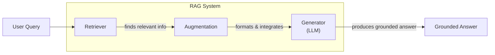
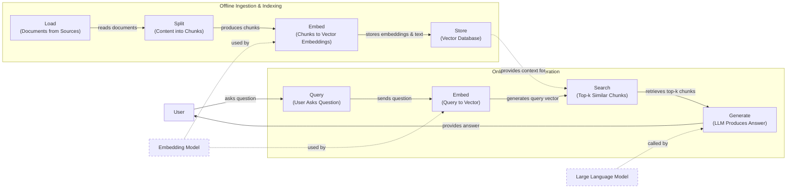
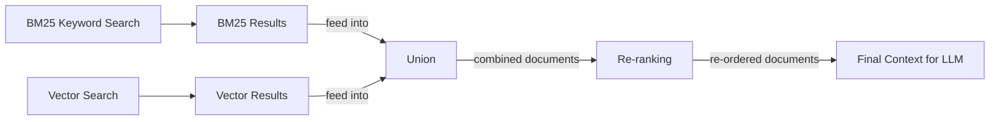
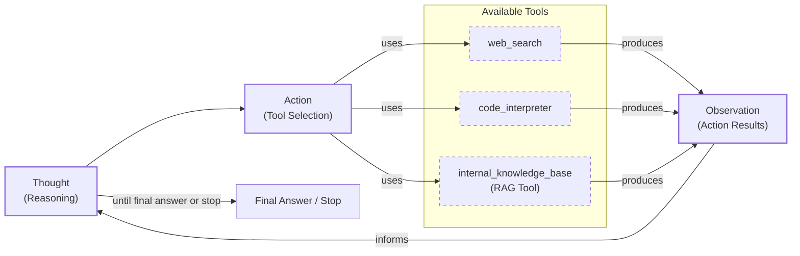

# Retrieval-Augmented Generation: Giving LLMs an Open-Book Exam

In our previous lessons, we explored the landscape of AI engineering, distinguished between LLM workflows and agents, and introduced context engineering as the art of managing information flow to an LLM. We have seen how to get structured data out of models, give them tools to act, and even build agents that can reason through problems using the ReAct framework.

A core problem we have yet to solve is that LLMs are trained on a fixed dataset. Their knowledge is static, which makes them prone to hallucination when asked about recent events or private data [[1]](https://blogs.nvidia.com/blog/what-is-retrieval-augmented-generation/). During their training, they are essentially taking a "closed-book exam" on the world's information. We do not yet have efficient techniques to enable models to learn new information over time after they are deployed. While fine-tuning is an option, it is slow, expensive, and not a practical way to keep a model's knowledge current [[34]](https://neo4j.com/blog/developer/fine-tuning-vs-rag/). Fine-tuning requires massive datasets and significant computational resources, making it impractical for incorporating real-time updates.

This is where Retrieval-Augmented Generation (RAG) provides a reliable solution. Instead of trying to force new knowledge into the model's weights, we give it an "open-book exam" by connecting it to external, real-time knowledge sources. Just as humans do not need to memorize everything and can rely on manuals or notes, an LLM can use RAG to access the information it needs, when it needs it. This approach shifts the problem from model maintenance to data management, which is a more scalable and cost-effective strategy [[34]](https://neo4j.com/blog/developer/fine-tuning-vs-rag/).

RAG is a key method AI engineers use in the process of context engineering, which we covered in Lesson 3. It is the mechanism that allows us to curate the external knowledge an LLM sees. In this lesson, we will explore the fundamentals of RAG, starting with its basic components and moving toward the advanced and agentic patterns that power modern AI systems. We will explore how RAG transforms agents from relying on static knowledge to reasoning over dynamic, external data. This complements the agent memory systems we will discuss in Lesson 10, where we will cover the short- and long-term memory stores that work alongside RAG.

Our journey will take us from the "what" and "how" of basic RAG to the advanced techniques that make it production-ready. With the problem and motivation clear, we will first decompose RAG into its core components so you can see where each responsibility lives.

## The RAG System: Core Components

Understanding the components of a RAG system is the first step in the context engineering process of designing effective AI applications. At its core, RAG can be broken down into three conceptual pillars that work together to ground an LLM's response in external data.

Image 1: Flowchart illustrating the core components and data flow of a Retrieval Augmented Generation (RAG) system.

**Retrieval:** This is the engine responsible for finding relevant information from a knowledge base in response to a user's query. The most common approach is semantic similarity search, which relies on vector embeddings. An embedding model converts text into a numerical vector that captures its meaning. These vectors are stored in a specialized vector database. When a user asks a question, it is also converted into a vector, and the database finds the text chunks whose vectors are closest, or most semantically similar, to the query vector [[23]](https://apxml.com/courses/prompt-engineering-llm-application-development/chapter-6-integrating-llms-external-data-rag/implementing-semantic-search-retrieval). An alternative is keyword-based search, using algorithms like BM25, which excels at finding exact matches for specific terms [[17]](https://mlpills.substack.com/p/issue-76-optimize-rag-with-hybrid).

Vector embeddings are the heart of modern semantic search. They are created by passing text through a deep learning model, like a transformer, which converts the text into a dense array of numbers. Each number in this vector represents a different semantic feature of the text. Chunks of text with similar meanings will have vectors that are close to each other in this high-dimensional space. These vectors are then stored in a vector database, which is specifically designed to perform fast similarity searches using distance metrics like cosine similarity or Euclidean distance [[24]](https://medium.com/@robi.tomar72/how-rag-actually-works-embeddings-vector-databases-indexing-retrieval-explained-simply-3d1ca45fe1bf).

**Augmentation:** This is the process of taking the information found by the retriever and integrating it into the prompt that will be sent to the LLM. The retrieved text chunks are added as context, along with the original user query and instructions for the model. The goal is to create a comprehensive prompt that gives the LLM all the necessary information to generate a grounded and accurate answer [[26]](https://www.topquadrant.com/resources/blog-retrieval-augmented-generation-explained/).

**Generation:** This is the final step where the LLM uses the augmented prompt to produce an answer. Instead of relying solely on its pre-trained knowledge, the model is instructed to synthesize a response based on the provided context. This grounds the answer in the external data, reducing the risk of hallucinations and allowing the model to cite its sources, which builds user trust [[1]](https://blogs.nvidia.com/blog/what-is-retrieval-augmented-generation/).

These three components form the foundation of any RAG system. Now that you can name each moving part, let’s see how they line up across the two phases of a real system.

## The RAG Pipeline: Ingestion and Retrieval

A complete RAG system operates in two distinct phases: an offline ingestion pipeline that prepares the knowledge base, and an online retrieval pipeline that answers user queries in real-time. This separation allows the computationally intensive work of processing documents to happen once, upfront, enabling fast and efficient retrieval at query time [[16]](https://newsletter.systemdesign.one/p/how-rag-works).

Image 2: A detailed flowchart depicting the end-to-end RAG pipeline, split into two main phases: Offline Ingestion & Indexing and Online Retrieval & Generation.

### Phase 1: Offline Ingestion & Indexing

The ingestion phase is where you build your searchable knowledge base. This process is typically run as a batch or streaming pipeline and involves several steps to transform raw documents into an indexed format [[3]](https://decodingml.substack.com/p/rag-fundamentals-first?utm_source=publication-search).

1.  **Load:** The first step is to load your documents from their sources. These can be PDFs, web pages, database records, or any other text-based content. Tools like Unstructured are excellent for handling various file formats, while libraries like LangChain and LlamaIndex provide a wide range of document loaders to handle different data sources [[15]](https://medium.com/@derrickryangiggs/rag-pipeline-deep-dive-ingestion-chunking-embedding-and-vector-search-abd3c8bfc177).
2.  **Split:** Since LLMs have limited context windows, large documents must be broken down into smaller, manageable chunks. This is a critical step, as the quality of the chunks directly impacts retrieval accuracy. Chunking can be done based on fixed lengths, sentences, or paragraphs. More advanced semantic chunking methods use embeddings to split text based on shifts in meaning, ensuring that related sentences stay together. Common tools for this include LangChain's `RecursiveCharacterTextSplitter` or LlamaIndex's `SemanticSplitter` [[15]](https://medium.com/@derrickryangiggs/rag-pipeline-deep-dive-ingestion-chunking-embedding-and-vector-search-abd3c8bfc177).
3.  **Embed:** Each chunk is then passed through an embedding model, which converts the text into a high-dimensional vector. This vector is a numerical representation that captures the semantic meaning of the text. Popular embedding models include OpenAI's `text-embedding-3-large` and `small`, Google's `gemini-text-embedding-004`, Cohere's Embed models, Voyage AI's models, and open-source variants like BGE available via Hugging Face [[15]](https://medium.com/@derrickryangiggs/rag-pipeline-deep-dive-ingestion-chunking-embedding-and-vector-search-abd3c8bfc177).
4.  **Store:** Finally, the embeddings and their corresponding text chunks are stored in a vector database. This database is optimized for fast similarity searches, allowing the system to quickly find the most relevant chunks for a given query. Examples include local libraries like FAISS, or production-grade databases like Milvus, Qdrant, Pinecone, and vector-enabled search indexes like Elasticsearch or Azure AI Search [[24]](https://medium.com/@robi.tomar72/how-rag-actually-works-embeddings-vector-databases-indexing-retrieval-explained-simply-3d1ca45fe1bf).

### Phase 2: Online Retrieval & Generation

The retrieval phase happens in real-time when a user interacts with the system.

1.  **Query:** The user asks a question in natural language. This query can be pre-processed to normalize it or expand it for better matching. Frameworks like LangChain and LlamaIndex offer components like the `Runnable` chain or `QueryEngine` to manage this process.
2.  **Embed:** The user's query is converted into a vector using the same embedding model that was used during the ingestion phase. This ensures that the query and the document chunks are in the same vector space, making them comparable [[8]](https://qdrant.tech/articles/what-is-rag-in-ai/).
3.  **Search:** The system uses the query vector to search the vector database. It calculates the similarity (often using cosine similarity with FAISS or other approximate nearest neighbor algorithms in databases like Pinecone) between the query vector and all the chunk vectors, returning the top-k most similar chunks [[25]](https://towardsdatascience.com/rag-explained-understanding-embeddings-similarity-and-retrieval/).
4.  **Generate:** The retrieved chunks are combined with the original query and a set of instructions into a single prompt. This augmented prompt is then sent to an LLM, which generates a final answer grounded in the provided context. As we learned in Lesson 4, using structured outputs can help format this answer and include citations back to the source documents [[3]](https://decodingml.substack.com/p/rag-fundamentals-first?utm_source=publication-search).

With the end-to-end path in place, the next question is quality: what are the advanced techniques to make retrieval more accurate and useful across messy, real-world data?

## Advanced RAG Techniques

A naive RAG pipeline often performs well in demos but can break down in production when faced with complex queries and diverse document types. To build a robust system, AI engineers employ a range of advanced techniques to improve retrieval quality and relevance.

### Hybrid Search

This technique combines the strengths of traditional keyword-based search (like BM25) with modern semantic vector search. Keyword search is precise and excels at finding documents with specific terms, acronyms, or IDs. Vector search is better at understanding meaning and finding conceptually related documents, even if they do not share the same keywords [[18]](https://cubitrek.com/blog/hybrid-search-optimization-how-bm25-and-dense-vector-retrieval-work-together-for-superior-ai-search/).

For example, in a customer support scenario, a user might ask, "my bill keeps rolling over." A keyword search would find articles containing the exact term "rollover." A semantic search could also surface guides about "carryover balance," capturing a different wording of the same issue. By fusing the results of both searches, often using a method called Reciprocal Rank Fusion (RRF), the system provides a more comprehensive set of documents to the LLM [[17]](https://mlpills.substack.com/p/issue-76-optimize-rag-with-hybrid). This ensures that both literal and conceptual matches are considered, leading to higher recall and more relevant answers.

Image 3: A flowchart illustrating the hybrid retrieval flow, starting with parallel BM25 and Vector searches, followed by union, re-ranking, and final context generation.

### Re-ranking

Initial retrieval, whether keyword, vector, or hybrid, is optimized for speed and recall, meaning it aims to quickly find a broad set of potentially relevant documents. However, the best document might not always be at the top of this initial list. Re-ranking introduces a second, more sophisticated model to re-order these candidates for better precision [[19]](https://redis.io/blog/10-techniques-to-improve-rag-accuracy/).

This is typically done with a cross-encoder model, such as those provided by Cohere. Unlike the bi-encoder used for initial retrieval (which creates separate embeddings for the query and documents), a cross-encoder processes the query and a candidate document together. This allows for a deeper, token-by-token interaction, resulting in a more accurate relevance score. Because this is computationally expensive, it is only applied to a small set of top candidates (e.g., the top 50) from the first retrieval stage [[20]](https://apxml.com/courses/optimizing-rag-for-production/chapter-2-advanced-retrieval-optimization/reranking-architectures-rag). For a product help query like "how to connect my account," a re-ranker can push a step-by-step setup guide to the top, above a less relevant press release or community forum thread.

### Query Transformations

Sometimes, the user's original query is not the best one for retrieval. Query transformation techniques rewrite or decompose the query to improve its chances of matching the right documents.

**Decomposition** breaks a complex, multi-faceted question into several simpler sub-questions. For example, "What’s our travel policy for conferences in Europe this year?" could be broken down into: (1) "Where is the travel policy?", (2) "What are the rules for conferences in Europe?", and (3) "What changed in the policy this year?". The system retrieves documents for each sub-question and then synthesizes the answers [[13]](https://docs.nvidia.com/rag/latest/query_decomposition.html).

**Hypothetical Document Embeddings (HyDE)** is another approach where the system first generates a short, hypothetical answer to the user's query. It then embeds this ideal answer and uses that vector for the search. The idea is that this hypothetical document is more likely to be semantically similar to the actual answer document than the original, often brief, query [[14]](https://neo4j.com/blog/genai/advanced-rag-techniques/). For instance, before searching, the system might draft an answer like, "Employees can book economy flights and up to three hotel nights," and then search for documents that sound like that.

### Advanced Chunking Strategies

How you split documents has a huge impact on retrieval quality. Fixed-size chunking is simple but can awkwardly cut off sentences or separate related ideas. For example, splitting a 20-page handbook every 500 words might cut the "Reimbursements" section in half, separating a policy from its spending limits.

**Semantic chunking** addresses this by splitting text at points where the topic changes, keeping related sentences together. This ensures that retrieved chunks are more coherent. **Layout-aware chunking** is crucial for complex documents like PDFs with tables or forms. Instead of treating the document as a flat text file, it preserves the structure, keeping table rows intact so that a product name is not separated from its price [[10]](https://learn.microsoft.com/en-us/azure/developer/ai/advanced-retrieval-augmented-generation). **Context-enriched chunking** adds summary or metadata to each chunk, providing more context to the embedding model and improving retrieval accuracy [[6]](https://www.anthropic.com/news/contextual-retrieval).

### GraphRAG

For questions about complex relationships and interconnected data, standard document retrieval can fall short. GraphRAG addresses this by first extracting entities and relationships from documents and building a knowledge graph. This structured representation allows the system to answer multi-hop questions that require traversing connections between different pieces of information [[21]](https://atlan.com/know/what-is-graphrag/).

The use of knowledge graphs for information retrieval is not new; it builds on decades of work from the semantic web, with notable predecessors like DBpedia and Google's Knowledge Graph [[27]](https://www.semantic-web-journal.net/system/files/swj3862.pdf). The main trade-off has always been the high upfront investment required to design a schema and extract entities, compared to the faster deployment of standard RAG with unstructured documents. However, modern hybrid approaches aim to unify graph infrastructure with semantic search to get the best of both worlds [[28]](https://atlan.com/know/knowledge-graphs-vs-rag-for-ai/).

Advanced GraphRAG systems are also becoming more dynamic. Instead of relying on a static graph, some approaches use the LLM agent itself to incrementally update the graph with new entities and relationships as it processes new information, keeping the knowledge base current [[29]](https://arxiv.org/html/2506.18019v1).

For example, a retail company might ask, "Which shoes get the most size-related returns and were featured in last month’s ads?" A GraphRAG system can traverse the graph from "returns" to "reason: sizing," link to specific shoe SKUs, and then connect those SKUs to the marketing calendar to find the answer. Similarly, for IT operations, a query like "Which incidents were caused by weekend deploys that also touched the login service?" can be answered by following connections between change records, deployment times, affected services, and incident tickets [[22]](https://arxiv.org/html/2501.00309v2).

These techniques increase retrieval quality. Next, we will see how retrieval becomes one tool that an agent can choose to use as it reasons.

## Agentic RAG

In Lessons 7 and 8, we introduced the ReAct framework, where an agent cycles through a loop of Thought, Action, and Observation to solve problems. Agentic RAG is the application of this principle, where retrieval is not a fixed step in a pipeline but a tool that a reasoning agent can choose to use. The agent can decide *when* to retrieve, *what* to retrieve, and *how* to use the retrieved information [[11]](https://towardsdatascience.com/agentic-rag-vs-classic-rag-from-a-pipeline-to-a-control-loop/).

It is important to clarify that agents typically have access to many tools, such as web search, code execution, or database queries. Labeling an entire system "agentic RAG" can be too narrow; the retrieval function is just one of several tools in the agent's toolkit [[7]](https://weaviate.io/blog/what-is-agentic-rag).

The core distinction lies in the control flow. Standard RAG is a linear, pre-determined workflow: Retrieve → Augment → Generate. Agentic RAG is adaptive and iterative. The agent is in control, deciding whether to retrieve information, reformulate a query, search a different source, or chain multiple retrieval and reasoning steps together [[12]](https://www.pingcap.com/article/agentic-rag-vs-traditional-rag-key-differences-benefits/).

This agentic approach unlocks several new capabilities:
- **Iterative Refinement:** The agent can use the RAG tool multiple times. If an initial search for a policy document yields a vague result, the agent can reason that it needs more specific information, refine its query to "EU customers, 2024 updates," and retrieve again.
- **Tool Selection:** The agent can choose which knowledge base to search. For an IT outage inquiry, it might intelligently select `search_incident_runbooks` over `search_marketing_pages`.
- **Information Fusion:** The agent can combine information from its RAG tool with outputs from other tools. For instance, it might retrieve an internal policy, then call a web search tool to check for recent regulatory changes, and finally synthesize a comprehensive answer.
- **Knowledge Base Updates:** The agent can decide to update the RAG system's knowledge base with new information it learns. This is a preview of what we will cover in Lesson 10 on Memory for Agents.

This transforms the interaction from a simple database lookup into a conversation with a knowledgeable research assistant.

Image 4: A conceptual flowchart showing an agent's main loop in an Agentic RAG system.

You now understand both a linear RAG pipeline and how an agent can control retrieval when needed. Let’s wrap up by situating RAG in the wider AI Engineering toolkit and previewing what comes next.

## Conclusion

We have journeyed from the basic principles of RAG to the sophisticated, agent-driven systems that represent the future of information retrieval. The key takeaway is that RAG is the most widely used solution to the LLM knowledge problem. It reduces hallucinations, enables customization with proprietary data, and builds user trust through verifiable, source-based answers. For production-grade quality, advanced techniques like hybrid search and re-ranking are essential.

Ultimately, the future of knowledge retrieval is agentic, where RAG is not just a pipeline but a dynamic tool in an intelligent agent's toolkit. This positions RAG as a foundational competency for the modern AI Engineer and a core component of context engineering.

In our next lesson, we will explore Memory for Agents, and see how short- and long-term memory systems complement the retrieval capabilities we have discussed here. Further on in the course, we will also cover monitoring and evaluation. Evaluating agentic systems is one of the field’s most underdeveloped areas. Traditional metrics like F1 or BLEU fail to capture the quality of multi-step reasoning or tool use. The key question is not just "Was the final answer correct?" but "Did the agent take the right steps to get there?" [[32]](https://toloka.ai/blog/agentic-rag-systems-for-enterprise-scale-information-retrieval/). This has led to new patterns like using a powerful LLM as a judge to assess faithfulness and precision, which we will explore in detail later [[33]](https://aiamastery.substack.com/p/lesson-44-evaluating-agentic-rag).

## References

- [1] [What Is Retrieval-Augmented Generation, aka RAG?](https://blogs.nvidia.com/blog/what-is-retrieval-augmented-generation/)
- [2] [A Complete Guide to RAG](https://towardsai.net/p/l/a-complete-guide-to-rag)
- [3] [Retrieval-Augmented Generation (RAG) Fundamentals First](https://decodingml.substack.com/p/rag-fundamentals-first?utm_source=publication-search)
- [4] [Your RAG is wrong: Here's how to fix it](https://decodingml.substack.com/p/your-rag-is-wrong-heres-how-to-fix?utm_source=publication-search)
- [5] [From Local to Global: A GraphRAG Approach to Query-Focused Summarization](https://arxiv.org/html/2404.16130)
- [6] [Introducing Contextual Retrieval](https://www.anthropic.com/news/contextual-retrieval)
- [7] [What is Agentic RAG](https://weaviate.io/blog/what-is-agentic-rag)
- [8] [What is RAG: Understanding Retrieval-Augmented Generation](https://qdrant.tech/articles/what-is-rag-in-ai/)
- [9] [What is agentic RAG?](https://www.ibm.com/think/topics/agentic-rag)
- [10] [Build advanced retrieval-augmented generation systems](https://learn.microsoft.com/en-us/azure/developer/ai/advanced-retrieval-augmented-generation)
- [11] [Agentic RAG vs Classic RAG: From a Pipeline to a Control Loop](https://towardsdatascience.com/agentic-rag-vs-classic-rag-from-a-pipeline-to-a-control-loop/)
- [12] [Agentic RAG vs. Traditional RAG: Key Differences and Benefits](https://www.pingcap.com/article/agentic-rag-vs-traditional-rag-key-differences-benefits/)
- [13] [Query Decomposition](https://docs.nvidia.com/rag/latest/query_decomposition.html)
- [14] [Advanced RAG Techniques for High-Performance LLM Applications](https://neo4j.com/blog/genai/advanced-rag-techniques/)
- [15] [RAG Pipeline Deep Dive: Ingestion, Chunking, Embedding, and Vector Search](https://medium.com/@derrickryangiggs/rag-pipeline-deep-dive-ingestion-chunking-embedding-and-vector-search-abd3c8bfc177)
- [16] [How RAG Works](https://newsletter.systemdesign.one/p/how-rag-works)
- [17] [Optimize RAG with Hybrid Search](https://mlpills.substack.com/p/issue-76-optimize-rag-with-hybrid)
- [18] [Hybrid Search Optimization: How BM25 and Dense Vector Retrieval Work Together for Superior AI Search](https://cubitrek.com/blog/hybrid-search-optimization-how-bm25-and-dense-vector-retrieval-work-together-for-superior-ai-search/)
- [19] [10 Techniques to Improve RAG Accuracy](https://redis.io/blog/10-techniques-to-improve-rag-accuracy/)
- [20] [Reranking Architectures in RAG](https://apxml.com/courses/optimizing-rag-for-production/chapter-2-advanced-retrieval-optimization/reranking-architectures-rag)
- [21] [What is GraphRAG?](https://atlan.com/know/what-is-graphrag/)
- [22] [Graph-based Retrieval-Augmented Generation for Multi-hop Question Answering](https://arxiv.org/html/2501.00309v2)
- [23] [Implementing Semantic Search for Retrieval](https://apxml.com/courses/prompt-engineering-llm-application-development/chapter-6-integrating-llms-external-data-rag/implementing-semantic-search-retrieval)
- [24] [How RAG Actually Works: Embeddings, Vector Databases, Indexing & Retrieval Explained Simply](https://medium.com/@robi.tomar72/how-rag-actually-works-embeddings-vector-databases-indexing-retrieval-explained-simply-3d1ca45fe1bf)
- [25] [RAG Explained: Understanding Embeddings, Similarity and Retrieval](https://towardsdatascience.com/rag-explained-understanding-embeddings-similarity-and-retrieval/)
- [26] [Retrieval-Augmented Generation Explained](https://www.topquadrant.com/resources/blog-retrieval-augmented-generation-explained/)
- [27] [The Semantic Web: A Retrospective and Look Ahead](https://www.semantic-web-journal.net/system/files/swj3862.pdf)
- [28] [Knowledge Graphs vs. RAG for AI](https://atlan.com/know/knowledge-graphs-vs-rag-for-ai/)
- [29] [Graph-based Memory for AI Agents](https://arxiv.org/html/2506.18019v1)
- [30] [Agentic RAG: How enterprises are surmounting the limits of traditional RAG](https://redis.io/blog/agentic-rag-how-enterprises-are-surmounting-the-limits-of-traditional-rag/)
- [31] [Agentic Retrieval: Improving RAG with intelligent agents](https://www.algolia.com/blog/ai/agentic-retrieval)
- [32] [Agentic RAG Systems for Enterprise-Scale Information Retrieval](https://toloka.ai/blog/agentic-rag-systems-for-enterprise-scale-information-retrieval/)
- [33] [Evaluating Agentic RAG](https://aiamastery.substack.com/p/lesson-44-evaluating-agentic-rag)
- [34] [Knowledge Graphs and LLMs: Fine-Tuning vs. Retrieval-Augmented Generation](https://neo4j.com/blog/developer/fine-tuning-vs-rag/)