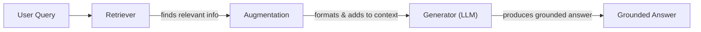
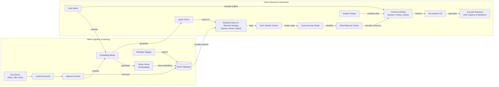
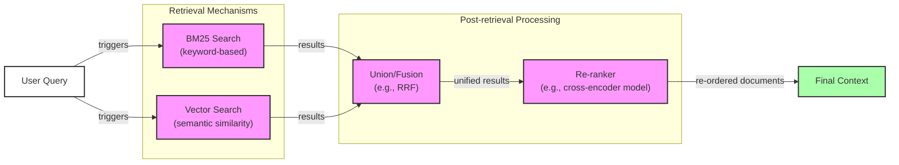
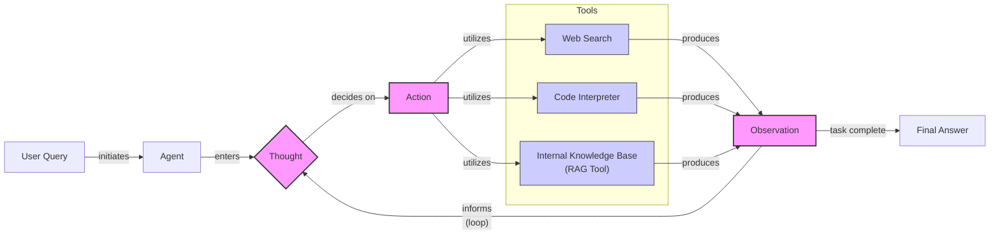

# Lesson 9: Retrieval-Augmented Generation (RAG)

## Introduction

In our previous lessons, we built a solid foundation in AI Engineering. We explored the agent landscape, distinguished between LLM workflows and agents, and dove into context engineering. You learned how to get structured data out of LLMs and how to give them tools to perform actions. We even built a reasoning agent from scratch using the ReAct framework. Now, we will tackle one of the most important challenges in building intelligent systems: knowledge.

LLMs are trained on a fixed dataset, which means their knowledge is frozen in time. They are essentially taking a "closed-book exam" on the world's information. If you ask a model about an event that happened after its training cutoff, it simply does not know the answer. This limitation leads to factual inaccuracies and "hallucinations," where the model generates plausible but incorrect information. While we can fine-tune models to inject new knowledge, this process is slow, expensive, and creates yet another static snapshot of data. It is not an efficient way for a model to learn and adapt over time, especially when dealing with information that changes frequently [[1]](https://neo4j.com/blog/developer/fine-tuning-vs-rag/).

This is where Retrieval-Augmented Generation (RAG) comes in. RAG is a powerful technique that gives your LLM an "open-book exam." Instead of relying solely on its memorized knowledge, the model can access external, up-to-date information sources at the moment it needs to answer a question. This is similar to how we, as humans, operate. We do not memorize everything; we use manuals, notes, and search engines to find the information we need. RAG allows an LLM to reference a vast, curated library in real-time, ensuring its responses are grounded in factual, verifiable data [[2]](https://highlearningrate.substack.com/p/the-rise-of-rag). By providing the LLM with accurate and relevant information, we improve its ability to generate helpful responses, leveraging its language capabilities without depending on its flawed memory.

In Lesson 3, we introduced Context Engineering as the discipline of managing the information flow to an LLM. RAG is a cornerstone of that discipline. It is the mechanism we use to pull precise, relevant data from vast knowledge bases into the model's context window. This approach directly addresses the core limitations of LLMs, making them more reliable and trustworthy for real-world applications. While RAG provides access to external knowledge, it is distinct from an agent's internal memory. We will contrast retrieval with agent memory in Lesson 10, where we discuss the short- and long-term memory systems that complement RAG.

In this lesson, we will explore the what and how of RAG, from its basic architecture to the advanced and agentic patterns that power modern AI applications. You will learn how to design and implement RAG pipelines, understand the trade-offs of different techniques, and see how retrieval becomes a fundamental tool for intelligent agents.

With the problem and motivation clear, we will first decompose RAG into its core components so you can see where each responsibility lives.

## The RAG System: Core Components

To design effective RAG systems, you first need to understand their fundamental building blocks. As part of the context engineering process we discussed in Lesson 3, every RAG system is built on three conceptual pillars: Retrieval, Augmentation, and Generation. Understanding the role of each is the first step toward building reliable, knowledge-grounded AI applications.

Image 1: A flowchart illustrating the conceptual pillars of a RAG system.

**Retrieval** is the engine that finds relevant information. When a user asks a question, the retrieval system searches an external knowledge base to locate the most relevant pieces of data. This can be done using keyword-based search methods like BM25, which are fast and effective for finding exact terms. However, the dominant approach is semantic search, which relies on vector embeddings. An embedding is a numerical representation of a piece of text that captures its semantic meaning. During ingestion, documents are split into chunks, and each chunk is converted into an embedding by a specialized model. These embeddings are stored in a vector database, which is optimized for fast similarity searches [[3]](https://decodingml.substack.com/p/rag-fundamentals-first?utm_source=publication-search). When a query comes in, it is also converted into an embedding, and the database finds the document chunks whose embeddings are closest in the vector space, meaning they are the most semantically similar [[51]](https://apxml.com/courses/prompt-engineering-llm-application-development/chapter-6-integrating-llms-external-data-rag/implementing-semantic-search-retrieval).

**Augmentation** is the process of taking the retrieved information and preparing it for the LLM. Once the top-ranking document chunks are identified, they are combined with the original user query and a set of instructions into a single prompt. This "augmented" prompt provides the LLM with the necessary context to formulate an accurate answer. The goal is to present the information in a clear and structured way, ensuring the model can easily distinguish between the user's question and the supporting evidence. A well-engineered prompt instructs the model to give weight to the retrieved context, handle potential conflicts, and respect constraints, such as not inventing information beyond what is provided [[56]](https://www.topquadrant.com/resources/blog-retrieval-augmented-generation-explained/).

**Generation** is the final step, where the LLM produces an answer. The model receives the augmented prompt and uses the provided context as its source of truth. Instead of relying on its internal, parameterized knowledge, the LLM synthesizes an answer based on the retrieved documents. This grounds the response in verifiable facts, drastically reducing the risk of hallucination and allowing the system to cite its sources [[4]](https://decodingml.substack.com/p/your-rag-is-wrong-heres-how-to-fix?utm_source=publication-search), [[21]](https://medium.com/@fahey_james/retrieval-augmented-generation-building-grounded-ai-for-enterprise-knowledge-6bc46277fee5). This transparency is essential for building user trust, as claims can be traced back to their origin.

Now that you can name each moving part, we will see how they line up across the two phases of a real system.

## The RAG Pipeline: Ingestion and Retrieval

A production-grade RAG system operates in two distinct phases: an offline ingestion pipeline that prepares the data and an online retrieval pipeline that answers user queries in real-time. Understanding this separation is key to building and maintaining a scalable and effective system.

Image 2: A detailed flowchart illustrating the two distinct phases of a RAG pipeline: 'Offline Ingestion & Indexing' and 'Online Retrieval & Generation'.

### Phase 1: Offline Ingestion and Indexing

This phase is all about preparing your knowledge base. It runs in the background, either on a schedule or triggered by data changes, and does not involve the end-user [[32]](https://newsletter.systemdesign.one/p/how-rag-works). The goal is to create a searchable index of your information that the online system can query quickly and efficiently.

1.  **Load:** The process begins by loading documents from various sources. These can be anything from PDFs and web pages to databases and APIs. Frameworks like LangChain and LlamaIndex provide a wide array of document loaders, such as `Unstructured`, to handle different data formats.
2.  **Split:** Once loaded, the documents are broken down into smaller, semantically meaningful chunks. This is an important step; poor chunking can lead to fragmented context and irrelevant retrieval. Strategies range from simple fixed-size splits using tools like LangChain's `RecursiveCharacterTextSplitter` to more advanced methods like LlamaIndex's `SemanticSplitter` that respect paragraph or sentence boundaries.
3.  **Embed:** Each chunk is then passed through an embedding model. Popular choices include proprietary models like OpenAI’s `text-embedding-3-large`, Google's `text-embedding-004`, and Cohere's `Embed`, as well as high-performing open-source alternatives like BGE variants available on Hugging Face. This model converts the text into a dense vector, a numerical representation that captures its meaning.
4.  **Store:** Finally, these embeddings, along with the original text and any relevant metadata (like source document, date, or topic), are loaded into a vector database. For local development, a library like FAISS is common. For production, scalable solutions like Milvus, Qdrant, Pinecone, or vector-enabled databases like Elasticsearch and Azure AI Search are used. This database allows for efficient similarity search at query time.

### Phase 2: Online Retrieval and Generation

This is the real-time part of the pipeline that responds to a user's request [[31]](https://medium.com/@derrickryangiggs/rag-pipeline-deep-dive-ingestion-chunking-embedding-and-vector-search-abd3c8bfc177). It needs to be fast, accurate, and reliable.

1.  **Query:** A user asks a question. This query can be pre-processed to normalize it or expand it for better results, often managed by a query engine like those in LangChain or LlamaIndex.
2.  **Embed:** The user's query is converted into a vector using the *same* embedding model that was used during the ingestion phase. It is important to ensure that the query and the documents exist in the same vector space, making their comparison meaningful.
3.  **Search:** The system uses the query vector to search the vector database. It calculates the similarity (often using cosine similarity with FAISS or k-Nearest Neighbor algorithms in Elasticsearch) between the query vector and all the document chunk vectors in the database, retrieving the top-k most similar chunks. This search can be enhanced with metadata filters, a feature supported by databases like Pinecone.
4.  **Generate:** The retrieved chunks are assembled into a prompt along with the original query and instructions for the LLM. The LLM then generates a response grounded in this context. To ensure reliability, we can use the structured output techniques you learned in Lesson 4 to format the final answer and include citations back to the source documents.

With the end-to-end path in place, the next question is quality. We need to explore advanced techniques to make retrieval more accurate and useful across messy, real-world data.

## Advanced RAG Techniques

The vanilla RAG pipeline is a great starting point, but production systems often require more sophisticated techniques to achieve high accuracy. Poor retrieval quality is the most common failure point in RAG systems, leading directly to irrelevant or incomplete answers. Getting this part right is what separates a flashy demo from a reliable application. Here are some advanced strategies AI engineers use to optimize retrieval performance across the entire pipeline.

### Hybrid Search

This technique combines traditional keyword-based search with modern vector search. A popular keyword-based algorithm is Best Matching 25 (BM25), which excels at finding exact matches for specific terms, acronyms, or IDs. Vector search, on the other hand, is better at understanding the semantic meaning or intent behind a query [[36]](https://pr-peri.github.io/blogpost/2026/03/05/blogpost-hybrid-search.html).

For example, in a customer support scenario, a user might write, "my bill keeps rolling over." A keyword search will find articles with the exact term "rollover." A vector search might also surface documents about a "carryover balance," capturing the user's intent even with different wording.

By fusing the results from both methods, often using an algorithm like Reciprocal Rank Fusion (RRF), you get the best of both worlds: precision and semantic understanding [[38]](https://mlpills.substack.com/p/issue-76-optimize-rag-with-hybrid). RRF is effective because it operates on rank positions, not raw scores, which are often on completely different and incomparable scales. The formula, commonly expressed as `Σ 1 / (k + rank)`, gives more weight to items that appear at the top of multiple lists. The constant `k` (typically 60) prevents a single high-ranking result from dominating and provides a smoother, more gradual decline in scores for lower-ranked items [[62]](https://medium.com/@devalshah1619/mathematical-intuition-behind-reciprocal-rank-fusion-rrf-explained-in-2-mins-002df0cc5e2a).

Image 3: A flowchart illustrating the Hybrid Retrieval Flow within advanced RAG techniques.

### Re-ranking

Initial retrieval is optimized for speed and recall, casting a wide net to find potentially relevant documents. However, the top results are not always the most relevant. Re-ranking introduces a second, more precise model to re-order this initial set of candidates. Cross-encoder models are commonly used for this task. Unlike standard (bi-encoder) embedding models that create vectors for the query and documents independently, a cross-encoder takes the query and a candidate document *together* as a single input [[45]](https://towardsdatascience.com/advanced-rag-retrieval-cross-encoders-reranking/). This allows for deeper interaction between their tokens, resulting in a much more accurate relevance score. Because this is computationally expensive, it is only applied to a small number of top candidates (e.g., the top 50) from the initial retrieval stage [[43]](https://apxml.com/courses/optimizing-rag-for-production/chapter-2-advanced-retrieval-optimization/reranking-architectures-rag). For a product help query like "how to connect my account," the re-ranker would push the step-by-step setup guide above a press release and a community thread that are less directly actionable.

### Query Transformations

Sometimes, the user's original query is not the best one for retrieval. Query transformation techniques modify the query to improve its chances of matching the right documents.

-   **Decomposition:** This method breaks down a complex, multi-part question into several simpler sub-queries. For example, the query "What’s our travel policy for conferences in Europe this year?" could be decomposed into: (1) "Where is the travel policy located?", (2) "What are the rules for conferences?", (3) "Are there specific rules for Europe?", and (4) "What has changed this year?". The system retrieves documents for each sub-query and then synthesizes the results to form a comprehensive answer [[19]](https://docs.nvidia.com/rag/latest/query_decomposition.html).
-   **Hypothetical Document Embeddings (HyDE):** This technique uses an LLM to generate a hypothetical, ideal answer to the user's query *before* searching. For the travel policy question, the system might generate a short text like: "Employees attending approved conferences in Europe can book economy flights and up to three hotel nights with daily meal limits." This hypothetical document is then converted to an embedding and used for the similarity search. The idea is that this generated answer is often semantically closer to the actual answer document than the original, often shorter, query [[16]](https://47billion.com/blog/rag-system-in-production-why-it-fails-and-how-to-fix-it/).

### Advanced Chunking Strategies

How you split your documents into chunks has a massive impact on retrieval quality. Moving beyond simple fixed-size chunking is one of the highest-leverage improvements you can make.

-   **Semantic Chunking:** Instead of splitting by a fixed number of tokens, this method groups semantically related sentences together. It uses embeddings to measure the distance between consecutive sentences and creates a new chunk when the topic shifts [[17]](https://sarthakai.substack.com/p/improve-your-rag-accuracy-with-a). For example, when processing a 20-page handbook, this ensures that the entire "Reimbursements" section stays together, rather than being split in the middle of explaining spending limits.
-   **Layout-Aware Chunking:** For documents with rich formatting like PDFs, this strategy uses the document's visual structure—headers, tables, lists—to guide the chunking process. It prevents a table from being split from its title or a list item from its introductory sentence, preserving the original context [[10]](https://learn.microsoft.com/en-us/azure/developer/ai/advanced-retrieval-augmented-generation). For a pricing table, this means keeping each row (product, price, discount) intact instead of slicing the page by character count and separating numbers from their labels.

However, these advanced strategies are not a silver bullet, especially in enterprise settings. Documents are often messy, containing tables, code blocks, or two-column layouts from scanned PDFs. Standard sentence-based or semantic splitters can fail silently on this content, for example, by flattening a table's rows and columns into meaningless text, severing values from their headers [[69]](https://towardsdatascience.com/your-chunks-failed-your-rag-in-production/).

### GraphRAG

This approach structures knowledge into a graph instead of a flat list of documents. An LLM extracts entities (like people, companies, or products) and their relationships from the source text to build a knowledge graph. This is particularly powerful for answering multi-hop questions that require connecting information across multiple documents or data points [[46]](https://arxiv.org/html/2601.03014v1). This approach has conceptual roots in Semantic Web research, which uses standards like RDF to model linked data. While standard RAG asks, "Which document mentions X?", GraphRAG asks, "How does X relate to Y?". It shifts the focus from document similarity to entity relationships, enabling more deterministic and explainable retrieval paths [[88]](https://www.puppygraph.com/blog/knowledge-graph-vs-rag).

For example, to answer "Which shoes get the most size-related returns and were featured in last month’s ads?", a GraphRAG system can traverse the graph from returns to reason (sizing) to specific SKUs to the marketing calendar, assembling a chain of evidence. Similarly, for an IT operations query like "Which incidents were caused by weekend deploys that also touched the login service?", it can link change records to deploy times, affected services, and incident tickets [[50]](https://arxiv.org/html/2501.00309v2). While powerful, GraphRAG introduces significant computational complexity. The process of extracting entities and relationships from millions of documents can be prohibitively expensive. Furthermore, as graphs grow, the number of possible paths between nodes can explode, leading to high query latency without careful pruning and traversal limits. For large-scale industrial graphs with billions of entities, this requires specialized infrastructure and is not a trivial undertaking [[75]](https://dev.to/sreeni5018/from-rag-to-knowledge-graphs-why-the-agent-era-is-redefining-ai-architecture-3fgc).

These techniques increase retrieval quality. Next, we will see how retrieval becomes one tool that an agent can choose to use as it reasons.

## Agentic RAG

In Lessons 7 and 8, we explored ReAct, a framework that enables agents to reason and act. Agentic RAG is the application of this principle to information retrieval. It transforms RAG from a static, linear pipeline into a dynamic, iterative process controlled by an intelligent agent. The agent is equipped with a retrieval tool, but it decides *when*, *what*, and *how* to search based on its reasoning process [[11]](https://towardsdatascience.com/agentic-rag-vs-classic-rag-from-a-pipeline-to-a-control-loop/).

It is important to clarify that agents typically have access to many tools, such as web search, code interpreters, or database APIs. The retrieval tool is just one of many in its toolkit. Therefore, "agentic RAG" refers to an agent that uses a RAG pipeline as one of its available actions.

The core distinction lies in the control flow:
-   **Standard RAG** follows a rigid, predetermined workflow: Retrieve → Augment → Generate. Every query goes through the same steps, regardless of its complexity or the quality of the initial retrieval.
-   **Agentic RAG** is adaptive. The agent can reason about the query, choose the best tool, reformulate the search, or even chain multiple retrieval steps together to gather sufficient evidence before generating an answer [[12]](https://www.pingcap.com/article/agentic-rag-vs-traditional-rag-key-differences-benefits/).

Image 4: A conceptual flowchart illustrating an 'Agent's Main Loop' in an agentic RAG system, showing the iterative Thought-Action-Observation cycle and dynamic tool selection.

This agentic approach unlocks several new capabilities. The agent can iteratively refine its search. It can also choose which knowledge base to query, for instance, selecting `search_incident_runbooks` over `search_marketing_pages` for a technical outage query. This ability to *update* knowledge is what fundamentally separates agentic retrieval from standard RAG. RAG is a read-only system designed for static knowledge; it has no mechanism to overwrite or delete outdated information. An agent with memory, however, can implement a read-write lifecycle. When new information contradicts old, the agent can update its state instead of just accumulating conflicting facts. This prevents "context pollution," where an agent retrieves outdated preferences or instructions simply because they are semantically similar to a query [[78]](https://xtrace.ai/blog/rag-vs-long-term-memory-ai-agents). We will explore the architectures for this, including different memory types, in Lesson 10.

For example, if an initial query for "EU data retention rules" returns an outdated internal policy, the agent can reason about this gap.

-   **Thought:** "User asks about ‘2024 EU data retention rules’—our internal policy cites 2023. This is likely outdated."
-   **Action:** `retrieve(internal_policy, query="EU data retention 2024")`
-   **Observation:** "The retrieved document mentions amendments but is missing official citations."
-   **Thought:** "I need external verification to confirm the latest changes."
-   **Action:** `web_search(query="EU data retention directive 2024 official")`
-   **Observation:** "Found the official directive update from a government source."
-   **Thought:** "Now I can synthesize the information from our internal policy and the external directive, highlighting the changes and citing both sources."

This transforms retrieval from a simple database lookup into a dynamic conversation with a knowledgeable research assistant.

You now understand both a linear RAG pipeline and how an agent can control retrieval when needed. We will now wrap up by situating RAG in the wider AI Engineering toolkit and previewing what comes next.

## Conclusion

We have seen that Retrieval-Augmented Generation is the industry's primary solution to the fundamental knowledge limitations of LLMs. By connecting models to external data sources, it grounds them in factual, up-to-date information, which is the most reliable way we have to reduce hallucinations and build user trust through verifiable answers. For production-grade quality, moving beyond a naive implementation is essential. Advanced techniques like hybrid search, re-ranking, and intelligent chunking are not just options but necessities for achieving high relevance. Ultimately, the future of knowledge retrieval is agentic, where RAG transforms from a rigid pipeline into a dynamic tool that an intelligent agent can choose to use, or ignore, as part of a broader reasoning process.

For the modern AI Engineer, mastering RAG is a foundational competency. It is a core component of Context Engineering, enabling the creation of customized, reliable, and knowledgeable AI systems.

In our next lesson, we will explore Memory for Agents. You will learn how to move beyond read-only retrieval by implementing distinct memory layers: **Semantic Memory** for immutable facts (where RAG is a good fit), **Episodic Memory** for a record of past events, and **Core State** for the active, updatable truth about a user or workflow [[78]](https://xtrace.ai/blog/rag-vs-long-term-memory-ai-agents). This distinction is key to building agents that can truly learn and adapt. We will also touch upon retrieval quality evaluation and production monitoring in future parts of the course.

## References

- [1]  [Knowledge Graphs and LLMs: Fine-Tuning vs. Retrieval-Augmented Generation](https://neo4j.com/blog/developer/fine-tuning-vs-rag/)
- [2]  [The Rise of RAG](https://highlearningrate.substack.com/p/the-rise-of-rag)
- [3]  [Retrieval-Augmented Generation (RAG) Fundamentals First](https://decodingml.substack.com/p/rag-fundamentals-first?utm_source=publication-search)
- [4]  [Your RAG is wrong: Here's how to fix it](https://decodingml.substack.com/p/your-rag-is-wrong-heres-how-to-fix?utm_source=publication-search)
- [5]  [From Local to Global: A GraphRAG Approach to Query-Focused Summarization](https://arxiv.org/html/2404.16130)
- [6]  [Introducing Contextual Retrieval](https://www.anthropic.com/news/contextual-retrieval)
- [7]  [What is Agentic RAG](https://weaviate.io/blog/what-is-agentic-rag)
- [8]  [RAG is dead, long live agentic retrieval](https://www.llamaindex.ai/blog/rag-is-dead-long-live-agentic-retrieval)
- [9]  [What is agentic RAG?](https://www.ibm.com/think/topics/agentic-rag)
- [10]  [Build advanced retrieval-augmented generation systems](https://learn.microsoft.com/en-us/azure/developer/ai/advanced-retrieval-augmented-generation)
- [11]  [Agentic RAG vs Classic RAG: From a Pipeline to a Control Loop](https://towardsdatascience.com/agentic-rag-vs-classic-rag-from-a-pipeline-to-a-control-loop/)
- [12]  [Agentic RAG vs. Traditional RAG: Key Differences and Benefits](https://www.pingcap.com/article/agentic-rag-vs-traditional-rag-key-differences-benefits/)
- [13]  [Agentic RAG vs Traditional RAG](https://medium.com/@gaddam.rahul.kumar/agentic-rag-vs-traditional-rag-b1a156f72167)
- [14]  [AI Agent vs RAG](https://airbyte.com/agentic-data/ai-agent-vs-rag)
- [15]  [RAG vs Agentic AI](https://domino.ai/blog/rag-vs-agentic-ai)
- [16]  [RAG System in Production: Why It Fails and How to Fix It](https://47billion.com/blog/rag-system-in-production-why-it-fails-and-how-to-fix-it/)
- [17]  [Improve Your RAG Accuracy With A Smarter Chunking Strategy](https://sarthakai.substack.com/p/improve-your-rag-accuracy-with-a)
- [18]  [Advanced RAG Techniques That Will Transform Your LLM Applications](https://cloudurable.com/blog/advanced-rag-techniques-that-will-transform-your-l/)
- [19]  [Query Decomposition](https://docs.nvidia.com/rag/latest/query_decomposition.html)
- [20]  [Advanced RAG Techniques: an Illustrated Overview](https://neo4j.com/blog/genai/advanced-rag-techniques/)
- [21]  [Retrieval-Augmented Generation: Building Grounded AI for Enterprise Knowledge](https://medium.com/@fahey_james/retrieval-augmented-generation-building-grounded-ai-for-enterprise-knowledge-6bc46277fee5)
- [22]  [What Is RAG? A Guide to Retrieval-Augmented Generation](https://www.mindstudio.ai/blog/what-is-rag/)
- [23]  [The Science Behind RAG: How Retrieval-Augmented Generation Works](https://zerogravitymarketing.com/blog/the-science-behind-rag)
- [24]  [How RAG Reduces AI Hallucinations and Improves Accuracy](https://www.kernshell.com/how-rag-reduces-ai-hallucinations-and-improves-accuracy/)
- [25]  [RAG Inventor Talks Agents, Grounded AI and Enterprise Impact](https://www.madrona.com/rag-inventor-talks-agents-grounded-ai-and-enterprise-impact/)
- [26]  [RAG Architectures: An Overview of the 3 Main RAG Patterns](https://humanloop.com/blog/rag-architectures)
- [27]  [RAG and Its Different Components](https://www.aimon.ai/posts/rag_and_its_different_components/)
- [28]  [Grounding LLMs: Driving AI to Deliver Contextually Relevant Data](https://toloka.ai/blog/grounding-llms-driving-ai-to-deliver-contextually-relevant-data/)
- [29]  [What is retrieval-augmented generation?](https://www.ibm.com/think/topics/retrieval-augmented-generation)
- [30]  [RAG Architecture Explained: How Retrieval-Augmented Generation Works](https://galileo.ai/blog/rag-architecture)
- [31]  [RAG Pipeline Deep Dive: Ingestion (Chunking, Embedding) and Vector Search](https://medium.com/@derrickryangiggs/rag-pipeline-deep-dive-ingestion-chunking-embedding-and-vector-search-abd3c8bfc177)
- [32]  [How RAG Works](https://newsletter.systemdesign.one/p/how-rag-works)
- [33]  [RAGOps Guide: Building and Scaling Retrieval-Augmented Generation Systems](https://towardsdatascience.com/ragops-guide-building-and-scaling-retrieval-augmented-generation-systems-3d26b3ebd627/)
- [34]  [RAG Offline and Online Evaluation](https://apxml.com/courses/optimizing-rag-for-production/chapter-6-advanced-rag-evaluation-monitoring/rag-offline-online-evaluation)
- [35]  [What is Retrieval-Augmented Generation (RAG)?](https://aws.amazon.com/what-is/retrieval-augmented-generation/)
- [36]  [Why Hybrid Search is a Production RAG Necessity](https://pr-peri.github.io/blogpost/2026/03/05/blogpost-hybrid-search.html)
- [37]  [Hybrid Retrieval for RAG: Combining BM25 and FAISS](https://www.chitika.com/hybrid-retrieval-rag/)
- [38]  [Optimize RAG with Hybrid Search](https://mlpills.substack.com/p/issue-76-optimize-rag-with-hybrid)
- [39]  [Hybrid Search Optimization: How BM25 and Dense Vector Retrieval Work Together for Superior AI Search](https://cubitrek.com/blog/hybrid-search-optimization-how-bm25-and-dense-vector-retrieval-work-together-for-superior-ai-search/)
- [40]  [Hybrid RAG in the Real World: Graphs, BM25, and the End of Black-Box Retrieval](https://community.netapp.com/t5/Tech-ONTAP-Blogs/Hybrid-RAG-in-the-Real-World-Graphs-BM25-and-the-End-of-Black-Box-Retrieval/ba-p/464834)
- [41]  [A Survey on Re-ranking in the Era of Large Language Models](https://arxiv.org/html/2407.00072v5)
- [42]  [10 Techniques to Improve RAG Accuracy](https://redis.io/blog/10-techniques-to-improve-rag-accuracy/)
- [43]  [Reranking Architectures for RAG](https://apxml.com/courses/optimizing-rag-for-production/chapter-2-advanced-retrieval-optimization/reranking-architectures-rag)
- [44]  [Advanced RAG Techniques: an Illustrated Overview](https://neo4j.com/blog/genai/advanced-rag-techniques/)
- [45]  [Advanced RAG Retrieval: Cross-Encoders & Reranking](https://towardsdatascience.com/advanced-rag-retrieval-cross-encoders-reranking/)
- [46]  [SentGraph: Hierarchical Sentence Graph for Multi-hop Retrieval-Augmented Question Answering](https://arxiv.org/html/2601.03014v1)
- [47]  [Graph-Based Retrieval for RAG: A Comprehensive Guide](https://www.chitika.com/graph-based-retrieval-rag/)
- [48]  [GraphRAG: A Graph-Based Approach to Retrieval-Augmented Generation for Question Answering](https://webhome.cs.uvic.ca/~thomo/papers/asonam2025-graphrag.pdf)
- [49]  [What is GraphRAG? The Future of Enterprise AI](https://atlan.com/know/what-is-graphrag/)
- [50]  [A Survey on Graph-based Retrieval-Augmented Generation](https://arxiv.org/html/2501.00309v2)
- [51]  [Implementing Semantic Search for Retrieval](https://apxml.com/courses/prompt-engineering-llm-application-development/chapter-6-integrating-llms-external-data-rag/implementing-semantic-search-retrieval)
- [52]  [How RAG Actually Works: Embeddings, Vector Databases, Indexing & Retrieval Explained Simply](https://medium.com/@robi.tomar72/how-rag-actually-works-embeddings-vector-databases-indexing-retrieval-explained-simply-3d1ca45fe1bf)
- [53]  [Vector DB and RAG Pipeline for Document RAG](https://learnopencv.com/vector-db-and-rag-pipeline-for-document-rag/)
- [54]  [RAG Explained: Understanding Embeddings, Similarity, and Retrieval](https://towardsdatascience.com/rag-explained-understanding-embeddings-similarity-and-retrieval/)
- [55]  [AWS Vector Databases Explained: Semantic Search and RAG Systems](https://tutorialsdojo.com/aws-vector-databases-explained-semantic-search-and-rag-systems/)
- [56]  [Retrieval-Augmented Generation (RAG) Explained](https://www.topquadrant.com/resources/blog-retrieval-augmented-generation-explained/)
- [57]  [Building Trustworthy RAG Systems with In-context Learning and Grounding](https://www.linkedin.com/posts/haruiz_building-trustworthy-rag-systems-with-in-activity-7310729777227669505-nd6u)
- [58]  [Introduction to Augmenting LLMs Using Retrieval-Augmented Generation (RAG)](https://medium.com/@rahulraut.techuse/introduction-to-augmenting-llms-using-retrieval-augmented-generation-rag-6530123dbb91)
- [59]  [Retrieval Augmented Generation (RAG)](https://www.promptingguide.ai/research/rag)
- [60]  [Retrieval Augmented Generation (RAG): From Basics to Advanced](https://medium.com/@tejpal.abhyuday/retrieval-augmented-generation-rag-from-basics-to-advanced-a2b068fd576c)
- [62]  [Mathematical Intuition behind Reciprocal Rank Fusion(RRF) explained in 2 mins](https://medium.com/@devalshah1619/mathematical-intuition-behind-reciprocal-rank-fusion-rrf-explained-in-2-mins-002df0cc5e2a)
- [69]  [Your Chunks Failed Your RAG in Production](https://towardsdatascience.com/your-chunks-failed-your-rag-in-production/)
- [75]  [From RAG to Knowledge Graphs: Why the Agent Era is Redefining AI Architecture](https://dev.to/sreeni5018/from-rag-to-knowledge-graphs-why-the-agent-era-is-redefining-ai-architecture-3fgc)
- [78]  [Beyond RAG: Why AI Agents Need Long-Term Memory, Not Retrieval](https://xtrace.ai/blog/rag-vs-long-term-memory-ai-agents)
- [88]  [Knowledge Graph vs RAG](https://www.puppygraph.com/blog/knowledge-graph-vs-rag)