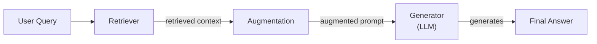
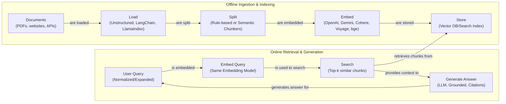
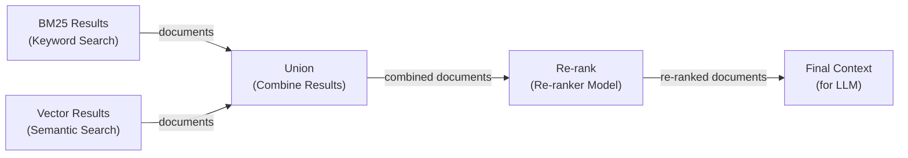
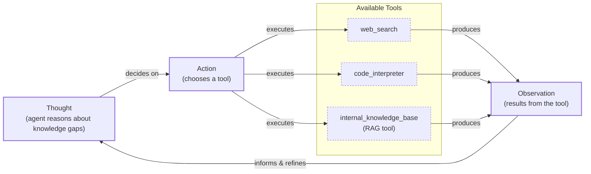

# Retrieval-Augmented Generation (RAG)

In our previous lessons, we have built a solid foundation in AI Engineering. We explored the agent landscape, distinguished between LLM workflows and autonomous agents, and, in Lesson 3, covered context engineering—the art of managing the information flow to an LLM. Now, we will tackle a fundamental challenge: giving our AI systems access to knowledge beyond their training data.

LLMs are trained on a fixed dataset, which means their knowledge is static and can quickly become outdated. When you ask a model a question, it is essentially taking a "closed-book exam" on the world's information as it existed at one point in time. This limitation leads to two major problems: the model cannot answer questions about recent events, and it is prone to "hallucination," where it confidently invents incorrect facts. While we can fine-tune a model with new data, this process is slow, expensive, and inefficient for keeping knowledge current.

Retrieval-Augmented Generation (RAG) offers a practical and powerful solution. Instead of trying to bake new knowledge into the model's parameters, we give it an "open-book exam." RAG connects the LLM to external, real-time knowledge sources, allowing it to retrieve relevant information on the fly and use it to construct an accurate answer. Just as humans do not need to memorize everything and can rely on manuals or notes, LLMs can use RAG to access the information they need, when they need it.

The field of RAG has progressed rapidly, moving from a simple, foundational approach ("Naive RAG") to sophisticated, context-aware systems that can synthesize information from multiple sources. This evolution reflects a shift from basic information retrieval to intelligent knowledge synthesis, addressing real-world challenges that early systems could not handle [[82]](https://www.arionresearch.com/blog/uuja2r7o098i1dvr8aagal2nnv3uik).

As we learned in Lesson 3, RAG is a core method within the broader discipline of context engineering. It is the mechanism we use to pull specific, relevant data from our long-term memory stores into the LLM's context window. In our next lesson, we will explore agent memory in more detail, where we will see how short-term and long-term memory systems complement the retrieval capabilities of RAG.

In this lesson, we will dive deep into the mechanics of RAG. We will start by breaking down its core components, then walk through the end-to-end pipeline. Finally, we will explore the advanced and agentic patterns that transform a simple RAG system into a sophisticated reasoning tool.

## The RAG System: Core Components

To design effective RAG systems, you first need to understand their fundamental building blocks. This is a critical step in the context engineering process we discussed in Lesson 3. At its core, a RAG system is composed of three conceptual pillars that work together to ground an LLM's response in external data.

The first pillar is **Retrieval**. This is the search engine of your RAG system, responsible for finding information relevant to a user's query. The most common approach is semantic similarity search, which relies on vector embeddings. Documents are broken down into chunks, and each chunk is converted into a numerical vector (an embedding) that captures its semantic meaning. These embeddings are stored in a vector database. When a user asks a question, their query is also converted into an embedding, and the system searches the database for the chunks with the most similar vectors. Another popular method is keyword-based search, using algorithms like BM25, which excels at finding exact matches for specific terms.

The second pillar is **Augmentation**. Once the retriever has found a set of relevant document chunks, this step takes that information and formats it into the context of a prompt. The goal is to present the retrieved data to the LLM in a clear and structured way, alongside the original user query and instructions on how to use the information.

The final pillar is **Generation**. This is where the LLM takes the augmented prompt—containing the user's question and the retrieved context—and generates a final answer. Because the model has access to relevant, external facts, it can produce a response that is grounded in that data, reducing the risk of hallucination and allowing it to cite its sources.

Image 1: A flowchart illustrating the fundamental flow of a Retrieval Augmented Generation (RAG) system.

Understanding these three components—Retrieval, Augmentation, and Generation—is the first step toward building and optimizing a RAG system. Each part plays a distinct role, and the quality of the final answer depends on how well they work together.

Now that you can name each moving part, let’s see how they line up across the two phases of a real system.

## The RAG Pipeline: Ingestion and Retrieval

The end-to-end RAG workflow is typically split into two distinct phases: an offline ingestion pipeline that prepares your data and an online retrieval pipeline that answers user queries in real-time.

### Phase 1: Offline Ingestion & Indexing

This phase is all about preparing your knowledge base so that it can be efficiently searched. It runs in the background, either on a schedule or whenever your source documents are updated.

-   **Load:** The process begins by loading your documents from various sources, which could be anything from PDFs and websites to APIs. Tools like Unstructured, LangChain document loaders, and LlamaIndex readers are commonly used for this step.
-   **Split:** Since LLMs have limited context windows and retrieval works best with smaller, focused pieces of text, the loaded documents are broken down into smaller chunks. This can be done with simple rule-based splitters, like LangChain’s `RecursiveCharacterTextSplitter`, or more advanced semantic chunkers that try to keep related ideas together.
-   **Embed:** Each chunk is then passed through an embedding model, which converts the text into a high-dimensional vector. This vector numerically represents the semantic meaning of the chunk. There are many embedding models to choose from, including those from OpenAI, Google (Gemini), Cohere, and open-source variants like BGE available on Hugging Face.
-   **Store:** Finally, these embeddings and their corresponding text chunks are stored in a specialized vector database or a search index that supports vector search. This allows for fast and scalable similarity lookups. Popular choices include local libraries like FAISS or production-grade databases like Milvus, Qdrant, and Pinecone.

### Phase 2: Online Retrieval & Generation

This phase is triggered when a user submits a query. It is designed to be fast and responsive.

-   **Query:** The user asks a question. This query can be optionally pre-processed to normalize it or expand it for better search results. Frameworks like LangChain and LlamaIndex provide query engines to manage this process.
-   **Embed:** The user's query is converted into a vector using the *same* embedding model that was used during the ingestion phase. This is critical to ensure that the query and the document chunks exist in the same vector space.
-   **Search:** The system uses the query vector to search the vector database and find the top-k most similar document chunks. This is typically done using a distance metric like cosine similarity to find the "nearest neighbors" to the query in the vector space.
-   **Generate:** The retrieved chunks are assembled into a prompt, along with the original user query and a set of instructions. This augmented prompt is then sent to an LLM, which generates a final answer grounded in the provided context. As we saw in Lesson 4, using structured outputs can help ensure the answer is well-formatted and includes citations back to the source documents.

Image 2: A detailed diagram depicting the end-to-end RAG workflow, separated into offline ingestion and online retrieval phases.

With the end-to-end path in place, the next question is quality. What are the advanced techniques to make retrieval more accurate and useful across messy, real-world data?

## Advanced RAG Techniques

A vanilla RAG pipeline is a great starting point, but production-grade systems often require more sophisticated techniques to achieve high accuracy. These methods focus on improving the quality of the retrieval step, ensuring the LLM receives the most relevant and precise context possible.

### Hybrid Search

This technique combines the strengths of two different search methods: keyword-based search (like BM25) and vector search. Keyword search is excellent for precision, finding documents that contain exact terms or phrases. Vector search excels at capturing semantic meaning, finding conceptually related documents even if they do not use the same words.

For example, in a customer support scenario, a user might ask, "my bill keeps rolling over." A keyword search would find articles containing the exact word "rollover." A semantic search might also surface guides about "carryover balances." By combining both, the system can cover different wordings of the same underlying issue, leading to more comprehensive retrieval [[36]](https://pr-peri.github.io/blogpost/2026/03/05/blogpost-hybrid-search.html).

A common method for merging these results is Reciprocal Rank Fusion (RRF). RRF combines ranked lists from different retrievers by weighting documents based on their rank, not their raw scores. This avoids the need to normalize scores from different scales (like BM25 and cosine similarity). The formula gives more weight to items that appear at the top of multiple lists, effectively finding a consensus on relevance [[61]](https://dev.to/lpossamai/building-hybrid-search-for-rag-combining-pgvector-and-full-text-search-with-reciprocal-rank-fusion-6nk).

Image 3: A diagram illustrating the hybrid retrieval flow, where keyword and semantic search results are combined and then re-ranked.

### Re-ranking

After an initial retrieval step fetches a set of candidate documents, a re-ranking model can be used to improve their ordering. Re-rankers, often implemented as cross-encoders, are specialized models that take the user's query and a single candidate document as input and output a relevance score.

Unlike the initial retrieval, which compares vectors independently, a cross-encoder processes the query and document tokens together, allowing for a deeper interaction and a more accurate assessment of relevance [[43]](https://apxml.com/courses/optimizing-rag-for-production/chapter-2-advanced-retrieval-optimization/reranking-architectures-rag). For instance, when a user asks, "how to connect my account," a re-ranker can prioritize a step-by-step setup guide over a press release that merely mentions the feature. This second pass ensures that the most relevant documents are placed at the top of the list before being sent to the LLM.

### Query Transformations

Sometimes, the user's original query is not the best one for searching your knowledge base. Query transformation techniques modify the query to improve retrieval results.

-   **Decomposition:** This method breaks down a complex, multi-part question into several simpler sub-questions. The system then retrieves documents for each sub-question and merges the results. For example, the query "What’s our travel policy for conferences in Europe this year?" could be decomposed into: (1) "Where is the travel policy?", (2) "What are the rules for Europe?", and (3) "What changed this year?". This allows the retriever to find focused answers for each part of the original query [[19]](https://docs.nvidia.com/rag/latest/query_decomposition.html).
-   **Hypothetical Document Embeddings (HyDE):** This technique uses an LLM to generate a short, hypothetical answer to the user's query *before* searching. The system then embeds this hypothetical document and uses the resulting vector to find real documents that are semantically similar. For a query about travel policy, the system might generate a draft like, "Employees can book economy flights and up to three hotel nights." Searching for documents that sound like this ideal answer often leads directly to the relevant policy pages [[16]](https://47billion.com/blog/rag-system-in-production-why-it-fails-and-how-to-fix-it/).

### Advanced Chunking Strategies

How you split your documents into chunks has a massive impact on retrieval quality. Moving beyond simple fixed-size chunking is one of the most effective ways to improve your RAG system.

-   **Semantic Chunking:** Instead of splitting by a fixed number of tokens, this method splits documents based on topic shifts, ensuring that each chunk contains a coherent semantic unit [[17]](https://sarthakai.substack.com/p/improve-your-rag-accuracy-with-a). For example, in a long company handbook, splitting by headings keeps the entire "Reimbursements" section together, preventing critical information like spending caps from being separated from the main policy.
-   **Layout-Aware Chunking:** For documents with complex structures like PDFs, this strategy uses layout information to guide the chunking process. It can identify headers, tables, and lists, and keep them intact. When processing a pricing table, for example, it is better to keep each row (product, price, discount) together rather than arbitrarily slicing the page by character count and separating numbers from their labels [[17]](https://sarthakai.substack.com/p/improve-your-rag-accuracy-with-a).

However, these advanced strategies are not a silver bullet. Sentence-based and semantic chunking can fail silently on common enterprise documents. For instance, sentence parsers often split tables and code blocks across different chunks, destroying their structure and rendering the content meaningless without its row-column context. Since tables and structured layouts are a majority of content in many internal knowledge bases, this can lead to major retrieval failures [[69]](https://towardsdatascience.com/your-chunks-failed-your-rag-in-production/).

### GraphRAG

This advanced technique involves building a knowledge graph from your documents and retrieving information from this structured representation. Knowledge graphs grew out of Semantic Web research, which aimed to make information on the web machine-understandable through standards like RDF [[88]](https://www.puppygraph.com/blog/knowledge-graph-vs-rag). Instead of just searching for similar text chunks, GraphRAG can traverse relationships between entities. This excels at answering complex, multi-hop questions that require connecting information from different parts of your knowledge base.

For example, to answer "Which shoes get the most size-related returns and were featured in last month’s ads?", the system can navigate the graph from "returns" to "reason: sizing," link to specific shoe SKUs, and then connect those SKUs to the marketing calendar. This allows it to assemble a context that would be nearly impossible to find with standard chunk-based retrieval [[46]](https://arxiv.org/html/2601.03014v1). Similarly, for an IT operations query like "Which incidents were caused by weekend deploys that also touched the login service?", it can link change records to deploy times, affected services, and incident tickets to surface the relevant post-mortems.

While powerful, GraphRAG introduces significant computational complexity. The cost of building the graph via LLM-based entity and relationship extraction can be high, and query latency can increase as the number of paths between nodes grows. Production systems often require specialized graph databases and must carefully manage traversal depth to maintain acceptable response times [[75]](https://dev.to/sreeni5018/from-rag-to-knowledge-graphs-why-the-agent-era-is-redefining-ai-architecture-3fgc).

These techniques increase retrieval quality. Next, we’ll see how retrieval becomes one tool that an agent can choose to use as it reasons.

## Agentic RAG

In Lessons 7 and 8, we explored the ReAct framework, where an agent cycles through a loop of Thought, Action, and Observation. Agentic RAG is the practical application of this concept, where retrieval is not a fixed step in a pipeline but a tool that a reasoning agent can choose to use. The agent thinks about its task, decides it has a knowledge gap, and takes the action of retrieving information.

It is important to clarify that agents often have access to many tools, such as web search, code interpreters, or database query engines. Labeling an entire system "agentic RAG" can be too narrow; more accurately, the RAG system becomes a powerful `internal_knowledge_base` tool within a more capable agent's toolkit [[13]](https://medium.com/@gaddam.rahul.kumar/agentic-rag-vs-traditional-rag-b1a156f72167).

However, treating a RAG system as an agent's memory creates critical failure modes. RAG was designed for reading from static knowledge bases, not for managing an evolving state. This leads to three structural problems: it is read-only and cannot update information; it retrieves based on semantic similarity, not what is currently true, leading to "context pollution"; and it lacks temporal reasoning, flattening history into isolated chunks with no sense of sequence [[78]](https://xtrace.ai/blog/rag-vs-long-term-memory-ai-agents).

The core distinction lies in the control flow. Standard RAG is a linear, pre-determined workflow: Retrieve → Augment → Generate. It is powerful but rigid. In contrast, Agentic RAG is adaptive and iterative. The agent decides *when* to retrieve, *how* to reformulate its query, which knowledge source to search, and whether to chain multiple retrieval and reasoning steps to arrive at a comprehensive answer [[11]](https://towardsdatascience.com/agentic-rag-vs-classic-rag-from-a-pipeline-to-a-control-loop/).

This agentic approach unlocks several new capabilities:

-   The agent can **iteratively** use the RAG tool. If an initial retrieval yields a vague policy, the agent can reason about the missing information, refine its query (e.g., "focus on EU customers, 2024 updates"), and retrieve again.
-   It can **choose** which part of its knowledge base to search. For an outage inquiry, an agent might intelligently select `search_incident_runbooks` over `search_marketing_pages`.
-   It can **fuse** information from the RAG tool with data from other tools. For example, an agent could retrieve an internal policy, then call a `web_search` tool to check for recent regulatory changes, and finally synthesize both pieces of information.
-   It can even decide to **update** the knowledge base with new information it learns. We will explore this concept of agent memory in detail in our next lesson.

Consider this conceptual thought process for an agent:

*   **Thought:** "The user is asking about '2024 EU data retention rules.' Our internal policy document is from 2023, so it is likely outdated."
*   **Action:** `retrieve(internal_policy, query="EU data retention 2024")`
*   **Observation:** "The retrieved document mentions amendments but is missing specific citations."
*   **Thought:** "I need external verification to provide an accurate answer."
*   **Action:** `web_search(query="EU data retention rules 2024 official directive")`
*   **Observation:** "Found the updated directive on the official EU portal."
*   **Thought:** "Now I can synthesize the information from both our internal policy and the official directive, highlighting the changes from 2023 and citing both sources."

This transforms the interaction from a simple database lookup into a conversation with a knowledgeable research assistant. Fusing these agentic systems with robust, long-term memory architectures remains an active area of research, with open challenges in evaluation, memory management, and efficiency [[76]](https://arxiv.org/html/2501.09136v4).

Image 4: A conceptual diagram showing an agent's iterative reasoning and tool-use loop.

You now understand both a linear RAG pipeline and how an agent can control retrieval when needed. Let’s wrap up by situating RAG in the wider AI Engineering toolkit and previewing what comes next.

## Conclusion

We have covered a lot of ground, from the fundamental problem of static LLM knowledge to the sophisticated, agentic systems that represent the future of information retrieval. RAG is the most widely used solution to the LLM knowledge problem, providing a practical way to ground models in external, up-to-date information. For production-grade quality, advanced techniques like hybrid search, re-ranking, and intelligent chunking are not just nice-to-haves; they are essential.

The core benefits of RAG are clear: it reduces hallucinations, enables customization with proprietary data, and builds user trust by providing verifiable, source-based answers. As we have seen, the future of knowledge retrieval is agentic, where RAG is not just a fixed pipeline but a dynamic tool that an intelligent agent can use as part of a broader reasoning process.

For the modern AI Engineer, mastering RAG is a foundational competency. It is a key discipline within context engineering, allowing you to build AI systems that are not only powerful but also reliable and trustworthy.

In our next lesson, we will explore Memory for Agents, and see how short-term and long-term memory systems work alongside RAG to create even more capable and context-aware AI. We will also touch on other critical topics like retrieval quality evaluation and production monitoring later in the course.

## References

- [1] [What Is Retrieval-Augmented Generation, aka RAG?](https://blogs.nvidia.com/blog/what-is-retrieval-augmented-generation/)
- [2] [A Complete Guide to RAG](https://towardsai.net/p/l/a-complete-guide-to-rag)
- [3] [Retrieval-Augmented Generation (RAG) Fundamentals First](https://decodingml.substack.com/p/rag-fundamentals-first?utm_source=publication-search)
- [4] [Your RAG is wrong: Here's how to fix it](https://decodingml.substack.com/p/your-rag-is-wrong-heres-how-to-fix?utm_source=publication-search)
- [5] [From Local to Global: A GraphRAG Approach to Query-Focused Summarization](https://arxiv.org/html/2404.16130)
- [6] [Introducing Contextual Retrieval](https://www.anthropic.com/news/contextual-retrieval)
- [7] [What is Agentic RAG](https://weaviate.io/blog/what-is-agentic-rag)
- [8] [RAG is dead, long live agentic retrieval](https://www.llamaindex.ai/blog/rag-is-dead-long-live-agentic-retrieval)
- [9] [What is agentic RAG?](https://www.ibm.com/think/topics/agentic-rag)
- [10] [Build advanced retrieval-augmented generation systems](https://learn.microsoft.com/en-us/azure/developer/ai/advanced-retrieval-augmented-generation)
- [11] [Agentic RAG vs Classic RAG: From a Pipeline to a Control Loop](https://towardsdatascience.com/agentic-rag-vs-classic-rag-from-a-pipeline-to-a-control-loop/)
- [12] [The Rise of RAG](https://highlearningrate.substack.com/p/the-rise-of-rag)
- [13] [Agentic RAG vs. Traditional RAG](https://medium.com/@gaddam.rahul.kumar/agentic-rag-vs-traditional-rag-b1a156f72167)
- [14] [Knowledge Graphs and LLMs: Fine-Tuning vs. Retrieval-Augmented Generation](https://neo4j.com/blog/developer/fine-tuning-vs-rag/)
- [15] [How RAG Works - by Neo Kim and Eric Roby](https://newsletter.systemdesign.one/p/how-rag-works)
- [16] [RAG system in production: why it fails and how to fix it](https://47billion.com/blog/rag-system-in-production-why-it-fails-and-how-to-fix-it/)
- [17] [Improve Your RAG Accuracy With A Smarter Chunking Strategy](https://sarthakai.substack.com/p/improve-your-rag-accuracy-with-a)
- [18] [Advanced RAG Techniques that will transform your LLM Application](https://cloudurable.com/blog/advanced-rag-techniques-that-will-transform-your-l/)
- [19] [Query Decomposition](https://docs.nvidia.com/rag/latest/query_decomposition.html)
- [20] [Advanced RAG Techniques: An Illustrated Guide](https://neo4j.com/blog/genai/advanced-rag-techniques/)
- [21] [Retrieval-Augmented Generation: Building Grounded AI for Enterprise Knowledge](https://medium.com/@fahey_james/retrieval-augmented-generation-building-grounded-ai-for-enterprise-knowledge-6bc46277fee5)
- [22] [What is RAG?](https://www.mindstudio.ai/blog/what-is-rag/)
- [23] [The Science Behind RAG](https://zerogravitymarketing.com/blog/the-science-behind-rag)
- [24] [How RAG Reduces AI Hallucinations and Improves Accuracy](https://www.kernshell.com/how-rag-reduces-ai-hallucinations-and-improves-accuracy/)
- [25] [RAG Inventor Talks Agents, Grounded AI, and Enterprise Impact](https://www.madrona.com/rag-inventor-talks-agents-grounded-ai-and-enterprise-impact/)
- [26] [RAG Architectures: A Comprehensive Guide to RAG for LLMs](https://humanloop.com/blog/rag-architectures)
- [27] [RAG and its different components](https://www.aimon.ai/posts/rag_and_its_different_components/)
- [28] [Grounding LLMs: Driving AI to Deliver Contextually Relevant Data](https://toloka.ai/blog/grounding-llms-driving-ai-to-deliver-contextually-relevant-data/)
- [29] [What is retrieval-augmented generation?](https://www.ibm.com/think/topics/retrieval-augmented-generation)
- [30] [RAG Architecture: A Deep Dive into Retrieval-Augmented Generation](https://galileo.ai/blog/rag-architecture)
- [31] [RAG Pipeline Deep Dive: Ingestion, Chunking, Embedding, and Vector Search](https://medium.com/@derrickryangiggs/rag-pipeline-deep-dive-ingestion-chunking-embedding-and-vector-search-abd3c8bfc177)
- [32] [RAGOps Guide: Building and Scaling Retrieval-Augmented Generation Systems](https://towardsdatascience.com/ragops-guide-building-and-scaling-retrieval-augmented-generation-systems-3d26b3ebd627/)
- [33] [RAG Offline & Online Evaluation](https://apxml.com/courses/optimizing-rag-for-production/chapter-6-advanced-rag-evaluation-monitoring/rag-offline-online-evaluation)
- [34] [What is Retrieval-Augmented Generation (RAG)?](https://aws.amazon.com/what-is/retrieval-augmented-generation/)
- [35] [What are the theoretical foundations of Retrieval-Augmented Generation that make it superior to fine-tuning for addressing LLM hallucinations and static knowledge cutoffs?](https://aclanthology.org/2024.emnlp-main.15.pdf)
- [36] [Hybrid Search: The Secret to Production-Ready RAG](https://pr-peri.github.io/blogpost/2026/03/05/blogpost-hybrid-search.html)
- [37] [Hybrid Retrieval for RAG: Combining BM25 and FAISS](https://www.chitika.com/hybrid-retrieval-rag/)
- [38] [Optimize RAG with Hybrid Search](https://mlpills.substack.com/p/issue-76-optimize-rag-with-hybrid)
- [39] [Hybrid Search Optimization: How BM25 and Dense Vector Retrieval Work Together for Superior AI Search](https://cubitrek.com/blog/hybrid-search-optimization-how-bm25-and-dense-vector-retrieval-work-together-for-superior-ai-search/)
- [40] [Hybrid RAG in the Real World: Graphs, BM25, and the End of Black Box Retrieval](https://community.netapp.com/t5/Tech-ONTAP-Blogs/Hybrid-RAG-in-the-Real-World-Graphs-BM25-and-the-End-of-Black-Box-Retrieval/ba-p/464834)
- [41] [RAG Systems: From Theory to Practice](https://arxiv.org/html/2407.00072v5)
- [42] [10 Techniques to Improve RAG Accuracy](https://redis.io/blog/10-techniques-to-improve-rag-accuracy/)
- [43] [Reranking Architectures for RAG](https://apxml.com/courses/optimizing-rag-for-production/chapter-2-advanced-retrieval-optimization/reranking-architectures-rag)
- [44] [Advanced RAG Retrieval: Cross-Encoders & Reranking](https://towardsdatascience.com/advanced-rag-retrieval-cross-encoders-reranking/)
- [45] [Graph-based Retrieval for RAG](https://www.chitika.com/graph-based-retrieval-rag/)
- [46] [SentGraph: Hierarchical Sentence Graph for Multi-hop Retrieval-Augmented Question Answering](https://arxiv.org/html/2601.03014v1)
- [47] [GraphRAG: Unlocking the Power of Graph-Based Retrieval for LLMs](https://webhome.cs.uvic.ca/~thomo/papers/asonam2025-graphrag.pdf)
- [48] [What is GraphRAG?](https://atlan.com/know/what-is-graphrag/)
- [49] [Graph-based RAG for Multi-hop Question Answering](https://arxiv.org/html/2501.00309v2)
- [50] [Implementing Semantic Search for Retrieval](https://apxml.com/courses/prompt-engineering-llm-application-development/chapter-6-integrating-llms-external-data-rag/implementing-semantic-search-retrieval)
- [51] [How RAG Actually Works: Embeddings, Vector Databases, Indexing & Retrieval Explained Simply](https://medium.com/@robi.tomar72/how-rag-actually-works-embeddings-vector-databases-indexing-retrieval-explained-simply-3d1ca45fe1bf)
- [52] [Vector DB and RAG Pipeline for Document RAG](https://learnopencv.com/vector-db-and-rag-pipeline-for-document-rag/)
- [53] [RAG Explained: Understanding Embeddings, Similarity, and Retrieval](https://towardsdatascience.com/rag-explained-understanding-embeddings-similarity-and-retrieval/)
- [54] [AWS Vector Databases Explained: Semantic Search and RAG Systems](https://tutorialsdojo.com/aws-vector-databases-explained-semantic-search-and-rag-systems/)
- [55] [Retrieval-Augmented Generation Explained](https://www.topquadrant.com/resources/blog-retrieval-augmented-generation-explained/)
- [56] [Building Trustworthy RAG Systems with In-Context Learning](https://www.linkedin.com/posts/haruiz_building-trustworthy-rag-systems-with-in-activity-7310729777227669505-nd6u)
- [57] [Introduction to Augmenting LLMs Using Retrieval-Augmented Generation (RAG)](https://medium.com/@rahulraut.techuse/introduction-to-augmenting-llms-using-retrieval-augmented-generation-rag-6530123dbb91)
- [58] [Retrieval-Augmented Generation (RAG)](https://www.promptingguide.ai/research/rag)
- [59] [Retrieval-Augmented Generation (RAG): From Basics to Advanced](https://medium.com/@tejpal.abhyuday/retrieval-augmented-generation-rag-from-basics-to-advanced-a2b068fd576c)
- [60] [Vector Databases in Practice: Building a Realistic Hybrid-Search RAG System with Qdrant](https://pub.towardsai.net/vector-databases-in-practice-building-a-realistic-hybrid-search-rag-system-with-qdrant-7b8f4a6e41e0)
- [61] [Building Hybrid Search for RAG: Combining pgvector and Full-Text Search with Reciprocal Rank Fusion](https://dev.to/lpossamai/building-hybrid-search-for-rag-combining-pgvector-and-full-text-search-with-reciprocal-rank-fusion-6nk)
- [62] [What is RAG in AI?](https://qdrant.tech/articles/what-is-rag-in-ai/)
- [63] [Vector Embeddings in RAG Applications](https://wandb.ai/mostafaibrahim17/ml-articles/reports/Vector-Embeddings-in-RAG-Applications--Vmlldzo3OTk1NDA5)
- [64] [Vector Databases, RAG, and LLMs](https://samirpaulb.github.io/posts/vector-databases-rag-llm/)
- [65] [Agentic RAG vs. Traditional RAG: Key Differences & Benefits](https://www.pingcap.com/article/agentic-rag-vs-traditional-rag-key-differences-benefits/)
- [66] [AI Agent vs RAG: What's the Difference?](https://airbyte.com/agentic-data/ai-agent-vs-rag)
- [67] [RAG vs. Agentic AI: What's the Difference?](https://domino.ai/blog/rag-vs-agentic-ai)
- [68] [Retrieval-Augmented Generation vs. Fine-Tuning: Enhancing LLMs](https://medium.com/@tahirbalarabe2/retrieval-augmented-generation-vs-fine-tuning-enhancing-llms-697e7a0cf7e0)
- [69] [Your Chunks Failed Your RAG in Production](https://towardsdatascience.com/your-chunks-failed-your-rag-in-production/)
- [70] [Addressing AI hallucinations with retrieval-augmented generation](https://www.infoworld.com/article/2335043/addressing-ai-hallucinations-with-retrieval-augmented-generation.html)
- [71] [Expanding LLMs’ Capabilities with RAG](https://arxiv.org/html/2312.05934v3)
- [72] [The Evolution of RAG: How Retrieval-Augmented Generation is Transforming Enterprise AI in 2025](http://accomplishr.com/blog/the-evolution-of-rag-how-retrieval-augmented-generation-is-transforming-enterprise-ai-in-2025-453fd943)
- [73] [RAG Techniques](https://wandb.ai/site/articles/rag-techniques/)
- [74] [The Evolution of RAG: From Naive to Advanced Architectures](https://www.arionresearch.com/blog/uuja2r7o098i1dvr8aagal2nnv3uik)
- [75] [From RAG to Knowledge Graphs: Why the Agent Era is Redefining AI Architecture](https://dev.to/sreeni5018/from-rag-to-knowledge-graphs-why-the-agent-era-is-redefining-ai-architecture-3fgc)
- [76] [Agentic RAG: Weaving Reasoning into Retrieval](https://arxiv.org/html/2501.09136v4)
- [77] [RAG vs. Long-Term Memory for AI Agents](https://xtrace.ai/blog/rag-vs-long-term-memory-ai-agents)
- [78] [Beyond RAG: Why AI Agents Need Long-Term Memory, Not Retrieval](https://xtrace.ai/blog/rag-vs-long-term-memory-ai-agents)
- [79] [Agentic RAG Architecture](https://www.okta.com/identity-101/agentic-rag-architecture/)
- [80] [A Survey on Memory-Augmented RAG for Conversational LLMs](https://ieeexplore.ieee.org/abstract/document/11080430/)
- [81] [RAG vs. Knowledge Graph vs. Semantic Layer for Enterprise AI](https://www.getgalaxy.io/articles/rag-vs-knowledge-graph-vs-semantic-layer-enterprise-ai)
- [82] [The Evolution of RAG: From Naive to Advanced Architectures](https://www.arionresearch.com/blog/uuja2r7o098i1dvr8aagal2nnv3uik)
- [83] [RAG Techniques](https://www.ibm.com/think/topics/rag-techniques)
- [84] [The Evolution of RAG: How Retrieval-Augmented Generation is Transforming Enterprise AI in 2025](http://accomplishr.com/blog/the-evolution-of-rag-how-retrieval-augmented-generation-is-transforming-enterprise-ai-in-2025-453fd943)
- [85] [RAG Techniques](https://www.ibm.com/think/topics/rag-techniques)
- [86] [RAG vs. Knowledge Graph vs. Semantic Layer for Enterprise AI](https://www.getgalaxy.io/articles/rag-vs-knowledge-graph-vs-semantic-layer-enterprise-ai)
- [87] [Knowledge Graphs vs. RAG for AI](https://atlan.com/know/knowledge-graphs-vs-rag-for-ai/)
- [88] [Knowledge Graph vs RAG](https://www.puppygraph.com/blog/knowledge-graph-vs-rag)
- [89] [RAG vs. Semantic Layer: What's the Difference?](https://www.dawiso.com/blog-post/rag-vs-semantic-layer-whats-the-difference)
- [90] [From RAG to GraphRAG: Knowledge Graphs, Ontologies, and Smarter AI](https://www.gooddata.com/blog/from-rag-to-graphrag-knowledge-graphs-ontologies-and-smarter-ai/)