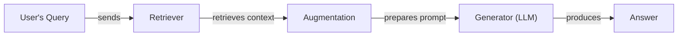
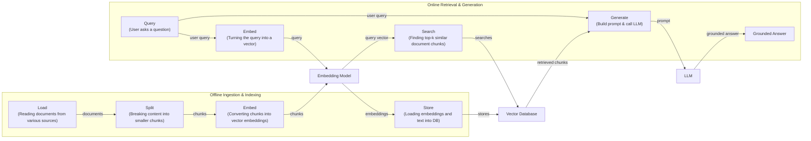
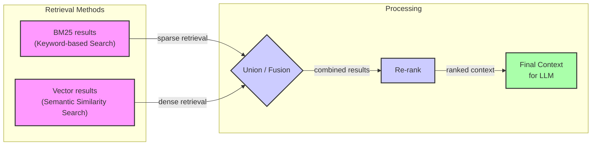
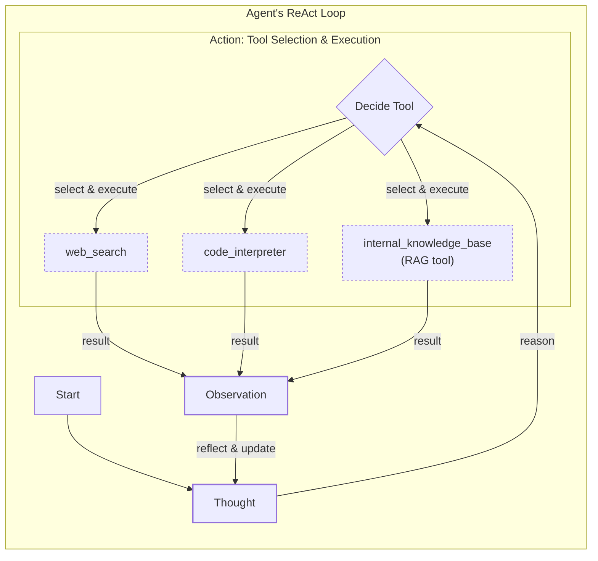

# Lesson 9: Retrieval-Augmented Generation

In our previous lessons, we built a foundation in AI Engineering. We explored the agent landscape, distinguished between rule-based workflows and autonomous agents, and introduced context engineering as the art of managing information flow to an LLM. We've also covered how to get structured data out of models, give them tools to perform actions, and implement reasoning loops like ReAct.

LLMs are trained on a fixed dataset, which makes their knowledge static. During training, they essentially take a "closed-book exam" on the world's information. This limitation means they cannot access up-to-date information and are prone to making things up, a phenomenon known as hallucination. While we can fine-tune models to update their internal knowledge, this process is expensive, slow, and inefficient for constantly changing data [[1]](https://neo4j.com/blog/developer/fine-tuning-vs-rag/), [[2]](https://aclanthology.org/2024.emnlp-main.15.pdf).

Retrieval-Augmented Generation (RAG) offers a reliable solution. Instead of relying on memorized facts, RAG gives the LLM an "open-book exam" [[3]](https://blogs.nvidia.com/blog/what-is-retrieval-augmented-generation/). It connects the model to external, real-time knowledge sources, allowing it to retrieve relevant information and use it to construct an answer. This is similar to how we as humans operate; we do not need to memorize everything when we can consult manuals, notes, or a quick search.

RAG is a core technique for context engineering, which we covered in Lesson 3. It is a powerful method for curating the information an LLM sees, ensuring that its responses are grounded in verifiable facts. This is different from an agent's memory, which is about retaining information from past interactions. We will explore how memory systems complement retrieval in Lesson 10.

For an AI Engineer, mastering RAG is not optional. It is a fundamental skill for building agents that can use proprietary data, access real-time information, and provide accurate, source-backed answers. This lesson will guide you through the "what" and "how" of RAG, from its basic components to the advanced and agentic patterns that power modern AI systems. With the problem and motivation clear, we’ll first decompose RAG into its core components so you can see where each responsibility lives.

## The RAG System: Core Components

Understanding the core components of a RAG system is the first step in the context engineering process of designing effective AI applications. A RAG system is built on three conceptual pillars that work together to connect an LLM to an external knowledge base [[4]](https://towardsai.net/p/l/a-complete-guide-to-rag), [[5]](https://decodingml.substack.com/p/rag-fundamentals-first?utm_source=publication-search).

**Retrieval** is the engine that finds relevant information. When a user asks a question, the retriever searches an external knowledge base to find the most relevant pieces of context. This search is typically performed using semantic similarity, which identifies documents that are contextually similar in meaning, even if they do not use the same keywords [[6]](https://apxml.com/courses/prompt-engineering-llm-application-development/chapter-6-integrating-llms-external-data-rag/implementing-semantic-search-retrieval). This is made possible by vector embeddings—numerical representations of text that capture its meaning. These embeddings are stored in a specialized vector database, which allows for efficient searching [[7]](https://pub.towardsai.net/vector-databases-in-practice-building-a-realistic-hybrid-search-rag-system-with-qdrant-7b8f4a6e41e0).

**Augmentation** is the process of taking the information found by the retriever and preparing it for the LLM. The retrieved text chunks are combined with the original user query and system instructions to create an "augmented prompt." This step is crucial because it directly shapes the context the LLM will use to generate its answer [[8]](https://www.topquadrant.com/resources/blog-retrieval-augmented-generation-explained/). Proper formatting and ordering of this information can significantly impact the quality of the final response.

**Generation** is the final step where the LLM produces an answer. The model receives the augmented prompt, which contains both the user's question and the grounded context from the external knowledge base. Using this information, the LLM generates a response that is accurate, relevant, and supported by the provided sources [[5]](https://decodingml.substack.com/p/rag-fundamentals-first?utm_source=publication-search). This process allows the LLM to function as a reasoning engine that operates on reliable, up-to-date data rather than relying solely on its internal, static knowledge.

Image 1: A flowchart illustrating the core components and sequential flow of a RAG system.

These three components form a sequential pipeline that transforms a user's question into a fact-grounded answer. Now that you can name each moving part, let’s see how they line up across the two phases of a real system.

## The RAG Pipeline: Ingestion and Retrieval

The end-to-end RAG workflow can be divided into two distinct phases: an offline phase for preparing the data and an online phase for answering user queries in real-time [[9]](https://newsletter.systemdesign.one/p/how-rag-works).

### Phase 1: Offline Ingestion & Indexing

The offline phase, also known as the ingestion pipeline, is where you prepare your knowledge base for retrieval. This process is typically run in batches and involves several key steps [[5]](https://decodingml.substack.com/p/rag-fundamentals-first?utm_source=publication-search), [[10]](https://medium.com/@derrickryangiggs/rag-pipeline-deep-dive-ingestion-chunking-embedding-and-vector-search-abd3c8bfc177).

-   **Load:** The first step is to load your documents from various sources. These can include anything from PDFs and web pages to data from APIs or databases.
-   **Split:** Since documents are often too large to fit into a model's context window, they must be broken down into smaller, manageable pieces called chunks. The goal is to create chunks that are semantically meaningful and self-contained, avoiding splits in the middle of a sentence or idea.
-   **Embed:** Each chunk is then passed through an embedding model, which converts the text into a high-dimensional vector. This vector captures the semantic meaning of the chunk, allowing for comparisons based on context rather than just keywords [[11]](https://qdrant.tech/articles/what-is-rag-in-ai/).
-   **Store:** Finally, the vector embeddings and their corresponding text chunks are loaded into a vector database. This database is optimized for fast similarity searches, enabling the system to quickly find the most relevant chunks for a given query.

### Phase 2: Online Retrieval & Generation

The online phase is triggered when a user submits a query. This is the real-time part of the RAG pipeline that interacts directly with the user [[9]](https://newsletter.systemdesign.one/p/how-rag-works).

-   **Query:** The process begins with the user's question. This query may be pre-processed to normalize the text or expand it for better search results.
-   **Embed:** The user's query is converted into a vector using the same embedding model that was used during the ingestion phase. This ensures that the query and the document chunks are in the same vector space, making them comparable.
-   **Search:** The query vector is used to search the vector database. The system calculates the similarity between the query vector and all the chunk vectors in the database, typically using a metric like cosine similarity, and returns the top-k most similar chunks [[12]](https://towardsdatascience.com/rag-explained-understanding-embeddings-similarity-and-retrieval/).
-   **Generate:** The retrieved chunks are then combined with the original query and a set of instructions into a single prompt. This augmented prompt is fed to the LLM, which generates a final answer grounded in the provided context. As we learned in Lesson 4, this is a good place to use structured outputs to ensure the answer includes citations back to the source documents.

Image 2: A detailed flowchart of the end-to-end RAG workflow, divided into two main phases: "Offline Ingestion & Indexing" and "Online Retrieval & Generation".

This two-phase architecture separates the heavy, upfront work of data processing from the fast, real-time demands of answering user queries. With the end-to-end path in place, the next question is quality: what are the advanced techniques to make retrieval more accurate and useful across messy, real-world data?

## Advanced RAG Techniques

A naive RAG pipeline is a good starting point, but production systems require more sophisticated techniques to improve retrieval quality and relevance. These advanced methods address the limitations of simple vector search and help the system handle complex queries and diverse document types [[13]](https://decodingml.substack.com/p/your-rag-is-wrong-heres-how-to-fix?utm_source=publication-search), [[14]](https://learn.microsoft.com/en-us/azure/developer/ai/advanced-retrieval-augmented-generation).

### Hybrid Search

Hybrid search combines the strengths of traditional keyword-based search (like BM25) with modern semantic vector search. While vector search is excellent at understanding the meaning and context of a query, it can sometimes miss exact matches for rare terms, acronyms, or specific IDs. Keyword search excels at this. By using both methods and fusing their results, you get the best of both worlds: precision on keywords and broad semantic understanding [[15]](https://mlpills.substack.com/p/issue-76-optimize-rag-with-hybrid). For example, if a user searches for a specific error code, keyword search ensures that exact match is found, while semantic search can find related articles that discuss similar issues without mentioning the exact code.

### Re-ranking

After an initial set of documents is retrieved, a re-ranking step can significantly improve the final ordering. A re-ranker is a more powerful, but slower, model (often a cross-encoder) that takes the user's query and each retrieved document as a pair and computes a more accurate relevance score [[16]](https://redis.io/blog/10-techniques-to-improve-rag-accuracy/). Unlike standard bi-encoder retrieval, which encodes the query and documents independently, a cross-encoder processes them together as a single input. This allows every token in the query to attend to every token in the document, capturing nuanced relationships and contradictions that independent encoding misses [[27]](https://towardsdatascience.com/advanced-rag-retrieval-cross-encoders-reranking/). This two-stage process—a fast initial retrieval followed by a more precise re-ranking—allows the system to surface the most relevant documents at the top of the list. The trade-off is higher latency, as each candidate requires a separate, computationally expensive forward pass through the model, which can become a bottleneck under high query loads [[27]](https://towardsdatascience.com/advanced-rag-retrieval-cross-encoders-reranking/).

Image 3: A flowchart illustrating the hybrid retrieval flow, showing parallel BM25 and vector results converging into a union/fusion step, followed by re-ranking and final context generation for an LLM.

### Query Transformations

Sometimes, the user's query is not in the best format for retrieval. Query transformation techniques rewrite or decompose the query to improve search results [[13]](https://decodingml.substack.com/p/your-rag-is-wrong-heres-how-to-fix?utm_source=publication-search).

-   **Decomposition** breaks down a complex, multi-part question into several smaller, more focused sub-queries. For example, the question "What is the difference in travel policies for conferences in Europe versus North America this year?" could be split into separate queries for European and North American policies, with the results combined for the final answer [[17]](https://docs.nvidia.com/rag/latest/query_decomposition.html). This is particularly useful for queries containing complex operators like comparisons, negations, or exclusions, which standard semantic search often struggles with [[28]](https://arxiv.org/html/2510.18633v1).
-   **Hypothetical Document Embeddings (HyDE)** is a technique where an LLM first generates a hypothetical, ideal answer to the user's query. This generated answer is then converted into an embedding and used for the search. The idea is that this hypothetical document is often semantically closer to the actual answer documents than the original, sometimes ambiguous, query [[18]](https://47billion.com/blog/rag-system-in-production-why-it-fails-and-how-to-fix-it/). However, since the generated answer is not guaranteed to be factually accurate, this approach can sometimes anchor the search to plausible but incorrect information, limiting its precision [[29]](https://towardsdatascience.com/advanced-query-transformations-to-improve-rag-11adca9b19d1/).

### Advanced Chunking Strategies

How you split your documents into chunks has a massive impact on retrieval quality. Moving beyond simple fixed-size chunking can help preserve the document's original structure and context [[14]](https://learn.microsoft.com/en-us/azure/developer/ai/advanced-retrieval-augmented-generation). The optimal strategy is not one-size-fits-all; it depends on the document type and the kinds of questions being asked. A strategy that works for prose-heavy reports might fail for documents with many tables or code blocks [[30]](https://www.llamaindex.ai/glossary/document-chunking-strategies).

-   **Semantic chunking** splits text based on topical coherence, ensuring that related sentences stay together in the same chunk [[19]](https://sarthakai.substack.com/p/improve-your-rag-accuracy-with-a). This avoids breaking up a single idea across multiple chunks.
-   **Layout-aware chunking** is essential for complex documents like PDFs with tables, headers, and figures. Instead of treating the document as a flat text file, this method uses the document's visual and structural layout to guide the chunking process, keeping tables and sections intact.
-   **Context-enriched chunking** prepends each chunk with summary information or relevant metadata from the parent document. This gives the embedding model more context about where the chunk came from, improving the quality of the embedding and the relevance of retrieval [[20]](https://www.anthropic.com/news/contextual-retrieval).

### GraphRAG

GraphRAG involves building a knowledge graph from your documents, where entities (like people, places, and organizations) are nodes and their relationships are edges. This technique excels at answering complex, multi-hop questions that require connecting information across multiple documents or data points [[21]](https://arxiv.org/html/2404.16130). Standard RAG pipelines, which treat documents as a flat collection of text chunks, often fail on enterprise data where information is hierarchical and interconnected. They may retrieve a semantically similar but outdated clause over a concise, superseding amendment, or fail to follow a chain of citations required to construct a complete answer [[31]](https://arxiv.org/html/2604.14220v1). For example, to answer "Which products designed by a team in London are most frequently returned for quality issues?", a standard RAG system might struggle. GraphRAG, however, can traverse the graph from "London" to "design teams" to "products" to "return reasons," assembling a precise and connected context that would be nearly impossible to find with simple vector search [[22]](https://arxiv.org/html/2501.00309v2).

These techniques increase retrieval quality. Next, we’ll see how retrieval becomes one tool that an agent can choose to use as it reasons.

## Agentic RAG

As we explored in Lessons 7 and 8, a ReAct agent operates in a loop of Thought, Action, and Observation. Agentic RAG is the application of this pattern where one of the available actions is a retrieval tool [[23]](https://www.ibm.com/think/topics/agentic-rag). The agent can reason about when it has a knowledge gap and decide to call its RAG tool to find the information it needs.

It is important to clarify that agents often have access to many tools, such as web search, code interpreters, or database query engines. Labeling an entire system as "agentic RAG" can be too narrow; more accurately, the retrieval capability is just one tool in the agent's toolkit [[24]](https://weaviate.io/blog/what-is-agentic-rag).

The core distinction between standard and agentic RAG lies in their control flow [[25]](https://towardsdatascience.com/agentic-rag-vs-classic-rag-from-a-pipeline-to-a-control-loop/).

-   **Standard RAG** follows a linear, pre-determined workflow: Retrieve → Augment → Generate. It is powerful but rigid, executing the same steps for every query.
-   **Agentic RAG** is adaptive and iterative. An agent decides *when* to retrieve, *what* to retrieve, and *how* to use the retrieved information. It can reformulate queries, choose between different knowledge sources, and chain multiple retrieval and reasoning steps together [[26]](https://www.pingcap.com/article/agentic-rag-vs-traditional-rag-key-differences-benefits/).

This agentic approach unlocks several new capabilities. The agent can iteratively refine its search, using initial results to inform subsequent queries. It can choose the most appropriate knowledge base to search, for instance, selecting technical documentation over marketing materials for a specific query. It can also fuse information from its internal RAG tool with data from other tools, like a live web search, to form a more comprehensive answer. However, this iterative freedom also introduces new failure modes. An agent can get stuck in "retrieval thrash," endlessly re-querying with minor variations, or trigger "tool storms" of excessive, costly calls when faced with uncertainty or outdated information [[32]](https://towardsdatascience.com/agentic-rag-failure-modes-retrieval-thrash-tool-storms-and-context-bloat-and-how-to-spot-them-early/). These issues make latency and coordination key infrastructure bottlenecks when scaling agentic systems [[33]](https://redis.io/blog/agentic-rag-how-enterprises-are-surmounting-the-limits-of-traditional-rag/).

Let's consider a conceptual "thought process" for an agent tasked with answering a complex query:

> **Thought:** "The user is asking about our data retention policy for EU customers under the 2024 regulations. My internal knowledge base has a policy, but it's dated 2023. This might be outdated."
> **Action:** `retrieve(internal_policy, query="EU data retention 2024")`
> **Observation:** "The retrieved policy mentions upcoming amendments but lacks specific details or citations for the 2024 changes."
> **Thought:** "I need to verify this against an external, authoritative source."
> **Action:** `web_search(query="Official EU data retention regulations 2024")`
> **Observation:** "Found the official directive update on the EU's legal portal."
> **Thought:** "Now I have both the internal policy and the official external regulation. I can synthesize these, highlight the changes from the 2023 policy, and provide a complete, cited answer."

This shift transforms RAG from a simple database lookup into a dynamic conversation with a knowledgeable research assistant.

Image 4: A conceptual flowchart illustrating an agent's main loop, emphasizing its iterative nature and decision-making capabilities based on the ReAct pattern. The loop includes "Thought", "Action", and "Observation" steps. Within the "Action" step, the agent chooses between various tools, such as `web_search`, `code_interpreter`, and `internal_knowledge_base` (representing the RAG tool). The diagram conveys that the agent dynamically selects tools based on its reasoning and observations.

You now understand both a linear RAG pipeline and how an agent can control retrieval when needed. Let’s wrap up by situating RAG in the wider AI Engineering toolkit and previewing what comes next.

## Conclusion

In this lesson, we have seen that RAG is the most widely used solution to the LLM knowledge problem. It reduces hallucinations, enables customization with proprietary data, and builds user trust through verifiable, source-based answers. We also learned that advanced techniques like hybrid search and re-ranking are crucial for production-grade quality, and the future of knowledge retrieval is agentic, where retrieval is a tool in an intelligent agent's arsenal.

RAG should not be seen as a niche skill but as a foundational competency for the modern AI Engineer. It is a key discipline within the broader practice of Context Engineering.

As we move forward in this course, we will continue to build on these concepts. In the next lesson, we will explore Memory for Agents, and see how short-term and long-term memory systems work alongside RAG to create even more powerful and stateful AI applications. This distinction parallels other AI paradigms like Case-Based Reasoning (CBR), which retrieves concrete past examples (episodic memory) rather than general knowledge statements (semantic memory), as RAG does [[34]](https://ceur-ws.org/Vol-3708/paper_21.pdf). We will also touch on other important topics, such as evaluating retrieval quality and monitoring RAG systems in production, in later parts of the course. This will include handling multimodal data, where future systems will use unified embeddings to retrieve information from text, images, and other formats, which we will cover in Lesson 11 [[35]](https://superlinear.eu/insights/articles/the-future-of-multimodal-rag-systems-transforming-ai-capabilities).

## References

-   [1] https://neo4j.com/blog/developer/fine-tuning-vs-rag/
-   [2] https://aclanthology.org/2024.emnlp-main.15.pdf
-   [3] https://blogs.nvidia.com/blog/what-is-retrieval-augmented-generation/
-   [4] https://towardsai.net/p/l/a-complete-guide-to-rag
-   [5] https://decodingml.substack.com/p/rag-fundamentals-first?utm_source=publication-search
-   [6] https://apxml.com/courses/prompt-engineering-llm-application-development/chapter-6-integrating-llms-external-data-rag/implementing-semantic-search-retrieval
-   [7] https://pub.towardsai.net/vector-databases-in-practice-building-a-realistic-hybrid-search-rag-system-with-qdrant-7b8f4a6e41e0
-   [8] https://www.topquadrant.com/resources/blog-retrieval-augmented-generation-explained/
-   [9] https://newsletter.systemdesign.one/p/how-rag-works
-   [10] https://medium.com/@derrickryangiggs/rag-pipeline-deep-dive-ingestion-chunking-embedding-and-vector-search-abd3c8bfc177
-   [11] https://qdrant.tech/articles/what-is-rag-in-ai/
-   [12] https://towardsdatascience.com/rag-explained-understanding-embeddings-similarity-and-retrieval/
-   [13] https://decodingml.substack.com/p/your-rag-is-wrong-heres-how-to-fix?utm_source=publication-search
-   [14] https://learn.microsoft.com/en-us/azure/developer/ai/advanced-retrieval-augmented-generation
-   [15] https://mlpills.substack.com/p/issue-76-optimize-rag-with-hybrid
-   [16] https://redis.io/blog/10-techniques-to-improve-rag-accuracy/
-   [17] https://docs.nvidia.com/rag/latest/query_decomposition.html
-   [18] https://47billion.com/blog/rag-system-in-production-why-it-fails-and-how-to-fix-it/
-   [19] https://sarthakai.substack.com/p/improve-your-rag-accuracy-with-a
-   [20] https://www.anthropic.com/news/contextual-retrieval
-   [21] https://arxiv.org/html/2404.16130
-   [22] https://arxiv.org/html/2501.00309v2
-   [23] https://www.ibm.com/think/topics/agentic-rag
-   [24] https://weaviate.io/blog/what-is-agentic-rag
-   [25] https://towardsdatascience.com/agentic-rag-vs-classic-rag-from-a-pipeline-to-a-control-loop/
-   [26] https://www.pingcap.com/article/agentic-rag-vs-traditional-rag-key-differences-benefits/
-   [27] https://towardsdatascience.com/advanced-rag-retrieval-cross-encoders-reranking/
-   [28] https://arxiv.org/html/2510.18633v1
-   [29] https://towardsdatascience.com/advanced-query-transformations-to-improve-rag-11adca9b19d1/
-   [30] https://www.llamaindex.ai/glossary/document-chunking-strategies
-   [31] https://arxiv.org/html/2604.14220v1
-   [32] https://towardsdatascience.com/agentic-rag-failure-modes-retrieval-thrash-tool-storms-and-context-bloat-and-how-to-spot-them-early/
-   [33] https://redis.io/blog/agentic-rag-how-enterprises-are-surmounting-the-limits-of-traditional-rag/
-   [34] https://ceur-ws.org/Vol-3708/paper_21.pdf
-   [35] https://superlinear.eu/insights/articles/the-future-of-multimodal-rag-systems-transforming-ai-capabilities