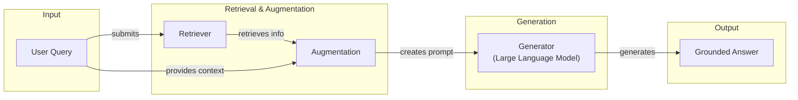
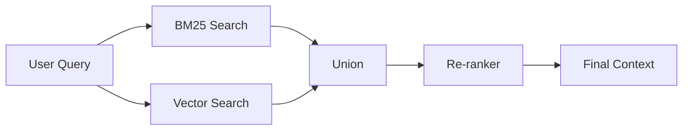
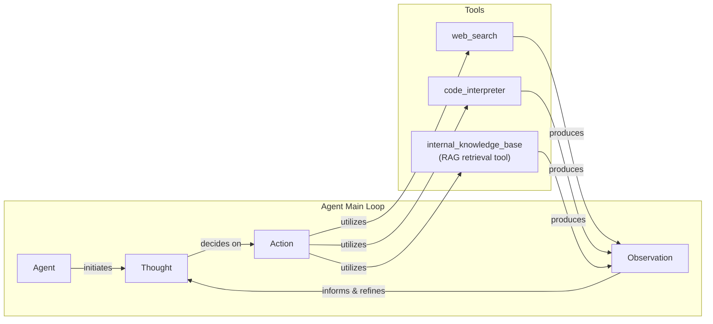

# Lesson 9: Retrieval-Augmented Generation (RAG)

In our previous lessons, we explored the core principles of AI Engineering. We covered Context Engineering in Lesson 3, where we learned the importance of carefully curating the information we provide to an LLM. We also built a reasoning agent from scratch in Lesson 8, using the ReAct framework to give our models the ability to plan and execute actions.

A core problem remains: LLMs are trained on a fixed dataset, making their knowledge static. During training, they essentially take a "closed-book exam" on the world's information. We do not yet have efficient techniques to enable models to learn new information over time after deployment. While we can fine-tune them, this process is slow and expensive, unlike how humans learn from experience. This limitation leads to two major issues: knowledge cutoffs and hallucinations.

Retrieval-Augmented Generation (RAG) is a reliable solution to this problem. Instead of trying to force new knowledge into the model's weights, we insert it into the context window at inference time. With RAG, we are giving the LLM an "open-book exam" by connecting it to external, real-time knowledge sources. Just as humans do not need to memorize everything, LLMs can use manuals, cheat sheets, and external documents to ground their answers in facts.

RAG is a key method AI Engineers use in the process of Context Engineering. In this lesson, we will explore the "what" and "how" of RAG, starting with its basic components and moving toward the advanced and agentic patterns that power modern AI systems. We will also contrast retrieval with agent memory, a topic we will explore further in Lesson 10, where we discuss short- and long-term memory stores that complement RAG.

With the problem and motivation clear, we will first decompose RAG into its core components so you can see where each responsibility lives.

## The RAG System: Core Components

Understanding the components of RAG is the first step in the Context Engineering process of designing effective retrieval systems. At its core, RAG is built on three conceptual pillars: Retrieval, Augmentation, and Generation.

**Retrieval** is the engine for finding relevant information. Given a user's query, the retriever's job is to search an external knowledge base and pull out the most relevant pieces of data. The most common approach is semantic similarity search, which relies on vector embeddings. An embedding is a numerical representation of a piece of text that captures its meaning. These vectors are stored in a specialized vector database, which allows for efficient searching. When a user asks a question, it is also converted into a vector, and the database finds the text chunks with the closest vectors. Another popular method is keyword-based search, using algorithms like BM25, which excels at finding exact matches for specific terms.

**Augmentation** is the process of taking the information found by the retriever and preparing it for the LLM. This involves formatting the retrieved text chunks and combining them with the original user query to create an augmented prompt. This new prompt provides the LLM with the necessary context to formulate an accurate and grounded response.

**Generation** is the final step. The augmented prompt is sent to the LLM, which uses the provided context as its source of truth. The model synthesizes the information from the retrieved chunks to generate a final answer that directly addresses the user's query while being grounded in the external data.

This approach has parallels to Case-Based Reasoning (CBR), a classic AI technique. While RAG retrieves general knowledge statements (semantic memory), CBR retrieves specific past examples or "cases" (episodic memory) to solve new problems. Both methods ground reasoning in existing data, but RAG focuses on factual knowledge while CBR leverages experiential precedents [[61]](https://ceur-ws.org/Vol-3708/paper_21.pdf).



Image 1: A flowchart illustrating the core components and conceptual flow of a Retrieval Augmented Generation (RAG) system.

These three pillars work together to create a system that can answer questions about information it was never trained on. Now that you can name each moving part, let’s see how they line up across the two phases of a real system.

## The RAG Pipeline: Ingestion and Retrieval

An end-to-end RAG workflow is split into two distinct phases: an offline phase for preparing the data and an online phase for answering user queries in real-time.

### Phase 1: Offline Ingestion & Indexing

This phase happens in the background, before any user interacts with the system. Its goal is to take a collection of raw documents and prepare them for efficient retrieval. This process involves several steps:

-   **Load:** The first step is to read documents from their various sources. These can be PDFs, web pages, database records, or API responses. Tools like LangChain's document loaders or LlamaIndex's readers are commonly used for this task [[54]](https://towardsdatascience.com/rag-explained-understanding-embeddings-similarity-and-retrieval/).
-   **Split:** Since documents are often too large to fit into an LLM's context window, they must be broken down into smaller, meaningful pieces, or "chunks." This can be done with simple rule-based splitters (e.g., splitting by character count) or more advanced semantic chunkers that try to keep related ideas together [[32]](https://newsletter.systemdesign.one/p/how-rag-works).
-   **Embed:** Each chunk of text is then passed through an embedding model, which converts it into a vector embedding. This numerical representation captures the semantic meaning of the text. Popular embedding models include OpenAI's `text-embedding-3` series, Google's `text-embedding-004`, and various open-source models from Hugging Face [[53]](https://learnopencv.com/vector-db-and-rag-pipeline-for-document-rag/).
-   **Store:** Finally, the embeddings and their corresponding text chunks are loaded into a vector database. This database indexes the vectors for fast similarity search, allowing the system to quickly find the most relevant chunks for a given query. Examples of vector stores include local libraries like FAISS and production-grade databases like Milvus, Qdrant, or Pinecone [[52]](https://medium.com/@robi.tomar72/how-rag-actually-works-embeddings-vector-databases-indexing-retrieval-explained-simply-3d1ca45fe1bf).

### Phase 2: Online Retrieval & Generation

This phase is triggered in real-time when a user submits a query.

-   **Query & Embed:** The user's question is taken as input and converted into a vector using the same embedding model that was used during the ingestion phase. This ensures that the query and the document chunks are represented in the same vector space, making them comparable [[31]](https://medium.com/@derrickryangiggs/rag-pipeline-deep-dive-ingestion-chunking-embedding-and-vector-search-abd3c8bfc177).
-   **Search:** The query vector is used to search the vector database. The database performs a similarity search (often using cosine similarity) to find the top-k document chunks whose embeddings are most similar to the query's embedding [[51]](https://apxml.com/courses/prompt-engineering-llm-application-development/chapter-6-integrating-llms-external-data-rag/implementing-semantic-search-retrieval).
-   **Generate:** The retrieved chunks are combined with the original user query and a set of instructions into a single prompt. This augmented prompt is then passed to an LLM, which generates a final answer grounded in the retrieved context. To ensure reliability, we often use structured outputs, a technique we covered in Lesson 4, to format the answer and include citations back to the source documents [[29]](https://www.ibm.com/think/topics/retrieval-augmented-generation).

```mermaid
flowchart LR
  %% Phase 1: Offline Ingestion & Indexing
  subgraph "Offline Ingestion & Indexing"
    RD["Raw Documents"]
    L["Load"]
    S["Split"]
    E["Embed<br/>(Embedding Model)"]
    ST[(Store<br/>(Vector Database))]
  end

  RD -- "read" --> L
  L -- "chunk" --> S
  S -- "vectorize" --> E
  E -- "index" --> ST

  %% Phase 2: Online Retrieval & Generation
  subgraph "Online Retrieval & Generation"
    UQ["User Query"]
    EQ["Embed Query<br/>(Embedding Model)"]
    SR["Search<br/>(Vector Database)"]
    G["Generate<br/>(LLM)"]
  end

  UQ -- "input" --> EQ
  EQ -- "query vectors" --> SR
  SR -- "retrieved chunks" --> G

  %% Connection between phases
  ST -. "provides indexed data" .-> SR

  %% Visual grouping
  classDef store stroke-dasharray:3,3
  classDef process stroke-width:2px

  class L,S,E,EQ,SR,G process
  class ST store
```

Image 2: A detailed flowchart depicting the two distinct phases of an end-to-end RAG pipeline: Offline Ingestion & Indexing and Online Retrieval & Generation.

With the end-to-end path in place, the next question is quality. What are the advanced techniques to make retrieval more accurate and useful across messy, real-world data?

## Advanced RAG Techniques

While a basic RAG pipeline works for simple lookups, production systems require more sophisticated techniques to handle the complexity of real-world data and user queries. These advanced methods significantly improve the quality and relevance of the retrieved information.

### Hybrid Search

Hybrid search combines the strengths of keyword-based search (like BM25) and semantic vector search. Keyword search is excellent for precision, especially with specific terms, acronyms, or IDs that vector search might miss. Vector search excels at understanding the meaning and context behind a query, catching paraphrases and related concepts [[38]](https://mlpills.substack.com/p/issue-76-optimize-rag-with-hybrid).

For example, if a customer support user asks, "my bill keeps rolling over," a keyword search will find articles containing the exact word "rollover." A semantic search might also surface guides about "carryover balances." By combining both, the system covers different wordings of the same issue, leading to more comprehensive results. The results from both search methods are typically merged using a technique like Reciprocal Rank Fusion (RRF) [[39]](https://cubitrek.com/blog/hybrid-search-optimization-how-bm25-and-dense-vector-retrieval-work-together-for-superior-ai-search/).

### Re-ranking

After an initial retrieval fetches a set of candidate documents, a re-ranker is used to improve their ordering. Re-rankers are typically cross-encoder models that evaluate the relevance of a query and a document pair together, providing a more accurate relevance score than the initial retrieval stage [[43]](https://apxml.com/courses/optimizing-rag-for-production/chapter-2-advanced-retrieval-optimization/reranking-architectures-rag). This is different from the initial retrieval, which often uses a bi-encoder that encodes the query and document independently. A cross-encoder concatenates the query and document, allowing its attention mechanism to model the interactions between their tokens directly, which yields a much more precise relevance judgment [[62]](https://towardsdatascience.com/advanced-rag-retrieval-cross-encoders-reranking/).

The initial retrieval is optimized for speed and recall, bringing back a broad set of potentially relevant documents. The re-ranker, which is more computationally intensive, then focuses on precision, analyzing this smaller set to push the most relevant documents to the top. This two-stage process is necessary because running a cross-encoder on every document would be too slow. However, under high query load, even re-ranking a small set can become a bottleneck, as response times can increase dramatically when the query rate exceeds the system's throughput [[62]](https://towardsdatascience.com/advanced-rag-retrieval-cross-encoders-reranking/). For instance, when a user asks, "how to connect my account," a re-ranker can prioritize a step-by-step setup guide over a press release or a tangentially related community forum thread [[42]](https://redis.io/blog/10-techniques-to-improve-rag-accuracy/).



Image 3: A flowchart illustrating the Hybrid Retrieval Flow with re-ranking.

### Query Transformations

Sometimes, the user's original query is not the best one for searching the knowledge base. Query transformation techniques rewrite or expand the query to improve retrieval results.

-   **Decomposition:** This technique breaks down a complex, multi-part question into several simpler sub-questions. The system then retrieves documents for each sub-question and merges the results. For example, the query "What’s our travel policy for conferences in Europe this year?" could be decomposed into: "What is the travel policy?", "What are the rules for conferences?", "What are the specific rules for Europe?", and "What has changed this year?" [[19]](https://docs.nvidia.com/rag/latest/query_decomposition.html). However, perfect decomposition is an open problem, as it requires handling complex logical operators and ambiguity [[63]](https://arxiv.org/html/2510.18633v1).
-   **Hypothetical Document Embeddings (HyDE):** With HyDE, the system first generates a hypothetical, ideal answer to the user's query. It then embeds this hypothetical document and uses the resulting vector to search the knowledge base. This often bridges the gap between the phrasing of the query and the language used in the documents. For a query about travel policies, the system might generate a draft answer like, "Employees can book economy flights and up to three hotel nights," and then search for documents that sound like that answer [[16]](https://47billion.com/blog/rag-system-in-production-why-it-fails-and-how-to-fix-it/). This approach has limits, as the generated answer can contain factual inaccuracies, potentially leading the retrieval astray [[64]](https://towardsdatascience.com/advanced-query-transformations-to-improve-rag-11adca9b19d1/).

### Advanced Chunking Strategies

How documents are split into chunks has a major impact on retrieval quality. Moving beyond simple fixed-size chunks can preserve critical context.

-   **Semantic Chunking:** Instead of splitting by a fixed number of characters, semantic chunking groups related sentences together, ensuring that a complete idea or topic is contained within a single chunk. For example, when splitting a company handbook, this method would keep the entire "Reimbursements" section intact, rather than cutting it in half and separating the rules from the specific cap amounts [[18]](https://cloudurable.com/blog/advanced-rag-techniques-that-will-transform-your-l/).
-   **Layout-Aware Chunking:** For documents with complex structures like tables, forms, or financial reports, layout-aware chunking preserves the document's hierarchy. For a pricing table, this means keeping each row (product, price, discount) together, which would be lost with a naive character-based split [[17]](https://sarthakai.substack.com/p/improve-your-rag-accuracy-with-a).
-   **Context-Enriched Chunking:** This approach, also known as contextual retrieval, adds a summary of the parent document's context to each chunk before embedding. This helps the retrieval system understand the chunk's relevance even if the chunk itself is ambiguous.

The optimal strategy is not universal; it depends on the document type and the kinds of questions users ask. The best approach is often a decision framework that applies different chunking rules to different documents rather than a single, one-size-fits-all method [[65]](https://www.llamaindex.ai/glossary/document-chunking-strategies).

### GraphRAG

GraphRAG introduces retrieval from knowledge graphs, which represent information as entities (nodes) and relationships (edges). This technique excels at answering questions about complex, multi-hop relationships that are often lost in standard document chunks. It is ideal for situations where understanding the connections between data points is critical [[46]](https://arxiv.org/html/2601.03014v1). For enterprise documents with deep hierarchies and cross-references, standard RAG can fail by retrieving semantically similar but outdated or irrelevant clauses. GraphRAG can traverse explicit references, respecting temporal precedence and contextual links [[66]](https://arxiv.org/html/2604.14220v1).

For example, to answer a retail query like, "Which shoes get the most size-related returns and were featured in last month’s ads?", a GraphRAG system can traverse the graph: from `returns` to `reason: sizing`, to specific `shoe SKUs`, to the `marketing calendar`. This allows it to assemble a precise context that a simple vector search would likely miss [[50]](https://arxiv.org/html/2501.00309v2).

These techniques increase retrieval quality. Next, we’ll see how retrieval becomes one tool that an agent can choose to use as it reasons.

## Agentic RAG

In Lessons 7 and 8, we explored the ReAct framework, where an agent cycles through Thought, Action, and Observation to solve problems. Agentic RAG is the application of this principle, where retrieval is not a fixed step in a pipeline but a tool that a reasoning agent can choose to use.

The core distinction between standard and agentic RAG is the shift from a linear workflow to an adaptive, iterative loop.

-   **Standard RAG** is a rigid, pre-determined process: every query follows the same path of Retrieve → Augment → Generate. It is powerful but inflexible. If the initial retrieval fails, the entire system fails [[12]](https://www.pingcap.com/article/agentic-rag-vs-traditional-rag-key-differences-benefits/).
-   **Agentic RAG** is dynamic. The agent decides *when* to retrieve, *what* to retrieve, and *whether* to retrieve again. It can reformulate queries, choose between different knowledge sources, and chain multiple retrieval and reasoning steps to arrive at a comprehensive answer [[11]](https://towardsdatascience.com/agentic-rag-vs-classic-rag-from-a-pipeline-to-a-control-loop/).

This agentic approach unlocks several new capabilities. The agent can iteratively use the RAG tool, refining its query based on initial findings. For example, if a first pass on a policy document is too vague, the agent can narrow its scope ("show me updates for EU customers in 2024") and retrieve again. It can also choose which knowledge base to search, such as `search_incident_runbooks` for an outage query instead of `search_marketing_pages` [[13]](https://medium.com/@gaddam.rahul.kumar/agentic-rag-vs-traditional-rag-b1a156f72167).

Furthermore, an agent can fuse information from its internal RAG tool with data from other tools, like a web search, to form a more complete answer. For instance, it might retrieve an internal company policy and then use a web search to check for recent regulatory changes that affect it.

Here is a conceptual example of an agent's thought process:
*   **Thought:** The user is asking about "2024 EU data retention rules." Our internal policy document is from 2023, so it might be outdated.
*   **Action:** `retrieve(internal_policy, query="EU data retention 2024")`
*   **Observation:** The retrieved document mentions upcoming amendments but lacks specific citations.
*   **Thought:** I need external verification to confirm the latest rules.
*   **Action:** `web_search(query="EU data retention rules 2024 official directive")`
*   **Observation:** The web search returns a link to a new EU directive with updated regulations.
*   **Thought:** I have both the internal context and the latest external rules. I will synthesize them, highlight the changes from 2023, and cite both sources.

This iterative process, however, introduces new engineering challenges. In production, agents can suffer from failure modes like "retrieval thrashing"—endlessly re-querying without making progress—or handling contradictory information from different sources [[67]](https://towardsdatascience.com/agentic-rag-failure-modes-retrieval-thrash-tool-storms-and-context-bloat-and-how-to-spot-them-early/). Each step in the reasoning loop also adds overhead, making latency a major bottleneck at scale, which requires careful infrastructure optimization like caching intermediate results [[68]](https://redis.io/blog/agentic-rag-how-enterprises-are-surmounting-the-limits-of-traditional-rag/). This transforms RAG from a simple database lookup into a conversation with a knowledgeable research assistant.



Image 4: A conceptual flowchart illustrating an agent's main loop in an Agentic RAG system, inspired by the ReAct framework.

You now understand both a linear RAG pipeline and how an agent can control retrieval when needed. Let’s wrap up by situating RAG in the wider AI Engineering toolkit and previewing what comes next.

## Conclusion

In this lesson, we have journeyed from the fundamentals of RAG to its advanced and agentic implementations. We have seen that RAG is the most widely used solution to the LLM knowledge problem, that advanced techniques are essential for production-grade quality, and that the future of knowledge retrieval is agentic. By grounding LLMs in external data, RAG reduces hallucinations, enables customization with proprietary information, and builds user trust through verifiable, source-based answers.

RAG is not a niche skill but a foundational competency for the modern AI Engineer and a core part of Context Engineering. It is the bridge that connects the vast reasoning capabilities of LLMs to the world of factual, dynamic information.

In our next lesson, we will explore Memory for Agents, and see how short-term and long-term memory systems complement retrieval to create even more powerful and stateful AI applications. The field is also moving towards multimodal RAG, where systems will retrieve information not just from text but also from images, tables, and diagrams using unified multimodal embeddings [[69]](https://superlinear.eu/insights/articles/the-future-of-multimodal-rag-systems-transforming-ai-capabilities). We will also touch on other important topics like retrieval quality evaluation and production monitoring later in the course.

## References

- [1] Fine-Tuning vs. Retrieval Augmented Generation for LLMs. (2024, September 11). Neo4j. https://neo4j.com/blog/developer/fine-tuning-vs-rag/
- [2] Retrieval-Augmented Generation vs. Fine-Tuning: Enhancing LLMs. (n.d.). Medium. https://medium.com/@tahirbalarabe2/retrieval-augmented-generation-vs-fine-tuning-enhancing-llms-697e7a0cf7e0
- [3] Addressing AI hallucinations with retrieval-augmented generation. (n.d.). InfoWorld. https://www.infoworld.com/article/2335043/addressing-ai-hallucinations-with-retrieval-augmented-generation.html
- [4] Fine-Tuning or Retrieval? Comparing Knowledge Injection in LLMs. (2024). ACL Anthology. https://aclanthology.org/2024.emnlp-main.15.pdf
- [5] Fine-Tuning or Retrieval? Comparing Knowledge Injection in LLMs. (2023, December 8). arXiv. https://arxiv.org/html/2312.05934v3
- [6] Vector Databases in Practice: Building a Realistic Hybrid Search RAG System with Qdrant. (2026, January 27). Towards AI. https://pub.towardsai.net/vector-databases-in-practice-building-a-realistic-hybrid-search-rag-system-with-qdrant-7b8f4a6e41e0
- [7] AWS Vector Databases Explained: Semantic Search and RAG Systems. (n.d.). Tutorials Dojo. https://tutorialsdojo.com/aws-vector-databases-explained-semantic-search-and-rag-systems/
- [8] What is RAG in AI? (n.d.). Qdrant. https://qdrant.tech/articles/what-is-rag-in-ai/
- [9] Vector Embeddings in RAG Applications. (n.d.). W&B. https://wandb.ai/mostafaibrahim17/ml-articles/reports/Vector-Embeddings-in-RAG-Applications--Vmlldzo3OTk1NDA5
- [10] What Is Retrieval-Augmented Generation, aka RAG?. (2023, November 15). NVIDIA Blogs. https://blogs.nvidia.com/blog/what-is-retrieval-augmented-generation/
- [11] Agentic RAG vs Classic RAG: From a Pipeline to a Control Loop. (2026, March 3). Towards Data Science. https://towardsdatascience.com/agentic-rag-vs-classic-rag-from-a-pipeline-to-a-control-loop/
- [12] Agentic RAG vs. Traditional RAG: Key Differences & Benefits. (n.d.). PingCAP. https://www.pingcap.com/article/agentic-rag-vs-traditional-rag-key-differences-benefits/
- [13] Agentic RAG vs Traditional RAG. (n.d.). Medium. https://medium.com/@gaddam.rahul.kumar/agentic-rag-vs-traditional-rag-b1a156f72167
- [14] AI Agent vs RAG: What’s the Difference? (n.d.). Airbyte. https://airbyte.com/agentic-data/ai-agent-vs-rag
- [15] RAG vs. Agentic AI. (n.d.). Domino Data Lab. https://domino.ai/blog/rag-vs-agentic-ai
- [16] RAG System in Production: Why It Fails and How to Fix It. (n.d.). 47Billion. https://47billion.com/blog/rag-system-in-production-why-it-fails-and-how-to-fix-it/
- [17] Improve your RAG accuracy with a few simple techniques. (n.d.). Substack. https://sarthakai.substack.com/p/improve-your-rag-accuracy-with-a
- [18] Advanced RAG Techniques That Will Transform Your LLM Application. (n.d.). Cloudurable. https://cloudurable.com/blog/advanced-rag-techniques-that-will-transform-your-l/
- [19] Query Decomposition. (n.d.). NVIDIA Docs. https://docs.nvidia.com/rag/latest/query_decomposition.html
- [20] Advanced RAG Techniques for High-Performance LLM Applications. (2025, October 17). Neo4j. https://neo4j.com/blog/genai/advanced-rag-techniques/
- [21] Retrieval-Augmented Generation: Building Grounded AI for Enterprise Knowledge. (n.d.). Medium. https://medium.com/@fahey_james/retrieval-augmented-generation-building-grounded-ai-for-enterprise-knowledge-6bc46277fee5
- [22] What is RAG (Retrieval-Augmented Generation)? (n.d.). MindStudio. https://www.mindstudio.ai/blog/what-is-rag/
- [23] A Complete Guide to RAG. (n.d.). Towards AI. https://towardsai.net/p/l/a-complete-guide-to-rag
- [24] Retrieval-Augmented Generation (RAG) Fundamentals First. (n.d.). Substack. https://decodingml.substack.com/p/rag-fundamentals-first?utm_source=publication-search
- [25] RAG Inventor Talks Agents, Grounded AI, and Enterprise Impact. (n.d.). Madrona. https://www.madrona.com/rag-inventor-talks-agents-grounded-ai-and-enterprise-impact/
- [26] RAG Architectures Explained. (n.d.). Humanloop. https://humanloop.com/blog/rag-architectures
- [27] RAG and its different components. (n.d.). AImon.ai. https://www.aimon.ai/posts/rag_and_its_different_components/
- [28] Grounding LLMs: Driving AI to Deliver Contextually Relevant Data. (n.d.). Toloka. https://toloka.ai/blog/grounding-llms-driving-ai-to-deliver-contextually-relevant-data/
- [29] What is retrieval-augmented generation? (n.d.). IBM. https://www.ibm.com/think/topics/retrieval-augmented-generation
- [30] RAG Architecture: An Overview of Retrieval Augmented Generation. (n.d.). Galileo. https://galileo.ai/blog/rag-architecture
- [31] RAG Pipeline Deep-Dive: Ingestion (Chunking, Embedding) and Vector Search. (n.d.). Medium. https://medium.com/@derrickryangiggs/rag-pipeline-deep-dive-ingestion-chunking-embedding-and-vector-search-abd3c8bfc177
- [32] How RAG Works. (n.d.). System Design Newsletter. https://newsletter.systemdesign.one/p/how-rag-works
- [33] RAGOps Guide: Building and Scaling Retrieval-Augmented Generation Systems. (n.d.). Towards Data Science. https://towardsdatascience.com/ragops-guide-building-and-scaling-retrieval-augmented-generation-systems-3d26b3ebd627/
- [34] RAG Offline vs. Online Evaluation. (n.d.). apxml. https://apxml.com/courses/optimizing-rag-for-production/chapter-6-advanced-rag-evaluation-monitoring/rag-offline-online-evaluation
- [35] What is Retrieval-Augmented Generation? (n.d.). AWS. https://aws.amazon.com/what-is/retrieval-augmented-generation/
- [36] Your RAG is wrong: Here's how to fix it. (n.d.). Substack. https://decodingml.substack.com/p/your-rag-is-wrong-heres-how-to-fix?utm_source=publication-search
- [37] What is Agentic RAG. (n.d.). Weaviate. https://weaviate.io/blog/what-is-agentic-rag
- [38] Optimize RAG with Hybrid Search. (n.d.). Substack. https://mlpills.substack.com/p/issue-76-optimize-rag-with-hybrid
- [39] Hybrid Search Optimization: How BM25 and Dense Vector Retrieval Work Together for Superior AI Search. (n.d.). Cubitrek. https://cubitrek.com/blog/hybrid-search-optimization-how-bm25-and-dense-vector-retrieval-work-together-for-superior-ai-search/
- [40] Hybrid RAG in the Real World: Graphs, BM25, and the End of Black Box Retrieval. (n.d.). NetApp Community. https://community.netapp.com/t5/Tech-ONTAP-Blogs/Hybrid-RAG-in-the-Real-World-Graphs-BM25-and-the-End-of-Black-Box-Retrieval/ba-p/464834
- [41] Pistis-RAG: Enhancing Retrieval-Augmented Generation with Human Feedback. (2024, July). arXiv. https://arxiv.org/html/2407.00072v5
- [42] 10 Techniques to Improve RAG Accuracy. (n.d.). Redis. https://redis.io/blog/10-techniques-to-improve-rag-accuracy/
- [43] Reranking Architectures for RAG. (n.d.). apxml. https://apxml.com/courses/optimizing-rag-for-production/chapter-2-advanced-retrieval-optimization/reranking-architectures-rag
- [44] Advanced RAG Techniques for High-Performance LLM Applications. (2025, October 17). Neo4j. https://neo4j.com/blog/genai/advanced-rag-techniques/
- [45] Advanced RAG: Retrieval with Cross-Encoders & Reranking. (n.d.). Towards Data Science. https://towardsdatascience.com/advanced-rag-retrieval-cross-encoders-reranking/
- [46] From Local to Global: A GraphRAG Approach to Query-Focused Summarization. (2026, January). arXiv. https://arxiv.org/html/2601.03014v1
- [47] From Local to Global: A GraphRAG Approach to Query-Focused Summarization. (2024, April). arXiv. https://arxiv.org/html/2404.16130
- [48] GraphRAG: A Graph-Based Approach for Question Answering over Text Corpora. (2025). University of Victoria. https://webhome.cs.uvic.ca/~thomo/papers/asonam2025-graphrag.pdf
- [49] What is GraphRAG? (n.d.). Atlan. https://atlan.com/know/what-is-graphrag/
- [50] Graph-based Retrieval for Question Answering. (2025, January). arXiv. https://arxiv.org/html/2501.00309v2
- [51] Implementing Semantic Search for Retrieval. (n.d.). apxml. https://apxml.com/courses/prompt-engineering-llm-application-development/chapter-6-integrating-llms-external-data-rag/implementing-semantic-search-retrieval
- [52] How RAG Actually Works: Embeddings, Vector Databases, Indexing & Retrieval Explained Simply. (n.d.). Medium. https://medium.com/@robi.tomar72/how-rag-actually-works-embeddings-vector-databases-indexing-retrieval-explained-simply-3d1ca45fe1bf
- [53] Vector DB and RAG Pipeline for Document RAG. (n.d.). Learn OpenCV. https://learnopencv.com/vector-db-and-rag-pipeline-for-document-rag/
- [54] RAG Explained: Understanding Embeddings, Similarity, and Retrieval. (n.d.). Towards Data Science. https://towardsdatascience.com/rag-explained-understanding-embeddings-similarity-and-retrieval/
- [55] AWS Vector Databases Explained: Semantic Search and RAG Systems. (n.d.). Tutorials Dojo. https://tutorialsdojo.com/aws-vector-databases-explained-semantic-search-and-rag-systems/
- [56] Retrieval-Augmented Generation (RAG) Explained. (n.d.). TopQuadrant. https://www.topquadrant.com/resources/blog-retrieval-augmented-generation-explained/
- [57] What is agentic RAG?. (n.d.). IBM. https://www.ibm.com/think/topics/agentic-rag
- [58] Introduction to Augmenting LLMs using Retrieval Augmented Generation (RAG). (n.d.). Medium. https://medium.com/@rahulraut.techuse/introduction-to-augmenting-llms-using-retrieval-augmented-generation-rag-6530123dbb91
- [59] Retrieval-Augmented Generation (RAG). (n.d.). Prompting Guide. https://www.promptingguide.ai/research/rag
- [60] Retrieval Augmented Generation (RAG) from Basics to Advanced. (n.d.). Medium. https://medium.com/@tejpal.abhyuday/retrieval-augmented-generation-rag-from-basics-to-advanced-a2b068fd576c
- [61] CBR-TPI: A Case-Based Reasoning Framework for Generating Explanations for Trustworthy Plan-ning. (n.d.). CEUR-WS. https://ceur-ws.org/Vol-3708/paper_21.pdf
- [62] Advanced RAG Retrieval: Cross-Encoders & Reranking. (n.d.). Towards Data Science. https://towardsdatascience.com/advanced-rag-retrieval-cross-encoders-reranking/
- [63] BanditRAG: A Bandit-based Approach to Complex Question Answering with Large Language Models. (2025, October). arXiv. https://arxiv.org/html/2510.18633v1
- [64] Advanced Query Transformations to Improve RAG. (n.d.). Towards Data Science. https://towardsdatascience.com/advanced-query-transformations-to-improve-rag-11adca9b19d1/
- [65] Document Chunking Strategies. (n.d.). LlamaIndex. https://www.llamaindex.ai/glossary/document-chunking-strategies
- [66] Graph-based RAG: A Novel Approach to Mitigate Temporal Hallucinations in Large Language Models. (2026, April). arXiv. https://arxiv.org/html/2604.14220v1
- [67] Agentic RAG Failure Modes: Retrieval Thrash, Tool Storms, and Context Bloat (and How to Spot Them Early). (n.d.). Towards Data Science. https://towardsdatascience.com/agentic-rag-failure-modes-retrieval-thrash-tool-storms-and-context-bloat-and-how-to-spot-them-early/
- [68] Agentic RAG: How enterprises are surmounting the limits of traditional RAG. (n.d.). Redis. https://redis.io/blog/agentic-rag-how-enterprises-are-surmounting-the-limits-of-traditional-rag/
- [69] The Future of Multimodal RAG Systems: Transforming AI Capabilities. (n.d.). Superlinear. https://superlinear.eu/insights/articles/the-future-of-multimodal-rag-systems-transforming-ai-capabilities