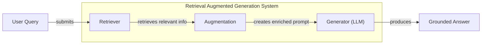
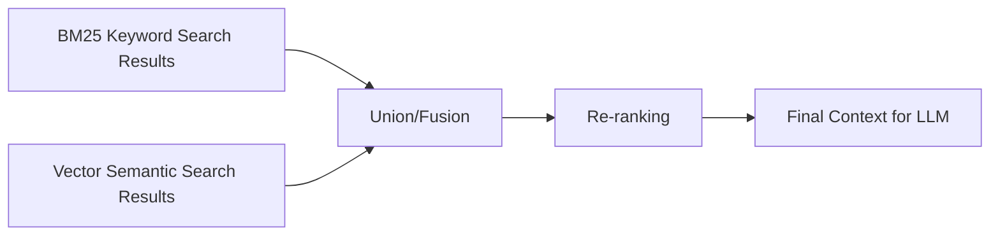
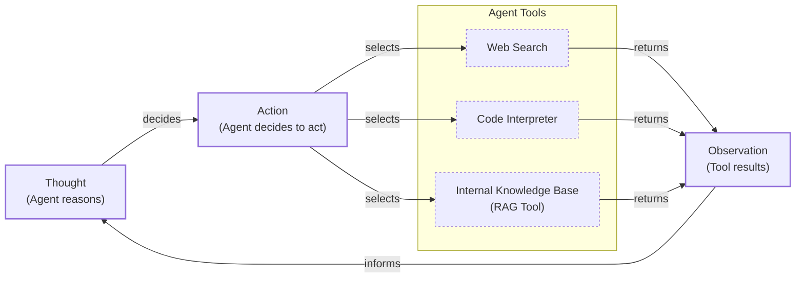

# Lesson 9: Retrieval-Augmented Generation

In our previous lessons, we built a solid foundation in AI Engineering. We explored the agent landscape, distinguished between rule-based workflows and autonomous agents, and, in Lesson 3, covered context engineering. This is the art of managing the information an LLM sees. We have learned how to build agents that can reason and take action. Now, we will tackle one of the most common problems you will face: LLMs are trained on fixed datasets, making their knowledge static. They are essentially taking a "closed-book exam" on the world's information.

When an LLM's training concludes, its knowledge is frozen in time. This leads to two critical failures: it cannot answer questions about events that occurred after its training cutoff, and it tends to "hallucinate," confidently inventing plausible but incorrect information [[1]](https://neo4j.com/blog/developer/fine-tuning-vs-rag/). We do not yet have techniques that allow models to continuously learn from new data after deployment in the same way humans do. While fine-tuning can inject new knowledge, it is an expensive and inefficient process, far from the seamless learning we see in people. A study comparing fine-tuning with RAG found that while fine-tuning offered some improvements, RAG consistently performed better for both existing and new knowledge, highlighting that LLMs struggle to learn new facts through fine-tuning alone [[2]](https://aclanthology.org/2024.emnlp-main.15.pdf).

This is where Retrieval-Augmented Generation (RAG) provides a reliable and practical solution. Instead of trying to update the model's internal weights, we give it an "open-book exam." RAG connects the LLM to external, real-time knowledge sources, allowing it to retrieve relevant information on the fly. Just as a person does not need to memorize every fact and can instead consult manuals, notes, or a quick search, an LLM with RAG can access the information it needs, when it needs it.

As we covered in Lesson 3, RAG is a core method within the broader discipline of context engineering. It is the mechanism by which we select and inject precise, domain-specific knowledge into the LLM's context window. This grounds the model's responses in verifiable facts, drastically reducing hallucinations and making its outputs trustworthy. It is important to distinguish RAG from an agent's memory, which we will explore in our next lesson. While RAG provides access to a static knowledge base, memory systems allow an agent to recall past interactions and learn over time.

In this lesson, we will dissect RAG from the ground up. We will start with its core components and the standard pipeline, then move on to the advanced techniques that separate prototypes from production-ready systems. Finally, we will explore the shift toward agentic RAG, where retrieval becomes an intelligent, dynamic tool in an agent's reasoning loop [[3]](https://blogs.nvidia.com/blog/what-is-retrieval-augmented-generation/).

With the problem and motivation clear, we will first decompose RAG into its core components so you can see where each responsibility lives.

## The RAG System: Core Components

To build effective RAG systems, you first need to understand their fundamental building blocks. As we discussed in Lesson 3 on Context Engineering, managing what the LLM sees is critical, and RAG is the primary tool for injecting external knowledge into that context. At its core, a RAG system can be broken down into three conceptual pillars: Retrieval, Augmentation, and Generation [[4]](https://decodingml.substack.com/p/rag-fundamentals-first?utm_source=publication-search).

**Retrieval** is the engine of the RAG system. Its job is to find the most relevant information from a knowledge base in response to a user's query. The most common approach relies on semantic similarity, which measures the conceptual closeness between the query and the stored information. This is powered by vector embeddings. These are high-dimensional numerical representations of text that capture its meaning. An embedding model converts text into these vectors, which are then stored in a specialized vector database for efficient searching. When a query comes in, it is also converted into a vector, and the database finds the stored vectors that are "closest" in meaning using distance metrics like cosine similarity. An alternative is keyword-based search, using algorithms like BM25, which excels at finding exact term matches [[5]](https://qdrant.tech/articles/what-is-rag-in-ai/).

**Augmentation** is the bridge between retrieval and generation. Once the retriever has found the relevant pieces of information, or "chunks," this step takes that content and combines it with the original user query. The result is an enriched prompt that provides the LLM with the specific context it needs to formulate an answer. This is a critical step in prompt engineering, as the way you structure this information can significantly influence the quality of the final response [[6]](https://www.topquadrant.com/resources/blog-retrieval-augmented-generation-explained/).

**Generation** is the final stage. The augmented prompt, now containing both the user's question and the retrieved context, is sent to an LLM. The LLM’s task is to synthesize this information and generate a coherent, human-readable answer. A key instruction for the LLM is to base its response solely on the provided context. This constraint is what grounds the model, ensuring the answer is factual and verifiable, often with citations pointing back to the source documents [[7]](https://www.infoworld.com/article/2335043/addressing-ai-hallucinations-with-retrieval-augmented-generation.html).

Image 1 illustrates how these three components work together in a seamless flow.



Image 1: A flowchart illustrating the core components and data flow of a Retrieval Augmented Generation (RAG) system.

Now that you can name each moving part, let’s see how they line up across the two phases of a real system.

## The RAG Pipeline: Ingestion and Retrieval

A production-grade RAG system operates in two distinct phases: an offline ingestion pipeline that prepares the knowledge base, and an online retrieval pipeline that answers user queries in real-time. Understanding this separation is key to building and maintaining a scalable system [[8]](https://newsletter.systemdesign.one/p/how-rag-works).

### Phase 1: Offline Ingestion & Indexing

This phase is all about preparing your data to be searchable. It runs in the background, either as a batch process or a streaming pipeline, to keep your knowledge base up-to-date [[4]](https://decodingml.substack.com/p/rag-fundamentals-first?utm_source=publication-search). The process involves four main steps:

1.  **Load:** The first step is to gather documents from your various data sources. These could be PDFs, web pages, database records, or API endpoints. Frameworks offer a wide range of connectors for this, such as LangChain's document loaders or LlamaIndex's readers, which can handle diverse formats and sources like the `BSHTMLLoader` for HTML content.
2.  **Split:** Since LLMs have a limited context window, and retrieval is more precise with focused content, you need to break down large documents into smaller, meaningful pieces called chunks. A naive approach is to split by a fixed character count, but more advanced methods use semantic chunkers or split along natural boundaries like paragraphs or sections to keep related ideas together. Common tools for this include LangChain's `RecursiveCharacterTextSplitter` or LlamaIndex's `SemanticSplitter`.
3.  **Embed:** Each chunk of text is then passed through an embedding model, which converts it into a vector embedding. This numerical representation captures the semantic meaning of the text. The choice of model is critical for retrieval quality. Options range from proprietary models like OpenAI's `text-embedding-3-large/small`, Google's `gemini-text-embedding-004`, and Cohere's Embed, to high-performing open-source models like BGE variants available via Hugging Face.
4.  **Store:** Finally, these embeddings, along with their original text and any associated metadata, are loaded into a vector database. This database indexes the vectors for fast similarity search. For local development, an in-memory store like FAISS is common. For production, scalable options include open-source databases like Milvus, Qdrant, and Weaviate, managed services like Pinecone, or vector-enabled traditional systems like Elasticsearch, OpenSearch, and Azure AI Search.

### Phase 2: Online Retrieval & Generation

This phase happens in real-time, triggered by a user's query. It is the "live" part of the RAG system that interacts with the user [[8]](https://newsletter.systemdesign.one/p/how-rag-works).

1.  **Query:** The user submits a question. This query might first go through a preprocessing step to normalize it or expand it for better retrieval results. Orchestration frameworks like LangChain's `Runnable` chains or LlamaIndex's `QueryEngine` manage this flow.
2.  **Embed:** The user's query is converted into a vector using the *same* embedding model that was used during the ingestion phase. This is crucial for ensuring that the query and the documents are in the same vector space, allowing for a meaningful comparison.
3.  **Search:** The query vector is used to search the vector database. The database performs a similarity search (like cosine similarity) to find the top-k document chunks whose embeddings are most similar to the query's embedding. These are the chunks considered most relevant to the user's question. The search can be enhanced with metadata filters, for example, using Pinecone's filtering capabilities alongside vector similarity.
4.  **Generate:** The system then constructs a new prompt. This prompt typically includes the original user query, the retrieved document chunks as context, and instructions for the LLM on how to answer. The LLM generates a response based on this augmented prompt, ensuring the answer is grounded in the provided information. As we learned in Lesson 4, you can use structured outputs to format the answer and include citations.

Image 2 provides a detailed overview of this entire end-to-end pipeline.

```mermaid
flowchart LR
  %% Phase 1: Offline Ingestion & Indexing
  subgraph "Offline Ingestion & Indexing"
    A["Load<br/>(Documents from various sources)"] --> B["Split<br/>(Content into chunks)"]
    B --> C["Embed<br/>(Chunks into vector embeddings)"]
    C --> D["Store<br/>(Embeddings in a vector database)"]
  end

  %% Phase 2: Online Retrieval & Generation
  subgraph "Online Retrieval & Generation"
    E["Query<br/>(User asks a question)"] --> F["Embed<br/>(Query into a vector)"]
    F --> G["Search<br/>(Similar chunks in vector database)"]
    G --> H["Generate<br/>(LLM produces an answer)"]
  end

  %% Connection between phases
  D -. "indexed data" .-> G

  classDef phaseBox fill:#f9f,stroke:#333,stroke-width:2px
  class "Offline Ingestion & Indexing", "Online Retrieval & Generation" phaseBox
```

Image 2: A detailed flowchart illustrating the two distinct phases of the RAG pipeline: Offline Ingestion & Indexing and Online Retrieval & Generation.

With the end-to-end path in place, the next question is quality. What are the advanced techniques to make the retrieval more accurate and useful across messy, real-world data?

## Advanced RAG Techniques

A naive RAG pipeline is a good starting point, but production systems require more sophisticated techniques to handle the complexities of real-world data and user queries [[9]](https://decodingml.substack.com/p/your-rag-is-wrong-heres-how-to-fix?utm_source=publication-search). These advanced methods focus on improving the quality and relevance of the retrieved context, which directly translates to more accurate and useful LLM responses.

### Hybrid Search

Vector search is powerful for understanding the semantic meaning of a query, but it can sometimes miss exact keywords, acronyms, or specific identifiers. Hybrid search solves this by combining the strengths of semantic (vector) search with traditional keyword-based search, like BM25 [[10]](https://www.chitika.com/hybrid-retrieval-rag/).

This dual approach ensures you get the best of both worlds. For example, if a customer support user searches for "my bill keeps rolling over," keyword search will find articles with the exact term "rollover." At the same time, semantic search can find conceptually similar content, like guides on "carryover balance." By fusing the results from both searches, often using a technique called Reciprocal Rank Fusion (RRF), the system provides a more comprehensive set of documents, covering different ways of phrasing the same issue [[11]](https://redis.io/blog/10-techniques-to-improve-rag-accuracy/).

### Re-ranking

The initial retrieval step is optimized for speed and recall, meaning it aims to quickly find a broad set of potentially relevant documents. However, the best document might not always be at the top of this initial list. Re-ranking introduces a second, more precise scoring step to improve relevance [[12]](https://towardsdatascience.com/advanced-rag-retrieval-cross-encoders-reranking/).

After the first retrieval pass, the top-k results are fed into a re-ranker model, often a cross-encoder like those provided by Cohere. Unlike the initial retrieval model that embeds the query and documents separately, a cross-encoder examines the query and a candidate document *together*, allowing for a deeper, more contextual assessment of relevance. For a product help query like "how to connect my account," the re-ranker can intelligently promote a step-by-step setup guide above a less useful press release or a tangentially related community forum thread, ensuring the most useful information is prioritized for the LLM [[11]](https://redis.io/blog/10-techniques-to-improve-rag-accuracy/).

Image 3 illustrates how hybrid search and re-ranking work in tandem.



Image 3: A flowchart illustrating the hybrid retrieval flow.

### Query Transformations

Sometimes, the user's query is not the best input for the retrieval system. Query transformation techniques rewrite or expand the query to improve its chances of matching the right documents [[9]](https://decodingml.substack.com/p/your-rag-is-wrong-heres-how-to-fix?utm_source=publication-search).

-   **Decomposition:** This method breaks down a complex, multi-part question into several simpler sub-questions. For instance, the query "What’s our travel policy for conferences in Europe this year?" could be decomposed into: "Where is the travel policy document?", "What defines a conference?", "What are the specific rules for Europe?", and "What has changed this year?". The system retrieves documents for each sub-question and then merges the results to form a complete context [[13]](https://docs.nvidia.com/rag/latest/query_decomposition.html).
-   **Hypothetical Document Embeddings (HyDE):** This technique involves generating a hypothetical, ideal answer to the user's query *before* performing the retrieval. For example, if the query is about travel policies, the system might generate a short paragraph like: "Employees attending approved conferences in Europe can book economy flights and stay up to three nights, with specific daily meal limits." This hypothetical document, written in the language of the knowledge base, is then embedded and used for the similarity search, often leading to more relevant results than the original, shorter query [[14]](https://47billion.com/blog/rag-system-in-production-why-it-fails-and-how-to-fix-it/).

### Advanced Chunking Strategies

How you split your documents can have a massive impact on retrieval quality. Naive fixed-size chunking often cuts sentences or ideas in half, separating related context.

-   **Semantic Chunking:** A better approach is to split documents based on semantic boundaries. For instance, splitting by sections or paragraphs ensures that a complete thought, like the "Reimbursements" section of a handbook, remains in a single chunk. This prevents the LLM from receiving fragmented information, such as a policy rule without its corresponding monetary cap [[15]](https://cloudurable.com/blog/advanced-rag-techniques-that-will-transform-your-l/).
-   **Layout-Aware Chunking:** For documents with complex structures like tables or forms, this method preserves the original layout. When processing a pricing table, it keeps each row intact (e.g., `product -> price -> discount`), preventing the system from separating numbers from their labels.
-   **Context-Enriched Chunking:** Also known as contextual retrieval, this technique prepends each chunk with a summary of its parent document or section. This gives the embedding model more context, helping it to create a more representative vector and improving retrieval accuracy, especially for chunks that are ambiguous on their own.

### GraphRAG

For questions about complex relationships and interconnected data, standard document retrieval often falls short. GraphRAG addresses this by first constructing a knowledge graph from the documents, where entities (like people, companies, or products) are nodes and their relationships are edges. This structured representation allows the system to answer multi-hop questions that require reasoning across multiple documents or data points [[16]](https://arxiv.org/html/2404.16130).

For example, to answer a retail query like "Which shoes get the most size-related returns and were featured in last month’s ads?", a GraphRAG system can traverse the graph: from `return records` to `reason: sizing`, to specific `shoe SKUs`, and then link those SKUs to the `marketing calendar`. For IT operations, a query such as "Which incidents were caused by weekend deploys that also touched the login service?" would involve linking `change records` to `deploy time`, then to the `affected service`, and finally to `incident tickets` to surface the relevant post-mortems. This allows it to assemble a precise and connected context that would be nearly impossible to gather with simple vector search alone.

These techniques increase retrieval quality. Next, we’ll see how retrieval becomes one tool that an agent can choose to use as it reasons.

## Agentic RAG

In Lessons 7 and 8, we explored the ReAct framework, where an agent cycles through a loop of Thought, Action, and Observation to solve problems. Agentic RAG applies this paradigm to information retrieval. It is essentially a ReAct-style agent that has been equipped with a retrieval tool [[17]](https://weaviate.io/blog/what-is-agentic-rag). Instead of following a fixed pipeline, the agent *reasons* about when it has a knowledge gap and *decides* when and how to use its retrieval capabilities.

It is important to clarify that an agent typically has access to many tools, such as web search, code execution, or database queries. The RAG tool is just one of these. Labeling an entire system "agentic RAG" can be a bit narrow; it is more accurate to think of it as an agent that *uses* RAG [[18]](https://www.llamaindex.ai/blog/rag-is-dead-long-live-agentic-retrieval).

The core distinction between standard and agentic RAG lies in their control flow:

-   **Standard RAG** is a linear, predetermined workflow: Retrieve → Augment → Generate. It is powerful but rigid, following the same path for every query.
-   **Agentic RAG** is adaptive and iterative. The agent is in control, deciding when to retrieve, what to retrieve, and whether one retrieval is enough. This transforms RAG from a simple database lookup into a dynamic conversation with a knowledge base [[19]](https://towardsdatascience.com/agentic-rag-vs-classic-rag-from-a-pipeline-to-a-control-loop/).

An agentic approach unlocks several advanced capabilities:

-   **Iterative Refinement:** The agent can use the RAG tool multiple times in a loop. If the initial results are too vague, it can refine its query and retrieve again. For example, an initial search for "EU policy" might yield a broad overview. The agent can then narrow its scope to "EU data privacy policy for customers, 2024 updates" and re-query to get more specific documents.
-   **Tool Selection:** If multiple knowledge sources are available, the agent can choose the most appropriate one. For an IT outage, it might decide to `search_incident_runbooks` instead of `search_marketing_pages` [[17]](https://weaviate.io/blog/what-is-agentic-rag).
-   **Information Fusion:** The agent can combine information from its RAG tool with outputs from other tools. It could retrieve an internal policy document and then use a web search tool to check for recent regulatory changes before synthesizing a final answer.
-   **Knowledge Base Updates:** An advanced agent can even decide to update the knowledge base with new information it learns, a concept we will explore further in Lesson 10 on memory.

Consider this conceptual thought process for an agent handling a complex query:
*Thought: User asks about ‘2024 EU data retention rules’—our internal policy cites 2023. Likely outdated.*
*Action: retrieve(internal_policy, query=“EU data retention 2024”)*
*Observation: Mentions amendments but missing citations.*
*Thought: Need external verification.*
*Action: web_search(“EU data retention 2024 official”)*
*Observation: Finds directive update.*
*Thought: Synthesize and cite both; highlight changes from 2023.*

This iterative reasoning process is what separates a simple RAG pipeline from an intelligent research assistant, as illustrated in Image 4.



Image 4: A conceptual Mermaid diagram illustrating an agent's main loop in an Agentic RAG system.

You now understand both a linear RAG pipeline and how an agent can control retrieval when needed. Let’s wrap up by situating RAG in the wider AI Engineering toolkit and previewing what comes next.

## Conclusion

In this lesson, we have journeyed from the fundamentals of RAG to its advanced and agentic forms. We have seen that RAG is the most widely used and reliable solution to the inherent knowledge limitations of LLMs. By grounding models in external data, we can significantly reduce hallucinations, enable customization with proprietary information, and build user trust through verifiable, source-based answers.

The key takeaways are clear: a naive RAG pipeline is just the beginning. Production-grade quality requires advanced techniques like hybrid search, re-ranking, and intelligent chunking. The future of information retrieval is agentic, where RAG transforms from a static pipeline into a dynamic tool that an intelligent agent can use as part of a broader reasoning process. RAG is not a niche skill but a foundational competency for the modern AI Engineer and a critical component of context engineering.

In our next lesson, we will explore Memory for Agents. You will learn how short-term and long-term memory systems complement retrieval, allowing agents to not only access static knowledge but also to remember past interactions and learn from experience. We also touched on other important topics like evaluation and monitoring, which are crucial for maintaining the quality of your RAG systems in production. We will cover these in dedicated lessons later in the course.

## References

- [1] https://neo4j.com/blog/developer/fine-tuning-vs-rag/
- [2] https://aclanthology.org/2024.emnlp-main.15.pdf
- [3] https://blogs.nvidia.com/blog/what-is-retrieval-augmented-generation/
- [4] https://decodingml.substack.com/p/rag-fundamentals-first?utm_source=publication-search
- [5] https://qdrant.tech/articles/what-is-rag-in-ai/
- [6] https://www.topquadrant.com/resources/blog-retrieval-augmented-generation-explained/
- [7] https://www.infoworld.com/article/2335043/addressing-ai-hallucinations-with-retrieval-augmented-generation.html
- [8] https://newsletter.systemdesign.one/p/how-rag-works
- [9] https://decodingml.substack.com/p/your-rag-is-wrong-heres-how-to-fix?utm_source=publication-search
- [10] https://www.chitika.com/hybrid-retrieval-rag/
- [11] https://redis.io/blog/10-techniques-to-improve-rag-accuracy/
- [12] https://towardsdatascience.com/advanced-rag-retrieval-cross-encoders-reranking/
- [13] https://docs.nvidia.com/rag/latest/query_decomposition.html
- [14] https://47billion.com/blog/rag-system-in-production-why-it-fails-and-how-to-fix-it/
- [15] https://cloudurable.com/blog/advanced-rag-techniques-that-will-transform-your-l/
- [16] https://arxiv.org/html/2404.16130
- [17] https://weaviate.io/blog/what-is-agentic-rag
- [18] https://www.llamaindex.ai/blog/rag-is-dead-long-live-agentic-retrieval
- [19] https://towardsdatascience.com/agentic-rag-vs-classic-rag-from-a-pipeline-to-a-control-loop/