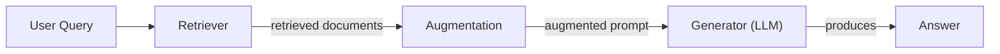
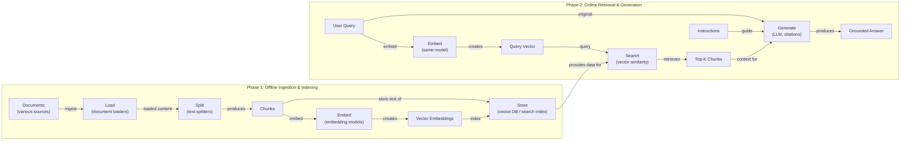
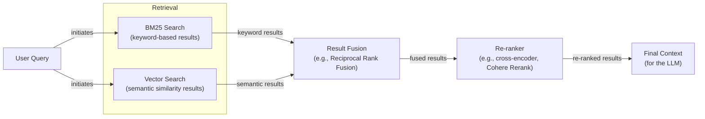
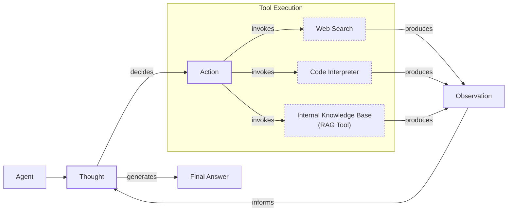

# Lesson 9: Retrieval-Augmented Generation

In our previous lessons, we built a solid foundation in AI Engineering. We covered context engineering, the art of managing the information flow to an LLM, and saw how agents use tools and reasoning frameworks like ReAct to perform complex tasks. Now, we will tackle one of the most critical challenges in building knowledgeable AI systems: the limitations of an LLM's internal, or parameterized, knowledge.

LLMs are trained on a fixed dataset, which means they are effectively taking a "closed-book exam" on the world's information up to a certain point in time. This static knowledge base leads to two major problems: the model is unaware of recent events, and it can "hallucinate," confidently inventing facts when it does not know the answer. We do not yet have techniques to enable models to continuously learn new information by updating their weights after deployment, at least not in a way that is as efficient as human learning. Fine-tuning is an option, but it is expensive, slow, and needs to be repeated every time the data changes.

This is where Retrieval-Augmented Generation (RAG) comes in. RAG is a technique that gives the LLM an "open-book exam." Instead of relying on memorized facts, the model is connected to external, real-time knowledge sources. Just as we use manuals or cheat sheets to perform complex tasks without memorizing every detail, RAG allows an LLM to retrieve relevant information on the fly and use it to construct an answer [[1]](https://blogs.nvidia.com/blog/what-is-retrieval-augmented-generation/).

RAG is a core method within the discipline of context engineering we discussed in Lesson 3. It is a powerful tool for curating the information we pass to an LLM. While RAG provides the external knowledge, it is distinct from an agent's memory, which is a concept we will explore in our next lesson. Memory deals with recalling past interactions and user preferences, complementing the factual retrieval that RAG provides.

In this lesson, we will explore the fundamentals of RAG, starting with its core components and the end-to-end pipeline. We will then dive into the advanced techniques that separate production-grade systems from simple prototypes. Finally, we will see how RAG evolves into a powerful tool within the agentic systems we have been building.

## The RAG System: Core Components

To build effective RAG systems, you first need to understand their three conceptual pillars. Mastering these components is a critical step in the context engineering process, as it allows you to design systems that are both knowledgeable and reliable.

The three pillars are **Retrieval**, **Augmentation**, and **Generation**.

**Retrieval** is the engine responsible for finding relevant information from an external knowledge base [[2]](https://towardsai.net/p/l/a-complete-guide-to-rag). When a user asks a question, the retrieval system searches through documents, databases, or other data sources to find the pieces of information most likely to contain the answer. The most common approach is semantic search, which relies on vector embeddings to find text that is contextually similar in meaning, even if the wording is different [[3]](https://medium.com/@robi.tomar72/how-rag-actually-works-embeddings-vector-databases-indexing-retrieval-explained-simply-3d1ca45fe1bf). These embeddings are numerical representations of text stored in a specialized vector database, which allows for efficient similarity searches [[4]](https://qdrant.tech/articles/what-is-rag-in-ai/).

**Augmentation** is the process of taking the information found by the retriever and preparing it for the LLM. This involves formatting the retrieved text chunks and combining them with the original user query into a single, comprehensive prompt [[5]](https://www.topquadrant.com/resources/blog-retrieval-augmented-generation-explained/). The goal is to provide the LLM with all the necessary context it needs to generate a factually grounded response.

**Generation** is the final step. The LLM receives the augmented prompt—containing both the user's question and the retrieved context—and uses it to generate a final answer [[6]](https://www.promptingguide.ai/research/rag). Because the model is instructed to base its response on the provided information, the answer is grounded in the external data source. This significantly reduces the risk of hallucination and allows the system to cite its sources, building user trust [[7]](https://neo4j.com/blog/developer/fine-tuning-vs-rag/).

Image 1: A flowchart illustrating the core components and conceptual flow of a Retrieval Augmented Generation (RAG) system.

Understanding these three components provides a clear mental model for how RAG works. Now that you can name each moving part, let’s see how they line up across the two phases of a real system.

## The RAG Pipeline: Ingestion and Retrieval

A production-ready RAG system is more than just a single call to a database. It is an end-to-end pipeline split into two distinct phases: an offline ingestion phase, where data is prepared, and an online retrieval phase, where answers are generated in real-time [[8]](https://medium.com/@derrickryangiggs/rag-pipeline-deep-dive-ingestion-chunking-embedding-and-vector-search-abd3c8bfc177).

### Phase 1: Offline Ingestion & Indexing

The ingestion phase is where you prepare your knowledge base for retrieval. This is a critical offline process that transforms your raw documents into a searchable format. It involves four main steps [[9]](https://newsletter.systemdesign.one/p/how-rag-works).

First, you **load** your documents. This involves reading data from various sources, which could be anything from PDFs and text files to web pages or API endpoints. Tools like LangChain's document loaders or LlamaIndex's readers are commonly used to handle different file formats [[8]](https://medium.com/@derrickryangiggs/rag-pipeline-deep-dive-ingestion-chunking-embedding-and-vector-search-abd3c8bfc177).

Next, you **split** the loaded content into smaller, more manageable pieces, or "chunks." This is a crucial step because LLMs have limited context windows, and sending an entire document is often impractical. More importantly, smaller chunks allow for more precise retrieval. Instead of finding a 10-page document where only one paragraph is relevant, you can pinpoint the exact paragraph. This can be done with simple rule-based splitters or more advanced semantic chunkers that avoid breaking text in the middle of an idea [[8]](https://medium.com/@derrickryangiggs/rag-pipeline-deep-dive-ingestion-chunking-embedding-and-vector-search-abd3c8bfc177).

Once your documents are chunked, you **embed** each chunk. An embedding model, such as OpenAI's `text-embedding-3-small` or open-source alternatives from Hugging Face, converts the text of each chunk into a vector—a list of numbers that captures its semantic meaning [[10]](https://apxml.com/courses/prompt-engineering-llm-application-development/chapter-6-integrating-llms-external-data-rag/implementing-semantic-search-retrieval).

Finally, you **store** these embeddings, along with their original text, in a vector database. This specialized database, like FAISS, Milvus, or Qdrant, indexes the vectors for efficient similarity search, allowing the system to quickly find the chunks that are most semantically similar to a user's query [[11]](https://qdrant.tech/articles/what-is-rag-in-ai/).

### Phase 2: Online Retrieval & Generation

This phase happens in real-time when a user interacts with your application.

It starts when a user submits a **query**. This query is then **embedded** using the exact same model that was used during the ingestion phase. This ensures that the query and the document chunks are represented in the same vector space, making them comparable [[10]](https://apxml.com/courses/prompt-engineering-llm-application-development/chapter-6-integrating-llms-external-data-rag/implementing-semantic-search-retrieval).

The system then **searches** the vector database. It takes the query vector and uses a similarity metric, like cosine similarity, to find the top-k most similar document chunk vectors in the database [[12]](https://towardsdatascience.com/rag-explained-understanding-embeddings-similarity-and-retrieval/542038753231). These top-k chunks are the most relevant pieces of information for answering the user's query.

In the final step, the system **generates** an answer. It constructs a prompt that includes the original user query, the retrieved chunks as context, and instructions for the LLM. The LLM then generates a response that is grounded in the provided context. As we learned in Lesson 4, you can use structured outputs to ensure the answer includes citations, which trace back to the original source documents [[13]](https://decodingml.substack.com/p/rag-fundamentals-first?utm_source=publication-search).

Image 2: A detailed flowchart illustrating the end-to-end RAG workflow, separated into offline ingestion and online retrieval phases.

With the end-to-end path in place, the next question is quality. What are the advanced techniques to make retrieval more accurate and useful across messy, real-world data?

## Advanced RAG Techniques

A naive RAG pipeline is a great starting point, but production systems require more sophisticated techniques to handle the complexities of real-world data and user queries. These advanced strategies focus on improving the quality and relevance of the retrieved context, ensuring the LLM has the best possible information to work with [[14]](https://decodingml.substack.com/p/your-rag-is-wrong-heres-how-to-fix?utm_source=publication-search).

### Hybrid Search

Vector search is powerful for understanding semantic meaning, but it can sometimes miss specific keywords, acronyms, or ID numbers. Hybrid search solves this by combining the strengths of semantic (vector) search with traditional keyword-based search, like BM25 [[15]](https://mlpills.substack.com/p/issue-76-optimize-rag-with-hybrid). BM25 excels at finding documents with exact term matches. By fusing the results from both methods, often using an algorithm like Reciprocal Rank Fusion (RRF), the system can retrieve a more comprehensive set of documents that are both semantically and lexically relevant [[16]](https://cubitrek.com/blog/hybrid-search-optimization-how-bm25-and-dense-vector-retrieval-work-together-for-superior-ai-search/).

For example, if a customer support bot receives the query "my bill keeps rolling over," a keyword search will find articles containing the exact term "rollover." A semantic search might also surface guides about a "carryover balance." Hybrid search ensures both are retrieved, providing complete coverage.

Image 3: A flowchart illustrating the hybrid retrieval flow.

### Re-ranking

The initial retrieval step is optimized for speed and recall, meaning it casts a wide net to find potentially relevant documents. However, the top-k results are not always ordered by true relevance. Re-ranking introduces a second, more precise filtering stage. A re-ranker model, typically a cross-encoder, takes the user query and each retrieved document as a pair and computes a more accurate relevance score [[17]](https://redis.io/blog/10-techniques-to-improve-rag-accuracy/). This allows the system to re-order the documents and send only the most relevant ones to the LLM, improving the final answer's quality.

For a product help query like "how to connect my account," the initial retrieval might pull a press release and a community forum thread along with the official setup guide. A re-ranker would identify the step-by-step guide as the most relevant and push it to the top of the list.

### Query Transformations

Sometimes, the user's query is not in the best format for retrieval. Query transformation techniques rewrite or decompose the original query to improve the search results.

**Decomposition** breaks a complex, multi-faceted question into several simpler sub-questions [[18]](https://docs.nvidia.com/rag/latest/query_decomposition.html). The system retrieves documents for each sub-question and then synthesizes the information to answer the original query. For example, "What’s our travel policy for conferences in Europe this year?" could be broken down into "What is the travel policy?", "What are the rules for conferences?", and "Are there specific rules for Europe for the current year?".

**Hypothetical Document Embeddings (HyDE)** is another technique where, instead of directly embedding the user's query, an LLM first generates a hypothetical, ideal answer [[19]](https://neo4j.com/blog/genai/advanced-rag-techniques/). This generated document is then embedded and used for the similarity search. The idea is that this hypothetical document is likely to be semantically closer to the actual relevant documents in the vector space.

### Advanced Chunking Strategies

How you split documents into chunks has a huge impact on retrieval quality. Simple fixed-size chunking can awkwardly split a sentence or a paragraph, separating context from content.

**Semantic chunking** addresses this by splitting text based on semantic shifts, ensuring that related sentences stay together. **Layout-aware chunking** is even more sophisticated, designed for complex documents like PDFs with tables, headers, and footnotes. It preserves the document's structure, preventing a price in a table from being separated from its corresponding product name, for example. Another approach is **context-enriched chunking**, where each chunk is prepended with a summary of its parent document, ensuring that even small snippets retain their broader context [[20]](https://www.anthropic.com/news/contextual-retrieval).

### GraphRAG

For questions about complex relationships and interconnected data, standard document retrieval can fall short. GraphRAG addresses this by structuring knowledge into a graph, with entities as nodes and relationships as edges. This approach has roots in the semantic web technologies of the 1990s, which led to the development of large-scale knowledge graphs like DBpedia and Google's Knowledge Graph [[26]](https://www.semantic-web-journal.net/system/files/swj3862.pdf).

While standard RAG is often faster to deploy with existing documents, knowledge graphs excel at multi-hop reasoning and providing explainable answers for relationship-dependent queries [[27]](https://atlan.com/know/knowledge-graphs-vs-rag-for-ai/). Instead of just a vector search, the system can explicitly query the graph for relevant entities and their connections [[28]](https://www.gooddata.com/blog/from-rag-to-graphrag-knowledge-graphs-ontologies-and-smarter-ai/). This allows it to answer multi-hop questions that require traversing these connections. More advanced implementations even create hierarchical graphs with entity- and document-level nodes, or use agents to dynamically update the graph with new information [[29]](https://arxiv.org/html/2506.18019v1).

For instance, to answer, "Which incidents were caused by weekend deploys that also touched the login service?", a GraphRAG system can traverse the knowledge graph from "incident tickets" to "change records," filtering by "deploy time" and "affected service" to find the answer. This is far more effective than trying to find a single document chunk that happens to mention all these elements together [[22]](https://arxiv.org/html/2501.00309v2).

These techniques increase retrieval quality. Next, we’ll see how retrieval becomes one tool that an agent can choose to use as it reasons.

## Agentic RAG

In Lessons 7 and 8, we explored the ReAct framework, where an agent cycles through a loop of Thought, Action, and Observation. Agentic RAG is the practical application of this concept, where retrieval is not a fixed step in a pipeline but a tool that a reasoning agent can choose to use [[23]](https://www.ibm.com/think/topics/agentic-rag). This approach is inspired by cognitive architectures from AI research, which model human-like reasoning through planning, memory, and reflection [[30]](https://www.ibm.com/think/topics/agentic-architecture).

The distinction between standard and agentic RAG is fundamental. Standard RAG is a linear, predetermined workflow: Retrieve → Augment → Generate. It is powerful but rigid. Agentic RAG, on the other hand, is an adaptive and iterative process. The agent decides *when* to retrieve, *what* to retrieve, and whether one retrieval is enough [[24]](https://towardsdatascience.com/agentic-rag-vs-classic-rag-from-a-pipeline-to-a-control-loop/).

This approach unlocks several advanced capabilities. An agent can **iteratively** refine its search. If the first set of retrieved documents is too vague, it can generate a more specific query and try again. It can **choose** which knowledge source to search, for instance, deciding whether to query internal technical documents or the company's public-facing marketing site. It can also **fuse** information from multiple tools, combining internal knowledge from its RAG tool with real-time data from a web search to form a more complete answer [[25]](https://weaviate.io/blog/what-is-agentic-rag).

Let's consider a conceptual thought process for an agent handling a complex query:

*   **User Query:** "What are the latest EU data retention rules for our product, and how do they differ from last year's policy?"
*   **Thought 1:** The user is asking about "2024 EU data retention rules." My internal knowledge base has a policy, but I should check if it's the most recent one.
*   **Action 1:** `retrieve_internal_docs(query="EU data retention policy 2024")`
*   **Observation 1:** Retrieved internal policy document from 2023. It mentions amendments are expected in 2024 but provides no details.
*   **Thought 2:** The internal document is outdated. I need to find the official 2024 regulations. I will use the web search tool.
*   **Action 2:** `web_search(query="Official EU data retention directive 2024")`
*   **Observation 2:** Found a link to the official EU directive published this year.
*   **Thought 3:** I now have both the old internal policy and the new external directive. I can compare them to identify the changes and synthesize a comprehensive answer, citing both sources.
*   **Final Answer:** The agent generates a detailed response outlining the new rules and highlighting the key differences from the 2023 policy.

This is the difference between a simple database lookup and a conversation with a knowledgeable research assistant. The agent doesn't just fetch data; it reasons about it, verifies it, and synthesizes it into a trustworthy answer. However, this flexibility introduces trade-offs. Each reasoning step adds latency and computational cost, a reality that must be balanced against the gains in answer quality [[31]](https://www.algolia.com/blog/ai/agentic-retrieval).

Image 4: A conceptual flowchart illustrating an agent's main loop in an Agentic RAG system.

You now understand both a linear RAG pipeline and how an agent can control retrieval when needed. Let’s wrap up by situating RAG in the wider AI Engineering toolkit and previewing what comes next.

## Conclusion

We have journeyed from the fundamentals of RAG to the sophisticated, agentic patterns that define modern AI systems. The key takeaway is that RAG is the most widely used and reliable solution to the LLM knowledge problem. It grounds models in factual data, reduces hallucinations, and builds user trust through verifiable, source-backed answers. For production-grade quality, advanced techniques like hybrid search and re-ranking are essential.

Ultimately, the future of knowledge retrieval is agentic. By treating RAG as a tool within a reasoning loop, we empower AI systems to move beyond simple lookups and become dynamic research assistants. This positions RAG not as a niche skill, but as a foundational competency for the modern AI Engineer and a core component of context engineering.

In our next lesson, we will explore Memory for Agents. We will see how short-term and long-term memory systems complement retrieval, allowing agents to remember past interactions and build a more personalized experience. Further on in the course, we will also cover how to evaluate and monitor these complex systems. Evaluating agentic RAG is an open research challenge; traditional metrics fall short because they do not account for the multi-step reasoning process [[32]](https://toloka.ai/blog/agentic-rag-systems-for-enterprise-scale-information-retrieval/). The key question is not just "Was the final answer correct?" but "Did the agent take the right steps to get there?" This has led to new patterns like using powerful LLMs as judges to assess faithfulness and precision at scale [[33]](https://aiamastery.substack.com/p/lesson-44-evaluating-agentic-rag).

## References

- [1] https://blogs.nvidia.com/blog/what-is-retrieval-augmented-generation/
- [2] https://towardsai.net/p/l/a-complete-guide-to-rag
- [3] https://medium.com/@robi.tomar72/how-rag-actually-works-embeddings-vector-databases-indexing-retrieval-explained-simply-3d1ca45fe1bf
- [4] https://qdrant.tech/articles/what-is-rag-in-ai/
- [5] https://www.topquadrant.com/resources/blog-retrieval-augmented-generation-explained/
- [6] https://www.promptingguide.ai/research/rag
- [7] https://neo4j.com/blog/developer/fine-tuning-vs-rag/
- [8] https://medium.com/@derrickryangiggs/rag-pipeline-deep-dive-ingestion-chunking-embedding-and-vector-search-abd3c8bfc177
- [9] https://newsletter.systemdesign.one/p/how-rag-works
- [10] https://apxml.com/courses/prompt-engineering-llm-application-development/chapter-6-integrating-llms-external-data-rag/implementing-semantic-search-retrieval
- [11] https://qdrant.tech/articles/what-is-rag-in-ai/
- [12] https://towardsdatascience.com/rag-explained-understanding-embeddings-similarity-and-retrieval/542038753231
- [13] https://decodingml.substack.com/p/rag-fundamentals-first?utm_source=publication-search
- [14] https://decodingml.substack.com/p/your-rag-is-wrong-heres-how-to-fix?utm_source=publication-search
- [15] https://mlpills.substack.com/p/issue-76-optimize-rag-with-hybrid
- [16] https://cubitrek.com/blog/hybrid-search-optimization-how-bm25-and-dense-vector-retrieval-work-together-for-superior-ai-search/
- [17] https://redis.io/blog/10-techniques-to-improve-rag-accuracy/
- [18] https://docs.nvidia.com/rag/latest/query_decomposition.html
- [19] https://neo4j.com/blog/genai/advanced-rag-techniques/
- [20] https://www.anthropic.com/news/contextual-retrieval
- [21] https://arxiv.org/html/2404.16130
- [22] https://arxiv.org/html/2501.00309v2
- [23] https://www.ibm.com/think/topics/agentic-rag
- [24] https://towardsdatascience.com/agentic-rag-vs-classic-rag-from-a-pipeline-to-a-control-loop/
- [25] https://weaviate.io/blog/what-is-agentic-rag
- [26] https://www.semantic-web-journal.net/system/files/swj3862.pdf
- [27] https://atlan.com/know/knowledge-graphs-vs-rag-for-ai/
- [28] https://www.gooddata.com/blog/from-rag-to-graphrag-knowledge-graphs-ontologies-and-smarter-ai/
- [29] https://arxiv.org/html/2506.18019v1
- [30] https://www.ibm.com/think/topics/agentic-architecture
- [31] https://www.algolia.com/blog/ai/agentic-retrieval
- [32] https://toloka.ai/blog/agentic-rag-systems-for-enterprise-scale-information-retrieval/
- [33] https://aiamastery.substack.com/p/lesson-44-evaluating-agentic-rag