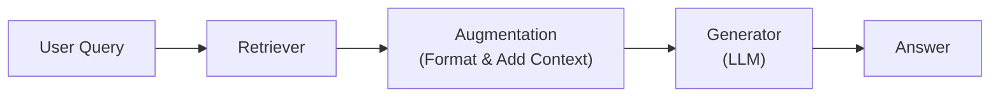
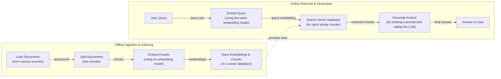
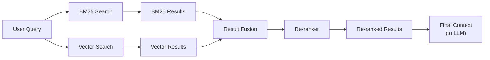
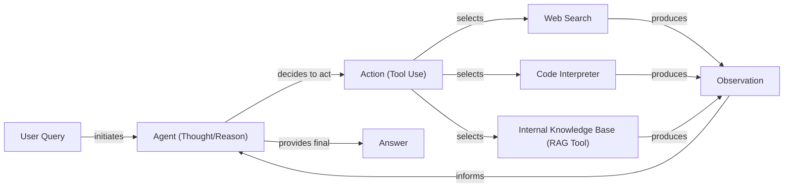

# Retrieval-Augmented Generation (RAG)

In our previous lessons, we explored the landscape of AI engineering, distinguished between LLM workflows and agents, and covered the fundamentals of context engineering. We learned that managing the information flow to an LLM is a core discipline for building complex AI applications. Now, we will dive into one of the most critical methods in an AI Engineer's toolkit: Retrieval-Augmented Generation (RAG).

LLMs are trained on a fixed dataset, which means their knowledge is static and can become outdated. During their training, they are essentially taking a "closed-book exam" on the world's information. This static knowledge leads to two major problems: the model cannot answer questions about recent events, and it is prone to "hallucination," where it confidently invents incorrect information because of deficiencies in its training data [[14]](https://www.infoworld.com/article/2335043/addressing-ai-hallucinations-with-retrieval-augmented-generation.html). We do not yet have efficient techniques to enable models to learn new information over time after deployment. While we can fine-tune them, this process is not as efficient as human learning. The ideal scenario would be to allow models to learn from experience, but we are not there yet.

RAG offers a reliable solution. Instead of relying on the model's limited internal knowledge, we can insert new, relevant information directly into the context window [[12]](https://neo4j.com/blog/developer/fine-tuning-vs-rag/). With RAG, we are giving the LLM an "open-book exam" by connecting it to external, real-time knowledge sources. Just as humans do not need to memorize everything and can use manuals or cheat sheets, LLMs can use RAG to access the information they need on demand. This approach provides verifiable sources for the model's answers, which builds user trust [[1]](https://blogs.nvidia.com/blog/what-is-retrieval-augmented-generation/).

As we covered in Lesson 3, RAG is a key method for context engineering. It is how we curate the information an LLM sees. This lesson will explore the "what" and "how" of basic RAG before moving on to the advanced and agentic patterns that power modern AI systems. It is important to distinguish RAG from an agent's internal memory. RAG focuses on retrieving information from external knowledge bases, which are often large and relatively static. In contrast, an agent's memory, which we will cover in Lesson 10, deals with storing and recalling information from its own past interactions, such as conversation history and user preferences. These two systems are complementary: RAG provides the facts, while memory provides the conversational context.

## The RAG System: Core Components

To design effective RAG systems, you first need to understand their core components. This is the first step in the context engineering process we discussed in Lesson 3. Conceptually, RAG can be broken down into three pillars: Retrieval, Augmentation, and Generation.

**Retrieval** is the engine responsible for finding relevant information. When a user asks a question, the retrieval system searches an external knowledge base to find documents or data snippets that are likely to contain the answer. This search is often powered by semantic similarity. The process begins by converting both the query and the documents into numerical representations called vector embeddings [[31]](https://qdrant.tech/articles/what-is-rag-in-ai/). These embeddings are high-dimensional vectors that capture the meaning of the text. They are stored in a specialized vector database, which is optimized for performing fast and scalable similarity searches [[29]](https://pub.towardsai.net/vector-databases-in-practice-building-a-realistic-hybrid-search-rag-system-with-qdrant-7b8f4a6e41e0). The system then finds the vectors that are "closest" in meaning to the query vector. Keyword-based search methods like BM25 can also be used to find exact matches for specific terms.

**Augmentation** is the process of taking the information found by the retriever and preparing it for the LLM. This involves more than just combining text; it is about constructing a clear and effective prompt [[24]](https://www.ibm.com/think/topics/retrieval-augmented-generation). Typically, a prompt template is used to structure the information. This template includes the original user query, the retrieved document excerpts, and specific instructions for the LLM, such as "Using the context above, answer the question. If the context does not contain the answer, say so" [[51]](https://www.topquadrant.com/resources/blog-retrieval-augmented-generation-explained/). This step is crucial for guiding the LLM to generate a response that is grounded in the provided data.

**Generation** is the final step. The LLM receives the augmented prompt, which now contains both the user's question and the relevant external information. The model acts as a reasoning engine, synthesizing the retrieved facts into a coherent, human-readable answer [[23]](https://humanloop.com/blog/rag-architectures). Because the answer is based on the provided data, it is "grounded" in facts, which greatly reduces the risk of hallucination. Furthermore, since the system knows which documents were used, it can provide citations, allowing users to verify the information for themselves.

Image 1: A flowchart illustrating the core conceptual pillars of a Retrieval Augmented Generation (RAG) system.

Now that you can name each moving part, let’s see how they line up across the two phases of a real system.

## The RAG Pipeline: Ingestion and Retrieval

A complete RAG pipeline is divided into two distinct phases: an offline ingestion phase, where you prepare your knowledge base, and an online retrieval phase, where you answer user queries in real-time [[25]](https://medium.com/@derrickryangiggs/rag-pipeline-deep-dive-ingestion-chunking-embedding-and-vector-search-abd3c8bfc177).

### Phase 1: Offline Ingestion & Indexing

This phase is all about preparing your documents so they can be searched efficiently. It is typically run as a batch process whenever your knowledge base is created or updated [[26]](https://newsletter.systemdesign.one/p/how-rag-works).

1.  **Load:** The first step is to load your documents from their various sources. This could include local files (PDFs, text files), content from web pages, or records from enterprise systems like Confluence and SharePoint [[25]](https://medium.com/@derrickryangiggs/rag-pipeline-deep-dive-ingestion-chunking-embedding-and-vector-search-abd3c8bfc177). Tools like LangChain's document loaders or LlamaIndex's readers can handle this data extraction.
2.  **Split:** Since LLMs have a limited context window, you cannot feed them entire documents at once. Instead, you split the content into smaller, meaningful pieces called chunks. The size of these chunks is a critical trade-off: smaller chunks (100-256 tokens) are better for precise semantic matching, while larger chunks (1024+ tokens) provide more context for the LLM to generate a coherent answer [[25]](https://medium.com/@derrickryangiggs/rag-pipeline-deep-dive-ingestion-chunking-embedding-and-vector-search-abd3c8bfc177). A common practice is to use an overlap of 10-20% between chunks to ensure that information is not lost across boundaries [[36]](https://medium.com/@robi.tomar72/how-rag-actually-works-embeddings-vector-databases-indexing-retrieval-explained-simply-3d1ca45fe1bf).
3.  **Embed:** Each chunk is then converted into a vector embedding using an embedding model. This numerical representation captures the semantic meaning of the text. Popular models include OpenAI's `text-embedding-3` series, Google's `text-embedding-004`, and open-source models like `all-MiniLM-L6-v2` or other Sentence-BERT (SBERT) variants available through Hugging Face [[25]](https://medium.com/@derrickryangiggs/rag-pipeline-deep-dive-ingestion-chunking-embedding-and-vector-search-abd3c8bfc177).
4.  **Store:** Finally, the embeddings and their corresponding text chunks are loaded into a vector database. This database indexes the embeddings for fast and scalable similarity search, allowing the system to quickly find the most relevant chunks for a given query. Examples include local libraries like FAISS or production-grade databases like Milvus, Qdrant, and Pinecone [[36]](https://medium.com/@robi.tomar72/how-rag-actually-works-embeddings-vector-databases-indexing-retrieval-explained-simply-3d1ca45fe1bf).

### Phase 2: Online Retrieval & Generation

This phase happens in real-time when a user interacts with your application [[27]](https://towardsdatascience.com/ragops-guide-building-and-scaling-retrieval-augmented-generation-systems-3d26b3ebd627/).

1.  **Embed Query:** When a user asks a question, the system uses the same embedding model from the ingestion phase to convert the query into a vector embedding. It is essential to use the same model to ensure that the query and document vectors exist in the same semantic space [[25]](https://medium.com/@derrickryangiggs/rag-pipeline-deep-dive-ingestion-chunking-embedding-and-vector-search-abd3c8bfc177), [[35]](https://apxml.com/courses/prompt-engineering-llm-application-development/chapter-6-integrating-llms-external-data-rag/implementing-semantic-search-retrieval).
2.  **Search:** This query vector is then used to search the vector database. The database performs a similarity search to find the top-k document chunks whose embeddings are most similar to the query's embedding. This is typically done using a distance metric like Cosine Similarity or Euclidean Distance to measure the "closeness" of the vectors [[50]](https://towardsdatascience.com/rag-explained-understanding-embeddings-similarity-and-retrieval/).
3.  **Generate:** The retrieved chunks are assembled into a prompt along with the user's original query and a set of instructions. This augmented prompt is then passed to an LLM, which generates an answer grounded in the provided context. To ensure reliability, you can use structured outputs, which we covered in Lesson 4, to format the answer and include citations back to the source documents.

Image 2: A detailed flowchart illustrating the end-to-end RAG workflow, divided into two main phases: Offline Ingestion & Indexing and Online Retrieval & Generation.

With the end-to-end path in place, the next question is quality. What are the advanced techniques to make retrieval more accurate and useful across messy, real-world data?

## Advanced RAG Techniques

While the basic RAG pipeline is powerful, production-grade applications often require more sophisticated techniques to improve retrieval performance and handle the complexities of real-world data. These methods focus on improving what the model sees and how it reasons, leading to more accurate and reliable answers. Here are some of the most effective advanced RAG strategies.

### Hybrid Search

Hybrid search combines the strengths of traditional keyword-based search (like BM25) with modern vector search [[38]](https://mlpills.substack.com/p/issue-76-optimize-rag-with-hybrid). Vector search excels at finding semantically similar results, but it can sometimes miss exact matches for rare terms, IDs, or acronyms. BM25, on the other hand, is excellent at finding documents that contain specific keywords. For example, in a customer support scenario, if a user asks, "my bill keeps rolling over," a keyword search will find articles containing the exact term "rollover." A semantic search might also surface guides about "carryover balances." By combining both, you ensure comprehensive coverage for different wordings of the same issue. The results from both search methods are typically merged using a technique like Reciprocal Rank Fusion (RRF), which is a standard way of combining ranked lists to produce a single, more relevant set of documents [[38]](https://mlpills.substack.com/p/issue-76-optimize-rag-with-hybrid), [[20]](https://neo4j.com/blog/genai/advanced-rag-techniques/).

Image 3: A flowchart illustrating the hybrid retrieval process.

### Re-ranking

After an initial retrieval step, which might return a large number of candidate documents, a re-ranker is used to refine the order of these documents [[42]](https://redis.io/blog/10-techniques-to-improve-rag-accuracy/). Re-ranking models, often based on cross-encoder architectures, take the user's query and each candidate document as a pair and output a relevance score. This is more computationally intensive than the initial retrieval because the cross-encoder processes the query and document tokens together, allowing for a much richer assessment of relevance [[42]](https://redis.io/blog/10-techniques-to-improve-rag-accuracy/). However, it is only applied to a small set of top candidates (e.g., the top 50), making it a practical way to improve precision. For instance, if a user searches for "how to connect my account," the initial retrieval might pull a press release, a community forum thread, and a step-by-step setup guide. A re-ranker would analyze each of these in the context of the query and push the more relevant setup guide to the top of the list, ensuring the LLM receives the most useful information.

### Query Transformations

Sometimes, the user's original query is not the best input for a retrieval system. Query transformation techniques rewrite or decompose the query to improve retrieval accuracy.

**Decomposition** breaks down a complex, multi-faceted question into several simpler sub-questions [[19]](https://docs.nvidia.com/rag/latest/query_decomposition.html). For example, the query "What’s our travel policy for conferences in Europe this year?" could be broken into: "Where is the travel policy?", "What are the rules for Europe?", and "What changed this year?". The system retrieves documents for each sub-question and then merges the results to form a comprehensive context.

**Hypothetical Document Embeddings (HyDE)** is another technique where, before searching, the system uses an LLM to generate a short, hypothetical answer to the user's query [[20]](https://neo4j.com/blog/genai/advanced-rag-techniques/). For a question about travel policy, it might generate a draft like: "Employees attending approved conferences in Europe can book economy flights and up to three hotel nights." The system then embeds this hypothetical document and searches for real documents that are semantically similar to it. This often helps bridge the gap between the user's phrasing and the language used in the source documents.

### Advanced Chunking Strategies

How you split your documents into chunks has a significant impact on retrieval quality. Fixed-size chunking is simple but can unnaturally break up content. For example, splitting a 20-page handbook every 500 words might cut the "Reimbursements" section in half, separating a policy from its corresponding spending limits.

**Semantic chunking** addresses this by splitting text based on semantic shifts, keeping related sentences and paragraphs together. This ensures that complete ideas, like the entire "Reimbursements" section, are kept intact within a single chunk. For documents with complex structures like tables or forms, **layout-aware chunking** is essential. Instead of slicing a pricing table by character count, this method preserves the structure, keeping each row (e.g., product, price, discount) together. This prevents separating numbers from their labels and ensures the retrieved context is coherent. Another approach is **context-enriched chunking**, where a summary or other explanatory context is added to each chunk before it is embedded, helping the retrieval model better understand its relevance [[6]](https://www.anthropic.com/news/contextual-retrieval).

### GraphRAG

GraphRAG introduces retrieval from knowledge graphs, which excel at representing complex relationships between entities [[46]](https://arxiv.org/html/2601.03014v1). This approach trades the fast deployment of standard RAG for deeper reasoning capabilities. While standard RAG works well with existing unstructured documents, it struggles with queries that depend on understanding relationships. Knowledge graphs require an upfront investment in data modeling and entity extraction but excel at multi-hop reasoning [[55]](https://atlan.com/know/knowledge-graphs-vs-rag-for-ai/).

This approach is particularly powerful for multi-hop questions that require connecting information across different sources. For example, a retail query like, "Which shoes get the most size-related returns and were featured in last month’s ads?", would require traversing the graph from return records to the reason "sizing," to specific shoe SKUs, and finally to the marketing calendar. Similarly, for IT operations, a query like, "Which incidents were caused by weekend deploys that also touched the login service?", would involve linking change records to deploy times, affected services, and incident tickets. This allows the system to assemble a precise and connected context that would be difficult to piece together from isolated text chunks.

These techniques increase retrieval quality. Next, we’ll see how retrieval becomes one tool that an agent can choose to use as it reasons.

## Agentic RAG

In Lessons 7 and 8, we introduced the ReAct framework, where an agent cycles through Thought, Action, and Observation to solve problems. This reasoning loop is inspired by cognitive architectures from psychology that model human-like thinking, such as the Belief-Desire-Intention (BDI) framework for rational decision-making [[59]](https://www.ibm.com/think/topics/agentic-architecture). Agentic RAG is the application of this framework where retrieval is one of the primary tools available to the agent. Instead of a rigid pipeline, the agent decides when to retrieve information, what to search for, and how to use the results.

Agentic RAG replaces the linear workflow of standard RAG with an adaptive, iterative process [[17]](https://towardsdatascience.com/agentic-rag-vs-classic-rag-from-a-pipeline-to-a-control-loop/). While standard RAG follows a pre-determined sequence (Retrieve → Augment → Generate), an agentic system can reason about its knowledge gaps and decide to use its retrieval tool to fill them.

This agentic approach unlocks several new capabilities. The agent can iteratively refine its queries based on initial results. It can choose between different knowledge sources, such as searching internal technical documents versus public emails. It can also fuse information from its RAG tool with data from other tools, like a web search, to form a more comprehensive answer. However, this flexibility introduces trade-offs. Each step in an agentic workflow adds latency and cost, making it crucial to balance the gains in answer quality against performance requirements [[60]](https://www.algolia.com/blog/ai/agentic-retrieval).

Here is a conceptual example of an agent's thought process:
*   **Thought:** The user is asking about "2024 EU data retention rules." Our internal policy document is from 2023, so it might be outdated.
*   **Action:** `retrieve(internal_policy, query="EU data retention 2024")`
*   **Observation:** The retrieved document mentions amendments but is missing specific citations.
*   **Thought:** I need external verification to confirm the latest changes.
*   **Action:** `web_search(query="EU data retention rules 2024 official directive")`
*   **Observation:** The web search found a new directive that was recently passed.
*   **Thought:** I will synthesize the information from both the internal policy and the new directive, highlighting the changes from 2023 and citing both sources.

This transforms the interaction from a simple database lookup into a conversation with a knowledgeable research assistant. The agent doesn't just follow a script; it reasons, plans, and acts to find the best possible answer.

Image 4: Flowchart illustrating the main loop of an AI agent in an agentic RAG system.

You now understand both a linear RAG pipeline and how an agent can control retrieval when needed. Let’s wrap up by situating RAG in the wider AI Engineering toolkit and previewing what comes next.

## Conclusion

We have journeyed from the fundamentals of RAG to the advanced and agentic patterns that define modern AI systems. RAG is the most widely used solution to the LLM knowledge problem, providing a practical way to ground models in external data. For production-grade quality, advanced techniques like hybrid search, re-ranking, and GraphRAG are essential. The future of knowledge retrieval is agentic, where RAG becomes a dynamic tool in an agent's reasoning loop.

The core benefits of this approach are clear: it reduces hallucinations, enables customization with proprietary data, and builds user trust through verifiable, source-based answers. RAG is not a niche skill but a foundational competency for the modern AI Engineer and a core component of context engineering.

In our next lesson, we will explore Memory for Agents, and see how short-term and long-term memory systems complement the retrieval capabilities we have discussed here. As we will cover in future lessons, building and maintaining these systems in production requires robust evaluation and monitoring. Evaluating agentic systems is an open research challenge; traditional metrics are insufficient because they only measure the final answer, not whether the agent took the right steps to get there [[61]](https://toloka.ai/blog/agentic-rag-systems-for-enterprise-scale-information-retrieval/). New methods, including using powerful LLMs as judges, are emerging to address this gap [[62]](https://aiamastery.substack.com/p/lesson-44-evaluating-agentic-rag).

## References

- [1] https://blogs.nvidia.com/blog/what-is-retrieval-augmented-generation/
- [2] https://towardsai.net/p/l/a-complete-guide-to-rag
- [3] https://decodingml.substack.com/p/rag-fundamentals-first?utm_source=publication-search
- [4] https://decodingml.substack.com/p/your-rag-is-wrong-heres-how-to-fix?utm_source=publication-search
- [5] https://arxiv.org/html/2404.16130
- [6] https://www.anthropic.com/news/contextual-retrieval
- [7] https://weaviate.io/blog/what-is-agentic-rag
- [8] https://www.llamaindex.ai/blog/rag-is-dead-long-live-agentic-retrieval
- [9] https://www.ibm.com/think/topics/agentic-rag
- [10] https://learn.microsoft.com/en-us/azure/developer/ai/advanced-retrieval-augmented-generation
- [11] https://highlearningrate.substack.com/p/the-rise-of-rag
- [12] https://neo4j.com/blog/developer/fine-tuning-vs-rag/
- [13] https://medium.com/@tahirbalarabe2/retrieval-augmented-generation-vs-fine-tuning-enhancing-llms-697e7a0cf7e0
- [14] https://www.infoworld.com/article/2335043/addressing-ai-hallucinations-with-retrieval-augmented-generation.html
- [15] https://aclanthology.org/2024.emnlp-main.15.pdf
- [16] https://arxiv.org/html/2312.05934v3
- [17] https://towardsdatascience.com/agentic-rag-vs-classic-rag-from-a-pipeline-to-a-control-loop/
- [18] https://www.pingcap.com/article/agentic-rag-vs-traditional-rag-key-differences-benefits/
- [19] https://docs.nvidia.com/rag/latest/query_decomposition.html
- [20] https://neo4j.com/blog/genai/advanced-rag-techniques/
- [21] https://medium.com/@fahey_james/retrieval-augmented-generation-building-grounded-ai-for-enterprise-knowledge-6bc46277fee5
- [22] https://www.madrona.com/rag-inventor-talks-agents-grounded-ai-and-enterprise-impact/
- [23] https://humanloop.com/blog/rag-architectures
- [24] https://www.ibm.com/think/topics/retrieval-augmented-generation
- [25] https://medium.com/@derrickryangiggs/rag-pipeline-deep-dive-ingestion-chunking-embedding-and-vector-search-abd3c8bfc177
- [26] https://newsletter.systemdesign.one/p/how-rag-works
- [27] https://towardsdatascience.com/ragops-guide-building-and-scaling-retrieval-augmented-generation-systems-3d26b3ebd627/
- [28] https://aws.amazon.com/what-is/retrieval-augmented-generation/
- [29] https://pub.towardsai.net/vector-databases-in-practice-building-a-realistic-hybrid-search-rag-system-with-qdrant-7b8f4a6e41e0
- [30] https://tutorialsdojo.com/aws-vector-databases-explained-semantic-search-and-rag-systems/
- [31] https://qdrant.tech/articles/what-is-rag-in-ai/
- [32] https://wandb.ai/mostafaibrahim17/ml-articles/reports/Vector-Embeddings-in-RAG-Applications--Vmlldzo3OTk1NDA5
- [33] https://samirpaulb.github.io/posts/vector-databases-rag-llm/
- [34] https://medium.com/@gaddam.rahul.kumar/agentic-rag-vs-traditional-rag-b1a156f72167
- [35] https://apxml.com/courses/prompt-engineering-llm-application-development/chapter-6-integrating-llms-external-data-rag/implementing-semantic-search-retrieval
- [36] https://medium.com/@robi.tomar72/how-rag-actually-works-embeddings-vector-databases-indexing-retrieval-explained-simply-3d1ca45fe1bf
- [37] https://learnopencv.com/vector-db-and-rag-pipeline-for-document-rag/
- [38] https://mlpills.substack.com/p/issue-76-optimize-rag-with-hybrid
- [39] https://cubitrek.com/blog/hybrid-search-optimization-how-bm25-and-dense-vector-retrieval-work-together-for-superior-ai-search/
- [40] https://community.netapp.com/t5/Tech-ONTAP-Blogs/Hybrid-RAG-in-the-Real-World-Graphs-BM25-and-the-End-of-Black-Box-Retrieval/ba-p/464834
- [41] https://arxiv.org/html/2407.00072v5
- [42] https://redis.io/blog/10-techniques-to-improve-rag-accuracy/
- [43] https://apxml.com/courses/optimizing-rag-for-production/chapter-2-advanced-retrieval-optimization/reranking-architectures-rag
- [44] https://towardsdatascience.com/advanced-rag-retrieval-cross-encoders-reranking/
- [45] https://arxiv.org/html/2601.03014v1
- [46] https://arxiv.org/html/2601.03014v1
- [47] https://webhome.cs.uvic.ca/~thomo/papers/asonam2025-graphrag.pdf
- [48] https://atlan.com/know/what-is-graphrag/
- [49] https://arxiv.org/html/2501.00309v2
- [50] https://towardsdatascience.com/rag-explained-understanding-embeddings-similarity-and-retrieval/
- [51] https://www.topquadrant.com/resources/blog-retrieval-augmented-generation-explained/
- [52] https://medium.com/@rahulraut.techuse/introduction-to-augmenting-llms-using-retrieval-augmented-generation-rag-6530123dbb91
- [53] https://www.promptingguide.ai/research/rag
- [54] https://medium.com/@tejpal.abhyuday/retrieval-augmented-generation-rag-from-basics-to-advanced-a2b068fd576c
- [55] https://atlan.com/know/knowledge-graphs-vs-rag-for-ai/
- [56] https://www.semantic-web-journal.net/system/files/swj3862.pdf
- [57] https://www.gooddata.com/blog/from-rag-to-graphrag-knowledge-graphs-ontologies-and-smarter-ai/
- [58] https://arxiv.org/html/2506.18019v1
- [59] https://www.ibm.com/think/topics/agentic-architecture
- [60] https://www.algolia.com/blog/ai/agentic-retrieval
- [61] https://toloka.ai/blog/agentic-rag-systems-for-enterprise-scale-information-retrieval/
- [62] https://aiamastery.substack.com/p/lesson-44-evaluating-agentic-rag