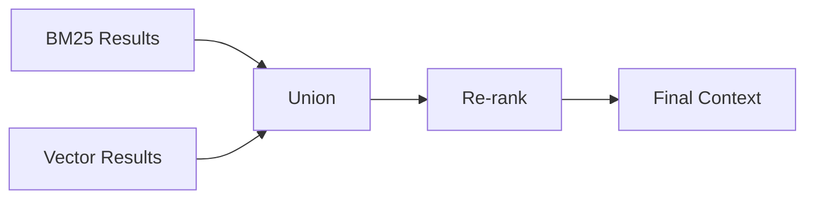
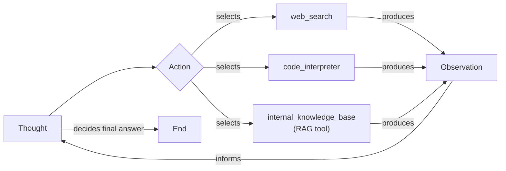

# Lesson 9: Retrieval-Augmented Generation

In our previous lessons, we have built a solid foundation in AI Engineering. We explored the agent landscape, distinguished between LLM workflows and autonomous agents, and dived into context engineering—the art of managing the information an LLM sees. You have learned how to get structured data out of models, give them tools to perform actions, and even implement a reasoning agent from scratch using the ReAct framework.

Now, we address a fundamental limitation of LLMs: their knowledge is frozen in time. During training, they effectively take a "closed-book exam" on a static snapshot of the world's information. We do not yet have techniques to enable models to learn continuously after deployment in the same way humans do. While fine-tuning can update a model's knowledge, it is an inefficient and costly process, like sending someone back to school for every new fact. This static knowledge leads to outdated answers and a tendency to "hallucinate" when faced with unfamiliar topics.

Retrieval-Augmented Generation (RAG) is the solution. Instead of relying on memorized facts, RAG gives the LLM an "open-book exam." It connects the model to external, real-time knowledge sources, allowing it to retrieve relevant information on the fly. This is a core technique in context engineering, which we covered in Lesson 3, as it allows us to precisely curate the information we provide to the model. In this lesson, we will explore the what and how of RAG, from its basic components to the advanced and agentic patterns that power modern AI systems. In our next lesson, we will see how retrieval complements an agent's memory, creating a more robust and knowledgeable system.

## The RAG System: Core Components

Understanding the components of a RAG system is the first step in the context engineering process of designing effective retrieval pipelines. At its core, RAG is built on three conceptual pillars: Retrieval, Augmentation, and Generation.

**Retrieval** is the engine that finds relevant information. When a user asks a question, this component searches an external knowledge base to locate the most relevant pieces of data. The most common approach uses semantic search, which relies on vector embeddings to find information that is conceptually similar, not just a keyword match. These embeddings are numerical representations of text, and they are stored in a specialized vector database for efficient searching. In other cases, traditional keyword-based search, like BM25, is used to find exact-phrase matches.

**Augmentation** is the process of taking the retrieved information and incorporating it into the prompt that will be sent to the LLM. The user’s original query is combined with the retrieved data, providing the model with the necessary context to formulate an answer. This step is where the "augmented" part of RAG happens, enriching the prompt with external knowledge.

**Generation** is the final step. The LLM receives the augmented prompt—containing both the user's query and the retrieved context—and generates a response. Because the answer is based on the provided data, it is "grounded" in facts, which significantly reduces the risk of hallucination and allows the model to cite its sources.

```mermaid
flowchart LR
  "User Query" --> "Retriever"
  "Retriever" --> "Augmentation"
  "Augmentation" --> "Generator"
  "Generator" --> "Final Answer"
```

Image 1: A flowchart illustrating the conceptual flow of a RAG system.

These three components work together to create a system that can answer questions accurately and reliably, leveraging external knowledge to overcome the limitations of a standalone LLM. Now that you can name each moving part, let’s see how they line up across the two phases of a real system.

## The RAG Pipeline: Ingestion and Retrieval

The end-to-end RAG workflow is split into two distinct phases: an offline ingestion pipeline to prepare the knowledge base and an online retrieval pipeline to answer user queries in real-time.

### Phase 1: Offline Ingestion & Indexing

The ingestion phase is an offline process where you prepare your documents for retrieval. This involves loading, splitting, embedding, and storing your data.

-   **Load:** The first step is to load your documents from various sources, which could be anything from PDFs and websites to APIs. Tools like LangChain's document loaders or LlamaIndex's readers are commonly used for this purpose [[1]](https://medium.com/@derrickryangiggs/rag-pipeline-deep-dive-ingestion-chunking-embedding-and-vector-search-abd3c8bfc177).
-   **Split:** Once loaded, large documents are broken down into smaller, semantically meaningful chunks. This is a critical step, as you want to avoid splitting a coherent thought or piece of information across multiple chunks. You can use rule-based splitters, like LangChain's `RecursiveCharacterTextSplitter`, or more advanced semantic chunkers that understand the content [[2]](https://newsletter.systemdesign.one/p/how-rag-works).
-   **Embed:** Each chunk of text is then converted into a numerical representation called a vector embedding using an embedding model. There are many models to choose from, including those from OpenAI, Google, Cohere, or open-source variants from Hugging Face [[3]](https://medium.com/@robi.tomar72/how-rag-actually-works-embeddings-vector-databases-indexing-retrieval-explained-simply-3d1ca45fe1bf).
-   **Store:** Finally, these embeddings and their corresponding text are stored in a vector database. This database is optimized for fast similarity searches, allowing the system to quickly find the most relevant chunks for a given query. Popular options include local libraries like FAISS or scalable solutions like Milvus, Qdrant, and Pinecone [[3]](https://medium.com/@robi.tomar72/how-rag-actually-works-embeddings-vector-databases-indexing-retrieval-explained-simply-3d1ca45fe1bf).

### Phase 2: Online Retrieval & Generation

The retrieval phase happens in real-time when a user submits a query.

-   **Query:** The user asks a question. This query can be optionally pre-processed through normalization or expansion to improve retrieval accuracy [[4]](https://decodingml.substack.com/p/your-rag-is-wrong-heres-how-to-fix?utm_source=publication-search).
-   **Embed:** The user's query is converted into a vector using the *same* embedding model that was used during the ingestion phase. This ensures that the query and the document chunks are in the same vector space, making them comparable [[5]](https://qdrant.tech/articles/what-is-rag-in-ai/).
-   **Search:** The system uses the query vector to search the vector database and retrieve the top-k most similar document chunks. This is typically done using a similarity metric like cosine similarity [[6]](https://towardsdatascience.com/rag-explained-understanding-embeddings-similarity-and-retrieval/).
-   **Generate:** The retrieved chunks are assembled into a prompt along with the original user query and instructions for the LLM. The LLM then generates a final answer that is grounded in the retrieved context. As we discussed in Lesson 4, you can use structured outputs to format the answer and include citations, making the response verifiable [[4]](https://decodingml.substack.com/p/your-rag-is-wrong-heres-how-to-fix?utm_source=publication-search).

```mermaid
flowchart LR
  %% Phase 1: Offline Ingestion & Indexing
  subgraph "Offline Ingestion & Indexing"
    Docs["Documents<br/>(PDFs, websites, APIs)"]
    Load["Load<br/>(Unstructured, LangChain, LlamaIndex)"]
    Split["Split<br/>(RecursiveCharacterTextSplitter, SemanticSplitter)"]
    EmbedIngest["Embed<br/>(OpenAI, Gemini, Cohere, Voyage, bge)"]
    Store["Store<br/>(FAISS, Milvus, Qdrant, Pinecone, Elasticsearch, Azure AI Search)"]

    Docs -- "from sources" --> Load
    Load -- "parse & extract" --> Split
    Split -- "chunk & preprocess" --> EmbedIngest
    EmbedIngest -- "create vectors" --> Store
  end

  %% Phase 2: Online Retrieval & Generation
  subgraph "Online Retrieval & Generation"
    Query["User Query<br/>(normalized/expanded)"]
    EmbedQuery["Embed Query<br/>(same embedding model)"]
    Search["Search<br/>(vector similarity, filters)"]
    Generate["Generate<br/>(LLM, structured outputs, citations)"]
    UserOutput["User"]

    Query -- "input" --> EmbedQuery
    EmbedQuery -- "vectorize" --> Search
    Search -- "retrieve chunks" --> Generate
    Generate -- "grounded answer" --> UserOutput
  end

  %% Supporting relationship between phases
  Store -. "indexed data" .-> Search

  %% Visual grouping
  classDef sourceNode fill:#e0f7fa,stroke:#00796b,stroke-width:2px
  classDef processNode fill:#e8eaf6,stroke:#3f51b5,stroke-width:2px
  classDef storageNode fill:#fff3e0,stroke:#ff9800,stroke-width:2px
  class Docs,Query sourceNode
  class Load,Split,EmbedIngest,EmbedQuery,Search,Generate processNode
  class Store storageNode
```



Image 2: A detailed flowchart illustrating the end-to-end RAG workflow, clearly separated into two main phases: "Offline Ingestion & Indexing" and "Online Retrieval & Generation".

With the end-to-end path in place, the next question is quality. What are the advanced techniques to make retrieval more accurate and useful across messy, real-world data?

## Advanced RAG Techniques

While a basic RAG pipeline is powerful, production-grade systems often require more advanced techniques to achieve high accuracy. These methods address the nuances of real-world data and complex user queries, moving beyond simple semantic similarity to a more sophisticated understanding of relevance.

### Hybrid Search

Hybrid search combines the strengths of traditional keyword-based search (like BM25) with modern vector search [[7]](https://mlpills.substack.com/p/issue-76-optimize-rag-with-hybrid). BM25 excels at finding documents with exact keyword matches, which is crucial for queries containing specific terms, codes, or names. Vector search, on the other hand, captures semantic meaning, finding relevant documents even if they do not use the same keywords.

For example, in a customer support scenario, a user might ask, "my bill keeps rolling over." A keyword search would find articles containing the exact word "rollover." A semantic search would also surface guides that talk about a "carryover balance," capturing the user's intent even with different phrasing. By combining both, hybrid search provides more comprehensive and relevant results [[8]](https://pr-peri.github.io/blogpost/2026/03/05/blogpost-hybrid-search.html). This combination is often handled using Reciprocal Rank Fusion (RRF), a technique that merges ranked lists without needing to normalize scores from different scales. RRF calculates a new score for each document based on the inverse of its rank in each list, effectively giving more weight to documents that appear at the top of multiple result sets [[9]](https://dev.to/lpossamai/building-hybrid-search-for-rag-combining-pgvector-and-full-text-search-with-reciprocal-rank-fusion-6nk), [[10]](https://medium.com/@devalshah1619/mathematical-intuition-behind-reciprocal-rank-fusion-rrf-explained-in-2-mins-002df0cc5e2a).



Image 3: A flowchart illustrating the hybrid retrieval flow.

### Re-ranking

Re-ranking introduces a second, more precise model to re-order the documents retrieved in the initial search. While the first-stage retrieval is optimized for speed and recall (finding a broad set of potentially relevant documents), a re-ranker is optimized for precision.

Cross-encoder models are commonly used for this task [[11]](https://apxml.com/courses/optimizing-rag-for-production/chapter-2-advanced-retrieval-optimization/reranking-architectures-rag). Unlike bi-encoders, which create separate embeddings for the query and documents, a cross-encoder evaluates the query and a candidate document *together*. This allows it to capture more nuanced relationships and provide a more accurate relevance score. For instance, when searching for "how to connect my account," a re-ranker can prioritize a step-by-step guide over a press release that mentions the same keywords but is less helpful [[12]](https://redis.io/blog/10-techniques-to-improve-rag-accuracy/).

### Query Transformations

Instead of taking the user's query at face value, query transformation techniques rewrite or decompose it to improve retrieval results.

**Decomposition** breaks down a complex, multi-part question into several simpler sub-queries. Each sub-query is then used to retrieve relevant documents, and the results are merged to answer the original question [[13]](https://docs.nvidia.com/rag/latest/query_decomposition.html). For example, the query “What’s our travel policy for conferences in Europe this year?” could be broken down into: “What is the travel policy?”, “What are the rules for Europe?”, and “What has changed this year?”.

**Hypothetical Document Embeddings (HyDE)** is another powerful technique. Instead of embedding the user's query directly, an LLM is first used to generate a hypothetical, ideal answer. This generated answer is then embedded and used to search for similar documents [[14]](https://47billion.com/blog/rag-system-in-production-why-it-fails-and-how-to-fix-it/). For example, if a user asks about travel policies, the system might generate a draft like: “Employees attending approved conferences in Europe can book economy flights and stay in hotels up to a certain price limit.” Searching for documents similar to this hypothetical answer often leads to more relevant results than searching for the original, shorter query.

### Advanced Chunking Strategies

The way you split your documents into chunks has a massive impact on retrieval quality. Moving beyond simple fixed-size chunking is one of the most effective ways to improve your RAG system.

-   **Semantic chunking** splits text based on topical shifts, ensuring that each chunk contains a coherent block of information. This is much better than a fixed-size approach, which might split a document mid-sentence [[15]](https://sarthakai.substack.com/p/improve-your-rag-accuracy-with-a). For example, splitting a 20-page handbook every 500 words could cut the "Reimbursements" section in half, separating the rules from the specific spending caps. Semantic chunking would keep the entire section together.
-   **Layout-aware chunking** is essential for complex documents like PDFs with tables, headers, and lists. This strategy preserves the document's structure. For a pricing table, it ensures that each row (e.g., product, price, discount) remains intact, rather than being arbitrarily split by character count [[15]](https://sarthakai.substack.com/p/improve-your-rag-accuracy-with-a).
-   **Context-enriched chunking** adds a summary of the surrounding context to each chunk before embedding it. This helps the retrieval system understand the chunk's relevance even if the chunk itself is short or ambiguous [[16]](https://www.anthropic.com/news/contextual-retrieval).

However, even these advanced strategies can fail with highly structured or noisy enterprise documents. For example, sentence-based semantic splitters often break tables and code blocks, destroying their structure and making the resulting chunks meaningless without their original context [[17]](https://towardsdatascience.com/your-chunks-failed-your-rag-in-production/).

### GraphRAG

GraphRAG introduces knowledge graphs into the retrieval process. Instead of treating documents as isolated chunks of text, GraphRAG extracts entities and their relationships, building a structured graph of the knowledge contained in your data [[18]](https://webhome.cs.uvic.ca/~thomo/papers/asonam2025-graphrag.pdf). This approach excels at answering complex, multi-hop questions that require connecting information across multiple documents or data points.

This approach aligns with the principles of the Semantic Web, where information is represented in a structured graph to enable more sophisticated machine reasoning [[19]](https://www.puppygraph.com/blog/knowledge-graph-vs-rag). However, the power of GraphRAG comes with significant computational costs. Building the graph often requires expensive LLM-based entity extraction, and querying large-scale graphs can lead to a "subgraph explosion," where traversal over millions of nodes exceeds latency thresholds for real-time applications [[20]](https://dev.to/sreeni5018/from-rag-to-knowledge-graphs-why-the-agent-era-is-redefining-ai-architecture-3fgc).

For example, a standard RAG system might struggle with a query like, “Which shoes get the most size-related returns and were featured in last month’s ads?” A GraphRAG system can traverse the knowledge graph, connecting returns data to specific products, then linking those products to marketing campaigns, to assemble a comprehensive answer [[21]](https://arxiv.org/html/2501.00309v2).

These techniques increase retrieval quality. Next, we will see how retrieval becomes one tool that an agent can choose to use as it reasons.

## Agentic RAG

The techniques we have discussed so far focus on optimizing a linear RAG pipeline. Agentic RAG represents a paradigm shift, transforming RAG from a fixed workflow into an adaptive, iterative process controlled by an agent. This connects directly to what we learned in Lessons 7 and 8 about ReAct, where an agent reasons (Thought), decides on an Action, observes the results, and repeats the cycle.

In an agentic system, RAG is not the entire process; it is a powerful tool in the agent's toolkit [[22]](https://weaviate.io/blog/what-is-agentic-rag). An agent can be equipped with multiple tools, such as web search, a code interpreter, or access to different databases. The agent's reasoning capabilities allow it to decide *when* to use the RAG tool, *what* to search for, and *how* to use the retrieved information [[23]](https://medium.com/@gaddam.rahul.kumar/agentic-rag-vs-traditional-rag-b1a156f72167).

More fundamentally, the agentic approach reframes the problem from simple retrieval to active memory management. Standard RAG is a read-only tool; it can look things up in a library but cannot write new information or update its knowledge. This leads to failure modes like state conflict, where outdated and current user preferences are retrieved simultaneously. An agentic system needs a read-write memory that can track evolving states, distinguishing what is currently true from what was true in the past [[24]](https://xtrace.ai/blog/rag-vs-long-term-memory-ai-agents).

This agentic approach unlocks several advanced capabilities:

-   **Iterative Retrieval:** If the initial retrieval results are insufficient, the agent can refine its query and try again. For example, if a search for a policy yields a vague document, the agent can narrow its scope by adding keywords like “for EU customers” and “2024 updates” and then re-query.
-   **Dynamic Source Selection:** The agent can choose the most appropriate knowledge base to search. For an IT outage, it might query `search_incident_runbooks` instead of `search_marketing_pages`.
-   **Information Fusion:** The agent can combine information from its RAG tool with data from other tools, like a live web search, to create a more comprehensive answer. It might retrieve an internal policy, then use a web search to verify current regulatory standards before synthesizing a final response [[25]](https://www.pingcap.com/article/agentic-rag-vs-traditional-rag-key-differences-benefits/).
-   **Stateful Memory Management:** Beyond just retrieving, an agent can decide to *write* to different memory stores. For instance, it can update a user's preference in a structured database (the current state) while logging the interaction in a vector store (the episodic history). This separation of facts, events, and state is a key feature of robust agentic memory systems, which we will cover in Lesson 10 [[24]](https://xtrace.ai/blog/rag-vs-long-term-memory-ai-agents).

For example, here is a conceptual thought process for an agent handling a complex query:
*Thought: The user is asking about ‘2024 EU data retention rules.’ Our internal policy documents cite 2023 regulations, which are likely outdated.*
*Action: `retrieve(internal_policy, query="EU data retention 2024")`*
*Observation: The retrieved document mentions recent amendments but is missing specific citations.*
*Thought: I need external verification to provide an accurate answer.*
*Action: `web_search(query="EU data retention rules 2024 official directive")`*
*Observation: The search returns an official EU directive with the updated rules.*
*Thought: I can now synthesize the information from our internal policy and the official directive, highlighting the changes from 2023 and citing both sources.*

This transforms retrieval from a simple database lookup into a dynamic conversation with a knowledgeable research assistant.



Image 4: A conceptual flowchart illustrating an agent's main loop with tool selection, observation, and decision points for choosing between web search, code interpreter, or an internal knowledge base.

You now understand both a linear RAG pipeline and how an agent can control retrieval when needed. Let’s wrap up by situating RAG in the wider AI Engineering toolkit and previewing what comes next.

## Conclusion

We have journeyed from the fundamentals of RAG to its advanced and agentic applications. The key takeaway is that RAG is the most effective solution to the LLM knowledge problem. It reduces hallucinations, enables customization with proprietary data, and builds user trust through verifiable, source-based answers. For the modern AI Engineer, mastering RAG is not just a valuable skill but a foundational competency and a core part of context engineering.

As we look ahead, the future of knowledge retrieval is agentic, where RAG is one of many tools an intelligent system can use to reason and act. In our next lesson, we will explore memory for agents, and you will learn how short-term and long-term memory systems complement retrieval to create even more powerful and context-aware AI. We will also cover other critical topics later in the course, such as evaluating retrieval quality and monitoring RAG systems in production.

## References

-   [1] [RAG Pipeline Deep Dive: Ingestion, Chunking, Embedding, and Vector Search](https://medium.com/@derrickryangiggs/rag-pipeline-deep-dive-ingestion-chunking-embedding-and-vector-search-abd3c8bfc177)
-   [2] [How RAG Works](https://newsletter.systemdesign.one/p/how-rag-works)
-   [3] [How RAG Actually Works: Embeddings, Vector Databases, Indexing & Retrieval Explained Simply](https://medium.com/@robi.tomar72/how-rag-actually-works-embeddings-vector-databases-indexing-retrieval-explained-simply-3d1ca45fe1bf)
-   [4] [Your RAG is wrong: Here's how to fix it](https://decodingml.substack.com/p/your-rag-is-wrong-heres-how-to-fix?utm_source=publication-search)
-   [5] [What is RAG in AI?](https://qdrant.tech/articles/what-is-rag-in-ai/)
-   [6] [RAG Explained: Understanding Embeddings, Similarity, and Retrieval](https://towardsdatascience.com/rag-explained-understanding-embeddings-similarity-and-retrieval/)
-   [7] [Optimize RAG with Hybrid Search](https://mlpills.substack.com/p/issue-76-optimize-rag-with-hybrid)
-   [8] [Why Hybrid Search is a Production RAG Necessity](https://pr-peri.github.io/blogpost/2026/03/05/blogpost-hybrid-search.html)
-   [9] [Building Hybrid Search for RAG: Combining pgvector and Full-Text Search with Reciprocal Rank Fusion](https://dev.to/lpossamai/building-hybrid-search-for-rag-combining-pgvector-and-full-text-search-with-reciprocal-rank-fusion-6nk)
-   [10] [Mathematical Intuition behind Reciprocal Rank Fusion (RRF)](https://medium.com/@devalshah1619/mathematical-intuition-behind-reciprocal-rank-fusion-rrf-explained-in-2-mins-002df0cc5e2a)
-   [11] [Reranking Architectures for RAG](https://apxml.com/courses/optimizing-rag-for-production/chapter-2-advanced-retrieval-optimization/reranking-architectures-rag)
-   [12] [10 Techniques to Improve RAG Accuracy](https://redis.io/blog/10-techniques-to-improve-rag-accuracy/)
-   [13] [Query Decomposition](https://docs.nvidia.com/rag/latest/query_decomposition.html)
-   [14] [RAG System in Production: Why It Fails and How to Fix It](https://47billion.com/blog/rag-system-in-production-why-it-fails-and-how-to-fix-it/)
-   [15] [Improve Your RAG Accuracy With A Smarter Chunking Strategy](https://sarthakai.substack.com/p/improve-your-rag-accuracy-with-a)
-   [16] [Introducing Contextual Retrieval](https://www.anthropic.com/news/contextual-retrieval)
-   [17] [Your Chunks Failed Your RAG in Production](https://towardsdatascience.com/your-chunks-failed-your-rag-in-production/)
-   [18] [From Local to Global: A GraphRAG Approach to Query-Focused Summarization](https://webhome.cs.uvic.ca/~thomo/papers/asonam2025-graphrag.pdf)
-   [19] [Knowledge Graph vs. RAG: The Best of Both Worlds](https://www.puppygraph.com/blog/knowledge-graph-vs-rag)
-   [20] [From RAG to Knowledge Graphs: Why the Agent Era is Redefining AI Architecture](https://dev.to/sreeni5018/from-rag-to-knowledge-graphs-why-the-agent-era-is-redefining-ai-architecture-3fgc)
-   [21] [Graph-based Retrieval for Multi-hop Question Answering](https://arxiv.org/html/2501.00309v2)
-   [22] [What is Agentic RAG](https://weaviate.io/blog/what-is-agentic-rag)
-   [23] [Agentic RAG vs Traditional RAG](https://medium.com/@gaddam.rahul.kumar/agentic-rag-vs-traditional-rag-b1a156f72167)
-   [24] [Beyond RAG: Why AI Agents Need Long-Term Memory, Not Retrieval](https://xtrace.ai/blog/rag-vs-long-term-memory-ai-agents)
-   [25] [Agentic RAG vs. Traditional RAG: Key Differences & Benefits](https://www.pingcap.com/article/agentic-rag-vs-traditional-rag-key-differences-benefits/)
-   [26] [What Is Retrieval-Augmented Generation, aka RAG?](https://blogs.nvidia.com/blog/what-is-retrieval-augmented-generation/)
-   [27] [A Complete Guide to RAG](https://towardsai.net/p/l/a-complete-guide-to-rag)
-   [28] [Retrieval-Augmented Generation (RAG) Fundamentals First](https://decodingml.substack.com/p/rag-fundamentals-first?utm_source=publication-search)
-   [29] [From Local to Global: A GraphRAG Approach to Query-Focused Summarization](https://arxiv.org/html/2404.16130)