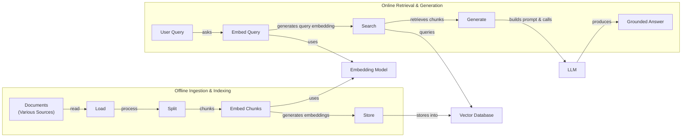
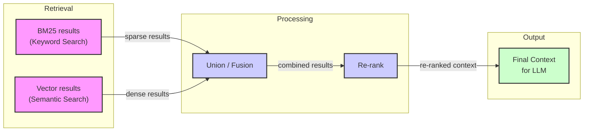
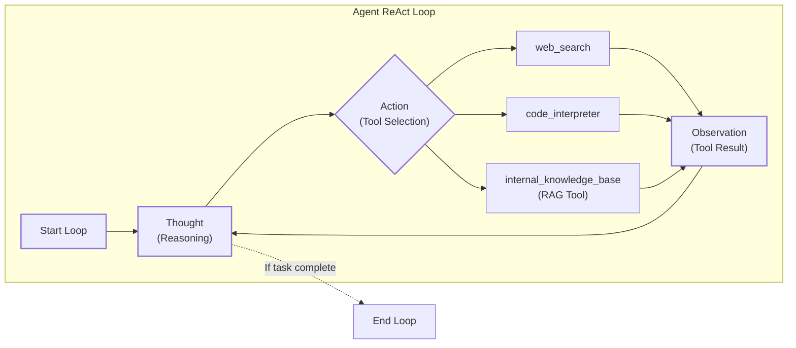

# Retrieval Augmented Generation (RAG): Giving LLMs an Open-Book Exam

In our previous lessons, we built a foundation in AI Engineering. We explored the agent landscape, distinguished between rule-based workflows and autonomous agents, and, in Lesson 3, introduced Context Engineering—the discipline of managing the information an LLM sees. We have learned how to build agents that reason and act. Now, we will tackle one of their biggest limitations: their fixed knowledge.

LLMs are trained on a static snapshot of data, which means they are essentially taking a "closed-book exam" on the world's information. Their knowledge gets outdated, and they are prone to making things up, a phenomenon known as hallucination. While we could fine-tune a model with new data, this process is slow, expensive, and inefficient for knowledge that changes frequently. We do not yet have techniques that allow models to continuously learn from experience after deployment.

This is where Retrieval-Augmented Generation (RAG) comes in. RAG is a reliable solution that gives the LLM an "open-book exam" by connecting it to external, real-time knowledge sources. Just as humans do not need to memorize everything and can instead rely on manuals or cheat sheets, we can equip LLMs with a similar capability. RAG is a core technique in Context Engineering, allowing us to precisely curate the information an LLM uses to answer a question.

This lesson will guide you through the "what" and "how" of RAG, starting with its basic components and moving toward the advanced and agentic patterns used in production systems. We will also preview how retrieval complements an agent's memory, a topic we will explore fully in Lesson 10. With the problem and motivation clear, we’ll first decompose RAG into its core components so you can see where each responsibility lives.

## The RAG System: Core Components

Understanding the components of RAG is the first step in the Context Engineering process of designing an effective system. At its core, RAG can be broken down into three conceptual pillars that work together to ground an LLM's response in external data.

Image 1: A flowchart illustrating the core components and sequential flow of a RAG system.

**Retrieval:** This is the engine responsible for finding relevant information. When a user asks a question, the retriever searches an external knowledge base to find documents or data snippets that are most likely to contain the answer. The most common approach is semantic similarity search, which relies on vector embeddings. Text is converted into numerical vectors that capture its meaning, and these vectors are stored in a specialized vector database. The user's query is also converted into a vector, and the database finds the vectors (and their corresponding text) that are closest in this high-dimensional space [[52]](https://medium.com/@robi.tomar72/how-rag-actually-works-embeddings-vector-databases-indexing-retrieval-explained-simply-3d1ca45fe1bf). Another popular method is keyword-based search, using algorithms like BM25, which excels at finding exact matches for specific terms [[38]](https://mlpills.substack.com/p/issue-76-optimize-rag-with-hybrid).

**Augmentation:** Once the retriever has found the relevant information, the augmentation step begins. This process involves taking the retrieved text chunks and integrating them into the prompt that will be sent to the LLM. The prompt is carefully constructed to include the original user query along with the retrieved context, effectively giving the model the "open-book" materials it needs. This augmented prompt instructs the LLM to formulate its answer based on the provided information [[56]](https://www.topquadrant.com/resources/blog-retrieval-augmented-generation-explained/).

**Generation:** This is the final step, where the LLM receives the augmented prompt and generates a response. Instead of relying solely on its pre-trained knowledge, the model synthesizes an answer that is grounded in the retrieved data. This ensures the response is more accurate, up-to-date, and relevant to the specific context of the query. For added trust and verifiability, the generated answer can also include citations that point back to the original source documents [[1]](https://neo4j.com/blog/developer/fine-tuning-vs-rag/).

Now that you can name each moving part, let’s see how they line up across the two phases of a real system.

## The RAG Pipeline: Ingestion and Retrieval

The end-to-end RAG workflow is divided into two distinct phases: an offline phase for preparing the data and an online phase for answering user queries in real-time.

Image 2: A detailed flowchart illustrating the end-to-end RAG (Retrieval Augmented Generation) workflow, divided into Offline Ingestion & Indexing and Online Retrieval & Generation phases, highlighting shared components.

### Phase 1: Offline Ingestion & Indexing

This phase happens in the background, before any user interacts with the system. Its goal is to process your knowledge base and create an index that enables efficient retrieval [[32]](https://newsletter.systemdesign.one/p/how-rag-works).

1.  **Load:** The process begins by loading documents from various sources. These can be PDFs, web pages, database records, or API outputs. Tools like LangChain's document loaders or LlamaIndex's readers are commonly used for this step [[33]](https://towardsdatascience.com/ragops-guide-building-and-scaling-retrieval-augmented-generation-systems-3d26b3ebd627/).
2.  **Split:** Since documents are often too large to fit into an LLM's context window, they are broken down into smaller, more manageable pieces called chunks. This can be done using rule-based splitters (e.g., LangChain's `RecursiveCharacterTextSplitter`) or more advanced semantic chunkers that try to keep related ideas together [[17]](https://sarthakai.substack.com/p/improve-your-rag-accuracy-with-a). The goal is to create chunks that are semantically meaningful and self-contained.
3.  **Embed:** Each chunk is then passed through an embedding model, which converts the text into a high-dimensional vector. This vector captures the semantic meaning of the chunk. Popular embedding models include OpenAI's `text-embedding-3` series, Google's `text-embedding-004`, and open-source models like BGE variants available on Hugging Face [[51]](https://apxml.com/courses/prompt-engineering-llm-application-development/chapter-6-integrating-llms-external-data-rag/implementing-semantic-search-retrieval).
4.  **Store:** Finally, these vector embeddings and their corresponding text chunks (along with any metadata) are loaded into a specialized vector database. This database is optimized for fast similarity searches, allowing the system to quickly find the most relevant chunks for a given query. Examples include local libraries like FAISS or production-grade databases like Milvus, Qdrant, and Pinecone [[6]](https://pub.towardsai.net/vector-databases-in-practice-building-a-realistic-hybrid-search-rag-system-with-qdrant-7b8f4a6e41e0).

### Phase 2: Online Retrieval & Generation

This phase is triggered in real-time when a user submits a query [[31]](https://medium.com/@derrickryangiggs/rag-pipeline-deep-dive-ingestion-chunking-embedding-and-vector-search-abd3c8bfc177).

1.  **Query & Embed:** The user's question is taken as input. This query is then converted into a vector using the *same* embedding model that was used during the ingestion phase. This ensures that the query and the document chunks are represented in the same vector space, making them comparable [[8]](https://qdrant.tech/articles/what-is-rag-in-ai/).
2.  **Search:** The system uses the query vector to search the vector database. It calculates the similarity (often using cosine similarity) between the query vector and all the chunk vectors in the database, returning the top-k most similar chunks [[54]](https://towardsdatascience.com/rag-explained-understanding-embeddings-similarity-and-retrieval/).
3.  **Generate:** The retrieved chunks are combined with the original user query and a set of instructions into a single prompt. This augmented prompt is then fed to an LLM, which generates a final, grounded answer. This step can also leverage the structured output techniques we covered in Lesson 4 to format the answer and include citations.

With the end-to-end path in place, the next question is quality. What are the advanced techniques to make the retrieval more accurate and useful across messy, real-world data?

## Advanced RAG Techniques

A naive RAG pipeline often works well for simple lookups but can struggle with the complexities of real-world data. To build a production-grade system, we need to move beyond the basics and incorporate advanced techniques that improve retrieval performance, relevance, and context quality.

### Hybrid Search

Vector search is powerful for understanding semantic meaning, but it can sometimes miss exact keywords, acronyms, or IDs. Hybrid search solves this by combining the strengths of dense (vector) retrieval with sparse (keyword-based) retrieval, like BM25 [[39]](https://cubitrek.com/blog/hybrid-search-optimization-how-bm25-and-dense-vector-retrieval-work-together-for-superior-ai-search/). This multi-stage approach has roots in pre-LLM search engines, which also used pipelines of sparse retrieval, dense retrieval, and re-scoring to balance speed and relevance [[82]](https://ijcaonline.org/archives/volume187/number18/veluru-2025-ijca-925279.pdf).

For example, in a customer support scenario, a user might ask, "My bill keeps rolling over." A vector search would find documents about "carryover balances," while a keyword search would find articles that explicitly mention "rollover." By fusing the results from both, the system can cover different phrasings of the same underlying issue, leading to more comprehensive retrieval [[38]](https://mlpills.substack.com/p/issue-76-optimize-rag-with-hybrid).

Image 3: A flowchart illustrating the hybrid retrieval flow, showing parallel BM25 and vector results converging into a union/fusion step, followed by re-ranking to produce the final context for an LLM.

### Re-ranking

The initial retrieval step is optimized for speed and recall, meaning it might return some documents that are only loosely related to the query. A re-ranker adds a second pass to improve precision. It uses a more computationally expensive but accurate model, typically a cross-encoder, to score the relevance of each retrieved document against the query [[42]](https://redis.io/blog/10-techniques-to-improve-rag-accuracy/). The documents are then re-ordered based on these scores, ensuring that the most relevant information is placed at the top and passed to the LLM. This two-stage pattern is necessary because a cross-encoder must run a full forward pass for every (query, document) pair, making it too slow for the initial retrieval but perfect for refining a smaller set of candidates [[72]](https://towardsdatascience.com/advanced-rag-retrieval-cross-encoders-reranking/).

This added computation introduces a latency trade-off. Under high load, a re-ranking step can become a bottleneck, as response times grow non-linearly when query rates exceed the system's throughput [[71]](https://towardsdatascience.com/advanced-rag-retrieval-cross-encoders-reranking/).

For instance, if a user asks, "How do I connect my account?", the initial retrieval might pull a press release, a community forum thread, and a step-by-step guide. The re-ranker would identify the guide as the most relevant and push it to the top of the list [[43]](https://apxml.com/courses/optimizing-rag-for-production/chapter-2-advanced-retrieval-optimization/reranking-architectures-rag).

### Query Transformations

Sometimes, the user's original query is not the best one for retrieval. Query transformation techniques rewrite or decompose the query to improve its chances of matching the right documents.

-   **Decomposition:** This technique breaks down a complex, multi-part question into several simpler sub-queries. For example, the question "What’s our travel policy for conferences in Europe this year?" could be decomposed into: (1) "What is the travel policy?", (2) "What are the rules for conferences?", (3) "Are there specific rules for Europe?", and (4) "What has changed this year?". The system retrieves documents for each sub-question and then synthesizes a comprehensive answer [[19]](https://docs.nvidia.com/rag/latest/query_decomposition.html). The optimal number of sub-queries often depends on the domain; fact-verification may only need two, while complex biomedical questions might benefit from eight or more [[80]](https://aclanthology.org/2025.findings-emnlp.1022.pdf).
-   **HyDE (Hypothetical Document Embeddings):** This approach involves using an LLM to first generate a hypothetical answer to the user's query. This generated answer, which is often more detailed and contains relevant keywords, is then embedded and used for the similarity search. This helps bridge the gap between a short, ambiguous query and the more descriptive content in the knowledge base [[16]](https://47billion.com/blog/rag-system-in-production-why-it-fails-and-how-to-fix-it/). However, because the generated answer reflects relevance patterns rather than facts, it can sometimes contain inaccuracies that limit retrieval precision [[106]](https://towardsdatascience.com/advanced-query-transformations-to-improve-rag-11adca9b19d1/).

### Advanced Chunking Strategies

How you split your documents can have a huge impact on retrieval quality. Moving beyond simple fixed-size chunks can help preserve the context and structure of your data. The optimal strategy is not universal; it should be adapted to the type of document being processed [[112]](https://towardsdatascience.com/your-chunks-failed-your-rag-in-production/).

-   **Semantic Chunking:** Instead of splitting by a fixed number of tokens, this method splits text based on semantic boundaries, aiming to keep coherent ideas or topics within the same chunk. This prevents situations where a key piece of information is cut in half across two different chunks [[18]](https://cloudurable.com/blog/advanced-rag-techniques-that-will-transform-your-l/). For example, in a company handbook, this would ensure the entire "Reimbursements" section, including its rules and limits, stays together.
-   **Layout-Aware Chunking:** For documents with complex structures like PDFs or financial reports, this method uses the visual layout (headings, tables, lists) to guide the chunking process. For a pricing table, it would keep each row intact, ensuring that products, prices, and discounts are not separated from each other [[17]](https://sarthakai.substack.com/p/improve-your-rag-accuracy-with-a).

### GraphRAG

For questions about complex relationships and interconnected data, standard document retrieval can fall short. GraphRAG addresses this by first constructing a knowledge graph from the source documents, where entities (like people, companies, or products) are nodes and their relationships are edges. This structured representation allows the system to answer multi-hop questions that require traversing these connections [[46]](https://arxiv.org/html/2601.03014v1). This is particularly effective for deeply hierarchical documents, such as legal contracts with amendments, where vector search alone might retrieve an outdated clause, a problem sometimes called "temporal hallucination" [[64]](https://arxiv.org/html/2604.14220v1).

For example, to answer "Which shoes get the most size-related returns and were featured in last month’s ads?", the system can traverse the graph from "returns" to "reason: sizing," link to specific shoe SKUs, and then connect those SKUs to the "marketing calendar," pulling all the supporting documents along the way [[49]](https://atlan.com/know/what-is-graphrag/). This is far more effective than trying to find a single text chunk that contains all of this information.

These techniques increase retrieval quality. Next, we’ll see how retrieval becomes one tool that an agent can choose to use as it reasons.

## Agentic RAG

In Lessons 7 and 8, we introduced the ReAct framework, where an agent cycles through Thought, Action, and Observation to solve problems. Agentic RAG is the application of this pattern to information retrieval. Instead of a rigid, linear pipeline, retrieval becomes a dynamic tool that a reasoning agent can choose to use, ignore, or re-run as needed [[11]](https://towardsdatascience.com/agentic-rag-vs-classic-rag-from-a-pipeline-to-a-control-loop/).

The core distinction is the shift from a predetermined workflow to an adaptive, iterative process.

-   **Standard RAG** is a one-pass system: Retrieve → Augment → Generate. It is powerful but inflexible.
-   **Agentic RAG** is a control loop. The agent decides *when* to retrieve, *what* to search for, and *whether* the results are sufficient. If the first retrieval is weak, it can reformulate the query and try again [[12]](https://www.pingcap.com/article/agentic-rag-vs-traditional-rag-key-differences-benefits/).

Image 4: A conceptual flowchart illustrating an agent's main loop, emphasizing its iterative nature and decision-making capabilities based on the ReAct pattern. The loop includes "Thought", "Action", and "Observation" steps, with dynamic tool selection within the "Action" step.

This agentic approach unlocks several advanced capabilities. The agent can iteratively refine its search, choose between different knowledge sources (e.g., deciding if a query needs semantic search or a precise SQL query [[89]](https://devblogs.microsoft.com/azure-sql/improve-the-r-in-rag-and-embrace-agentic-rag-in-azure-sql/)), and even fuse information from its internal RAG tool with results from other tools, like a web search, to build a more complete answer [[13]](https://medium.com/@gaddam.rahul.kumar/agentic-rag-vs-traditional-rag-b1a156f72167). However, this iterative freedom also introduces new engineering challenges, including performance bottlenecks from increased latency and reliability risks like "retrieval thrash," where an agent gets stuck in useless retrieval loops [[99]](https://towardsdatascience.com/agentic-rag-failure-modes-retrieval-thrash-tool-storms-and-context-bloat-and-how-to-spot-them-early/), [[66]](https://redis.io/blog/agentic-rag-how-enterprises-are-surmounting-the-limits-of-traditional-rag/).

Consider this simplified thought process for a query about "2024 EU data retention rules":

*   **Thought:** The user is asking about the 2024 rules, but our internal policy document is from 2023. It's likely outdated.
*   **Action:** `retrieve(internal_policy, query="EU data retention 2024")`
*   **Observation:** The retrieved text mentions upcoming amendments but lacks specific details or citations.
*   **Thought:** I need to verify this with a current, external source.
*   **Action:** `web_search(query="EU data retention rules 2024 official directive")`
*   **Observation:** The web search returns an official EU directive with the updated rules.
*   **Thought:** I can now synthesize an answer using both the internal policy and the new directive, highlighting the changes from 2023.

This is the difference between a simple database lookup and a conversation with a knowledgeable research assistant. It is important to note that retrieval is just one of many tools an agent can wield. Labeling an entire system "agentic RAG" can be too narrow; more accurately, it is an agent that uses RAG [[15]](https://domino.ai/blog/rag-vs-agentic-ai).

You now understand both a linear RAG pipeline and how an agent can control retrieval when needed. Let’s wrap up by situating RAG in the wider AI Engineering toolkit and previewing what comes next.

## Conclusion

We have seen that RAG is the most widely used solution to the LLM knowledge problem, transforming them from "closed-book" reasoners into "open-book" experts. For production-grade quality, advanced techniques like hybrid search, re-ranking, and GraphRAG are essential. The future of knowledge retrieval is agentic, where RAG is not just a pipeline but a dynamic tool wielded by an intelligent agent.

The core benefits of this approach are clear: it reduces hallucinations, enables customization with proprietary data, and builds user trust by providing verifiable, source-based answers. RAG is not a niche skill but a foundational competency for the modern AI Engineer and a critical component of Context Engineering.

In our next lesson, we will explore Memory for Agents, and see how short-term and long-term memory systems complement retrieval to create AI that learns and remembers. Looking ahead, RAG systems are also evolving to handle not just text but also images and charts through multimodal embeddings, a topic we will cover in Lesson 11 [[93]](https://superlinear.eu/insights/articles/the-future-of-multimodal-rag-systems-transforming-ai-capabilities). We will also touch on other critical topics, such as evaluating retrieval quality and monitoring RAG systems in production, in future parts of the course.

## References

- [1] Fine-Tuning vs. Retrieval Augmented Generation for LLMs. (2024, September 11). Neo4j. https://neo4j.com/blog/developer/fine-tuning-vs-rag/
- [2] Retrieval-augmented generation vs. fine-tuning: Enhancing LLMs. (n.d.). Medium. https://medium.com/@tahirbalarabe2/retrieval-augmented-generation-vs-fine-tuning-enhancing-llms-697e7a0cf7e0
- [3] Addressing AI hallucinations with retrieval-augmented generation. (n.d.). InfoWorld. https://www.infoworld.com/article/2335043/addressing-ai-hallucinations-with-retrieval-augmented-generation.html
- [4] Ovadia, O., et al. (2024). Fine-Tuning or Retrieval? Comparing Knowledge Injection in LLMs. EMNLP. https://aclanthology.org/2024.emnlp-main.15.pdf
- [5] Ovadia, O., et al. (2023). Fine-Tuning or Retrieval? Comparing Knowledge Injection in LLMs. arXiv. https://arxiv.org/html/2312.05934v3
- [6] Kakde, A. (2026, January 27). Vector Databases in Practice: Building a Realistic Hybrid Search RAG System with Qdrant. Towards AI. https://pub.towardsai.net/vector-databases-in-practice-building-a-realistic-hybrid-search-rag-system-with-qdrant-7b8f4a6e41e0
- [7] AWS Vector Databases Explained: Semantic Search and RAG Systems. (n.d.). Tutorials Dojo. https://tutorialsdojo.com/aws-vector-databases-explained-semantic-search-and-rag-systems/
- [8] What is RAG in AI? (n.d.). Qdrant. https://qdrant.tech/articles/what-is-rag-in-ai/
- [9] Ibrahim, M. (n.d.). Vector Embeddings in RAG Applications. Weights & Biases. https://wandb.ai/mostafaibrahim17/ml-articles/reports/Vector-Embeddings-in-RAG-Applications--Vmlldzo3OTk1NDA5
- [11] Ibrahim, M. (2026, March 3). Agentic RAG vs Classic RAG: From a Pipeline to a Control Loop. Towards Data Science. https://towardsdatascience.com/agentic-rag-vs-classic-rag-from-a-pipeline-to-a-control-loop/
- [12] Agentic RAG vs. Traditional RAG: Key Differences And Benefits. (n.d.). PingCAP. https://www.pingcap.com/article/agentic-rag-vs-traditional-rag-key-differences-benefits/
- [13] Kumar, G. R. (n.d.). Agentic RAG vs Traditional RAG. Medium. https://medium.com/@gaddam.rahul.kumar/agentic-rag-vs-traditional-rag-b1a156f72167
- [14] AI Agent vs RAG. (n.d.). Airbyte. https://airbyte.com/agentic-data/ai-agent-vs-rag
- [15] RAG vs. agentic AI: Key differences and when to use each. (n.d.). Domino Data Lab. https://domino.ai/blog/rag-vs-agentic-ai
- [16] RAG System in Production: Why it Fails and How to Fix It. (n.d.). 47Billion. https://47billion.com/blog/rag-system-in-production-why-it-fails-and-how-to-fix-it/
- [17] Improve Your RAG Accuracy with a Layout-Aware Chunking Strategy. (n.d.). Sarthak AI. https://sarthakai.substack.com/p/improve-your-rag-accuracy-with-a
- [18] Advanced RAG Techniques That Will Transform Your LLM Applications. (n.d.). Cloudurable. https://cloudurable.com/blog/advanced-rag-techniques-that-will-transform-your-l/
- [19] Query Decomposition. (n.d.). NVIDIA. https://docs.nvidia.com/rag/latest/query_decomposition.html
- [20] Bratanic, T., & Kruger, I. (2025, October 17). Advanced RAG Techniques for High-Performance LLM Applications. Neo4j. https://neo4j.com/blog/genai/advanced-rag-techniques/
- [21] Fahey, J. (n.d.). Retrieval-Augmented Generation: Building Grounded AI for Enterprise Knowledge. Medium. https://medium.com/@fahey_james/retrieval-augmented-generation-building-grounded-ai-for-enterprise-knowledge-6bc46277fee5
- [22] What is RAG? (n.d.). MindStudio. https://www.mindstudio.ai/blog/what-is-rag/
- [25] RAG Inventor Talks Agents, Grounded AI and Enterprise Impact. (n.d.). Madrona. https://www.madrona.com/rag-inventor-talks-agents-grounded-ai-and-enterprise-impact/
- [26] RAG Architectures. (n.d.). Humanloop. https://humanloop.com/blog/rag-architectures
- [27] RAG and its Different Components. (n.d.). Aimon.ai. https://www.aimon.ai/posts/rag_and_its_different_components/
- [28] Grounding LLMs: Driving AI to Deliver Contextually Relevant Data. (n.d.). Toloka. https://toloka.ai/blog/grounding-llms-driving-ai-to-deliver-contextually-relevant-data/
- [29] What is retrieval-augmented generation? (n.d.). IBM. https://www.ibm.com/think/topics/retrieval-augmented-generation
- [30] RAG Architecture. (n.d.). Galileo. https://galileo.ai/blog/rag-architecture
- [31] Giggs, D. R. (n.d.). RAG Pipeline Deep-Dive: Ingestion, Chunking, Embedding, and Vector Search. Medium. https://medium.com/@derrickryangiggs/rag-pipeline-deep-dive-ingestion-chunking-embedding-and-vector-search-abd3c8bfc177
- [32] How RAG Works. (n.d.). System Design Newsletter. https://newsletter.systemdesign.one/p/how-rag-works
- [33] RAGOps Guide: Building and Scaling Retrieval-Augmented Generation Systems. (n.d.). Towards Data Science. https://towardsdatascience.com/ragops-guide-building-and-scaling-retrieval-augmented-generation-systems-3d26b3ebd627/
- [34] RAG Offline vs Online Evaluation. (n.d.). apxml. https://apxml.com/courses/optimizing-rag-for-production/chapter-6-advanced-rag-evaluation-monitoring/rag-offline-online-evaluation
- [35] What is Retrieval-Augmented Generation (RAG)? (n.d.). AWS. https://aws.amazon.com/what-is/retrieval-augmented-generation/
- [38] Optimize RAG with Hybrid Search. (n.d.). ML Pills. https://mlpills.substack.com/p/issue-76-optimize-rag-with-hybrid
- [39] Hybrid Search Optimization: How BM25 and Dense Vector Retrieval Work Together for Superior AI Search. (n.d.). Cubitrek. https://cubitrek.com/blog/hybrid-search-optimization-how-bm25-and-dense-vector-retrieval-work-together-for-superior-ai-search/
- [40] Hybrid RAG in the Real World: Graphs, BM25, and the End of Black Box Retrieval. (n.d.). NetApp Community. https://community.netapp.com/t5/Tech-ONTAP-Blogs/Hybrid-RAG-in-the-Real-World-Graphs-BM25-and-the-End-of-Black-Box-Retrieval/ba-p/464834
- [41] Bai, Y., et al. (2024). Pistis-RAG: Enhancing Retrieval-Augmented Generation with Human Feedback. arXiv. https://arxiv.org/html/2407.00072v5
- [42] 10 Techniques to Improve RAG Accuracy. (n.d.). Redis. https://redis.io/blog/10-techniques-to-improve-rag-accuracy/
- [43] Reranking Architectures in RAG. (n.d.). apxml. https://apxml.com/courses/optimizing-rag-for-production/chapter-2-advanced-retrieval-optimization/reranking-architectures-rag
- [44] Bratanic, T., & Kruger, I. (2025, October 17). Advanced RAG Techniques for High-Performance LLM Applications. Neo4j. https://neo4j.com/blog/genai/advanced-rag-techniques/
- [45] Advanced RAG: Retrieval with Cross-Encoders & Re-ranking. (n.d.). Towards Data Science. https://towardsdatascience.com/advanced-rag-retrieval-cross-encoders-reranking/
- [46] Edge, D., et al. (2024). From Local to Global: A GraphRAG Approach to Query-Focused Summarization. arXiv. https://arxiv.org/html/2601.03014v1
- [48] GraphRAG. (n.d.). University of Victoria. https://webhome.cs.uvic.ca/~thomo/papers/asonam2025-graphrag.pdf
- [49] What Is GraphRAG? (n.d.). Atlan. https://atlan.com/know/what-is-graphrag/
- [50] GraphRAG. (n.d.). arXiv. https://arxiv.org/html/2501.00309v2
- [51] Implementing Semantic Search for Retrieval. (n.d.). apxml. https://apxml.com/courses/prompt-engineering-llm-application-development/chapter-6-integrating-llms-external-data-rag/implementing-semantic-search-retrieval
- [52] Tomar, R. (n.d.). How RAG Actually Works: Embeddings, Vector Databases, Indexing & Retrieval Explained Simply. Medium. https://medium.com/@robi.tomar72/how-rag-actually-works-embeddings-vector-databases-indexing-retrieval-explained-simply-3d1ca45fe1bf
- [53] Vector DB and RAG Pipeline for Document RAG. (n.d.). Learn OpenCV. https://learnopencv.com/vector-db-and-rag-pipeline-for-document-rag/
- [54] RAG Explained: Understanding Embeddings, Similarity, and Retrieval. (n.d.). Towards Data Science. https://towardsdatascience.com/rag-explained-understanding-embeddings-similarity-and-retrieval/
- [55] AWS Vector Databases Explained: Semantic Search and RAG Systems. (n.d.). Tutorials Dojo. https://tutorialsdojo.com/aws-vector-databases-explained-semantic-search-and-rag-systems/
- [56] Retrieval-Augmented Generation Explained. (n.d.). TopQuadrant. https://www.topquadrant.com/resources/blog-retrieval-augmented-generation-explained/
- [58] Raut, R. (n.d.). Introduction to Augmenting LLMs using Retrieval-Augmented Generation (RAG). Medium. https://medium.com/@rahulraut.techuse/introduction-to-augmenting-llms-using-retrieval-augmented-generation-rag-6530123dbb91
- [59] Retrieval-Augmented Generation (RAG). (n.d.). Prompting Guide. https://www.promptingguide.ai/research/rag
- [60] Tejpal, A. (n.d.). Retrieval Augmented Generation (RAG) — From Basics to Advanced. Medium. https://medium.com/@tejpal.abhyuday/retrieval-augmented-generation-rag-from-basics-to-advanced-a2b068fd576c
- [61] Bouchard, L-F., et al. (2024, October 31). The Rise of RAG. High-Performance Computing. https://highlearningrate.substack.com/p/the-rise-of-rag
- [62] Iusztin, P. (n.d.). Your RAG Is Wrong, Here's How To Fix It. Decoding ML. https://decodingml.substack.com/p/your-rag-is-wrong-heres-how-to-fix?utm_source=publication-search
- [63] Iusztin, P. (n.d.). Retrieval-Augmented Generation (RAG) Fundamentals First. Decoding ML. https://decodingml.substack.com/p/rag-fundamentals-first?utm_source=publication-search
- [64] Simon, J. (2023, November 15). What Is Retrieval-Augmented Generation, aka RAG? NVIDIA Blogs. https://blogs.nvidia.com/blog/what-is-retrieval-augmented-generation/
- [65] Edge, D., et al. (2024). From Local to Global: A GraphRAG Approach to Query-Focused Summarization. arXiv. https://arxiv.org/html/2404.16130
- [66] Introducing Contextual Retrieval. (2024, September 19). Anthropic. https://www.anthropic.com/news/contextual-retrieval
- [67] What is Agentic RAG. (n.d.). Weaviate. https://weaviate.io/blog/what-is-agentic-rag
- [68] RAG is dead, long live agentic retrieval. (n.d.). LlamaIndex. https://www.llamaindex.ai/blog/rag-is-dead-long-live-agentic-retrieval
- [69] What is agentic RAG? (n.d.). IBM. https://www.ibm.com/think/topics/agentic-rag
- [70] Build advanced retrieval-augmented generation systems. (n.d.). Microsoft Learn. https://learn.microsoft.com/en-us/azure/developer/ai/advanced-retrieval-augmented-generation
- [71] Bouchard, L-F., et al. (2024, October 31). The Rise of RAG. High-Performance Computing. https://highlearningrate.substack.com/p/the-rise-of-rag
- [72] Ho, I. (2026, April 11). Advanced RAG Retrieval: Cross-Encoders & Reranking. Towards Data Science. https://towardsdatascience.com/advanced-rag-retrieval-cross-encoders-reranking/
- [73] What is GraphRAG? (n.d.). FalkorDB. https://falkordb.com/blog/what-is-graphrag/
- [74] Agentic RAG: How enterprises are surmounting the limits of traditional RAG. (n.d.). Redis. https://redis.io/blog/agentic-rag-how-enterprises-are-surmounting-the-limits-of-traditional-rag/
- [75] Scaling RAG: Bottlenecks & Limitations. (n.d.). apxml. https://apxml.com/courses/large-scale-distributed-rag/chapter-1-scalable-rag-architectures-foundations/scaling-rag-bottlenecks-limitations
- [76] Advanced RAG Retrieval: Cross-Encoders & Reranking. (n.d.). Towards Data Science. https://towardsdatascience.com/advanced-rag-retrieval-cross-encoders-reranking/
- [77] Hofstätter, S., et al. (2022). End-to-End Training of Neural Retrievers for Open-Domain Question Answering. https://pure.uva.nl/ws/files/118144878/978_3_030_99736_6_44.pdf
- [78] Kumar, S., et al. (2025). Bandit-based Sub-query Selection for Complex Information Needs. arXiv. https://arxiv.org/html/2510.18633v1
- [79] RAG problems? Five ways to fix them. (n.d.). IBM. https://www.ibm.com/think/insights/rag-problems-five-ways-to-fix
- [80] Zheng, Y., et al. (2025). Decomposing Complex Questions for LLM-based Question Answering. EMNLP. https://aclanthology.org/2025.findings-emnlp.1022.pdf
- [81] RAG Fundamentals: Challenges and Advanced Techniques. (n.d.). Label Studio. https://labelstud.io/blog/rag-fundamentals-challenges-and-advanced-techniques/
- [82] Veluru, S., et al. (2025). A Survey on Retrieval-Augmented Generation for Large Language Models. IJCA. https://ijcaonline.org/archives/volume187/number18/veluru-2025-ijca-925279.pdf
- [83] Case-Based Reasoning with Large Language Models. (2024). CEUR-WS. https://ceur-ws.org/Vol-3708/paper_21.pdf
- [84] Das, S., et al. (2024). CBR-RAG: Case-Based Reasoning for Retrieval Augmented Generation in LLMs for Legal Question Answering. arXiv. https://arxiv.org/abs/2404.04302
- [85] Optimizing SQL Queries for your AI Agents. (n.d.). dev.to. https://dev.to/sten/optimizing-sql-queries-for-your-ai-agents-41dj
- [86] Improve the R in RAG and embrace Agentic RAG in Azure SQL. (n.d.). Microsoft Dev Blogs. https://devblogs.microsoft.com/azure-sql/improve-the-r-in-rag-and-embrace-agentic-rag-in-azure-sql/
- [87] The Future of Multimodal RAG Systems: Transforming AI Capabilities. (n.d.). Superlinear. https://superlinear.eu/insights/articles/the-future-of-multimodal-rag-systems-transforming-ai-capabilities
- [88] What is the future of embeddings in multimodal search. (n.d.). Milvus. https://milvus.io/ai-quick-reference/what-is-the-future-of-embeddings-in-multimodal-search
- [89] Multimodal RAG and agents. (n.d.). Teradata. https://www.teradata.com/insights/ai-and-machine-learning/multimodal-rag-and-agents
- [90] Best-in-Class Multimodal RAG: How the Llama 3.2 Nemo Retriever Embedding Model Boosts Pipeline Accuracy. (n.d.). NVIDIA Developer Blog. https://developer.nvidia.com/blog/best-in-class-multimodal-rag-how-the-llama-3-2-nemo-retriever-embedding-model-boosts-pipeline-accuracy/
- [91] Ten Failure Modes of RAG Nobody Talks About (and How to Detect Them Systematically). (n.d.). dev.to. https://dev.to/kuldeep_paul/ten-failure-modes-of-rag-nobody-talks-about-and-how-to-detect-them-systematically-7i4
- [92] Agentic RAG Failure Modes: Retrieval Thrash, Tool Storms, and Context Bloat (And How to Spot Them Early). (n.d.). Towards Data Science. https://towardsdatascience.com/agentic-rag-failure-modes-retrieval-thrash-tool-storms-and-context-bloat-and-how-to-spot-them-early/
- [93] What are common agentic RAG failure modes in production? (n.d.). Milvus. https://milvus.io/ai-quick-reference/what-are-common-agentic-rag-failure-modes-in-production
- [94] Why RAG has exactly 6 failure modes. (n.d.). Java Revisited. https://javarevisited.substack.com/p/why-rag-has-exactly-6-failure-modes
- [95] QB-RAG: Query-Brokered RAG for Enhanced Context Understanding. (2024). arXiv. https://arxiv.org/html/2407.18044v2
- [96] Advanced Query Transformations to Improve your RAG. (n.d.). Towards Data Science. https://towardsdatascience.com/advanced-query-transformations-to-improve-rag-11adca9b19d1/
- [97] Improve your RAG accuracy with a Layout-Aware Chunking Strategy. (n.d.). Sarthak AI. https://sarthakai.substack.com/p/improve-your-rag-accuracy-with-a
- [98] Document Chunking Strategies. (n.d.). LlamaIndex. https://www.llamaindex.ai/glossary/document-chunking-strategies
- [99] Semantic chunking. (n.d.). Microsoft Learn. https://learn.microsoft.com/en-us/azure/search/search-how-to-semantic-chunking
- [100] Your Chunks Failed Your RAG in Production. (n.d.). Towards Data Science. https://towardsdatascience.com/your-chunks-failed-your-rag-in-production/
- [101] Hierarchical Navigable Small World (HNSW). (n.d.). Pinecone. https://www.pinecone.io/learn/series/faiss/hnsw/
- [102] Agentic RAG vs Traditional RAG. (n.d.). Medium. https://medium.com/@gaddam.rahul.kumar/agentic-rag-vs-traditional-rag-b1a156f72167
- [103] Scaling RAG: Bottlenecks & Limitations. (n.d.). apxml. https://apxml.com/courses/large-scale-distributed-rag/chapter-1-scalable-rag-architectures-foundations/scaling-rag-bottlenecks-limitations
- [104] Advanced RAG Retrieval: Cross-Encoders & Reranking. (n.d.). Towards Data Science. https://towardsdatascience.com/advanced-rag-retrieval-cross-encoders-reranking/
- [105] End-to-End Training of Neural Retrievers for Open-Domain Question Answering. (n.d.). University of Amsterdam. https://pure.uva.nl/ws/files/118144878/978_3_030_99736_6_44.pdf
- [106] Bandit-based Sub-query Selection for Complex Information Needs. (n.d.). arXiv. https://arxiv.org/html/2510.18633v1
- [107] RAG problems? Five ways to fix them. (n.d.). IBM. https://www.ibm.com/think/insights/rag-problems-five-ways-to-fix
- [108] Decomposing Complex Questions for LLM-based Question Answering. (n.d.). ACL Anthology. https://aclanthology.org/2025.findings-emnlp.1022.pdf
- [109] RAG Fundamentals: Challenges and Advanced Techniques. (n.d.). Label Studio. https://labelstud.io/blog/rag-fundamentals-challenges-and-advanced-techniques/
- [110] A Survey on Retrieval-Augmented Generation for Large Language Models. (n.d.). IJCA. https://ijcaonline.org/archives/volume187/number18/veluru-2025-ijca-925279.pdf
- [111] Case-Based Reasoning with Large Language Models. (n.d.). CEUR-WS. https://ceur-ws.org/Vol-3708/paper_21.pdf
- [112] CBR-RAG: Case-Based Reasoning for Retrieval Augmented Generation in LLMs for Legal Question Answering. (n.d.). arXiv. https://arxiv.org/abs/2404.04302
- [113] Optimizing SQL Queries for your AI Agents. (n.d.). dev.to. https://dev.to/sten/optimizing-sql-queries-for-your-ai-agents-41dj
- [114] Improve the R in RAG and embrace Agentic RAG in Azure SQL. (n.d.). Microsoft Dev Blogs. https://devblogs.microsoft.com/azure-sql/improve-the-r-in-rag-and-embrace-agentic-rag-in-azure-sql/
- [115] The Future of Multimodal RAG Systems: Transforming AI Capabilities. (n.d.). Superlinear. https://superlinear.eu/insights/articles/the-future-of-multimodal-rag-systems-transforming-ai-capabilities
- [116] What is the future of embeddings in multimodal search. (n.d.). Milvus. https://milvus.io/ai-quick-reference/what-is-the-future-of-embeddings-in-multimodal-search
- [117] Multimodal RAG and agents. (n.d.). Teradata. https://www.teradata.com/insights/ai-and-machine-learning/multimodal-rag-and-agents
- [118] Best-in-Class Multimodal RAG: How the Llama 3.2 Nemo Retriever Embedding Model Boosts Pipeline Accuracy. (n.d.). NVIDIA Developer Blog. https://developer.nvidia.com/blog/best-in-class-multimodal-rag-how-the-llama-3-2-nemo-retriever-embedding-model-boosts-pipeline-accuracy/
- [119] Ten Failure Modes of RAG Nobody Talks About (and How to Detect Them Systematically). (n.d.). dev.to. https://dev.to/kuldeep_paul/ten-failure-modes-of-rag-nobody-talks-about-and-how-to-detect-them-systematically-7i4
- [120] Agentic RAG Failure Modes: Retrieval Thrash, Tool Storms, and Context Bloat (And How to Spot Them Early). (n.d.). Towards Data Science. https://towardsdatascience.com/agentic-rag-failure-modes-retrieval-thrash-tool-storms-and-context-bloat-and-how-to-spot-them-early/
- [121] What are common agentic RAG failure modes in production? (n.d.). Milvus. https://milvus.io/ai-quick-reference/what-are-common-agentic-rag-failure-modes-in-production
- [122] Why RAG has exactly 6 failure modes. (n.d.). Java Revisited. https://javarevisited.substack.com/p/why-rag-has-exactly-6-failure-modes
- [123] QB-RAG: Query-Brokered RAG for Enhanced Context Understanding. (n.d.). arXiv. https://arxiv.org/html/2407.18044v2
- [124] Advanced Query Transformations to Improve your RAG. (n.d.). Towards Data Science. https://towardsdatascience.com/advanced-query-transformations-to-improve-rag-11adca9b19d1/
- [125] Improve your RAG accuracy with a Layout-Aware Chunking Strategy. (n.d.). Sarthak AI. https://sarthakai.substack.com/p/improve-your-rag-accuracy-with-a
- [126] Document Chunking Strategies. (n.d.). LlamaIndex. https://www.llamaindex.ai/glossary/document-chunking-strategies
- [127] Semantic chunking. (n.d.). Microsoft Learn. https://learn.microsoft.com/en-us/azure/search/search-how-to-semantic-chunking
- [128] Your Chunks Failed Your RAG in Production. (n.d.). Towards Data Science. https://towardsdatascience.com/your-chunks-failed-your-rag-in-production/