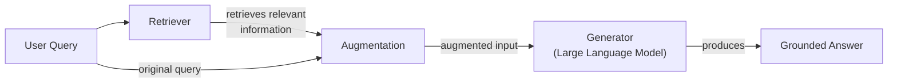
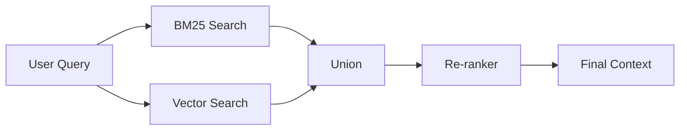
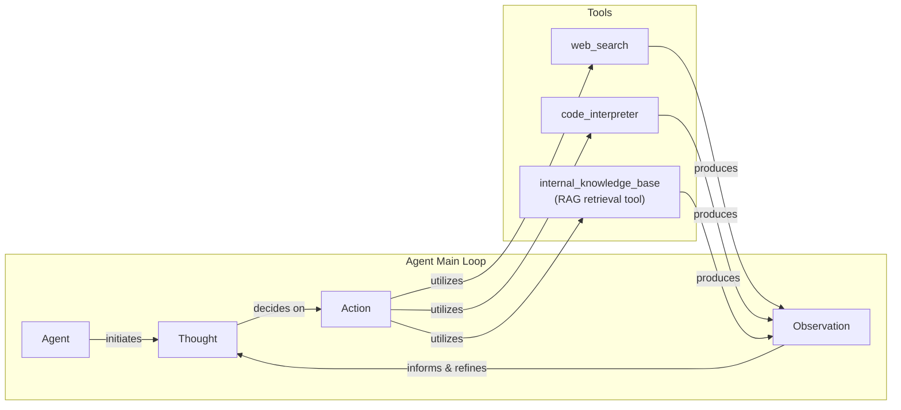

# Retrieval-Augmented Generation (RAG)

In our previous lessons, we’ve covered the landscape of AI engineering, distinguished between workflows and agents, and explored context engineering as the art of managing information flow to LLMs. We’ve seen how to get structured data out of models, give them tools to perform actions, and even implement reasoning loops with ReAct. All these components rely on a critical assumption: that the LLM has the right information to begin with.

But what happens when it doesn’t? LLMs are trained on a fixed dataset, a snapshot in time. They are essentially taking a "closed-book exam" on the world's information. This static knowledge creates two fundamental problems. First, their information becomes outdated, leaving them unaware of events that occurred after their training cutoff date. Second, when faced with questions outside their training data, they are prone to "hallucinate" or confidently invent plausible but incorrect facts [[1]](https://blogs.nvidia.com/blog/what-is-retrieval-augmented-generation/).

We do not yet have efficient techniques to enable models to learn continuously after deployment. While fine-tuning can update a model's internal knowledge, it is an expensive and slow process. It requires curating large datasets of question-answer pairs and involves significant computational cost, making it impractical for keeping an LLM constantly updated with new or rapidly changing information [[2]](https://neo4j.com/blog/developer/fine-tuning-vs-rag/). This makes fine-tuning a poor solution for dynamic knowledge requirements.

This is where Retrieval-Augmented Generation (RAG) comes in. RAG is a core technique in context engineering that solves this knowledge problem by giving the LLM an "open-book exam." Instead of relying on memorized facts, the model can access external, real-time knowledge sources to find the information it needs [[3]](https://decodingml.substack.com/p/rag-fundamentals-first?utm_source=publication-search). Just as we use manuals or cheat sheets, an LLM can use RAG to retrieve relevant data and ground its answers in verifiable facts. This approach is more flexible, cost-effective, and allows for easy updates by simply modifying the external data source.

In this lesson, we will explore RAG, starting with its core components and the end-to-end pipeline. We will then cover advanced techniques for production-grade systems and see how RAG evolves into a powerful tool within agentic architectures. This knowledge is not just an add-on; it is a foundational skill for any AI engineer building reliable and trustworthy applications. In our next lesson, we will see how agent memory complements retrieval, but for now, let's focus on giving our models the power of external knowledge. With the problem and motivation clear, we’ll first decompose RAG into its core components so you can see where each responsibility lives.

## The RAG System: Core Components

To build effective RAG systems, you first need to understand their three conceptual pillars. As we discussed in Lesson 3 on Context Engineering, managing the flow of information is key. RAG formalizes this process by breaking it down into distinct, manageable stages: Retrieval, Augmentation, and Generation [[4]](https://towardsai.net/p/l/a-complete-guide-to-rag).

**Retrieval** is the engine of the RAG system. Its job is to find the most relevant information from an external knowledge base in response to a user's query. The most common approach is semantic search, which finds text that is contextually similar in meaning, even if the wording is different. This is made possible by vector embeddings, which are numerical representations of text that capture its semantic essence [[5]](https://tutorialsdojo.com/aws-vector-databases-explained-semantic-search-and-rag-systems/).

These embeddings are created by an embedding model and stored in a specialized vector database. When a user asks a question, their query is also converted into a vector. The system then searches the database for the vectors—and their corresponding text chunks—that are closest in meaning to the query vector [[12]](https://medium.com/@robi.tomar72/how-rag-actually-works-embeddings-vector-databases-indexing-retrieval-explained-simply-3d1ca45fe1bf). Another popular method is keyword-based search, like BM25, which excels at finding exact term matches and often complements semantic search [[6]](https://pub.towardsai.net/vector-databases-in-practice-building-a-realistic-hybrid-search-rag-system-with-qdrant-7b8f4a6e41e0).

**Augmentation** is the process of preparing the retrieved information for the LLM. Once the retriever has found the most relevant document chunks, this stage combines them with the original user query to create an "augmented prompt." This new prompt provides the LLM with the necessary context to formulate an accurate and informed response [[7]](https://www.topquadrant.com/resources/blog-retrieval-augmented-generation-explained/). Effective prompt engineering is essential here to ensure the model understands that it should prioritize the provided context over its internal knowledge, instructing it to answer only from the given sources.

**Generation** is the final step. The augmented prompt is sent to the LLM, which then generates a response. Because the model now has access to specific, relevant, and verifiable information, its answer is "grounded" in the provided data. This dramatically reduces the risk of hallucination and allows the system to cite its sources, building user trust and making the outputs more reliable for real-world applications [[8]](https://highlearningrate.substack.com/p/the-rise-of-rag).


Image 1: A flowchart illustrating the core components and conceptual flow of a Retrieval Augmented Generation (RAG) system.

Understanding these three components is the first step in designing a RAG system. Now that you can name each moving part, let’s see how they line up across the two phases of a real system.

## The RAG Pipeline: Ingestion and Retrieval

An end-to-end RAG system operates in two distinct phases: an offline ingestion pipeline to prepare the knowledge base and an online retrieval pipeline that answers queries at runtime [[9]](https://newsletter.systemdesign.one/p/how-rag-works). This separation allows the computationally intensive work of data processing to happen in the background, ensuring that the user-facing retrieval process is fast and efficient.

### Phase 1: Offline Ingestion & Indexing

This phase is all about preparing your data to be searchable. It runs in the background, either on a schedule or whenever new documents are added, ensuring your knowledge base is always up-to-date.

1.  **Load:** The process begins by loading raw documents from various sources, which could be anything from PDFs and web pages to APIs and databases. Frameworks like LangChain provide a wide array of document loaders, and LlamaIndex offers specialized readers to handle diverse data formats [[10]](https://medium.com/@derrickryangiggs/rag-pipeline-deep-dive-ingestion-chunking-embedding-and-vector-search-abd3c8bfc177).
2.  **Split:** Since documents are often too large to fit into an embedding model's context window, they must be broken down into smaller, meaningful pieces, or "chunks." This is a critical step, as poor chunking can separate related ideas and harm retrieval quality. Strategies range from simple fixed-size splits, often implemented with tools like LangChain's `RecursiveCharacterTextSplitter`, to more advanced semantic chunking that respects paragraph or section boundaries, like LlamaIndex's `SemanticSplitter` [[11]](https://learn.microsoft.com/en-us/azure/developer/ai/advanced-retrieval-augmented-generation).
3.  **Embed:** Each chunk is then passed through an embedding model, which converts the text into a high-dimensional vector. This vector is a numerical representation of the chunk's semantic meaning. Popular embedding models include OpenAI's `text-embedding-3` series, Google's `text-embedding-004`, as well as offerings from Cohere, Voyage, and open-source variants like BGE available through Hugging Face [[3]](https://decodingml.substack.com/p/rag-fundamentals-first?utm_source=publication-search).
4.  **Store:** Finally, these embeddings and their corresponding text chunks (along with any metadata) are loaded into a vector database. This database indexes the vectors for efficient similarity search. Options range from local, in-memory libraries like FAISS to scalable, production-ready databases such as Milvus, Qdrant, Pinecone, or vector-enabled search indexes like Elasticsearch and Azure AI Search [[12]](https://medium.com/@robi.tomar72/how-rag-actually-works-embeddings-vector-databases-indexing-retrieval-explained-simply-3d1ca45fe1bf).

### Phase 2: Online Retrieval & Generation

This phase happens in real-time when a user interacts with the system.

1.  **Query:** The user submits a query. This query can be pre-processed to normalize it or expand it for better matching, often orchestrated using a LangChain `Runnable` chain or a LlamaIndex `QueryEngine`.
2.  **Embed:** The user's query is converted into a vector using the *same* embedding model that was used during the ingestion phase. This is crucial for ensuring that the query and the document chunks exist in the same vector space, making their comparison meaningful [[13]](https://apxml.com/courses/prompt-engineering-llm-application-development/chapter-6-integrating-llms-external-data-rag/implementing-semantic-search-retrieval).
3.  **Search:** The system uses the query vector to search the vector database. It calculates the similarity (often using cosine similarity) between the query vector and all the chunk vectors in the index, returning the top-k most similar chunks [[14]](https://towardsdatascience.com/rag-explained-understanding-embeddings-similarity-and-retrieval/).
4.  **Generate:** The retrieved chunks are combined with the original query and a set of instructions into a single prompt. This augmented prompt is then passed to an LLM, which generates a final, grounded answer. As we learned in Lesson 4, using structured outputs can help format this answer and include citations back to the source documents, enhancing traceability [[3]](https://decodingml.substack.com/p/rag-fundamentals-first?utm_source=publication-search).

```mermaid
flowchart LR
  %% Phase 1: Offline Ingestion & Indexing
  subgraph "Offline Ingestion & Indexing"
    RD["Raw Documents"]
    L["Load"]
    S["Split"]
    E["Embed"]
    ST["Store"]

    RD -- "read" --> L
    L -- "process" --> S
    S -- "convert" --> E
    E -- "save" --> ST
  end

  %% Phase 2: Online Retrieval & Generation
  subgraph "Online Retrieval & Generation"
    UQ["User Query"]
    EQ["Embed Query"]
    SR["Search"]
    G["Generate"]

    UQ -- "vectorize" --> EQ
    EQ -- "find similar" --> SR
    SR -- "build prompt & call LLM" --> G
  end

  %% Connection between phases
  ST -- "provides data for" .-> SR

  %% Visual grouping
  classDef phaseBox stroke-width:2px,stroke:#333,fill:#f9f9f9
  class "Offline Ingestion & Indexing", "Online Retrieval & Generation" phaseBox
```
Image 2: A detailed flowchart depicting the two distinct phases of an end-to-end RAG pipeline: Offline Ingestion & Indexing and Online Retrieval & Generation.

With the end-to-end path in place, the next question is quality. What are the advanced techniques to make retrieval more accurate and useful across messy, real-world data?

## Advanced RAG Techniques

A naive RAG pipeline often performs well in demos but can break down in production. To build a robust system, you need to move beyond basic vector search and incorporate more sophisticated techniques to improve retrieval quality and relevance [[15]](https://neo4j.com/blog/genai/advanced-rag-techniques/). These methods address the nuances of real-world data and complex user queries, ensuring that the context provided to the LLM is as precise and useful as possible.

### Hybrid Search

Vector search is great for understanding meaning, but it can miss specific keywords, acronyms, or product IDs. Hybrid search solves this by combining the strengths of semantic (vector) search with traditional keyword-based search, like BM25 [[16]](https://mlpills.substack.com/p/issue-76-optimize-rag-with-hybrid). For example, if a customer support query is "my bill keeps rolling over," a keyword search will find articles with the exact term "rollover," while a semantic search might also find guides on "carryover balances." By fusing the results from both, you get more comprehensive coverage [[4]](https://towardsai.net/p/l/a-complete-guide-to-rag).

### Re-ranking

The initial retrieval step is optimized for speed and recall, often returning a larger set of candidate documents than needed. However, not all of these documents are equally relevant. A re-ranker, typically a more powerful but slower cross-encoder model, is used as a second pass. It takes the query and each retrieved document as a pair and computes a more accurate relevance score [[17]](https://redis.io/blog/10-techniques-to-improve-rag-accuracy/). This allows you to re-order the candidates and send only the most relevant ones to the LLM. For instance, for a query like "how to connect my account," a re-ranker would prioritize a step-by-step guide over a press release that happens to mention the same keywords.

The reason for this trade-off lies in their architecture. The initial retrieval typically uses a **bi-encoder**, which creates separate vector embeddings for the query and the documents. The comparison is fast but loses nuance because the query and document tokens never interact.

A **cross-encoder**, in contrast, concatenates the query and document into a single input and processes them together. This allows for deep cross-attention between every query token and every document token, resulting in a much more accurate relevance score. However, this comes at the cost of higher computational complexity, as nothing can be pre-computed, making it a bottleneck in high-throughput systems where tail latencies can explode under load [[26]](https://towardsdatascience.com/advanced-rag-retrieval-cross-encoders-reranking/).


Image 3: A flowchart illustrating the Hybrid Retrieval Flow with re-ranking.

### Query Transformations

Sometimes, the user's question isn't the best query for your retrieval system. Query transformation techniques rewrite or expand the query to improve its chances of matching the right documents.

-   **Decomposition:** This technique breaks down a complex, multi-part question into several simpler sub-queries. For example, "What’s our travel policy for conferences in Europe this year?" could be decomposed into: (1) "What is the travel policy?", (2) "What are the rules for conferences?", and (3) "Are there specific rules for Europe in 2024?". The system retrieves documents for each sub-query and then synthesizes the results [[18]](https://docs.nvidia.com/rag/latest/query_decomposition.html). Perfecting decomposition is an open challenge, as it requires balancing the need for comprehensive recall (by splitting the query) against the risk of retrieving too many irrelevant documents for each sub-part [[28]](https://arxiv.org/html/2510.18633v1).
-   **Hypothetical Document Embeddings (HyDE):** This approach flips the search process on its head. Instead of directly embedding the user's query, it first asks an LLM to generate a hypothetical, ideal answer. This generated answer is then embedded and used for the similarity search. The idea is that the hypothetical answer is likely to be semantically closer to the actual answer documents than the original, often short, query [[19]](https://47billion.com/blog/rag-system-in-production-why-it-fails-and-how-to-fix-it/). While effective, its precision is limited because the generated document is not factually guaranteed, relying on the LLM's ability to create a plausible answer that aligns well in the vector space with the true documents [[27]](https://towardsdatascience.com/advanced-query-transformations-to-improve-rag-11adca9b19d1/).

### Advanced Chunking Strategies

How you split your documents has a huge impact on retrieval quality. The optimal strategy often depends on the document's structure and the types of queries you expect [[29]](https://www.llamaindex.ai/glossary/document-chunking-strategies). Moving beyond simple fixed-size chunks can preserve critical context.

-   **Semantic Chunking:** Instead of splitting by a fixed number of tokens, this method groups sentences into chunks based on their semantic similarity. This ensures that coherent ideas and topics are kept together, which is especially useful for dense academic papers or long-form articles [[20]](https://sarthakai.substack.com/p/improve-your-rag-accuracy-with-a).
-   **Layout-aware Chunking:** For documents with complex structures like PDFs with tables, headers, and figures, this strategy uses the document's layout to guide the chunking process. For example, it ensures that a table row is not split from its header, preserving the data's integrity [[20]](https://sarthakai.substack.com/p/improve-your-rag-accuracy-with-a).

### GraphRAG

For questions about complex relationships and interconnected data, standard document retrieval often falls short. GraphRAG addresses this by first constructing a knowledge graph from the source documents, where entities (like people, companies, or products) are nodes and their relationships are edges. Retrieval can then traverse this graph to answer multi-hop questions that require connecting information across multiple documents [[21]](https://arxiv.org/html/2404.16130).

This is particularly useful in enterprise settings with deeply hierarchical and interconnected documents (e.g., legal contracts with amendments), where standard RAG fails because it cannot follow explicit citations or respect temporal precedence between conflicting documents [[30]](https://arxiv.org/html/2604.14220v1). For example, a query like “Which incidents were caused by weekend deploys that also touched the login service?” can be answered by tracing connections between deployment records, incident tickets, and service logs in the graph [[22]](https://arxiv.org/html/2501.00309v2).

These techniques increase retrieval quality. Next, we’ll see how retrieval becomes one tool that an agent can choose to use as it reasons.

## Agentic RAG

In Lessons 7 and 8, we explored the ReAct framework, where an agent cycles through a loop of Thought, Action, and Observation. Agentic RAG is the practical application of this concept, where retrieval is no longer a fixed step in a pipeline but a dynamic tool that an agent can choose to use. The agent reasons about its task, decides when it has a knowledge gap, and takes the action to retrieve information [[23]](https://weaviate.io/blog/what-is-agentic-rag).

The core distinction is the shift from a linear workflow to an adaptive control loop [[24]](https://towardsdatascience.com/agentic-rag-vs-classic-rag-from-a-pipeline-to-a-control-loop/).

-   **Standard RAG** is a pre-determined, one-pass process: Retrieve → Augment → Generate. It's efficient but rigid.
-   **Agentic RAG** is iterative and intelligent. The agent decides *when* to retrieve, *what* to retrieve, and *how many times* to retrieve, adapting its strategy based on the information it gathers.

This agentic approach unlocks several powerful capabilities. The agent can **iteratively refine its queries**; if the first retrieval pass yields vague results, it can generate a more specific query and try again. It can **choose which knowledge source to search**, routing a query about a recent outage to `search_incident_runbooks` instead of `search_marketing_pages`. It can also **fuse information** from its internal RAG tool with results from other tools, like a web search, to create a comprehensive answer. An agent can even decide to **update the knowledge base** with new information it learns, a concept we will explore further in Lesson 10 on Memory [[25]](https://www.ibm.com/think/topics/agentic-rag).

Consider this conceptual thought process for an agent handling a complex query:

> **Thought:** The user is asking about "2024 EU data retention rules." Our internal policy documents cite regulations from 2023. This information is likely outdated.
>
> **Action:** `retrieve(internal_policy, query="EU data retention 2024")`
>
> **Observation:** The retrieved document mentions recent amendments but lacks specific citations.
>
> **Thought:** I need to verify this externally.
>
> **Action:** `web_search(query="EU data retention rules 2024 official directive")`
>
> **Observation:** Found the official directive update from a government source.
>
> **Thought:** Now I have both the internal context and the latest external information. I will synthesize them, highlight the changes from 2023, and cite both sources.

This is the difference between a simple database lookup and a conversation with a knowledgeable research assistant. The agent doesn't just fetch data; it actively seeks, evaluates, and synthesizes it. However, this iterative freedom introduces new failure modes, such as getting stuck in "retrieval thrash" loops or handling conflicting information from different sources without a clear resolution strategy [[31]](https://towardsdatascience.com/agentic-rag-failure-modes-retrieval-thrash-tool-storms-and-context-bloat-and-how-to-spot-them-early/).


Image 4: A conceptual flowchart illustrating an agent's main loop in an Agentic RAG system, inspired by the ReAct framework.

You now understand both a linear RAG pipeline and how an agent can control retrieval when needed. Let’s wrap up by situating RAG in the wider AI Engineering toolkit and previewing what comes next.

## Conclusion

In this lesson, we’ve journeyed from the fundamentals of RAG to the frontiers of agentic retrieval. We’ve established that RAG is the industry's most widely used solution to the LLM knowledge problem, grounding models in factual, up-to-date information. For production-grade systems, advanced techniques like hybrid search, re-ranking, and GraphRAG are not just optimizations but necessities for achieving high-quality results. The future of knowledge retrieval is agentic, where RAG transforms from a static pipeline into a dynamic tool wielded by an intelligent agent.

The core benefits are clear: RAG reduces hallucinations, enables customization with proprietary data, and builds user trust through verifiable, source-based answers. As a subset of Context Engineering, RAG is not a niche skill but a foundational competency for any modern AI Engineer. It is the mechanism that allows our systems to reason over information they were never trained on, making them truly useful in specialized and dynamic domains.

In our next lesson, we will explore Memory for Agents, and see how short-term and long-term memory stores complement the retrieval mechanisms we’ve discussed today. We will also cover other critical topics like retrieval quality evaluation and production monitoring later in the course, which are essential for maintaining the reliability and performance of your RAG systems over time.

## References

- [1] [What Is Retrieval-Augmented Generation, aka RAG?](https://blogs.nvidia.com/blog/what-is-retrieval-augmented-generation/)
- [2] [Fine-Tuning vs. Retrieval Augmented Generation for LLMs](https://neo4j.com/blog/developer/fine-tuning-vs-rag/)
- [3] [Retrieval-Augmented Generation (RAG) Fundamentals First](https://decodingml.substack.com/p/rag-fundamentals-first?utm_source=publication-search)
- [4] [A Complete Guide to RAG](https://towardsai.net/p/l/a-complete-guide-to-rag)
- [5] [AWS Vector Databases Explained: Semantic Search and RAG Systems](https://tutorialsdojo.com/aws-vector-databases-explained-semantic-search-and-rag-systems/)
- [6] [Vector Databases in Practice: Building a Realistic Hybrid Search RAG System with Qdrant](https://pub.towardsai.net/vector-databases-in-practice-building-a-realistic-hybrid-search-rag-system-with-qdrant-7b8f4a6e41e0)
- [7] [Retrieval Augmented Generation Explained](https://www.topquadrant.com/resources/blog-retrieval-augmented-generation-explained/)
- [8] [The Rise of RAG](https://highlearningrate.substack.com/p/the-rise-of-rag)
- [9] [How RAG Works](https://newsletter.systemdesign.one/p/how-rag-works)
- [10] [RAG Pipeline Deep Dive: Ingestion (Chunking, Embedding) and Vector Search](https://medium.com/@derrickryangiggs/rag-pipeline-deep-dive-ingestion-chunking-embedding-and-vector-search-abd3c8bfc177)
- [11] [Build advanced retrieval-augmented generation systems](https://learn.microsoft.com/en-us/azure/developer/ai/advanced-retrieval-augmented-generation)
- [12] [How RAG Actually Works: Embeddings, Vector Databases, Indexing & Retrieval Explained Simply](https://medium.com/@robi.tomar72/how-rag-actually-works-embeddings-vector-databases-indexing-retrieval-explained-simply-3d1ca45fe1bf)
- [13] [Implementing Semantic Search for Retrieval](https://apxml.com/courses/prompt-engineering-llm-application-development/chapter-6-integrating-llms-external-data-rag/implementing-semantic-search-retrieval)
- [14] [RAG Explained: Understanding Embeddings, Similarity, and Retrieval](https://towardsdatascience.com/rag-explained-understanding-embeddings-similarity-and-retrieval/)
- [15] [Advanced RAG Techniques for High-Performance LLM Applications](https://neo4j.com/blog/genai/advanced-rag-techniques/)
- [16] [Optimize RAG with Hybrid Search](https://mlpills.substack.com/p/issue-76-optimize-rag-with-hybrid)
- [17] [10 Techniques to Improve RAG Accuracy](https://redis.io/blog/10-techniques-to-improve-rag-accuracy/)
- [18] [Query Decomposition](https://docs.nvidia.com/rag/latest/query_decomposition.html)
- [19] [RAG System in Production: Why It Fails and How to Fix It](https://47billion.com/blog/rag-system-in-production-why-it-fails-and-how-to-fix-it/)
- [20] [Improve your RAG accuracy with a Layout-Aware and Semantic Chunking Pipeline](https://sarthakai.substack.com/p/improve-your-rag-accuracy-with-a)
- [21] [From Local to Global: A GraphRAG Approach to Query-Focused Summarization](https://arxiv.org/html/2404.16130)
- [22] [GraphRAG: A Survey of Graph-Based Retrieval-Augmented Generation](https://arxiv.org/html/2501.00309v2)
- [23] [What is Agentic RAG](https://weaviate.io/blog/what-is-agentic-rag)
- [24] [Agentic RAG vs Classic RAG: From a Pipeline to a Control Loop](https://towardsdatascience.com/agentic-rag-vs-classic-rag-from-a-pipeline-to-a-control-loop/)
- [25] [What is agentic RAG?](https://www.ibm.com/think/topics/agentic-rag)
- [26] [Advanced RAG Retrieval: Cross-Encoders & Reranking](https://towardsdatascience.com/advanced-rag-retrieval-cross-encoders-reranking/)
- [27] [Advanced Query Transformations To Improve RAG](https://towardsdatascience.com/advanced-query-transformations-to-improve-rag-11adca9b19d1/)
- [28] [Budget-Constrained RAG with a Query-Rewriting Bandit](https://arxiv.org/html/2510.18633v1)
- [29] [Document Chunking Strategies](https://www.llamaindex.ai/glossary/document-chunking-strategies)
- [30] [Hierarchical and Multi-Hop RAG on Enterprise Documents](https://arxiv.org/html/2604.14220v1)
- [31] [Agentic RAG Failure Modes: Retrieval Thrash, Tool Storms, and Context Bloat (and how to spot them early)](https://towardsdatascience.com/agentic-rag-failure-modes-retrieval-thrash-tool-storms-and-context-bloat-and-how-to-spot-them-early/)