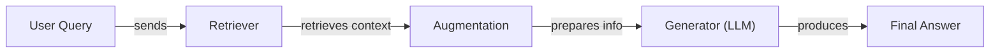
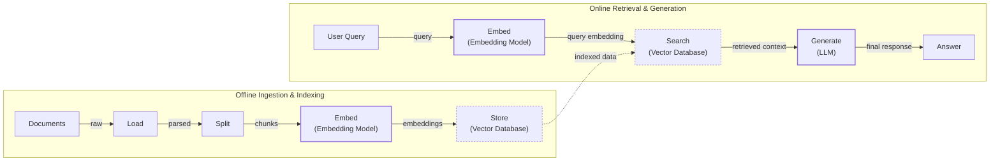
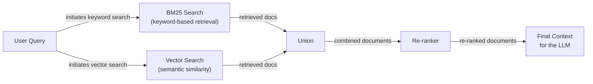
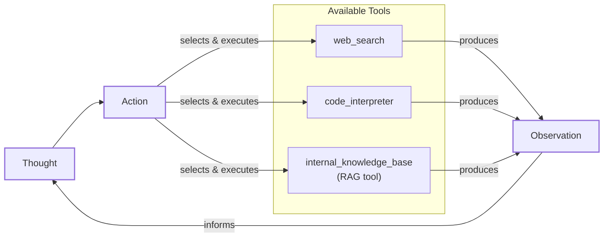

# Lesson 9: Retrieval-Augmented Generation

In our previous lessons, we have built a solid foundation in AI Engineering. We explored the landscape of AI agents, distinguished between rule-based workflows and autonomous agents, and in Lesson 3, we introduced Context Engineering—the art of managing the flow of information to an LLM. Now, we will dive deep into one of the most critical techniques in that discipline: Retrieval-Augmented Generation (RAG).

LLMs are trained on massive, but fixed, datasets. This process is like making them take a "closed-book exam" on the world's information. Their knowledge is frozen at a specific point in time, which makes them prone to fabricating answers, a phenomenon we call hallucination. We do not yet have efficient techniques to enable models to continuously learn from new information after they are deployed. While we can fine-tune them, this process is expensive and slow, unlike how humans learn from experience.

This is where RAG provides a reliable and practical solution. Instead of trying to force an LLM to memorize everything, we give it an "open-book exam." RAG connects the model to external, real-time knowledge sources, allowing it to retrieve relevant information on the fly. Just as we use manuals or cheat sheets instead of memorizing every detail, an LLM can use RAG to access the information it needs, precisely when it needs it.

As a core method within Context Engineering, RAG is what allows us to ground our AI applications in factual, up-to-date, and proprietary data. It transforms the LLM from a generalist into a domain-specific expert. It is important to distinguish this retrieval of external knowledge from an agent's internal memory, which we will explore in Lesson 10, where we discuss the short- and long-term memory stores that complement RAG.

In this lesson, we will cover the entire RAG landscape. We will start with the fundamental components and the end-to-end pipeline. Then, we will explore the advanced techniques that separate prototypes from production-grade systems. Finally, we will see how RAG evolves into a powerful tool within the agentic systems we learned about in previous lessons. With the problem and motivation clear, we’ll first decompose RAG into its core components so you can see where each responsibility lives.

## The RAG System: Core Components

Understanding the core components of RAG is the first step in the Context Engineering process of designing effective systems. At its heart, a RAG system is built on three conceptual pillars that work together to connect your data to the LLM's generative power.

Image 1: A flowchart illustrating the core components of a RAG system.

**Retrieval:** This is the engine responsible for finding relevant information. When a user asks a question, the retriever searches an external knowledge base to find the most relevant pieces of information. The most common approach is semantic search, which finds text that is contextually similar in meaning, even if the wording is different [[51]](https://apxml.com/courses/prompt-engineering-llm-application-development/chapter-6-integrating-llms-external-data-rag/implementing-semantic-search-retrieval). This is made possible by vector embeddings—numerical representations of text that capture its meaning. These embeddings are stored in a specialized vector database, which can efficiently search for vectors (and thus, text chunks) that are "closest" in meaning to the user's query vector [[7]](https://tutorialsdojo.com/aws-vector-databases-explained-semantic-search-and-rag-systems/). Another popular method is keyword-based search, using algorithms like BM25, which excels at finding exact term matches [[38]](https://mlpills.substack.com/p/issue-76-optimize-rag-with-hybrid).

**Augmentation:** Once the retriever has found the relevant information, the augmentation step takes over. This process involves taking the retrieved data—often small chunks of text—and preparing it to be included in the prompt that will be sent to the LLM [[56]](https://www.topquadrant.com/resources/blog-retrieval-augmented-generation-explained/). The goal is to "augment" the original user query with this new context. This is a critical step in prompt engineering, as the way this information is formatted and presented can significantly influence the quality of the final answer [[29]](https://www.ibm.com/think/topics/retrieval-augmented-generation).

**Generation:** This is the final step where the LLM comes into play. The model receives the augmented prompt, which contains both the original user query and the context retrieved from the external knowledge base. Using this combined input, the LLM generates a response that is grounded in the provided data [[30]](https://galileo.ai/blog/rag-architecture). This ensures the answer is not only relevant and accurate but also verifiable, as it is based on specific, retrievable sources rather than the model's internal, and potentially outdated, knowledge.

Now that you can name each moving part, let’s see how they line up across the two phases of a real system.

## The RAG Pipeline: Ingestion and Retrieval

A complete RAG system operates in two distinct phases: an offline ingestion pipeline to prepare the data, and an online retrieval pipeline that answers queries in real-time [[32]](https://newsletter.systemdesign.one/p/how-rag-works). Understanding this separation is key to building and maintaining an effective RAG application.

Image 2: A detailed flowchart depicting the two distinct phases of a RAG pipeline: Offline Ingestion & Indexing and Online Retrieval & Generation.

### Phase 1: Offline Ingestion & Indexing

This phase happens before any user interacts with the system. Its purpose is to process your knowledge base and create a searchable index. This is a crucial preprocessing step that determines the quality of what can be retrieved later [[33]](https://towardsdatascience.com/ragops-guide-building-and-scaling-retrieval-augmented-generation-systems-3d26b3ebd627/).

1.  **Load:** The process begins by loading your documents from various sources. These can be anything from PDFs and web pages to data from APIs or databases. Tools like LangChain's document loaders or LlamaIndex's readers are commonly used for this step.
2.  **Split:** Since LLMs have a limited context window, large documents must be broken down into smaller, manageable pieces called chunks. The way you split documents is critical; a good chunking strategy ensures that semantically related information stays together. You can use simple rule-based splitters, like LangChain’s `RecursiveCharacterTextSplitter`, or more advanced methods like LlamaIndex's `SemanticSplitter`.
3.  **Embed:** Each chunk of text is then converted into a vector embedding using an embedding model. This numerical representation captures the semantic meaning of the text. Popular models for this task include OpenAI's `text-embedding-3` series, Google's `text-embedding-004`, and open-source alternatives from providers like Cohere, Voyage, or Hugging Face.
4.  **Store:** Finally, these embeddings, along with their corresponding text and metadata, are loaded into a vector database. This specialized database is optimized for fast similarity searches, allowing the system to quickly find the most relevant chunks for a given query. Examples include local libraries like FAISS or production-grade databases like Milvus, Qdrant, and Pinecone.

### Phase 2: Online Retrieval & Generation

This phase is triggered in real-time when a user submits a query. It is the interactive part of the RAG system that delivers the final answer [[31]](https://medium.com/@derrickryangiggs/rag-pipeline-deep-dive-ingestion-chunking-embedding-and-vector-search-abd3c8bfc177/).

1.  **Query:** The user asks a question. In more advanced systems, this query might be preprocessed, normalized, or expanded to improve retrieval accuracy.
2.  **Embed:** The user's query is converted into a vector embedding using the *same* embedding model that was used during the ingestion phase. This ensures that the query and the document chunks are in the same vector space, making them comparable.
3.  **Search:** The system uses the query vector to search the vector database. It performs a similarity search (like cosine similarity) to find the top-k document chunks whose embeddings are closest to the query embedding. These chunks are considered the most relevant context for answering the question.
4.  **Generate:** The retrieved chunks are combined with the original user query and a set of instructions into a single prompt. This augmented prompt is then passed to an LLM, which generates a final, grounded answer. To ensure the answer is both useful and reliable, you can use techniques like the structured outputs we covered in Lesson 4 and include citations back to the source documents.

With the end-to-end path in place, the next question is quality: what are the advanced techniques to make the retrieval more accurate and useful across messy, real-world data?

## Advanced RAG Techniques

A basic RAG pipeline is a great start, but production systems often require more sophisticated techniques to handle the complexities of real-world data and user queries. These advanced methods focus on improving the quality and relevance of the retrieved information, which directly impacts the accuracy of the final answer.

Image 3: A flowchart illustrating the hybrid retrieval process, from user query to final context for an LLM.

### Hybrid Search

Vector search is powerful for understanding the meaning behind a query, but it can sometimes miss specific keywords, acronyms, or product codes. Hybrid search solves this by combining the strengths of semantic vector search with traditional keyword-based search, like BM25 [[39]](https://cubitrek.com/blog/hybrid-search-optimization-how-bm25-and-dense-vector-retrieval-work-together-for-superior-ai-search/). BM25 excels at finding exact matches, while vector search captures the broader context.

For example, in a customer support scenario, a user might ask, “My bill keeps rolling over.” A keyword search will find documents containing the exact term “rollover.” A semantic search might also find articles about “carryover balances.” By running both searches in parallel and fusing the results, the system can cover different phrasings of the same issue, leading to a more comprehensive retrieval [[37]](https://www.chitika.com/hybrid-retrieval-rag/).

### Re-ranking

The initial retrieval step is optimized for speed and recall, meaning it aims to quickly find a broad set of potentially relevant documents. However, the best document might not always be at the top of this initial list. Re-ranking introduces a second, more precise scoring step to improve relevance [[42]](https://redis.io/blog/10-techniques-to-improve-rag-accuracy/).

After the initial retrieval, a re-ranker model, often a cross-encoder, evaluates the query against each retrieved document individually. Unlike the initial search, which compares vectors independently, a cross-encoder processes the query and a document together, allowing for a deeper, more contextual assessment of relevance [[43]](https://apxml.com/courses/optimizing-rag-for-production/chapter-2-advanced-retrieval-optimization/reranking-architectures-rag). For a product help query like “how to connect my account,” a re-ranker can distinguish between a step-by-step guide, a press release, and a forum discussion, pushing the most useful guide to the top.

### Query Transformations

Sometimes, the user's query is not in the ideal format for retrieval. Query transformation techniques rewrite or decompose the query to improve its chances of matching the right documents.

-   **Decomposition:** This technique breaks down a complex, multi-part question into several simpler sub-questions. The system then retrieves documents for each sub-question and merges the results. For a query like, “What’s our travel policy for conferences in Europe this year?” the system might generate sub-questions such as: “Where is the travel policy document?”, “What are the rules for Europe?”, and “What has changed for this year?” [[19]](https://docs.nvidia.com/rag/latest/query_decomposition.html).
-   **Hypothetical Document Embeddings (HyDE):** Instead of directly embedding the user's query, HyDE first asks an LLM to generate a hypothetical, ideal answer. This generated answer, which is likely to be phrased similarly to the documents in the knowledge base, is then embedded and used for the search. For a travel policy question, the system might generate a draft like, “Employees can book economy flights and up to three hotel nights.” Searching for documents that resemble this answer often leads to the actual policy pages more effectively [[16]](https://47billion.com/blog/rag-system-in-production-why-it-fails-and-how-to-fix-it/).

### Advanced Chunking Strategies

How you split your documents can have a huge impact on retrieval quality. A naive fixed-size chunking approach can easily separate related information, leading to fragmented and incomplete context.

-   **Semantic Chunking:** Instead of splitting by a fixed number of characters, semantic chunking groups related sentences or paragraphs together based on their meaning. For example, splitting a handbook by section headings ensures that the entire "Reimbursements" section, including all rules and limits, is kept together as a single, coherent chunk.
-   **Layout-Aware Chunking:** For documents with complex structures like tables or forms, layout-aware chunking preserves the visual and structural relationships. When processing a pricing table, this method ensures that each row (product, price, discount) remains intact, preventing the system from retrieving a price without its corresponding product label.

### GraphRAG

For questions about complex relationships and interconnected data, standard document retrieval often falls short. GraphRAG addresses this by first constructing a knowledge graph from the documents, where entities (like people, companies, or products) are nodes and their relationships are edges [[46]](https://arxiv.org/html/2601.03014v1). This structured representation allows the system to answer multi-hop questions that require reasoning across multiple connections.

For instance, to answer, “Which incidents were caused by weekend deploys that also touched the login service?” a GraphRAG system can traverse the graph from "incident tickets" to "change records," filter by "deploy time," and then check for connections to the "login service," retrieving all the relevant incident reports along the way [[50]](https://arxiv.org/html/2501.00309v2). This approach excels at uncovering insights that are hidden in the connections between data points, not just within the text itself.

These techniques increase retrieval quality. Next, we’ll see how retrieval becomes one tool that an agent can choose to use as it reasons.

## Agentic RAG

The advanced techniques we have discussed so far optimize a linear, predefined workflow. However, the true power of retrieval is unlocked when it becomes a dynamic tool in the hands of an AI agent. This is the core idea behind Agentic RAG, which directly builds on the ReAct framework we covered in Lessons 7 and 8. In this paradigm, RAG is not a fixed pipeline but a capability that an agent can choose to use, or not use, as part of a broader reasoning process.

Image 4: A conceptual flowchart showing an agent's main iterative loop, including thought, action, tool selection, observation, and feedback.

The fundamental distinction is the shift from a static process to an adaptive one. Standard RAG follows a rigid path: Retrieve → Augment → Generate. Agentic RAG, on the other hand, is an iterative loop. The agent decides *when* to retrieve, *what* to retrieve, and *how many times* to retrieve, all based on its reasoning about the task at hand [[11]](https://towardsdatascience.com/agentic-rag-vs-classic-rag-from-a-pipeline-to-a-control-loop/).

This agentic approach enables several advanced capabilities:

-   **Iterative Refinement:** An agent can use the RAG tool multiple times in a sequence. If the first retrieval pass yields a vague policy, the agent can reason about the missing information, refine its query to be more specific (e.g., “EU customers, 2024 updates”), and retrieve again.
-   **Dynamic Source Selection:** An agent with access to multiple knowledge sources can choose the most appropriate one for a given query. For an IT outage, it might decide to `search_incident_runbooks` instead of `search_marketing_pages`.
-   **Information Fusion:** The agent can combine information from its RAG tool with outputs from other tools, like a web search or a code interpreter. For example, it could retrieve an internal policy, use a web search to verify current regulatory laws, and then synthesize a comprehensive answer that incorporates both sources.

Consider this simplified thought process for an agent tackling a complex query:

**Thought:** “The user is asking about ‘2024 EU data retention rules.’ Our internal policy document is from 2023, so it might be outdated.”
**Action:** `retrieve(internal_policy, query=“EU data retention 2024”)`
**Observation:** The retrieved text mentions recent amendments but lacks specific citations.
**Thought:** “I need to verify this externally to provide a complete and accurate answer.”
**Action:** `web_search(“EU data retention rules 2024 official directive”)`
**Observation:** The web search returns a link to the latest official EU directive.
**Thought:** “Now I can synthesize the information from our internal policy with the official external source, highlighting the changes from 2023.”

This is the difference between a simple database lookup and a conversation with a knowledgeable research assistant. The agent doesn't just follow a script; it reasons, plans, and adapts its strategy to find the best possible answer.

You now understand both a linear RAG pipeline and how an agent can control retrieval when needed. Let’s wrap up by situating RAG in the wider AI Engineering toolkit and previewing what comes next.

## Conclusion

We have journeyed from the fundamentals of RAG to the frontiers of agentic retrieval. The key takeaway is that RAG is the most widely adopted solution to the LLM's inherent knowledge limitations. It grounds models in facts, reduces hallucinations, and enables customization with proprietary data, building user trust through verifiable, source-based answers. For production-grade quality, advanced techniques like hybrid search and re-ranking are not just options but necessities.

The future of knowledge retrieval is agentic, where RAG transforms from a static pipeline into a dynamic tool that an intelligent agent can wield as part of a larger reasoning process. This positions RAG not as a niche skill but as a foundational competency for the modern AI Engineer, and a critical component of Context Engineering.

In our next lesson, we will explore Memory for Agents, a concept that complements retrieval. While RAG provides access to vast external knowledge, memory will give our agents the ability to learn from past interactions, remember user preferences, and maintain context over time. We will also touch upon other important topics later in the course, such as evaluating retrieval quality and monitoring these complex systems in production.

## References

- [1] https://neo4j.com/blog/developer/fine-tuning-vs-rag/
- [3] https://www.infoworld.com/article/2335043/addressing-ai-hallucinations-with-retrieval-augmented-generation.html
- [4] https://aclanthology.org/2024.emnlp-main.15.pdf
- [5] https://arxiv.org/html/2312.05934v3
- [6] https://pub.towardsai.net/vector-databases-in-practice-building-a-realistic-hybrid-search-rag-system-with-qdrant-7b8f4a6e41e0
- [7] https://tutorialsdojo.com/aws-vector-databases-explained-semantic-search-and-rag-systems/
- [8] https://qdrant.tech/articles/what-is-rag-in-ai/
- [9] https://wandb.ai/mostafaibrahim17/ml-articles/reports/Vector-Embeddings-in-RAG-Applications--Vmlldzo3OTk1NDA5
- [11] https://towardsdatascience.com/agentic-rag-vs-classic-rag-from-a-pipeline-to-a-control-loop/
- [12] https://www.pingcap.com/article/agentic-rag-vs-traditional-rag-key-differences-benefits/
- [13] https://medium.com/@gaddam.rahul.kumar/agentic-rag-vs-traditional-rag-b1a156f72167
- [14] https://airbyte.com/agentic-data/ai-agent-vs-rag
- [15] https://domino.ai/blog/rag-vs-agentic-ai
- [16] https://47billion.com/blog/rag-system-in-production-why-it-fails-and-how-to-fix-it/
- [18] https://cloudurable.com/blog/advanced-rag-techniques-that-will-transform-your-l/
- [19] https://docs.nvidia.com/rag/latest/query_decomposition.html
- [20] https://neo4j.com/blog/genai/advanced-rag-techniques/
- [21] https://medium.com/@fahey_james/retrieval-augmented-generation-building-grounded-ai-for-enterprise-knowledge-6bc46277fee5
- [22] https://www.mindstudio.ai/blog/what-is-rag/
- [25] https://www.madrona.com/rag-inventor-talks-agents-grounded-ai-and-enterprise-impact/
- [26] https://humanloop.com/blog/rag-architectures
- [27] https://www.aimon.ai/posts/rag_and_its_different_components/
- [28] https://toloka.ai/blog/grounding-llms-driving-ai-to-deliver-contextually-relevant-data/
- [29] https://www.ibm.com/think/topics/retrieval-augmented-generation
- [30] https://galileo.ai/blog/rag-architecture
- [31] https://medium.com/@derrickryangiggs/rag-pipeline-deep-dive-ingestion-chunking-embedding-and-vector-search-abd3c8bfc177
- [32] https://newsletter.systemdesign.one/p/how-rag-works
- [33] https://towardsdatascience.com/ragops-guide-building-and-scaling-retrieval-augmented-generation-systems-3d26b3ebd627/
- [35] https://aws.amazon.com/what-is/retrieval-augmented-generation/
- [37] https://www.chitika.com/hybrid-retrieval-rag/
- [38] https://mlpills.substack.com/p/issue-76-optimize-rag-with-hybrid
- [39] https://cubitrek.com/blog/hybrid-search-optimization-how-bm25-and-dense-vector-retrieval-work-together-for-superior-ai-search/
- [40] https://community.netapp.com/t5/Tech-ONTAP-Blogs/Hybrid-RAG-in-the-Real-World-Graphs-BM25-and-the-End-of-Black-Box-Retrieval/ba-p/464834
- [41] https://arxiv.org/html/2407.00072v5
- [42] https://redis.io/blog/10-techniques-to-improve-rag-accuracy/
- [43] https://apxml.com/courses/optimizing-rag-for-production/chapter-2-advanced-retrieval-optimization/reranking-architectures-rag
- [44] https://neo4j.com/blog/genai/advanced-rag-techniques/
- [45] https://towardsdatascience.com/advanced-rag-retrieval-cross-encoders-reranking/
- [46] https://arxiv.org/html/2601.03014v1
- [47] https://www.chitika.com/graph-based-retrieval-rag/
- [48] https://webhome.cs.uvic.ca/~thomo/papers/asonam2025-graphrag.pdf
- [49] https://atlan.com/know/what-is-graphrag/
- [50] https://arxiv.org/html/2501.00309v2
- [51] https://apxml.com/courses/prompt-engineering-llm-application-development/chapter-6-integrating-llms-external-data-rag/implementing-semantic-search-retrieval
- [52] https://medium.com/@robi.tomar72/how-rag-actually-works-embeddings-vector-databases-indexing-retrieval-explained-simply-3d1ca45fe1bf
- [53] https://learnopencv.com/vector-db-and-rag-pipeline-for-document-rag/
- [54] https://towardsdatascience.com/rag-explained-understanding-embeddings-similarity-and-retrieval/
- [55] https://tutorialsdojo.com/aws-vector-databases-explained-semantic-search-and-rag-systems/
- [56] https://www.topquadrant.com/resources/blog-retrieval-augmented-generation-explained/
- [58] https://medium.com/@rahulraut.techuse/introduction-to-augmenting-llms-using-retrieval-augmented-generation-rag-6530123dbb91
- [59] https://www.promptingguide.ai/research/rag
- [60] https://medium.com/@tejpal.abhyuday/retrieval-augmented-generation-rag-from-basics-to-advanced-a2b068fd576c