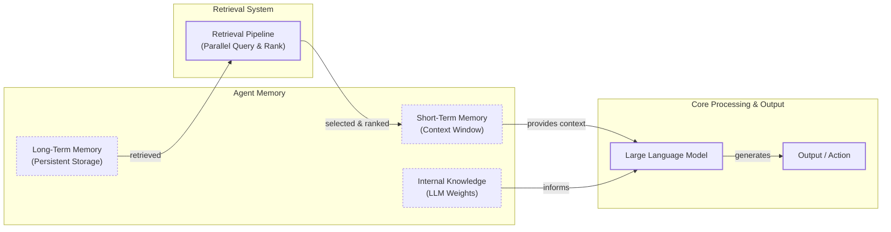

# How Memory for AI Agents Works

In the previous lessons, we built a foundation in AI Engineering. We explored the agent landscape, distinguished between rule-based LLM workflows and autonomous agents, and introduced context engineering. We learned that managing the information flow to an LLM is a core discipline for building advanced AI applications. Memory is one of its most important components. Memory is where the information is stored. Context engineering is the active process of deciding what to pull from that resource, how to format it, and when to load it into the model's working attention.

The core limitation of today's LLMs is that their knowledge is vast but frozen in time. They are fundamentally unable to learn by updating their weights after deployment, a problem known as "continual learning." This static nature means that without external help, an agent cannot remember past conversations, learn a user's preferences, or adapt its behavior over time. To overcome this, we can insert new knowledge into the context window, but this is a limited solution. An LLM without a persistent memory system is like a brilliant intern with amnesia; it can solve complex problems but is unable to recall previous conversations or learn from experience.

The context window acts as the LLM's "working memory" or RAM. However, it has significant limitations. First, it is finite. Even with models now supporting million-token contexts, you cannot realistically keep an entire conversation history plus all other necessary information. Second, it is expensive. Token pricing scales with context size, so stuffing the full history into every prompt spikes costs and latency [[18]](https://mem0.ai/blog/long-term-memory-ai-agents). Third, it introduces noise. A study on long-context models found that accuracy can crash when critical facts are placed in the middle of a long prompt, a problem known as the "lost-in-the-middle" effect [[18]](https://mem0.ai/blog/long-term-memory-ai-agents).

Just a couple of years ago, we were building agents with 8,000-token context windows. This forced us to be ruthless with compression, summarizing every interaction to fit within tight constraints. Today, with massive context windows, the engineering trade-offs have shifted. Less compression is needed, as we can afford to keep more raw detail. However, the fundamental challenge remains: we need a way for agents to persist information across sessions.

External memory systems are the practical, temporary solution that gives agents continuity and the ability to "learn." They are an engineering workaround for the model's inability to update its own knowledge. Production systems like ChatGPT have implemented opt-in memory features where the agent can decide to save important details. This is often done through an internal tool; the agent, after a conversation turn, might decide to call a function to upsert a new fact like "User's daughter is named Sarah" into a persistent store [[17]](https://langchain-ai.github.io/langgraph/concepts/memory/). This gives the user a sense of continuity, but it is an external system managing the memory, not the model itself learning.

In this lesson, we will explore the concept of agent memory, borrowing from cognitive science to understand how different types of data can be stored and retrieved to solve different kinds of problems. We will cover the layers of agent memory, the three types of long-term memory, the pros and cons of different storage approaches, practical code examples for implementing these memory types, and real-world challenges and best practices for building memory systems.

## The Layers of Memory: Internal, Short-Term, and Long-Term

To build effective agents, it helps to think about memory in a structured way. Borrowing terminology from biology and cognitive science gives us a powerful mental model. We can categorize an agent’s memory into three distinct layers: internal knowledge, short-term memory, and long-term memory.

**Internal Knowledge** is the static, pre-trained knowledge baked into the LLM's weights. This is the model's vast encyclopedia of general information about the world, learned during its training. It is read-only and cannot be updated with new experiences. This is why, without external systems, an LLM's knowledge remains frozen in time. It is the most efficient way to store general knowledge; the model knows entire books with an empty context window.

**Short-Term Memory** is the agent's working memory, which is the active context window of the LLM. It is volatile, fast, and limited in size. This is the only space where information is directly accessible to the LLM for immediate reasoning. It holds the current user query, recent conversation history, retrieved documents, and tool outputs. When an interaction ends, this memory is lost unless it is explicitly saved.

**Long-Term Memory** is an external, persistent storage system where an agent can save and retrieve information across different sessions. This is the agent's permanent knowledge base, allowing it to remember user preferences, past interactions, and learned skills over time.

The effectiveness of this system lies in the dynamic interplay between these layers. Information from long-term memory is not useful on its own; it must be retrieved and loaded into short-term memory to become actionable. This process is often managed by a retrieval pipeline that may query different memory types in parallel, then rank the results before injecting them into the prompt [[43]](https://vizuara.substack.com/p/a-primer-on-re-ranking-for-retrieval). This selective retrieval is the core idea behind Retrieval-Augmented Generation (RAG), a topic we will cover in detail in the next lesson [[14]](https://skymod.tech/why-memory-matters-in-llm-agents-short-term-vs-long-term-memory-architectures/). This ensures the LLM gets only the most relevant context for the current task, avoiding the noise and cost of a full history dump.


Image 1: A hierarchy and flow diagram illustrating the three fundamental layers of an agent's memory system: Internal Knowledge, Short-Term Memory, and Long-Term Memory, showing the retrieval process and interaction with the LLM.

These three layers work in concert. Internal knowledge provides general intelligence, short-term memory handles the immediate task, and long-term memory provides the specific context and personalization that the other layers lack. To better understand how to design the long-term memory layer, we can break it down even further.

## Long-Term Memory: Semantic, Episodic, and Procedural

Long-term memory is not a monolith. Just as human memory is divided into different types, we can structure an agent's long-term memory to handle different kinds of information [[2]](https://arxiv.org/html/2309.02427). This modular approach allows us to choose the right storage and retrieval strategy for each use case.

### Semantic Memory (Facts & Knowledge)

**Semantic memory** is the agent's encyclopedia of facts and knowledge. It is a repository of discrete pieces of information, such as user preferences, key entities, and domain-specific knowledge. The structure of this memory is highly dependent on the agent's purpose. It can range from simple, independent strings like `"The user is a vegetarian"` to structured entities like a JSON object: `{"user": {"food_restrictions": "vegetarian"}}`. For more complex domains, it might even be a knowledge graph that captures relationships between entities.

The primary role of semantic memory is to provide the agent with a reliable, queryable source of truth. For an enterprise agent, this might be a vector database containing internal company documents and technical manuals. For a personal assistant, it could be a user profile storing preferences (`"User likes rock music"`), relationships (`"User has a dog named George"`), or constraints (`"User is allergic to gluten"`). By extracting these facts from noisy conversation histories, the agent can retrieve critical information precisely when needed, without having to sift through irrelevant turns. This makes the agent knowledgeable and consistent across sessions [[27]](https://machinelearningmastery.com/beyond-short-term-memory-the-3-types-of-long-term-memory-ai-agents-need/).

### Episodic Memory (Experiences & History)

**Episodic memory** is the agent's personal diary. It is a chronological log of its past interactions and experiences. Unlike the timeless facts in semantic memory, episodic memories are about "what happened and when." Each memory is an "episode" tied to a specific point in time.

This memory type is crucial for maintaining conversational context and understanding the evolution of relationships or tasks. For example, a semantic memory might store two conflicting facts: `"User's brother is named Mark"` and `"User is frustrated with his brother"`. An episodic memory provides deeper context: `"On Tuesday, the user expressed frustration that their brother, Mark, always forgets their birthday. I provided an empathetic response. [created_at=2025-08-25T17:20:04.648191-07:00]"`. This nuance allows the agent to respond with greater intelligence and empathy in the future. The element of time also enables temporal queries like `"What did we talk about yesterday?"`. The granularity of these episodes—whether they capture a single turn, a full conversation, or a daily summary—is a design choice that depends on the product's needs [[27]](https://machinelearningmastery.com/beyond-short-term-memory-the-3-types-of-long-term-memory-ai-agents-need/).

### Procedural Memory (Skills & How-To)

**Procedural memory** is the agent's "muscle memory." It is a collection of learned skills, workflows, and "how-to" knowledge that guides its ability to perform multi-step tasks. It is a set of pre-defined playbooks for common requests.

This memory is often encoded directly into the agent's system prompt or as a library of callable tools and functions. For instance, an agent might have a stored procedure called `MonthlyReportIntent`. When a user asks for a monthly update, the agent doesn't need to reason from scratch. It retrieves and executes a clear series of steps from its procedural memory: 1) Query the sales database for the last 30 days, 2) Summarize the key findings, and 3) Ask the user if they want the summary emailed or displayed. This makes the agent's behavior on common tasks reliable, fast, and predictable. Advanced agents can even learn new procedures from user instructions, allowing them to dynamically expand their skillset over time. For example, an agent could be taught a new workflow for booking travel and then execute it autonomously in the future [[42]](https://dev.to/blackgirlbytes/turning-agent-history-into-procedural-memory-37f8).

Now that we understand what to store, we need to decide *how* to store it. This architectural choice has significant implications for an agent's performance and complexity.

## Storing Memories: Pros and Cons of Different Approaches

How an agent's memories are stored is a critical architectural decision that directly impacts its performance, complexity, and scalability. While the goal is always to provide the right context at the right time, the method of storage involves trade-offs. There is no one-size-fits-all solution; the ideal approach depends entirely on the product's use case. Let's explore the pros and cons of three primary methods.

Image 2: A diagram visualizing the three primary approaches to storing agent memories: as a simple list of raw strings, as structured JSON entities, and as an interconnected knowledge graph.
```mermaid
graph TD
    subgraph "Storage Approaches"
        A[Raw Strings]
        B[Structured Entities (JSON)]
        C[Knowledge Graph]
    end

    subgraph "Example: 'User's brother Mark is a software engineer.'"
        A --> A1["- User's brother Mark is a software engineer.<br/>- User's brother is now a doctor."];
        B --> B1["{<br/>&nbsp;&nbsp;'user': {<br/>&nbsp;&nbsp;&nbsp;&nbsp;'brother': {<br/>&nbsp;&nbsp;&nbsp;&nbsp;&nbsp;&nbsp;'name': 'Mark',<br/>&nbsp;&nbsp;&nbsp;&nbsp;&nbsp;&nbsp;'job': 'Software Engineer'<br/>&nbsp;&nbsp;&nbsp;&nbsp;}<br/>&nbsp;&nbsp;}<br/>}"];
        C --> C1["(User) --[HAS_BROTHER]--> (Mark)<br/>(Mark) --[WORKS_AS]--> (Software Engineer)"];
    end

    style A fill:#f9f,stroke:#333,stroke-width:2px
    style B fill:#ccf,stroke:#333,stroke-width:2px
    style C fill:#cfc,stroke:#333,stroke-width:2px
```
Image 2: A diagram visualizing the three primary approaches to storing agent memories: as a simple list of raw strings, as structured JSON entities, and as an interconnected knowledge graph.

### Storing Memories as Raw Strings

This is the simplest method, where conversational turns or documents are stored as plain text and indexed for vector search. This approach is fast to set up, as it involves logging text and creating embeddings with minimal engineering. It also preserves the full nuance of the original interaction, including emotional tone and subtle linguistic cues. However, this simplicity comes at a cost. Retrieval can be imprecise, as semantic similarity alone often isn't enough to find the correct fact. A query like "What is my brother's job?" might retrieve every past conversation mentioning "brother" and "job" without pinpointing the current, correct answer [[6]](https://www.decodingai.com/p/how-does-memory-for-ai-agents-work). Furthermore, updating information is difficult. If a user corrects a fact, the new information is simply added to the log, creating potential contradictions without a clear way to resolve them. This lack of structure also makes it hard to handle temporal reasoning or state changes, such as distinguishing between a past and present job title [[5]](https://danielp1.substack.com/p/memex-20-memory-the-missing-piece).

### Storing Memories as Entities (JSON-like Structures)

In this approach, unstructured interactions are converted into structured memories using an LLM and stored in a format like JSON. This method provides structure and precision. Information is organized into key-value pairs, allowing for exact, field-level filtering and retrieval. This makes it easy to update facts; if a user's preference changes, only the relevant field in the JSON object needs to be modified. This approach is ideal for semantic memory, where user profiles and preferences are stored as discrete facts. The main drawbacks are the increased upfront complexity of designing a schema and the potential for that schema to be too rigid. If the agent encounters information that does not fit the predefined structure, that data may be lost. While an LLM can dynamically alter the schema, this introduces its own challenges in managing schema drift and avoiding data duplication. Finally, the extraction process can strip away the rich subtext of the original conversation, losing valuable nuance [[1]](https://www.youtube.com/watch?v=7AmhgMAJIT4&list=PLDV8PPvY5K8VlygSJcp3__mhToZMBoiwX&index=112).

### Storing Memories in a Graph Database

This is the most advanced approach, where memories are stored as a network of nodes (entities) and edges (relationships), forming a knowledge graph. The core strength of a graph is its ability to explicitly represent complex relationships, such as `(User) -> [HAS_BROTHER] -> (Mark) -> [WORKS_AS] -> (Software Engineer)`. This enables sophisticated, multi-hop queries that can trace connections across different pieces of information. Knowledge graphs also provide superior contextual and temporal awareness by modeling time as an explicit property of a relationship [[10]](https://www.octoco.ai/blog/knowledge-graphs-as-memory). This leads to more accurate retrieval and provides a transparent, auditable reasoning path. However, this power comes with the highest complexity and cost. It requires a significant upfront investment in schema design, data modeling, and maintenance. Complex graph traversals can also be slower than simple vector lookups, and for many simple use cases, the overhead of a graph database is unnecessary.

<aside>
💡

The choice of memory storage should be guided by your product's core needs. A good practice is to start with the simplest architecture that delivers value and evolve it as the demands on your agent grow more complex.

</aside>

When an LLM is responsible for managing memory, you must implement guardrails. This includes schema validation to ensure data integrity, setting a low temperature for deterministic outputs, applying recency rules to resolve conflicts, and incorporating a human-in-the-loop review for critical updates.

Now that we know what to save and how to store it, let's look at some code examples using available memory tools.

## Memory Implementations with Code Examples

This section provides practical code examples for implementing the different memory types. While RAG is the mechanism for retrieving information (which we will cover in Lesson 10), the creation of high-quality memories is an equally important preceding step. We will use the open-source `mem0` library to demonstrate how to create and retrieve memories, focusing on a simple "raw string" storage approach to highlight the benefits of each memory category.

### Setup

First, let's introduce `mem0`, a memory layer for AI agents that automates the pipeline from raw text to retrievable memories [[4]](https://arxiv.org/html/2504.19413). It allows you to add, search, and manage different types of memories with a simple API. We will configure it to use Google's Gemini for embeddings and LLM operations, and a local ChromaDB instance as our vector store.

1.  We begin by configuring `mem0` with our Gemini model and a local ChromaDB vector store. This setup will handle the embedding and indexing of our memories.
    ```python
    import os
    import re
    from typing import Optional
    
    from google import genai
    from mem0 import Memory
    
    # Assumes GOOGLE_API_KEY is set in the environment
    client = genai.Client()
    MODEL_ID = "gemini-2.5-pro"
    
    MEM0_CONFIG = {
        "embedder": {
            "provider": "gemini",
            "config": {
                "model": "gemini-embedding-001",
                "embedding_dims": 768,
                "api_key": os.getenv("GOOGLE_API_KEY"),
            },
        },
        "vector_store": {
            "provider": "chroma",
            "config": {
                "collection_name": "lesson9_memories",
                "path": "/tmp/chroma_mem0",
            },
        },
        "llm": {
            "provider": "gemini",
            "config": {
                "model": MODEL_ID,
                "api_key": os.getenv("GOOGLE_API_KEY"),
            },
        },
    }
    
    memory = Memory.from_config(MEM0_CONFIG)
    MEM_USER_ID = "lesson9_notebook_student"
    memory.delete_all(user_id=MEM_USER_ID)
    print("✅ Mem0 ready (Gemini embeddings + local Chroma).")
    ```
    It outputs:
    ```text
    ✅ Mem0 ready (Gemini embeddings + local Chroma).
    ```

2.  Next, we define two helper functions. `mem_add_text` saves a string to memory with a specific category tag, and `mem_search` retrieves memories, optionally filtering by category. These functions can be exposed to an agent as tools, allowing it to autonomously manage its own memory.
    ```python
    def mem_add_text(text: str, category: str = "semantic", **meta) -> str:
        """Add a single text memory. No LLM is used for extraction or summarization."""
        metadata = {"category": category}
        for k, v in meta.items():
            if isinstance(v, (str, int, float, bool)) or v is None:
                metadata[k] = v
            else:
                metadata[k] = str(v)
        memory.add(text, user_id=MEM_USER_ID, metadata=metadata, infer=False)
        return f"Saved {category} memory."
    
    
    def mem_search(query: str, limit: int = 5, category: Optional[str] = None) -> list[dict]:
        """Category-aware search wrapper."""
        res = memory.search(query, user_id=MEM_USER_ID, limit=limit) or {}
    
        items = res.get("results", [])
        if category is not None:
            items = [r for r in items if (r.get("metadata") or {}).get("category") == category]
        return items
    ```

### Semantic Memory: Extracting Facts

Semantic memory is created through a deliberate extraction pipeline. An LLM processes unstructured text with a prompt designed to pull out atomic facts. This turns messy conversations into a queryable knowledge base. An example prompt for a personal assistant might be:
```
Extract persistent facts and strong preferences as short bullet points.
- Keep each fact atomic and context-independent. While reading the messages, make sure to notice the nuance or subtle details that might be important when saving these facts.
- 3–6 bullets max.

Text:
{My brother Mark is a software engineer, but his real passion is painting, he gifted me a painting a few years ago. Its really beautiful.}
```
This would create memories like: `Mark is the user's brother.`, `Mark is a software engineer.`, `Mark's real passion is painting.`, and `The user has a beautiful painting from Mark.`.

1.  We start by adding a few sample facts to our semantic memory. Each fact is a simple, self-contained string.
    ```python
    facts: list[str] = [
        "User prefers vegetarian meals.",
        "User has a dog named George.",
        "User is allergic to gluten.",
        "User's brother is named Mark and is a software engineer.",
    ]
    for f in facts:
        mem_add_text(f, category="semantic")
    
    print(f"Added {len(facts)} semantic memories.")
    ```
    It outputs:
    ```text
    Added 4 semantic memories.
    ```

2.  Now, we can search for a specific fact using a natural language query. Hybrid search, which combines keyword filtering with semantic relevance, is particularly effective here. The system could first filter for memories containing the keyword "brother" and then perform a vector search for "job" to find the most relevant fact.
    ```python
    results = memory.search("brother job", user_id=MEM_USER_ID, limit=1)
    print(results["results"][0]["memory"])
    ```
    It outputs:
    ```text
    User's brother is named Mark and is a software engineer.
    ```

### Episodic Memory: The Log of Events

Episodic memory functions as a chronological log. Memories can be raw conversation turns or summaries of interactions, each with a timestamp. This allows for both temporal and semantic queries.

1.  We simulate a short conversation and use an LLM to create a concise summary, which we will store as a single "episode."
    ```python
    dialogue = [
        {"role": "user", "content": "I'm stressed about my project deadline on Friday."},
        {"role": "assistant", "content": "I’m here to help—what’s the blocker?"},
        {"role": "user", "content": "Mainly testing. I also prefer working at night."},
        {"role": "assistant", "content": "Okay, we can split testing into two sessions."},
    ]
    
    episodic_prompt = f"""Summarize the following 3–4 turns as one concise 'episode' (1–2 sentences).
    Keep salient details and tone.
    
    {dialogue}
    """
    episode_summary = client.models.generate_content(model=MODEL_ID, contents=episodic_prompt)
    episode = episode_summary.text.strip()
    
    mem_add_text(episode, category="episodic", summarized=True, turns=4)
    ```

2.  Retrieval from episodic memory often blends temporal filtering with semantic search. A user could ask, "What did we talk about yesterday?" to filter by date. Here, we will use a semantic query to find conversations related to "deadline stress." The system retrieves the relevant episode along with its creation timestamp.
    ```python
    hits = mem_search("deadline stress", limit=1, category="episodic")
    for h in hits:
        print(f"Memory: {h['memory']}")
        print(f"Created At: {h['created_at']}")
    ```
    It outputs:
    ```text
    Memory: A user, stressed about a Friday project deadline because of testing and a preference for working at night, is advised to split the testing work into two manageable sessions.
    Created At: 2025-09-12T02:30:01.358468-07:00
    ```

### Procedural Memory: Defining and Learning Skills

Procedural memory can be defined by a developer or learned from user instructions. Retrieval is an intent-matching process where the agent's LLM selects the appropriate tool or function based on the user's request. An example prompt to teach a new skill could be:
```
You are an agent that can learn new skills. When a user provides a numbered list of steps to accomplish a goal, your task is to run the "learn_procedure" tool, and convert these numbered list of steps into a reusable procedure.

User Input: "I want you to book a cabin for this summer. To do that, please remember to: 1. Search for cabins on CabinRentals.com. 2. Filter for locations in the mountains. 3. Make sure it's available around July 4th to 8th. 4. Send me the top 3 options."
```
The agent would then call a tool to save a new procedure named `find_summer_cabin` with those steps.

1.  We define a simple, multi-step procedure for creating a monthly report and save it to our procedural memory.
    ```python
    procedure_name = "monthly_report"
    steps = [
        "Query sales DB for the last 30 days.",
        "Summarize top 5 insights.",
        "Ask user whether to email or display.",
    ]
    procedure_text = f"Procedure: {procedure_name}\nSteps:\n" + "\n".join(f"{i + 1}. {s}" for i, s in enumerate(steps))
    
    mem_add_text(procedure_text, category="procedure", procedure_name=procedure_name)
    print(f"Learned procedure: {procedure_name}")
    ```
    It outputs:
    ```text
    Learned procedure: monthly_report
    ```

2.  To "run" this procedure, the agent retrieves it by matching the user's intent ("how to create a monthly report") with the procedure's description. The agent can then parse the steps and execute them in sequence.
    ```python
    results = mem_search("how to create a monthly report", category="procedure", limit=1)
    if results:
        print(results[0]["memory"])
    ```
    It outputs:
    ```text
    Procedure: monthly_report
    Steps:
    1. Query sales DB for the last 30 days.
    2. Summarize top 5 insights.
    3. Ask user whether to email or display.
    ```

While `mem0` provides a simple and effective way to manage memory, it is one of several emerging solutions. For instance, `Letta` (formerly MemGPT) treats memory like an operating system, with "core memory" (context window) and "archival storage" (long-term), managing paging between them [[16]](https://docs.letta.com/guides/agents/memory). `Zep`, on the other hand, focuses on building dynamic knowledge graphs with temporal awareness, capturing how relationships evolve over time [[5]](https://danielp1.substack.com/p/memex-20-memory-the-missing-piece). `Mem0` strikes a balance, offering a straightforward API for developers to add memory quickly, while `Letta` provides more granular control for complex reasoning, and `Zep` excels at long-term, relationship-focused conversations.

These examples show how different memory types can be implemented to give agents a more robust understanding of facts, experiences, and skills. Now, let's discuss the practical challenges of building these systems for production.

## Real-World Lessons: Challenges and Best Practices

The architectural patterns we have discussed provide a useful toolkit, but moving from theory to a reliable, production-ready system requires navigating complex trade-offs. Here are some of the most important lessons learned from building and scaling agent memory systems in the real world.

### Re-evaluating Compression

One of the biggest shifts in memory design has been the trade-off between compressing information and preserving raw detail. Just two years ago, with small and expensive 8k-token context windows, we were forced to be ruthless with compression. The goal was to distill every interaction into its most compact form—summaries, facts, or entities. This process is inherently lossy; you keep the general idea but lose the fine-grained details and nuance crucial for a truly personalized agent [[1]](https://www.youtube.com/watch?v=7AmhgMAJIT4&list=PLDV8PPvY5K8VlygSJcp3__mhToZMBoiwX&index=112).

Today, with models offering million-token context windows at a fraction of the cost, the best practice is to lean towards less compression. The raw, unstructured conversational history is the ultimate source of truth. It contains the emotional subtext and relational dynamics that are often lost during extraction. While a fact might state, `"User has a dog named George"`, the episodic log reveals, `"User mentioned that walking their dog George is the best part of their day"`, a far more valuable insight for a personal companion. This doesn't mean compression is obsolete. For very long-running agents, summarizing older interactions is still necessary. However, the default should be to preserve as much raw detail as is economically and technically feasible. Use summarization and fact extraction as tools for creating queryable indexes, but always treat the raw log as the ground truth when possible. As context windows grow, your retrieval pipeline may need to do less *retrieving* and more intelligent *filtering* of a larger, in-context history.

### Designing for the Product

There is no "perfect" memory architecture. The concepts of semantic, episodic, and procedural memory are a powerful mental model, but they are a toolkit, not a mandatory blueprint. A common failure mode is over-engineering a complex, multi-part memory system for a product that does not need it.

Start from first principles by defining the core function of your agent. The product's goal should dictate the memory architecture, not the other way around.
-   For a Q&A bot over internal documents, a simple RAG pipeline is the best starting point. Your focus should be on building a robust, factually accurate knowledge base. Implementing a complex episodic memory system would be unnecessary overhead.
-   For a long-term personal AI companion, rich episodic memories that include a temporal element are beneficial. The agent's value comes from its ability to remember the narrative of your relationship. Simple semantic facts are useful, but they cannot fully capture the dynamic nature of a person's life.
-   For a task-automation agent, procedural memory is key. The agent needs to reliably recall and execute multi-step workflows. Here, consistency and reliability are more important than conversational nuance.

### The Human Factor

Memory exists to make the agent smarter, not to give the user a new job. A common pitfall, as highlighted in a case study by New Computer, is exposing the internal workings of the memory system to the user [[1]](https://www.youtube.com/watch?v=7AmhgMAJIT4&list=PLDV8PPvY5K8VlygSJcp3__mhToZMBoiwX&index=112). Their conversational journal, Dot, initially allowed users to view and edit the facts the agent stored. While well-intentioned, this created significant cognitive overhead and user stress.

Users should not be asked to "garden their agent's memories." It breaks the illusion of a capable assistant and turns the interaction into a tedious data-entry task. A user's mental model is that they are talking to a single entity; they do not want to become a database administrator.

Memory management should be an autonomous function of the agent. It should learn from corrections within the natural flow of conversation (e.g., "Actually, my brother's name is Mark, not Mike"). This is a difficult but crucial part of the design. The agent needs internal processes to periodically review, consolidate, and resolve conflicting information in its memory stores. For example, it might use an LLM-driven process to identify duplicate entities or outdated facts and merge or update them. The agent, not the user, is responsible for maintaining the integrity of its own knowledge.

## Conclusion

Memory sits at the core of AI agents, enabling them to be personalized and to "learn" over time. While today's memory tools are a temporary solution for the absence of true continual learning in LLMs, they are a powerful and practical approach that works right now. By thoughtfully designing memory systems that balance simplicity and capability, we can transform stateless chatbots into stateful, adaptive companions that provide real value. This is not just about storing data; it is about building systems that can reason across time, understand context, and build lasting relationships with users.

The concepts we have explored in this lesson are foundational. As LLMs continue to evolve, with ever-larger context windows and potentially more native learning abilities, our memory architectures will need to adapt. External memory systems might become more about intelligent filtering than retrieval, or they might integrate more deeply with the model's internal state. For now, mastering the art of building and managing external memory is a critical skill for any AI engineer.

In our next lesson, we will dive deeper into Retrieval-Augmented Generation (RAG), the primary mechanism for retrieving information from the memory systems we have discussed. We will also touch on more advanced topics in the future, such as multimodal processing, monitoring, and evaluation, as we continue our journey to building production-ready AI systems.

## References

- [1] [What is the perfect memory architecture?](https://www.youtube.com/watch?v=7AmhgMAJIT4&list=PLDV8PPvY5K8VlygSJcp3__mhToZMBoiwX&index=112)
- [2] [Cognitive Architectures for Language Agents](https://arxiv.org/html/2309.02427)
- [3] [Memory: The secret sauce of AI agents](https://decodingml.substack.com/p/memory-the-secret-sauce-of-ai-agents)
- [4] [Mem0: Building Production-Ready AI Agents with Scalable Long-Term Memory](https://arxiv.org/html/2504.19413)
- [5] [Memex 2.0: Memory The Missing Piece for Real Intelligence](https://danielp1.substack.com/p/memex-20-memory-the-missing-piece)
- [6] [How Does Memory for AI Agents Work?](https://www.decodingai.com/p/how-does-memory-for-ai-agents-work)
- [7] [A Practical Guide to Memory for Autonomous LLM Agents](https://towardsdatascience.com/a-practical-guide-to-memory-for-autonomous-llm-agents/)
- [8] [Beyond Short-term Memory: The 3 Types of Long-term Memory AI Agents Need](https://machinelearningmastery.com/beyond-short-term-memory-the-3-types-of-long-term-memory-ai-agents-need/)
- [9] [Memory in Agent Systems](https://www.newsletter.swirlai.com/p/memory-in-agent-systems)
- [10] [Knowledge Graphs as Memory: Why Your AI Agent Needs to Think in Relationships](https://www.octoco.ai/blog/knowledge-graphs-as-memory)
- [11] [What is AI agent memory?](https://www.ibm.com/think/topics/ai-agent-memory)
- [12] [Memory Systems for AI Agents: What the Research Says and What You Can Actually Build](https://stevekinney.com/writing/agent-memory-systems)
- [13] [PlugMem: Transforming raw agent interactions into reusable knowledge](https://www.microsoft.com/en-us/research/blog/from-raw-interaction-to-reusable-knowledge-rethinking-memory-for-ai-agents/)
- [14] [Why Memory Matters in LLM Agents: Short-Term vs. Long-Term Memory Architectures](https://skymod.tech/why-memory-matters-in-llm-agents-short-term-vs-long-term-memory-architectures/)
- [15] [Giving Your AI a Mind: Exploring Memory Frameworks for Agentic Language Models](https://medium.com/@honeyricky1m3/giving-your-ai-a-mind-exploring-memory-frameworks-for-agentic-language-models-c92af355df06)
- [16] [Introduction to Stateful Agents](https://docs.letta.com/guides/agents/memory)
- [17] [Memory overview](https://langchain-ai.github.io/langgraph/concepts/memory/)
- [18] [Long-Term Memory for AI Agents: The What, Why and How](https://mem0.ai/blog/long-term-memory-ai-agents)
- [42] [Turning Agent History into Procedural Memory](https://dev.to/blackgirlbytes/turning-agent-history-into-procedural-memory-37f8)
- [43] [A Primer on Re-ranking for Retrieval](https://vizuara.substack.com/p/a-primer-on-re-ranking-for-retrieval)