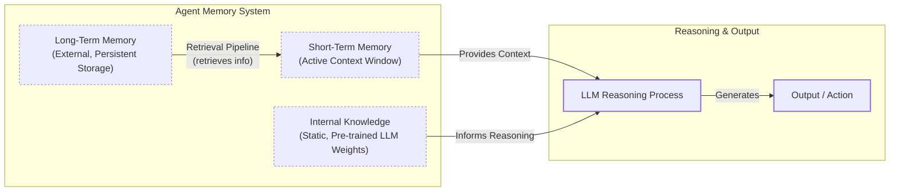
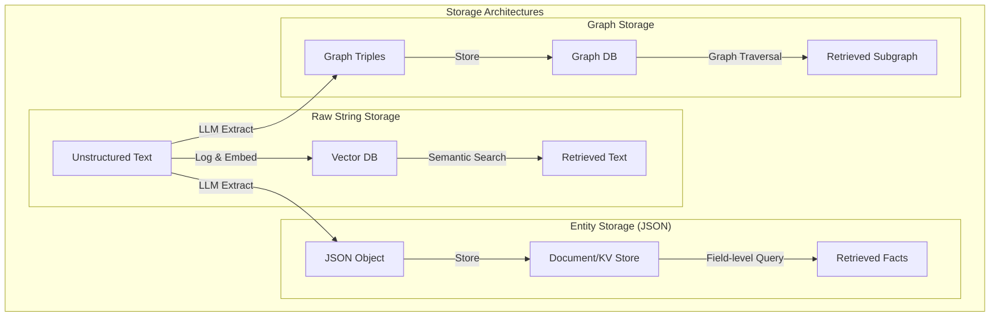

# How Does Memory for AI Agents Work?

In the previous lessons, we built a solid foundation in AI Engineering. We explored the agent landscape, distinguished between rule-based LLM workflows and autonomous agents, and mastered context engineering. We learned that to build effective AI systems, you must carefully manage the information fed to an LLM. Memory is the most important component of this process. It is where information is stored, while context engineering is the active process of deciding what to pull from that resource, how to format it, and when to load it into the model's working attention.

But why do agents need memory in the first place? LLMs have a fundamental limitation: their knowledge is vast but frozen in time. They are unable to learn by updating their parameters after deployment, a problem known as "continual learning." This challenge is not new. In 1945, Vannevar Bush envisioned the "Memex," a device to serve as an "enlarged intimate supplement" to human memory, using associative trails to link information much like the human mind [[35]](https://danielp1.substack.com/p/memex-20-memory-the-missing-piece). Today's agent memory systems are a modern realization of this vision. To overcome the LLM's limitations, you can inject new knowledge through the context window. However, this is a limited solution. An LLM without a persistent memory is like an intern with amnesia; it cannot recall previous conversations or learn from experience.

The context window acts as the agent's "working memory" or RAM, but it has serious constraints. Keeping an entire conversation history is often unrealistic due to several factors. First, there is the finite size. Even with models supporting million-token contexts, long-running interactions will eventually exceed this limit. Second, costs scale with the number of tokens, making it economically unviable to pass extensive histories in every turn. Third, performance degrades due to noise; too much irrelevant information can confuse the model, a problem known as the "lost-in-the-middle" effect, where models struggle to recall information buried deep within a long context [[3]](https://openreview.net/forum?id=5sB6cSblDR).

The technology is constantly evolving. Just a few years ago, with 8,000-token context windows, aggressive compression and summarization were not just best practices; they were necessities. Every interaction had to be distilled into its most compact form to fit within the model's limited attention. In a recent talk, Sam Whitmore, CEO of New Computer, explained how their team's strategy shifted as context windows grew to over a million tokens. Initially, they relied on these compression techniques, but now they are re-evaluating that approach, favoring raw conversational history as the best source of truth [[4]](https://www.youtube.com/watch?v=7AmhgMAJIT4&list=PLDV8PPvY5K8VlygSJcp3__mhToZMBoiwX&index=112). This shows that as AI engineers, you must continuously adapt your designs.

For now, external memory systems offer a practical workaround for the model's inability to learn. They provide agents with continuity and adaptability. Even commercial systems like ChatGPT have introduced opt-in memory features. The model decides what to remember or forget, and users have explicit controls to view, delete, or disable memories entirely. This highlights the industry's recognition of memory as a critical component for creating personalized experiences. In this lesson, we will explore the different layers and types of memory, borrowing concepts from cognitive science to create a clear mental model. We will cover how to store memories, implement them with code, and navigate the real-world challenges of building stateful agents.

## The Layers of Memory: Internal, Short-Term, and Long-Term

To build robust agents, it is useful to adopt terminology from biology and cognitive science. This helps us categorize memory and understand its function. We can think of an agent's memory as a system with three distinct layers: internal knowledge, short-term memory, and long-term memory [[1]](https://www.linkedin.com/posts/pauliusztin_every-ai-agent-has-4-distinct-memory-layers-activity-7436765234800807936-QyLR).

**Internal Knowledge** is the static, pre-trained information stored in the LLM's weights. This knowledge is read-only and cannot be updated during inference without fine-tuning. It includes vast world knowledge, language patterns, and reasoning abilities, providing the agent with a powerful but immutable foundation of general intelligence. This is the most efficient way to store information, as the model can access entire books' worth of knowledge with an empty context window. However, its static nature is precisely why external memory is necessary for agents that need to adapt to new information.

**Short-Term Memory**, or working memory, is the active context window of the LLM. It is volatile and limited, holding the immediate information for the current task: user input, retrieved facts, and conversation history [[2]](https://www.ibm.com/think/topics/ai-agent-memory), [[5]](https://www.newsletter.swirlai.com/p/memory-in-agent-systems). If information is not in the context window, it does not exist for the model. This is the only space where information is directly actionable for reasoning. Everything an agent "knows" at a given moment must be projected into this working space. Its limitations are significant. Beyond the physical size constraint, large contexts increase latency and cost. They also introduce noise, leading to "attentional dilution," where relevant content gets ignored because the window is too crowded [[7]](https://towardsdatascience.com/a-practical-guide-to-memory-for-autonomous-llm-agents/).

**Long-Term Memory** is an external, persistent storage system, like a database or file system. It gives the agent continuity across sessions by storing user preferences, past interactions, and learned facts [[1]](https://www.linkedin.com/posts/pauliusztin_every-ai-agent-has-4-distinct-memory-layers-activity-7436765234800807936-QyLR). This is the agent's institutional knowledge. It allows the agent to build on past experiences and provide personalized responses.

These layers form a filtering hierarchy. The agent retrieves relevant data from long-term memory, projects it into the short-term memory, and then uses its internal knowledge to reason and act. This dynamic interplay, often orchestrated by a retrieval pipeline, is what makes an agent feel coherent and intelligent. The process of pulling from long-term to short-term memory is a core component of Retrieval-Augmented Generation (RAG), a topic we will explore in depth in the next lesson [[1]](https://www.linkedin.com/posts/pauliusztin_every-ai-agent-has-4-distinct-memory-layers-activity-7436765234800807936-QyLR).



Image 1: A hierarchy and flow diagram illustrating the three fundamental layers of an AI agent's memory system: Internal Knowledge, Short-Term Memory, and Long-Term Memory, including a Retrieval Pipeline and reasoning flow.

No single layer can do it all. Internal knowledge provides baseline intelligence, short-term memory handles the immediate task, and long-term memory provides the personalization that the other layers cannot. To better understand how to design this persistent layer, let's break down the different types of long-term memory.

## Long-Term Memory: Semantic, Episodic, and Procedural

Long-term memory allows an agent to build a lasting understanding of its world and users. We can categorize it into three types, each serving a unique purpose: semantic, episodic, and procedural [[27]](https://machinelearningmastery.com/beyond-short-term-memory-the-3-types-of-long-term-memory-ai-agents-need/), [[34]](https://arxiv.org/html/2309.02427). These categories are not just loose analogies; they mirror concepts from cognitive architectures used in robotics, such as ACT-R, which formalizes the distinction between a declarative memory for facts and a procedural memory for skills [[46]](https://www.mdpi.com/2076-3417/15/10/5778).

### Semantic Memory (Facts & Knowledge)

**Semantic memory** is the agent's encyclopedia, a repository of factual information. This knowledge is not tied to a specific time or event. It stores what things *are* [[25]](https://atlan.com/know/types-of-ai-agent-memory/). The structure of this memory depends entirely on the agent's use case. It can range from simple strings like "User is a vegetarian" to structured data attached to an entity, like a user profile in JSON format: `{"food_restrictions": "vegetarian"}`. For more complex domains, it might even be a knowledge graph that captures relationships between entities [[27]](https://machinelearningmastery.com/beyond-short-term-memory-the-3-types-of-long-term-memory-ai-agents-need/).

For an enterprise agent, semantic memory might contain internal documents or a product catalog, providing a reliable source of truth on proprietary topics. For a personal assistant, it can be used to build a persistent profile of a user, storing preferences, relationships, or constraints. For example, it can remember that a user has a dog named George or is allergic to gluten. This allows the agent to retrieve relevant information without having to sift through a noisy conversation history.

### Episodic Memory (Experiences & History)

**Episodic memory** is the agent's personal diary, a chronological record of past interactions and events. Unlike the timeless facts in semantic memory, episodic memory is about "what happened and when" [[28]](https://www.mongodb.com/resources/basics/artificial-intelligence/agent-memory). Each memory is tied to a specific time, providing a rich, contextual narrative of the agent's experiences. The granularity of these episodes is a key design choice. Should an episode be a single conversational turn, an entire conversation, or a daily summary? The answer depends on the product. A therapy bot might benefit from turn-by-turn emotional tracking, while a project management agent might only need daily progress summaries [[4]](https://www.youtube.com/watch?v=7AmhgMAJIT4&list=PLDV8PPvY5K8VlygSJcp3__mhToZMBoiwX&index=112).

This memory type is crucial for maintaining conversational context and understanding complex dynamics. For example, a semantic memory might store "User's brother is named Mark" and "User is frustrated with his brother." An episodic memory captures the event with more nuance: "On Tuesday, the user expressed frustration that their brother, Mark, always forgets their birthday. I then provided an empathetic response. [created_at=2025-08-25T17:20:04]". This "episode" allows the agent to interact with more intelligence in the future. The time element also enables queries like "What did we talk about last week?"

### Procedural Memory (Skills & How-To)

**Procedural memory** is the agent's muscle memory, its collection of learned skills and workflows. It is the "how-to" knowledge that enables it to perform multi-step tasks reliably and efficiently [[26]](https://www.geeksforgeeks.org/artificial-intelligence/ai-agent-memory/). Think of it as a set of pre-defined playbooks for common requests.

This memory is often encoded as a reusable tool or function within the agent's system. For example, an agent might have a stored procedure for generating a monthly report. When a user requests an update, the agent retrieves this procedure, which defines a clear series of steps: 1) Query the sales database, 2) Summarize key findings, and 3) Ask the user for their preferred output format. This makes the agent's behavior on common tasks fast and predictable.

More advanced agents can learn new procedures dynamically. The CoALA framework describes how agents can write new code to their procedural memory, effectively updating their own source code [[34]](https://arxiv.org/html/2309.02427). For instance, an agent can be prompted to convert a user's numbered list of instructions into a reusable skill. This allows the agent to adapt and acquire new capabilities over time, moving beyond developer-defined functions. By encoding successful workflows, procedural memory helps an agent improve its efficiency, reduce errors, and execute complex jobs consistently [[4]](https://www.youtube.com/watch?v=7AmhgMAJIT4&list=PLDV8PPvY5K8VlygSJcp3__mhToZMBoiwX&index=112).

Now that we have an idea of what to save, how should we store it? This architectural decision comes with important trade-offs.

## Storing Memories: Pros and Cons of Different Approaches

How an agent's memories are stored is an architectural decision that impacts performance, complexity, and scalability. There is no one-size-fits-all solution; the ideal approach depends on your product's use case. Let's explore the trade-offs of three primary methods: storing memories as raw strings, as structured entities, and within a knowledge graph [[35]](https://danielp1.substack.com/p/memex-20-memory-the-missing-piece).

### Storing Memories as Raw Strings

This is the simplest method, where conversational turns or documents are stored as plain text and indexed for vector search. This approach is fast to set up and preserves the full nuance of the original interaction, including emotional tone [[6]](https://www.decodingai.com/p/how-does-memory-for-ai-agents-work). However, retrieval can be imprecise. A query like "What is my brother's job?" might surface every conversation mentioning "brother" and "job" without pinpointing the correct fact [[6]](https://www.decodingai.com/p/how-does-memory-for-ai-agents-work). Updating information is also a challenge; a user's correction simply adds another string to the log, creating potential contradictions. To manage this, you need robust strategies for deduplication and conflict resolution, often relying on timestamps to prioritize the most recent information. This approach also struggles with temporal reasoning, as it cannot easily distinguish between past and present states like "Barry *was* the CEO" versus "Claude *is* the CEO" [[8]](https://www.microsoft.com/en-us/research/blog/from-raw-interaction-to-reusable-knowledge-rethinking-memory-for-ai-agents/).

### Storing Memories as Entities (JSON-like Structures)

In this approach, an LLM extracts unstructured interactions into a structured format like JSON. This allows for precise, field-level filtering, making it easy to retrieve specific facts without ambiguity. For example, a query for a user's brother's job can be targeted directly at the `user.brother.job` field. Updates are also straightforward, as only the relevant field needs to be modified. This method is ideal for semantic memory, where user profiles and preferences are stored [[15]](https://blog.lqhl.me/mem0-how-three-prompts-created-a-viral-ai-memory-layer). The main drawback is the upfront complexity of designing a schema. A rigid schema can be inflexible, causing information that does not fit the structure to be lost. Allowing an LLM to dynamically alter the schema introduces its own challenges, such as managing schema drift and ensuring data consistency through entity resolution techniques. Furthermore, the extraction process can strip away the rich subtext of the original conversation [[4]](https://www.youtube.com/watch?v=7AmhgMAJIT4&list=PLDV8PPvY5K8VlygSJcp3__mhToZMBoiwX&index=112).

### Storing Memories in a Graph Database

This is the most advanced approach, where memories are stored as a network of nodes (entities) and edges (relationships) in a knowledge graph. Graphs excel at representing complex relationships, explicitly defining how different pieces of information are connected. This enables sophisticated queries that trace these connections, providing superior contextual and temporal awareness. For example, a graph can model time as a property of a relationship, allowing for accurate, grounded retrieval. Retrieval is also transparent and auditable, as you can trace the exact path that led to an answer [[10]](https://www.octoco.ai/blog/knowledge-graphs-as-memory). However, this method has the highest complexity and cost, requiring significant investment in schema design and maintenance. Converting unstructured text into structured graph triples is a non-trivial task, and complex graph traversals can be slower than simple vector lookups. For many use cases, the overhead of a graph database is not justified [[10]](https://www.octoco.ai/blog/knowledge-graphs-as-memory). Moderation of LLM-generated nodes and edges is also critical to prevent the graph from becoming polluted with noisy or incorrect links.



Image 2: A visualization of the three primary memory storage approaches: raw strings, structured entities (JSON), and knowledge graphs.

Ultimately, the choice of memory storage should be guided by your product's needs. A good practice is to start with the simplest architecture that delivers value and evolve it as your agent's requirements grow more complex.

## Memory Implementations with Code Examples

Now that we understand what to save and how to store it, let's look at some practical implementations. While Retrieval-Augmented Generation (RAG) is the mechanism for retrieving information, a topic we will cover in Lesson 10, the creation of high-quality memories is an equally important preceding step. Before retrieval can happen, an agent must first form the memory. We will use the open-source `mem0` library to demonstrate how to create semantic, episodic, and procedural memories, using the simple "raw strings" storage approach.

`mem0` is a memory layer designed for AI agents that simplifies the process of adding, managing, and retrieving memories. It provides a unified API to work with different types of memory and integrates with various LLMs, embedding models, and vector stores. This allows you to focus on the logic of your agent without getting bogged down in the details of memory infrastructure.

### Setup

First, we need to set up our environment. We will use Google's Gemini for both the LLM and embeddings, and a local ChromaDB instance for our vector store. The `mem0` library abstracts away the complexity of interacting with these components.

1.  We begin by configuring the Gemini API and importing the necessary packages.
    
    ```python
    from utils import env
    import os
    import re
    from typing import Optional
    from google import genai
    from mem0 import Memory
    
    env.load(required_env_vars=["GOOGLE_API_KEY"])
    
    client = genai.Client()
    MODEL_ID = "gemini-2.5-pro"
    ```
    
2.  Next, we create a configuration dictionary for `mem0`. This tells the library to use Gemini for embeddings and the core LLM, and to use a local ChromaDB instance as the vector store.
    
    ```python
    MEM0_CONFIG = {
        "embedder": {
            "provider": "gemini",
            "config": {
                "model": "gemini-embedding-001",
                "embedding_dims": 768,
                "api_key": os.getenv("GOOGLE_API_KEY"),
            },
        },
        "vector_store": {
            "provider": "chroma",
            "config": {
                "collection_name": "lesson9_memories",
                "path": "/tmp/chroma_mem0",
            },
        },
        "llm": {
            "provider": "gemini",
            "config": {
                "model": MODEL_ID,
                "api_key": os.getenv("GOOGLE_API_KEY"),
            },
        },
    }
    
    memory = Memory.from_config(MEM0_CONFIG)
    MEM_USER_ID = "lesson9_notebook_student"
    memory.delete_all(user_id=MEM_USER_ID)
    print("✅ Mem0 ready (Gemini embeddings + local Chroma).")
    ```
    
    It outputs:
    
    ```text
    ✅ Mem0 ready (Gemini embeddings + local Chroma).
    ```
    
3.  Finally, we define a few helper functions to simplify adding and searching for memories. The `mem_add_text` function will store a raw string with a specified category, and `mem_search` will retrieve memories, with an option to filter by that category. These functions could be exposed to an agent as tools, allowing it to autonomously decide when to write to or read from its memory.
    
    ```python
    def mem_add_text(text: str, category: str = "semantic", **meta) -> str:
        """Add a single text memory. No LLM is used for extraction or summarization."""
        metadata = {"category": category}
        for k, v in meta.items():
            if isinstance(v, (str, int, float, bool)) or v is None:
                metadata[k] = v
            else:
                metadata[k] = str(v)
        memory.add(text, user_id=MEM_USER_ID, metadata=metadata, infer=False)
        return f"Saved {category} memory."
    
    
    def mem_search(query: str, limit: int = 5, category: Optional[str] = None) -> list[dict]:
        """
        Category-aware search wrapper.
        Returns the full result dicts so we can inspect metadata.
        """
        res = memory.search(query, user_id=MEM_USER_ID, limit=limit) or {}
    
        items = res.get("results", [])
        if category is not None:
            items = [r for r in items if (r.get("metadata") or {}).get("category") == category]
        return items
    ```
    

### Semantic Memory: Extracting Facts

Semantic memory is created through an extraction pipeline. An LLM processes unstructured text with a prompt designed to pull out atomic facts. For a personal assistant, a prompt might be:
```
Extract persistent facts and strong preferences as short bullet points.
- Keep each fact atomic and context-independent. While reading the messages, make sure to notice the nuance or subtle details that might be important when saving these facts.
- 3–6 bullets max.

Text:
{My brother Mark is a software engineer, but his real passion is painting, he gifted me a painting a few years ago. Its really beautiful.}
```
This would result in memories like: `Mark is the user's brother. Mark is a software engineer. Mark's real passion is painting. The user has a painting from Mark and finds it beautiful.`

1.  Let's add a few facts to our semantic memory.
    
    ```python
    facts: list[str] = [
        "User prefers vegetarian meals.",
        "User has a dog named George.",
        "User is allergic to gluten.",
        "User's brother is named Mark and is a software engineer.",
    ]
    for f in facts:
        print(mem_add_text(f, category="semantic"))
    ```
    
    It outputs:
    
    ```text
    Saved semantic memory.
    Saved semantic memory.
    Saved semantic memory.
    Saved semantic memory.
    ```
    
2.  Now, we can search for a specific fact. The retrieval process often uses hybrid search, which combines keyword filtering with semantic search. For a query like "brother job," the system first filters for memories containing "brother" and then performs a vector search for "job" to find the most relevant fact.
    
    ```python
    results = memory.search("brother job", user_id=MEM_USER_ID, limit=1)
    print(results["results"][0]["memory"])
    ```
    
    It outputs:
    
    ```text
    User's brother is named Mark and is a software engineer.
    ```
    

### Episodic Memory: The Log of Events

Episodic memories are chronological logs of events, often with timestamps. They can be created by having an LLM summarize a conversation or by simply logging the raw text.

1.  Suppose we have a short dialogue we want to compress into a single "episode."
    
    ```python
    dialogue = [
        {"role": "user", "content": "I'm stressed about my project deadline on Friday."},
        {"role": "assistant", "content": "I’m here to help—what’s the blocker?"},
        {"role": "user", "content": "Mainly testing. I also prefer working at night."},
        {"role": "assistant", "content": "Okay, we can split testing into two sessions."},
    ]
    ```
    
2.  We can use an LLM to generate a concise summary of this interaction.
    
    ```python
    episodic_prompt = f"""Summarize the following 3–4 turns as one concise 'episode' (1–2 sentences).
    Keep salient details and tone.
    
    {dialogue}
    """
    episode_summary = client.models.generate_content(model=MODEL_ID, contents=episodic_prompt)
    episode = episode_summary.text.strip()
    print(episode)
    ```
    
    It outputs:
    
    ```text
    A user, stressed about a Friday project deadline because of testing and a preference for working at night, is advised to split the testing work into two manageable sessions.
    ```
    
3.  We store this summary as an episodic memory. `mem0` automatically adds a `created_at` timestamp, which is crucial for temporal queries.
    
    ```python
    print(
        mem_add_text(
            episode,
            category="episodic",
            summarized=True,
            turns=4,
        )
    )
    ```
    
    It outputs:
    
    ```text
    Saved episodic memory.
    ```
    
4.  Retrieval from episodic memory often blends temporal and semantic queries. A user might ask, "What were we discussing yesterday?" (a temporal query) or "What was I stressed about?" (a semantic query). Here, we search for "deadline stress."
    
    ```python
    hits = mem_search("deadline stress", limit=1, category="episodic")
    for h in hits:
        print(f"{h['memory']}\n")
        print(h)
    ```
    
    It outputs:
    
    ```text
    A user, stressed about a Friday project deadline because of testing and a preference for working at night, is advised to split the testing work into two manageable sessions.
    
    {'id': '...', 'memory': '...', 'hash': '...', 'metadata': {'turns': 4, 'summarized': True, 'category': 'episodic'}, 'score': 0.9109..., 'created_at': '2025-09-12T02:30:01.358468-07:00', 'updated_at': None, 'user_id': 'lesson9_notebook_student', 'role': 'user'}
    ```
    

### Procedural Memory: Defining and Learning Skills

Procedural memory can be defined by a developer or learned from user interactions. Here, we will define a simple procedure for creating a monthly report.

1.  We define the name and steps of the procedure and store it as a single text block.
    
    ```python
    procedure_name = "monthly_report"
    steps = [
        "Query sales DB for the last 30 days.",
        "Summarize top 5 insights.",
        "Ask user whether to email or display.",
    ]
    procedure_text = f"Procedure: {procedure_name}\nSteps:\n" + "\n".join(f"{i + 1}. {s}" for i, s in enumerate(steps))
    
    mem_add_text(procedure_text, category="procedure", procedure_name=procedure_name)
    
    print(f"Learned procedure: {procedure_name}")
    ```
    
    It outputs:
    
    ```text
    Learned procedure: monthly_report
    ```
    
2.  Retrieval is an intent-matching process. When a user's request semantically matches the description of a stored procedure, the agent can execute it. We simulate this by searching for the procedure by name.
    
    ```python
    results = mem_search("how to create a monthly report", category="procedure", limit=1)
    if results:
        print(results[0]["memory"])
    ```
    
    It outputs:
    
    ```text
    Procedure: monthly_report
    Steps:
    1. Query sales DB for the last 30 days.
    2. Summarize top 5 insights.
    3. Ask user whether to email or display.
    ```
    
### Production Alternatives: Zep and Letta

While `mem0` offers a flexible, developer-focused approach, other production-ready tools provide different trade-offs. **Zep**, for example, specializes in long-term conversational memory and uses a graph-based engine to capture evolving relationships and temporal data. Its bi-temporal model tracks both when an event happened and when the system learned about it, enabling complex queries like "What did the user prefer last month?" [[35]](https://danielp1.substack.com/p/memex-20-memory-the-missing-piece). **Letta** (formerly MemGPT) treats memory like an operating system, with core memory (RAM), working memory, and archival storage (disk). It exposes memory operations as function calls, giving the LLM direct control over what to remember or forget, which is powerful for complex reasoning but can increase latency [[35]](https://danielp1.substack.com/p/memex-20-memory-the-missing-piece).

Choosing between them depends on your needs. `mem0` is great for quick deployment and developer experience. `Zep` excels at complex, long-running conversations where relationship tracking is key. `Letta` is suited for applications requiring fine-grained agent control over memory operations.

These examples show how different memory types can be created and managed. Now, let's discuss some of the real-world challenges and best practices for implementing these systems.

## Real-World Lessons: Challenges and Best Practices

The architectural patterns we have discussed provide a useful toolkit, but moving from theory to a reliable production system requires navigating complex trade-offs. Here are some important lessons learned from building and scaling agent memory systems.

### Re-evaluating Compression

One of the biggest shifts in memory design has been the trade-off between compressing information and preserving its raw detail. Just a couple of years ago, LLMs operated with small and expensive context windows, forcing engineers to be ruthless with compression. The goal was to distill every interaction into its most compact form, but this process is inherently lossy; summaries keep the general idea but lose fine details [[4]](https://www.youtube.com/watch?v=7AmhgMAJIT4&list=PLDV8PPvY5K8VlygSJcp3__mhToZMBoiwX&index=112). This can lead to **summarization drift**, where repeated compression causes the agent's memory to lose detail and diverge from what actually happened [[7]](https://towardsdatascience.com/a-practical-guide-to-memory-for-autonomous-llm-agents/).

Today, with million-token context windows available at a fraction of the cost, the best practice is to lean towards less compression. The raw, unstructured conversational history is the ultimate source of truth. It contains the emotional subtext and relational dynamics that are often lost during extraction. While a fact might state, "User has a dog," the episodic log reveals, "User mentioned that walking their dog is the best part of their day," a far more valuable piece of information for a personalized agent.

The best practice is to design your system to work with the most complete version of history that is feasible. Use summarization and fact extraction to create queryable indexes, but always treat the raw log as the ground truth. As context windows grow, your retrieval pipeline may need to do less *retrieving* and more intelligent *filtering* of a larger in-context history [[4]](https://www.youtube.com/watch?v=7AmhgMAJIT4&list=PLDV8PPvY5K8VlygSJcp3__mhToZMBoiwX&index=112).

### Designing for the Product

There is no "perfect" memory architecture. Semantic, episodic, and procedural memory are a powerful mental model, but they are a toolkit, not a mandatory blueprint. A common failure mode is over-engineering a complex memory system for a product that does not need it. For example, building a full knowledge graph for a simple FAQ bot is unnecessary complexity [[4]](https://www.youtube.com/watch?v=7AmhgMAJIT4&list=PLDV8PPvY5K8VlygSJcp3__mhToZMBoiwX&index=112).

Start from first principles by defining the core function of your agent. The product's goal should dictate the memory architecture.

-   For a Q&A bot over internal documents, a simple RAG pipeline is often the best starting point. The focus should be on building a robust, factually accurate knowledge base [[27]](https://machinelearningmastery.com/beyond-short-term-memory-the-3-types-of-long-term-memory-ai-agents-need/).
-   For a long-term personal AI companion, rich episodic memories are beneficial. The agent's value comes from its ability to remember the narrative of your relationship.
-   For a task-automation agent, procedural memory is key. The agent needs to recall and execute multi-step workflows reliably [[27]](https://machinelearningmastery.com/beyond-short-term-memory-the-3-types-of-long-term-memory-ai-agents-need/).

A robust memory architecture must also account for common failure modes. **Memory blindness** occurs when important facts exist in storage but are never retrieved. A more insidious problem is **self-reinforcing errors**, where an agent stores an incorrect fact and then treats it as ground truth, leading to a cascade of bad decisions [[7]](https://towardsdatascience.com/a-practical-guide-to-memory-for-autonomous-llm-agents/).

### The Human Factor

Memory exists to make the agent smarter, not to give the user a new job. A common pitfall is exposing the internal workings of the memory system, thinking it will improve transparency. In practice, it often creates significant cognitive overhead for the user.

In her talk, Sam Whitmore shared that when they allowed users to view and edit the facts their agent had stored, users became stressed. They felt like they had to "garden their agent's memories," which broke the illusion of a capable assistant and turned the interaction into a tedious data-entry task [[4]](https://www.youtube.com/watch?v=7AmhgMAJIT4&list=PLDV8PPvY5K8VlygSJcp3__mhToZMBoiwX&index=112).

Memory management should be an autonomous function of the agent. It should learn from corrections within the natural flow of conversation, for example, "Actually, my brother's name is Mark, not Mike." The agent, not the user, is responsible for maintaining the integrity of its own knowledge. Design internal processes for the agent to periodically review, consolidate, and resolve conflicting information in its memory stores [[7]](https://towardsdatascience.com/a-practical-guide-to-memory-for-autonomous-llm-agents/).

This autonomy, however, introduces a critical security vulnerability: **memory poisoning**. This is a persistent attack where malicious instructions are injected into an agent's long-term memory, often through an untrusted document or webpage [[47]](https://christian-schneider.net/blog/persistent-memory-poisoning-in-ai-agents/). Unlike prompt injection, which is transient, memory poisoning creates a durable compromise. The attack is temporally decoupled: the injection can happen weeks or months before an unrelated user query triggers the malicious instructions, making it extremely difficult to detect [[48]](https://neuraltrust.ai/blog/memory-context-poisoning). Research has demonstrated practical attacks, such as the MINJA methodology, which can inject malicious reasoning steps into an agent's memory with over a 95% success rate. This vulnerability is so significant that OWASP has identified it as a top risk for agentic applications [[48]](https://neuraltrust.ai/blog/memory-context-poisoning). Defending against it requires a layered approach, including input moderation, memory sanitization, and trust-aware retrieval [[47]](https://christian-schneider.net/blog/persistent-memory-poisoning-in-ai-agents/).

## Conclusion

Memory is a core component that transforms a simple, stateless chatbot into a truly adaptive and personalized agent. It allows our systems to maintain continuity, learn from past interactions, and provide more capable and reliable assistance. The memory tools and architectural patterns we have discussed are the current, practical solution to the fundamental inability of LLMs to achieve true "continual learning." While they are a workaround, they are a powerful one that works today. This temporary nature is a critical perspective. These external systems are a bridge until foundation models develop more native, persistent learning capabilities.

As LLMs evolve, our approach to memory will undoubtedly change. With larger context windows and more advanced models, we may see a shift away from complex external memory systems toward more integrated, native learning abilities. The line between the model's internal knowledge and external memory may blur. For example, future models might implement mechanisms for learning and memory directly in their architecture, reducing the need for the elaborate retrieval and compression pipelines we build today. However, the core principles of structuring knowledge, learning from experience, and designing for the product will remain essential. The challenge for AI engineers will be to adapt these principles to a new generation of models, continuously re-evaluating the trade-offs between in-context learning and persistent, structured memory.

In our next lesson, we will explore in detail Retrieval-Augmented Generation (RAG), the mechanism that allows agents to retrieve the right information from their long-term memory at the right time. This is the next logical step in building truly knowledgeable and effective AI agents.

## References

- [1] https://www.linkedin.com/posts/pauliusztin_every-ai-agent-has-4-distinct-memory-layers-activity-7436765234800807936-QyLR
- [2] https://www.ibm.com/think/topics/ai-agent-memory
- [3] https://openreview.net/forum?id=5sB6cSblDR
- [4] https://www.youtube.com/watch?v=7AmhgMAJIT4&list=PLDV8PPvY5K8VlygSJcp3__mhToZMBoiwX&index=112
- [5] https://www.newsletter.swirlai.com/p/memory-in-agent-systems
- [6] https://www.decodingai.com/p/how-does-memory-for-ai-agents-work
- [7] https://towardsdatascience.com/a-practical-guide-to-memory-for-autonomous-llm-agents/
- [8] https://www.microsoft.com/en-us/research/blog/from-raw-interaction-to-reusable-knowledge-rethinking-memory-for-ai-agents/
- [9] https://stevekinney.com/writing/agent-memory-systems
- [10] https://www.octoco.ai/blog/knowledge-graphs-as-memory
- [11] https://ai.plainenglish.io/temporal-reasoning-in-ai-agent-memory-allens-interval-algebra-and-event-graphs-bd5fe9d3d1ef
- [12] https://neo4j.com/nodes-2025/agenda/building-evolving-ai-agents-via-dynamic-memory-representations-using-temporal-knowledge-graphs/
- [13] https://medium.com/@bijit211987/agents-that-remember-temporal-knowledge-graphs-as-long-term-memory-2405377f4d51
- [14] https://developers.openai.com/cookbook/examples/partners/temporal_agents_with_knowledge_graphs/temporal_agents
- [15] https://blog.lqhl.me/mem0-how-three-prompts-created-a-viral-ai-memory-layer
- [16] https://github.com/mem0ai/mem0/blob/main/mem0/configs/prompts.py
- [17] https://www.linkedin.com/posts/mem0_how-mem0-works-under-the-hood-1-message-activity-7376713317391896576-ALQP
- [18] https://mem0.ai/blog/long-term-memory-ai-agents
- [19] https://medium.com/@nirdiamant21/memory-optimization-strategies-in-ai-agents-1f75f8180d54
- [20] https://www.dailydoseofds.com/ai-agents-crash-course-part-15-with-implementation/
- [21] https://arxiv.org/html/2601.11653v1
- [22] https://atlan.com/know/types-of-ai-agent-memory/
- [23] https://www.geeksforgeeks.org/artificial-intelligence/ai-agent-memory/
- [24] https://machinelearningmastery.com/beyond-short-term-memory-the-3-types-of-long-term-memory-ai-agents-need/
- [25] https://www.mongodb.com/resources/basics/artificial-intelligence/agent-memory
- [26] https://ctoi.substack.com/p/memory-systems-in-ai-agents-episodic
- [27] https://machinelearningmastery.com/beyond-short-term-memory-the-3-types-of-long-term-memory-ai-agents-need/
- [28] https://www.mongodb.com/resources/basics/artificial-intelligence/agent-memory
- [29] https://docs.mem0.ai/platform/features/timestamp
- [30] https://atlan.com/know/episodic-memory-ai-agents/
- [31] https://arxiv.org/html/2504.19413v1
- [32] https://arxiv.org/html/2508.06433v2
- [33] https://openreview.net/forum?id=NTAhi2JEEE
- [34] https://arxiv.org/html/2309.02427
- [35] https://danielp1.substack.com/p/memex-20-memory-the-missing-piece
- [36] https://dev.to/blackgirlbytes/turning-agent-history-into-procedural-memory-37f8
- [37] https://vizuara.substack.com/p/a-primer-on-re-ranking-for-retrieval
- [38] https://www.comet.com/site/blog/retrieval-augmented-generation/
- [39] https://docs.cohere.com/docs/generating-parallel-queries
- [40] https://en.wikipedia.org/wiki/Memex
- [41] https://www.mdpi.com/2076-3417/15/10/5778
- [42] https://christian-schneider.net/blog/persistent-memory-poisoning-in-ai-agents/
- [43] https://neuraltrust.ai/blog/memory-context-poisoning
- [44] https://www.unite.ai/why-large-language-models-forget-the-middle-uncovering-ais-hidden-blind-spot/
- [45] https://arxiv.org/html/2508.06433v4
- [46] https://www.mdpi.com/2076-3417/15/10/5778
- [47] https://christian-schneider.net/blog/persistent-memory-poisoning-in-ai-agents/
- [48] https://neuraltrust.ai/blog/memory-context-poisoning