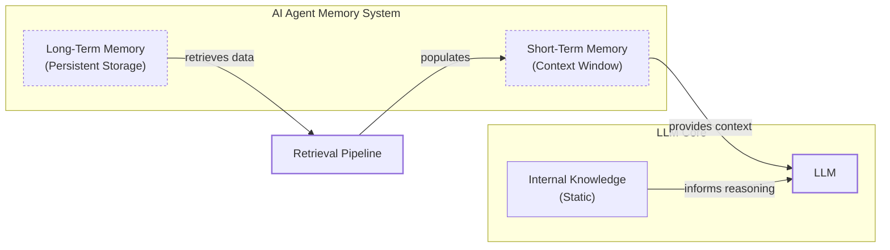

# Lesson 9: Memory for AI Agents

In previous lessons, you built a foundation in AI Engineering. You explored the agent landscape, distinguished between LLM workflows and autonomous agents, and mastered context engineering. You even built a reasoning agent from scratch using the ReAct framework. Now, we will tackle one of the most critical components of building intelligent systems: memory.

LLMs have a fundamental limitation: their knowledge is vast but frozen in time. They cannot learn or update their internal weights from new interactions after deployment, a problem known as "continual learning." An LLM without memory is like an intern with amnesia; it is brilliant but unable to recall previous conversations or learn from experience. To work around this, we use the model's context window to provide information. But as you learned in Lesson 3, the context window is like a computer's RAM. It is volatile and limited.

Simply stuffing an entire conversation history into the context is not a scalable solution. Even with million-token context windows, this approach is slow, expensive, and suffers from the "lost-in-the-middle" problem, where models ignore information buried in long prompts. Benchmarks show that relying on full-context injection can have a p95 latency of over 17 seconds and consume more than 26,000 tokens per conversation, making it nearly 15 times more expensive than selective retrieval [[13]](https://atlan.com/know/agent-memory-architectures/). The engineering reality is that we need a more sophisticated strategy.

This is where external memory systems come in. They provide a temporary but effective solution, giving agents the ability to maintain continuity, adapt to user preferences, and simulate learning over time. Many early agent-building efforts for personal AI companions quickly hit the limits of what was possible with 8k or 16k token context windows, forcing builders to engineer complex memory systems with aggressive compression and retrieval components [[6]](https://www.youtube.com/watch?v=7AmhgMAJIT4&list=PLDV8PPvY5K8VlygSJcp3__mhToZMBoiwX&index=112). While today's larger context windows change the calculus, the core challenge remains. Even commercial systems like ChatGPT implement memory as an opt-in feature that users can control, highlighting that memory management is still an active engineering problem, not a solved one.

For an AI Engineer, designing and implementing these memory systems is a core skill. It is what transforms a simple, stateless chatbot into a truly personalized and stateful AI companion.

In this lesson, we will explore the concept of agent memory, drawing inspiration from cognitive science to structure our thinking. We will differentiate between a model's static internal knowledge, its short-term working memory, and persistent long-term memory. We will then dive deep into the three types of long-term memory—semantic, episodic, and procedural—and show you how to implement them with practical code examples. Finally, we will cover the real-world challenges and best practices for building memory systems that are both powerful and efficient.

## The Layers of Memory: Internal, Short-Term, and Long-Term

To build effective memory systems, it helps to borrow terminology from biology and cognitive science. This approach is not just an analogy; it provides a robust framework for managing information. The idea is so foundational that research frameworks like CoALA (Cognitive Architectures for Language Agents) are explicitly designed around it [[3]](https://arxiv.org/html/2309.02427), [[14]](https://www.cognee.ai/blog/fundamentals/cognitive-architectures-for-language-agents-explained). The most influential of these is the Atkinson-Shiffrin "modal model" from 1968, which proposed that human memory consists of distinct stores connected by control processes [[15]](https://mem0.ai/blog/the-modal-model-of-memory-what-ai-agents-can-learn-from-cognitive-science). We can organize an agent's memory into a similar three-layer structure [[1]](https://www.linkedin.com/posts/pauliusztin_every-ai-agent-has-4-distinct-memory-layers-activity-7436765234800807936-QyLR), [[2]](https://www.newsletter.swirlai.com/p/memory-in-agent-systems).

**Internal Knowledge** is the static, pre-trained information stored inside the LLM’s weights. This includes world knowledge, language patterns, and reasoning abilities, all learned during its initial training phase. It is incredibly powerful but is also read-only. You cannot inject new user-specific knowledge into it during inference. Without fine-tuning, this knowledge base does not update, which is the core limitation that necessitates external memory systems.

**Short-Term Memory**, also known as working memory, is the agent's active context window. This is the only reality the model "sees" during a single inference call. It holds the user's input, retrieved facts from long-term memory, and any intermediate reasoning steps. It is volatile, ephemeral, and limited in size, but it is the only space where information is directly actionable by the LLM for immediate reasoning. If information is not in the context window, it does not exist for the model in that moment.

**Long-Term Memory** is an external, persistent storage system, such as a database, vector store, or file system. This is where an agent stores information across sessions, giving it continuity and the ability to "remember" past interactions, user preferences, and learned facts. It gives the agent a history that extends beyond a single conversation, enabling true personalization and long-term relationship building.

These layers work together in a dynamic retrieval pipeline. When a user interacts with an agent, relevant information is selectively pulled from long-term memory and loaded into the short-term context window. This process is a form of Retrieval-Augmented Generation (RAG), which we will explore in detail in the next lesson. The LLM then uses this curated context, combined with its internal knowledge, to reason and generate a response. This flow is what makes an agent feel coherent and intelligent.



Image 1: A hierarchy and flow diagram illustrating the three fundamental layers of an AI agent's memory system: Internal Knowledge, Short-Term Memory (Context Window), and Long-Term Memory, with the LLM as the central component.

Understanding these distinct layers is crucial. Internal knowledge provides general intelligence, short-term memory handles the immediate task, and long-term memory provides the personalization and historical context that the other layers lack. To build truly capable agents, we need to go deeper into the structure of long-term memory.

## Long-Term Memory: Semantic, Episodic, and Procedural

Just as human long-term memory is not a single, monolithic entity, an agent's long-term memory can be broken down into specialized components. Drawing again from cognitive science, we can categorize it into three main types: semantic, episodic, and procedural [[3]](https://arxiv.org/html/2309.02427), [[4]](https://decodingml.substack.com/p/memory-the-secret-sauce-of-ai-agents), [[5]](https://www.ibm.com/think/topics/ai-agent-memory). This model was put into practice by companies like New Computer for their conversational journal "Dot," where they found that a single memory architecture was insufficient and moved to a parallel system of four memory types, including these three [[6]](https://www.youtube.com/watch?v=7AmhgMAJIT4&list=PLDV8PPvY5K8VlygSJcp3__mhToZMBoiwX&index=112).

**Semantic Memory** is the agent's encyclopedia of facts and knowledge. It stores discrete pieces of information, often as simple strings ("The user is a vegetarian") or structured data attached to an entity (`{"user": {"food_restrictions": "vegetarian"}}`). The structure is highly dependent on the agent's use case. For an enterprise agent, this might be a knowledge base of internal documents. For a personal assistant like Dot, it is used to build a persistent profile of the user, storing preferences, relationships, or constraints like `"User is allergic to gluten"`. This allows the agent to retrieve specific, important information without having to sift through a noisy conversation history.

**Episodic Memory** is the agent's personal diary, a chronological record of its past experiences and interactions. Unlike the timeless facts in semantic memory, episodic memories are about "what happened and when." For example, while semantic memory might store "User's brother is named Mark," episodic memory would capture a specific event: `"On Tuesday, the user expressed frustration that their brother, Mark, always forgets their birthday. I provided an empathetic response. [created_at=2025-08-25T17:20:04]"`. This time-stamped "episode" provides a richer, more nuanced context, enabling the agent to interact with greater empathy and awareness in the future. It also allows the agent to answer temporal questions like "What did we discuss last week?". The granularity of these episodes can vary from a single turn to a daily or weekly summary, depending on the product's needs. For Dot, episodic memory was implemented as daily summaries to track what happened on a specific day [[6]](https://www.youtube.com/watch?v=7AmhgMAJIT4&list=PLDV8PPvY5K8VlygSJcp3__mhToZMBoiwX&index=112).

**Procedural Memory** is the agent's muscle memory—its collection of learned skills and workflows. This is the "how-to" knowledge that enables it to perform multi-step tasks reliably. This memory is often encoded as a reusable tool, function, or a sequence of actions defined in the agent's system prompt. For example, an agent might have a procedure for generating a monthly report: 1) Query the sales database, 2) Summarize key insights, and 3) Ask the user for their preferred output format. When a user requests a report, the agent executes this pre-defined playbook instead of reasoning from scratch. This makes its behavior on common tasks fast, predictable, and consistent. More advanced agents can even learn new procedures dynamically. For instance, Dot's procedural memory is triggered by situational similarity, allowing it to ask a reflective question when it senses a hidden emotion, a behavior learned from past interactions [[6]](https://www.youtube.com/watch?v=7AmhgMAJIT4&list=PLDV8PPvY5K8VlygSJcp3__mhToZMBoiwX&index=112).

Each of these memory types serves a distinct purpose. Semantic memory provides the facts, episodic memory provides the narrative context, and procedural memory provides the skills. Now that we understand *what* to save, the next critical question is *how* to store it.

## Storing Memories: Pros and Cons of Different Approaches

How an agent's memories are stored is an important architectural decision that directly impacts its performance, complexity, and scalability. There is no one-size-fits-all solution; the ideal approach depends entirely on your product's use case. Let's explore the pros and cons of three primary storage methods [[6]](https://www.youtube.com/watch?v=7AmhgMAJIT4&list=PLDV8PPvY5K8VlygSJcp3__mhToZMBoiwX&index=112), [[7]](https://www.decodingai.com/p/how-does-memory-for-ai-agents-work), [[8]](https://www.octoco.ai/blog/knowledge-graphs-as-memory).

### Storing Memories as Raw Strings

This is the simplest method, where conversational turns or documents are stored as plain text and indexed for vector search.

-   **Pros:** It is simple and fast to set up, requiring minimal engineering overhead. It also preserves the full nuance of the original interaction, including emotional tone and subtle linguistic cues, as nothing is lost in translation [[7]](https://www.decodingai.com/p/how-does-memory-for-ai-agents-work).
-   **Cons:** Retrieval is often imprecise. A query like “What is my brother’s job?” might retrieve every conversation mentioning “brother” and “job” without pinpointing the current fact [[7]](https://www.decodingai.com/p/how-does-memory-for-ai-agents-work). Updating facts is also difficult; a correction just adds another string to the log, creating potential contradictions. This approach lacks the structure needed to distinguish state changes over time (e.g., “Barry *was* CEO” vs. “Claude *is* CEO”) [[9]](https://danielp1.substack.com/p/memex-20-memory-the-missing-piece). On standard benchmarks, this approach achieves around 67% accuracy at a p95 latency of 1.44 seconds, a 91% speed gain over full-context injection but at the cost of lower accuracy [[13]](https://atlan.com/know/agent-memory-architectures/).

### Storing Memories as Entities (JSON-like Structures)

This approach uses an LLM to transform unstructured interactions into structured memories, often in a format like JSON.

-   **Pros:** Information is organized into key-value pairs, allowing for precise, field-level queries. This structure makes it easy to retrieve specific facts without ambiguity. Updating is also straightforward—if a user's preference changes, you simply update the relevant field in the JSON object [[9]](https://danielp1.substack.com/p/memex-20-memory-the-missing-piece). This method is ideal for semantic memory, where user profiles and preferences are stored.
-   **Cons:** This approach requires designing a schema, which adds upfront engineering complexity. A predefined schema can also be rigid; if new information does not fit the structure, it may be lost. While an LLM can dynamically alter the schema, this increases the risk of saving duplicated or inconsistent information. Furthermore, the extraction process can strip away the rich, emotional subtext of the original conversation [[6]](https://www.youtube.com/watch?v=7AmhgMAJIT4&list=PLDV8PPvY5K8VlygSJcp3__mhToZMBoiwX&index=112).

### Storing Memories in a Graph Database

This is the most advanced approach, where memories are stored as a network of nodes (entities) and edges (relationships), forming a knowledge graph.

-   **Pros:** Knowledge graphs excel at representing complex relationships explicitly, such as `(User) -> [HAS_BROTHER] -> (Mark) -> [WORKS_AS] -> (Software Engineer)`. This enables sophisticated, multi-hop queries that traverse these connections to answer questions no single memory entry can resolve [[16]](https://stevekinney.com/writing/agent-memory-systems). They also provide superior contextual and temporal awareness by modeling time as a property of a relationship (e.g., `User -[RECOMMENDED_ON_DATE: "2025-10-25"]-> Restaurant`) [[8]](https://www.octoco.ai/blog/knowledge-graphs-as-memory), [[10]](https://medium.com/@bijit211987/agents-that-remember-temporal-knowledge-graphs-as-long-term-memory-2405377f4d51). Retrieval is also transparent and auditable, as you can trace the exact path that led to an answer.
-   **Cons:** This method has the highest complexity and cost, requiring significant investment in schema design, data modeling, and maintenance. Converting unstructured text into structured graph triples is a complex task. Graph traversals can also be slower than simple vector lookups, potentially impacting real-time performance, with benchmarks showing p95 latencies around 2.59 seconds [[13]](https://atlan.com/know/agent-memory-architectures/). For many applications, the overhead of a graph database is unnecessary [[8]](https://www.octoco.ai/blog/knowledge-graphs-as-memory).

A critical challenge across all these methods is managing updates and resolving conflicts in "alive" user data. When a user corrects information, the system must determine whether to overwrite, version, or merge the new data. This requires a clear strategy, often involving an LLM with specific guardrails. For example, you might instruct the LLM to always prioritize the most recent information, validate new data against a schema, or flag contradictions for human review in critical applications.

```mermaid
graph TD
    subgraph "Memory Storage Approaches"
        A[Unstructured Text] --> B{Processing Layer};
        B --> C[Raw Strings<br/>(Vector DB)];
        B --> D[Entities<br/>(JSON/Document DB)];
        B --> E[Knowledge Graph<br/>(Graph DB)];
    end

    subgraph "Pros & Cons"
        C --> C_Pro1["Pro: Simple, Preserves Nuance"];
        C --> C_Con1["Con: Imprecise, Hard to Update"];
        
        D --> D_Pro1["Pro: Structured, Precise, Updatable"];
        D --> D_Con1["Con: Schema Rigidity, Loss of Nuance"];

        E --> E_Pro1["Pro: Models Relationships, Temporal Awareness"];
        E --> E_Con1["Con: High Complexity, Slower Queries"];
    end
```

Image 2: A visualization of the three primary approaches to storing agent memories, along with their respective pros and cons.

<aside>
💡

The choice of memory storage should be guided by your product's core needs. Start with the simplest architecture that delivers value and evolve it as the demands on your agent grow more complex.

</aside>

Now that we know what to save and how to store these memories, let's look at some code examples using an open-source memory library.

## Memory Implementations with Code Examples

This section provides a hands-on look at implementing the different memory types. While Retrieval-Augmented Generation (RAG) is the mechanism for *retrieving* information (which we will cover in Lesson 10), an agent must first *create* high-quality memories. This creation process is a foundational prerequisite for effective retrieval. We will use the `mem0` library to demonstrate this, focusing on the simple "storing memories as raw strings" approach to highlight the benefits of each memory category.

A key concept is that these memory functions can be exposed to the agent as tools. This allows the agent to autonomously decide when to write new information to its long-term memory or when to search its memory for relevant context, creating a self-managing memory loop.

### Setup

First, let's introduce `mem0`. It is a memory-centric architecture designed to give AI agents scalable long-term memory by dynamically extracting, consolidating, and retrieving information from conversations [[11]](https://arxiv.org/html/2504.19413). We will use it with Google's Gemini models and a local ChromaDB vector store.

1.  We begin by configuring `mem0` to use the Gemini `gemini-1.5-flash` model for fact extraction, `gemini-embedding-001` for embeddings, and a local ChromaDB instance for our vector store.
    ```python
    import os
    import re
    from typing import Optional
    
    from google import genai
    from mem0 import Memory
    from utils import env
    
    env.load(required_env_vars=["GOOGLE_API_KEY"])
    
    client = genai.Client()
    MODEL_ID = "gemini-1.5-flash"
    
    MEM0_CONFIG = {
        "embedder": {
            "provider": "gemini",
            "config": {
                "model": "gemini-embedding-001",
                "embedding_dims": 768,
                "api_key": os.getenv("GOOGLE_API_KEY"),
            },
        },
        "vector_store": {
            "provider": "chroma",
            "config": {
                "collection_name": "lesson9_memories",
                "path": "/tmp/chroma_mem0",
            },
        },
        "llm": {
            "provider": "gemini",
            "config": {
                "model": MODEL_ID,
                "api_key": os.getenv("GOOGLE_API_KEY"),
            },
        },
    }
    
    memory = Memory.from_config(MEM0_CONFIG)
    MEM_USER_ID = "lesson9_notebook_student"
    memory.delete_all(user_id=MEM_USER_ID)
    print("✅ Mem0 ready (Gemini embeddings + local Chroma).")
    ```
    It outputs:
    ```text
    ✅ Mem0 ready (Gemini embeddings + local Chroma).
    ```
2.  Next, we define two helper functions. `mem_add_text` saves a string to memory with a specific category tag. `mem_search` queries the memory, with an option to filter by category.
    ```python
    def mem_add_text(text: str, category: str = "semantic", **meta) -> str:
        """Add a single text memory. No LLM is used for extraction or summarization."""
        metadata = {"category": category}
        for k, v in meta.items():
            if isinstance(v, (str, int, float, bool)) or v is None:
                metadata[k] = v
            else:
                metadata[k] = str(v)
        memory.add(text, user_id=MEM_USER_ID, metadata=metadata, infer=False)
        return f"Saved {category} memory."
    
    
    def mem_search(query: str, limit: int = 5, category: Optional[str] = None) -> list[dict]:
        """
        Category-aware search wrapper.
        Returns the full result dicts so we can inspect metadata.
        """
        res = memory.search(query, user_id=MEM_USER_ID, limit=limit) or {}
    
        items = res.get("results", [])
        if category is not None:
            items = [r for r in items if (r.get("metadata") or {}).get("category") == category]
        return items
    ```

### Semantic Memory: Extracting Facts

Semantic memory is created through an extraction pipeline. An LLM processes unstructured text with a prompt designed to pull out atomic, context-independent facts.

An example extraction prompt for a personal assistant might be:
```
Extract persistent facts and strong preferences as short bullet points.
- Keep each fact atomic and context-independent.
- Notice subtle details that might be important.
- 3–6 bullets max.

Text:
{My brother Mark is a software engineer, but his real passion is painting. He gifted me a painting a few years ago. It's really beautiful.}
```
The system would store facts like: `Mark is the user's brother.`, `Mark is a software engineer.`, `Mark's real passion is painting.`, and `The user has a beautiful painting from Mark.`.

Let's implement this by adding a few facts to our semantic memory.

1.  We define and add a list of facts to our memory store, tagging them with the "semantic" category.
    ```python
    facts: list[str] = [
        "User prefers vegetarian meals.",
        "User has a dog named George.",
        "User is allergic to gluten.",
        "User's brother is named Mark and is a software engineer.",
    ]
    for f in facts:
        print(mem_add_text(f, category="semantic"))
    
    print(f"Added {len(facts)} semantic memories.")
    ```
    It outputs:
    ```text
    Saved semantic memory.
    Saved semantic memory.
    Saved semantic memory.
    Saved semantic memory.
    Added 4 semantic memories.
    ```
2.  Now, we can search for a specific fact. A query for "brother job" successfully retrieves the relevant memory using semantic similarity. Retrieval is enhanced by hybrid search, which combines keyword filtering (e.g., for the entity "brother") with a vector search for semantic relevance (matching "job" to "software engineer").
    ```python
    results = memory.search("brother job", user_id=MEM_USER_ID, limit=1)
    print(results["results"][0]["memory"])
    ```
    It outputs:
    ```text
    User's brother is named Mark and is a software engineer.
    ```

### Episodic Memory: The Log of Events

Episodic memories function as a chronological log. They can be created by summarizing interactions or by logging raw conversation turns with a timestamp. This preserves the "what and when" of an experience.

1.  Here, we take a short dialogue and use an LLM to create a concise, one-sentence summary to store as a single "episode."
    ```python
    dialogue = [
        {"role": "user", "content": "I'm stressed about my project deadline on Friday."},
        {"role": "assistant", "content": "I’m here to help—what’s the blocker?"},
        {"role": "user", "content": "Mainly testing. I also prefer working at night."},
        {"role": "assistant", "content": "Okay, we can split testing into two sessions."},
    ]
    
    episodic_prompt = f"""Summarize the following 3–4 turns as one concise 'episode' (1–2 sentences).
    Keep salient details and tone.
    
    {dialogue}
    """
    episode_summary = client.models.generate_content(model=MODEL_ID, contents=episodic_prompt)
    episode = episode_summary.text.strip()
    print(episode)
    ```
    It outputs:
    ```text
    A user, stressed about a Friday project deadline because of testing and a preference for working at night, is advised to split the testing work into two manageable sessions.
    ```
2.  We add this summary to our memory, tagging it as "episodic" and including metadata about the interaction.
    ```python
    print(
        mem_add_text(
            episode,
            category="episodic",
            summarized=True,
            turns=4,
        )
    )
    ```
    It outputs:
    ```text
    Saved episodic memory.
    ```
3.  A search for "deadline stress" retrieves this episode. Effective retrieval here combines semantic search with temporal filtering, such as re-ranking results by recency to prioritize the most recent interactions related to "stress."
    ```python
    print("\nSearch --> 'deadline stress'\n")
    hits = mem_search("deadline stress", limit=1, category="episodic")
    for h in hits:
        print(f"{h['memory']}\n")
        print(h)
    ```
    It outputs:
    ```text
    Search --> 'deadline stress'
    
    A user, stressed about a Friday project deadline because of testing and a preference for working at night, is advised to split the testing work into two manageable sessions.
    
    {'id': '...', 'memory': 'A user, stressed about a Friday project deadline because of testing and a preference for working at night, is advised to split the testing work into two manageable sessions.', 'hash': '...', 'metadata': {'turns': 4, 'summarized': True, 'category': 'episodic'}, 'score': 0.91..., 'created_at': '2025-09-12T02:30:01.358468-07:00', 'updated_at': None, 'user_id': 'lesson9_notebook_student', 'role': 'user'}
    ```

### Procedural Memory: Defining and Learning Skills

Procedural memory can be defined by a developer or learned from user instructions. Here, we will define a simple procedure for creating a monthly report.

1.  We define the procedure as a block of text with numbered steps and save it to memory with the "procedure" category.
    ```python
    procedure_name = "monthly_report"
    steps = [
        "Query sales DB for the last 30 days.",
        "Summarize top 5 insights.",
        "Ask user whether to email or display.",
    ]
    procedure_text = f"Procedure: {procedure_name}\nSteps:\n" + "\n".join(f"{i + 1}. {s}" for i, s in enumerate(steps))
    
    mem_add_text(procedure_text, category="procedure", procedure_name=procedure_name)
    
    print(f"Learned procedure: {procedure_name}")
    ```
    It outputs:
    ```text
    Learned procedure: monthly_report
    ```
2.  Retrieval is an intent-matching and function-calling process. The LLM receives descriptions of all available procedures in its context. It then compares the user's request against these descriptions to find the best semantic match and execute the corresponding function.
    ```python
    results = mem_search("how to create a monthly report", category="procedure", limit=1)
    if results:
        print(results[0]["memory"])
    ```
    It outputs:
    ```text
    Procedure: monthly_report
    Steps:
    1. Query sales DB for the last 30 days.
    2. Summarize top 5 insights.
    3. Ask user whether to email or display.
    ```

In a production scenario, `mem0`'s performance can be contrasted with other frameworks. For instance, Zep's graph-based memory offers powerful relational queries but can introduce significant latency and token overhead during graph construction, as its design caches summaries at every node. The Mem0 paper found that Zep's memory graph consumed over 600k tokens per conversation on average, compared to just 7k for Mem0's text-based approach, and that Zep's memory was not immediately available for querying due to background processing [[11]](https://arxiv.org/html/2504.19413). This highlights a key trade-off: the relational power of graphs versus the speed and efficiency of simpler storage methods.

These examples show how different memory types are created and retrieved. Now, let's discuss the practical challenges of building and maintaining these systems in production.

## Real-World Lessons: Challenges and Best Practices

Moving from these theoretical patterns to a reliable, production-ready system requires navigating a series of complex trade-offs. The underlying technology is improving so fast that best practices are constantly evolving. A better way to think about memory is not just as "storage" but as a "write-manage-read" loop. Most systems focus on writing and reading but neglect the management step, which is where most failures occur [[12]](https://towardsdatascience.com/a-practical-guide-to-memory-for-autonomous-llm-agents/).

Here are some of the most important lessons we have learned from building and scaling agent memory systems.

### Re-evaluating Compression

One of the biggest shifts in memory design has been the trade-off between compressing information and preserving its raw detail. Just a few years ago, LLMs operated with small and expensive context windows, which forced engineers to be ruthless with compression. Every interaction was distilled into its most compact form, but this process is inherently lossy. A phenomenon known as "summarization drift" occurs where repeated compression gradually erodes details until the memory no longer matches what happened [[6]](https://www.youtube.com/watch?v=7AmhgMAJIT4&list=PLDV8PPvY5K8VlygSJcp3__mhToZMBoiwX&index=112), [[12]](https://towardsdatascience.com/a-practical-guide-to-memory-for-autonomous-llm-agents/).

Today, models from the Gemini 1.5 family offer million-token context windows at a fraction of the cost. This changes the calculus. The best practice is now to lean towards *less* compression. The raw, unstructured conversation history is the ultimate source of truth. It contains the emotional subtext and relational dynamics often lost during extraction. While a fact might state, "User has a dog named George," the episodic log reveals, "User mentioned that walking their dog George is the best part of their day," a far more valuable insight for a personal companion [[6]](https://www.youtube.com/watch?v=7AmhgMAJIT4&list=PLDV8PPvY5K8VlygSJcp3__mhToZMBoiwX&index=112). Your system should be designed to work with the most complete version of history that is economically and technically feasible. Use summarization and fact extraction as tools for creating queryable indexes, but always treat the raw log as the ground truth.

### Designing for the Product

There is no "perfect" memory architecture. The concepts of semantic, episodic, and procedural memory are a powerful mental model, but they are a toolkit, not a mandatory blueprint. A common failure mode is over-engineering a complex, multi-part memory system for a product that does not need it. It is tempting to build a system that handles all three memory types from day one, but this often leads to unnecessary complexity and slower performance.

Instead, start from first principles by defining the core function of your agent. The product's goal should dictate the memory architecture, not the other way around [[6]](https://www.youtube.com/watch?v=7AmhgMAJIT4&list=PLDV8PPvY5K8VlygSJcp3__mhToZMBoiwX&index=112). For a Q&A bot over internal documents, a simple RAG pipeline is the best starting point. For a healthcare assistant, rich episodic and semantic memory is critical for personalizing care by recalling patient history and treatment plans across sessions, while meeting strict compliance standards like HIPAA [[18]](https://mem0.ai/usecase/healthcare). For a task-automation agent, procedural memory is key, allowing the agent to execute multi-step workflows reliably.

### The Human Factor

Memory exists to make the agent smarter, not to give the user a new job. A common pitfall, observed in early products like Dot, is exposing the internal workings of the memory system to the user. While well-intentioned, asking users to "garden their agent's memories" by manually editing or deleting facts creates significant cognitive overhead and breaks the illusion of a capable assistant [[6]](https://www.youtube.com/watch?v=7AmhgMAJIT4&list=PLDV8PPvY5K8VlygSJcp3__mhToZMBoiwX&index=112).

Memory management should be an autonomous function of the agent. It should learn from corrections within the natural flow of conversation (e.g., "Actually, my brother's name is Mark, not Mike"). The agent, not the user, is responsible for periodically reviewing, consolidating, and resolving conflicting information. This involves designing internal processes for the agent to manage its own knowledge integrity, such as using an LLM to periodically identify and merge duplicate memories or resolve contradictions based on recency. One of the most difficult open challenges is principled consolidation—avoiding both hoarding noise and forgetting rare but vital facts [[19]](https://arxiv.org/html/2603.07670v1).

### Trustworthy Memory

As agents become persistent, their memory systems become a potential liability. In a multi-tenant system, one user's memories must not be accessible to another. This requires strict tenant isolation at the storage and retrieval layers, not just in the application logic. Furthermore, regulations like GDPR and CCPA grant users the "right to be forgotten," which is difficult to guarantee. Deleting a user's data requires erasing not only the raw entries but also any derived summaries or learned strategies that contain their information [[16]](https://stevekinney.com/writing/agent-memory-systems).

## Conclusion

Memory is a core component that elevates a simple chatbot into a personalized agent capable of learning and adapting over time. The frameworks and techniques we have discussed—from the different layers of memory to the various storage architectures—are powerful tools for any AI Engineer. While current memory systems are a clever workaround for the lack of true "continual learning" in today's LLMs, they are a practical and effective solution that works right now. This "temporary" nature is important to acknowledge; as models evolve, our strategies must too.

The future of memory architecture will likely shift as LLMs develop more native learning abilities. We may see a move away from purely external systems toward hybrid models where the LLM itself plays a more active role in memory management. External memory might become more of a long-term archive, with the model handling more of the short-term and working memory internally. For now, however, mastering external memory systems is essential.

In our next lesson, we will dive deep into Retrieval-Augmented Generation (RAG), the primary mechanism for pulling information from long-term memory. We will explore how to build robust retrieval pipelines that can effectively search across the semantic and episodic memories we have learned to create today. Mastering memory is a crucial step on the path to building truly intelligent and useful AI agents.

## References

- [1] [Every AI agent has 4 distinct memory layers](https://www.linkedin.com/posts/pauliusztin_every-ai-agent-has-4-distinct-memory-layers-activity-7436765234800807936-QyLR)
- [2] [Memory in Agent Systems](https://www.newsletter.swirlai.com/p/memory-in-agent-systems)
- [3] [Cognitive Architectures for Language Agents](https://arxiv.org/html/2309.02427)
- [4] [Memory: The secret sauce of AI agents](https://decodingml.substack.com/p/memory-the-secret-sauce-of-ai-agents)
- [5] [What is AI agent memory?](https://www.ibm.com/think/topics/ai-agent-memory)
- [6] [What is the perfect memory architecture?](https://www.youtube.com/watch?v=7AmhgMAJIT4&list=PLDV8PPvY5K8VlygSJcp3__mhToZMBoiwX&index=112)
- [7] [How Does Memory for AI Agents Work?](https://www.decodingai.com/p/how-does-memory-for-ai-agents-work)
- [8] [Knowledge Graphs as Memory: Why Your AI Agent Needs to Think in Relationships](https://www.octoco.ai/blog/knowledge-graphs-as-memory)
- [9] [Memex 2.0: Memory The Missing Piece for Real Intelligence](https://danielp1.substack.com/p/memex-20-memory-the-missing-piece)
- [10] [Temporal Knowledge Graphs as Long-Term Memory](https://medium.com/@bijit211987/agents-that-remember-temporal-knowledge-graphs-as-long-term-memory-2405377f4d51)
- [11] [Mem0: Building Production-Ready AI Agents with Scalable Long-Term Memory](https://arxiv.org/html/2504.19413)
- [12] [A Practical Guide to Memory for Autonomous LLM Agents](https://towardsdatascience.com/a-practical-guide-to-memory-for-autonomous-llm-agents/)
- [13] [Agent Memory Architectures: Patterns and Trade-offs (2026)](https://atlan.com/know/agent-memory-architectures/)
- [14] [Cognitive Architectures for Language Agents Explained](https://www.cognee.ai/blog/fundamentals/cognitive-architectures-for-language-agents-explained)
- [15] [The Modal Model of Memory: What AI Agents Can Learn From Cognitive Science](https://mem0.ai/blog/the-modal-model-of-memory-what-ai-agents-can-learn-from-cognitive-science)
- [16] [Memory Systems for AI Agents: What the Research Says and What You Can Actually Build](https://stevekinney.com/writing/agent-memory-systems)
- [17] [Agent Memory Architectures: Vector, Graph, Episodic](https://www.digitalapplied.com/blog/agent-memory-architectures-vector-graph-episodic)
- [18] [Healthcare AI Agents with Long-Term Memory](https://mem0.ai/usecase/healthcare)
- [19] [Memory as a Programming Abstraction for Foundation Agents](https://arxiv.org/html/2603.07670v1)