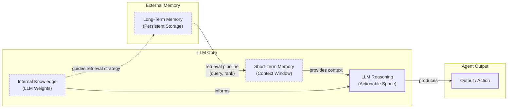

# How Memory for AI Agents Works: A Practical Guide

In the previous lessons, we built a foundation in AI Engineering. We explored the agent landscape, distinguished between rule-based workflows and autonomous agents, and covered context engineering. We even built a basic reasoning agent from scratch using the ReAct framework. Now, we will tackle one of the most important components of building stateful applications: memory.

LLMs today have a fundamental limitation: their knowledge is vast but frozen in time. They cannot learn in the way humans do by updating their internal knowledge from experience. This is often called the problem of "continual learning." To build agents that remember conversations and personalize interactions, we need to engineer a workaround. The context window, which we can think of as the agent's working memory or RAM, offers a partial solution. We can inject new knowledge into it, but this approach has its own limits. Context windows are finite, and filling them with long histories increases costs and latency. It also introduces noise, as the model may struggle to find the relevant information, a problem known as "lost-in-the-middle" [[3]](https://openreview.net/forum?id=5sB6cSblDR). Even with frontier models, this effect can lead to a 40% degradation in recall, meaning a significant portion of context is effectively lost to the model [[47]](https://introl.com/blog/long-context-llm-infrastructure-million-token-windows-guide). An LLM without a proper memory system is like an intern with amnesia; it cannot recall past conversations or learn from experience.

Some commercial systems, like ChatGPT, have introduced opt-in memory features to address this. When enabled, ChatGPT uses a tool-based approach to decide what to remember from a conversation, storing these memories as content strings [[32]](https://langchain-ai.github.io/langgraph/concepts/memory/). Users can view and delete these memories, but the control is limited. For instance, you cannot selectively retrieve specific memories via an API; the system decides what context is relevant [[35]](https://arxiv.org/html/2504.19413v1). This black-box implementation highlights a core challenge for engineers: to build truly reliable and customizable agents, we need to design and control the memory architecture ourselves.

The landscape is constantly changing. Just a few years ago, models had small 8,000-token context windows, forcing engineers to be ruthless with compression and summarization. Today, with models offering million-token contexts, our strategies are evolving [[2]](https://www.youtube.com/watch?v=7AmhgMAJIT4&list=PLDV8PPvY5K8VlygSJcp3__mhToZMBoiwX&index=112). While we can now afford to keep more raw history, the core challenge remains: we need a system to manage this information. External memory systems are the practical, temporary solution that gives agents continuity and the ability to simulate learning.

In this lesson, we will explore how to design and build memory for AI agents. We will borrow concepts from cognitive science to structure our thinking, breaking down memory into distinct layers and types. We will cover the different layers of memory, the three types of long-term memory, the pros and cons of different storage architectures, and a hands-on implementation of each memory type using the `mem0` library. Finally, we will discuss real-world lessons and best practices for building production-ready memory systems.

## The Layers of Memory: Internal, Short-Term, and Long-Term

To build effective memory systems, it helps to adopt a structured model. The terminology from cognitive science provides a powerful framework for understanding how different types of information can be stored and retrieved to solve different kinds of problems [[30]](https://arxiv.org/html/2309.02427). This approach is not arbitrary; it is grounded in decades of research by pioneers like Endel Tulving, who first distinguished episodic and semantic memory in 1972, and Larry Squire, who later added procedural memory [[48]](https://atlan.com/know/types-of-ai-agent-memory/). We can categorize an agent's memory into three distinct layers: internal knowledge, short-term memory, and long-term memory [[1]](https://www.linkedin.com/posts/pauliusztin_every-ai-agent-has-4-distinct-memory-layers-activity-7436765234800807936-QyLR).

**Internal Knowledge** is the static, pre-trained information stored in the LLM's weights. This is the model's vast understanding of language, facts, and reasoning patterns learned during its training. It is powerful but read-only; you cannot update it without fine-tuning. This immutability is the core reason we need external memory systems. It provides the general intelligence and reasoning priors that the agent applies to any given task, but it cannot be personalized with user-specific information during inference.

**Short-Term Memory** is the agent's active workspace, which corresponds directly to the LLM's context window. It is volatile, fast, and limited in size. This is the only reality the model sees during a single call. If information is not in the context window, it does not exist for the model. It is the reservoir that holds the current user input, retrieved documents, tool outputs, and any intermediate reasoning steps. For each inference step, only a curated subset of this working state is projected into the context window, making this projection a critical step in context engineering.

**Long-Term Memory** is an external, persistent storage system, such as a database or file system. This is where an agent saves information across sessions, giving it continuity. It is where user preferences, past interactions, and learned facts are stored. This layer gives the agent a sense of history, allowing it to build on previous conversations and provide a truly personalized experience.

These layers work together in a dynamic hierarchy, often conceptualized as a "write-manage-read" loop [[49]](https://arxiv.org/html/2603.07670v1). Information is selectively pulled from long-term memory and loaded into short-term memory to provide relevant context for the LLM's reasoning process. This flow can be seen as a retrieval pipeline. In this pipeline, the agent queries its long-term storage, often running multiple strategies in parallel. These can include semantic search, keyword matching, and graph traversal. The results are then reranked before the most important pieces are injected into the context window [[50]](https://vectorize.io/articles/best-ai-agent-memory-systems).


Image 1: A diagram illustrating the hierarchy and dynamic interplay between an AI agent's Internal Knowledge, Short-Term Memory, and Long-Term Memory, including the retrieval pipeline.

This layered approach is useful because no single component can perform all functions effectively. Internal knowledge provides general intelligence, short-term memory handles the immediate task, and long-term memory provides the personalization and historical context that the other layers lack. Now that we have this high-level model, let's look deeper into long-term memory, which is where most of the engineering work for stateful agents lies.

## Long-Term Memory: Semantic, Episodic, and Procedural

To better engineer long-term memory, we can again borrow from cognitive science and divide it into three distinct types: semantic, episodic, and procedural. Each serves a different purpose and is suited for different kinds of information [[30]](https://arxiv.org/html/2309.02427), [[31]](https://www.ibm.com/think/topics/ai-agent-memory).

### Semantic Memory (Facts & Knowledge)

**Semantic memory** is the agent's encyclopedia, a repository of factual knowledge. This is where the agent stores extracted concepts, relationships, and facts about specific domains, people, and things. The structure of this memory is highly dependent on the agent's use case. For a personal assistant, facts might be stored as simple, independent strings like "The user is a vegetarian." For more complex applications, they might be organized into entity-centric JSON objects (`{"user": {"dietary_restrictions": "vegetarian"}}`) or even a knowledge graph to capture relationships between entities.

The primary role of semantic memory is to provide the agent with a reliable source of truth. For an enterprise agent, this might be a knowledge base of internal company documents or technical manuals. For a personal assistant, it is used to build a persistent profile of the user, storing preferences (`"music": "User likes rock music"`), relationships (`"dog": "User has a dog named George"`), or constraints (`"allergies": "User is allergic to gluten"`). By storing and retrieving these precise facts, the agent can offer personalized responses without needing to sift through a long, noisy conversation history.

### Episodic Memory (Experiences & History)

**Episodic memory** is the agent's personal diary, a chronological record of its past interactions. While semantic memory stores timeless facts, episodic memory is about "what happened and when." Each memory is an "episode" tied to a specific point in time. The granularity of an "episode" is a key design choice. It could be a single conversational turn, an entire conversation, a summary of a day's interactions, or a weekly digest. This decision impacts the agent's ability to maintain context and answer temporal queries.

This memory type is essential for maintaining conversational context and understanding the dynamics of a relationship. For example, a semantic memory might store two separate facts: "User's brother is named Mark" and "User is frustrated with his brother." An episodic memory captures the nuance: "On Tuesday, the user expressed frustration that their brother, Mark, always forgets their birthday. I then provided an empathetic response." This richer context allows the agent to interact with more intelligence in the future (e.g., "I know the topic of your brother's birthday can be sensitive..."). The timestamp also allows the agent to answer temporal questions like "What did we talk about last week?"

### Procedural Memory (Skills & How-To)

**Procedural memory** is the agent's muscle memory, its collection of learned skills and workflows. This is the "how-to" knowledge that enables it to perform multi-step tasks reliably. These procedures are often encoded as tools or functions and included in the agent's system prompt. Think of how you learn to drive a car: at first, every action requires focus, but with practice, the skill becomes automatic, freeing your attention for higher-level decisions like navigating traffic [[46]](https://machinelearningmastery.com/beyond-short-term-memory-the-3-types-of-long-term-memory-ai-agents-need/).

For example, an agent might have a stored procedure called `monthly_report`. When a user requests a monthly update, the agent does not need to reason from scratch. It can retrieve this procedure, which defines a clear sequence of steps: 1. Query the sales database for the last 30 days, 2. Summarize the top 5 insights, and 3. Ask the user whether to email or display the report. This makes the agent's behavior on common tasks predictable and efficient. While developers often define these procedures, advanced agents can learn them dynamically. For instance, an agent can formalize a user's step-by-step instructions into a new, reusable skill, effectively learning from demonstration [[9]](https://stevekinney.com/writing/agent-memory-systems). By encoding successful workflows, procedural memory allows an agent to improve its task completion over time, reducing errors and ensuring complex jobs are executed consistently.

We now have a clear understanding of *what* to store in our agent's memory. The next question is *how* to store it, a decision that involves significant architectural trade-offs.

## Storing Memories: Pros and Cons of Different Approaches

How an agent's memories are stored is an important architectural decision that directly impacts its performance, complexity, and scalability. There is no one-size-fits-all solution; the ideal approach depends on the product's use case. Let's explore the three primary methods: storing memories as raw strings, as structured entities, and within a knowledge graph [[4]](https://danielp1.substack.com/p/memex-20-memory-the-missing-piece).

```mermaid
graph TD
    subgraph "Storage Approaches"
        A[Raw Strings]
        B[Structured Entities (JSON)]
        C[Knowledge Graph]
    end

    subgraph "Characteristics"
        A_Pros["Pros:<br/>- Simple & Fast<br/>- Preserves Nuance"]
        A_Cons["Cons:<br/>- Imprecise Retrieval<br/>- Hard to Update<br/>- Lacks Structure"]
        
        B_Pros["Pros:<br/>- Structured & Precise<br/>- Easy to Update<br/>- Good for Factual Data"]
        B_Cons["Cons:<br/>- Upfront Complexity<br/>- Schema Rigidity<br/>- Loss of Nuance"]

        C_Pros["Pros:<br/>- Models Complex Relationships<br/>- Temporal Awareness<br/>- Auditable & Explainable"]
        C_Cons["Cons:<br/>- Highest Complexity<br/>- Slower Queries<br/>- Overkill for Simple Cases"]
    end

    A --> A_Pros
    A --> A_Cons
    B --> B_Pros
    B --> B_Cons
    C --> C_Pros
    C --> C_Cons
```
Image 2: A diagram visualizing the pros and cons of the three primary memory storage approaches.

### Storing Memories as Raw Strings

The simplest method is to store conversational turns or documents as plain text and index them for vector search [[6]](https://www.decodingai.com/p/how-does-memory-for-ai-agents-work). This approach is fast to set up and preserves the full nuance of the original interaction. However, it suffers from imprecise retrieval. A query like “What is my brother’s job?” might retrieve every conversation mentioning “brother” and “job” without pinpointing the current fact [[6]](https://www.decodingai.com/p/how-does-memory-for-ai-agents-work). Updating facts is also difficult; a correction simply adds another string to the log, creating potential contradictions. This can lead to a high rate of "junk" entries in production, including hallucinated facts and privacy leaks [[52]](https://github.com/mem0ai/mem0/issues/4573). Effective management requires strategies for deduplication and timestamping to handle the accumulation of conflicting information.

### Storing Memories as Entities (JSON-like Structures)

A more structured approach uses an LLM to transform unstructured interactions into a format like JSON. This organizes information into key-value pairs, allowing for precise, field-level filtering and easy updates. This method is ideal for semantic memory, where user profiles and preferences are stored. The main drawbacks are the upfront complexity of designing a schema and the potential for rigidity. If the agent encounters information that does not fit the schema, that data may be lost. Managing schema drift when an LLM dynamically creates new fields requires robust entity resolution techniques to maintain data consistency.

### Storing Memories in a Graph Database

The most advanced approach is to store memories as a network of nodes (entities) and edges (relationships), forming a knowledge graph [[10]](https://www.octoco.ai/blog/knowledge-graphs-as-memory). A graph's core strength is representing complex relationships explicitly, such as `(User)-[:HAS_BROTHER]->(Mark)-[:WORKS_AS]->(Software Engineer)`. This enables sophisticated queries that trace these connections and provides superior contextual and temporal awareness. Retrieval is also transparent and auditable. However, this method has the highest complexity and cost. Converting unstructured text into graph triples is non-trivial, and complex graph traversals can be slower than simple vector lookups. Moderation strategies are also needed to prevent the LLM from generating noisy or incorrect links that corrupt the graph's integrity.

The choice of storage architecture should be guided by your product's core needs. A common pattern is to start with the simplest approach that delivers value and evolve it as the agent's requirements become more complex. When an LLM is responsible for managing memory, it is important to implement guardrails, such as schema validation and recency rules for conflict resolution, to ensure data integrity [[20]](https://towardsdatascience.com/a-practical-guide-to-memory-for-autonomous-llm-agents/).

Now that we know what to save and how to store it, let's look at some code examples using an open-source memory library.

## Memory implementations with code examples

This section provides hands-on examples of how to implement the different memory types. While Retrieval-Augmented Generation (RAG) is the mechanism for *retrieving* information—a topic we will cover in Lesson 10—the creation of high-quality memories is an equally important preceding step. To demonstrate this, we will use `mem0`, an open-source library designed to give agents long-term memory. It provides a universal memory layer that can work with various vector stores and even graph databases, making it a flexible tool for experimenting with different architectures [[35]](https://arxiv.org/html/2504.19413v1). We will focus on the "storing memories as raw strings" approach to highlight the benefits of each memory category without getting bogged down in storage architecture.

<aside>
💡

You can find the code for this lesson in the accompanying Jupyter Notebook on our course's GitHub repository.

</aside>

### Setup

First, let's set up our environment. We will use Google's Gemini models for both the LLM and embeddings, with ChromaDB as a local vector store. The `mem0` library abstracts away the complexity of interacting with these components.

1.  We define a configuration dictionary that specifies our chosen LLM, embedding model, and vector store. We then instantiate the `Memory` class from this configuration.
    
    ```python
    import os
    from mem0 import Memory
    
    MEM0_CONFIG = {
        "embedder": {
            "provider": "gemini",
            "config": {
                "model": "gemini-embedding-001",
                "embedding_dims": 768,
                "api_key": os.getenv("GOOGLE_API_KEY"),
            },
        },
        "vector_store": {
            "provider": "chroma",
            "config": {
                "collection_name": "lesson9_memories",
                "path": "/tmp/chroma_mem0",
            },
        },
        "llm": {
            "provider": "gemini",
            "config": {
                "model": "gemini-2.5-pro",
                "api_key": os.getenv("GOOGLE_API_KEY"),
            },
        },
    }
    
    memory = Memory.from_config(MEM0_CONFIG)
    MEM_USER_ID = "lesson9_notebook_student"
    memory.delete_all(user_id=MEM_USER_ID)
    ```
    
    It outputs:
    
    ```text
    ✅ Mem0 ready (Gemini embeddings + local Chroma).
    ```
    
2.  Next, we create simple wrapper functions, `mem_add_text` and `mem_search`, to save and retrieve memories. We will tag each memory with a `category` ("semantic", "episodic", or "procedure") in its metadata. This allows us to filter our searches by memory type. By integrating these functions as agent tools, an agent can autonomously decide when to write to or read from its memory, creating a self-managing loop.
    
    ```python
    from typing import Optional
    
    def mem_add_text(text: str, category: str = "semantic", **meta) -> str:
        """Add a single text memory. No LLM is used for extraction or summarization."""
        metadata = {"category": category}
        for k, v in meta.items():
            if isinstance(v, (str, int, float, bool)) or v is None:
                metadata[k] = v
            else:
                metadata[k] = str(v)
        memory.add(text, user_id=MEM_USER_ID, metadata=metadata, infer=False)
        return f"Saved {category} memory."
    
    
    def mem_search(query: str, limit: int = 5, category: Optional[str] = None) -> list[dict]:
        """Category-aware search wrapper."""
        res = memory.search(query, user_id=MEM_USER_ID, limit=limit) or {}
    
        items = res.get("results", [])
        if category is not None:
            items = [r for r in items if (r.get("metadata") or {}).get("category") == category]
        return items
    ```
    

With our setup complete, we can now implement each memory type.

### Semantic Memory: Extracting Facts

Semantic memory is created through a deliberate extraction pipeline. An LLM analyzes a conversation and extracts atomic, context-independent facts. The prompt for this task is crucial; it instructs the model to act as a knowledge extractor, identifying key pieces of information relevant to the agent's purpose. For example, a personal assistant might be prompted to extract persistent facts and strong preferences, keeping each fact atomic and context-independent.

1.  We will add a few sample facts to our semantic memory.
    
    ```python
    facts: list[str] = [
        "User prefers vegetarian meals.",
        "User has a dog named George.",
        "User is allergic to gluten.",
        "User's brother is named Mark and is a software engineer.",
    ]
    for f in facts:
        mem_add_text(f, category="semantic")
    ```
    
    It outputs:
    
    ```text
    Saved semantic memory.
    Saved semantic memory.
    Saved semantic memory.
    Saved semantic memory.
    ```
    
2.  Now, we can search for a specific fact. Retrieval often uses a hybrid search approach, combining keyword filtering with semantic search. For a query like "brother job," the system might first filter for memories containing the keyword "brother" and then perform a vector search to find the most contextually relevant fact about his "job."
    
    ```python
    results = memory.search("brother job", user_id=MEM_USER_ID, limit=1)
    print(results["results"][0]["memory"])
    ```
    
    It outputs:
    
    ```text
    User's brother is named Mark and is a software engineer.
    ```
    
    This demonstrates how an agent can query its knowledge base to answer specific questions accurately.
    

### Episodic Memory: The Log of Events

Episodic memory functions as a chronological log. We can create an "episode" by summarizing a short conversation and storing it with a timestamp.

1.  First, we define a short dialogue and use an LLM to create a concise summary. The prompt guides the LLM to capture the salient details and tone of the interaction.
    
    ```python
    from google import genai
    
    client = genai.Client()
    MODEL_ID = "gemini-2.5-pro"
    
    dialogue = [
        {"role": "user", "content": "I'm stressed about my project deadline on Friday."},
        {"role": "assistant", "content": "I’m here to help—what’s the blocker?"},
        {"role": "user", "content": "Mainly testing. I also prefer working at night."},
        {"role": "assistant", "content": "Okay, we can split testing into two sessions."},
    ]
    
    episodic_prompt = f"""Summarize the following 3–4 turns as one concise 'episode' (1–2 sentences).
    Keep salient details and tone.
    
    {dialogue}
    """
    episode_summary = client.models.generate_content(model=MODEL_ID, contents=episodic_prompt)
    episode = episode_summary.text.strip()
    ```
    
    It outputs:
    
    ```text
    A user, stressed about a Friday project deadline because of testing and a preference for working at night, is advised to split the testing work into two manageable sessions.
    ```
    
2.  Next, we save this summary as an episodic memory. `mem0` automatically adds a `created_at` timestamp, which is crucial for temporal reasoning.
    
    ```python
    mem_add_text(
        episode,
        category="episodic",
        summarized=True,
        turns=4,
    )
    ```
    
    It outputs:
    
    ```text
    Saved episodic memory.
    ```
    
3.  We can then retrieve this episode using a combination of temporal and semantic queries. For example, a user might ask, "What was I worried about earlier?" The system would search for past messages with a "worried" or "stressed" sentiment and prioritize the most recent ones.
    
    ```python
    hits = mem_search("deadline stress", limit=1, category="episodic")
    for h in hits:
        print(f"Memory: {h['memory']}")
        print(f"Created at: {h['created_at']}")
    ```
    
    It outputs:
    
    ```text
    Memory: A user, stressed about a Friday project deadline because of testing and a preference for working at night, is advised to split the testing work into two manageable sessions.
    Created at: 2025-09-12T02:30:01.358468-07:00
    ```
    

### Procedural Memory: Defining and Learning Skills

Procedural memory can be created by a developer defining a reusable workflow. We can store a sequence of steps as a single text block.

1.  We define a procedure named "monthly_report" with three steps and save it to our procedural memory.
    
    ```python
    procedure_name = "monthly_report"
    steps = [
        "Query sales DB for the last 30 days.",
        "Summarize top 5 insights.",
        "Ask user whether to email or display.",
    ]
    procedure_text = f"Procedure: {procedure_name}\nSteps:\n" + "\n".join(f"{i + 1}. {s}" for i, s in enumerate(steps))
    
    mem_add_text(procedure_text, category="procedure", procedure_name=procedure_name)
    ```
    
    It outputs:
    
    ```text
    Learned procedure: monthly_report
    ```
    
2.  The agent can later retrieve this procedure through an intent-matching and function-calling process. The LLM receives the descriptions of all available tools and compares the user's request against them. If a user asks to "create a monthly report," the agent will recognize the semantic similarity to the stored procedure and execute it.
    
    ```python
    results = mem_search("how to create a monthly report", category="procedure", limit=1)
    if results:
        print(results[0]["memory"])
    ```
    
    It outputs:
    
    ```text
    Procedure: monthly_report
    Steps:
    1. Query sales DB for the last 30 days.
    2. Summarize top 5 insights.
    3. Ask user whether to email or display.
    ```
    
    Now that we have seen how to implement these memory types, let's discuss some of the real-world challenges you will face.
    

## Real-World Lessons: Challenges and Best Practices

The architectural patterns we have discussed provide a useful toolkit, but moving from theory to a reliable, production-ready system requires navigating complex trade-offs. The technology is evolving so fast that best practices are a moving target. Here are some of the most important lessons learned from building and scaling agent memory systems.

### Re-evaluating Compression

One of the biggest shifts in memory design has been the trade-off between compressing information and preserving its raw detail. Just two years ago, LLMs operated with small and expensive context windows of 8,000 or 16,000 tokens. This forced AI engineers to be ruthless with compression. Every interaction had to be distilled into its most compact form—summaries, facts, or entities—to fit into the context window. This process is inherently lossy; you keep the general idea but lose the fine details and nuance that are often critical for a personalized agent.

Today, with models like Gemini 2.5 offering million-token context windows at a fraction of the cost, the calculus has changed. This is enabled by infrastructure innovations like KV cache quantization and context parallelism that make large contexts feasible [[47]](https://introl.com/blog/long-context-llm-infrastructure-million-token-windows-guide). The emerging best practice is to lean towards less compression. The raw, unstructured conversational history is the ultimate source of truth [[2]](https://www.youtube.com/watch?v=7AmhgMAJIT4&list=PLDV8PPvY5K8VlygSJcp3__mhToZMBoiwX&index=112). It contains the emotional subtext and relational dynamics that are often lost during extraction. A semantic fact might state, "User has a dog named George," but the episodic log reveals, "User mentioned that walking their dog George is the best part of their day," a far more valuable insight for a personal companion. Design your system to work with the most complete version of history that is economically and technically feasible. Use summarization and fact extraction to create queryable indexes, but always treat the raw log as the ground truth.

### Designing for the Product

There is no "perfect" memory architecture. The concepts of semantic, episodic, and procedural memory are a powerful mental model, but they are a toolkit, not a mandatory blueprint. A common failure mode is over-engineering a complex, multi-part memory system for a product that does not need it. For example, building a full knowledge graph for a simple FAQ bot is unnecessary complexity.

It can be tempting to build a system that handles all three memory types from day one. However, this often leads to higher maintenance costs and slower performance. Start from first principles by defining the core function of your agent. The product's goal should dictate the memory architecture, not the other way around [[2]](https://www.youtube.com/watch?v=7AmhgMAJIT4&list=PLDV8PPvY5K8VlygSJcp3__mhToZMBoiwX&index=112). For a Q&A bot over internal documents, a simple RAG pipeline is the best starting point. For a long-term personal AI companion, rich episodic memories are essential [[46]](https://machinelearningmastery.com/beyond-short-term-memory-the-3-types-of-long-term-memory-ai-agents-need/). For a task-automation agent, procedural memory is likely the most useful. For an adaptive math tutor, a dual-memory framework storing persistent student data (LTM) and current session state (working memory) is a proven pattern [[54]](https://arxiv.org/html/2507.12484v1).

### The Human Factor

Memory exists to make the agent smarter, not to give the user a new job. A common pitfall is exposing the internal workings of the memory system to the user, thinking it will improve transparency. In practice, it often creates significant cognitive overhead.

Many early memory implementations allowed users to view, edit, or delete the facts the agent had stored about them. While well-intentioned, this can be a frustrating experience. Users should not be asked to "garden their agent's memories" [[2]](https://www.youtube.com/watch?v=7AmhgMAJIT4&list=PLDV8PPvY5K8VlygSJcp3__mhToZMBoiwX&index=112). This breaks the illusion of a capable assistant and turns the interaction into a tedious data-entry task. Memory management should be an autonomous function of the agent. It should learn from corrections within the natural flow of conversation (e.g., "Actually, my brother's name is Mark, not Mike"). The agent, not the user, is responsible for maintaining the integrity of its own knowledge through internal processes that periodically review, consolidate, and resolve conflicting information.

### Memory Integrity and Failure Modes

A memory system is only as good as the information it stores. In production, memory can become corrupted, leading to a host of problems. A comparative study of RAG and memory-augmented agents on financial question-answering benchmarks (FinQA and ConvFinQA) revealed several critical failure modes [[55]](https://arxiv.org/html/2604.17979v1).

-   **Cascade Failures:** Persistent memory can amplify early mistakes. In the conversational ConvFinQA task, memory-based agents that made an error on the first turn almost never recovered, with a mean cascade failure rate of over 70%. In contrast, a RAG system, which re-retrieves context for each turn, had a lower failure rate because it had a chance to "get back on track."
-   **Fluency-Accuracy Divergence:** Memory-heavy agents often produce more fluent, plausible-sounding responses. However, this fluency can mask factual incorrectness. In the same study, a memory-augmented agent achieved the highest "judge" score (a model-based assessment of correctness) but the lowest actual numeric accuracy—a 20-point gap. This is a critical warning: do not rely on fluency alone to evaluate your agent.
-   **Memory Corruption:** The extraction pipeline that creates memories can fail. An audit of one production system found that over 97% of automatically generated memory entries were "junk," including hallucinated user profiles, privacy leaks (IP addresses, file paths), and identity confusion [[52]](https://github.com/mem0ai/mem0/issues/4573). To mitigate this, consider adding decay mechanisms that automatically remove old information and security filters to prevent sensitive data from being stored [[56]](https://mem0.ai/blog/ai-memory-security-best-practices).

## Conclusion

Memory sits at the core of building personalized agents that can "learn" over time. While today's memory tools are a temporary solution for the absence of true continual learning in LLMs, they are a powerful and practical one. This workaround is effective, but it is important to recognize its limitations. Current memory systems simulate learning by storing and retrieving information externally, rather than updating the model's internal knowledge. By thoughtfully designing a memory architecture that fits your product's needs, you can transform a stateless chatbot into an adaptive and intelligent companion.

We have covered the different layers and types of memory, explored various storage architectures, and walked through a hands-on implementation. The key takeaway is that memory is not just about storing data; it is about creating a system that can selectively recall the right information at the right time. As architectures evolve, we are seeing more advanced systems like HyMem and APEX-MEM that use dynamic retrieval scheduling or property graphs to improve efficiency and temporal reasoning [[57]](https://arxiv.org/html/2602.13933v2), [[58]](https://arxiv.org/html/2604.14362v1). The ultimate goal may be self-optimizing contexts that automatically learn what to compress, retain, or retrieve without manual tuning [[59]](https://dextralabs.com/blog/infinite-context-llm-memory-architecture/). As LLMs evolve toward more native learning abilities, these external memory systems might become more integrated or even change fundamentally.

In our next lesson, we will build on these concepts with a deep dive into Retrieval-Augmented Generation (RAG). We will explore how to build effective retrieval pipelines that can search across the memories we have learned to create. We will also touch upon more advanced topics in the future, such as Multimodal Processing and the Model Context Protocol (MCP).

## References

- [1] https://www.linkedin.com/posts/pauliusztin_every-ai-agent-has-4-distinct-memory-layers-activity-7436765234800807936-QyLR
- [2] https://www.youtube.com/watch?v=7AmhgMAJIT4&list=PLDV8PPvY5K8VlygSJcp3__mhToZMBoiwX&index=112
- [3] https://openreview.net/forum?id=5sB6cSblDR
- [4] https://danielp1.substack.com/p/memex-20-memory-the-missing-piece
- [5] https://decodingml.substack.com/p/memory-the-secret-sauce-of-ai-agents
- [6] https://www.decodingai.com/p/how-does-memory-for-ai-agents-work
- [7] https://towardsdatascience.com/a-practical-guide-to-memory-for-autonomous-llm-agents/
- [8] https://www.microsoft.com/en-us/research/blog/from-raw-interaction-to-reusable-knowledge-rethinking-memory-for-ai-agents/
- [9] https://stevekinney.com/writing/agent-memory-systems
- [10] https://www.octoco.ai/blog/knowledge-graphs-as-memory
- [11] https://ai.plainenglish.io/temporal-reasoning-in-ai-agent-memory-allens-interval-algebra-and-event-graphs-bd5fe9d3d1ef
- [12] https://neo4j.com/nodes-2025/agenda/building-evolving-ai-agents-via-dynamic-memory-representations-using-temporal-knowledge-graphs/
- [13] https://medium.com/@bijit211987/agents-that-remember-temporal-knowledge-graphs-as-long-term-memory-2405377f4d51
- [14] https://developers.openai.com/cookbook/examples/partners/temporal_agents_with_knowledge_graphs/temporal_agents
- [15] https://blog.lqhl.me/mem0-how-three-prompts-created-a-viral-ai-memory-layer
- [16] https://github.com/mem0ai/mem0/blob/main/mem0/configs/prompts.py
- [17] https://docs.mem0.ai/open-source/features/custom-instructions
- [18] https://www.linkedin.com/posts/mem0_how-mem0-works-under-the-hood-1-message-activity-7376713317391896576-ALQP
- [19] https://mem0.ai/blog/long-term-memory-ai-agents
- [20] https://towardsdatascience.com/a-practical-guide-to-memory-for-autonomous-llm-agents/
- [21] https://medium.com/@nirdiamant21/memory-optimization-strategies-in-ai-agents-1f75f8180d54
- [22] https://www.dailydoseofds.com/ai-agents-crash-course-part-15-with-implementation/
- [23] https://arxiv.org/html/2601.11653v1
- [24] https://atlan.com/know/types-of-ai-agent-memory/
- [25] https://www.geeksforgeeks.org/artificial-intelligence/ai-agent-memory/
- [26] https://machinelearningmastery.com/beyond-short-term-memory-the-3-types-of-long-term-memory-ai-agents-need/
- [27] https://www.mongodb.com/resources/basics/artificial-intelligence/agent-memory
- [28] https://ctoi.substack.com/p/memory-systems-in-ai-agents-episodic
- [29] https://www.newsletter.swirlai.com/p/memory-in-agent-systems
- [30] https://arxiv.org/html/2309.02427
- [31] https://www.ibm.com/think/topics/ai-agent-memory
- [32] https://langchain-ai.github.io/langgraph/concepts/memory/
- [33] https://docs.mem0.ai/platform/features/timestamp
- [34] https://atlan.com/know/episodic-memory-ai-agents/
- [35] https://arxiv.org/html/2504.19413v1
- [36] https://arxiv.org/html/2508.06433v2
- [37] https://arxiv.org/html/2508.06433v4
- [38] https://openreview.net/forum?id=NTAhi2JEEE
- [39] https://dev.to/blackgirlbytes/turning-agent-history-into-procedural-memory-37f8
- [40] https://vizuara.substack.com/p/a-primer-on-re-ranking-for-retrieval
- [41] https://www.comet.com/site/blog/retrieval-augmented-generation/
- [42] https://docs.cohere.com/docs/generating-parallel-queries
- [43] https://skymod.tech/why-memory-matters-in-llm-agents-short-term-vs-long-term-memory-architectures/
- [44] https://www.moxo.com/blog/agentic-ai-memory
- [45] https://www.dataiku.com/stories/blog/agent-memory
- [46] https://machinelearningmastery.com/beyond-short-term-memory-the-3-types-of-long-term-memory-ai-agents-need/
- [47] https://introl.com/blog/long-context-llm-infrastructure-million-token-windows-guide
- [48] https://atlan.com/know/types-of-ai-agent-memory/
- [49] https://arxiv.org/html/2603.07670v1
- [50] https://vectorize.io/articles/best-ai-agent-memory-systems
- [51] https://www.ibm.com/think/topics/ai-agent-memory
- [52] https://github.com/mem0ai/mem0/issues/4573
- [53] https://i2group.com/articles/accuracy-metrics-for-entity-extraction
- [54] https://arxiv.org/html/2507.12484v1
- [55] https://arxiv.org/html/2604.17979v1
- [56] https://mem0.ai/blog/ai-memory-security-best-practices
- [57] https://arxiv.org/html/2602.13933v2
- [58] https://arxiv.org/html/2604.14362v1
- [59] https://dextralabs.com/blog/infinite-context-llm-memory-architecture/
</article>