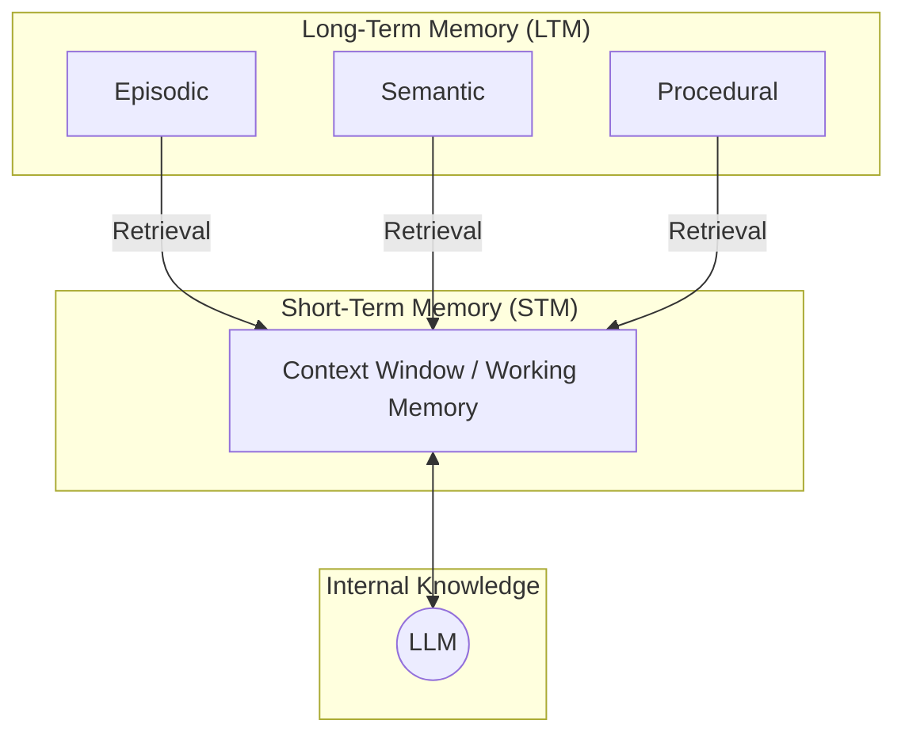

# Lesson 9: Memory for AI Agents

In the previous lessons, you built a solid foundation in AI Engineering. You explored the agent landscape, distinguished between LLM workflows and autonomous agents, and in Lesson 3, you introduced context engineering. You learned that to build effective AI applications, it is essential to manage the flow of information to the LLM. Memory is where this information is stored, and context engineering is the active process of deciding what to pull from that resource, how to format it, and when to load it into the model's working attention.

The core limitation of today's LLMs is that their knowledge is vast but frozen in time. They are fundamentally unable to learn by updating their weights after deployment, a problem known as the lack of "continual learning." We can inject new knowledge through the context window, but this is a limited solution. An LLM without a persistent memory is like a brilliant intern with amnesia; it can solve complex problems but cannot recall past conversations or learn from experience.

The context window acts as the agent's short-term or "working memory," but it has significant constraints. Keeping an entire conversation history is often unrealistic due to finite size, rising costs per interaction, and the introduction of noise. The "lost-in-the-middle" problem, where models struggle to use information buried in a long context, further complicates things [[1]](https://openreview.net/forum?id=5sB6cSblDR). For example, systems like ChatGPT offer opt-in memory features where users can explicitly tell the system what to remember or forget. While this provides some user control, the underlying mechanism still relies on injecting this information back into the prompt, and the agent decides autonomously what is worth remembering, which can be opaque to the user [[2]](https://openai.com/index/memory-and-new-controls-for-chatgpt/).

Interestingly, the landscape is constantly shifting. Just a few years ago, with 8,000-token context windows, aggressive compression and summarization were not just best practices; they were necessities. In her talk on memory architecture, Sam Whitmore, CEO of New Computer, explained that early agent designs for their conversational journal, Dot, had to be ruthless with compression to work within these tight constraints [[3]](https://www.youtube.com/watch?v=7AmhgMAJIT4&list=PLDV8PPvY5K8VlygSJcp3__mhToZMBoiwX&index=112). Today, with models offering million-token contexts, our strategies are evolving. Less compression is needed, as the raw, unstructured conversational history is the ultimate source of truth, preserving nuances that summaries often lose [[3]](https://www.youtube.com/watch?v=7AmhgMAJIT4&list=PLDV8PPvY5K8VlygSJcp3__mhToZMBoiwX&index=112).

External memory systems, like `mem0`, are the current, practical solution to these challenges. They provide agents with continuity, adaptability, and a way to "learn" over time. In this lesson, we will explore the different layers of agent memory, drawing parallels from cognitive science to understand how to store and retrieve different types of data. We will cover the three main types of long-term memory—semantic, episodic, and procedural—and show you how to implement them with practical code examples.

## The Layers of Memory: Internal, Short-Term, and Long-Term

To build agents that can reason and learn effectively, it is useful to think about memory in a structured way. Borrowing concepts from cognitive science gives us a powerful mental model for organizing an agent's knowledge and experiences [[4]](https://arxiv.org/html/2309.02427). We can categorize an agent's memory into three distinct layers. These are internal knowledge, short-term memory, and long-term memory.

**Internal Knowledge** is the static, pre-trained knowledge embedded in the LLM's weights. This is the vast encyclopedia of facts, concepts, and language patterns the model learned during its training. It is read-only and cannot be updated with new experiences. This immutability is precisely why external memory systems are necessary. While this layer provides the agent with general intelligence, it knows nothing about your specific users, your company's data, or its own past interactions.

**Short-Term Memory (STM)**, or working memory, is the agent's active context window. It is the RAM of the agent's mind: volatile, fast, but limited. This is the only space where information is directly accessible to the LLM for immediate reasoning. It holds the current conversation, user queries, and any data retrieved from long-term memory. Its limitations in size, cost, and potential for noise are what drive the need for a more persistent storage solution.

**Long-Term Memory (LTM)** is an external, persistent storage system where an agent can save and retrieve information across different sessions. This is the agent's hard drive, providing continuity and enabling it to build a lasting understanding of its environment and users. It can be implemented using various external storage solutions, from simple file systems to complex databases [[5]](https://towardsdatascience.com/a-practical-guide-to-memory-for-autonomous-llm-agents/).

These layers work together in a dynamic flow. When a user interacts with an agent, the system retrieves relevant information from its long-term memory and loads it into the short-term memory. This process is a form of Retrieval-Augmented Generation (RAG), where the "documents" being retrieved are the agent's own memories. This retrieved context, combined with the current conversation, gives the LLM everything it needs to generate an informed response. This dynamic interplay makes an agent feel coherent and personalized [[6]](https://www.linkedin.com/posts/pauliusztin_every-ai-agent-has-4-distinct-memory-layers-activity-7436765234800807936-QyLR).


Image 1: The three layers of agent memory and the retrieval flow from long-term to short-term memory.

No single layer can do it all. Internal knowledge provides the reasoning engine, short-term memory handles the immediate task, and long-term memory provides the historical context and personalization that the other layers lack. To better understand how to design this persistent layer, let's break down the different types of long-term memory.

## Long-Term Memory: Semantic, Episodic, and Procedural

Long-term memory is not a monolith. Just as our own minds store different kinds of information in different ways, an agent's LTM can be organized into distinct types, each serving a specific purpose. Understanding these categories—semantic, episodic, and procedural—is key to designing an agent that can remember not just facts, but experiences and skills [[4]](https://arxiv.org/html/2309.02427), [[7]](https://langchain-ai.github.io/langgraph/concepts/memory/).

**Semantic Memory (Facts & Knowledge)** is the agent's encyclopedia, a structured repository of facts, concepts, and relationships. This memory stores what the agent *knows*. For an enterprise agent, this could be internal documents or a product catalog. For a personal assistant, it might be a user profile containing preferences, relationships, and constraints. For example, it can store atomic facts like "User is allergic to gluten" or more structured data like `{"user": {"brother": {"name": "Mark"}}}`. This allows the agent to retrieve precise, unambiguous information, providing a reliable source of truth that is separate from the noisy, unstructured flow of conversation. The structure of semantic memory is highly dependent on the agent's use case, ranging from simple key-value stores to complex knowledge graphs [[8]](https://machinelearningmastery.com/beyond-short-term-memory-the-3-types-of-long-term-memory-ai-agents-need/).

**Episodic Memory (Experiences & History)** is the agent's personal diary, a chronological log of its past interactions. This memory stores *what happened and when*. Unlike the timeless facts in semantic memory, episodic memories are tied to specific moments. A semantic memory might store "User's brother is named Mark." An episodic memory captures the event: "On Tuesday, the user expressed frustration that their brother, Mark, always forgets their birthday. I provided an empathetic response." This additional context allows the agent to interact with more nuance and emotional intelligence in the future. The granularity of these episodes can vary depending on the use case, from single conversational turns to daily or weekly summaries. For a personal AI assistant, this temporal context is crucial for understanding the narrative of a user's life [[3]](https://www.youtube.com/watch?v=7AmhgMAJIT4&list=PLDV8PPvY5K8VlygSJcp3__mhToZMBoiwX&index=112).

**Procedural Memory (Skills & How-To)** is the agent's muscle memory, its collection of learned skills and workflows. This memory stores *how to do things*. It is often encoded as predefined functions, tools, or sequences of actions that the agent can execute. For example, an agent might have a procedure for generating a monthly report: 1) Query the sales database, 2) Summarize key insights, and 3) Ask the user for their preferred output format. This makes the agent's behavior on common tasks reliable and efficient. More advanced agents can even learn new procedures dynamically. For instance, an agent can be taught a new skill through few-shot prompting, where it learns from examples of a successful workflow. It can also formalize a sequence of steps provided by a user into a new, reusable tool, effectively learning from demonstration [[4]](https://arxiv.org/html/2309.02427).

These three memory types work in concert. When a user makes a request, the agent might retrieve a procedure to guide its actions, pull facts from semantic memory to inform its steps, and reference episodic memory to personalize its communication style. Now that we have a clear idea of *what* to save, the next question is *how* to store it.

## Storing Memories: Pros and Cons of Different Approaches

How an agent's memories are stored is a critical architectural decision that impacts performance, complexity, and scalability. There is no one-size-fits-all solution; the ideal approach depends on your product's use case. Let's explore the trade-offs between three primary methods: storing memories as raw strings, as structured entities, and within a knowledge graph.

```mermaid
graph TD
    subgraph "Raw Strings"
        A["- User likes dogs\n- User's brother is a doctor"]
    end

    subgraph "Structured Entities (JSON)"
        B["{<br>&nbsp;&nbsp;\"preferences\": { \"pets\": \"dogs\" },<br>&nbsp;&nbsp;\"family\": { \"brother\": { \"job\": \"doctor\" } }<br>}"]
    end

    subgraph "Knowledge Graph"
        C["(User) -[LIKES]-> (Dogs)<br>(User) -[HAS_BROTHER]-> (Brother) -[IS_A]-> (Doctor)"]
    end

    style A fill:#f9f,stroke:#333,stroke-width:2px
    style B fill:#ccf,stroke:#333,stroke-width:2px
    style C fill:#9f9,stroke:#333,stroke-width:2px
```
Image 2: A visualization of the three primary approaches to storing agent memories.

### Storing Memories as Raw Strings

This is the simplest method, where conversational turns or documents are stored as plain text and indexed for vector search [[9]](https://www.decodingai.com/p/how-does-memory-for-ai-agents-work).

-   **Pros:** It is simple and fast to set up, requiring minimal engineering overhead. By storing the raw text, it also preserves the full nuance of the original interaction, including emotional tone and subtle linguistic cues.
-   **Cons:** Retrieval can be imprecise. A query like "What is my brother’s job?" might retrieve every conversation mentioning "brother" and "job" without pinpointing the current fact [[9]](https://www.decodingai.com/p/how-does-memory-for-ai-agents-work). Updating is also difficult; if a user corrects information, the new string is simply added to the log, creating potential contradictions. This requires strategies for deduplication and conflict resolution, often using timestamps to prioritize the most recent information. This approach also lacks the structure needed to easily distinguish state changes over time, such as "Barry *was* CEO" versus "Claude *is* CEO."

### Storing Memories as Entities (JSON-like Structures)

This approach uses an LLM to extract unstructured interactions into structured formats like JSON, organizing information into key-value pairs.

-   **Pros:** This method allows for precise, field-level filtering and easy updates. If a user's preference changes, only the relevant field in the JSON object needs to be modified. It is ideal for semantic memory, where user profiles and preferences are stored as facts.
-   **Cons:** It requires more upfront engineering to design a schema. A rigid schema can be inflexible, potentially causing information to be lost if it does not fit the predefined structure. While an LLM can dynamically alter the schema, this introduces the problem of "schema drift," where the data structure evolves in an uncontrolled way, making it difficult to maintain consistency. Furthermore, the extraction process can strip away the original conversational nuance [[3]](https://www.youtube.com/watch?v=7AmhgMAJIT4&list=PLDV8PPvY5K8VlygSJcp3__mhToZMBoiwX&index=112).

### Storing Memories in a Graph Database

This is the most advanced approach, structuring memory as a network of nodes (entities) and edges (relationships) in a knowledge graph.

-   **Pros:** Knowledge graphs excel at representing complex relationships, enabling sophisticated queries that can trace connections, such as `(User)-[:HAS_BROTHER]->(Mark)-[:WORKS_AS]->(Software Engineer)`. They offer superior contextual and temporal awareness by modeling time as an explicit property of a relationship [[10]](https://www.octoco.ai/blog/knowledge-graphs-as-memory). This structure also makes the agent's reasoning transparent and auditable.
-   **Cons:** This method carries the highest complexity and cost, requiring significant investment in schema design and maintenance. Converting unstructured text into graph triples is a non-trivial task, and moderation is needed to prevent the LLM from creating noisy or incorrect links. Complex graph traversals can also be slower than simple vector lookups, potentially impacting real-time performance [[10]](https://www.octoco.ai/blog/knowledge-graphs-as-memory). For many applications, the overhead may be unnecessary.

When an LLM supervises memory management, it is important to implement guardrails. This includes schema validation to ensure data integrity, using low temperature settings for more deterministic and predictable outputs, applying recency rules to resolve conflicts, and incorporating a human-in-the-loop for critical applications where accuracy is paramount. The choice of storage should be guided by your product's needs. Start simple and evolve as your agent's requirements grow more complex.

Now that we know what to save and how to store it, let's look at some code examples.

## Memory Implementations with Code Examples

This section provides a hands-on look at implementing the different memory types. We will use `mem0`, an open-source library designed to give agents long-term memory. While RAG is the mechanism for *retrieving* information, a topic we will cover in detail in Lesson 10, the creation of high-quality memories is an equally important preceding step. To focus on the benefits of each memory category, we will use the simple "storing memories as raw strings" approach.

<aside>
💡

You can find the code for this lesson in the `10_memory_knowledge_access` notebook in the GitHub repository of the course.

</aside>

### Setup

First, we set up our environment by initializing the Gemini client and configuring `mem0`. We will use Gemini for both the LLM and embeddings, and a local ChromaDB instance as our vector store.

1.  We define our configuration, specifying Gemini as the provider for our LLM and embedder, and ChromaDB for our vector store.
    ```python
    import os
    from mem0 import Memory
    
    MEM0_CONFIG = {
        # Use Google's gemini-embedding-001 for embeddings (output reduced to 768-dim)
        "embedder": {
            "provider": "gemini",
            "config": {
                "model": "gemini-embedding-001",
                "embedding_dims": 768,
                "api_key": os.getenv("GOOGLE_API_KEY"),
            },
        },
        # Use ChromaDB as a local, in-notebook vector store
        "vector_store": {
            "provider": "chroma",
            "config": {
                "collection_name": "lesson9_memories",
                "path": "/tmp/chroma_mem0",
            },
        },
        "llm": {
            "provider": "gemini",
            "config": {
                "model": "gemini-2.5-pro",
                "api_key": os.getenv("GOOGLE_API_KEY"),
            },
        },
    }
    
    memory = Memory.from_config(MEM0_CONFIG)
    MEM_USER_ID = "lesson9_notebook_student"
    memory.delete_all(user_id=MEM_USER_ID)
    print("✅ Mem0 ready (Gemini embeddings + local Chroma).")
    ```
    It outputs:
    ```text
    ✅ Mem0 ready (Gemini embeddings + local Chroma).
    ```

2.  We create small wrapper functions to add and search for memories. The `mem_add_text` function stores a string with a category tag, and `mem_search` allows us to retrieve memories, optionally filtering by that category. These functions could be exposed as tools for an agent to autonomously manage its own memory.
    ```python
    from typing import Optional

    def mem_add_text(text: str, category: str = "semantic", **meta) -> str:
        """Add a single text memory. No LLM is used for extraction or summarization."""
        metadata = {"category": category}
        for k, v in meta.items():
            if isinstance(v, (str, int, float, bool)) or v is None:
                metadata[k] = v
            else:
                metadata[k] = str(v)
        memory.add(text, user_id=MEM_USER_ID, metadata=metadata, infer=False)
        return f"Saved {category} memory."


    def mem_search(query: str, limit: int = 5, category: Optional[str] = None) -> list[dict]:
        """
        Category-aware search wrapper.
        Returns the full result dicts so we can inspect metadata.
        """
        res = memory.search(query, user_id=MEM_USER_ID, limit=limit) or {}

        items = res.get("results", [])
        if category is not None:
            items = [r for r in items if (r.get("metadata") or {}).get("category") == category]
        return items
    ```

### Semantic Memory: Extracting Facts

**How it's created:** Semantic memory is formed through a deliberate extraction pipeline. An LLM is prompted to analyze a conversation and pull out atomic, context-independent facts. For example, a prompt might be:
```
Extract persistent facts and strong preferences as short bullet points.
- Keep each fact atomic and context-independent.
- 3–6 bullets max.

Text:
{My brother Mark is a software engineer, but his real passion is painting.}
```
This process turns messy conversational data into a clean, queryable knowledge base. The `mem0` library, for instance, uses a `MEMORY_DEDUCTION_PROMPT` to perform this extraction, distilling unstructured text into concise bullet points like "User's brother is a software engineer" [[11]](https://blog.lqhl.me/mem0-how-three-prompts-created-a-viral-ai-memory-layer).

1.  Let's add a few facts to our semantic memory.
    ```python
    facts: list[str] = [
        "User prefers vegetarian meals.",
        "User has a dog named George.",
        "User is allergic to gluten.",
        "User's brother is named Mark and is a software engineer.",
    ]
    for f in facts:
        print(mem_add_text(f, category="semantic"))
    
    print(f"Added {len(facts)} semantic memories.")
    ```
    It outputs:
    ```text
    Saved semantic memory.
    Saved semantic memory.
    Saved semantic memory.
    Saved semantic memory.
    Added 4 semantic memories.
    ```

**How it's retrieved:** Retrieval often uses a hybrid search approach. First, a keyword filter narrows down memories (e.g., finding all entries containing "brother"). Then, a semantic search is performed on that subset to find the most contextually relevant fact.

2.  Now, we can search for a specific fact. The query "brother job" has high semantic similarity to the stored memory, allowing for precise retrieval.
    ```python
    results = memory.search("brother job", user_id=MEM_USER_ID, limit=1)
    print(results["results"][0]["memory"])
    ```
    It outputs:
    ```text
    User's brother is named Mark and is a software engineer.
    ```

### Episodic Memory: The Log of Events

**How it's created:** Episodic memory functions as a chronological log. An LLM can summarize a conversation or a day's worth of interactions into a single "episode," which is then stored with a timestamp. This can be a raw log or a summary. For example, `mem0` allows adding custom Unix timestamps to memories, enabling precise chronological organization [[12]](https://docs.mem0.ai/platform/features/timestamp).

1.  First, we define a short dialogue and use an LLM to create a concise summary.
    ```python
    from google import genai
    
    client = genai.Client()
    MODEL_ID = "gemini-2.5-pro"

    dialogue = [
        {"role": "user", "content": "I'm stressed about my project deadline on Friday."},
        {"role": "assistant", "content": "I’m here to help—what’s the blocker?"},
        {"role": "user", "content": "Mainly testing. I also prefer working at night."},
        {"role": "assistant", "content": "Okay, we can split testing into two sessions."},
    ]
    
    episodic_prompt = f"""Summarize the following 3–4 turns as one concise 'episode' (1–2 sentences).
    Keep salient details and tone.
    
    {dialogue}
    """
    episode_summary = client.models.generate_content(model=MODEL_ID, contents=episodic_prompt)
    episode = episode_summary.text.strip()
    print(episode)
    ```
    It outputs:
    ```text
    A user, stressed about a Friday project deadline because of testing and a preference for working at night, is advised to split the testing work into two manageable sessions.
    ```

2.  We add this summary to our episodic memory. `mem0` automatically adds a `created_at` timestamp.
    ```python
    print(
        mem_add_text(
            episode,
            category="episodic",
            summarized=True,
            turns=4,
        )
    )
    ```
    It outputs:
    ```text
    Saved episodic memory.
    ```

**How it's retrieved:** Retrieval is a blend of temporal and semantic queries. A user might ask, "What did we talk about yesterday?" which would trigger a date-range filter. Alternatively, a query like "What was I worried about?" would use semantic search to find relevant conversations, which are then re-ranked by recency.

3.  A search for "deadline stress" retrieves the relevant episode, and we can inspect its timestamp.
    ```python
    hits = mem_search("deadline stress", limit=1, category="episodic")
    for h in hits:
        print(f"{h['memory']}\n")
        print(h)
    ```
    It outputs:
    ```text
    A user, stressed about a Friday project deadline because of testing and a preference for working at night, is advised to split the testing work into two manageable sessions.

    {'id': '93ebb9eb-65b0-4975-9c0d-105497b43e5c', 'memory': 'A user, stressed about a Friday project deadline because of testing and a preference for working at night, is advised to split the testing work into two manageable sessions.', 'hash': '44f0bcd0965a1fb557c1d3b5a9f8ae6c', 'metadata': {'turns': 4, 'summarized': True, 'category': 'episodic'}, 'score': 0.9109697937965393, 'created_at': '2025-09-12T02:30:01.358468-07:00', 'updated_at': None, 'user_id': 'lesson9_notebook_student', 'role': 'user'}
    ```

### Procedural Memory: Defining and Learning Skills

**How it's created:** Procedural memory can be developer-defined (e.g., coding a `book_flight()` tool) or learned from user interaction. An advanced agent can be prompted to convert a user's step-by-step instructions into a new, reusable procedure. For example, a user might say:
```
I want you to book a cabin. To do that: 1. Search CabinRentals.com. 2. Filter for mountain locations. 3. Check availability for July 4-8. 4. Send me the top 3 options.
```
The agent would then use a `learn_procedure` tool to save this workflow.

1.  We define the steps of the procedure and save it as a single text block.
    ```python
    procedure_name = "monthly_report"
    steps = [
        "Query sales DB for the last 30 days.",
        "Summarize top 5 insights.",
        "Ask user whether to email or display.",
    ]
    procedure_text = f"Procedure: {procedure_name}\nSteps:\n" + "\n".join(f"{i + 1}. {s}" for i, s in enumerate(steps))
    
    mem_add_text(procedure_text, category="procedure", procedure_name=procedure_name)
    
    print(f"Learned procedure: {procedure_name}")
    ```
    It outputs:
    ```text
    Learned procedure: monthly_report
    ```

**How it's retrieved:** Retrieval is an intent-matching and function-calling process. The LLM receives the descriptions of all available procedures in its context. It then compares the user's current request against these descriptions to find the best semantic match and execute the corresponding tool.

2.  The agent can now retrieve this procedure through intent matching. A query like "how to create a monthly report" will find and return the stored steps, which the agent can then execute.
    ```python
    results = mem_search("how to create a monthly report", category="procedure", limit=1)
    if results:
        print(results[0]["memory"])
    ```
    It outputs:
    ```text
    Procedure: monthly_report
    Steps:
    1. Query sales DB for the last 30 days.
    2. Summarize top 5 insights.
    3. Ask user whether to email or display.
    ```

These examples show how different memory types can be implemented to store and retrieve information in specific ways. Now, let's discuss the practical challenges of building these systems in the real world.

## Real-World Lessons: Challenges and Best Practices

While the architectural patterns provide a solid toolkit, building a reliable, production-ready memory system involves navigating complex trade-offs. The underlying technology is evolving so fast that best practices are a moving target. Here are some of the most important lessons learned from building and scaling agent memory systems.

### Re-evaluating Compression

The trade-off between compressing information and preserving raw detail has changed dramatically.

-   **The Old Challenge:** Just a few years ago, LLMs had small and expensive context windows. This forced AI engineers to be ruthless with compression, distilling interactions into compact summaries or facts to fit within the limits. This process, however, is inherently lossy; you keep the general idea but lose the fine-grained details and nuance that are often critical for a truly personalized agent [[3]](https://www.youtube.com/watch?v=7AmhgMAJIT4&list=PLDV8PPvY5K8VlygSJcp3__mhToZMBoiwX&index=112).
-   **The New Reality:** Today, with models offering million-token context windows at a fraction of the cost, the calculus has shifted. The best practice is now to lean towards *less* compression. The raw, unstructured conversational history is the ultimate source of truth.
    It contains the emotional subtext and relational dynamics often lost during extraction. A fact might state, "User has a dog," but the episodic log reveals, "User mentioned that walking their dog is the best part of their day," a far more valuable insight for a personal companion agent [[3]](https://www.youtube.com/watch?v=7AmhgMAJIT4&list=PLDV8PPvY5K8VlygSJcp3__mhToZMBoiwX&index=112).
-   **Best Practice:** Design your system to work with the most complete version of history that is economically and technically feasible. Use summarization and fact extraction to create queryable indexes, but always treat the raw log as the ground truth. As context windows grow, your retrieval pipeline may need to do less *retrieving* and more intelligent *filtering* of a larger, in-context history.

### Designing for the Product

There is no "perfect" memory architecture. The concepts of semantic, episodic, and procedural memory are a powerful toolkit, but not a mandatory blueprint. The most common failure mode is over-engineering a complex memory system for a product that does not need it. For example, building a full knowledge graph for a simple FAQ bot is unnecessary overhead.

-   **The Challenge:** It is tempting to build a system that handles all memory types from day one. This often leads to unnecessary complexity, higher maintenance costs, and slower performance.
-   **Best Practice:** Start by defining the core function of your agent. The product's goal should dictate the memory architecture.
    -   For a Q&A bot over internal documents, a simple RAG pipeline is the best starting point.
    -   For a long-term personal AI companion, rich episodic memories that include a temporal element are highly beneficial.
    -   For a task-automation agent, procedural memory is likely the most valuable, allowing the agent to reliably execute multi-step workflows.

### The Human Factor

Memory exists to make the agent smarter, not to give the user a new job. A common pitfall is exposing the internal workings of the memory system, thinking it will improve transparency. In practice, it often creates significant cognitive overhead.

-   **The Challenge:** Many early memory implementations allowed users to view, edit, or delete the facts the agent had stored about them. While well-intentioned, this can be a frustrating experience. A real-world failure mode can be seen in early personal agents that required users to manually curate their memory, leading to low engagement as users felt they were managing a database rather than conversing with an assistant.
-   **Best Practice:** Users should not be asked to "garden their agent's memories" [[3]](https://www.youtube.com/watch?v=7AmhgMAJIT4&list=PLDV8PPvY5K8VlygSJcp3__mhToZMBoiwX&index=112). This breaks the illusion of a capable assistant and turns the interaction into a tedious data-entry task. Memory management should be an autonomous function. The agent should learn from corrections within the natural flow of conversation (e.g., "Actually, my brother's name is Mark, not Mike"). The agent, not the user, is responsible for maintaining the integrity of its own knowledge through internal processes like periodic, LLM-driven consolidation and conflict resolution [[5]](https://towardsdatascience.com/a-practical-guide-to-memory-for-autonomous-llm-agents/).

## Conclusion

Memory is the secret sauce that transforms a stateless chatbot into a truly personalized and adaptive AI agent. It is what allows our systems to "learn" from interactions, maintain continuity, and build a unique understanding of each user. While today's memory tools are a clever workaround for the absence of true continual learning in LLMs, they are a powerful and effective solution that we can use right now. This approach is temporary, as the ultimate goal is for models to have native, efficient learning capabilities, but for now, engineering these external systems is a critical skill.

We have explored the different layers and types of memory, from the immediate context of short-term memory to the persistent knowledge stored in semantic, episodic, and procedural long-term memory. We have seen how to implement these concepts in code and discussed the real-world challenges and best practices for designing robust memory systems. The key takeaway is that there is no one-size-fits-all solution. The right memory architecture depends entirely on your product's goals. As LLMs evolve, these external memory systems may become more integrated or even obsolete, but the principles of managing state, context, and knowledge will remain fundamental to AI engineering.

In our next lesson, we will dive deep into Retrieval-Augmented Generation (RAG), the primary mechanism for retrieving information from these memory stores. We will also explore how to process complex, multimodal data in Lesson 11, further expanding our agent's ability to understand and interact with the world.

## References

- [1] [Lost in the middle, and In-Between: Enhancing language models' ability to reason over long contexts in Multi-Hop QA](https://openreview.net/forum?id=5sB6cSblDR)
- [2] [Memory and new controls for ChatGPT](https://openai.com/index/memory-and-new-controls-for-chatgpt/)
- [3] [What is the perfect memory architecture?](https://www.youtube.com/watch?v=7AmhgMAJIT4&list=PLDV8PPvY5K8VlygSJcp3__mhToZMBoiwX&index=112)
- [4] [Cognitive Architectures for Language Agents](https://arxiv.org/html/2309.02427)
- [5] [A Practical Guide to Memory for Autonomous LLM Agents](https://towardsdatascience.com/a-practical-guide-to-memory-for-autonomous-llm-agents/)
- [6] [Every AI agent has 4 distinct memory layers...](https://www.linkedin.com/posts/pauliusztin_every-ai-agent-has-4-distinct-memory-layers-activity-7436765234800807936-QyLR)
- [7] [Memory overview](https://langchain-ai.github.io/langgraph/concepts/memory/)
- [8] [Beyond Short-term Memory: The 3 Types of Long-term Memory AI Agents Need - MachineLearningMastery.com](https://machinelearningmastery.com/beyond-short-term-memory-the-3-types-of-long-term-memory-ai-agents-need/)
- [9] [How Does Memory for AI Agents Work?](https://www.decodingai.com/p/how-does-memory-for-ai-agents-work)
- [10] [Knowledge Graphs as Memory: Why Your AI Agent Needs to Think in Relationships](https://www.octoco.ai/blog/knowledge-graphs-as-memory)
- [11] [Mem0: How Three Prompts Created a Viral AI Memory Layer](https://blog.lqhl.me/mem0-how-three-prompts-created-a-viral-ai-memory-layer)
- [12] [Timestamp - mem0 docs](https://docs.mem0.ai/platform/features/timestamp)
- [13] [Memory in Agent Systems](https://www.newsletter.swirlai.com/p/memory-in-agent-systems)
- [14] [Memory: The secret sauce of AI agents](https://decodingml.substack.com/p/memory-the-secret-sauce-of-ai-agents)
- [15] [What is AI agent memory?](https://www.ibm.com/think/topics/ai-agent-memory)
- [16] [Introduction to Stateful Agents](https://docs.letta.com/guides/agents/memory)
- [17] [Giving Your AI a Mind: Exploring Memory Frameworks for Agentic Language Models](https://medium.com/@honeyricky1m3/giving-your-ai-a-mind-exploring-memory-frameworks-for-agentic-language-models-c92af355df06)
- [18] [Memex 2.0: Memory The Missing Piece for Real Intelligence](https://danielp1.substack.com/p/memex-20-memory-the-missing-piece)
- [19] [Why Memory Matters in LLM Agents: Short-Term vs. Long-Term Memory Architectures](https://skymod.tech/why-memory-matters-in-llm-agents-short-term-vs-long-term-memory-architectures/)
- [20] [Memory Systems for AI Agents: What the Research Says and What You Can Actually Build](https://stevekinney.com/writing/agent-memory-systems)
- [21] [PlugMem: Transforming raw agent interactions into reusable knowledge - Microsoft Research](https://www.microsoft.com/en-us/research/blog/from-raw-interaction-to-reusable-knowledge-rethinking-memory-for-ai-agents/)
- [22] [Long-Term Memory for AI Agents: The What, Why and How](https://mem0.ai/blog/long-term-memory-ai-agents)
- [23] [Mem0: Building Production-Ready AI Agents with Scalable Long-Term Memory](https://arxiv.org/html/2504.19413)