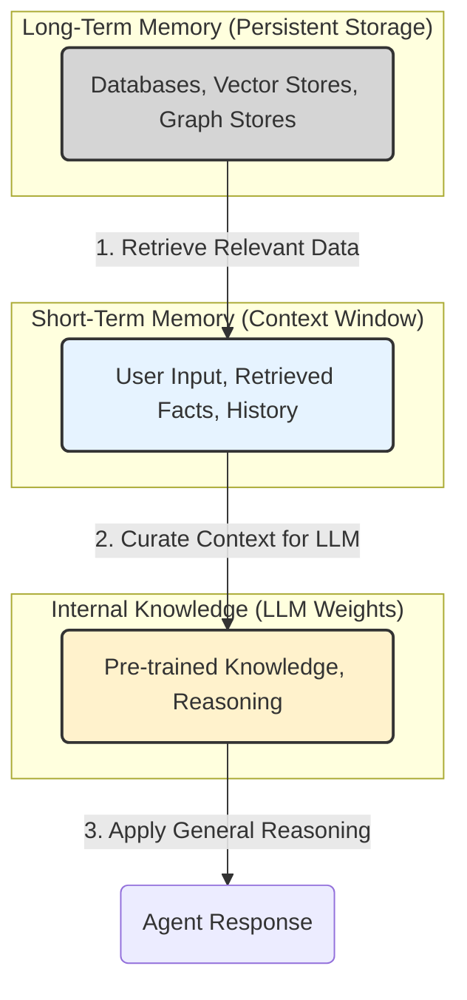

# Lesson 9: Agent Memory

In the last few lessons, we built a solid foundation in AI Engineering. We explored the agent landscape, learned to choose between rule-based workflows and autonomous agents, and mastered context engineering to manage the flow of information to an LLM. We even built a ReAct agent from scratch, giving our LLM the ability to reason and use tools. This work connects to a long-standing vision. As far back as 1945, Vannevar Bush's "Memex" concept imagined a device that would serve as an "enlarged intimate supplement to [our] memory," using associative trails to link information much like the human mind [[7]](https://danielp1.substack.com/p/memex-20-memory-the-missing-piece). Today, we are engineering that vision.

Now, we will tackle one of the most important components of context engineering: memory. We want to build agents that remember what was said in past conversations and personalize the user experience over time. Today’s LLMs have a fundamental limitation: their knowledge is vast but frozen in time. They are unable to learn by updating their parameters after deployment, a problem known as "continual learning." This inability to learn from new experiences means that without external systems, an agent's intelligence remains static. To overcome this, we must engineer workarounds.

This lesson will introduce a temporary solution that works today: external memory management systems. An LLM without memory is like an intern with amnesia, brilliant but unable to recall previous conversations or learn from experience. While we can feed new knowledge through the context window, this is a limited solution. The context window is the agent's working memory, its "RAM," but it is finite. Stuffing the entire conversation history into it is unrealistic due to several practical constraints. First, there is a physical size limit. Second, every token adds to the cost and latency of an LLM call, making large contexts slow and expensive. Finally, performance degrades due to the "lost-in-the-middle" problem, where models struggle to use information buried in a long prompt [[3]](https://www.linkedin.com/posts/pauliusztin_every-ai-agent-has-4-distinct-memory-layers-activity-7436765234800807936-QyLR).

Production systems like ChatGPT implement memory as an opt-in feature, where users can explicitly tell the system what to remember or let it pick up details automatically. This gives users control, but it also highlights the underlying engineering challenge: the agent is not truly learning, but rather storing text snippets in an external database to be retrieved later. The user can view and delete these memories, but this manual oversight underscores that we are still managing a database, not a mind. This distinction is critical. The agent decides what to remember, but it does so based on its programming, not genuine understanding or learning.

The landscape is constantly changing. Just a couple of years ago, we were working with 8,000-token context windows, which forced us as AI Engineers to be ruthless with compression and summarization [[1]](https://www.youtube.com/watch?v=7AmhgMAJIT4&list=PLDV8PPvY5K8VlygSJcp3__mhToZMBoiwX&index=112). Now, with models offering million-token contexts, we are re-evaluating these strategies. Less compression is needed, as the raw data preserves nuance and detail that summaries often lose [[1]](https://www.youtube.com/watch?v=7AmhgMAJIT4&list=PLDV8PPvY5K8VlygSJcp3__mhToZMBoiwX&index=112). Memory tools are the engineering solution that provides agents with continuity, adaptability, and the ability to "learn" from interactions.

In this lesson, we will borrow concepts from cognitive science to structure our approach. We will differentiate between the model's static internal knowledge, its short-term working memory, and persistent long-term memory. We will then dive into the three types of long-term memory—semantic (facts), episodic (experiences), and procedural (skills)—and show you how to implement them. Finally, we will cover the challenges and best practices learned from building memory systems in the real world.

## The Layers of Memory: Internal, Short-Term, and Long-Term

To build effective memory systems, it helps to borrow terminology from biology and cognitive science. This gives us a clear framework for thinking about how different types of data can be stored and retrieved to solve different problems [[1]](https://www.youtube.com/watch?v=7AmhgMAJIT4&list=PLDV8PPvY5K8VlygSJcp3__mhToZMBoiwX&index=112), [[2]](https://arxiv.org/html/2309.02427). An agent's memory can be organized into three distinct layers, each serving a different function [[3]](https://www.linkedin.com/posts/pauliusztin_every-ai-agent-has-4-distinct-memory-layers-activity-7436765234800807936-QyLR).

**Internal Knowledge** is the static, pre-trained information stored within the LLM's weights. This includes world knowledge, language patterns, and reasoning abilities acquired during its initial training. It is powerful but read-only. You cannot inject new user-specific knowledge into it during inference without fine-tuning. This immutability is a core limitation that necessitates external memory systems, as the model cannot update its own parameters based on new interactions [[3]](https://www.linkedin.com/posts/pauliusztin_every-ai-agent-has-4-distinct-memory-layers-activity-7436765234800807936-QyLR).

**Short-Term Memory**, also known as working memory, is the active context window of the LLM. It is the only reality the model sees during a single call. It holds the user's input, retrieved facts, tool schemas, and recent conversation snippets. This memory is volatile and ephemeral. Once the interaction ends or the information is pushed out of the context window, it is gone. It is the agent's "RAM." It is fast and essential for immediate tasks, but its limited capacity is a critical constraint in agent design [[4]](https://www.newsletter.swirlai.com/p/memory-in-agent-systems), [[5]](https://docs.letta.com/guides/agents/memory).

**Long-Term Memory** is an external, persistent storage system where an agent can save and retrieve information across sessions. This is where you store user preferences, past interactions, and learned facts, giving the agent continuity. It can be implemented using databases, vector stores, or graph stores, and serves as the agent's durable knowledge base [[3]](https://www.linkedin.com/posts/pauliusztin_every-ai-agent-has-4-distinct-memory-layers-activity-7436765234800807936-QyLR).

These layers do not operate in isolation. They work together through a retrieval pipeline where different memory types are queried in parallel. For a given task, the agent might simultaneously query its episodic memory for recent interactions, its semantic memory for relevant facts, and its procedural memory for applicable skills. The results from these parallel queries are then ranked for relevance and fused into a single, coherent context that is projected into the short-term memory window before being passed to the LLM [[1]](https://www.youtube.com/watch?v=7AmhgMAJIT4&list=PLDV8PPvY5K8VlygSJcp3__mhToZMBoiwX&index=112). This dynamic interplay, often connected to Retrieval Augmented Generation (RAG), makes an agent feel intelligent and context-aware.

A useful way to think about this process is as a **write-manage-read loop**. New information is constantly being written to memory, relevant context is read from it, and the memory store itself must be actively managed. This management step involves pruning, compressing, and consolidating information to prevent noise and contradiction. Most systems neglect this crucial step, leading to degraded performance over time as the memory becomes a junk drawer of stale and conflicting information [[11]](https://towardsdatascience.com/a-practical-guide-to-memory-for-autonomous-llm-agents/).


Image 1: The hierarchical flow of information between the three layers of agent memory.

No single layer can do it all. Internal knowledge provides general intelligence, short-term memory handles the immediate task, and long-term memory offers the personalization and continuity that the other layers lack. To build truly capable agents, we need to understand how to design and manage the most complex of these: long-term memory.

## Long-Term Memory: Semantic, Episodic, and Procedural

Long-term memory provides the agent with persistence, allowing it to build a lasting understanding of its users and tasks. We can break it down into three distinct types, each serving a unique purpose [[6]](https://machinelearningmastery.com/beyond-short-term-memory-the-3-types-of-long-term-memory-ai-agents-need/), [[2]](https://arxiv.org/html/2309.02427).

**Semantic Memory** is the agent's encyclopedia of facts and knowledge. This is where it stores discrete pieces of information, such as user preferences, key entities, and domain-specific rules. The structure of this memory is highly dependent on the agent's use case. For simple applications, facts can be stored as individual strings like, "User is allergic to gluten." For more complex needs, an entity-centric approach using JSON is more effective, allowing you to group related facts, such as `{"user": {"name": "John", "allergies": ["gluten"], "preferences": {"music": "rock"}}}`. This structured format enables precise, field-level queries. For use cases requiring an understanding of complex relationships, a knowledge graph is ideal, as it can explicitly model connections like `(User)-[:HAS_ALLERGY]->(Gluten)` [[7]](https://danielp1.substack.com/p/memex-20-memory-the-missing-piece).

For a personal assistant, semantic memory builds a persistent user profile, allowing it to recall important details without having to sift through a long, noisy conversation history. For an enterprise agent, this is where it would store internal documents or product catalogs to answer questions on proprietary topics [[6]](https://machinelearningmastery.com/beyond-short-term-memory-the-3-types-of-long-term-memory-ai-agents-need/), [[8]](https://www.ibm.com/think/topics/ai-agent-memory).

**Episodic Memory** is the agent's personal diary, a chronological log of its past experiences and interactions. Unlike the timeless facts in semantic memory, episodic memories are about "what happened and when" [[2]](https://arxiv.org/html/2309.02427). Each memory is an "episode" tied to a specific point in time. For example, instead of just knowing "User's brother is named Mark," an episodic memory might record: "On Tuesday, the user expressed frustration that their brother, Mark, always forgets their birthday. I provided an empathetic response."

This richer, time-stamped context allows the agent to interact with more nuance and intelligence in the future (e.g., "I know the topic of your brother's birthday can be sensitive..."). The granularity of these episodes is a key design choice. A customer service bot might need turn-by-turn recall to resolve an issue, requiring very fine-grained episodes. In contrast, a journaling app like Dot might benefit from daily summaries, creating a more reflective and less cluttered memory [[1]](https://www.youtube.com/watch?v=7AmhgMAJIT4&list=PLDV8PPvY5K8VlygSJcp3__mhToZMBoiwX&index=112). The right level of detail depends entirely on how the agent needs to use its past experiences to inform present actions.

**Procedural Memory** is the agent's muscle memory, its collection of learned skills and workflows. This is the "how-to" knowledge that enables it to execute multi-step tasks reliably and efficiently. This memory is often encoded as a reusable tool, function, or a defined sequence of actions within the agent's system prompt [[6]](https://machinelearningmastery.com/beyond-short-term-memory-the-3-types-of-long-term-memory-ai-agents-need/). For example, an agent might have a stored procedure for generating a monthly report. When a user requests it, the agent retrieves and executes a clear series of steps: 1) Query the sales database, 2) Summarize key findings, and 3) Ask the user for their preferred output format.

While developers often define these procedures, more advanced agents can learn them dynamically. If a user provides a numbered list of steps to accomplish a goal, the agent can parse this instruction, formalize it into a reusable procedure, and add it to its skill library. This allows the agent to adapt and acquire new skills over time, moving beyond its initial programming and learning directly from user demonstration [[2]](https://arxiv.org/html/2309.02427).

These three memory types work together to create a more capable agent. Semantic memory provides the facts, episodic memory provides the experiential context, and procedural memory provides the skills to act on that information [[6]](https://machinelearningmastery.com/beyond-short-term-memory-the-3-types-of-long-term-memory-ai-agents-need/). Now that we understand what to save, we need to decide how to store it.

## Storing Memories: Pros and Cons of Different Approaches

How an agent’s memories are stored is an architectural decision that directly impacts its performance, complexity, and ability to scale. There is no one-size-fits-all solution; the ideal approach depends on your product's use case. Let's explore the trade-offs of three primary methods: storing memories as raw strings, as structured entities, and within a knowledge graph [[7]](https://danielp1.substack.com/p/memex-20-memory-the-missing-piece).

```mermaid
graph TD
    subgraph Raw Strings
        A["'I have a dog! His name is Poppy. Walking him is the best part of my day.'"]
    end

    subgraph Structured Entities (JSON)
        B["{<br>  'user': {<br>    'pets': [<br>      {<br>        'type': 'dog',<br>        'name': 'Poppy'<br>      }<br>    ],<br>    'preferences': {<br>      'activities': ['walking the dog']<br>    }<br>  }<br>}"]
    end

    subgraph Knowledge Graph
        C["(User) -[:HAS_PET]-> (Poppy)"]
        D["(Poppy) -[:IS_A]-> (Dog)"]
        E["(User) -[:ENJOYS]-> (WalkingPoppy)"]
        F["(WalkingPoppy) -[:IS_A]-> (Activity)"]
        C --> D
        C --> E
        E --> F
    end

    A --> B
    B --> C
```
Image 2: Visual comparison of the three primary methods for storing agent memories.

**Storing Memories as Raw Strings** is the simplest method, where conversational turns or documents are stored as plain text and indexed for vector search [[9]](https://www.decodingai.com/p/how-does-memory-for-ai-agents-work). This approach is fast to set up and preserves the full nuance of the original interaction, including emotional tone and subtle linguistic cues [[1]](https://www.youtube.com/watch?v=7AmhgMAJIT4&list=PLDV8PPvY5K8VlygSJcp3__mhToZMBoiwX&index=112). However, retrieval can be imprecise. A query like “What is my brother’s job?” might retrieve every conversation mentioning “brother” and “job” without pinpointing the current fact [[9]](https://www.decodingai.com/p/how-does-memory-for-ai-agents-work). It is also difficult to update facts or resolve contradictions, as new information is simply added to a growing log. This lack of structure makes it hard to handle state changes over time, such as distinguishing "Barry *was* CEO" from "Claude *is* CEO" [[7]](https://danielp1.substack.com/p/memex-20-memory-the-missing-piece). To manage this, strategies like timestamping every memory and using recency to resolve conflicts are essential, but they add a layer of management complexity [[11]](https://towardsdatascience.com/a-practical-guide-to-memory-for-autonomous-llm-agents/).

**Storing Memories as Entities (JSON-like Structures)** involves using an LLM to extract unstructured interactions into structured data, like JSON objects [[1]](https://www.youtube.com/watch?v=7AmhgMAJIT4&list=PLDV8PPvY5K8VlygSJcp3__mhToZMBoiwX&index=112). This method allows for precise, field-level filtering and makes it easy to update information. It is well-suited for semantic memory, where user profiles and facts are stored. On the other hand, it requires designing a schema upfront, which adds complexity. A rigid schema can be inflexible, and while an LLM can dynamically alter it, this introduces the problem of schema drift and requires robust entity resolution techniques to avoid creating duplicate or inconsistent data [[1]](https://www.youtube.com/watch?v=7AmhgMAJIT4&list=PLDV8PPvY5K8VlygSJcp3__mhToZMBoiwX&index=112). The extraction process also strips away the rich subtext of the original conversation.

**Storing Memories in a Graph Database** is the most advanced approach, representing memories as a network of nodes (entities) and edges (relationships) [[10]](https://www.octoco.ai/blog/knowledge-graphs-as-memory). Graphs excel at modeling complex relationships and provide superior contextual and temporal awareness. For example, a platform like Zep uses a graph-based memory to track how relationships and facts evolve over time [[10]](https://www.octoco.ai/blog/knowledge-graphs-as-memory). Retrieval is also transparent and auditable. However, this method has the highest complexity and cost, requiring significant investment in schema design and maintenance. For many simple use cases, the overhead is not justified. For instance, a comparison of memory providers showed that while Zep's graph approach was powerful, it consumed significantly more tokens and had higher construction latency than a simpler system like Mem0, which uses a hybrid vector and optional graph store [[14]](https://arxiv.org/html/2504.19413). Moderating LLM-generated nodes and edges is also critical to prevent the graph from becoming polluted with noisy or incorrect links.

Regardless of the storage method, a key challenge is managing updates and resolving conflicts. An LLM can be tasked with supervising this process, but this requires careful guardrails. These include strict schema validation to ensure data integrity, using low temperature settings for deterministic outputs, applying recency rules to resolve contradictions, and incorporating a human-in-the-loop review process for critical applications. The choice of memory storage should be guided by your product's core needs. A good practice is to start with the simplest architecture that delivers value and evolve it as your agent's requirements become more complex.

## Memory Implementations with Code Examples

This section provides practical examples of implementing the different memory types using the open-source `mem0` library. `mem0` is a tool designed to provide a universal memory layer for AI agents, abstracting away the complexity of storage and retrieval. It supports various backends, including vector and graph databases, and offers a simple API for adding, searching, and managing memories [[14]](https://arxiv.org/html/2504.19413). We will focus on the "storing memories as raw strings" approach to highlight the benefits of each memory category without getting bogged down in storage architecture. It is important to remember that while Retrieval-Augmented Generation (RAG) is the mechanism for retrieving information, the creation of high-quality memories is an equally important preceding step. We will cover RAG in detail in the next lesson.

### Setup

First, let's set up our environment. We will use `mem0`, an open-source library designed to give AI agents long-term memory. We will configure it to use Google's Gemini for embeddings and fact extraction, with ChromaDB as a local vector store.

1.  First, we define our configuration. We will use `gemini-2.5-pro` as our LLM and `gemini-embedding-001` for creating embeddings. The vector store will be a local ChromaDB instance.
    ```python
    import os
    import re
    from typing import Optional
    
    from google import genai
    from mem0 import Memory
    
    from utils import env
    
    env.load(required_env_vars=["GOOGLE_API_KEY"])
    
    client = genai.Client()
    MODEL_ID = "gemini-2.5-pro"
    
    MEM0_CONFIG = {
        "embedder": {
            "provider": "gemini",
            "config": {
                "model": "gemini-embedding-001",
                "embedding_dims": 768,
                "api_key": os.getenv("GOOGLE_API_KEY"),
            },
        },
        "vector_store": {
            "provider": "chroma",
            "config": {
                "collection_name": "lesson9_memories",
                "path": "/tmp/chroma_mem0",
            },
        },
        "llm": {
            "provider": "gemini",
            "config": {
                "model": MODEL_ID,
                "api_key": os.getenv("GOOGLE_API_KEY"),
            },
        },
    }
    
    memory = Memory.from_config(MEM0_CONFIG)
    MEM_USER_ID = "lesson9_notebook_student"
    memory.delete_all(user_id=MEM_USER_ID)
    print("✅ Mem0 ready (Gemini embeddings + local Chroma).")
    ```
    It outputs:
    ```text
    ✅ Mem0 ready (Gemini embeddings + local Chroma).
    ```

2.  Next, we create helper functions to add and search for memories. The `mem_add_text` function stores a raw string with a specified category tag, while `mem_search` allows us to query memories and filter them by category.
    ```python
    def mem_add_text(text: str, category: str = "semantic", **meta) -> str:
        """Add a single text memory. No LLM is used for extraction or summarization."""
        metadata = {"category": category}
        for k, v in meta.items():
            if isinstance(v, (str, int, float, bool)) or v is None:
                metadata[k] = v
            else:
                metadata[k] = str(v)
        memory.add(text, user_id=MEM_USER_ID, metadata=metadata, infer=False)
        return f"Saved {category} memory."
    
    
    def mem_search(query: str, limit: int = 5, category: Optional[str] = None) -> list[dict]:
        """
        Category-aware search wrapper.
        Returns the full result dicts so we can inspect metadata.
        """
        res = memory.search(query, user_id=MEM_USER_ID, limit=limit) or {}
    
        items = res.get("results", [])
        if category is not None:
            items = [r for r in items if (r.get("metadata") or {}).get("category") == category]
        return items
    ```

### Semantic Memory: Extracting Facts

Semantic memory is created through an extraction pipeline. An LLM processes unstructured text with a specific prompt to pull out atomic, context-independent facts. This turns a messy conversation into a queryable knowledge base. A typical prompt for a personal assistant might look like this:

```
Extract persistent facts and strong preferences as short bullet points.
- Keep each fact atomic and context-independent. While reading the messages, make sure to notice the nuance or subtle details that might be important when saving these facts.
- 3–6 bullets max.

Text:
{My brother Mark is a software engineer, but his real passion is painting, he gifted me a painting a few years ago. Its really beautiful.}
```
The system would then store facts like: `Mark is the user's brother. Mark is a software engineer. Mark's real passion is painting. The user has a painting from Mark and finds it beautiful.`

1.  Let's add a few facts to our semantic memory. These are short, individual strings representing user preferences and details.
    ```python
    facts: list[str] = [
        "User prefers vegetarian meals.",
        "User has a dog named George.",
        "User is allergic to gluten.",
        "User's brother is named Mark and is a software engineer.",
    ]
    for f in facts:
        print(mem_add_text(f, category="semantic"))
    
    print(f"Added {len(facts)} semantic memories.")
    ```
    It outputs:
    ```text
    Saved semantic memory.
    Saved semantic memory.
    Saved semantic memory.
    Saved semantic memory.
    Added 4 semantic memories.
    ```

2.  Now, we can search for a specific fact using a natural language query. Retrieval of semantic memory is where **hybrid search** is useful. It combines the precision of keyword search with the contextual understanding of semantic search. The process typically involves two steps. First, the system filters the memory store based on exact keyword matches. For a query like "brother job," it would first narrow the search to all memories containing the keyword "brother." Second, within that pre-filtered set, a vector search is performed to find the most contextually relevant fact. The query "job" will have high semantic similarity to the stored memory `is a software engineer`, ensuring a precise answer is retrieved.
    ```python
    results = memory.search("brother job", user_id=MEM_USER_ID, limit=1)
    print(results["results"][0]["memory"])
    ```
    It outputs:
    ```text
    User's brother is named Mark and is a software engineer.
    ```

### Episodic Memory: The Log of Events

Episodic memory functions as a chronological log. Memories can be created by having an LLM extract key events, insights, or feelings from a conversation, which are then stored with a timestamp.

1.  We start with a short dialogue from which we want to extract an "episode."
    ```python
    dialogue = [
        {"role": "user", "content": "I'm stressed about my project deadline on Friday."},
        {"role": "assistant", "content": "I’m here to help—what’s the blocker?"},
        {"role": "user", "content": "Mainly testing. I also prefer working at night."},
        {"role": "assistant", "content": "Okay, we can split testing into two sessions."},
    ]
    ```

2.  We use an LLM with a specific prompt to extract the key insights from the dialogue. This is different from summarization; the goal is to capture specific, memorable details.
    ```python
    episodic_prompt = f"""You are a personal assistant. From the conversation text, extract events, likes, dislikes, or any other insights that will serve to better help the user in the future. Make sure to capture the nuance and details of the conversation, not just the facts.

    {dialogue}
    """
    episode_extraction = client.models.generate_content(model=MODEL_ID, contents=episodic_prompt)
    episode = episode_extraction.text.strip()
    print(episode)
    ```
    It outputs:
    ```text
    The user is feeling stressed due to a project deadline on Friday. The main obstacle is testing. The user has a preference for working at night.
    ```

3.  We store this extracted text in our memory, tagged as "episodic."
    ```python
    print(
        mem_add_text(
            episode,
            category="episodic",
            summarized=False, # This is an extraction, not a summary
            turns=4,
        )
    )
    ```
    It outputs:
    ```text
    Saved episodic memory.
    ```

4.  Retrieval from episodic memory often combines temporal and semantic queries. We can search for "deadline stress" to find this specific episode, and the `created_at` timestamp provided by `mem0` allows us to answer questions like "What did we talk about last week?"
    ```python
    print("\nSearch --> 'deadline stress'\n")
    hits = mem_search("deadline stress", limit=1, category="episodic")
    for h in hits:
        print(f"{h['memory']}\n")
        print(h)
    ```
    It outputs:
    ```text
    Search --> 'deadline stress'
    
    The user is feeling stressed due to a project deadline on Friday. The main obstacle is testing. The user has a preference for working at night.
    
    {'id': '...', 'memory': 'The user is feeling stressed...', 'metadata': {'turns': 4, 'summarized': False, 'category': 'episodic'}, 'score': 0.92..., 'created_at': '2025-09-12T02:30:01.358468-07:00', ...}
    ```

### Procedural Memory: Defining and Learning Skills

Procedural memory can be either developer-defined or learned from user interactions. Here, we will demonstrate how to define a procedure and store it.

1.  We define a multi-step procedure for creating a monthly report and store it as a single text block.
    ```python
    procedure_name = "monthly_report"
    steps = [
        "Query sales DB for the last 30 days.",
        "Summarize top 5 insights.",
        "Ask user whether to email or display.",
    ]
    procedure_text = f"Procedure: {procedure_name}\nSteps:\n" + "\n".join(f"{i + 1}. {s}" for i, s in enumerate(steps))
    
    mem_add_text(procedure_text, category="procedure", procedure_name=procedure_name)
    
    print(f"Learned procedure: {procedure_name}")
    ```
    It outputs:
    ```text
    Learned procedure: monthly_report
    ```

2.  Retrieval is an intent-matching process. When the user asks how to create a monthly report, the agent can search its procedural memory, retrieve the stored steps, and execute them. The LLM receives descriptions of all available procedures and matches the user's request to the most relevant one.
    ```python
    results = mem_search("how to create a monthly report", category="procedure", limit=1)
    if results:
        print(results[0]["memory"])
    ```
    It outputs:
    ```text
    Procedure: monthly_report
    Steps:
    1. Query sales DB for the last 30 days.
    2. Summarize top 5 insights.
    3. Ask user whether to email or display.
    ```

These memory functions can be exposed to an agent as tools, allowing it to autonomously decide when to write to or read from its memory. For example, an agent could be given `mem_add_text` and `mem_search` as callable functions. After a significant interaction, the agent's reasoning process might conclude that a new user preference has been revealed. It could then call the `mem_add_text` tool to save this new fact to its semantic memory, making that information available for all future interactions. This creates a self-managing memory loop, a key step toward more autonomous and adaptive agents.

## Real-World Lessons: Challenges and Best Practices

Moving from these theoretical patterns to a reliable, production-ready system requires navigating complex trade-offs. The underlying technology is improving so fast that best practices are constantly evolving. Here are some of the most important lessons we have learned from building and scaling agent memory systems.

A significant shift in memory design has been the trade-off between compressing information and preserving its raw detail. Just a couple of years ago, with small and expensive context windows, aggressive compression was a necessity. The goal was to distill every interaction into its most compact form, such as summaries, facts, or entities, to fit relevant information into the prompt. However, this process is inherently lossy. A summary keeps the general idea but loses the fine details and nuance that are often crucial for a personalized agent [[1]](https://www.youtube.com/watch?v=7AmhgMAJIT4&list=PLDV8PPvY5K8VlygSJcp3__mhToZMBoiwX&index=112). Today, models with million-token context windows have changed the equation. The best practice now leans toward less compression. The raw, unstructured conversational history is the ultimate source of truth. A semantic fact might state, "User has a dog named George," but the episodic log reveals, "User mentioned that walking their dog George is the best part of their day"—a far more valuable piece of information for a personalized assistant [[1]](https://www.youtube.com/watch?v=7AmhgMAJIT4&list=PLDV8PPvY5K8VlygSJcp3__mhToZMBoiwX&index=112). A good practice is to design your system to work with the most complete version of history that is economically and technically feasible. Use summarization and fact extraction to create queryable indexes, but always treat the raw log as the ground truth. As context windows grow, your retrieval pipeline may need to do less *retrieving* and more intelligent *filtering* of a larger, in-context history.

There is no "perfect" memory architecture. The concepts of semantic, episodic, and procedural memory are a powerful toolkit, not a mandatory blueprint. A common failure mode is over-engineering a complex, multi-part memory system for a product that does not need it. For example, implementing a full knowledge graph for a simple FAQ bot is unnecessary complexity. The product's goal should dictate the memory architecture, not the other way around [[1]](https://www.youtube.com/watch?v=7AmhgMAJIT4&list=PLDV8PPvY5K8VlygSJcp3__mhToZMBoiwX&index=112). For a Q&A bot over internal documents, a simple RAG pipeline is the best starting point [[6]](https://machinelearningmastery.com/beyond-short-term-memory-the-3-types-of-long-term-memory-ai-agents-need/). For a long-term personal AI companion like Dot, rich episodic memories are beneficial because the agent's value comes from remembering the narrative of your relationship [[1]](https://www.youtube.com/watch?v=7AmhgMAJIT4&list=PLDV8PPvY5K8VlygSJcp3__mhToZMBoiwX&index=112). For a task-automation agent, procedural memory is key [[6]](https://machinelearningmastery.com/beyond-short-term-memory-the-3-types-of-long-term-memory-ai-agents-need/).

Memory also exists to make the agent smarter, not to give the user a new job. A common pitfall is exposing the internal workings of the memory system, thinking it improves transparency. In practice, it often creates significant cognitive overhead for the user. Users should not be asked to "garden their agent's memories." Memory management should be an autonomous function of the agent. It should learn from corrections within the natural flow of conversation (e.g., "Actually, my brother's name is Mark, not Mike"). The agent, not the user, is responsible for periodically reviewing, consolidating, and resolving conflicting information in its memory stores [[11]](https://towardsdatascience.com/a-practical-guide-to-memory-for-autonomous-llm-agents/). This autonomous management can involve periodic, LLM-driven consolidation runs that identify duplicate or contradictory facts, apply recency rules to resolve them, and maintain the overall integrity of the memory without user intervention.

## Conclusion

Memory sits at the core of building personalized, stateful AI agents that can "learn" over time. The frameworks and tools we have discussed are engineering workarounds for the lack of true continual learning in today's LLMs. While they are a temporary solution, they are effective and allow us to build powerful applications now. As models evolve, our memory architectures will need to adapt. External memory systems might integrate more deeply with future models, or perhaps become less critical as LLMs develop more native learning abilities. The field is also maturing in how we evaluate these systems, with new dynamic benchmarks like StoryBench emerging to test knowledge retention and sequential reasoning in more realistic, multi-turn interactions [[13]](https://arxiv.org/html/2506.13356v1).

The future of agent design will likely involve a co-evolution of models and memory systems. As LLMs become more capable of managing their own internal states, the role of external memory may shift from a simple storage layer to a more sophisticated partner in reasoning. We might see agents that can autonomously decide not just what to remember, but *how* to structure that memory for optimal future retrieval, perhaps even learning to build their own knowledge graphs or procedural libraries from experience. This evolution will be driven by the need for agents that are not just knowledgeable, but wise, capable of applying past experiences to novel situations with greater understanding.

The concepts we have covered, particularly the interplay between long-term and short-term memory, are foundational. In our next lesson, we will explore Retrieval-Augmented Generation (RAG) in detail, the primary mechanism for pulling information from long-term memory into the agent's active context. We will then continue our journey by building and productionizing our own agents, applying these memory principles to create truly intelligent systems.

## References

- [1] https://www.youtube.com/watch?v=7AmhgMAJIT4&list=PLDV8PPvY5K8VlygSJcp3__mhToZMBoiwX&index=112
- [2] https://arxiv.org/html/2309.02427
- [3] https://www.linkedin.com/posts/pauliusztin_every-ai-agent-has-4-distinct-memory-layers-activity-7436765234800807936-QyLR
- [4] https://www.newsletter.swirlai.com/p/memory-in-agent-systems
- [5] https://docs.letta.com/guides/agents/memory
- [6] https://machinelearningmastery.com/beyond-short-term-memory-the-3-types-of-long-term-memory-ai-agents-need/
- [7] https://danielp1.substack.com/p/memex-20-memory-the-missing-piece
- [8] https://www.ibm.com/think/topics/ai-agent-memory
- [9] https://www.decodingai.com/p/how-does-memory-for-ai-agents-work
- [10] https://www.octoco.ai/blog/knowledge-graphs-as-memory
- [11] https://towardsdatascience.com/a-practical-guide-to-memory-for-autonomous-llm-agents/
- [12] https://christian-schneider.net/blog/persistent-memory-poisoning-in-ai-agents/
- [13] https://arxiv.org/html/2506.13356v1
- [14] https://arxiv.org/html/2504.19413