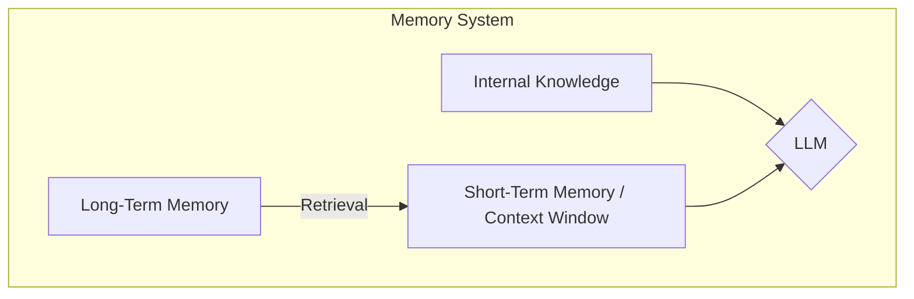

# Lesson 9: Memory for Agents

In our previous lessons, we built a solid foundation in AI Engineering. We explored the agent landscape, learned to choose between rule-based workflows and autonomous agents, mastered context engineering, and gave our agents the ability to use tools and reason with patterns like ReAct. These are the building blocks for creating sophisticated AI systems.

This need for sophisticated memory is a relatively recent challenge. Early AI, like the expert systems of the 1980s, relied on static, rule-based knowledge bases. Systems like MYCIN, which diagnosed blood infections, operated on a fixed set of facts and if-then rules, with no capacity to learn from new interactions [[27]](https://timspark.com/blog/the-journey-of-ai-evolution/). They were powerful for their time but brittle; their "memory" was a read-only library, not a living system.

Now, we will tackle one of the most important components of agentic AI: memory. We know that LLMs have a fundamental limitation. Their knowledge is vast but frozen in time, a static snapshot from their last training run. They are unable to learn from new interactions by updating their internal weights, a problem known as the "continual learning" challenge. To work around this, we can inject new knowledge through the context window, but this is a temporary fix. An LLM without a persistent memory system is like a brilliant intern with amnesia; it can solve complex problems in the moment but forgets everything as soon as the conversation ends.

The context window acts as the agent's "working memory" or RAM, but it has clear limits. Keeping an entire conversation history, along with retrieved documents and tool outputs, is often unrealistic. First, there is a finite size. Even with million-token windows, long-running interactions will eventually exceed it. Second, costs scale with the number of tokens, making every turn more expensive. Third, large contexts introduce noise. The model can get lost in irrelevant details, a problem known as the "lost-in-the-middle" effect, where information buried deep in the context is often ignored.

As context windows expand, the engineering trade-offs we make will continue to evolve. Not long ago, with 8k or 16k token limits, aggressive compression and summarization were a necessity. Today, we have more flexibility. Still, we need a robust strategy for managing information over time. Memory tools and architectures are the current solution, providing agents with the continuity and adaptability that models inherently lack. They are the engineering workaround that allows an agent to "learn" from experience.

In this lesson, we will explore how to design and implement these memory systems. We will borrow concepts from cognitive science to structure our thinking, breaking down memory into distinct layers and types. By the end, you will understand how to build agents that remember, adapt, and provide truly personalized experiences.

## The Layers of Memory: Internal, Short-Term, and Long-Term

To build effective memory systems, it helps to adopt terminology from biology and cognitive science. This gives us a clear framework for thinking about how an agent stores and accesses different kinds of information. The structure isn't arbitrary; it mirrors influential cognitive theories like the Atkinson-Shiffrin modal model of memory, which proposed that human memory consists of distinct stores connected by control processes [[28]](https://mem0.ai/blog/the-modal-model-of-memory-what-ai-agents-can-learn-from-cognitive-science). We can categorize an agent's memory into three distinct layers: internal knowledge, short-term memory, and long-term memory.

**Internal Knowledge** is the static, pre-trained information stored within the LLM's weights. This is the model's vast understanding of language, facts, and reasoning patterns acquired during its training. It is read-only and cannot be updated during inference. This layer provides the agent with its general intelligence, but it knows nothing about your specific users, data, or past interactions.

**Short-Term Memory**, often called working memory, is the agent's context window. This is the only information the model can "see" and act upon during a single turn. It is volatile and ephemeral, like a computer's RAM. It holds the current user query, recent conversation history, retrieved data, and any intermediate thoughts the agent generates. If information is not in the short-term memory, it does not exist for the agent in that moment.

**Long-Term Memory** is an external, persistent storage system. This is where an agent saves information it needs to retain across multiple sessions or conversations. Think of it as the agent's hard drive. It can store user preferences, past interactions, learned facts, and successful workflows, giving the agent a sense of continuity.

These layers work together in a dynamic retrieval pipeline. This process is more than just storage and retrieval; it can be thought of as a **write-manage-read loop** [[9]](https://towardsdatascience.com/a-practical-guide-to-memory-for-autonomous-llm-agents/). New information is written, the memory is managed over time (pruned, compressed, consolidated), and relevant context is read back into the prompt. Information from long-term memory is selectively retrieved and loaded into the short-term memory to provide relevant context for the current task. This process is the core of context engineering and is closely related to the Retrieval-Augmented Generation (RAG) pattern we will cover in Lesson 10. No single layer can do it all; their interplay is what gives an agent its coherence and intelligence.


Image 1: The three layers of agent memory and their retrieval flow.

This layered model is essential for designing robust agents. Internal knowledge provides the reasoning engine, short-term memory handles the immediate task, and long-term memory provides the deep, personalized context that makes the agent truly useful over time. To better understand how to design the long-term memory, we can break it down even further.

## Long-Term Memory: Semantic, Episodic, and Procedural

To design a powerful long-term memory, we can again draw inspiration from human cognition. Long-term memory is not a single, monolithic database. It is composed of different types of information that serve distinct purposes. The Cognitive Architectures for Language Agents (CoALA) framework formalizes this, proposing that robust AI systems should mirror the human cognitive system's division of long-term memory [[15]](https://arxiv.org/html/2309.02427). We can categorize them into semantic, episodic, and procedural memory.

### Semantic Memory (Facts & Knowledge)

**Semantic Memory** is the agent's encyclopedia, a structured repository of facts and knowledge. This information is context-independent and represents the agent's understanding of specific entities, concepts, and their relationships. The structure of this memory depends entirely on the agent's use case. It can range from simple key-value pairs to complex knowledge graphs.

This memory type provides the agent with a reliable source of truth. For an enterprise agent, this might be internal company documents or a product catalog. For a personal assistant, semantic memory is used to build a persistent profile of the user, storing key facts like preferences (`"User prefers vegetarian meals"`) or relationships (`"User has a dog named George"`). A healthcare agent, for example, uses semantic memory to remember a patient's conditions, allergies, and medications across sessions, ensuring personalized and consistent care [[29]](https://mem0.ai/usecase/healthcare). When the agent needs to answer a question or make a recommendation, it can query this memory to retrieve precise, factual information instead of trying to infer it from a noisy conversation history.

### Episodic Memory (Experiences & History)

**Episodic Memory** is the agent's personal diary, a chronological log of its past experiences and interactions. Unlike the timeless facts in semantic memory, episodic memories are tied to specific moments in time. They answer the question, "What happened, and when?"

This memory is crucial for maintaining conversational continuity and understanding the narrative of a user relationship. For example, a semantic memory might store two separate facts: `"User's brother is named Mark"` and `"User is frustrated with his brother."` An episodic memory provides richer, time-bound context: `"On Tuesday, the user expressed frustration that their brother, Mark, always forgets their birthday. I provided an empathetic response. [created_at=2025-08-25T17:20:04]"`. This detailed "episode" allows the agent to interact with more awareness and empathy in the future. With this temporal element, the agent can also answer queries like, "What did we talk about last week?"

### Procedural Memory (Skills & How-To)

**Procedural Memory** is the agent's muscle memory, its collection of learned skills and workflows. This is the "how-to" knowledge that enables it to perform multi-step tasks reliably and efficiently. It acts as a set of pre-defined playbooks for common requests. Cognitive science calls this procedural memory, but in agent systems, a more useful term is **experiential memory**, as it captures how an agent learns from doing [[30]](https://stevekinney.com/writing/agent-memory-systems).

This memory is often encoded as a reusable tool or function. For example, an agent might have a procedure for generating a monthly report. When a user requests it, the agent retrieves the procedure, which outlines a clear series of steps: 1) Query the sales database, 2) Summarize key insights, and 3) Ask for the preferred output format. More advanced agents can learn from experience, distilling insights from raw trajectories. After a difficult debugging session, an agent might store a new strategy: "When encountering connection timeout errors, check the connection pool configuration first." This learned experience improves its future performance [[30]](https://stevekinney.com/writing/agent-memory-systems).

Now that we have a framework for what to save, we need to decide *how* to store it. This architectural choice has significant implications for an agent's performance and scalability.

## Storing Memories: Pros and Cons of Different Approaches

How an agent's memories are stored is a critical architectural decision that impacts performance, complexity, and scalability. There is no single best solution; the right approach depends on your product's specific needs. Recent analysis identifies five distinct architectural patterns, each with different trade-offs in accuracy, latency, and cost [[31]](https://atlan.com/know/agent-memory-architectures/). Let's explore the trade-offs between three common methods: storing memories as raw strings, as structured entities, and in a knowledge graph.

```mermaid
graph TD
    subgraph "Memory Storage Approaches"
        A[Raw Strings]
        B[Structured Entities (JSON)]
        C[Knowledge Graph]
    end
    A -- "Simple, Preserves Nuance" --> D{Pros}
    A -- "Imprecise, Hard to Update" --> E{Cons}
    B -- "Precise, Easy to Update" --> D
    B -- "Complex, Rigid Schema" --> E
    C -- "Models Relationships, Auditable" --> D
    C -- "Highest Complexity, Slower Queries" --> E
```
Image 2: A visualization of the pros and cons for three common memory storage approaches.

### Storing Memories as Raw Strings

This is the simplest method, where conversational turns or documents are stored as plain text and indexed for vector search. This corresponds to the "Flat external vector store" pattern, which achieves around 67% accuracy on the LOCOMO benchmark at a low latency of 1.44s, using 90% fewer tokens than keeping everything in-context [[31]](https://atlan.com/know/agent-memory-architectures/).

-   **Pros:** It is simple and fast to set up, requiring minimal engineering to get started. By storing the raw text, it also preserves the full nuance of the original interaction, including emotional tone and subtle linguistic cues.
-   **Cons:** Retrieval is often imprecise. A query like "What is my brother's job?" might retrieve every conversation mentioning "brother" and "job" without pinpointing the current fact [[6]](https://www.decodingai.com/p/how-does-memory-for-ai-agents-work). Updating facts is also difficult; a correction just adds another string to the log, creating potential contradictions. The lack of structure makes it hard to handle state changes over time (e.g., distinguishing "Barry *was* CEO" from "Claude *is* CEO") [[5]](https://danielp1.substack.com/p/memex-20-memory-the-missing-piece).

### Storing Memories as Entities (JSON-like Structures)

This approach uses an LLM to extract unstructured interactions into structured formats like JSON.

-   **Pros:** Information is organized into key-value pairs, allowing for precise, field-level filtering and retrieval. It is also easier to update; if a user's preference changes, you only need to modify the relevant field in the JSON object. This method is well-suited for semantic memory, where user profiles and preferences are stored as facts.
-   **Cons:** It requires more upfront complexity in designing a data schema. This schema can be rigid; if new information does not fit the structure, it may be lost. Furthermore, the extraction process can strip away the rich subtext of the original conversation. The factual memory `"user_likes": ["cats"]` is far less descriptive than the original message, "Petting my cat is the best part of my day" [[1]](https://www.youtube.com/watch?v=7AmhgMAJIT4&list=PLDV8PPvY5K8VlygSJcp3__mhToZMBoiwX&index=112).

### Storing Memories in a Graph Database

This is the most advanced approach, where memories are stored as a network of nodes (entities) and edges (relationships) in a knowledge graph. This hybrid approach adds relational reasoning on top of vector search.

-   **Pros:** Knowledge graphs excel at representing complex relationships, such as `(User) -> [HAS_BROTHER] -> (Mark) -> [WORKS_AS] -> (Software Engineer)`. They offer superior contextual and temporal awareness by modeling time as an explicit property of a relationship [[10]](https://www.octoco.ai/blog/knowledge-graphs-as-memory). On benchmarks, graph-enhanced memory achieves higher accuracy on relational queries (68.4%) than flat vector stores, at a modest latency cost (2.59s) [[32]](https://atlan.com/know/agent-memory-architectures/). Retrieval is also more transparent and auditable, as you can trace the exact path that led to an answer.
-   **Cons:** This method has the highest complexity and cost, requiring significant investment in schema design and maintenance. Converting unstructured text into graph triples is a non-trivial task [[5]](https://danielp1.substack.com/p/memex-20-memory-the-missing-piece). Graph traversals can also be slower than vector lookups, potentially impacting real-time performance. For many simple use cases, the overhead is not justified.

The choice of memory storage should be guided by your product's core needs. A good practice is to start with the simplest architecture that delivers value and evolve it as your agent's requirements become more complex. Now, let's see how these concepts translate into code.

## Memory Implementations with Code Examples

This section provides practical examples of how to implement the different memory types. We will use the `mem0` library, an open-source tool designed to simplify memory management for AI agents. While RAG is the mechanism for *retrieving* information, which we will cover in Lesson 10, the *creation* of high-quality memories is an equally important preceding step. To focus on the benefits of each memory category, we will use the simple "storing memories as raw strings" approach.

<aside>
💡

You can find the code for this lesson in the notebook of Lesson 9, in the GitHub repository of the course.

</aside>

`mem0` is a memory layer that helps agents store, manage, and retrieve information. It offers a simple API to handle different memory types and integrates with various LLMs, embedding models, and vector stores. We will use it to demonstrate how to create and search semantic, episodic, and procedural memories.

### Setup

First, we will set up our environment by configuring `mem0` to use Google's Gemini models for both the LLM and embeddings, with ChromaDB as a local vector store.

1. We define the configuration for `mem0`, specifying Gemini for the LLM and embeddings, and ChromaDB for local vector storage.
    ```python
    import os
    import re
    from typing import Optional
    
    from google import genai
    from mem0 import Memory
    
    # Assumes GOOGLE_API_KEY is set in the environment
    client = genai.Client()
    MODEL_ID = "gemini-2.5-pro"
    
    MEM0_CONFIG = {
        "embedder": {
            "provider": "gemini",
            "config": {
                "model": "gemini-embedding-001",
                "embedding_dims": 768,
                "api_key": os.getenv("GOOGLE_API_KEY"),
            },
        },
        "vector_store": {
            "provider": "chroma",
            "config": {
                "collection_name": "lesson9_memories",
                "path": "/tmp/chroma_mem0",
            },
        },
        "llm": {
            "provider": "gemini",
            "config": {
                "model": MODEL_ID,
                "api_key": os.getenv("GOOGLE_API_KEY"),
            },
        },
    }
    
    memory = Memory.from_config(MEM0_CONFIG)
    MEM_USER_ID = "lesson9_notebook_student"
    memory.delete_all(user_id=MEM_USER_ID)
    ```
    It outputs:
    ```text
    ✅ Mem0 ready (Gemini embeddings + local Chroma).
    ```

2. We create helper functions, `mem_add_text` and `mem_search`, to simplify adding and retrieving memories. These functions act as a wrapper around the `mem0` client, allowing us to tag memories by category.
    ```python
    def mem_add_text(text: str, category: str = "semantic", **meta) -> str:
        """Add a single text memory. No LLM is used for extraction or summarization."""
        metadata = {"category": category}
        for k, v in meta.items():
            if isinstance(v, (str, int, float, bool)) or v is None:
                metadata[k] = v
            else:
                metadata[k] = str(v)
        memory.add(text, user_id=MEM_USER_ID, metadata=metadata, infer=False)
        return f"Saved {category} memory."
    
    
    def mem_search(query: str, limit: int = 5, category: Optional[str] = None) -> list[dict]:
        """
        Category-aware search wrapper.
        Returns the full result dicts so we can inspect metadata.
        """
        res = memory.search(query, user_id=MEM_USER_ID, limit=limit) or {}
    
        items = res.get("results", [])
        if category is not None:
            items = [r for r in items if (r.get("metadata") or {}).get("category") == category]
        return items
    ```

### Semantic Memory: Extracting Facts

Semantic memory is created through an extraction pipeline. An LLM processes a conversation and extracts atomic, context-independent facts.

1. We add a few sample facts to our semantic memory.
    ```python
    facts: list[str] = [
        "User prefers vegetarian meals.",
        "User has a dog named George.",
        "User is allergic to gluten.",
        "User's brother is named Mark and is a software engineer.",
    ]
    for f in facts:
        print(mem_add_text(f, category="semantic"))
    
    print(f"Added {len(facts)} semantic memories.")
    ```
    It outputs:
    ```text
    Saved semantic memory.
    Saved semantic memory.
    Saved semantic memory.
    Saved semantic memory.
    Added 4 semantic memories.
    ```

2. We can now search for a specific fact using a natural language query.
    ```python
    results = memory.search("brother job", user_id=MEM_USER_ID, limit=1)
    print(results["results"][0]["memory"])
    ```
    It outputs:
    ```text
    User's brother is named Mark and is a software engineer.
    ```
    This demonstrates how an agent can query its knowledge base to retrieve precise information. Retrieval is often enhanced with hybrid search, which combines keyword filtering with semantic similarity search.

### Episodic Memory: The Log of Events

Episodic memories are chronological logs of events, often with timestamps. They can be created by summarizing interactions over a period, like a single conversation or a full day.

1. We simulate a short dialogue and use an LLM to create a concise summary, which we will store as an "episode".
    ```python
    dialogue = [
        {"role": "user", "content": "I'm stressed about my project deadline on Friday."},
        {"role": "assistant", "content": "I’m here to help—what’s the blocker?"},
        {"role": "user", "content": "Mainly testing. I also prefer working at night."},
        {"role": "assistant", "content": "Okay, we can split testing into two sessions."},
    ]
    
    episodic_prompt = f"""Summarize the following 3–4 turns as one concise 'episode' (1–2 sentences).
    Keep salient details and tone.
    
    {dialogue}
    """
    episode_summary = client.models.generate_content(model=MODEL_ID, contents=episodic_prompt)
    episode = episode_summary.text.strip()
    print(episode)
    ```
    It outputs:
    ```text
    A user, stressed about a Friday project deadline because of testing and a preference for working at night, is advised to split the testing work into two manageable sessions.
    ```

2. We add this summary to our episodic memory, including metadata about the interaction.
    ```python
    print(
        mem_add_text(
            episode,
            category="episodic",
            summarized=True,
            turns=4,
        )
    )
    ```
    It outputs:
    ```text
    Saved episodic memory.
    ```

3. We can then retrieve this episode using a semantic search. `mem0` automatically adds a `created_at` timestamp, enabling temporal queries.
    ```python
    hits = mem_search("deadline stress", limit=1, category="episodic")
    for h in hits:
        print(f"{h['memory']}\n")
        print(h)
    ```
    It outputs:
    ```text
    A user, stressed about a Friday project deadline because of testing and a preference for working at night, is advised to split the testing work into two manageable sessions.
    
    {'id': '93ebb9eb-65b0-4975-9c0d-105497b43e5c', 'memory': 'A user, stressed about a Friday project deadline because of testing and a preference for working at night, is advised to split the testing work into two manageable sessions.', 'hash': '44f0bcd0965a1fb557c1d3b5a9f8ae6c', 'metadata': {'turns': 4, 'summarized': True, 'category': 'episodic'}, 'score': 0.9109697937965393, 'created_at': '2025-09-12T02:30:01.358468-07:00', 'updated_at': None, 'user_id': 'lesson9_notebook_student', 'role': 'user'}
    ```

### Procedural Memory: Defining and Learning Skills

Procedural memory can be defined by a developer or learned dynamically from user interactions. Here, we will define a simple procedure for creating a monthly report.

1. We define the steps of the procedure and store it as a single text block.
    ```python
    procedure_name = "monthly_report"
    steps = [
        "Query sales DB for the last 30 days.",
        "Summarize top 5 insights.",
        "Ask user whether to email or display.",
    ]
    procedure_text = f"Procedure: {procedure_name}\nSteps:\n" + "\n".join(f"{i + 1}. {s}" for i, s in enumerate(steps))
    
    mem_add_text(procedure_text, category="procedure", procedure_name=procedure_name)
    
    print(f"Learned procedure: {procedure_name}")
    ```
    It outputs:
    ```text
    Learned procedure: monthly_report
    ```

2. The agent can later retrieve this procedure by name or intent, then execute the steps. Retrieval is an intent-matching process where the LLM compares a user's request against the descriptions of available procedures.
    ```python
    results = mem_search("how to create a monthly report", category="procedure", limit=1)
    if results:
        print(results[0]["memory"])
    ```
    It outputs:
    ```text
    Procedure: monthly_report
    Steps:
    1. Query sales DB for the last 30 days.
    2. Summarize top 5 insights.
    3. Ask user whether to email or display.
    ```
    These examples show how to create and retrieve different types of memories. However, building a production-ready system involves navigating several real-world challenges.

## Real-World Lessons: Challenges and Best Practices

Moving from these theoretical patterns to a reliable production system requires navigating a series of complex trade-offs, especially as the underlying technology evolves so rapidly. Here are some key lessons learned from building and scaling agent memory systems.

### Re-evaluating Compression

One of the biggest shifts in memory design has been the trade-off between compressing information and preserving its raw detail.

-   **The Old Challenge:** Just a couple of years ago, LLMs had small and expensive context windows of around 8,000 tokens. This forced engineers to be ruthless with compression. Every interaction was distilled into its most compact form—summaries, facts, or entities—just to fit relevant information into the context. This process, however, is inherently lossy. A summary retains the gist but loses the fine details and nuance that are often vital for a truly personalized agent. This can lead to **summarization drift**, where repeated compression cycles cause the memory to diverge from the actual events [[9]](https://towardsdatascience.com/a-practical-guide-to-memory-for-autonomous-llm-agents/).
-   **The New Reality:** Today, models from the Gemini 2.5 family offer million-token context windows at a fraction of the cost. This changes the equation. The raw, unstructured conversation history is the ultimate source of truth, containing the emotional subtext and relational dynamics that extraction often discards. While a fact might state, "User has a dog named George," the episodic log reveals, "User mentioned that walking their dog George is the best part of their day," a far more valuable insight for a personal companion [[1]](https://www.youtube.com/watch?v=7AmhgMAJIT4&list=PLDV8PPvY5K8VlygSJcp3__mhToZMBoiwX&index=112).
-   **Best Practice:** Design your system to work with the most complete version of history that is economically and technically feasible. Use summarization and fact extraction to create queryable indexes, but always treat the raw log as the ground truth. As context windows grow, your retrieval pipeline may need to do less *retrieving* and more intelligent *filtering* of a larger, in-context history.

### Designing for the Product

There is no "perfect" memory architecture. The concepts of semantic, episodic, and procedural memory are a powerful mental model, but they are a toolkit, not a mandatory blueprint. A common failure mode is over-engineering a complex, multi-part memory system for a product that does not need it.

-   **The Challenge:** It is tempting to build a system that handles all memory types from day one. This often leads to unnecessary complexity, higher maintenance costs, and slower performance.
-   **Best Practice:** Start from first principles by defining your agent's core function. The product's goal should dictate the memory architecture.
    -   For a Q&A bot over internal documents, a simple RAG pipeline is often the best starting point. Your focus should be on a robust, factually accurate knowledge base.
    -   For a long-term personal AI companion, rich episodic memories are essential. The agent's value comes from its ability to remember the narrative of your relationship.
    -   For a task-automation agent, procedural memory is key. The agent needs to recall and reliably execute multi-step workflows.

### The Human Factor

Memory exists to make the agent smarter, not to give the user a new job. A common pitfall is exposing the internal workings of the memory system, thinking it improves transparency. In practice, it often creates significant cognitive overhead for the user.

-   **The Challenge:** Some early memory implementations allowed users to view, edit, or delete the facts an agent had stored about them. While well-intentioned, this approach can be frustrating.
-   **Best Practice:** Users should not be asked to "garden their agent's memories." It breaks the illusion of a capable assistant and turns the interaction into a tedious data-entry task. Memory management should be an autonomous function of the agent. It should learn from corrections within the natural flow of conversation (e.g., "Actually, my brother's name is Mark, not Mike"). The agent, not the user, is responsible for maintaining the integrity of its own knowledge through internal processes for review, consolidation, and conflict resolution [[20]](https://towardsdatascience.com/a-practical-guide-to-memory-for-autonomous-llm-agents/).

### Trustworthy Memory and Failure Modes

As agents become more autonomous and operate over longer periods, ensuring their memory is reliable and secure becomes a foundational requirement. This introduces several new challenges.

-   **Knowledge Integrity:** Agent memories can become stale or self-reinforce errors. An agent might act on a fact from months ago that is no longer true, or worse, make a wrong inference, store it as fact, and then treat that incorrect memory as ground truth in future decisions. This can also lead to **contradiction handling** failures, where an agent oscillates between believing two conflicting pieces of information [[9]](https://towardsdatascience.com/a-practical-guide-to-memory-for-autonomous-llm-agents/).
-   **Security and Privacy:** Persistent memory creates new attack vectors. An attacker could use carefully crafted inputs to poison an agent's long-term memory with false information. Furthermore, in any multi-user system, strict tenant isolation is critical to prevent one user's data from leaking into another's session. This requires more than just application-level filtering; it demands architectural choices like per-tenant databases or encryption keys to ensure true isolation [[30]](https://stevekinney.com/writing/agent-memory-systems), [[33]](https://arxiv.org/html/2603.07670v1).

## Conclusion

Memory is a core component that transforms a simple, stateless chatbot into a truly adaptive and personalized agent. It is what allows our AI systems to maintain continuity, learn from experience, and build a lasting understanding of the user and their world. We have explored the different layers and types of memory, from the static internal knowledge of the LLM to the dynamic, persistent storage of facts, experiences, and skills.

The tools and architectures we use today are a practical workaround for the fundamental inability of current models to achieve true "continual learning." As LLMs evolve, our approaches to memory will undoubtedly change. Larger context windows may reduce our reliance on external retrieval, and future models might even incorporate more native learning abilities. However, the principles of structuring, storing, and retrieving information will remain central to AI engineering. Open research challenges, such as principled memory consolidation and learning when to forget, are actively being explored, pointing toward a future of even more intelligent and autonomous systems [[33]](https://arxiv.org/html/2603.07670v1).

In our next lesson, we will dive deeper into Retrieval-Augmented Generation (RAG), the primary mechanism for pulling information from long-term memory into the agent's active context. We will also continue to explore more advanced agentic patterns and how to prepare them for production with robust monitoring and evaluation pipelines.

## References

- [1] [What is the perfect memory architecture?](https://www.youtube.com/watch?v=7AmhgMAJIT4&list=PLDV8PPvY5K8VlygSJcp3__mhToZMBoiwX&index=112)
- [2] [Memory: The secret sauce of AI agents](https://decodingml.substack.com/p/memory-the-secret-sauce-of-ai-agents)
- [3] [Memory in Agent Systems](https://www.newsletter.swirlai.com/p/memory-in-agent-systems)
- [4] [Mem0: Building Production-Ready AI Agents with Scalable Long-Term Memory](https://arxiv.org/html/2504.19413)
- [5] [Memex 2.0: Memory The Missing Piece for Real Intelligence](https://danielp1.substack.com/p/memex-20-memory-the-missing-piece)
- [6] [How does memory for AI agents work?](https://www.decodingai.com/p/how-does-memory-for-ai-agents-work)
- [7] [Why memory matters in LLM agents: Short-term vs. long-term memory architectures](https://skymod.tech/why-memory-matters-in-llm-agents-short-term-vs-long-term-memory-architectures/)
- [8] [From raw interaction to reusable knowledge: Rethinking memory for AI agents](https://www.microsoft.com/en-us/research/blog/from-raw-interaction-to-reusable-knowledge-rethinking-memory-for-ai-agents/)
- [9] [A practical guide to memory for autonomous LLM agents](https://towardsdatascience.com/a-practical-guide-to-memory-for-autonomous-llm-agents/)
- [10] [Knowledge Graphs as Memory: Why Your AI Agent Needs to Think in Relationships](https://www.octoco.ai/blog/knowledge-graphs-as-memory)
- [11] [Temporal Knowledge Graphs as Long-Term Memory](https://medium.com/@bijit211987/agents-that-remember-temporal-knowledge-graphs-as-long-term-memory-2405377f4d51)
- [12] [mem0 - How three prompts created a viral AI memory layer](https://blog.lqhl.me/mem0-how-three-prompts-created-a-viral-ai-memory-layer)
- [13] [Beyond Short-Term Memory: The 3 Types of Long-Term Memory AI Agents Need](https://machinelearningmastery.com/beyond-short-term-memory-the-3-types-of-long-term-memory-ai-agents-need/)
- [14] [Every AI agent has 4 distinct memory layers](https://www.linkedin.com/posts/pauliusztin_every-ai-agent-has-4-distinct-memory-layers-activity-7436765234800807936-QyLR)
- [15] [Cognitive Architectures for Language Agents](https://arxiv.org/html/2309.02427)
- [16] [Introduction to Stateful Agents](https://docs.letta.com/guides/agents/memory)
- [17] [Memory overview](https://langchain-ai.github.io/langgraph/concepts/memory/)
- [18] [What is AI agent memory?](https://www.ibm.com/think/topics/ai-agent-memory)
- [19] [Giving Your AI a Mind: Exploring Memory Frameworks for Agentic Language Models](https://medium.com/@honeyricky1m3/giving-your-ai-a-mind-exploring-memory-frameworks-for-agentic-language-models-c92af355df06)
- [20] [A Practical Guide to Memory for Autonomous LLM Agents](https://towardsdatascience.com/a-practical-guide-to-memory-for-autonomous-llm-agents/)
- [21] [Agent Memory Systems](https://stevekinney.com/writing/agent-memory-systems)
- [22] [Agent Workflow Memory (AWM)](https://openreview.net/forum?id=NTAhi2JEEE)
- [23] [Reciprocal Rank Fusion (RRF)](https://vizuara.substack.com/p/a-primer-on-re-ranking-for-retrieval)
- [24] [LOCOMO Dataset](https://arxiv.org/html/2504.19413)
- [25] [mem0 Documentation](https://docs.mem0.ai/platform/features/timestamp)
- [26] [PlugMem: A Task-Agnostic Plugin Memory Module for LLM Agents](https://www.microsoft.com/en-us/research/publication/plugmem-a-task-agnostic-plugin-memory-module-for-llm-agents/)
- [27] [The Journey of AI Evolution](https://timspark.com/blog/the-journey-of-ai-evolution/)
- [28] [The Modal Model of Memory: What AI Agents Can Learn From Cognitive Science](https://mem0.ai/blog/the-modal-model-of-memory-what-ai-agents-can-learn-from-cognitive-science)
- [29] [Agent memory for personalized healthcare at scale](https://mem0.ai/usecase/healthcare)
- [30] [Memory Systems for AI Agents: What the Research Says and What You Can Actually Build](https://stevekinney.com/writing/agent-memory-systems)
- [31] [Agent Memory Architectures: Patterns and Trade-offs (2026)](https://atlan.com/know/agent-memory-architectures/)
- [32] [Agent Memory Architectures: Vector, Graph, & Episodic](https://www.digitalapplied.com/blog/agent-memory-architectures-vector-graph-episodic)
- [33] [Learned vs. Foundational Memory for LLM Agents](https://arxiv.org/html/2603.07670v1)