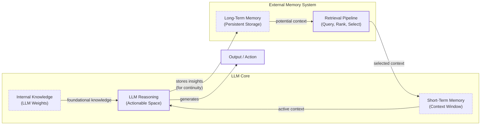
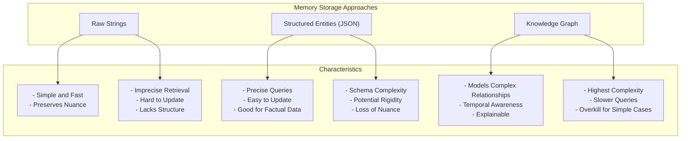

# Lesson 9: Memory for AI Agents

In previous lessons, you built a solid foundation in AI Engineering. You explored the agent landscape, distinguished between rule-based LLM workflows and autonomous agents, and dove into context engineering. You learned that managing the flow of information to an LLM is a critical skill. Now, you will focus on one of the most important components of that information ecosystem: memory.

The core limitation of today's LLMs is that their knowledge is vast but frozen in time. They are fundamentally unable to learn by updating their internal weights after deployment, a problem known as "continual learning." Memory provides a solution. It is what turns a stateless text generator into a genuinely adaptive agent that can accumulate knowledge, develop behaviors from experience, and avoid repeating mistakes. [[48]] To work around this limitation, we can inject new knowledge through the context window. However, this is a limited solution. An LLM without a persistent memory is like a brilliant intern with amnesia; it can solve complex problems but forgets every conversation and lesson learned the moment you walk away.

The context window acts as the agent's "working memory" or RAM, but it has practical limits. Keeping an entire conversation history in context is often unrealistic due to finite size, rising costs per interaction, and the introduction of noise. Even with million-token context windows, models struggle to correctly use relevant information when it is buried in the middle. [[17]] This "lost-in-the-middle" problem means that bigger is not always better; research on frontier models shows that on average, 40% of relevant facts are effectively lost when placed in the middle of a large context. [[49]]

This forces a constant re-evaluation of how we design stateful systems. When context windows were just 8,000 tokens, we had to be ruthless with compression, summarizing conversations and extracting only the most critical facts. Today, with larger and cheaper context windows, we can afford to preserve more raw detail, which is often where the most valuable nuance lies. Features like ChatGPT's opt-in memory, which allows the model to carry learning between chats, show a clear industry trend toward more persistent agents. [[3]] This feature works by having the model generate memories from conversations and storing them for future use. Users can view, delete, or disable this memory, but it highlights the move toward systems that remember. Still, this is a managed feature, not a solution to the underlying architectural challenge for engineers building custom agents.

External memory systems are the engineering workaround that gives agents continuity, adaptability, and the ability to "learn" from experience. In this lesson, you will explore the different layers of memory, drawing on concepts from cognitive science to build a mental model for how they work. You will cover the hierarchy of internal, short-term, and long-term memory; the three types of long-term memory (semantic, episodic, and procedural); different strategies for storing memories and their trade-offs; a hands-on implementation using the `mem0` library; and real-world best practices for designing memory systems that work. To build agents that are truly useful, you first need to understand how they can remember.

## The Layers of Memory: Internal, Short-Term, and Long-Term

To build effective memory systems, we can borrow a useful mental model from biology and cognitive science. Human memory is not a single, monolithic thing. It is a complex system of interacting layers, each with a different purpose and time horizon. [[22]] We can apply a similar layered approach to AI agents, which helps clarify the role and limitations of each component. This is not just an analogy; a growing body of research systematically connects insights from cognitive neuroscience with the design of LLM-driven agents. [[50]]

An agent's memory can be organized into three distinct layers:

**Internal Knowledge** is the static, pre-trained information embedded in the LLM's weights. This is the model's foundational understanding of the world, language, and reasoning patterns, acquired during its initial training. It is powerful and vast, allowing the model to know about entire books with an empty context window. However, it is read-only. This immutability is a core limitation; without fine-tuning, this knowledge does not update with new information or experiences, which is why external memory is necessary. [[1]]

**Short-Term Memory**, also known as working memory, is the agent's active context window. This is the only information the model can "see" and directly act upon during a single inference step. [[22]] It is volatile, fast, and limited in size. If information is not in the context window, it does not exist for the model in that moment. This is where we simulate "learning" by feeding the model relevant information from past interactions. It is the central hub connecting the agent's different components, holding perceptual inputs, retrieved knowledge, and the agent's active goals. [[40]] The context window is the reservoir of active information, but it must be carefully managed to avoid overloading the model with noise, which can degrade performance. [[1]]

**Long-Term Memory** is an external, persistent storage system, like a database or file system, where an agent can save and retrieve information across sessions. [[2]] This gives the agent continuity, allowing it to recall user preferences, past conversations, and learned facts long after they have fallen out of the short-term context window. This layer is what transforms an agent from a single-session tool into a long-term, personalized assistant. It is the agent's library of accumulated knowledge, accessible on demand.

These layers form a dynamic hierarchy. Information is selectively retrieved from the vast ocean of long-term memory and loaded into the limited, actionable space of short-term memory. This retrieval process, a core component of Retrieval-Augmented Generation (RAG), is the essence of context engineering. The agent queries its long-term storage for information relevant to the current task, and only the most important pieces are placed into the context window. This ensures the LLM has what it needs to reason effectively without being overwhelmed by noise.


Image 1: A diagram illustrating the hierarchy and dynamic interplay between an AI agent's Internal Knowledge, Short-Term Memory, and Long-Term Memory, including a retrieval pipeline.

Categorizing memory this way is useful because it clarifies the distinct roles each layer plays. Internal knowledge provides general intelligence, short-term memory handles the immediate task, and long-term memory provides the personalized context that the other layers lack. To build truly capable agents, you need all three working together. Now, let's explore the different flavors of long-term memory.

## Long-Term Memory: Semantic, Episodic, and Procedural

Just as we can categorize memory by its duration, we can also categorize long-term memory by its content and purpose. Again, borrowing from cognitive science helps us create a structured approach. [[26]] This taxonomy was formally translated into an AI agent architecture in the 2023 CoALA framework from Princeton, giving the field a widely accepted language for discussing memory. [[40, 51]] We can divide long-term memory into three primary types: semantic, episodic, and procedural. [[28]]

**Semantic Memory (Facts & Knowledge)** is the agent's encyclopedia. It is a repository of discrete, timeless facts about the world, users, and specific domains. [[29]] These facts can be simple strings like `"User is a vegetarian"` or structured data attached to an entity, like a JSON object: `{"user_profile": {"dietary_restrictions": ["vegetarian", "gluten-free"]}}`. The structure you choose depends on your agent's use case. For a personal assistant, semantic memory builds a persistent user profile, storing preferences (`"User likes rock music"`) and key relationships (`"User has a dog named George"`). For an enterprise agent, it might store internal documents or a product catalog, often using knowledge bases or vector embeddings for efficient retrieval. [[52]] This allows the agent to retrieve precise, reliable information without having to sift through a noisy conversation history. The structure can even be a graph database, which is particularly useful when relationships between facts are as important as the facts themselves.

**Episodic Memory (Experiences & History)** is the agent's personal diary. It records a chronological log of specific events and interactions, capturing "what happened and when". [[29]] Unlike the timeless facts in semantic memory, episodic memories are anchored to a specific point in time. For example, an episodic memory might record: `"On Tuesday, the user expressed frustration that their brother, Mark, always forgets their birthday. I provided an empathetic response. [created_at=2025-08-25T17:20:04]"`. This provides far richer context than a simple semantic fact like `"User is frustrated with his brother"`. The temporal element allows the agent to understand the narrative of a relationship and respond with greater empathy and intelligence (e.g., *"I know last week you were feeling frustrated about your brother's birthday..."*). The granularity of these episodes can vary widely based on the product's needs, from a single conversational turn, to a daily summary, to a weekly digest of key events. This choice directly impacts the agent's ability to answer temporal queries and maintain long-term conversational context.

**Procedural Memory (Skills & How-To)** is the agent's muscle memory. It stores learned workflows and multi-step procedures for completing tasks. [[26]] Procedural memory is a set of pre-defined playbooks. This memory is often encoded as a reusable tool or function and included in the agent's system prompt. For example, a `monthly_report` procedure would define a clear series of steps: 1. Query the sales database. 2. Summarize key insights. 3. Ask the user for their preferred output format. When a user requests a monthly update, the agent doesn't need to reason from scratch; it retrieves and executes the stored procedure. This makes its behavior on common tasks reliable, fast, and predictable. More advanced agents can even learn new procedures dynamically. For example, if a user provides a numbered list of steps for a new task, the agent can formalize this into a new, callable procedure, effectively expanding its own skill set over time. [[42, 52]]

These three memory types form a comprehensive toolkit, and real-world applications often combine them. For instance, an AI-powered math tutoring platform might use a dual-memory framework where long-term semantic memory stores the student's prior knowledge and misconceptions, while episodic memory in the current session tracks the problem state and recent interactions. [[53]] Semantic memory provides the "what," episodic memory provides the "when," and procedural memory provides the "how." By combining them, we can build agents that are not only knowledgeable but also experienced and skillful. Now that we know what to save, let's consider how to store it.

## Storing Memories: Pros and Cons of Different Approaches

How an agent's memories are stored is a critical architectural decision that directly impacts its performance, complexity, and scalability. While the goal is always to provide the right context at the right time, the method of storage involves trade-offs. There is no one-size-fits-all solution. The ideal approach depends entirely on the product's use-case. Let's explore the three primary methods: storing memories as raw strings, as structured entities, and within a knowledge graph.


Image 2: A diagram visualizing the three primary approaches to storing agent memories and their key characteristics.

### Storing Memories as Raw Strings

This is the simplest method, where conversational turns or documents are stored as plain text and indexed for vector search. Its main advantage is that it is simple to set up and preserves the full nuance of the original interaction, including emotional tone and subtle linguistic cues. [[6]] However, this approach has significant downsides. Retrieval based solely on semantic similarity is often imprecise. A query like “What is my brother’s job?” might retrieve every conversation mentioning “brother” and “job” without pinpointing the current fact. [[6]] Updating information is also difficult. If a user corrects a fact, the new information is simply another string in a growing log, creating potential contradictions that are hard to resolve without effective timestamping and deduplication strategies. [[6]] This lack of structure also makes it difficult to handle temporal reasoning and state changes, such as distinguishing between a former and current CEO. [[6]]

### Storing Memories as Entities (JSON-like Structures)

In this approach, an LLM is used to extract unstructured interactions into a structured format like JSON. This organizes information into key-value pairs, allowing for precise, field-level filtering and making it easy to update specific facts. This method is perfectly suited for semantic memory, where user profiles and preferences are stored. The main drawback is the upfront complexity of designing a schema. A predefined schema can be inflexible, and information that does not fit the structure may be lost. While allowing an LLM to dynamically alter the schema offers more flexibility, it introduces challenges in managing schema drift and ensuring data consistency through techniques like entity resolution. Furthermore, the extraction process can strip away the rich subtext of the original conversation; the factual memory `"user_likes": ["cats"]` is far less representative than the original message, "Petting my cat is the best part of my day." Guardrails are necessary for any LLM-supervised memory management, including schema validation and recency rules for conflict resolution.

### Storing Memories in a Knowledge Graph

This is the most advanced approach, where memories are stored as a network of nodes (entities) and edges (relationships). The core strength of a graph is its ability to explicitly model complex relationships, enabling sophisticated, multi-hop queries that can trace connections between different pieces of information. [[10]] Knowledge graphs also provide superior temporal awareness by modeling time as an explicit property of a relationship, leading to more accurate and grounded retrieval than vector search alone. [[12]] This structure also makes the agent's reasoning transparent and auditable. However, this method carries the highest complexity and cost, requiring significant investment in schema design, data extraction, and maintenance. Converting unstructured text into structured graph triples is a non-trivial task, and there is a risk of creating noisy or incorrect links that degrade the graph's integrity. For many applications, the complexity of a graph database is overkill.

| Approach | Pros | Cons | Best For |
| :--- | :--- | :--- | :--- |
| **Raw Strings** | Simple setup, preserves nuance. | Imprecise retrieval, hard to update, lacks structure. | Quick prototypes, applications where conversational tone is more important than factual precision. |
| **Entities (JSON)** | Structured, precise queries, easy to update. | Schema design complexity, potential rigidity, loss of nuance. | Storing user profiles, preferences, and other factual semantic data. |
| **Knowledge Graphs** | Models complex relationships, strong temporal awareness, explainable. | Highest complexity and cost, potentially slower queries. | Advanced agents requiring multi-hop reasoning, temporal analysis, and auditable decision-making. |

Table 1: A comparison of memory storage approaches.

Ultimately, the choice of memory storage should be guided by your product's core needs. A good strategy is to start with the simplest architecture that delivers value and evolve it as your agent's requirements become more complex. Sophisticated systems often run multiple retrieval strategies in parallel—such as semantic search, keyword matching, and graph traversal—and then use a re-ranking step to select the most relevant context. [[56]] Now that we understand the storage options, let's look at how to implement these memory types with code.

## Memory Implementations with Code Examples

To make these concepts concrete, let's walk through how to implement semantic, episodic, and procedural memory using the open-source `mem0` library. While Retrieval-Augmented Generation (RAG) is the mechanism for *retrieving* information, which we will cover in Lesson 10, the creation of high-quality memories is an equally important preceding step. We will focus on the creation process here, using a simple "raw string" storage approach to highlight the unique characteristics of each memory type.

### What is mem0?

Mem0 is a memory layer designed for AI agents that provides a simple API for adding, searching, and managing different types of memories. It handles the underlying complexity of storage, extraction, and retrieval, allowing you to add a persistent memory to your agent with just a few lines of code. It supports various vector databases and can be configured to use different LLMs and embedding models. A benchmark on the LOCOMO dataset showed that `mem0` achieved 26% higher accuracy than OpenAI's native memory system, with 91% lower latency compared to full-context approaches, highlighting its efficiency. [[31]]

### Setup

For these examples, we will configure `mem0` to use Google's Gemini models for both LLM operations and embeddings, with ChromaDB acting as a local vector store. This setup is defined in a configuration dictionary and passed to the `Memory` class. The code is taken directly from the notebook for this lesson.

1.  First, we configure `mem0` to use Gemini for its LLM and embedding models and a local ChromaDB instance for storage.
    
    ```python
    import os
    from mem0 import Memory
    
    MEM0_CONFIG = {
        "embedder": {
            "provider": "gemini",
            "config": {
                "model": "gemini-embedding-001",
                "embedding_dims": 768,
                "api_key": os.getenv("GOOGLE_API_KEY"),
            },
        },
        "vector_store": {
            "provider": "chroma",
            "config": {
                "collection_name": "lesson9_memories",
                "path": "/tmp/chroma_mem0",
            },
        },
        "llm": {
            "provider": "gemini",
            "config": {
                "model": "gemini-2.5-pro",
                "api_key": os.getenv("GOOGLE_API_KEY"),
            },
        },
    }
    
    memory = Memory.from_config(MEM0_CONFIG)
    MEM_USER_ID = "lesson9_notebook_student"
    memory.delete_all(user_id=MEM_USER_ID)
    print("✅ Mem0 ready (Gemini embeddings + local Chroma).")
    ```
    
    It outputs:
    
    ```text
    ✅ Mem0 ready (Gemini embeddings + local Chroma).
    ```
    
2.  We also define a few helper functions to simplify adding and searching for memories. `mem_add_text` stores a string with a specified category, and `mem_search` retrieves memories, with an option to filter by that category.
    
    ```python
    from typing import Optional
    
    def mem_add_text(text: str, category: str = "semantic", **meta) -> str:
        """Add a single text memory. No LLM is used for extraction or summarization."""
        metadata = {"category": category}
        for k, v in meta.items():
            if isinstance(v, (str, int, float, bool)) or v is None:
                metadata[k] = v
            else:
                metadata[k] = str(v)
        memory.add(text, user_id=MEM_USER_ID, metadata=metadata, infer=False)
        return f"Saved {category} memory."
    
    
    def mem_search(query: str, limit: int = 5, category: Optional[str] = None) -> list[dict]:
        """Category-aware search wrapper."""
        res = memory.search(query, user_id=MEM_USER_ID, limit=limit) or {}
    
        items = res.get("results", [])
        if category is not None:
            items = [r for r in items if (r.get("metadata") or {}).get("category") == category]
        return items
    ```
    

### Semantic Memory: Extracting Facts

Semantic memory is created through a deliberate extraction pipeline. An LLM analyzes a conversation with a specific prompt to pull out timeless, context-independent facts. For example, `mem0` uses a prompt that instructs the model to act as a "Personal Information Organizer," extracting facts, preferences, and memories into concise bullet points. [[15]]

Here is an example of a prompt that could be used:
```
Extract persistent facts and strong preferences as short bullet points.
- Keep each fact atomic and context-independent. While reading the messages, make sure to notice the nuance or subtle details that might be important when saving these facts.
- 3–6 bullets max.

Text:
{My brother Mark is a software engineer, but his real passion is painting, he gifted me a painting a few years ago. Its really beautiful.}
```
The system would store: `Mark is the user's brother. Mark is a software engineer. Mark's real passion is painting. The user has a painting from Mark and finds it beautiful.`.

1.  Let's add a few facts about a user to our semantic memory. We will store each fact as a separate string with the category "semantic".
    
    ```python
    facts: list[str] = [
        "User prefers vegetarian meals.",
        "User has a dog named George.",
        "User is allergic to gluten.",
        "User's brother is named Mark and is a software engineer.",
    ]
    for f in facts:
        print(mem_add_text(f, category="semantic"))
    
    print(f"Added {len(facts)} semantic memories.")
    ```
    
    It outputs:
    
    ```text
    Saved semantic memory.
    Saved semantic memory.
    Saved semantic memory.
    Saved semantic memory.
    Added 4 semantic memories.
    ```
    
2.  Now, we can retrieve a specific fact using a natural language query. Retrieval for semantic memory often benefits from a hybrid search approach, combining keyword filtering with semantic similarity. For example, a query for "brother's job" could first filter for all memories containing the keyword "brother" and then perform a vector search within that subset to find the one most semantically related to "job." This two-step process improves precision.
    
    ```python
    results = memory.search("brother job", user_id=MEM_USER_ID, limit=1)
    print(results["results"][0]["memory"])
    ```
    
    It outputs:
    
    ```text
    User's brother is named Mark and is a software engineer.
    ```
    

### Episodic Memory: The Log of Events

Episodic memory functions as a chronological log of events, each with a timestamp. These can be created by summarizing interactions over a period, such as a single conversation or an entire day.

1.  Here, we simulate a short conversation and use an LLM to generate a concise, one-sentence summary, which we will store as an "episode".
    
    ```python
    from google import genai
    
    client = genai.Client()
    MODEL_ID = "gemini-2.5-pro"
    
    dialogue = [
        {"role": "user", "content": "I'm stressed about my project deadline on Friday."},
        {"role": "assistant", "content": "I’m here to help—what’s the blocker?"},
        {"role": "user", "content": "Mainly testing. I also prefer working at night."},
        {"role": "assistant", "content": "Okay, we can split testing into two sessions."},
    ]
    
    episodic_prompt = f"""Summarize the following 3–4 turns as one concise 'episode' (1–2 sentences).
    Keep salient details and tone.
    
    {dialogue}
    """
    episode_summary = client.models.generate_content(model=MODEL_ID, contents=episodic_prompt)
    episode = episode_summary.text.strip()
    
    mem_add_text(episode, category="episodic", summarized=True, turns=4)
    ```
    
2.  We can now retrieve this episode using a query related to its content. A search for "deadline stress" will find the summary we just created. The result includes the memory itself and the metadata, including the `created_at` timestamp, which is essential for temporal reasoning. Retrieving from episodic memory often blends temporal and semantic queries. You might filter by a date range ("What did we talk about yesterday?") and then use semantic search to find the most relevant conversation within that period.
    
    ```python
    hits = mem_search("deadline stress", limit=1, category="episodic")
    for h in hits:
        print(f"{h['memory']}\n")
        print(h)
    ```
    
    It outputs:
    
    ```text
    A user, stressed about a Friday project deadline because of testing and a preference for working at night, is advised to split the testing work into two manageable sessions.
    
    {'id': '...', 'memory': 'A user, stressed about a Friday project deadline because of testing...', 'metadata': {'turns': 4, 'summarized': True, 'category': 'episodic'}, 'score': 0.91..., 'created_at': '2025-09-12T02:30:01.358468-07:00', ...}
    ```
    

### Procedural Memory: Defining and Learning Skills

Procedural memory can be created either by a developer defining a function or by an agent learning a new skill from a user's instructions. Here, we will demonstrate the developer-defined approach.

An example prompt to learn a new procedure could be:
```
You are an agent that can learn new skills. When a user provides a numbered list of steps to accomplish a goal, your task is to run the "learn_procedure" tool, and convert these numbered list of steps into a reusable procedure. Identify the core actions and any variable parameters (e.g., dates, locations, names).

Examples:
User Input: "I want you to book a cabin for this summer. To do that, please remember to: 1. Search for cabins on CabinRentals.com my favorite website. 2. Filter for locations in the mountains, the closer to them, the better. 3. Make sure it's available around July. 4 to 8th. 5. Send me the top 3 options."

learn_procedure(name="find_summer_cabin", steps=first search for cabins on CabinRentals.com, then filter for locations in the mountains, check for distance to the mountains, then check availability around what the user wants, if the user hasn't specified a date, ask the user for a date, once you have a list of options, send the top 3 options)
```

1.  We define a multi-step procedure for creating a monthly report and store it as a single text block with the category "procedure".
    
    ```python
    procedure_name = "monthly_report"
    steps = [
        "Query sales DB for the last 30 days.",
        "Summarize top 5 insights.",
        "Ask user whether to email or display.",
    ]
    procedure_text = f"Procedure: {procedure_name}\nSteps:\n" + "\n".join(f"{i + 1}. {s}" for i, s in enumerate(steps))
    
    mem_add_text(procedure_text, category="procedure", procedure_name=procedure_name)
    print(f"Learned procedure: {procedure_name}")
    ```
    
    It outputs:
    
    ```text
    Learned procedure: monthly_report
    ```
    
2.  Retrieving a procedure is an intent-matching process. When a user makes a request like "how to create a monthly report," the agent performs a semantic search over its library of procedures. The LLM then uses the retrieved steps to execute the task.
    
    ```python
    results = mem_search("how to create a monthly report", category="procedure", limit=1)
    if results:
        print(results[0]["memory"])
    ```
    
    It outputs:
    
    ```text
    Procedure: monthly_report
    Steps:
    1. Query sales DB for the last 30 days.
    2. Summarize top 5 insights.
    3. Ask user whether to email or display.
    ```
    
In a real agent, these memory functions (`mem_add_text`, `mem_search`) would themselves be exposed as tools. The agent would autonomously decide when to write new memories or search existing ones during a conversation, creating a self-managing memory loop. For example, LangGraph provides a `BaseStore` to save and recall long-term memories, which can be integrated into an agent's workflow to manage its own memory state. [[39]] In contrast, Zep, a memory management platform, uses a graph-based approach but has been shown to have significant latency and token overhead due to its design of caching full summaries at every node. [[31]] This highlights the trade-offs between different production-ready tools.

With these examples, we have seen how different types of long-term memory can be created and retrieved. Now, let's discuss some of the real-world challenges and best practices for building these systems.

## Real-World Lessons: Challenges and Best Practices

The architectural patterns we have discussed provide a solid toolkit for building agents with memory. However, moving from a prototype to a reliable, production-ready system requires navigating complex trade-offs that are constantly shifting as the underlying technology improves. Here are some of the most important lessons learned from building and scaling agent memory systems.

### Re-evaluating Compression

One of the biggest shifts in memory design has been the trade-off between compressing information and preserving its raw detail. Just a couple of years ago, LLMs operated with small and expensive context windows, like 8,000 or 16,000 tokens. This forced AI engineers to be ruthless with compression, distilling every interaction into its most compact form—summaries, facts, or entities—to fit relevant information into the limited context. While necessary, this process is inherently lossy. A summary retains the general idea but loses the fine details and nuance that are often critical for a truly personalized agent. [[7]]

Today, with models like Gemini 2.5 Pro offering million-token context windows at a fraction of the cost, the calculus has changed. [[9]] This shift is not just about capacity but also about managing the underlying infrastructure, particularly the key-value (KV) cache, which can require over 40GB per user for a 70B model with a 128K context window. [[57]] The emerging best practice is to lean towards less compression. The raw, unstructured conversation history is the ultimate source of truth. It contains the emotional subtext and relational dynamics that are often discarded during extraction. While a semantic fact might state, "User has a dog named George," the episodic log reveals, "User mentioned that walking their dog, George, is the best part of their day," a far more valuable insight for a personal companion. [[47]] Design your system to work with the most complete version of history that is economically and technically feasible. Use summarization and fact extraction to create queryable indexes, but always treat the raw log as the ground truth. As context windows grow, your retrieval pipeline may need to do less *retrieving* and more intelligent *filtering* of a larger, in-context history.

### Designing for the Product

There is no such thing as a "perfect" memory architecture. The concepts of semantic, episodic, and procedural memory are a powerful mental model, but they are a toolkit, not a mandatory blueprint. A common failure mode is over-engineering a complex, multi-part memory system for a product that does not need it. [[47]] It can be tempting to build a system that handles all three memory types from day one, but this often leads to unnecessary complexity and slower performance. For example, implementing a full knowledge graph for a simple FAQ bot is a classic case of over-engineering when a basic RAG pipeline would suffice.

Start from first principles by defining the core function of your agent. The product's goal should dictate the memory architecture. A controlled study on financial QA agents provided a clear example of this: a structured memory architecture performed best on deterministic, single-turn questions, but a simple RAG approach was superior for ambiguous, conversational queries where persistent memory could amplify early misunderstandings. [[54]] For a Q&A bot over internal documents, a simple RAG pipeline is the best starting point. For a long-term personal AI companion, rich episodic memories are essential. For a task-automation agent, procedural memory is key.

### The Human Factor

Memory exists to make the agent smarter, not to give the user a new job. A common pitfall is exposing the internal workings of the memory system to the user, thinking it will improve transparency. In practice, it often creates significant cognitive overhead. [[47]] Early implementations often allowed users to view, edit, or delete the facts the agent had stored about them. This turns the user into a database administrator, breaking the illusion of a capable assistant. This problem is compounded by the poor quality of extracted memories; one audit of a production `mem0` deployment found that over 97% of automatically generated memories were "junk," containing hallucinations, privacy leaks, or identity confusion. [[58]]

Users should not be asked to "garden their agent's memories." Memory management should be an autonomous function of the agent. It should learn from corrections within the natural flow of conversation (e.g., "Actually, my brother's name is Mark, not Mike"). The agent, not the user, is responsible for maintaining the integrity of its own knowledge. This involves designing internal processes for the agent to periodically review, consolidate, and resolve conflicting information in its memory stores, a process some have called "dream sequences". [[47]] This is also where a "fluency-accuracy divergence" becomes dangerous: memory-heavy agents can produce very fluent, plausible-sounding responses that are, in fact, numerically or factually wrong, a failure mode that can be easily missed without rigorous evaluation. [[54]]

## Conclusion

Memory is a core component that transforms a simple, stateless chatbot into a personalized and adaptive agent that can "learn" over time. By borrowing concepts from cognitive science, we can design structured, multi-layered memory systems that give our agents the ability to recall facts, remember experiences, and execute skills.

We have seen that current memory tools are an effective, if temporary, solution to the fundamental inability of today's LLMs to achieve true "continual learning." They are an engineering workaround, but a powerful one that we can use to build sophisticated applications right now. As models evolve and perhaps develop more native learning capabilities, these external memory architectures will undoubtedly change. The ideal of true continual learning remains a research frontier, but today's memory systems are a practical and necessary step. Future systems are already exploring more advanced capabilities like property graphs for richer temporal reasoning and dynamic retrieval scheduling to reduce latency. [[59, 60]] These architectures will likely integrate more deeply with the models themselves, perhaps blurring the line between external memory and internal model state.

In our next lesson, we will dive deep into Retrieval-Augmented Generation (RAG), the primary mechanism for pulling information from long-term memory into the agent's active context. We will also explore more advanced topics in the future, such as building multi-agent systems and implementing robust evaluation pipelines to ensure our memory-enabled agents are not just intelligent but also reliable and safe.

## References

- [1] https://www.linkedin.com/posts/pauliusztin_every-ai-agent-has-4-distinct-memory-layers-activity-7436765234800807936-QyLR
- [2] https://skymod.tech/why-memory-matters-in-llm-agents-short-term-vs-long-term-memory-architectures/
- [3] https://openai.com/index/memory-and-new-controls-for-chatgpt/
- [4] https://www.moxo.com/blog/agentic-ai-memory
- [5] https://www.dataiku.com/stories/blog/agent-memory
- [6] https://www.decodingai.com/p/how-does-memory-for-ai-agents-work
- [7] https://towardsdatascience.com/a-practical-guide-to-memory-for-autonomous-llm-agents/
- [8] https://www.microsoft.com/en-us/research/blog/from-raw-interaction-to-reusable-knowledge-rethinking-memory-for-ai-agents/
- [9] https://stevekinney.com/writing/agent-memory-systems
- [10] https://www.octoco.ai/blog/knowledge-graphs-as-memory
- [11] https://ai.plainenglish.io/temporal-reasoning-in-ai-agent-memory-allens-interval-algebra-and-event-graphs-bd5fe9d3d1ef
- [12] https://neo4j.com/nodes-2025/agenda/building-evolving-ai-agents-via-dynamic-memory-representations-using-temporal-knowledge-graphs/
- [13] https://medium.com/@bijit211987/agents-that-remember-temporal-knowledge-graphs-as-long-term-memory-2405377f4d51
- [14] https://developers.openai.com/cookbook/examples/partners/temporal_agents_with_knowledge_graphs/temporal_agents
- [15] https://blog.lqhl.me/mem0-how-three-prompts-created-a-viral-ai-memory-layer
- [16] https://github.com/mem0ai/mem0/blob/main/mem0/configs/prompts.py
- [17] https://promptmetheus.com/resources/llm-knowledge-base/lost-in-the-middle-effect
- [18] https://docs.mem0.ai/open-source/features/custom-instructions
- [19] https://www.linkedin.com/posts/mem0_how-mem0-works-under-the-hood-1-message-activity-7376713317391896576-ALQP
- [20] https://mem0.ai/blog/long-term-memory-ai-agents
- [21] https://medium.com/@nirdiamant21/memory-optimization-strategies-in-ai-agents-1f75f8180d54
- [22] https://www.dailydoseofds.com/ai-agents-crash-course-part-15-with-implementation/
- [23] https://arxiv.org/html/2601.11653v1
- [24] https://atlan.com/know/types-of-ai-agent-memory/
- [25] https://www.geeksforgeeks.org/artificial-intelligence/ai-agent-memory/
- [26] https://machinelearningmastery.com/beyond-short-term-memory-the-3-types-of-long-term-memory-ai-agents-need/
- [27] https://www.mongodb.com/resources/basics/artificial-intelligence/agent-memory
- [28] https://ctoi.substack.com/p/memory-systems-in-ai-agents-episodic
- [29] https://docs.mem0.ai/platform/features/timestamp
- [30] https://atlan.com/know/episodic-memory-ai-agents/
- [31] https://arxiv.org/html/2504.19413
- [32] https://arxiv.org/html/2508.06433v2
- [33] https://arxiv.org/html/2508.06433v4
- [34] https://openreview.net/forum?id=NTAhi2JEEE
- [35] https://dev.to/blackgirlbytes/turning-agent-history-into-procedural-memory-37f8
- [36] https://vizuara.substack.com/p/a-primer-on-re-ranking-for-retrieval
- [37] https://www.comet.com/site/blog/retrieval-augmented-generation/
- [38] https://docs.cohere.com/docs/generating-parallel-queries
- [39] https://langchain-ai.github.io/langgraph/concepts/memory/
- [40] https://arxiv.org/html/2309.02427
- [41] https://docs.letta.com/guides/agents/memory
- [42] https://medium.com/@honeyricky1m3/giving-your-ai-a-mind-exploring-memory-frameworks-for-agentic-language-models-c92af355df06
- [43] https://www.ibm.com/think/topics/ai-agent-memory
- [44] https://decodingml.substack.com/p/memory-the-secret-sauce-of-ai-agents
- [45] https://www.newsletter.swirlai.com/p/memory-in-agent-systems
- [46] https://danielp1.substack.com/p/memex-20-memory-the-missing-piece
- [47] https://www.youtube.com/watch?v=7AmhgMAJIT4&list=PLDV8PPvY5K8VlygSJcp3__mhToZMBoiwX&index=112
- [48] https://arxiv.org/html/2603.07670v1
- [49] https://medium.com/enterprise-rag/why-gemini-1-5-and-other-large-context-models-are-bullish-for-rag-ce3218930bb4
- [50] https://arxiv.org/abs/2512.23343
- [51] https://atlan.com/know/types-of-ai-agent-memory/
- [52] https://www.ibm.com/think/topics/ai-agent-memory
- [53] https://arxiv.org/html/2507.12484v1
- [54] https://arxiv.org/html/2604.17979v1
- [55] https://i2group.com/articles/accuracy-metrics-for-entity-extraction
- [56] https://vectorize.io/articles/best-ai-agent-memory-systems
- [57] https://introl.com/blog/long-context-llm-infrastructure-million-token-windows-guide
- [58] https://github.com/mem0ai/mem0/issues/4573
- [59] https://arxiv.org/html/2604.14362v1
- [60] https://arxiv.org/html/2602.13933v2