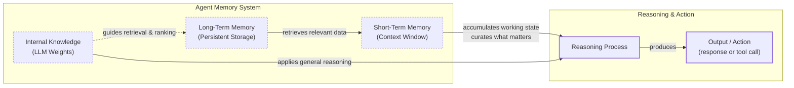
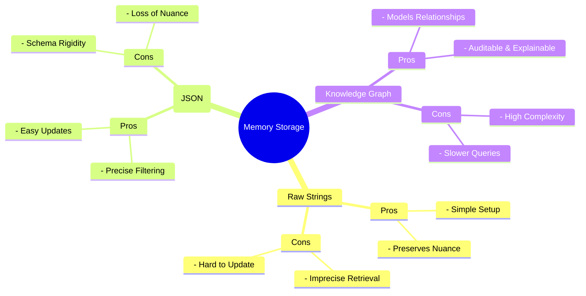

# How Memory for AI Agents Works

## Introduction: Why Agents Need a Memory in the First Place

In our previous lessons, we covered context engineering, structured outputs, and the ReAct framework. Now, we address a core component of advanced agents: memory. An LLM without memory is like an intern with amnesia, unable to recall past conversations or learn from experience. This is because their knowledge is frozen in time; they cannot update their weights after training, a problem known as “continual learning.”

We use the context window as a form of “working memory,” but it is a limited solution due to cost, latency, and the “lost in the middle” problem. While context windows have grown from 8k to over 1 million tokens, reducing the need for aggressive compression, simply stuffing everything into the prompt is not a viable strategy. Memory tools provide a practical workaround, giving agents continuity and the ability to “learn” without retraining. This lesson will explore the layers of agent memory, the different types of long-term storage, and practical ways to implement them [[1]](https://www.decodingai.com/p/how-does-memory-for-ai-agents-work), [[2]](https://arxiv.org/abs/2307.03172), [[8]](https://www.youtube.com/watch?v=7AmhgMAJIT4&list=PLDV8PPvY5K8VlygSJcp3__mhToZMBoiwX&index=112).

## The Layers of Memory: Internal, Short-Term, and Long-Term

To build effective agents, we can borrow terms from cognitive science to categorize memory into three layers based on persistence and proximity to the model.

**Internal Knowledge** is the static, pre-trained knowledge within the LLM’s weights. **Short-Term Memory** is the active context window, acting as volatile RAM for the current task. **Long-Term Memory** is the external, persistent storage for information across sessions.

An agent’s intelligence comes from the dynamic between these layers. Relevant data is retrieved from long-term memory and projected into short-term memory. The LLM then combines this context with its internal knowledge to reason and act. This categorization is critical: internal knowledge provides general reasoning, short-term memory manages the immediate task, and long-term memory enables personalization [[1]](https://www.decodingai.com/p/how-does-memory-for-ai-agents-work), [[3]](https://www.ibm.com/think/topics/ai-agent-memory), [[4]](https://www.linkedin.com/posts/pauliusztin_every-ai-agent-has-4-distinct-memory-layers-activity-7436765234800807936-QyLR).


Image 1: A hierarchy and flow diagram illustrating the three fundamental layers of an agent's memory system and their interaction during a task.

To better understand long-term memory, we can apply more specific cognitive science definitions.

## Long-Term Memory: Semantic, Episodic, and Procedural

Long-term memory consists of three distinct types, each serving a different role in making an agent intelligent [[5]](https://arxiv.org/html/2309.02427), [[6]](https://www.newsletter.swirlai.com/p/memory-in-agent-systems).

**Semantic Memory (Facts & Knowledge)** is the agent’s encyclopedia, storing individual facts like *“The user is a vegetarian.”* For an enterprise agent, this could be internal documents, while a personal assistant uses it to build a user profile with preferences like `{"music": "rock"}`. This provides a reliable source of truth without searching noisy conversation histories [[1]](https://www.decodingai.com/p/how-does-memory-for-ai-agents-work), [[7]](https://machinelearningmastery.com/beyond-short-term-memory-the-3-types-of-long-term-memory-ai-agents-need/).

**Episodic Memory (Experiences & History)** is the agent’s personal diary, recording interactions with a timestamp to capture *“what happened and when.”* While a semantic fact is timeless, an episodic memory provides nuance. For example: *“On Tuesday, the user expressed frustration about their brother, Mark, forgetting their birthday.”* This temporal context allows for more empathetic responses and enables the agent to answer questions like *“What happened last week?”* [[1]](https://www.decodingai.com/p/how-does-memory-for-ai-agents-work), [[8]](https://www.youtube.com/watch?v=7AmhgMAJIT4&list=PLDV8PPvY5K8VlygSJcp3__mhToZMBoiwX&index=112).

**Procedural Memory (Skills & How-To)** is the agent’s muscle memory for multi-step tasks. It is often encoded as reusable tools or action sequences. For instance, a `MonthlyReportIntent` procedure might define the steps: 1) Query sales DB, 2) Summarize findings, 3) Email user. This makes behavior reliable and predictable for common tasks [[1]](https://www.decodingai.com/p/how-does-memory-for-ai-agents-work), [[9]](https://arxiv.org/html/2508.06433v2).

Now that we know what to save, we must decide *how* to store it.

## Storing Memories: Pros and Cons of Different Approaches

How an agent’s memories are stored is an architectural decision that impacts performance, complexity, and scalability. The ideal approach depends on the product's use case. Let's explore the trade-offs of three primary methods [[1]](https://www.decodingai.com/p/how-does-memory-for-ai-agents-work).

**Storing memories as raw strings** is the simplest approach. It is fast to set up and preserves conversational nuance. However, retrieval is often imprecise, and updating facts can create contradictions. For example, a query for "brother's job" might return multiple, conflicting past conversations [[1]](https://www.decodingai.com/p/how-does-memory-for-ai-agents-work).

**Storing memories as entities (JSON-like structures)** offers more precision. It allows for exact filtering and easy updates, making it ideal for user profiles. The trade-offs are the upfront complexity of schema design and the loss of original nuance during the extraction process. For instance, the memory `"user_likes": ["cats"]` is far less rich than the original message, "Petting my cat is the best part of my day" [[10]](https://danielp1.substack.com/p/memex-20-memory-the-missing-piece).

**Storing memories in a knowledge graph** is the most advanced method. It excels at representing complex relationships and temporal changes, offering superior context and auditability. However, this approach has the highest complexity and cost, making it overkill for simpler use cases where graph traversals can be slower than vector lookups [[11]](https://arxiv.org/html/2504.19413).


Image 2: A mind map illustrating the pros and cons of the three primary memory storage approaches.

The choice of storage should be guided by your product’s needs. Start simple and evolve as complexity grows.

## Memory Implementations with Code Examples

While RAG is the mechanism for retrieving information, a topic we will cover in the next lesson, creating high-quality memories is an equally important first step. This process of creation and retrieval is distinct for each memory type. To demonstrate, we will use `mem0`, an open-source memory library that provides a flexible layer for memory management [[11]](https://arxiv.org/html/2504.19413).

<aside>
💡

You can find all the code for this lesson in the accompanying [Jupyter Notebook on GitHub](https://github.com/towardsai/agentic-ai-engineering-course/blob/dev/lessons/09_memory_knowledge_access/notebook.ipynb).

</aside>

### Setup

First, we configure `mem0` to use Gemini for both the LLM and embeddings, with ChromaDB as a local vector store. We also define helper functions to add and search for memories.

1.  We instantiate `mem0` with our configuration.
    ```python
    import os
    from mem0 import Memory
    
    MEM0_CONFIG = {
        "embedder": {
            "provider": "gemini",
            "config": {
                "model": "gemini-embedding-001",
                "embedding_dims": 768,
                "api_key": os.getenv("GOOGLE_API_KEY"),
            },
        },
        "vector_store": {
            "provider": "chroma",
            "config": {
                "collection_name": "lesson9_memories",
                "path": "/tmp/chroma_mem0",
            },
        },
        "llm": {
            "provider": "gemini",
            "config": {
                "model": "gemini-2.5-pro",
                "api_key": os.getenv("GOOGLE_API_KEY"),
            },
        },
    }
    
    memory = Memory.from_config(MEM0_CONFIG)
    MEM_USER_ID = "lesson9_notebook_student"
    memory.delete_all(user_id=MEM_USER_ID)
    ```
    It outputs:
    ```text
    ✅ Mem0 ready (Gemini embeddings + local Chroma).
    ```

### Semantic Memory: Extracting Facts

Semantic memory is created through a deliberate extraction pipeline. After a conversation, the unstructured text is passed to an LLM with a prompt designed to extract factual data.

**Example Extraction Prompt (For a general personal assistant):**
```
Extract persistent facts and strong preferences as short bullet points.
- Keep each fact atomic and context-independent.
- 3–6 bullets max.

Text:
{My brother Mark is a software engineer, but his real passion is painting, he gifted me a painting a few years ago. Its really beautiful.}
```

**Memory Created:**
The system would store: `Mark is the user's brother. Mark is a software engineer. Mark's real passion is painting. The user has a painting from Mark and finds it beautiful.`

1.  We add these extracted facts to our semantic memory.
    ```python
    facts: list[str] = [
        "User's brother is named Mark and is a software engineer.",
    ]
    for f in facts:
        print(mem_add_text(f, category="semantic"))
    ```

2.  Retrieval of semantic memory often uses hybrid search, which combines keyword filtering and semantic relevance. The system first filters for known entities (e.g., "brother") and then performs a vector search to find the most contextually relevant fact.
    ```python
    results = memory.search("brother job", user_id=MEM_USER_ID, limit=1)
    print(results["results"][0]["memory"])
    ```
    It outputs:
    ```text
    User's brother is named Mark and is a software engineer.
    ```

### Episodic Memory: The Log of Events

Episodic memory functions as a chronological log. Memories can be created by having an LLM summarize a day's interactions or by simply logging raw conversation text with a timestamp.

**Example Input:**
`User: "I'm feeling stressed about my project deadline on Friday.", Assistant: "I'm sorry to hear that. I'm here to help you with that."`

**Memory Created (raw):**
`October 26th, 2025. 2:30PM EST: User: "I'm feeling stressed about my project deadline on Friday." Assistant: "I'm sorry to hear that. I'm here to help you with that."`

**Memory Created (summarized):**
`October 26th, 2025. 2:30PM EST User: "The user is stressed about their project deadline on Friday and the assistant offers to help."`

1.  We use a prompt to summarize a dialogue into a single episode.
    ```python
    dialogue = [
        {"role": "user", "content": "I'm stressed about my project deadline on Friday."},
        {"role": "assistant", "content": "I’m here to help—what’s the blocker?"},
    ]
    
    episodic_prompt = f"""Summarize the following turns as one concise 'episode' (1–2 sentences).
    
    {dialogue}
    """
    episode_summary = client.models.generate_content(model=MODEL_ID, contents=episodic_prompt)
    episode = episode_summary.text.strip()
    ```

2.  We save this summary as an episodic memory. Retrieval then blends temporal queries (e.g., "yesterday") with semantic search to find similar past events.
    ```python
    mem_add_text(episode, category="episodic", summarized=True, turns=2)
    ```

### Procedural Memory: Defining and Learning Skills

Procedural memory can be developer-defined (coding a tool) or user-taught. An agent can learn new procedures by converting a user's instructions into a reusable skill.

**Example Prompt:**
```
You are an agent that can learn new skills. When a user provides a numbered list of steps to accomplish a goal, your task is to run the "learn_procedure" tool, and convert these numbered list of steps into a reusable procedure.

User Input: "I want you to book a cabin for this summer. To do that, please remember to: 1. Search for cabins on CabinRentals.com my favorite website. 2. Filter for locations in the mountains, the closer to them, the better. 3. Make sure it's available around July. 4 to 8th. 5. Send me the top 3 options."
```

**Memory Created:**
The LLM would generate a new structured procedure: `procedure_name: find_summer_cabin`, `steps=[...]`.

1.  We define the procedure and add it to memory.
    ```python
    procedure_name = "find_summer_cabin"
    steps = [
        "Search for cabins on CabinRentals.com.",
        "Filter for locations in the mountains.",
        "Check availability for user-specified dates.",
        "Send the top 3 options to the user.",
    ]
    procedure_text = f"Procedure: {procedure_name}\nSteps:\n" + "\n".join(f"{i + 1}. {s}" for i, s in enumerate(steps))
    
    mem_add_text(procedure_text, category="procedure", procedure_name=procedure_name)
    ```

2.  Retrieval is an intent-matching process. When the user later says, "Let's find a summer cabin again," the agent recognizes the intent and executes the learned procedure.

## Real-World Lessons: Challenges and Best Practices

Moving from theory to a production-ready system requires navigating complex trade-offs that are constantly evolving with technology.

**Re-evaluating compression.** Just a few years ago, LLMs operated with small context windows (e.g., 8,000 tokens), forcing engineers to be ruthless with compression. This process of summarizing interactions was necessary but inherently lossy. Today, with models offering million-token context windows at a fraction of the cost, the best practice is to lean towards less compression. The raw conversational history is the ultimate source of truth, containing emotional subtext that extraction often discards. Design your system to work with the most complete history that is economically and technically feasible [[8]](https://www.youtube.com/watch?v=7AmhgMAJIT4&list=PLDV8PPvY5K8VlygSJcp3__mhToZMBoiwX&index=112).

**Designing for the product.** There is no "perfect" memory architecture. The concepts of semantic, episodic, and procedural memory are a toolkit, not a mandatory blueprint. A common failure is over-engineering a complex system for a product that does not need it. The product's goal should dictate the memory architecture. For a Q&A bot, a simple RAG pipeline is a good start. For a personal companion, rich episodic memories are essential. For a task-automation agent, procedural memory is key [[7]](https://machinelearningmastery.com/beyond-short-term-memory-the-3-types-of-long-term-memory-ai-agents-need/).

**The Human Factor.** Memory exists to make the agent smarter, not to give the user a new job. A common pitfall is exposing the internal workings of the memory system, thinking it improves transparency. In practice, it often creates significant cognitive overhead. Users should not be asked to "garden their agent's memories." This breaks the illusion of a capable assistant and turns the interaction into a tedious data-entry task. Memory management should be an autonomous function of the agent. It should learn from corrections within the natural flow of conversation and have internal processes to consolidate and resolve conflicting information [[8]](https://www.youtube.com/watch?v=7AmhgMAJIT4&list=PLDV8PPvY5K8VlygSJcp3__mhToZMBoiwX&index=112), [[12]](https://towardsdatascience.com/a-practical-guide-to-memory-for-autonomous-llm-agents/).

## Conclusion

Memory is the component that transforms a stateless chatbot into a personalized agent. It is the current engineering solution to the problem of continual learning, allowing agents to "learn" and adapt over time by constantly engineering the context window. While this is a temporary solution until models can truly learn by updating their weights, it is a powerful one that works today. By understanding the different layers and types of memory, you can architect systems that are more capable, reliable, and intelligent.

This lesson has provided a framework for thinking about and implementing memory. In our next lesson, we will dive deeper into Retrieval-Augmented Generation (RAG), the core mechanism for pulling information from long-term memory. We will also explore multimodal processing for handling complex data types like images and documents. Further down the line, we will cover essential production topics like monitoring and evaluation to ensure your agents perform reliably in the real world.

## References

- [1] How Does Memory for AI Agents Work? (https://www.decodingai.com/p/how-does-memory-for-ai-agents-work)
- [2] Lost in the Middle: How Language Models Use Long Contexts (https://arxiv.org/abs/2307.03172)
- [3] What is AI agent memory? (https://www.ibm.com/think/topics/ai-agent-memory)
- [4] Every AI agent has 4 distinct memory layers (https://www.linkedin.com/posts/pauliusztin_every-ai-agent-has-4-distinct-memory-layers-activity-7436765234800807936-QyLR)
- [5] Cognitive Architectures for Language Agents (https://arxiv.org/html/2309.02427)
- [6] Memory in Agent Systems (https://www.newsletter.swirlai.com/p/memory-in-agent-systems)
- [7] Beyond Short-term Memory: The 3 Types of Long-term Memory AI Agents Need (https://machinelearningmastery.com/beyond-short-term-memory-the-3-types-of-long-term-memory-ai-agents-need/)
- [8] What is the perfect memory architecture? (https://www.youtube.com/watch?v=7AmhgMAJIT4&list=PLDV8PPvY5K8VlygSJcp3__mhToZMBoiwX&index=112)
- [9] Mem^p: A Framework for Procedural Memory in Agents (https://arxiv.org/html/2508.06433v2)
- [10] Memex 2.0: Memory The Missing Piece for Real Intelligence (https://danielp1.substack.com/p/memex-20-memory-the-missing-piece)
- [11] Mem0: Building Production-Ready AI Agents with Scalable Long-Term Memory (https://arxiv.org/html/2504.19413)
- [12] A Practical Guide to Memory for Autonomous LLM Agents (https://towardsdatascience.com/a-practical-guide-to-memory-for-autonomous-llm-agents/)