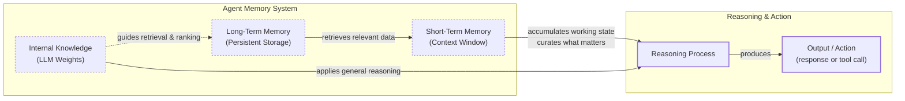

# How Memory for AI Agents Works

In the last eight lessons, we built a foundation in AI Engineering. We've covered the landscape of AI agents, contrasted them with LLM workflows, and learned the art of context engineering. We also explored structured outputs, tool use, and the ReAct framework for planning and reasoning. Now, we tackle one of the most critical components for building advanced agents: memory.

A year ago at ZTRON, my team jumped straight into building a complex Retrieval-Augmented Generation (RAG) system for our agent. We thought more data was always better. The result was a slow, expensive, and unreliable system. We later realized that for our specific use case, smart data selection and context engineering were far more effective than a massive retrieval pipeline. This taught me a crucial lesson: the challenge isn't just about accessing information, but about architecting a memory system that fits your actual needs.

LLMs have a fundamental limitation: their knowledge is vast but frozen in time. They are unable to learn by updating their weights after training, a problem known as “continual learning” [[1]](https://www.decodingai.com/p/how-does-memory-for-ai-agents-work). An LLM without memory is like an intern with amnesia. They might be brilliant, but they cannot recall previous conversations or learn from experience. We use the context window as a form of “working memory,” but this is a limited solution. Keeping an entire conversation in context is often unrealistic due to rising costs, latency, and the “lost in the middle” problem, where models ignore information buried in long prompts [[1]](https://www.decodingai.com/p/how-does-memory-for-ai-agents-work), [[2]](https://arxiv.org/abs/2307.03172).

Memory tools provide a practical workaround, giving agents continuity and the ability to “learn” without retraining. While context windows are growing, the principles of memory management remain essential. To build agents that remember and adapt, we can borrow concepts from biology and cognitive science to structure how they store and retrieve information.

## The Layers of Memory: Internal, Short-Term, and Long-Term

To build effective agents, we must distinguish between where information lives. Using terms from cognitive science helps us engineer these layers. There are three distinct memory types based on their persistence and proximity to the model’s reasoning core [[1]](https://www.decodingai.com/p/how-does-memory-for-ai-agents-work), [[3]](https://www.ibm.com/think/topics/ai-agent-memory).

**Internal Knowledge** is the static, pre-trained information baked into the LLM’s weights. This is where general world knowledge resides, but it is read-only and does not update after training.

**Short-Term Memory** is the active context window. It acts as the agent's RAM—volatile, fast, and the only reality the model sees during a single inference call.

**Long-Term Memory** is the external, persistent storage system (like a disk) where an agent saves and retrieves information across sessions.

The intelligence of an agent emerges from the dynamic between these layers. Information from long-term memory is retrieved and projected into short-term memory. The LLM then uses this curated context, combined with its internal knowledge, to reason and act [[4]](https://www.linkedin.com/posts/pauliusztin_every-ai-agent-has-4-distinct-memory-layers-activity-7436765234800807936-QyLR).


Image 1: A hierarchy and flow diagram illustrating the three fundamental layers of an agent's memory system and their interaction during a task.

This categorization is critical for engineering. Internal knowledge handles general reasoning, short-term memory manages the immediate task, and long-term memory provides personalization and continuity. To better understand long-term memory, we can apply more specific cognitive science definitions.

## Long-Term Memory: Semantic, Episodic, and Procedural

Long-term memory is not a single bucket of text. It consists of three distinct types, each serving a different role in making an agent "intelligent" [[5]](https://arxiv.org/html/2309.02427), [[6]](https://www.newsletter.swirlai.com/p/memory-in-agent-systems).

**Semantic Memory (Facts & Knowledge)** is the agent’s encyclopedia. It stores individual pieces of knowledge or “facts,” such as *“The user is a vegetarian,”* or structured attributes like `{"food_restrictions": "vegetarian"}`. For an enterprise agent, this might be internal company documents. For a personal assistant, it builds a persistent user profile, recalling preferences like `{"music": "rock"}` or constraints like `{"dog": "George"}`. This allows the agent to retrieve reliable facts without searching through a noisy conversation history [[1]](https://www.decodingai.com/p/how-does-memory-for-ai-agents-work), [[7]](https://machinelearningmastery.com/beyond-short-term-memory-the-3-types-of-long-term-memory-ai-agents-need/).

**Episodic Memory (Experiences & History)** is the agent’s personal diary. It records past interactions with a timestamp, capturing *“what happened and when.”* A semantic fact might be *“User is frustrated with his brother.”* An episodic memory would be: *“On Tuesday, the user expressed frustration that their brother, Mark, always forgets their birthday. I provided an empathetic response. [created_at=2025-08-25].”* This "episode" provides nuanced context that allows for more empathetic future interactions and enables the agent to answer questions like *“What happened last week?”* [[1]](https://www.decodingai.com/p/how-does-memory-for-ai-agents-work), [[8]](https://www.youtube.com/watch?v=7AmhgMAJIT4&list=PLDV8PPvY5K8VlygSJcp3__mhToZMBoiwX&index=112).

**Procedural Memory (Skills & How-To)** is the agent’s muscle memory. It consists of skills, learned workflows, and “how-to” knowledge. This is often encoded in the agent’s system prompt as reusable tools or defined sequences. For example, an agent might store a `MonthlyReportIntent` procedure. When a user asks for a report, the agent retrieves this procedure: 1) Query sales DB, 2) Summarize findings, 3) Email user. This makes behavior reliable and predictable, encoding successful workflows so the agent does not have to reason from scratch every time [[1]](https://www.decodingai.com/p/how-does-memory-for-ai-agents-work), [[9]](https://arxiv.org/html/2508.06433v2).

Now that we know what to save, we must decide *how* to store it.

## Storing Memories: Pros and Cons of Different Approaches

How an agent’s memories are stored is an architectural decision that impacts performance, complexity, and scalability. There is no one-size-fits-all solution; the choice depends on your product's needs. Let's explore three primary methods [[1]](https://www.decodingai.com/p/how-does-memory-for-ai-agents-work).

**Storing memories as raw strings** is the simplest method. Conversational turns or documents are stored as plain text and indexed for vector search.
*   **Pros:** It is simple and fast to set up, requiring minimal engineering. It also preserves nuance, capturing emotional tone and linguistic cues without loss in translation.
*   **Cons:** Retrieval is often imprecise. A query like “What is my brother’s job?” might retrieve every conversation mentioning “brother” and “job” without pinpointing the current fact. Updating is difficult; if a user corrects a fact (“My brother is now a doctor”), the new string just adds to the log, creating potential contradictions. It also lacks structure, making it hard to distinguish state changes over time (e.g., “Barry *was* CEO” vs. “Claude *is* CEO”).

**Storing memories as entities (JSON-like structures)** involves using an LLM to transform interactions into structured formats.
*   **Pros:** It allows for precise, field-level filtering (e.g., `“user”: {”brother”: {”job”: “Software Engineer”}}`), so the agent can retrieve specific facts without ambiguity. Updates are easier, as you simply overwrite the relevant field. This is ideal for semantic memory like user profiles.
*   **Cons:** It requires upfront schema design and can be rigid. If the agent encounters information that does not fit the schema, that data might be lost [[10]](https://danielp1.substack.com/p/memex-20-memory-the-missing-piece). The extraction process can also strip away the rich subtext of the original conversation.

**Storing memories in a knowledge graph** is the most advanced approach, representing memories as a network of nodes (entities) and edges (relationships).
*   **Pros:** It excels at representing complex relationships (e.g., `(User) -> [HAS_BROTHER] -> (Mark)`). It offers superior contextual and temporal awareness by modeling time as a property of a relationship (e.g., `[RECOMMENDED_ON_DATE]`). Retrieval is also auditable, building trust by tracing the reasoning path.
*   **Cons:** It has the highest complexity and cost. Converting unstructured text into graph triples is difficult, and graph traversals can be slower than vector lookups. For simple use cases, it is often overkill [[11]](https://arxiv.org/html/2504.19413).

The choice should be guided by your product’s needs. Start simple and evolve as complexity grows.

| Storage Method | Pros | Cons | Best For |
| :--- | :--- | :--- | :--- |
| **Raw Strings** | Simple, fast, preserves nuance | Imprecise retrieval, hard to update, lacks structure | Quick prototypes, applications where conversational tone is key |
| **Entities (JSON)** | Precise retrieval, easy updates, structured | Schema rigidity, loss of nuance, upfront complexity | Semantic memory, user profiles, factual data |
| **Knowledge Graph** | Models complex relationships, temporal awareness, auditable | Highest complexity, slower queries, potential overkill | Advanced reasoning, applications requiring explainability and complex connections |

Table 1: A comparison of the three primary methods for storing agent memories.

Now that we know what to save and how to store it, let's look at some code examples using the `mem0` library.

## Memory Implementations with Code Examples

While RAG is the mechanism for retrieving information, creating high-quality memories is an equally important first step. To demonstrate this, we will use `mem0`, an open-source memory library, to implement our three long-term memory types.

<aside>
💡

You can find all the code for this lesson in the accompanying [Jupyter Notebook on GitHub](https://github.com/towardsai/agentic-ai-engineering-course/blob/dev/lessons/09_memory_knowledge_access/notebook.ipynb).

</aside>

### Setup

First, we configure `mem0` to use Gemini for both the LLM and embeddings, with ChromaDB as a local vector store. We also define two helper functions: `mem_add_text` to save memories with a specific category and `mem_search` to retrieve them.

1.  We instantiate `mem0` with our configuration.
    ```python
    import os
    from mem0 import Memory
    
    MEM0_CONFIG = {
        "embedder": {
            "provider": "gemini",
            "config": {
                "model": "gemini-embedding-001",
                "embedding_dims": 768,
                "api_key": os.getenv("GOOGLE_API_KEY"),
            },
        },
        "vector_store": {
            "provider": "chroma",
            "config": {
                "collection_name": "lesson9_memories",
                "path": "/tmp/chroma_mem0",
            },
        },
        "llm": {
            "provider": "gemini",
            "config": {
                "model": "gemini-2.5-pro",
                "api_key": os.getenv("GOOGLE_API_KEY"),
            },
        },
    }
    
    memory = Memory.from_config(MEM0_CONFIG)
    MEM_USER_ID = "lesson9_notebook_student"
    memory.delete_all(user_id=MEM_USER_ID)
    ```
    It outputs:
    ```text
    ✅ Mem0 ready (Gemini embeddings + local Chroma).
    ```

2.  We define our helper functions for adding and searching memories.
    ```python
    from typing import Optional

    def mem_add_text(text: str, category: str = "semantic", **meta) -> str:
        """Add a single text memory. No LLM is used for extraction or summarization."""
        metadata = {"category": category}
        for k, v in meta.items():
            if isinstance(v, (str, int, float, bool)) or v is None:
                metadata[k] = v
            else:
                metadata[k] = str(v)
        memory.add(text, user_id=MEM_USER_ID, metadata=metadata, infer=False)
        return f"Saved {category} memory."
    
    
    def mem_search(query: str, limit: int = 5, category: Optional[str] = None) -> list[dict]:
        """
        Category-aware search wrapper.
        Returns the full result dicts so we can inspect metadata.
        """
        res = memory.search(query, user_id=MEM_USER_ID, limit=limit) or {}
    
        items = res.get("results", [])
        if category is not None:
            items = [r for r in items if (r.get("metadata") or {}).get("category") == category]
        return items
    ```

### Semantic Memory: Extracting Facts

Semantic memory is created through an extraction pipeline. We will add a few facts as atomic strings and then retrieve them.

1.  We add four facts to our semantic memory.
    ```python
    facts: list[str] = [
        "User prefers vegetarian meals.",
        "User has a dog named George.",
        "User is allergic to gluten.",
        "User's brother is named Mark and is a software engineer.",
    ]
    for f in facts:
        print(mem_add_text(f, category="semantic"))
    ```
    It outputs:
    ```text
    Saved semantic memory.
    Saved semantic memory.
    Saved semantic memory.
    Saved semantic memory.
    ```

2.  We can now search for a specific fact.
    ```python
    results = memory.search("brother job", user_id=MEM_USER_ID, limit=1)
    print(results["results"][0]["memory"])
    ```
    It outputs:
    ```text
    User's brother is named Mark and is a software engineer.
    ```

### Episodic Memory: The Log of Events

Episodic memories function as a chronological log. Here, we will compress a short dialogue into a single "episode" summary and store it.

1.  We define a short dialogue and use an LLM to summarize it.
    ```python
    from google import genai
    
    client = genai.Client()
    MODEL_ID = "gemini-2.5-pro"

    dialogue = [
        {"role": "user", "content": "I'm stressed about my project deadline on Friday."},
        {"role": "assistant", "content": "I’m here to help—what’s the blocker?"},
        {"role": "user", "content": "Mainly testing. I also prefer working at night."},
        {"role": "assistant", "content": "Okay, we can split testing into two sessions."},
    ]
    
    episodic_prompt = f"""Summarize the following 3–4 turns as one concise 'episode' (1–2 sentences).
    Keep salient details and tone.
    
    {dialogue}
    """
    episode_summary = client.models.generate_content(model=MODEL_ID, contents=episodic_prompt)
    episode = episode_summary.text.strip()
    ```

2.  We save this summary as an episodic memory with additional metadata.
    ```python
    print(
        mem_add_text(
            episode,
            category="episodic",
            summarized=True,
            turns=4,
        )
    )
    ```
    It outputs:
    ```text
    Saved episodic memory.
    ```

3.  We can search for this "experience" later.
    ```python
    hits = mem_search("deadline stress", limit=1, category="episodic")
    for h in hits:
        print(f"{h['memory']}\n")
        print(h)
    ```
    It outputs:
    ```text
    A user, stressed about a Friday project deadline because of testing and a preference for working at night, is advised to split the testing work into two manageable sessions.
    
    {'id': '...', 'memory': '...', 'hash': '...', 'metadata': {'turns': 4, 'summarized': True, 'category': 'episodic'}, 'score': 0.91..., 'created_at': '...', 'updated_at': None, 'user_id': 'lesson9_notebook_student', 'role': 'user'}
    ```

### Procedural Memory: Defining and Learning Skills

Procedural memory can be defined by developers or learned from user interactions. Here, we will define a simple procedure and store it.

1.  We define a procedure with a name and steps.
    ```python
    procedure_name = "monthly_report"
    steps = [
        "Query sales DB for the last 30 days.",
        "Summarize top 5 insights.",
        "Ask user whether to email or display.",
    ]
    procedure_text = f"Procedure: {procedure_name}\nSteps:\n" + "\n".join(f"{i + 1}. {s}" for i, s in enumerate(steps))
    
    mem_add_text(procedure_text, category="procedure", procedure_name=procedure_name)
    ```
    It outputs:
    ```text
    Saved procedure memory.
    ```

2.  We can retrieve the procedure by intent.
    ```python
    results = mem_search("how to create a monthly report", category="procedure", limit=1)
    if results:
        print(results[0]["memory"])
    ```
    It outputs:
    ```text
    Procedure: monthly_report
    Steps:
    1. Query sales DB for the last 30 days.
    2. Summarize top 5 insights.
    3. Ask user whether to email or display.
    ```

We have seen how to implement different memory types. Now, let's discuss some additional considerations for building a memory system.

## Real-World Lessons: Challenges and Best Practices

Moving from theory to a production-ready system requires navigating complex trade-offs that are constantly evolving. Here are some important lessons learned from building agent memory systems in the real world.

**Re-evaluating compression.** A few years ago, LLMs operated with small context windows of 8k or 16k tokens, forcing engineers to be ruthless with compression. This process of summarizing interactions into compact facts was necessary but inherently lossy. Today, with models offering million-token context windows, the best practice is to lean towards less compression. The raw conversational history is the ultimate source of truth, containing emotional subtext and relational dynamics that extraction often discards. For a personalized agent, "User mentioned that walking their dog George is the best part of their day" is far more valuable than the simple fact "User has a dog named George." Design your system to work with the most complete history that is economically and technically feasible [[8]](https://www.youtube.com/watch?v=7AmhgMAJIT4&list=PLDV8PPvY5K8VlygSJcp3__mhToZMBoiwX&index=112).

**Designing for the product.** There is no "perfect" memory architecture. The concepts of semantic, episodic, and procedural memory are a toolkit, not a mandatory blueprint. A common failure is over-engineering a complex system for a product that does not need it. The product's goal should dictate the memory architecture. For a Q&A bot over internal documents, a simple RAG pipeline is the best starting point. For a long-term personal AI companion, rich episodic memories are essential. For a task-automation agent, procedural memory is key to recalling and executing multi-step workflows reliably [[7]](https://machinelearningmastery.com/beyond-short-term-memory-the-3-types-of-long-term-memory-ai-agents-need/).

**The human factor.** Memory exists to make the agent smarter, not to give the user a new job. Exposing memory internals to the user, thinking it will improve transparency, often creates significant cognitive overhead. Users should not be asked to "garden their agent's memories" [[8]](https://www.youtube.com/watch?v=7AmhgMAJIT4&list=PLDV8PPvY5K8VlygSJcp3__mhToZMBoiwX&index=112). This breaks the illusion of a capable assistant and turns the interaction into a data-entry task. Memory management should be an autonomous function. The agent should learn from corrections within the natural flow of conversation and have internal processes to consolidate and resolve conflicting information [[12]](https://towardsdatascience.com/a-practical-guide-to-memory-for-autonomous-llm-agents/).

## Conclusion

Memory is the component that transforms a stateless chatbot into a personalized agent. It is the current engineering solution to the problem of continual learning, allowing agents to "learn" and adapt over time by constantly engineering the context window. While this is a temporary solution until models can truly learn by updating their weights, it is a powerful one that works today.

This lesson has provided a framework for thinking about and implementing memory. In our next lesson, we will dive deeper into Retrieval-Augmented Generation (RAG), the core mechanism for pulling information from long-term memory. We will also explore multimodal processing, monitoring, and evaluation as we continue our journey to building production-ready AI systems.

## References

- [1] Iusztin, P. (2025, December 2). How Does Memory for AI Agents Work? Decoding AI Magazine. https://www.decodingai.com/p/how-does-memory-for-ai-agents-work
- [2] Liu, N. F., Lin, K., Hewitt, J., Paranjape, A., Bevilacqua, M., Petroni, F., & Liang, P. (2023). Lost in the Middle: How Language Models Use Long Contexts. arXiv preprint arXiv:2307.03172. https://arxiv.org/abs/2307.03172
- [3] What is AI agent memory? (n.d.). IBM. https://www.ibm.com/think/topics/ai-agent-memory
- [4] Iusztin, P. (2024, October 22). Every AI agent has 4 distinct memory layers. LinkedIn. https://www.linkedin.com/posts/pauliusztin\_every-ai-agent-has-4-distinct-memory-layers-activity-7436765234800807936-QyLR
- [5] Sumers, T. R., Yao, S., Narasimhan, K., & Griffiths, T. L. (2023). Cognitive Architectures for Language Agents. arXiv. https://arxiv.org/html/2309.02427
- [6] Griciūnas, A. (2024, October 30). Memory in Agent Systems. SwirlAI Newsletter. https://www.newsletter.swirlai.com/p/memory-in-agent-systems
- [7] Chugani, J. (2025, December). Beyond Short-term Memory: The 3 Types of Long-term Memory AI Agents Need. Machine Learning Mastery. https://machinelearningmastery.com/beyond-short-term-memory-the-3-types-of-long-term-memory-ai-agents-need/
- [8] Whitmore, S. (2025, June 18). What is the perfect memory architecture? [Video]. YouTube. https://www.youtube.com/watch?v=7AmhgMAJIT4&list=PLDV8PPvY5K8VlygSJcp3__mhToZMBoiwX&index=112
- [9] Mem^p: A Framework for Procedural Memory in Agents. (n.d.). arXiv. https://arxiv.org/html/2508.06433v2
- [10] Chalef, D. (2024, June 25). Memex 2.0: Memory The Missing Piece for Real Intelligence. Substack. https://danielp1.substack.com/p/memex-20-memory-the-missing-piece
- [11] Chhikara, P. (2025). Mem0: Building Production-Ready AI Agents with Scalable Long-Term Memory. arXiv. https://arxiv.org/html/2504.19413
- [12] Lawson, N. (2026, April 17). A Practical Guide to Memory for Autonomous LLM Agents. Towards Data Science. https://towardsdatascience.com/a-practical-guide-to-memory-for-autonomous-llm-agents/