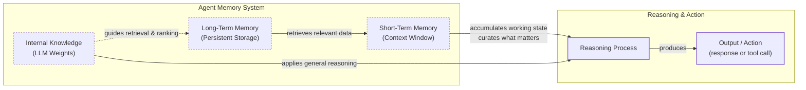
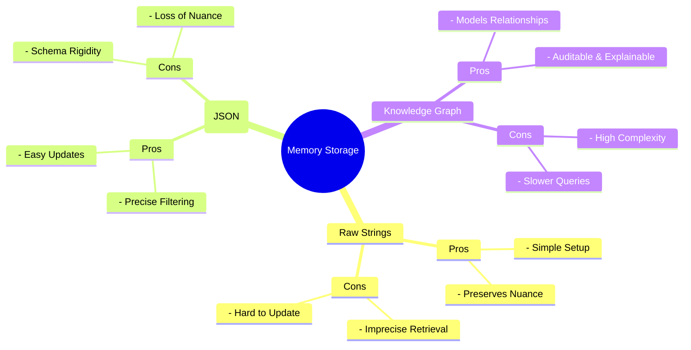

# How Memory for AI Agents Works

In the last eight lessons, we built a foundation in AI Engineering, covering the agent landscape, context engineering, structured outputs, tool use, and the ReAct framework. Now, we tackle one of the most important components for building advanced agents: memory.

At ZTRON, we once built a complex Retrieval-Augmented Generation (RAG) system, assuming more data was always better. The result was slow and expensive. We learned that smart data selection was more effective than a massive retrieval pipeline. This experience taught us that the challenge is not just accessing information, but architecting a memory system that fits your needs.

LLMs have a fundamental limitation: their knowledge is vast but frozen in time. They are unable to learn by updating their weights after training, a problem known as “continual learning.” An LLM without memory is like an intern with amnesia; it cannot recall previous conversations or learn from experience. We use the context window as a form of “working memory,” but this is a limited solution due to cost, latency, and the “lost in the middle” problem, where models ignore information buried in long prompts. Memory tools provide a practical workaround, giving agents continuity and the ability to “learn” without retraining [[1]](https://www.decodingai.com/p/how-does-memory-for-ai-agents-work), [[2]](https://arxiv.org/abs/2307.03172).

## The Layers of Memory: Internal, Short-Term, and Long-Term

To build effective agents, we must distinguish between where information lives. Using terms from cognitive science helps us engineer these layers. There are three distinct memory types based on their persistence and proximity to the model’s reasoning core [[1]](https://www.decodingai.com/p/how-does-memory-for-ai-agents-work), [[3]](https://www.ibm.com/think/topics/ai-agent-memory).

**Internal Knowledge** is the static, pre-trained information baked into the LLM’s weights. This is where general world knowledge resides, but it is read-only.

**Short-Term Memory** is the active context window. It acts as the agent's RAM. It is volatile, fast, and the only reality the model sees during a single inference call.

**Long-Term Memory** is the external, persistent storage system where an agent saves and retrieves information across sessions.

The intelligence of an agent emerges from the dynamic between these layers. Information from long-term memory is retrieved and projected into short-term memory. The LLM then uses this curated context, combined with its internal knowledge, to reason and act [[4]](https://www.linkedin.com/posts/pauliusztin_every-ai-agent-has-4-distinct-memory-layers-activity-7436765234800807936-QyLR).


Image 1: A hierarchy and flow diagram illustrating the three fundamental layers of an agent's memory system and their interaction during a task.

This categorization is essential for engineering. Internal knowledge handles general reasoning, short-term memory manages the immediate task, and long-term memory provides personalization. To better understand long-term memory, we can apply more specific cognitive science definitions.

## Long-Term Memory: Semantic, Episodic, and Procedural

Long-term memory consists of three distinct types, each serving a different role in making an agent "intelligent" [[5]](https://arxiv.org/html/2309.02427), [[6]](https://www.newsletter.swirlai.com/p/memory-in-agent-systems).

**Semantic Memory (Facts & Knowledge)** is the agent’s encyclopedia. It stores individual pieces of knowledge or “facts,” such as *“The user is a vegetarian.”* For an enterprise agent, this might be internal company documents. For a personal assistant, it builds a user profile, recalling preferences like `{"music": "rock"}`. This allows the agent to retrieve reliable facts without searching a noisy conversation history [[1]](https://www.decodingai.com/p/how-does-memory-for-ai-agents-work), [[7]](https://machinelearningmastery.com/beyond-short-term-memory-the-3-types-of-long-term-memory-ai-agents-need/).

**Episodic Memory (Experiences & History)** is the agent’s personal diary. It records past interactions with a timestamp, capturing *“what happened and when.”* A semantic fact might be *“User is frustrated with his brother.”* An episodic memory would be: *“On Tuesday, the user expressed frustration that their brother, Mark, always forgets their birthday. I provided an empathetic response. [created_at=2025-08-25].”* This provides nuanced context for more empathetic future interactions and lets the agent answer questions like *“What happened last week?”* [[1]](https://www.decodingai.com/p/how-does-memory-for-ai-agents-work), [[8]](https://www.youtube.com/watch?v=7AmhgMAJIT4&list=PLDV8PPvY5K8VlygSJcp3__mhToZMBoiwX&index=112).

**Procedural Memory (Skills & How-To)** is the agent’s muscle memory. It consists of skills and learned workflows. This is often encoded as reusable tools or defined action sequences. For example, an agent might have a `MonthlyReportIntent` procedure: 1) Query sales DB, 2) Summarize findings, 3) Email user. This makes behavior reliable and predictable, as the agent does not have to reason from scratch for common tasks [[1]](https://www.decodingai.com/p/how-does-memory-for-ai-agents-work), [[9]](https://arxiv.org/html/2508.06433v2).

Now that we know what to save, we must decide *how* to store it.

## Storing Memories: Pros and Cons of Different Approaches

How an agent’s memories are stored is an architectural decision that impacts performance, complexity, and scalability. There is no one-size-fits-all solution. Let's explore the pros and cons of three primary methods [[1]](https://www.decodingai.com/p/how-does-memory-for-ai-agents-work).

**Storing memories as raw strings** is the simplest method, where text is stored and indexed for vector search. It is fast to set up and preserves conversational nuance. However, retrieval can be imprecise. A query like “What is my brother’s job?” might retrieve every conversation mentioning “brother” and “job” without pinpointing the current fact. Updating facts is also difficult, as new information just adds to the log, creating potential contradictions.

**Storing memories as entities (JSON-like structures)** uses an LLM to transform interactions into structured formats. This allows for precise, field-level filtering and easy updates, making it ideal for semantic memory like user profiles. The downsides are the upfront complexity of schema design and potential rigidity. Information that does not fit the schema might be lost, and the extraction process can strip away the original conversational subtext [[10]](https://danielp1.substack.com/p/memex-20-memory-the-missing-piece).

**Storing memories in a knowledge graph** is the most advanced approach, representing memories as a network of nodes and edges. It excels at modeling complex relationships and temporal changes, and its transparent retrieval paths are auditable. However, it has the highest complexity and cost. Converting unstructured text into graph triples is difficult, and complex queries can be slower than simple vector lookups, making it overkill for many use cases [[11]](https://arxiv.org/html/2504.19413).


Image 2: A mind map illustrating the pros and cons of the three primary memory storage approaches.

A key part of managing memory is handling updates and conflicts. Memory management should be an autonomous function of the agent. It should learn from corrections within the natural flow of conversation, not by asking the user to manually edit its knowledge base.

## Memory Implementations with Code Examples

While RAG is the mechanism for retrieving information, creating high-quality memories is an equally important first step. We will use `mem0`, an open-source memory library, to demonstrate how to implement our three long-term memory types. `mem0` provides a flexible layer for memory management that can be integrated with different vector stores and LLMs.

<aside>
💡

You can find all the code for this lesson in the accompanying [Jupyter Notebook on GitHub](https://github.com/towardsai/agentic-ai-engineering-course/blob/dev/lessons/09_memory_knowledge_access/notebook.ipynb).

</aside>

### Setup

First, we configure `mem0` to use Gemini for both the LLM and embeddings, with ChromaDB as a local vector store. We also define helper functions to add and search for memories.

1.  We instantiate `mem0` with our configuration.
    ```python
    import os
    from mem0 import Memory
    
    MEM0_CONFIG = {
        "embedder": {
            "provider": "gemini",
            "config": {
                "model": "gemini-embedding-001",
                "embedding_dims": 768,
                "api_key": os.getenv("GOOGLE_API_KEY"),
            },
        },
        "vector_store": {
            "provider": "chroma",
            "config": {
                "collection_name": "lesson9_memories",
                "path": "/tmp/chroma_mem0",
            },
        },
        "llm": {
            "provider": "gemini",
            "config": {
                "model": "gemini-2.5-pro",
                "api_key": os.getenv("GOOGLE_API_KEY"),
            },
        },
    }
    
    memory = Memory.from_config(MEM0_CONFIG)
    MEM_USER_ID = "lesson9_notebook_student"
    memory.delete_all(user_id=MEM_USER_ID)
    ```
    It outputs:
    ```text
    ✅ Mem0 ready (Gemini embeddings + local Chroma).
    ```

### Semantic Memory: Extracting Facts

Semantic memory is created through an extraction pipeline. An LLM processes unstructured text with a prompt designed to pull out specific facts.

1.  We use a prompt to extract facts from a user message.
    ```
    Extract persistent facts and strong preferences as short bullet points.
    - Keep each fact atomic and context-independent.
    - 3–6 bullets max.

    Text:
    {My brother Mark is a software engineer, but his real passion is painting.}
    ```
    The LLM would extract facts like: `User's brother is named Mark.`, `Mark is a software engineer.`, and `Mark's passion is painting.`

2.  We then add these extracted facts to our semantic memory.
    ```python
    facts: list[str] = [
        "User's brother is named Mark and is a software engineer.",
    ]
    for f in facts:
        print(mem_add_text(f, category="semantic"))
    ```

3.  Retrieval combines keyword filtering with semantic search to find the most relevant fact.
    ```python
    results = memory.search("brother job", user_id=MEM_USER_ID, limit=1)
    print(results["results"][0]["memory"])
    ```
    It outputs:
    ```text
    User's brother is named Mark and is a software engineer.
    ```

### Episodic Memory: The Log of Events

Episodic memories are chronological logs. An LLM can read a conversation and summarize the key events, which are then stored with a timestamp.

1.  We use a prompt to summarize a dialogue into a single episode.
    ```python
    dialogue = [
        {"role": "user", "content": "I'm stressed about my project deadline on Friday."},
        {"role": "assistant", "content": "I’m here to help—what’s the blocker?"},
    ]
    
    episodic_prompt = f"""Summarize the following turns as one concise 'episode' (1–2 sentences).
    
    {dialogue}
    """
    episode_summary = client.models.generate_content(model=MODEL_ID, contents=episodic_prompt)
    episode = episode_summary.text.strip()
    ```
    The summary becomes the memory: `A user, stressed about a Friday project deadline, is offered help by the assistant.`

2.  We save this summary as an episodic memory.
    ```python
    mem_add_text(episode, category="episodic", summarized=True, turns=2)
    ```

3.  Retrieval often blends temporal queries (e.g., "yesterday") with semantic search to find contextually similar past events.

### Procedural Memory: Defining and Learning Skills

Procedural memory can be defined by a developer or learned from a user. An agent can be prompted to convert a user's instructions into a reusable procedure.

1.  A user provides steps for a task.
    ```
    User Input: "To book a cabin: 1. Search on CabinRentals.com. 2. Filter for mountain locations. 3. Check availability for July 4-8. 4. Send me the top 3 options."
    ```

2.  The agent uses a tool to learn this procedure.
    ```python
    procedure_name = "find_summer_cabin"
    steps = [
        "Search for cabins on CabinRentals.com.",
        "Filter for locations in the mountains.",
        "Check availability for user-specified dates.",
        "Send the top 3 options to the user.",
    ]
    procedure_text = f"Procedure: {procedure_name}\nSteps:\n" + "\n".join(f"{i + 1}. {s}" for i, s in enumerate(steps))
    
    mem_add_text(procedure_text, category="procedure", procedure_name=procedure_name)
    ```

3.  Retrieval is an intent-matching process. When the user later says, "Let's find a summer cabin again," the agent recognizes the intent and executes the learned procedure.

## Real-World Lessons: Challenges and Best Practices

Moving from theory to a production-ready system requires navigating complex trade-offs that are constantly evolving with technology.

**Re-evaluating compression.** Just a few years ago, LLMs had small context windows (8k or 16k tokens), forcing engineers to be ruthless with compression. This process of summarizing interactions was necessary but inherently lossy, stripping away fine details and nuance.

Today, with models offering million-token context windows at a fraction of the cost, the best practice is to lean towards less compression. The raw, unstructured conversational history is the ultimate source of truth. It contains the emotional subtext and relational dynamics that extraction often discards. Design your system to work with the most complete history that is economically and technically feasible [[8]](https://www.youtube.com/watch?v=7AmhgMAJIT4&list=PLDV8PPvY5K8VlygSJcp3__mhToZMBoiwX&index=112).

**Designing for the product.** There is no "perfect" memory architecture. The concepts of semantic, episodic, and procedural memory are a toolkit, not a mandatory blueprint. A common failure is over-engineering a complex system for a product that does not need it. The product's goal should dictate the memory architecture.

For a Q&A bot over internal documents, a simple RAG pipeline is the best starting point. For a long-term personal AI companion, rich episodic memories are essential. For a task-automation agent, procedural memory is key to executing multi-step workflows reliably [[7]](https://machinelearningmastery.com/beyond-short-term-memory-the-3-types-of-long-term-memory-ai-agents-need/).

## Conclusion

Memory is the component that transforms a stateless chatbot into a personalized agent. It is the current engineering solution to the problem of continual learning, allowing agents to "learn" and adapt over time by constantly engineering the context window. While this is a temporary solution until models can truly learn by updating their weights, it is a powerful one that works today. By understanding the different layers and types of memory, you can architect systems that are more capable, reliable, and intelligent.

This lesson has provided a framework for thinking about and implementing memory. In our next lesson, we will dive deeper into Retrieval-Augmented Generation (RAG), the core mechanism for pulling information from long-term memory. We will also explore multimodal processing for handling complex data types like images and documents. Further down the line, we will cover essential production topics like monitoring and evaluation to ensure your agents perform reliably in the real world.

## References

- [1] Iusztin, P. (2025, December 2). How Does Memory for AI Agents Work? Decoding AI Magazine. https://www.decodingai.com/p/how-does-memory-for-ai-agents-work
- [2] Liu, N. F., Lin, K., Hewitt, J., Paranjape, A., Bevilacqua, M., Petroni, F., & Liang, P. (2023). Lost in the Middle: How Language Models Use Long Contexts. arXiv preprint arXiv:2307.03172. https://arxiv.org/abs/2307.03172
- [3] What is AI agent memory? (n.d.). IBM. https://www.ibm.com/think/topics/ai-agent-memory
- [4] Iusztin, P. (2024, October 22). Every AI agent has 4 distinct memory layers. LinkedIn. https://www.linkedin.com/posts/pauliusztin\_every-ai-agent-has-4-distinct-memory-layers-activity-7436765234800807936-QyLR
- [5] Sumers, T. R., Yao, S., Narasimhan, K., & Griffiths, T. L. (2023). Cognitive Architectures for Language Agents. arXiv. https://arxiv.org/html/2309.02427
- [6] Griciūnas, A. (2024, October 30). Memory in Agent Systems. SwirlAI Newsletter. https://www.newsletter.swirlai.com/p/memory-in-agent-systems
- [7] Chugani, J. (2025, December). Beyond Short-term Memory: The 3 Types of Long-term Memory AI Agents Need. Machine Learning Mastery. https://machinelearningmastery.com/beyond-short-term-memory-the-3-types-of-long-term-memory-ai-agents-need/
- [8] Whitmore, S. (2025, June 18). What is the perfect memory architecture? [Video]. YouTube. https://www.youtube.com/watch?v=7AmhgMAJIT4&list=PLDV8PPvY5K8VlygSJcp3__mhToZMBoiwX&index=112
- [9] Mem^p: A Framework for Procedural Memory in Agents. (n.d.). arXiv. https://arxiv.org/html/2508.06433v2
- [10] Chalef, D. (2024, June 25). Memex 2.0: Memory The Missing Piece for Real Intelligence. Substack. https://danielp1.substack.com/p/memex-20-memory-the-missing-piece
- [11] Chhikara, P. (2025). Mem0: Building Production-Ready AI Agents with Scalable Long-Term Memory. arXiv. https://arxiv.org/html/2504.19413
- [12] Lawson, N. (2026, April 17). A Practical Guide to Memory for Autonomous LLM Agents. Towards Data Science. https://towardsdatascience.com/a-practical-guide-to-memory-for-autonomous-llm-agents/