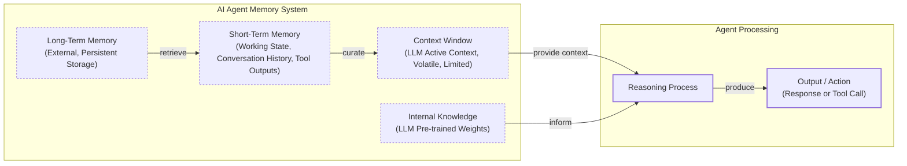
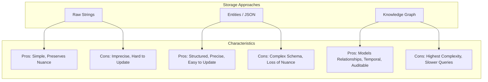

# How Does Memory for AI Agents Work?

In our previous lessons, we built a ReAct agent from scratch, giving our AI the ability to reason and use tools. We have explored the agent landscape, the difference between workflows and agents, and the art of context engineering. Now, we will address a core aspect of agent design: giving them a memory.

LLMs are stateless; their knowledge is vast but frozen in time, and they are fundamentally unable to update their weights after training, a problem known as “continual learning”. [[1]](https://arxiv.org/html/2510.17281v2) We use the context window as a form of “working memory,” but this is a limited solution due to its finite size, cost, and the “lost in the middle” problem. [[2]](https://arxiv.org/abs/2307.03172)

While context windows are increasing, the principles of organizing memory remain essential for performance. Memory tools are the current engineering solution, providing agents with continuity, adaptability, and the ability to “learn” without retraining. In this article, we will explore the layers of memory every agent needs, the different types of long-term memory, and the trade-offs in how we store it, complete with code examples and best practices.

## The Layers of Memory: Internal, Short-Term, and Long-Term

To build effective agents, we can borrow terms from cognitive science to categorize memory into distinct layers based on persistence and proximity to the model's core. [[3]](https://arxiv.org/html/2309.02427)

First, there is the **Internal Knowledge** baked into the LLM’s weights. This is the static, pre-trained information that provides general intelligence. Next is **Short-Term Memory**, which is the RAM of the agentic system. It holds the active context window, recent interactions, and retrieved data. It is volatile and fast, simulating learning during a session. [[4]](https://www.ibm.com/think/topics/ai-agent-memory) Finally, **Long-Term Memory** is the external, persistent storage where an agent saves and retrieves information, providing the personalization and continuity that the other layers lack. [[5]](https://decodingml.substack.com/p/memory-the-secret-sauce-of-ai-agents)

The dynamic between these layers creates the agent’s intelligence. This process often involves Retrieval-Augmented Generation (RAG), where relevant information is retrieved from long-term memory and brought into short-term memory. This curated context, combined with the LLM's internal knowledge, is then used to generate an output.



Image 1: A flowchart illustrating the hierarchical layers of an AI agent's memory system and the flow of information between them.

## Long-Term Memory: Semantic, Episodic, and Procedural

Long-term memory is not a single bucket of text. It consists of three distinct types, each serving a different role in making an agent “intelligent”. [[3]](https://arxiv.org/html/2309.02427), [[6]](https://www.newsletter.swirlai.com/p/memory-in-agent-systems)

The first type is **Semantic Memory**, which acts as the agent’s encyclopedia. It stores individual pieces of knowledge or “facts,” such as *“The user is a vegetarian,”* or structured attributes like `{"food_restrictions": "vegetarian"}`. For an enterprise agent, this might be internal company documents, while for a personal assistant, it builds a persistent user profile with preferences like `{"music": "User likes rock music"}`. This allows the agent to retrieve reliable facts without searching through a noisy conversation history.

Next is **Episodic Memory**, the agent’s personal diary. It records past interactions with a timestamp, capturing *“what happened and when.”* A semantic fact might be *“User is frustrated with his brother.”* An episodic memory would be more nuanced: *“On Tuesday, the user expressed frustration that their brother, Mark, always forgets their birthday. I provided an empathetic response. [created_at=2025-08-25].”* This allows the agent to interact with more empathy and answer questions like *“What happened last week?”*. [[7]](https://www.youtube.com/watch?v=7AmhgMAJIT4&list=PLDV8PPvY5K8VlygSJcp3__mhToZMBoiwX&index=112)

Finally, **Procedural Memory** is the agent’s muscle memory. It consists of skills and learned workflows. This is often baked into the agent’s system prompt as a reusable tool or a defined sequence of actions. For example, an agent might have a `MonthlyReportIntent` procedure that outlines the steps: 1) Query sales DB, 2) Summarize findings, 3) Email user. This makes the agent's behavior on common tasks reliable and predictable. [[8]](https://arxiv.org/html/2508.06433v2)

Now that we know what to save, we must decide *how* to store it.

## Storing Memories: Pros and Cons of Different Approaches

The way an agent’s memories are stored is an architectural decision that impacts performance, complexity, and scalability. There is no one-size-fits-all solution. Let's explore the three primary methods.



Image 2: A diagram visualizing the pros and cons of the three primary memory storage approaches.

**Storing memories as raw strings** is the simplest method. Conversational turns are stored as plain text and indexed for vector search. It is fast to set up and preserves nuance, but retrieval can be imprecise. A query like “What is my brother’s job?” might retrieve every conversation mentioning “brother” and “job” without pinpointing the current fact. Updating is also difficult, as new information just adds to the log, creating potential contradictions.

**Storing memories as entities (JSON-like structures)** uses an LLM to transform interactions into structured formats. This allows for precise, field-level filtering (e.g., `“user”: {”brother”: {”job”: “Software Engineer”}}`) and easy updates. However, it requires upfront schema design, which can be rigid, and the extraction process can strip away the rich subtext of the original conversation. [[9]](https://danielp1.substack.com/p/memex-20-memory-the-missing-piece)

**Storing memories in a knowledge graph** is the most advanced approach, representing information as a network of nodes and edges. This excels at modeling complex relationships and temporal changes (e.g., `(User) -> [HAS_BROTHER] -> (Mark)`). [[10]](https://www.octoco.ai/blog/knowledge-graphs-as-memory) Retrieval is auditable, but this method has the highest complexity and cost, making it overkill for simple use cases. [[11]](https://arxiv.org/html/2504.19413)

Memory management should be an autonomous function of the agent. It should learn from corrections within the natural flow of conversation. The agent, not the user, is responsible for maintaining the integrity of its own knowledge. Now that we understand the theoretical approaches to storage, let's look at how to implement these memory types with code.

## Memory Implementations with Code Examples

Let's look at how to implement these memory types with code. We will use `mem0`, an open-source memory library, to demonstrate how an agent can create and retrieve semantic, episodic, and procedural memories. While Retrieval-Augmented Generation (RAG) is the mechanism for retrieving information, which we will cover in the next lesson, creating high-quality memories is an equally important first step.

### Setup

`mem0` is a library that helps manage different types of memory for AI agents. We will configure it to use Gemini for both the LLM (for summarization and fact extraction) and embeddings, with a local ChromaDB vector store.

1.  First, we configure `mem0` to use our Gemini models for its LLM and embedding capabilities, and a local ChromaDB instance for storage.

    ```python
    import os
    from mem0 import Memory
    
    MEM0_CONFIG = {
        "embedder": {
            "provider": "gemini",
            "config": {
                "model": "gemini-embedding-001",
                "embedding_dims": 768,
                "api_key": os.getenv("GOOGLE_API_KEY"),
            },
        },
        "vector_store": {
            "provider": "chroma",
            "config": {
                "collection_name": "lesson9_memories",
                "path": "/tmp/chroma_mem0",
            },
        },
        "llm": {
            "provider": "gemini",
            "config": {
                "model": "gemini-1.5-flash",
                "api_key": os.getenv("GOOGLE_API_KEY"),
            },
        },
    }
    
    memory = Memory.from_config(MEM0_CONFIG)
    MEM_USER_ID = "lesson9_notebook_student"
    memory.delete_all(user_id=MEM_USER_ID)
    ```

    It outputs:

    ```text
    ✅ Mem0 ready (Gemini embeddings + local Chroma).
    ```

2.  Next, we define helper functions to add text to memory with a specific category and to search for memories, with an option to filter by that category.

    ```python
    from typing import Optional
    
    def mem_add_text(text: str, category: str = "semantic", **meta) -> str:
        """Add a single text memory. No LLM is used for extraction or summarization."""
        metadata = {"category": category}
        for k, v in meta.items():
            if isinstance(v, (str, int, float, bool)) or v is None:
                metadata[k] = v
            else:
                metadata[k] = str(v)
        memory.add(text, user_id=MEM_USER_ID, metadata=metadata, infer=False)
        return f"Saved {category} memory."
    
    
    def mem_search(query: str, limit: int = 5, category: Optional[str] = None) -> list[dict]:
        """
        Category-aware search wrapper.
        Returns the full result dicts so we can inspect metadata.
        """
        res = memory.search(query, user_id=MEM_USER_ID, limit=limit) or {}
    
        items = res.get("results", [])
        if category is not None:
            items = [r for r in items if (r.get("metadata") or {}).get("category") == category]
        return items
    ```

### Semantic Memory: Extracting Facts

Semantic memory is created through a deliberate extraction pipeline. After a conversation, the unstructured text is passed to an LLM with a prompt designed to extract factual data. This process turns messy conversation threads into a queryable knowledge base. The prompt instructs the model to act as a knowledge extractor, identifying key facts and user preferences. For a personal assistant, this might look like:

```
Extract persistent facts and strong preferences as short bullet points.
- Keep each fact atomic and context-independent.
- 3–6 bullets max.

Text:
{My brother Mark is a software engineer, but his real passion is painting.}
```

The system would then store facts like: `Mark is the user's brother. Mark is a software engineer. Mark's real passion is painting.`. Retrieval often uses hybrid search, which we will cover in the next lesson. It combines keyword filtering with semantic search to find the most relevant fact.

1.  We insert a few example facts as atomic strings.

    ```python
    facts: list[str] = [
        "User prefers vegetarian meals.",
        "User has a dog named George.",
        "User is allergic to gluten.",
        "User's brother is named Mark and is a software engineer.",
    ]
    for f in facts:
        print(mem_add_text(f, category="semantic"))
    ```

    It outputs:

    ```text
    Saved semantic memory.
    Saved semantic memory.
    Saved semantic memory.
    Saved semantic memory.
    ```

2.  We can now search for this specific semantic information using a natural language query.

    ```python
    results = memory.search("brother job", user_id=MEM_USER_ID, limit=1)
    print(results["results"][0]["memory"])
    ```

    It outputs:

    ```text
    User's brother is named Mark and is a software engineer.
    ```

### Episodic Memory: The Log of Events

Episodic memories function as a chronological log. They are created by having an LLM read conversation messages and summarize the key events, which are then stored with a timestamp. These memories can be stored raw or summarized. For example, after a user expresses stress about a deadline, the agent can create a summarized memory of the event.

1.  We define a short dialogue and ask the LLM to summarize it into a concise "episode."

    ```python
    from google import genai
    
    client = genai.Client()
    MODEL_ID = "gemini-1.5-pro"
    
    dialogue = [
        {"role": "user", "content": "I'm stressed about my project deadline on Friday."},
        {"role": "assistant", "content": "I’m here to help—what’s the blocker?"},
        {"role": "user", "content": "Mainly testing. I also prefer working at night."},
        {"role": "assistant", "content": "Okay, we can split testing into two sessions."},
    ]
    
    episodic_prompt = f"""Summarize the following 3–4 turns as one concise 'episode' (1–2 sentences).
    Keep salient details and tone.
    
    {dialogue}
    """
    episode_summary = client.models.generate_content(model=MODEL_ID, contents=episodic_prompt)
    episode = episode_summary.text.strip()
    ```

2.  We save this summary as an episodic memory with additional metadata.

    ```python
    print(
        mem_add_text(
            episode,
            category="episodic",
            summarized=True,
            turns=4,
        )
    )
    ```

    It outputs:

    ```text
    Saved episodic memory.
    ```

3.  Later, we can search for this "experience" and retrieve the episode.

    ```python
    hits = mem_search("deadline stress", limit=1, category="episodic")
    for h in hits:
        print(f"{h['memory']}\n")
    ```

    It outputs:

    ```text
    A user, stressed about a Friday project deadline because of testing and a preference for working at night, is advised to split the testing work into two manageable sessions.
    ```

### Procedural Memory: Defining and Learning Skills

Procedural memory can be defined by a developer or learned from user interactions. A developer can explicitly code a tool, or an agent can learn a new procedure from a user's instructions. The agent can then save this sequence as a new, callable procedure.

1.  We define a procedure as a text block containing ordered steps and save it to memory.

    ```python
    procedure_name = "monthly_report"
    steps = [
        "Query sales DB for the last 30 days.",
        "Summarize top 5 insights.",
        "Ask user whether to email or display.",
    ]
    procedure_text = f"Procedure: {procedure_name}\nSteps:\n" + "\n".join(f"{i + 1}. {s}" for i, s in enumerate(steps))
    
    mem_add_text(procedure_text, category="procedure", procedure_name=procedure_name)
    ```

    It outputs:

    ```text
    Saved procedure memory.
    ```

2.  When the user’s intent matches the procedure, we can retrieve and "execute" it.

    ```python
    results = mem_search("how to create a monthly report", category="procedure", limit=1)
    if results:
        print(results[0]["memory"])
    ```

    It outputs:

    ```text
    Procedure: monthly_report
    Steps:
    1. Query sales DB for the last 30 days.
    2. Summarize top 5 insights.
    3. Ask user whether to email or display.
    ```

Now that we have seen how to implement different memory types, let's discuss some additional considerations for building a memory system.

## Real-World Lessons: Challenges and Best Practices

Moving from theory to a reliable, production-ready system requires navigating complex trade-offs that are constantly evolving. Here are some important lessons learned from building and scaling agent memory systems.

One of the biggest changes in designing memory has been the trade-off between compressing information and preserving its raw detail. Just two years ago, LLMs operated with small context windows (e.g., 8,000 tokens), forcing us to be ruthless with compression. Today, with models offering million-token contexts at a fraction of the cost, the best practice is to lean towards less compression. The raw, unstructured conversational history is the ultimate source of truth. While a fact might state, "User has a dog named George," the raw log reveals, "User mentioned that walking their dog George is the best part of their day," a far more valuable piece of information for a personalized agent.

Another critical principle is designing for the product. There is no "perfect" memory architecture. The most common failure mode is over-engineering a complex system for a product that does not need it. Start from first principles by defining the core function of your agent. For a Q&A bot over internal documents, a simple Retrieval-Augmented Generation (RAG) pipeline is a great start. For a long-term personal AI companion, rich episodic memories are beneficial. For a task-automation agent, procedural memory is likely most useful. The product's goal should dictate the memory architecture, not the other way around.

Finally, consider the human factor. Memory exists to make the agent smarter, not to give the user a new job. A common pitfall is exposing the internal workings of the memory system. In practice, this often creates cognitive overhead. Users should not be asked to "garden their agent's memories". [[7]](https://www.youtube.com/watch?v=7AmhgMAJIT4&list=PLDV8PPvY5K8VlygSJcp3__mhToZMBoiwX&index=112) Memory management should be an autonomous function. The agent should learn from corrections within the natural flow of conversation and have internal processes to consolidate and resolve conflicting information.

## Conclusion

Memory is the component that transforms a stateless chat application into a personalized agent. It is the current engineering solution to the problem of continual learning, allowing agents to “learn” and adapt over time by engineering their context window. While memory tools are a temporary solution, they are a powerful and practical approach that works today.

In our next lesson, we will explore Retrieval-Augmented Generation (RAG) in more detail, the mechanism that allows agents to retrieve information from their long-term memory. Looking further ahead in the course, we will cover multimodal processing for documents and images. We will then build a research agent and a writing agent, preparing them for production with robust monitoring and evaluation pipelines. As we move to multi-agent systems, challenges like managing shared memories and resolving conflicting information emerge as active areas of research. [[12]](https://christophermeiklejohn.com/ai/agents/mas-series/2026/05/01/mas-series-08-open-questions.html)

## References

- [1] Wang, L., Zhang, X., Su, H., & Zhu, J. (2025). A Comprehensive Survey of Continual Learning. arXiv. [https://arxiv.org/html/2510.17281v2](https://arxiv.org/html/2510.17281v2)
- [2] Liu, N. F., Lin, K., Hewitt, J., Paranjape, A., Bevilacqua, M., Petroni, F., & Liang, P. (2023). Lost in the Middle: How Language Models Use Long Contexts. arXiv. [https://arxiv.org/abs/2307.03172](https://arxiv.org/abs/2307.03172)
- [3] Sumers, T. R., Yao, S., Narasimhan, K., & Griffiths, T. L. (2023). Cognitive Architectures for Language Agents. arXiv. [https://arxiv.org/html/2309.02427](https://arxiv.org/html/2309.02427)
- [4] What is AI agent memory?. (n.d.). IBM. [https://www.ibm.com/think/topics/ai-agent-memory](https://www.ibm.com/think/topics/ai-agent-memory)
- [5] Iusztin, P. (2024, May 21). Memory: The secret sauce of AI agents. Decoding AI Magazine. [https://decodingml.substack.com/p/memory-the-secret-sauce-of-ai-agents](https://decodingml.substack.com/p/memory-the-secret-sauce-of-ai-agents)
- [6] Griciūnas, A. (2024, October 30). Memory in Agent Systems. SwirlAI Newsletter. [https://www.newsletter.swirlai.com/p/memory-in-agent-systems](https://www.newsletter.swirlai.com/p/memory-in-agent-systems)
- [7] Whitmore, S. (2025, June 18). What is the perfect memory architecture?. YouTube. [https://www.youtube.com/watch?v=7AmhgMAJIT4&list=PLDV8PPvY5K8VlygSJcp3__mhToZMBoiwX&index=112](https://www.youtube.com/watch?v=7AmhgMAJIT4&list=PLDV8PPvY5K8VlygSJcp3__mhToZMBoiwX&index=112)
- [8] Mem^p: A Framework for Procedural Memory in Agents. (n.d.). arXiv. [https://arxiv.org/html/2508.06433v2](https://arxiv.org/html/2508.06433v2)
- [9] Chalef, D. (2024, June 25). Memex 2.0: Memory The Missing Piece for Real Intelligence. Substack. [https://danielp1.substack.com/p/memex-20-memory-the-missing-piece](https://danielp1.substack.com/p/memex-20-memory-the-missing-piece)
- [10] Lintvelt, H. (n.d.). Knowledge Graphs as Memory. OctoCo. [https://www.octoco.ai/blog/knowledge-graphs-as-memory](https://www.octoco.ai/blog/knowledge-graphs-as-memory)
- [11] Chhikara, P. (2025). Mem0: Building Production-Ready AI Agents with Scalable Long-Term Memory. arXiv. [https://arxiv.org/html/2504.19413](https://arxiv.org/html/2504.19413)
- [12] Meiklejohn, C. (2026, May 1). MAS Series 08: Open Questions. [https://christophermeiklejohn.com/ai/agents/mas-series/2026/05/01/mas-series-08-open-questions.html](https://christophermeiklejohn.com/ai/agents/mas-series/2026/05/01/mas-series-08-open-questions.html)