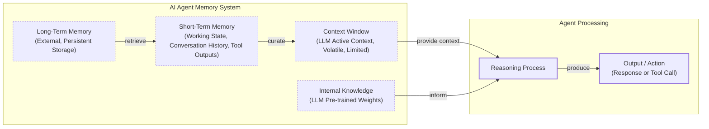

# How Does Memory for AI Agents Work?

In our previous lessons, we built a ReAct agent from scratch, giving our AI the ability to reason and use tools. We have explored the agent landscape, the difference between workflows and agents, and the art of context engineering. Now, we will tackle a fundamental challenge: giving our agents a memory.

An LLM without memory is like an intern with amnesia. They might be brilliant, but they cannot recall previous conversations or learn from experience. This is because LLMs are stateless; their knowledge is vast but frozen in time, and they are fundamentally unable to update their weights after training—a problem known as “continual learning” [[1]](https://arxiv.org/html/2510.17281v2). To overcome this, we use the context window as a form of “working memory.” However, keeping an entire conversation thread plus additional information in the context is often unrealistic. Rising costs per turn and the “lost in the middle” problem—where models struggle to use information buried in a long prompt—limit this approach [[2]](https://arxiv.org/abs/2307.03172).

As context windows increase, our engineering strategies must adapt. When working with 8k or 16k token limits, we were forced to engineer complex compression systems. Today, models with million-token contexts give us more breathing room, but the principles of organizing memory remain essential for performance, cost, and reliability. Memory tools are the current engineering solution. They provide agents with continuity, adaptability, and the ability to “learn” without retraining.

In this article, we will explore:

- The layers of memory every AI agent needs.
- A detailed look at long-term memory: Semantic, Episodic, and Procedural.
- The trade-offs between storing memories as strings, entities, or knowledge graphs.
- How to implement these memory types with code examples.
- Real-world challenges and best practices for designing memory systems.

## The Layers of Memory: Internal, Short-Term, and Long-Term

To build effective agents, we categorize memory into layers, borrowing terms from cognitive science [[3]](https://arxiv.org/html/2309.02427). There are three distinct layers of memory based on their persistence and proximity to the model’s core. This architecture is inspired by neuroscience, where the brain consolidates memories from a temporary buffer (the hippocampus) into long-term storage (the neocortex) during sleep [[4]](https://dev.to/joojodontoh/teaching-alfred-to-remember-with-a-neuroscience-inspired-memory-system-for-ai-agents-2o5l).

**Internal Knowledge** is the static, pre-trained information baked into the LLM’s weights. It is the best place to store general world knowledge—models know about entire books without needing them in the context window. However, this memory is frozen at the time of training.

**Short-Term Memory** is the RAM of the entire agentic system. It contains the active context window plus recent interactions, conversation history, and details retrieved from long-term memory. We slice this short-term memory to create the context window for a single inference step. It is volatile and fast, simulating the feeling of “learning” during a session [[5]](https://www.ibm.com/think/topics/ai-agent-memory). The context window is the only “reality” the model sees during inference.

**Long-Term Memory** is the external, persistent storage system (like a disk) where an agent saves and retrieves information. This layer provides the personalization and context that internal knowledge lacks and short-term memory cannot retain [[6]](https://decodingml.substack.com/p/memory-the-secret-sauce-of-ai-agents).

The dynamic between these layers creates the agent’s intelligence. Information is retrieved from long-term memory and brought into short-term memory. This retrieval pipeline might query different memory types in parallel. Next, we slice the short-term memory into an active context window through context engineering. Finally, the LLM uses its internal knowledge plus the active context to generate output.



Image 1: A flowchart illustrating the hierarchical layers of an AI agent's memory system and the flow of information between them.

Categorizing memory this way is critical for engineering. Internal knowledge handles general reasoning, short-term memory manages the immediate task, and long-term memory handles personalization and continuity. To better understand long-term memory, we can further apply cognitive science definitions to specific data types.

## Long-Term Memory: Semantic, Episodic, and Procedural

Long-term memory is not a single bucket of text. It consists of three distinct types, each serving a different role in making an agent “intelligent” [[3]](https://arxiv.org/html/2309.02427), [[7]](https://www.newsletter.swirlai.com/p/memory-in-agent-systems).

**Semantic Memory** is the agent’s encyclopedia. It stores individual pieces of knowledge or “facts.” These can be independent strings, such as *“The user is a vegetarian,”* or structured attributes attached to an entity, like `{"food_restrictions": "vegetarian"}`. For an enterprise agent, this might involve storing internal company documents. For a personal assistant, semantic memory builds a persistent user profile, recalling preferences like `{"music": "User likes rock music"}` or constraints like `{"dog": "User has a dog named George"}`. This allows the agent to retrieve relevant facts without searching through a noisy conversation history.

**Episodic Memory** is the agent’s personal diary. It records past interactions with a timestamp, capturing *“what happened and when.”* This memory type is essential for maintaining conversational context. A semantic fact might be *“User is frustrated with his brother.”* An episodic memory would be: *“On Tuesday, the user expressed frustration that their brother, Mark, always forgets their birthday. I provided an empathetic response. [created_at=2025-08-25].”* This “episode” provides nuanced context. If the topic comes up again, the agent can say, “I know the topic of your brother’s birthday can be sensitive.” It also allows the agent to answer questions like *“What happened last week?”* [[8]](https://www.youtube.com/watch?v=7AmhgMAJIT4&list=PLDV8PPvY5K8VlygSJcp3__mhToZMBoiwX&index=112).

**Procedural Memory** is the agent’s muscle memory. It consists of skills, learned workflows, and “how-to” knowledge. This memory is often baked into the agent’s system prompt as reusable tools or defined sequences. For example, an agent might store a `MonthlyReportIntent` procedure. When a user asks for a report, the agent retrieves this procedure: 1) Query sales DB, 2) Summarize findings, 3) Email user. This makes behavior reliable and predictable, encoding successful workflows so the agent does not have to reason from scratch every time [[9]](https://arxiv.org/html/2508.06433v2).

Now that we know what to save, we must decide *how* to store it.

## Storing Memories: Pros and Cons of Different Approaches

Memory storage is an architectural decision impacting performance and scalability. There is no single best solution, so let's explore three primary methods.

**Storing memories as raw strings** is the simplest method. Conversational turns or documents are stored as plain text and indexed for vector search. It is simple to set up and preserves nuance, capturing emotional tone without loss in translation. However, retrieval is often imprecise. A query like “What is my brother’s job?” might retrieve every conversation mentioning “brother” and “job” without pinpointing the current fact. Updating is also difficult; if a user corrects a fact (“My brother is now a doctor”), the new string just adds to the log, creating potential contradictions.

**Storing memories as entities (JSON-like structures)** involves using an LLM to transform interactions into structured formats like JSON. This allows for precise, field-level filtering (e.g., `“user”: {”brother”: {”job”: “Software Engineer”}}`), and updates are easier since you just overwrite the relevant field. This is ideal for semantic memory like user profiles. The downsides are the upfront schema design complexity and potential rigidity. If the agent encounters information that does not fit the schema, that data might be lost [[10]](https://danielp1.substack.com/p/memex-20-memory-the-missing-piece). Also, the extraction process can strip away the rich subtext of the original conversation. The factual memory `"user_likes": ["cats"]` is far less representative than the original message, "Petting my cat is the best part of my day."

**Storing memories in a knowledge graph** is the most advanced approach. Memories are stored as a network of nodes (entities) and edges (relationships). This excels at representing complex relationships (e.g., `(User) -> [HAS_BROTHER] -> (Mark)`). This structure enables multi-hop reasoning that is difficult for standard RAG, allowing the agent to answer complex queries by traversing multiple explicit connections in the graph [[11]](https://www.octoco.ai/blog/knowledge-graphs-as-memory). It also offers superior contextual and temporal awareness and auditable retrieval. However, this method has the highest complexity and cost. Converting unstructured text into graph triples is difficult, and graph traversals can be slower than vector lookups, making it overkill for simple use cases [[12]](https://arxiv.org/html/2504.19413).

The choice should be guided by your product’s needs. Start simple and evolve as complexity grows.

## Memory Implementations with Code Examples

Let's look at how to implement these memory types with code. We will use `mem0`, an open-source memory library, to demonstrate how an agent can create and retrieve semantic, episodic, and procedural memories. While Retrieval-Augmented Generation (RAG) is the mechanism for retrieving information, which we will cover in the next lesson, creating high-quality memories is an equally important first step.

### Setup

`mem0` is a library that helps manage different types of memory for AI agents. We will configure it to use Gemini for both the LLM (for summarization and fact extraction) and embeddings, with a local ChromaDB vector store.

1.  First, we configure `mem0` to use our Gemini models for its LLM and embedding capabilities, and a local ChromaDB instance for storage.

    ```python
    import os
    from mem0 import Memory
    
    MEM0_CONFIG = {
        "embedder": {
            "provider": "gemini",
            "config": {
                "model": "gemini-embedding-001",
                "embedding_dims": 768,
                "api_key": os.getenv("GOOGLE_API_KEY"),
            },
        },
        "vector_store": {
            "provider": "chroma",
            "config": {
                "collection_name": "lesson9_memories",
                "path": "/tmp/chroma_mem0",
            },
        },
        "llm": {
            "provider": "gemini",
            "config": {
                "model": "gemini-1.5-flash",
                "api_key": os.getenv("GOOGLE_API_KEY"),
            },
        },
    }
    
    memory = Memory.from_config(MEM0_CONFIG)
    MEM_USER_ID = "lesson9_notebook_student"
    memory.delete_all(user_id=MEM_USER_ID)
    ```

    It outputs:

    ```text
    ✅ Mem0 ready (Gemini embeddings + local Chroma).
    ```

2.  Next, we define helper functions to add text to memory with a specific category and to search for memories, with an option to filter by that category.

    ```python
    from typing import Optional
    
    def mem_add_text(text: str, category: str = "semantic", **meta) -> str:
        """Add a single text memory. No LLM is used for extraction or summarization."""
        metadata = {"category": category}
        for k, v in meta.items():
            if isinstance(v, (str, int, float, bool)) or v is None:
                metadata[k] = v
            else:
                metadata[k] = str(v)
        memory.add(text, user_id=MEM_USER_ID, metadata=metadata, infer=False)
        return f"Saved {category} memory."
    
    
    def mem_search(query: str, limit: int = 5, category: Optional[str] = None) -> list[dict]:
        """
        Category-aware search wrapper.
        Returns the full result dicts so we can inspect metadata.
        """
        res = memory.search(query, user_id=MEM_USER_ID, limit=limit) or {}
    
        items = res.get("results", [])
        if category is not None:
            items = [r for r in items if (r.get("metadata") or {}).get("category") == category]
        return items
    ```

### Semantic Memory: Extracting Facts

Semantic memory is created through an extraction pipeline. An LLM can be prompted to pull out key facts from a conversation, turning unstructured text into a queryable knowledge base.

1.  We insert a few example facts as atomic strings.

    ```python
    facts: list[str] = [
        "User prefers vegetarian meals.",
        "User has a dog named George.",
        "User is allergic to gluten.",
        "User's brother is named Mark and is a software engineer.",
    ]
    for f in facts:
        print(mem_add_text(f, category="semantic"))
    ```

    It outputs:

    ```text
    Saved semantic memory.
    Saved semantic memory.
    Saved semantic memory.
    Saved semantic memory.
    ```

2.  We can now search for this specific semantic information using a natural language query.

    ```python
    results = memory.search("brother job", user_id=MEM_USER_ID, limit=1)
    print(results["results"][0]["memory"])
    ```

    It outputs:

    ```text
    User's brother is named Mark and is a software engineer.
    ```

### Episodic Memory: The Log of Events

Episodic memories function as a chronological log. An LLM can read a conversation and summarize the key events, which are then stored with a timestamp.

1.  We define a short dialogue and ask the LLM to summarize it into a concise "episode."

    ```python
    from google import genai
    
    client = genai.Client()
    MODEL_ID = "gemini-1.5-pro"
    
    dialogue = [
        {"role": "user", "content": "I'm stressed about my project deadline on Friday."},
        {"role": "assistant", "content": "I’m here to help—what’s the blocker?"},
        {"role": "user", "content": "Mainly testing. I also prefer working at night."},
        {"role": "assistant", "content": "Okay, we can split testing into two sessions."},
    ]
    
    episodic_prompt = f"""Summarize the following 3–4 turns as one concise 'episode' (1–2 sentences).
    Keep salient details and tone.
    
    {dialogue}
    """
    episode_summary = client.models.generate_content(model=MODEL_ID, contents=episodic_prompt)
    episode = episode_summary.text.strip()
    ```

2.  We save this summary as an episodic memory with additional metadata.

    ```python
    print(
        mem_add_text(
            episode,
            category="episodic",
            summarized=True,
            turns=4,
        )
    )
    ```

    It outputs:

    ```text
    Saved episodic memory.
    ```

3.  Later, we can search for this "experience" and retrieve the episode.

    ```python
    hits = mem_search("deadline stress", limit=1, category="episodic")
    for h in hits:
        print(f"{h['memory']}\n")
    ```

    It outputs:

    ```text
    A user, stressed about a Friday project deadline because of testing and a preference for working at night, is advised to split the testing work into two manageable sessions.
    ```

### Procedural Memory: Defining and Learning Skills

Procedural memory can be defined by a developer or learned from user interactions. Here, we will define a procedure and store it for later retrieval.

1.  We define a procedure as a text block containing ordered steps and save it to memory.

    ```python
    procedure_name = "monthly_report"
    steps = [
        "Query sales DB for the last 30 days.",
        "Summarize top 5 insights.",
        "Ask user whether to email or display.",
    ]
    procedure_text = f"Procedure: {procedure_name}\nSteps:\n" + "\n".join(f"{i + 1}. {s}" for i, s in enumerate(steps))
    
    mem_add_text(procedure_text, category="procedure", procedure_name=procedure_name)
    ```

    It outputs:

    ```text
    Saved procedure memory.
    ```

2.  When the user’s intent matches the procedure, we can retrieve and "execute" it.

    ```python
    results = mem_search("how to create a monthly report", category="procedure", limit=1)
    if results:
        print(results[0]["memory"])
    ```

    It outputs:

    ```text
    Procedure: monthly_report
    Steps:
    1. Query sales DB for the last 30 days.
    2. Summarize top 5 insights.
    3. Ask user whether to email or display.
    ```

Now that we have seen how to implement different memory types, let's discuss some additional considerations for building a memory system.

## Real-World Lessons: Challenges and Best Practices

Moving from theory to a reliable, production-ready system requires navigating complex trade-offs that are constantly evolving. Here are some important lessons learned from building and scaling agent memory systems.

**Re-evaluating compression** is a key lesson. Just two years ago, LLMs had small context windows (e.g., 8,000 tokens), forcing us to be ruthless with compression. We distilled every interaction into compact summaries or facts. While necessary, this process is inherently lossy. Today, with models offering million-token contexts at a fraction of the cost, the best practice is to lean towards less compression. The raw, unstructured conversational history is the ultimate source of truth. A fact might state, "User has a dog named George," but the raw log reveals, "User mentioned that walking their dog George is the best part of their day," a far more valuable piece of information for a personalized agent.

**Designing for the product** is another critical principle. There is no "perfect" memory architecture. The most common failure mode is over-engineering a complex system for a product that does not need it. Start from first principles by defining the core function of your agent. For a Q&A bot over internal documents, a simple RAG pipeline is a great start. For a long-term personal AI companion, rich episodic memories are beneficial. For a task-automation agent, procedural memory is likely most useful. For example, in compliance-critical domains like healthcare, auditable, rule-based systems are often preferred for clinical support to ensure safety and reliability [[13]](https://arxiv.org/html/2510.25445v1). The product's goal should dictate the memory architecture, not the other way around.

Finally, consider **the human factor**. Memory exists to make the agent smarter, not to give the user a new job. A common pitfall is exposing the internal workings of the memory system, thinking it will improve transparency. In practice, it often creates cognitive overhead. Users should not be asked to "garden their agent's memories" [[8]](https://www.youtube.com/watch?v=7AmhgMAJIT4&list=PLDV8PPvY5K8VlygSJcp3__mhToZMBoiwX&index=112). Memory management should be an autonomous function. The agent should learn from corrections within the natural flow of conversation (e.g., "Actually, my brother's name is Mark, not Mike") and have internal processes to consolidate and resolve conflicting information.

## Conclusion

Memory is the component that transforms a stateless chat application into a personalized agent. It is the current engineering solution to the problem of continual learning. By constantly engineering the context window, we allow agents to “learn” and adapt over time. While memory tools are a temporary solution for true continual learning, they are a powerful and practical approach that works today.

In our next lesson, we will dive deep into Retrieval-Augmented Generation (RAG), the mechanism that allows agents to retrieve information from their long-term memory. Furthermore, as we move to multi-agent systems, challenges like managing shared memories and resolving conflicting information emerge as active areas of research [[14]](https://christophermeiklejohn.com/ai/agents/mas-series/2026/05/01/mas-series-08-open-questions.html). We will also explore multimodal processing, monitoring, and evaluations in future parts of this course, building on the memory foundations we have established here.

## References

- [1] Wang, L., Zhang, X., Su, H., & Zhu, J. (2025). A Comprehensive Survey of Continual Learning. arXiv preprint arXiv:2302.00487. [https://arxiv.org/html/2510.17281v2](https://arxiv.org/html/2510.17281v2)
- [2] Liu, N. F., Lin, K., Hewitt, J., Paranjape, A., Bevilacqua, M., Petroni, F., & Liang, P. (2023). Lost in the Middle: How Language Models Use Long Contexts. arXiv preprint arXiv:2307.03172. [https://arxiv.org/abs/2307.03172](https://arxiv.org/abs/2307.03172)
- [3] Sumers, T. R., Yao, S., Narasimhan, K., & Griffiths, T. L. (2023). Cognitive Architectures for Language Agents. arXiv. [https://arxiv.org/html/2309.02427](https://arxiv.org/html/2309.02427)
- [4] Teaching Alfred to Remember. (2024). DEV Community. [https://dev.to/joojodontoh/teaching-alfred-to-remember-with-a-neuroscience-inspired-memory-system-for-ai-agents-2o5l](https://dev.to/joojodontoh/teaching-alfred-to-remember-with-a-neuroscience-inspired-memory-system-for-ai-agents-2o5l)
- [5] What is AI agent memory?. (n.d.). IBM. [https://www.ibm.com/think/topics/ai-agent-memory](https://www.ibm.com/think/topics/ai-agent-memory)
- [6] Iusztin, P. (2024, May 21). Memory: The secret sauce of AI agents. Decoding AI Magazine. [https://decodingml.substack.com/p/memory-the-secret-sauce-of-ai-agent](https://decodingml.substack.com/p/memory-the-secret-sauce-of-ai-agent)
- [7] Griciūnas, A. (2024, October 30). Memory in Agent Systems. SwirlAI Newsletter. [https://www.newsletter.swirlai.com/p/memory-in-agent-systems](https://www.newsletter.swirlai.com/p/memory-in-agent-systems)
- [8] Whitmore, S. (2025, June 18). What is the perfect memory architecture?. YouTube. [https://www.youtube.com/watch?v=7AmhgMAJIT4&list=PLDV8PPvY5K8VlygSJcp3__mhToZMBoiwX&index=112](https://www.youtube.com/watch?v=7AmhgMAJIT4&list=PLDV8PPvY5K8VlygSJcp3__mhToZMBoiwX&index=112)
- [9] Mem^p: A Framework for Procedural Memory in Agents. (n.d.). arXiv. [https://arxiv.org/html/2508.06433v2](https://arxiv.org/html/2508.06433v2)
- [10] Chalef, D. (2024, June 25). Memex 2.0: Memory The Missing Piece for Real Intelligence. Substack. [https://danielp1.substack.com/p/memex-20-memory-the-missing-piece](https://danielp1.substack.com/p/memex-20-memory-the-missing-piece)
- [11] Lintvelt, H. (n.d.). Knowledge Graphs as Memory. OctoCo. [https://www.octoco.ai/blog/knowledge-graphs-as-memory](https://www.octoco.ai/blog/knowledge-graphs-as-memory)
- [12] Chhikara, P. (2025). Mem0: Building Production-Ready AI Agents with Scalable Long-Term Memory. arXiv. [https://arxiv.org/html/2504.19413](https://arxiv.org/html/2504.19413)
- [13] Lifelong Learning for LLM-based Agents. (2025). arXiv. [https://arxiv.org/html/2510.25445v1](https://arxiv.org/html/2510.25445v1)
- [14] Meiklejohn, C. (2026, May 1). MAS Series 08: Open Questions. [https://christophermeiklejohn.com/ai/agents/mas-series/2026/05/01/mas-series-08-open-questions.html](https://christophermeiklejohn.com/ai/agents/mas-series/2026/05/01/mas-series-08-open-questions.html)