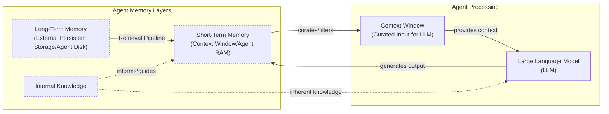

# How Does Memory for AI Agents Work?

In previous lessons, we built a foundation in AI engineering, covering context engineering and agentic planning. Now, we will tackle a core component for advanced AI systems: memory.

The fundamental challenge is that LLMs have knowledge that is vast but frozen in time. They cannot learn by updating their weights after training, a problem known as “continual learning.” An LLM without memory is like an intern with amnesia, unable to recall previous conversations or learn from experience [[1]](https://arxiv.org/html/2309.02427).

We use the context window as a form of “working memory,” but this is a limited solution. Finite size, rising costs, and the “lost in the middle” problem make it unrealistic to keep an entire conversation in context [[2]](https://arxiv.org/abs/2307.03172). Memory tools are the current solution, providing agents with continuity and the ability to “learn.”

In this lesson, we will explore the layers of agent memory, the types of long-term memory, storage trade-offs, code implementations, and real-world best practices.

## The Layers of Memory: Internal, Short-Term, and Long-Term

To build effective agents, we can borrow terms from cognitive science to categorize where information lives [[1]](https://arxiv.org/html/2309.02427). An agent's memory has three layers.

**Internal knowledge** is the static, pre-trained information in the LLM’s weights, ideal for general world knowledge but frozen in time. **Short-term memory** is the active context window, or agent RAM. It is volatile and limited, but it is the only reality the model sees during inference [[3]](https://www.ibm.com/think/topics/ai-agent-memory). Finally, **long-term memory** is the external, persistent storage (the disk) that provides personalization and context the other layers cannot retain [[4]](https://decodingml.substack.com/p/memory-the-secret-sauce-of-ai-agents).

The dynamic between these layers is key. Information is retrieved from long-term memory into short-term memory. This is then curated into the context window for the LLM to use.



Image 1: A hierarchy and flow diagram illustrating the three fundamental layers of an AI agent's memory system: Internal Knowledge, Short-Term Memory, and Long-Term Memory, and their interaction with an LLM.

This categorization is critical for engineering. Internal knowledge handles general reasoning, short-term memory manages the immediate task, and long-term memory provides personalization. To better understand long-term memory, we can again borrow from cognitive science.

## Long-Term Memory: Semantic, Episodic, and Procedural

Long-term memory is not a single bucket of text. It consists of three distinct types, each serving a different role in making an agent “intelligent” [[1]](https://arxiv.org/html/2309.02427), [[5]](https://www.newsletter.swirlai.com/p/memory-in-agent-systems).

**Semantic memory** is the agent’s encyclopedia. It stores individual “facts,” like “The user is a vegetarian,” or structured attributes. For an enterprise agent, this could be internal documents. For a personal assistant, it builds a user profile with preferences, allowing targeted retrieval without searching a noisy conversation history.

**Episodic memory** is the agent’s personal diary, capturing “what happened and when.” Unlike timeless facts, these memories have a timestamp. A semantic fact is `“User is frustrated with brother.”` An episodic memory is `“On Tuesday, user expressed frustration about brother Mark forgetting their birthday.”` This nuance allows for more empathetic responses and enables answering temporal questions like “What happened last week?” [[6]](https://www.youtube.com/watch?v=7AmhgMAJIT4&list=PLDV8PPvY5K8VlygSJcp3__mhToZMBoiwX&index=112).

**Procedural memory** is the agent’s muscle memory. It contains learned workflows for multi-step tasks, often as a reusable tool in the system prompt. For example, a `MonthlyReportIntent` procedure would define the steps: 1) Query sales DB, 2) Summarize findings, 3) Email user. This makes behavior reliable and predictable [[7]](https://arxiv.org/html/2508.06433v2).

Now that we know what to save, we must decide *how* to store it.

## Storing Memories: Pros and Cons of Different Approaches

How an agent’s memories are stored is an architectural decision that impacts performance, complexity, and scalability. The ideal approach depends on the product. Let's explore three primary methods.

**Storing memories as raw strings** is the simplest method. Text is stored and indexed for vector search. It is fast to set up and preserves nuance but suffers from imprecise retrieval. A query like “What is my brother’s job?” might retrieve all conversations mentioning “brother” and “job,” not the single correct fact. Updating facts is also difficult, as new information simply adds to the log, creating potential contradictions [[12]](https://www.decodingai.com/p/how-does-memory-for-ai-agents-work).

**Storing memories as entities** uses an LLM to transform interactions into structured formats like JSON. This allows for precise filtering and easy updates, making it ideal for semantic memory. The cons include upfront schema design complexity and the loss of conversational nuance. The fact `"user_likes": ["cats"]` is less descriptive than the original message, "Petting my cat is the best part of my day" [[8]](https://danielp1.substack.com/p/memex-20-memory-the-missing-piece).

**Storing memories in a knowledge graph** is an advanced approach that represents information as a network of nodes and edges. It excels at modeling complex relationships and offers superior temporal awareness. However, it has the highest complexity and cost, and graph traversals can be slower than vector lookups. For simple use cases, it is often overkill [[9]](https://www.octoco.ai/blog/knowledge-graphs-as-memory).

```mermaid
graph TD
    subgraph "Memory Storage Approaches"
        A[Raw Strings]
        B[Entities (JSON)]
        C[Knowledge Graph]
    end

    subgraph "Characteristics"
        A_Pros["Pros: Simple, Preserves Nuance"]
        A_Cons["Cons: Imprecise, Hard to Update"]
        B_Pros["Pros: Precise, Easy to Update"]
        B_Cons["Cons: Schema Rigidity, Loses Nuance"]
        C_Pros["Pros: Models Relationships, Auditable"]
        C_Cons["Cons: High Complexity, Slower Queries"]
    end

    A --> A_Pros
    A --> A_Cons
    B --> B_Pros
    B --> B_Cons
    C --> C_Pros
    C --> C_Cons
```

Image 2: A diagram visualizing the trade-offs between three primary memory storage approaches: Raw Strings, Entities, and Knowledge Graphs.

The choice of memory storage should be guided by your product’s core needs. Start with the simplest architecture that delivers value and evolve it as the demands on your agent grow more complex.

## Memory implementations with code examples

While RAG handles retrieval (covered in our next lesson), creating high-quality memories is a critical first step. We will use the `mem0` library and a simple "raw strings" approach to demonstrate how each memory category is created.

### What is mem0?

`mem0` is an open-source memory library designed for AI agents. It provides a unified API to manage different types of memory, integrating with various LLMs, embedding models, and vector stores. We will use it to implement semantic, episodic, and procedural memory with just a few lines of code.

### Setup

1.  First, we set up our environment and initialize the Gemini client.
    ```python
    import os
    from typing import Optional
    
    from google import genai
    from mem0 import Memory
    from utils import env
    
    env.load(required_env_vars=["GOOGLE_API_KEY"])
    
    client = genai.Client()
    
    MODEL_ID = "gemini-2.5-pro"
    ```

2.  Next, we configure `mem0` to use Gemini for both embeddings and LLM-based extraction, with ChromaDB as the local vector store.
    ```python
    MEM0_CONFIG = {
        "embedder": {
            "provider": "gemini",
            "config": {
                "model": "gemini-embedding-001",
                "embedding_dims": 768,
                "api_key": os.getenv("GOOGLE_API_KEY"),
            },
        },
        "vector_store": {
            "provider": "chroma",
            "config": {
                "collection_name": "lesson9_memories",
                "path": "/tmp/chroma_mem0",
            },
        },
        "llm": {
            "provider": "gemini",
            "config": {
                "model": MODEL_ID,
                "api_key": os.getenv("GOOGLE_API_KEY"),
            },
        },
    }
    
    memory = Memory.from_config(MEM0_CONFIG)
    MEM_USER_ID = "lesson9_notebook_student"
    memory.delete_all(user_id=MEM_USER_ID)
    ```
    It outputs:
    ```text
    ✅ Mem0 ready (Gemini embeddings + local Chroma).
    ```

3.  We define helper functions to add and search for memories, tagging them with a specific category.
    ```python
    def mem_add_text(text: str, category: str = "semantic", **meta) -> str:
        """Add a single text memory. No LLM is used for extraction or summarization."""
        metadata = {"category": category}
        for k, v in meta.items():
            if isinstance(v, (str, int, float, bool)) or v is None:
                metadata[k] = v
            else:
                metadata[k] = str(v)
        memory.add(text, user_id=MEM_USER_ID, metadata=metadata, infer=False)
        return f"Saved {category} memory."
    
    
    def mem_search(query: str, limit: int = 5, category: Optional[str] = None) -> list[dict]:
        """
        Category-aware search wrapper.
        Returns the full result dicts so we can inspect metadata.
        """
        res = memory.search(query, user_id=MEM_USER_ID, limit=limit) or {}
    
        items = res.get("results", [])
        if category is not None:
            items = [r for r in items if (r.get("metadata") or {}).get("category") == category]
        return items
    ```

### Semantic Memory: Extracting Facts

Semantic memory is created through an extraction pipeline that turns unstructured conversations into a queryable knowledge base. An LLM is prompted to identify persistent facts and preferences.

Here is an example prompt for a personal assistant:
```
Extract persistent facts and strong preferences as short bullet points.
- Keep each fact atomic and context-independent. While reading the messages, make sure to notice the nuance or sublte details that might be important when saving these facts.
- 3–6 bullets max.

Text:
{My brother Mark is a software engineer, but his real passion is painting, he gifted me a painting a few years ago. Its really beautiful.}
```
The system would store: `Mark is the user's brother. Mark is a software engineer. Mark's real passion is painting. The user has a painting from Mark and finds it beautiful.`. Retrieval often uses hybrid search, combining keyword filters with semantic search to find the most relevant facts.

1.  We insert a few example facts as atomic strings.
    ```python
    facts: list[str] = [
        "User prefers vegetarian meals.",
        "User has a dog named George.",
        "User is allergic to gluten.",
        "User's brother is named Mark and is a software engineer.",
    ]
    for f in facts:
        print(mem_add_text(f, category="semantic"))
    ```
    It outputs:
    ```text
    Saved semantic memory.
    Saved semantic memory.
    Saved semantic memory.
    Saved semantic memory.
    ```

2.  We can now search for this specific semantic information using a natural language query.
    ```python
    results = memory.search("brother job", user_id=MEM_USER_ID, limit=1)
    print(results["results"][0]["memory"])
    ```
    It outputs:
    ```text
    User's brother is named Mark and is a software engineer.
    ```

### Episodic Memory: The Log of Events

Episodic memory functions as a chronological log. Memories can be raw conversation snippets or summaries generated by an LLM, always with a timestamp.

If we want to extract memories with an LLM, the prompt for a personal coding tutor might be:
```
You are a personal coding tutor for a user, you will extract events, likes, dislikes, or any other insights from the conversation text, that will serve to better teach the user, and help them improve their skills in coding. Make sure to capter the nuance and details of the conversation, and not just the facts.
```
Given the input `User: "I'm feeling stressed about my project deadline on Friday.", Assistant: "I'm sorry to hear that. I'm here to help you with that."`, a summarized memory could be: `October 26th, 2025. 2:30PM EST User: "The user is stressed about their project deadline on Friday and the assistant offers to help."`. Retrieval is a blend of temporal queries and semantic search.

1.  We define a short dialogue and ask the LLM to summarize it into a concise "episode."
    ```python
    dialogue = [
        {"role": "user", "content": "I'm stressed about my project deadline on Friday."},
        {"role": "assistant", "content": "I’m here to help. What’s the blocker?"},
        {"role": "user", "content": "Mainly testing. I also prefer working at night."},
        {"role": "assistant", "content": "Okay, we can split testing into two sessions."},
    ]
    
    episodic_prompt = f"""Summarize the following 3–4 turns as one concise 'episode' (1–2 sentences).
    Keep salient details and tone.
    
    {dialogue}
    """
    episode_summary = client.models.generate_content(model=MODEL_ID, contents=episodic_prompt)
    episode = episode_summary.text.strip()
    ```

2.  We save this summary as an episodic memory.
    ```python
    print(
        mem_add_text(
            episode,
            category="episodic",
            summarized=True,
            turns=4,
        )
    )
    ```
    It outputs:
    ```text
    Saved episodic memory.
    ```

3.  Later, we can search for this "experience" using a semantic query.
    ```python
    hits = mem_search("deadline stress", limit=1, category="episodic")
    for h in hits:
        print(f"{h['memory']}\n")
    ```
    It outputs:
    ```text
    A user, stressed about a Friday project deadline because of testing and a preference for working at night, is advised to split the testing work into two manageable sessions.
    ```

### Procedural Memory: Defining and Learning Skills

Procedural memory can be developer-defined or learned from user interactions. An agent can be prompted to convert a user's instructions into a reusable procedure.

An example prompt to learn a new skill:
```
You are an agent that can learn new skills. When a user provides a numbered list of steps to accomplish a goal, your task is to run the "learn_procedure" tool, and convert these numbered list of steps into a reusable procedure. Identify the core actions and any variable parameters (e.g., dates, locations, names).

Examples:
User Input: "I want you to book a cabin for this summer. To do that, please remember to: 1. Search for cabins on CabinRentals.com my favorite website. 2. Filter for locations in the mountains, the closer to them, the better. 3. Make sure it's available around July. 4 to 8th. 5. Send me the top 3 options."

learn_procedure(name="find_summer_cabin", steps=first search for cabins on CabinRentals.com, then filter for locations in the mountains, check for distance to the mountains, then check availability around what the user wants, if the user hasn't specified a date, ask the user for a date, once you have a list of options, send the top 3 options)
```
Retrieval is an intent-matching process where the LLM compares a user's request against the descriptions of all available procedures and executes the best match. Storing procedures from successful interactions often outperforms storing all attempts, as this avoids learning from failures [[10]](https://arxiv.org/html/2508.06433v4).

1.  We define a procedure as a text block containing an ordered list of steps.
    ```python
    procedure_name = "monthly_report"
    steps = [
        "Query sales DB for the last 30 days.",
        "Summarize top 5 insights.",
        "Ask user whether to email or display.",
    ]
    procedure_text = f"Procedure: {procedure_name}\nSteps:\n" + "\n".join(f"{i + 1}. {s}" for i, s in enumerate(steps))
    
    mem_add_text(procedure_text, category="procedure", procedure_name=procedure_name)
    ```

2.  The agent can then retrieve this procedure by matching the user's intent.
    ```python
    results = mem_search("how to create a monthly report", category="procedure", limit=1)
    if results:
        print(results[0]["memory"])
    ```
    It outputs:
    ```text
    Procedure: monthly_report
    Steps:
    1. Query sales DB for the last 30 days.
    2. Summarize top 5 insights.
    3. Ask user whether to email or display.
    ```

We have seen how to implement the different types of memories with `mem0`. Now, let's discuss some additional considerations when building a memory system.

## Real-World Lessons: Challenges and Best Practices

The architectural patterns described in the previous section provide a useful toolkit for building agents with memory. However, moving from theory to a reliable, production-ready system requires navigating a series of complex trade-offs that are constantly evolving as the underlying technology improves.

Here are some of the most important lessons learned from building and scaling agent memory systems in the real world.

### Re-evaluating Compression

The trade-off between compressing information and preserving its raw detail has shifted dramatically. Just a few years ago, LLMs operated with small and expensive context windows (e.g., 8,000 or 16,000 tokens). This constraint forced us to be ruthless with compression. While necessary, this process is inherently lossy, leading to **summarization drift**, where repeated summarization makes the agent’s memory diverge from reality [[11]](https://towardsdatascience.com/a-practical-guide-to-memory-for-autonomous-llm-agents/).

Today, with models offering million-token context windows at a fraction of the cost, the best practice is to lean towards less compression [[6]](https://www.youtube.com/watch?v=7AmhgMAJIT4&list=PLDV8PPvY5K8VlygSJcp3__mhToZMBoiwX&index=112). The raw, unstructured conversational history is the ultimate source of truth. It contains the emotional subtext and relational dynamics often lost during extraction. While a fact might state, "User has a dog named George," the episodic log reveals, "User mentioned that walking their dog named George is the best part of their day," a far more valuable piece of information for a personalized agent. Design your system to work with the most complete version of history that is economically and technically feasible.

### Designing for the Product

There is no "perfect" memory architecture. The concepts of semantic, episodic, and procedural memory are a toolkit, not a mandatory blueprint. A common failure is over-engineering a complex system for a simple product. The product's goal should dictate the memory architecture. For a Q&A bot over internal documents, a simple RAG pipeline is the best starting point. For a long-term personal AI companion, rich episodic memories are beneficial. For a task-automation agent, procedural memory is key to reliably execute multi-step workflows.

### The Human Factor

Memory exists to make the agent smarter, not to give the user a new job. A common pitfall is exposing the internal workings of the memory system to the user, thinking it will improve transparency. In practice, it often creates significant cognitive overhead. Users should not be asked to "garden their agent's memories" [[6]](https://www.youtube.com/watch?v=7AmhgMAJIT4&list=PLDV8PPvY5K8VlygSJcp3__mhToZMBoiwX&index=112). This breaks the illusion of a capable assistant and turns the interaction into a tedious data-entry task. Memory management should be an autonomous function of the agent. It should learn from corrections within the natural flow of conversation and have internal processes to consolidate and resolve conflicting information.

## Conclusion

Memory is the component that transforms a stateless chat application into a personalized agent. It is the current engineering solution to the problem of continual learning. By constantly engineering the context window, we allow agents to “learn” and adapt over time. While today's memory tools are a temporary solution for true "continual learning," they are a powerful and necessary step toward building truly intelligent systems.

This lesson provided a conceptual overview of agent memory. In our next lesson, we will explore Retrieval-Augmented Generation (RAG), the core mechanism for pulling information from long-term memory. We will also cover more advanced topics in the future, such as multimodal processing for documents and images, building production-ready agents from the ground up, and implementing robust monitoring and evaluation pipelines to ensure our systems are reliable and effective in the real world.

## References

- [1] https://arxiv.org/html/2309.02427
- [2] https://arxiv.org/abs/2307.03172
- [3] https://www.ibm.com/think/topics/ai-agent-memory
- [4] https://decodingml.substack.com/p/memory-the-secret-sauce-of-ai-agents
- [5] https://www.newsletter.swirlai.com/p/memory-in-agent-systems
- [6] https://www.youtube.com/watch?v=7AmhgMAJIT4&list=PLDV8PPvY5K8VlygSJcp3__mhToZMBoiwX&index=112
- [7] https://arxiv.org/html/2508.06433v2
- [8] https://danielp1.substack.com/p/memex-20-memory-the-missing-piece
- [9] https://www.octoco.ai/blog/knowledge-graphs-as-memory
- [10] https://arxiv.org/html/2508.06433v4
- [11] https://towardsdatascience.com/a-practical-guide-to-memory-for-autonomous-llm-agents/
- [12] https://www.decodingai.com/p/how-does-memory-for-ai-agents-work