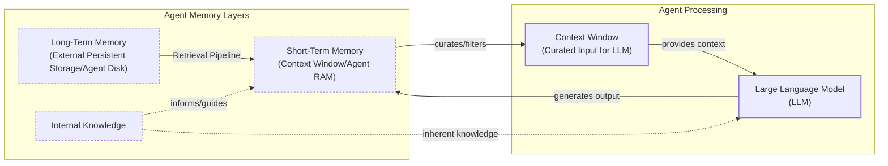

# How Does Memory for AI Agents Work?

In the previous lessons, we built a foundation in AI engineering, covering everything from context engineering and structured outputs to agentic planning with ReAct. Now, we will tackle one of the most important components for building advanced AI systems: memory.

One year ago, we faced a common challenge: giving our agent the right information at the right time. Our initial complex Retrieval-Augmented Generation (RAG) system had high latency and costs, and was a nightmare to debug.

This experience taught me that the fundamental challenge in building AI agents is not just about retrieval. It is about understanding how to architect memory systems that match your use case. The core problem we are solving is the fundamental limitation of LLMs: their knowledge is vast but frozen in time. They are unable to learn by updating their weights after training, a problem known as “continual learning” [[1]](https://arxiv.org/html/2510.17281v2). An LLM without memory is like an intern with amnesia. They might be brilliant, but they cannot recall previous conversations or learn from experience.

To overcome this, we use the context window as a form of “working memory.” However, keeping an entire conversation thread plus additional information in the context is often unrealistic. Rising costs per turn and the “lost in the middle” problem—where models struggle to use information buried in the center of a long prompt—limit this approach [[2]](https://arxiv.org/abs/2307.03172). While context windows are increasing, relying solely on them introduces noise and overhead.

Memory tools act as the solution. They provide agents with continuity, adaptability, and the ability to “learn” without retraining. When we first started building agents, working with 8k or 16k token limits forced us to engineer complex compression systems. Today, we have more breathing room, but the principles of organizing memory remain essential for performance.

In this lesson, we will explore the fundamental layers of agent memory, take a detailed look at the types of long-term memory, discuss the trade-offs in storage approaches, see how to implement them with code, and cover real-world best practices for designing memory systems.

## The Layers of Memory: Internal, Short-Term, and Long-Term

To build effective agents, it helps to borrow terms from cognitive science to categorize where information lives [[3]](https://arxiv.org/html/2309.02427). There are three distinct memory layers based on their persistence and proximity to the model’s reasoning core.

**Internal Knowledge:** The static, pre-trained knowledge in the LLM’s weights. It is ideal for general world knowledge but is frozen at the time of training.

**Short-Term Memory:** The active context window, or agent RAM. It is volatile, fast, but limited in size, and is the only reality the model sees during inference [[4]](https://www.ibm.com/think/topics/ai-agent-memory).

**Long-Term Memory:** An external, persistent storage system (the disk) that provides the personalization and context that the other layers cannot [[5]](https://decodingml.substack.com/p/memory-the-secret-sauce-of-ai-agents).

The dynamic between these layers creates the agent’s intelligence. First, part of the long-term memory is “retrieved” and brought into short-term memory. This retrieval pipeline queries different memory types in parallel. Next, we slice the short-term memory into an active context window through context engineering. Finally, during inference, the LLM uses its internal weights plus the active context window to generate output.



Image 1: A hierarchy and flow diagram illustrating the three fundamental layers of an AI agent's memory system: Internal Knowledge, Short-Term Memory, and Long-Term Memory, and their interaction with an LLM.

This categorization is critical. Internal knowledge provides general reasoning, short-term memory manages the immediate task, and long-term memory ensures personalization. No single layer is sufficient. To better understand long-term memory, we can again borrow from cognitive science.

## Long-Term Memory: Semantic, Episodic, and Procedural

Long-term memory is not a single bucket of text. It consists of three distinct types, each serving a different role in making an agent “intelligent” [[3]](https://arxiv.org/html/2309.02427), [[6]](https://www.newsletter.swirlai.com/p/memory-in-agent-systems).

**Semantic Memory (Facts & Knowledge)** is the agent’s encyclopedia. It stores individual “facts,” like “The user is a vegetarian” or structured attributes (`{"food_restrictions": "vegetarian"}`). For an enterprise agent, this could be internal documents. For a personal assistant, it builds a user profile with preferences, allowing targeted retrieval without searching a noisy conversation history.

**Episodic Memory (Experiences & History)** is the agent’s personal diary, capturing “what happened and when.” Unlike timeless facts, these memories have a timestamp, which is essential for conversational context. A semantic fact is `“User is frustrated with brother.”` An episodic memory is `“On Tuesday, user expressed frustration about brother Mark forgetting their birthday. [created_at=2025-08-25].”` This nuance allows for more empathetic responses and enables answering temporal questions like “What happened last week?” [[7]](https://www.youtube.com/watch?v=7AmhgMAJIT4&list=PLDV8PPvY5K8VlygSJcp3__mhToZMBoiwX&index=112).

**Procedural Memory (Skills & How-To)** is the agent’s muscle memory. It contains learned workflows and “how-to” knowledge for multi-step tasks. It is often a reusable tool or defined sequence in the system prompt. For example, a `MonthlyReportIntent` procedure would define the steps: 1) Query sales DB, 2) Summarize findings, 3) Email user. This makes behavior reliable and predictable, as the agent does not have to reason from scratch for common tasks [[8]](https://arxiv.org/html/2508.06433v2).

Now that we know what to save, we must decide *how* to store it.

## Storing Memories: Pros and Cons of Different Approaches

How an agent’s memories are stored impacts performance, complexity, and scalability. The ideal approach depends on the product. Let’s explore three primary methods.

**Storing Memories as Raw Strings:** This is the simplest method, storing text and indexing it for vector search. It is fast to set up and preserves nuance but suffers from imprecise retrieval. A query like “What is my brother’s job?” might retrieve all conversations mentioning “brother” and “job,” not the single correct fact. Updating facts is also difficult, as new information simply adds to the log, creating potential contradictions.

**Storing Memories as Entities (JSON-like Structures):** This method uses an LLM to transform interactions into structured formats like JSON. It allows for precise filtering (e.g., `"user.brother.job"`) and easy updates by overwriting fields. It is ideal for semantic memory. The cons include upfront schema design complexity and the loss of conversational nuance. The fact `"user_likes": ["cats"]` is less descriptive than the original message, "Petting my cat is the best part of my day" [[9]](https://danielp1.substack.com/p/memex-20-memory-the-missing-piece).

**Storing Memories in a Knowledge Graph:** This advanced approach stores memories as a network of nodes (entities) and edges (relationships). It excels at representing complex connections (e.g., `(User) -> [HAS_BROTHER] -> (Mark)`) and offers superior temporal awareness. Retrieval is also auditable. However, it has the highest complexity and cost, and graph traversals can be slower than vector lookups. For simple use cases, it is often overkill [[10]](https://arxiv.org/html/2504.19413).

| Approach | Pros | Cons |
| :--- | :--- | :--- |
| **Raw Strings** | Simple to set up, preserves nuance and emotional tone. | Imprecise retrieval, difficult to update, lacks structure for temporal reasoning. |
| **Entities (JSON)** | Precise filtering, easy to update, good for factual data (semantic memory). | Upfront schema complexity, can be rigid, loses conversational nuance. |
| **Knowledge Graph** | Represents complex relationships, superior temporal awareness, auditable and explainable. | Highest complexity and cost, potentially slower queries, overkill for simple use cases. |

Table 1: A comparison of the three primary methods for storing agent memories.

The choice should be guided by your product’s needs. Start simple and evolve as complexity grows. Now that we know what to save and how to store memories, let's look at some code examples.

## Memory implementations with code examples

While RAG handles retrieval (covered in our next lesson), creating high-quality memories is a critical first step. We will use the `mem0` library and a simple "raw strings" approach to demonstrate how each memory category is created.

### Setup

`mem0` is an open-source library for managing agent memory. We will configure it to use Gemini for embeddings and a local ChromaDB instance for vector storage.

1.  First, we set up our environment and initialize the Gemini client.
    ```python
    import os
    import re
    from typing import Optional
    
    from google import genai
    from mem0 import Memory
    from utils import env
    
    env.load(required_env_vars=["GOOGLE_API_KEY"])
    
    client = genai.Client()
    
    MODEL_ID = "gemini-2.5-pro"
    ```

2.  Next, we configure `mem0` to use Gemini for both embeddings and LLM-based extraction, with ChromaDB as the local vector store.
    ```python
    MEM0_CONFIG = {
        "embedder": {
            "provider": "gemini",
            "config": {
                "model": "gemini-embedding-001",
                "embedding_dims": 768,
                "api_key": os.getenv("GOOGLE_API_KEY"),
            },
        },
        "vector_store": {
            "provider": "chroma",
            "config": {
                "collection_name": "lesson9_memories",
                "path": "/tmp/chroma_mem0",
            },
        },
        "llm": {
            "provider": "gemini",
            "config": {
                "model": MODEL_ID,
                "api_key": os.getenv("GOOGLE_API_KEY"),
            },
        },
    }
    
    memory = Memory.from_config(MEM0_CONFIG)
    MEM_USER_ID = "lesson9_notebook_student"
    memory.delete_all(user_id=MEM_USER_ID)
    ```
    It outputs:
    ```text
    ✅ Mem0 ready (Gemini embeddings + local Chroma).
    ```

3.  We define helper functions to add and search for memories, tagging them with a specific category.
    ```python
    def mem_add_text(text: str, category: str = "semantic", **meta) -> str:
        """Add a single text memory. No LLM is used for extraction or summarization."""
        metadata = {"category": category}
        for k, v in meta.items():
            if isinstance(v, (str, int, float, bool)) or v is None:
                metadata[k] = v
            else:
                metadata[k] = str(v)
        memory.add(text, user_id=MEM_USER_ID, metadata=metadata, infer=False)
        return f"Saved {category} memory."
    
    
    def mem_search(query: str, limit: int = 5, category: Optional[str] = None) -> list[dict]:
        """
        Category-aware search wrapper.
        Returns the full result dicts so we can inspect metadata.
        """
        res = memory.search(query, user_id=MEM_USER_ID, limit=limit) or {}
    
        items = res.get("results", [])
        if category is not None:
            items = [r for r in items if (r.get("metadata") or {}).get("category") == category]
        return items
    ```

### Semantic Memory: Extracting Facts

Semantic memory is created through an extraction pipeline that turns unstructured conversations into a queryable knowledge base.

1.  We insert a few example facts as atomic strings.
    ```python
    facts: list[str] = [
        "User prefers vegetarian meals.",
        "User has a dog named George.",
        "User is allergic to gluten.",
        "User's brother is named Mark and is a software engineer.",
    ]
    for f in facts:
        print(mem_add_text(f, category="semantic"))
    ```
    It outputs:
    ```text
    Saved semantic memory.
    Saved semantic memory.
    Saved semantic memory.
    Saved semantic memory.
    ```

2.  We can now search for this specific semantic information using a natural language query.
    ```python
    results = memory.search("brother job", user_id=MEM_USER_ID, limit=1)
    print(results["results"][0]["memory"])
    ```
    It outputs:
    ```text
    User's brother is named Mark and is a software engineer.
    ```

### Episodic Memory: The Log of Events

Episodic memory functions as a chronological log of events. We can create these memories by having an LLM summarize a conversation, which is then stored with a timestamp.

1.  We define a short dialogue and ask the LLM to summarize it into a concise "episode."
    ```python
    dialogue = [
        {"role": "user", "content": "I'm stressed about my project deadline on Friday."},
        {"role": "assistant", "content": "I’m here to help—what’s the blocker?"},
        {"role": "user", "content": "Mainly testing. I also prefer working at night."},
        {"role": "assistant", "content": "Okay, we can split testing into two sessions."},
    ]
    
    episodic_prompt = f"""Summarize the following 3–4 turns as one concise 'episode' (1–2 sentences).
    Keep salient details and tone.
    
    {dialogue}
    """
    episode_summary = client.models.generate_content(model=MODEL_ID, contents=episodic_prompt)
    episode = episode_summary.text.strip()
    ```

2.  We save this summary as an episodic memory.
    ```python
    print(
        mem_add_text(
            episode,
            category="episodic",
            summarized=True,
            turns=4,
        )
    )
    ```
    It outputs:
    ```text
    Saved episodic memory.
    ```

3.  Later, we can search for this "experience" using a semantic query.
    ```python
    hits = mem_search("deadline stress", limit=1, category="episodic")
    for h in hits:
        print(f"{h['memory']}\n")
    ```
    It outputs:
    ```text
    A user, stressed about a Friday project deadline because of testing and a preference for working at night, is advised to split the testing work into two manageable sessions.
    ```

### Procedural Memory: Defining and Learning Skills

Procedural memory can be created by developers or learned dynamically from users. This learning is most effective when selective. Storing procedures distilled only from successful interactions often outperforms storing all attempts, as isolated failures can create misguided memories [[11]](https://arxiv.org/html/2512.10696). Here, we will define a simple procedure and store it.

1.  We define a procedure as a text block containing an ordered list of steps.
    ```python
    procedure_name = "monthly_report"
    steps = [
        "Query sales DB for the last 30 days.",
        "Summarize top 5 insights.",
        "Ask user whether to email or display.",
    ]
    procedure_text = f"Procedure: {procedure_name}\nSteps:\n" + "\n".join(f"{i + 1}. {s}" for i, s in enumerate(steps))
    
    mem_add_text(procedure_text, category="procedure", procedure_name=procedure_name)
    ```

2.  The agent can then retrieve this procedure by matching the user's intent.
    ```python
    results = mem_search("how to create a monthly report", category="procedure", limit=1)
    if results:
        print(results[0]["memory"])
    ```
    It outputs:
    ```text
    Procedure: monthly_report
    Steps:
    1. Query sales DB for the last 30 days.
    2. Summarize top 5 insights.
    3. Ask user whether to email or display.
    ```

We have seen how to implement the different types of memories with `mem0`. Now, let's discuss some additional considerations when building a memory system.

## Real-World Lessons: Challenges and Best Practices

Moving from theory to a reliable, production-ready system requires navigating complex trade-offs that are constantly evolving with the underlying technology. Here are some important lessons learned from building and scaling agent memory systems.

### Re-evaluating Compression

The trade-off between compressing information and preserving its raw detail has shifted dramatically. A few years ago, small context windows (e.g., 8k or 16k tokens) forced ruthless compression. This process is inherently lossy, leading to **summarization drift**, where repeated summarization makes the agent’s memory diverge from reality [[12]](https://towardsdatascience.com/a-practical-guide-to-memory-for-autonomous-llm-agents/). Today, with million-token windows, the best practice is to use less compression. The raw conversational history is the ultimate source of truth, containing emotional subtext often lost in extraction. Use summarization to create queryable indexes, but treat the raw log as ground truth.

### Designing for the Product

There is no "perfect" memory architecture. The concepts of semantic, episodic, and procedural memory are a toolkit, not a mandatory blueprint. A common failure is over-engineering a complex system for a simple product. Start from first principles: the product's goal should dictate the memory architecture. A Q&A bot needs a robust RAG pipeline. A personal companion benefits from rich episodic memories. A task-automation agent relies on procedural memory to execute workflows reliably.

### The Human Factor

Memory should make the agent smarter, not give the user a new job. Many systems expose memory editing to users, but this creates cognitive overhead and breaks the illusion of a capable assistant. Users should not be asked to "garden their agent's memories" [[7]](https://www.youtube.com/watch?v=7AmhgMAJIT4&list=PLDV8PPvY5K8VlygSJcp3__mhToZMBoiwX&index=112). An agent that forgets conversations feels disrespectful and erodes trust [[13]](https://dev.to/bobrenze/why-ai-agent-memory-systems-fail-in-production-and-how-i-fixed-mine-141d). Memory management should be autonomous. The agent must learn from conversational corrections (e.g., "Actually, my brother's name is Mark") and be responsible for resolving internal conflicts, such as when it internalizes a wrong fact and creates a self-reinforcing error loop [[12]](https://towardsdatascience.com/a-practical-guide-to-memory-for-autonomous-llm-agents/).

## Conclusion

Memory is the component that transforms a stateless chat application into a personalized agent. It is the current engineering solution to the problem of continual learning. By constantly engineering the context window, we allow agents to “learn” and adapt over time. While today's memory tools are a temporary solution, they are a powerful and necessary step toward building truly intelligent systems.

This lesson provided a conceptual overview of agent memory. In our next lesson, we will dive deep into Retrieval-Augmented Generation (RAG), the core mechanism for pulling information from long-term memory. We will also explore more advanced topics in the future, such as multimodal processing, building production-ready agents, and implementing robust monitoring and evaluation pipelines.

## References

- [1] Wang, L., Zhang, X., Su, H., & Zhu, J. (2025). A Comprehensive Survey of Continual Learning. arXiv preprint arXiv:2302.00487. https://arxiv.org/html/2510.17281v2
- [2] Liu, N. F., Lin, K., Hewitt, J., Paranjape, A., Bevilacqua, M., Petroni, F., & Liang, P. (2023). Lost in the Middle: How Language Models Use Long Contexts. arXiv preprint arXiv:2307.03172. https://arxiv.org/abs/2307.03172
- [3] Sumers, T. R., Yao, S., Narasimhan, K., & Griffiths, T. L. (2023). Cognitive Architectures for Language Agents. arXiv. https://arxiv.org/html/2309.02427
- [4] What is AI agent memory?. (n.d.). IBM. https://www.ibm.com/think/topics/ai-agent-memory
- [5] Iusztin, P. (2024, May 21). Memory: The secret sauce of AI agents. Decoding AI Magazine. https://decodingml.substack.com/p/memory-the-secret-sauce-of-ai-agents
- [6] Griciūnas, A. (2024, October 30). Memory in Agent Systems. SwirlAI Newsletter. https://www.newsletter.swirlai.com/p/memory-in-agent-systems
- [7] Whitmore, S. (2025, June 18). What is the perfect memory architecture?. YouTube. https://www.youtube.com/watch?v=7AmhgMAJIT4&list=PLDV8PPvY5K8VlygSJcp3__mhToZMBoiwX&index=112
- [8] Mem^p: A Framework for Procedural Memory in Agents. (n.d.). arXiv. https://arxiv.org/html/2508.06433v2
- [9] Chalef, D. (2024, June 25). Memex 2.0: Memory The Missing Piece for Real Intelligence. Substack. https://danielp1.substack.com/p/memex-20-memory-the-missing-piece
- [10] Chhikara, P. (2025). Mem0: Building Production-Ready AI Agents with Scalable Long-Term Memory. arXiv. https://arxiv.org/html/2504.19413
- [11] Tan, Z., et al. (2025). ReMe: A Dynamic Procedural Memory for Large Language Model Agents. arXiv. https://arxiv.org/html/2512.10696
- [12] Lawson, N. (2026, April 17). A Practical Guide to Memory for Autonomous LLM Agents. Towards Data Science. https://towardsdatascience.com/a-practical-guide-to-memory-for-autonomous-llm-agents/
- [13] Bob. (n.d.). Why AI Agent Memory Systems Fail in Production (And How I Fixed Mine). DEV Community. https://dev.to/bobrenze/why-ai-agent-memory-systems-fail-in-production-and-how-i-fixed-mine-141d