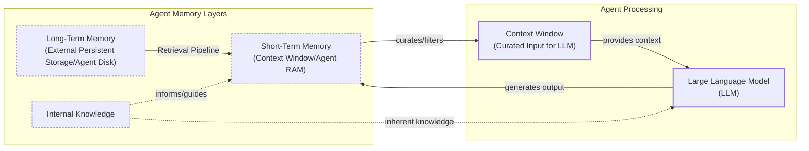

# How Does Memory for AI Agents Work?

In previous lessons, we built a foundation in AI engineering, covering context engineering and agentic planning. Now, we will tackle a core component for advanced AI systems: memory.

The fundamental challenge is that LLMs have knowledge that is vast but frozen in time. They cannot learn by updating their weights after training, a problem known as “continual learning.” An LLM without memory is like an intern with amnesia, unable to recall previous conversations or learn from experience [[1]](https://arxiv.org/html/2309.02427).

We use the context window as a form of “working memory,” but this is a limited solution. Finite size, rising costs, and the “lost in the middle” problem make it unrealistic to keep an entire conversation in context [[2]](https://arxiv.org/abs/2307.03172). Memory tools are the current solution, providing agents with continuity and the ability to “learn.”

In this lesson, we will explore the layers of agent memory, the types of long-term memory, storage trade-offs, code implementations, and real-world best practices.

## The Layers of Memory: Internal, Short-Term, and Long-Term

To build effective agents, it helps to borrow terms from cognitive science to categorize where information lives [[1]](https://arxiv.org/html/2309.02427). There are three distinct memory layers based on their persistence and proximity to the model’s reasoning core.

**Internal Knowledge:** The static, pre-trained knowledge in the LLM’s weights. It is ideal for general world knowledge but is frozen at the time of training.

**Short-Term Memory:** The active context window, or agent RAM. It is volatile, fast, but limited in size, and is the only reality the model sees during inference [[3]](https://www.ibm.com/think/topics/ai-agent-memory).

**Long-Term Memory:** An external, persistent storage system (the disk) that provides the personalization and context that the other layers cannot [[4]](https://decodingml.substack.com/p/memory-the-secret-sauce-of-ai-agents).

The dynamic between these layers creates the agent’s intelligence. First, part of the long-term memory is “retrieved” and brought into short-term memory. This retrieval pipeline queries different memory types in parallel. Next, we slice the short-term memory into an active context window through context engineering. Finally, during inference, the LLM uses its internal weights plus the active context window to generate output.



Image 1: A hierarchy and flow diagram illustrating the three fundamental layers of an AI agent's memory system: Internal Knowledge, Short-Term Memory, and Long-Term Memory, and their interaction with an LLM.

This categorization is critical. Internal knowledge provides general reasoning, short-term memory manages the immediate task, and long-term memory ensures personalization. No single layer is sufficient. To better understand long-term memory, we can again borrow from cognitive science.

## Long-Term Memory: Semantic, Episodic, and Procedural

Long-term memory is not a single bucket of text. It consists of three distinct types, each serving a different role in making an agent “intelligent” [[1]](https://arxiv.org/html/2309.02427), [[5]](https://www.newsletter.swirlai.com/p/memory-in-agent-systems).

**Semantic Memory (Facts & Knowledge)** is the agent’s encyclopedia. It stores individual “facts,” like “The user is a vegetarian,” or structured attributes. For an enterprise agent, this could be internal documents. For a personal assistant, it builds a user profile with preferences, allowing targeted retrieval without searching a noisy conversation history.

**Episodic Memory (Experiences & History)** is the agent’s personal diary, capturing “what happened and when.” Unlike timeless facts, these memories have a timestamp. A semantic fact is `“User is frustrated with brother.”` An episodic memory is `“On Tuesday, user expressed frustration about brother Mark forgetting their birthday.”` This nuance allows for more empathetic responses and enables answering temporal questions like “What happened last week?” [[6]](https://www.youtube.com/watch?v=7AmhgMAJIT4&list=PLDV8PPvY5K8VlygSJcp3__mhToZMBoiwX&index=112).

**Procedural Memory (Skills & How-To)** is the agent’s muscle memory. It contains learned workflows for multi-step tasks, often as a reusable tool in the system prompt. For example, a `MonthlyReportIntent` procedure would define the steps: 1) Query sales DB, 2) Summarize findings, 3) Email user. This makes behavior reliable and predictable [[7]](https://arxiv.org/html/2508.06433v2).

Now that we know what to save, we must decide *how* to store it.

## Storing Memories: Pros and Cons of Different Approaches

How an agent’s memories are stored is an architectural decision that impacts performance, complexity, and scalability. The ideal approach depends on the product. Let's explore three primary methods.

**Storing Memories as Raw Strings:** This is the simplest method, storing text and indexing it for vector search. It is fast to set up and preserves nuance but suffers from imprecise retrieval. A query like “What is my brother’s job?” might retrieve all conversations mentioning “brother” and “job,” not the single correct fact. Updating facts is also difficult, as new information simply adds to the log, creating potential contradictions.

**Storing Memories as Entities (JSON-like Structures):** This method uses an LLM to transform interactions into structured formats like JSON. It allows for precise filtering (e.g., `"user.brother.job"`) and easy updates by overwriting fields. It is ideal for semantic memory. The cons include upfront schema design complexity and the loss of conversational nuance. The fact `"user_likes": ["cats"]` is less descriptive than the original message, "Petting my cat is the best part of my day" [[8]](https://danielp1.substack.com/p/memex-20-memory-the-missing-piece).

**Storing Memories in a Knowledge Graph:** This advanced approach stores memories as a network of nodes (entities) and edges (relationships). It excels at representing complex connections (e.g., `(User) -> [HAS_BROTHER] -> (Mark)`) and offers superior temporal awareness. Retrieval is also auditable. However, it has the highest complexity and cost, and graph traversals can be slower than vector lookups. For simple use cases, it is often overkill [[9]](https://www.octoco.ai/blog/knowledge-graphs-as-memory).

```mermaid
graph TD
    subgraph "Memory Storage Approaches"
        A[Raw Strings]
        B[Entities (JSON)]
        C[Knowledge Graph]
    end

    subgraph "Characteristics"
        A_Pros["Pros: Simple, Preserves Nuance"]
        A_Cons["Cons: Imprecise, Hard to Update"]
        B_Pros["Pros: Precise, Easy to Update"]
        B_Cons["Cons: Schema Rigidity, Loses Nuance"]
        C_Pros["Pros: Models Relationships, Auditable"]
        C_Cons["Cons: High Complexity, Slower Queries"]
    end

    A --> A_Pros
    A --> A_Cons
    B --> B_Pros
    B --> B_Cons
    C --> C_Pros
    C --> C_Cons
```

Image 2: A diagram visualizing the trade-offs between three primary memory storage approaches: Raw Strings, Entities, and Knowledge Graphs.

Memory exists to make the agent smarter, not to give the user a new job. A common pitfall is exposing the internal workings of the memory system to the user. In practice, this creates significant cognitive overhead. Users should not be asked to "garden their agent's memories" [[6]](https://www.youtube.com/watch?v=7AmhgMAJIT4&list=PLDV8PPvY5K8VlygSJcp3__mhToZMBoiwX&index=112). This breaks the illusion of a capable assistant and turns the interaction into a tedious data-entry task. Memory management should be an autonomous function of the agent, learning from corrections within the natural flow of conversation.

The choice of memory storage should be guided by your product’s core needs. Start with the simplest architecture that delivers value and evolve it as the demands on your agent grow more complex.

## Memory implementations with code examples

While RAG handles retrieval (covered in our next lesson), creating high-quality memories is a critical first step. We will use the `mem0` library and a simple "raw strings" approach to demonstrate how each memory category is created.

### Setup

`mem0` is an open-source library for managing agent memory. We will configure it to use Gemini for embeddings and a local ChromaDB instance for vector storage.

1.  First, we set up our environment and initialize the Gemini client.
    ```python
    import os
    from typing import Optional
    
    from google import genai
    from mem0 import Memory
    from utils import env
    
    env.load(required_env_vars=["GOOGLE_API_KEY"])
    
    client = genai.Client()
    
    MODEL_ID = "gemini-2.5-pro"
    ```

2.  Next, we configure `mem0` to use Gemini for both embeddings and LLM-based extraction, with ChromaDB as the local vector store.
    ```python
    MEM0_CONFIG = {
        "embedder": {
            "provider": "gemini",
            "config": {
                "model": "gemini-embedding-001",
                "embedding_dims": 768,
                "api_key": os.getenv("GOOGLE_API_KEY"),
            },
        },
        "vector_store": {
            "provider": "chroma",
            "config": {
                "collection_name": "lesson9_memories",
                "path": "/tmp/chroma_mem0",
            },
        },
        "llm": {
            "provider": "gemini",
            "config": {
                "model": MODEL_ID,
                "api_key": os.getenv("GOOGLE_API_KEY"),
            },
        },
    }
    
    memory = Memory.from_config(MEM0_CONFIG)
    MEM_USER_ID = "lesson9_notebook_student"
    memory.delete_all(user_id=MEM_USER_ID)
    ```
    It outputs:
    ```text
    ✅ Mem0 ready (Gemini embeddings + local Chroma).
    ```

3.  We define helper functions to add and search for memories, tagging them with a specific category.
    ```python
    def mem_add_text(text: str, category: str = "semantic", **meta) -> str:
        """Add a single text memory. No LLM is used for extraction or summarization."""
        metadata = {"category": category}
        for k, v in meta.items():
            if isinstance(v, (str, int, float, bool)) or v is None:
                metadata[k] = v
            else:
                metadata[k] = str(v)
        memory.add(text, user_id=MEM_USER_ID, metadata=metadata, infer=False)
        return f"Saved {category} memory."
    
    
    def mem_search(query: str, limit: int = 5, category: Optional[str] = None) -> list[dict]:
        """
        Category-aware search wrapper.
        Returns the full result dicts so we can inspect metadata.
        """
        res = memory.search(query, user_id=MEM_USER_ID, limit=limit) or {}
    
        items = res.get("results", [])
        if category is not None:
            items = [r for r in items if (r.get("metadata") or {}).get("category") == category]
        return items
    ```

### Semantic Memory: Extracting Facts

Semantic memory is created through an extraction pipeline that turns unstructured conversations into a queryable knowledge base. An LLM is prompted to identify persistent facts and preferences. For example, from "My brother Mark is a software engineer, but his real passion is painting," the system would store facts like `Mark is the user's brother` and `Mark's real passion is painting`. Retrieval often uses hybrid search, combining keyword filters with semantic search to find the most relevant facts.

1.  We insert a few example facts as atomic strings.
    ```python
    facts: list[str] = [
        "User prefers vegetarian meals.",
        "User has a dog named George.",
        "User is allergic to gluten.",
        "User's brother is named Mark and is a software engineer.",
    ]
    for f in facts:
        print(mem_add_text(f, category="semantic"))
    ```
    It outputs:
    ```text
    Saved semantic memory.
    Saved semantic memory.
    Saved semantic memory.
    Saved semantic memory.
    ```

2.  We can now search for this specific semantic information using a natural language query.
    ```python
    results = memory.search("brother job", user_id=MEM_USER_ID, limit=1)
    print(results["results"][0]["memory"])
    ```
    It outputs:
    ```text
    User's brother is named Mark and is a software engineer.
    ```

### Episodic Memory: The Log of Events

Episodic memory functions as a chronological log. Memories can be raw conversation snippets or summaries generated by an LLM, always with a timestamp. Retrieval is a blend of temporal queries (e.g., "What did we talk about yesterday?") and semantic search to find contextually similar past interactions, often with recency as a ranking factor.

1.  We define a short dialogue and ask the LLM to summarize it into a concise "episode."
    ```python
    dialogue = [
        {"role": "user", "content": "I'm stressed about my project deadline on Friday."},
        {"role": "assistant", "content": "I’m here to help—what’s the blocker?"},
        {"role": "user", "content": "Mainly testing. I also prefer working at night."},
        {"role": "assistant", "content": "Okay, we can split testing into two sessions."},
    ]
    
    episodic_prompt = f"""Summarize the following 3–4 turns as one concise 'episode' (1–2 sentences).
    Keep salient details and tone.
    
    {dialogue}
    """
    episode_summary = client.models.generate_content(model=MODEL_ID, contents=episodic_prompt)
    episode = episode_summary.text.strip()
    ```

2.  We save this summary as an episodic memory.
    ```python
    print(
        mem_add_text(
            episode,
            category="episodic",
            summarized=True,
            turns=4,
        )
    )
    ```
    It outputs:
    ```text
    Saved episodic memory.
    ```

3.  Later, we can search for this "experience" using a semantic query.
    ```python
    hits = mem_search("deadline stress", limit=1, category="episodic")
    for h in hits:
        print(f"{h['memory']}\n")
    ```
    It outputs:
    ```text
    A user, stressed about a Friday project deadline because of testing and a preference for working at night, is advised to split the testing work into two manageable sessions.
    ```

### Procedural Memory: Defining and Learning Skills

Procedural memory can be developer-defined or learned from user interactions. An agent can be prompted to convert a user's instructions into a reusable procedure. Retrieval is an intent-matching process where the LLM compares a user's request against the descriptions of all available procedures and executes the best match. Storing procedures from successful interactions often outperforms storing all attempts, as this avoids learning from failures [[10]](https://arxiv.org/html/2508.06433v4).

1.  We define a procedure as a text block containing an ordered list of steps.
    ```python
    procedure_name = "monthly_report"
    steps = [
        "Query sales DB for the last 30 days.",
        "Summarize top 5 insights.",
        "Ask user whether to email or display.",
    ]
    procedure_text = f"Procedure: {procedure_name}\nSteps:\n" + "\n".join(f"{i + 1}. {s}" for i, s in enumerate(steps))
    
    mem_add_text(procedure_text, category="procedure", procedure_name=procedure_name)
    ```

2.  The agent can then retrieve this procedure by matching the user's intent.
    ```python
    results = mem_search("how to create a monthly report", category="procedure", limit=1)
    if results:
        print(results[0]["memory"])
    ```
    It outputs:
    ```text
    Procedure: monthly_report
    Steps:
    1. Query sales DB for the last 30 days.
    2. Summarize top 5 insights.
    3. Ask user whether to email or display.
    ```

We have seen how to implement the different types of memories with `mem0`. Now, let's discuss some additional considerations when building a memory system.

## Real-World Lessons: Challenges and Best Practices

Moving from theory to a reliable, production-ready system requires navigating complex trade-offs that are constantly evolving with the underlying technology. Here are some important lessons learned from building and scaling agent memory systems.

### Re-evaluating Compression

The trade-off between compressing information and preserving its raw detail has shifted dramatically. A few years ago, small context windows (e.g., 8k or 16k tokens) forced ruthless compression. This process is inherently lossy, leading to **summarization drift**, where repeated summarization makes the agent’s memory diverge from reality [[11]](https://towardsdatascience.com/a-practical-guide-to-memory-for-autonomous-llm-agents/). Today, with million-token windows, the best practice is to use less compression. The raw conversational history is the ultimate source of truth, containing emotional subtext often lost in extraction. Use summarization to create queryable indexes, but treat the raw log as ground truth.

### Designing for the Product

There is no "perfect" memory architecture. The concepts of semantic, episodic, and procedural memory are a toolkit, not a mandatory blueprint. A common failure is over-engineering a complex system for a simple product. Start from first principles: the product's goal should dictate the memory architecture. A Q&A bot needs a robust RAG pipeline. A personal companion benefits from rich episodic memories. A task-automation agent relies on procedural memory to execute workflows reliably.

## Conclusion

Memory is the component that transforms a stateless chat application into a personalized agent. It is the current engineering solution to the problem of continual learning. By constantly engineering the context window, we allow agents to “learn” and adapt over time. While today's memory tools are a temporary solution for true "continual learning," they are a powerful and necessary step toward building truly intelligent systems.

This lesson provided a conceptual overview of agent memory. In our next lesson, we will explore Retrieval-Augmented Generation (RAG), the core mechanism for pulling information from long-term memory. We will also cover more advanced topics in the future, such as multimodal processing for documents and images, building production-ready agents from the ground up, and implementing robust monitoring and evaluation pipelines to ensure our systems are reliable and effective in the real world.

## References

- [1] Sumers, T. R., Yao, S., Narasimhan, K., & Griffiths, T. L. (2023). Cognitive Architectures for Language Agents. arXiv. https://arxiv.org/html/2309.02427
- [2] Liu, N. F., Lin, K., Hewitt, J., Paranjape, A., Bevilacqua, M., Petroni, F., & Liang, P. (2023). Lost in the Middle: How Language Models Use Long Contexts. arXiv. https://arxiv.org/abs/2307.03172
- [3] What is AI agent memory?. (n.d.). IBM. https://www.ibm.com/think/topics/ai-agent-memory
- [4] Iusztin, P. (2024, May 21). Memory: The secret sauce of AI agents. Decoding AI Magazine. https://decodingml.substack.com/p/memory-the-secret-sauce-of-ai-agents
- [5] Griciūnas, A. (2024, October 30). Memory in Agent Systems. SwirlAI Newsletter. https://www.newsletter.swirlai.com/p/memory-in-agent-systems
- [6] Whitmore, S. (2025, June 18). What is the perfect memory architecture?. YouTube. https://www.youtube.com/watch?v=7AmhgMAJIT4&list=PLDV8PPvY5K8VlygSJcp3__mhToZMBoiwX&index=112
- [7] Procedural Memory in Agents. (n.d.). arXiv. https://arxiv.org/html/2508.06433v2
- [8] Chalef, D. (2024, June 25). Memex 2.0: Memory The Missing Piece for Real Intelligence. Substack. https://danielp1.substack.com/p/memex-20-memory-the-missing-piece
- [9] Lintvelt, H. (n.d.). Knowledge Graphs as Memory: Why Your AI Agent Needs to Think in Relationships. OctoCo. https://www.octoco.ai/blog/knowledge-graphs-as-memory
- [10] Procedural Memory in Agents. (n.d.). arXiv. https://arxiv.org/html/2508.06433v4
- [11] Lawson, N. (2026, April 17). A Practical Guide to Memory for Autonomous LLM Agents. Towards Data Science. https://towardsdatascience.com/a-practical-guide-to-memory-for-autonomous-llm-agents/