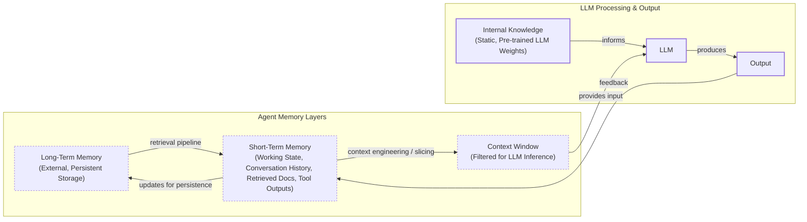

# How Does Memory for AI Agents Work?

In previous lessons, we built a foundation in AI engineering, from context engineering to agentic reasoning with ReAct. We have learned to design systems that think and plan; now, we will give them the ability to remember. The core problem is the fundamental limitation of LLMs: their knowledge is vast but frozen in time. They cannot learn by updating their weights after training, a problem known as “continual learning” [[1]](https://arxiv.org/html/2510.17281v2). An LLM without memory is like an intern with amnesia, unable to recall previous conversations or learn from experience.

To overcome this, we use the context window as “working memory,” but this is limited by rising costs and performance issues like the “lost in the middle” problem [[2]](https://arxiv.org/abs/2307.03172). Memory tools are the solution, providing agents with continuity and the ability to “learn” without retraining. This article will explore the types of agent memory, storage trade-offs, and practical implementation, concluding with real-world best practices.

## The Layers of Memory: Internal, Short-Term, and Long-Term

To build effective agents, we can borrow terms from biology and cognitive science to create a useful engineering framework [[3]](https://www.ibm.com/think/topics/ai-agent-memory). There are four distinct memory types based on their persistence and proximity to the model’s reasoning core.

**Internal Knowledge** is the static, pre-trained knowledge baked into the LLM’s weights. It is the best place to store general world knowledge.

**Short-Term Memory** is the active context window we pass to the LLM during a specific call. It acts as the RAM of the LLM and is the only “reality” the model sees during inference.

**Long-Term Memory** is the external, persistent storage system where an agent saves and retrieves information. This layer provides the personalization and context that internal knowledge lacks and short-term memory cannot retain [[4]](https://decodingml.substack.com/p/memory-the-secret-sauce-of-ai-agents).

The dynamic between these layers creates the agent’s intelligence. This is where Retrieval-Augmented Generation (RAG) comes into play, acting as the mechanism to pull relevant information from long-term memory into the short-term context. This retrieved information is then engineered to create the context window for the LLM.


Image 1: A flowchart illustrating the hierarchy and dynamic data flow between an AI agent's memory layers.

Categorizing memory this way is critical for engineering. Internal knowledge handles general reasoning, short-term memory manages the immediate task, and long-term memory provides personalization. To better understand long-term memory, we can further apply cognitive science definitions to specific data types [[5]](https://arxiv.org/html/2309.02427).

## Long-Term Memory: Semantic, Episodic, and Procedural

Long-term memory is not a single bucket of text. It consists of three distinct types, each serving a different role in making an agent “intelligent” [[5]](https://arxiv.org/html/2309.02427), [[6]](https://www.newsletter.swirlai.com/p/memory-in-agent-systems).

**Semantic Memory (Facts & Knowledge)** is the agent’s encyclopedia, storing facts like *“The user is a vegetarian”* or structured data like `{"music": "User likes rock music"}`. For an enterprise agent, this could be internal documents; for a personal assistant, it’s a user profile.

**Episodic Memory (Experiences & History)** is the agent’s personal diary, recording time-stamped events to capture *“what happened and when.”* For example, instead of just knowing a user is frustrated with their brother, it records the specific event: *“On Tuesday, the user expressed frustration that their brother, Mark, always forgets their birthday”* [[7]](https://www.youtube.com/watch?v=7AmhgMAJIT4&list=PLDV8PPvY5K8VlygSJcp3__mhToZMBoiwX&index=112). This allows for nuanced, empathetic responses and answers to temporal questions.

**Procedural Memory (Skills & How-To)** is the agent’s muscle memory for multi-step tasks. It stores learned workflows, often as reusable tools in the system prompt. For instance, a `MonthlyReportIntent` procedure would define the steps: 1) Query sales DB, 2) Summarize findings, 3) Email user. This makes the agent’s behavior reliable and predictable [[8]](https://arxiv.org/html/2508.06433v2).

Now that we have an idea of what to save, we must decide *how* to store it.

## Storing Memories: Pros and Cons of Different Approaches

The way an agent’s memories are stored is an architectural decision that impacts performance, complexity, and scalability. There is no one-size-fits-all solution [[9]](https://danielp1.substack.com/p/memex-20-memory-the-missing-piece).

**Storing memories as raw strings** is the simplest method. It preserves nuance but makes retrieval imprecise and updates difficult, often leading to contradictions. For example, a query for "brother's job" might pull up all past mentions, not the current one.

**Storing memories as entities** in formats like JSON allows for precise, structured retrieval (e.g., `"brother": {"job": "Software Engineer"}`). This is ideal for factual data but requires upfront schema design and can lose the original conversational nuance.

**Storing memories in a knowledge graph** is the most advanced, representing complex relationships explicitly (e.g., `(User) -> [HAS_BROTHER] -> (Mark)`). This provides superior contextual awareness and auditability but comes with the highest complexity and cost, making it overkill for simple use cases [[10]](https://www.digitalapplied.com/blog/agent-memory-architectures-vector-graph-episodic).

Regardless of the method, memory management must be autonomous. Users should not be asked to "garden their agent's memories," as this creates cognitive overhead [[7]](https://www.youtube.com/watch?v=7AmhgMAJIT4&list=PLDV8PPvY5K8VlygSJcp3__mhToZMBoiwX&index=112). The agent itself must handle updates and resolve conflicts, learning from corrections within the natural flow of conversation.

## Memory implementations with code examples

This section provides code examples using the `mem0` library to implement the different memory types. While RAG is the mechanism for retrieving information, creating high-quality memories is an equally important preceding step. We will cover RAG in the next lesson. For now, we will focus on memory creation using a simple "raw strings" storage approach.

<aside>
💡

You can find the code for this lesson in the Lesson 9 notebook in the course's GitHub repository.

</aside>

### Setup

`mem0` is an open-source memory library that allows us to implement different memory types. We will configure it to use Google's Gemini for embeddings and a local ChromaDB vector store.

1.  First, we configure `mem0` to use our Gemini model for LLM operations, Gemini embeddings, and a local ChromaDB vector store.
    ```python
    import os
    from typing import Optional
    
    from google import genai
    from mem0 import Memory
    
    # Assuming Gemini client and MODEL_ID are already configured
    
    MEM0_CONFIG = {
        "embedder": {
            "provider": "gemini",
            "config": {
                "model": "gemini-embedding-001",
                "embedding_dims": 768,
                "api_key": os.getenv("GOOGLE_API_KEY"),
            },
        },
        "vector_store": {
            "provider": "chroma",
            "config": {
                "collection_name": "lesson9_memories",
                "path": "/tmp/chroma_mem0",
            },
        },
        "llm": {
            "provider": "gemini",
            "config": {
                "model": MODEL_ID,
                "api_key": os.getenv("GOOGLE_API_KEY"),
            },
        },
    }
    
    memory = Memory.from_config(MEM0_CONFIG)
    MEM_USER_ID = "lesson9_notebook_student"
    memory.delete_all(user_id=MEM_USER_ID)
    ```
    It outputs:
    ```text
    ✅ Mem0 ready (Gemini embeddings + local Chroma).
    ```
2.  We then define helper functions to add and search for memories, including an optional category filter.
    ```python
    def mem_add_text(text: str, category: str = "semantic", **meta) -> str:
        """Add a single text memory. No LLM is used for extraction or summarization."""
        metadata = {"category": category}
        for k, v in meta.items():
            if isinstance(v, (str, int, float, bool)) or v is None:
                metadata[k] = v
            else:
                metadata[k] = str(v)
        memory.add(text, user_id=MEM_USER_ID, metadata=metadata, infer=False)
        return f"Saved {category} memory."
    
    
    def mem_search(query: str, limit: int = 5, category: Optional[str] = None) -> list[dict]:
        """Category-aware search wrapper."""
        res = memory.search(query, user_id=MEM_USER_ID, limit=limit) or {}
        items = res.get("results", [])
        if category is not None:
            items = [r for r in items if (r.get("metadata") or {}).get("category") == category]
        return items
    ```

### Semantic Memory: Extracting Facts

Semantic memory is created through an extraction pipeline where an LLM converts unstructured text into a queryable knowledge base. An LLM with a specific prompt extracts this data.

Example Extraction Prompt:
```
Extract persistent facts and strong preferences as short bullet points.
- Keep each fact atomic and context-independent. While reading the messages, make sure to notice the nuance or sublte details that might be important when saving these facts.
- 3–6 bullets max.

Text:
{My brother Mark is a software engineer, but his real passion is painting, he gifted me a painting a few years ago. Its really beautiful.}
```
The system would store: `Mark is the user's brother. Mark is a software engineer. Mark's real passion is painting. The user has a painting from Mark and finds it beautiful.`

1.  We insert a few example facts as atomic strings into our semantic memory.
    ```python
    facts: list[str] = [
        "User prefers vegetarian meals.",
        "User has a dog named George.",
        "User is allergic to gluten.",
        "User's brother is named Mark and is a software engineer.",
    ]
    for f in facts:
        print(mem_add_text(f, category="semantic"))
    ```
    It outputs:
    ```text
    Saved semantic memory.
    Saved semantic memory.
    Saved semantic memory.
    Saved semantic memory.
    ```
2.  Now, we can search with a natural language query to retrieve the relevant fact.
    ```python
    results = memory.search("brother job", user_id=MEM_USER_ID, limit=1)
    print(results["results"][0]["memory"])
    ```
    It outputs:
    ```text
    User's brother is named Mark and is a software engineer.
    ```

### Episodic Memory: The Log of Events

Episodic memory functions as a chronological log. An LLM can read conversation messages and summarize the key events, which are then stored with a timestamp.

1.  We define a short dialogue and use an LLM to generate a concise summary.
    ```python
    dialogue = [
        {"role": "user", "content": "I'm stressed about my project deadline on Friday."},
        {"role": "assistant", "content": "I’m here to help. What’s the blocker?"},
        {"role": "user", "content": "Mainly testing. I also prefer working at night."},
        {"role": "assistant", "content": "Okay, we can split testing into two sessions."},
    ]
    
    episodic_prompt = f"""Summarize the following 3–4 turns as one concise 'episode' (1–2 sentences).
    Keep salient details and tone.
    
    {dialogue}
    """
    episode_summary = client.models.generate_content(model=MODEL_ID, contents=episodic_prompt)
    episode = episode_summary.text.strip()
    ```
2.  We save this summary as an episodic memory, which includes an automatic timestamp from `mem0`.
    ```python
    print(
        mem_add_text(
            episode,
            category="episodic",
            summarized=True,
            turns=4,
        )
    )
    ```
    It outputs:
    ```text
    Saved episodic memory.
    ```
3.  Later, we can retrieve this "experience" using a semantic search.
    ```python
    hits = mem_search("deadline stress", limit=1, category="episodic")
    for h in hits:
        print(f"{h['memory']}\n")
    ```
    It outputs:
    ```text
    A user, stressed about a Friday project deadline because of testing and a preference for working at night, is advised to split the testing work into two manageable sessions.
    ```

### Procedural Memory: Defining and Learning Skills

Procedural memory can be developer-defined or learned from user interactions. More advanced agents can learn new procedures from user interactions.

Example Prompt:
```
You are an agent that can learn new skills. When a user provides a numbered list of steps to accomplish a goal, your task is to run the "learn_procedure" tool, and convert these numbered list of steps into a reusable procedure. Identify the core actions and any variable parameters (e.g., dates, locations, names).

Examples:
User Input: "I want you to book a cabin for this summer. To do that, please remember to: 1. Search for cabins on CabinRentals.com my favorite website. 2. Filter for locations in the mountains, the closer to them, the better. 3. Make sure it's available around July. 4 to 8th. 5. Send me the top 3 options."

learn_procedure(name="find_summer_cabin", steps=first search for cabins on CabinRentals.com, then filter for locations in the mountains, check for distance to the mountains, then check availability around what the user wants, if the user hasn't specified a date, ask the user for a date, once you have a list of options, send the top 3 options)
```
The LLM would generate a new structured procedure and save it to its library: `procedure_name: find_summer_cabin`, `steps=...`

1.  We define a procedure with ordered steps and save it as a single text block.
    ```python
    procedure_name = "monthly_report"
    steps = [
        "Query sales DB for the last 30 days.",
        "Summarize top 5 insights.",
        "Ask user whether to email or display.",
    ]
    procedure_text = f"Procedure: {procedure_name}\nSteps:\n" + "\n".join(f"{i + 1}. {s}" for i, s in enumerate(steps))
    
    mem_add_text(procedure_text, category="procedure", procedure_name=procedure_name)
    ```
2.  The agent can later retrieve this procedure by intent to execute the steps.
    ```python
    results = mem_search("how to create a monthly report", category="procedure", limit=1)
    if results:
        print(results[0]["memory"])
    ```
    It outputs:
    ```text
    Procedure: monthly_report
    Steps:
    1. Query sales DB for the last 30 days.
    2. Summarize top 5 insights.
    3. Ask user whether to email or display.
    ```

We have seen how to implement the different types of memories with `mem0`. Now, let's talk about some additional considerations when building a memory system.

## Real-World Lessons: Challenges and Best Practices

Moving from theory to a production-ready system requires navigating complex trade-offs that are constantly evolving. Here are important lessons learned from building and scaling agent memory systems.

**Re-evaluating compression** is a key lesson. Just two years ago, small and expensive context windows (e.g., 8k tokens) forced us to be ruthless with compression. We distilled interactions into compact summaries or facts. This process is inherently lossy and can lead to "summarization drift," where the compressed memory gradually diverges from what actually occurred [[11]](https://www.techaheadcorp.com/blog/agent-memory-state/). Today, with models offering million-token context windows, the best practice leans toward less compression. The raw, unstructured conversational history is the ultimate source of truth, containing emotional subtext and relational dynamics often lost during extraction [[7]](https://www.youtube.com/watch?v=7AmhgMAJIT4&list=PLDV8PPvY5K8VlygSJcp3__mhToZMBoiwX&index=112).

**Designing for the Product** is another critical practice. There is no "perfect" memory architecture. The concepts of semantic, episodic, and procedural memory are a toolkit, not a mandatory blueprint. The most common failure mode is over-engineering a complex system for a product that does not need it. The product's goal should dictate the memory architecture. For a Q&A bot, a simple RAG pipeline is a great start. For a long-term personal companion, rich episodic memories are beneficial. For a task-automation agent, procedural memory is likely useful.

## Conclusion

Memory is the component that transforms a stateless chat application into a personalized agent. It is the current engineering solution to the problem of continual learning. By constantly engineering the context window, we allow agents to “learn” and adapt over time. While memory tools are a temporary solution for true "continual learning," they are a practical approach that works today.

This lesson has equipped you with the foundational concepts of agent memory. In our next lesson, we will explore RAG in more detail, looking at how agents retrieve the knowledge we have so carefully stored. From there, we will move on to multimodal processing, using MCP for scalable agent architectures, and finally, the full lifecycle of productionizing, monitoring, and evaluating AI agents. These upcoming topics will build directly on the memory systems we have designed today, showing you how to create truly intelligent and reliable AI applications.

## References

- [1] https://arxiv.org/html/2510.17281v2
- [2] https://arxiv.org/abs/2307.03172
- [3] https://www.ibm.com/think/topics/ai-agent-memory
- [4] https://decodingml.substack.com/p/memory-the-secret-sauce-of-ai-agents
- [5] https://arxiv.org/html/2309.02427
- [6] https://www.newsletter.swirlai.com/p/memory-in-agent-systems
- [7] https://www.youtube.com/watch?v=7AmhgMAJIT4&list=PLDV8PPvY5K8VlygSJcp3__mhToZMBoiwX&index=112
- [8] https://arxiv.org/html/2508.06433v2
- [9] https://danielp1.substack.com/p/memex-20-memory-the-missing-piece
- [10] https://www.digitalapplied.com/blog/agent-memory-architectures-vector-graph-episodic
- [11] https://www.techaheadcorp.com/blog/agent-memory-state/
- [12] https://arxiv.org/html/2601.08160v1
- [13] https://arxiv.org/html/2601.01280v1
- [14] https://arxiv.org/html/2504.19413
- [15] https://arxiv.org/html/2603.11768v1
- [16] https://towardsdatascience.com/a-practical-guide-to-memory-for-autonomous-llm-agents/