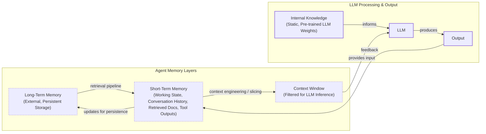

# How Does Memory for AI Agents Work?

In our previous lessons, we built a foundation in AI engineering, covering everything from context engineering and structured outputs to agentic reasoning with ReAct. We have learned how to design systems that think and plan. Now, we will give them the ability to remember.

One year ago, we faced a challenge that many AI builders encounter: how do we give our agent access to the right information at the right time? Like most teams, we jumped straight into building a complex Retrieval-Augmented Generation (RAG) system. Our ingestion pipeline became incredibly heavy, introducing unnecessary complexity. At query time, our agent would zigzag through 10 to 20 retrieval steps. The latency was terrible, costs were high, and debugging was a nightmare. We dropped the entire RAG layer in favor of smart context window engineering. Everything became faster, cheaper, and more reliable. This experience taught us that the fundamental challenge in building AI agents is not just about retrieval. It is about understanding how to architect memory systems that match your actual use case.

The core problem we are solving is the fundamental limitation of LLMs: their knowledge is vast but frozen in time. They are unable to learn by updating their weights after training, a problem known as “continual learning” [[1]](https://arxiv.org/html/2510.17281v2). An LLM without memory is like an intern with amnesia. They might be brilliant, but they cannot recall previous conversations or learn from experience.

To overcome this, we use the context window as a form of “working memory.” However, keeping an entire conversation thread in the context window is often unrealistic. Rising costs and the “lost in the middle” problem—where models struggle to use information buried in a long prompt—limit this approach [[2]](https://arxiv.org/abs/2307.03172). While context windows are increasing, relying solely on them introduces noise and overhead. Memory tools act as the solution. They provide agents with continuity, adaptability, and the ability to “learn” without retraining. When we first started building agents, working with 8k or 16k token limits forced us to engineer complex compression systems. Today, we have more breathing room, but the principles of organizing memory remain essential for performance.

In this article, we will explore:

1.  The fundamental types of memory for AI agents.
2.  A detailed look at long-term memory: Semantic, Episodic, and Procedural.
3.  The trade-offs between storing memories as strings, entities, or knowledge graphs.
4.  How to implement these memory types with code examples.
5.  Real-world challenges and best practices for designing memory systems.

## The Layers of Memory: Internal, Short-Term, and Long-Term

To build effective agents, we must distinguish between the different places information lives. Borrowing terms from biology and cognitive science provides a useful framework for engineering these layers [[3]](https://www.ibm.com/think/topics/ai-agent-memory).

There are four distinct memory types based on their persistence and proximity to the model’s reasoning core.

**Internal Knowledge** is the static, pre-trained knowledge baked into the LLM’s weights. It is the best place to store general world knowledge—models know entire books without needing them in the context window. However, this memory is frozen at the time of training.

**Short-Term Memory** is the active context window we pass to the LLM during a specific call. It acts as the RAM of the LLM and is the only “reality” the model sees during inference. It is volatile and fast, simulating the feeling of “learning” during a session.

**Long-Term Memory** is the external, persistent storage system where an agent saves and retrieves information. This layer provides the personalization and context that internal knowledge lacks and short-term memory cannot retain [[4]](https://decodingml.substack.com/p/memory-the-secret-sauce-of-ai-agents).

The dynamic between these layers creates the agent’s intelligence. First, part of the long-term memory is “retrieved” and brought into short-term memory through a retrieval pipeline. Next, we slice the short-term memory into an active context window through context engineering. Finally, during inference, the LLM uses its internal weights plus the active context window to generate output.


Image 1: A flowchart illustrating the hierarchy and dynamic data flow between an AI agent's memory layers.

Categorizing memory this way is critical for engineering. Internal knowledge handles general reasoning. Short-term memory manages the immediate task. Long-term memory handles personalization and continuity. No single layer can perform all three functions effectively. To better understand long-term memory, we can further apply cognitive science definitions to specific data types [[5]](https://arxiv.org/html/2309.02427).

## Long-Term Memory: Semantic, Episodic, and Procedural

Long-term memory is not a single bucket of text. It consists of three distinct types, each serving a different role in making an agent “intelligent” [[5]](https://arxiv.org/html/2309.02427), [[6]](https://www.newsletter.swirlai.com/p/memory-in-agent-systems).

**Semantic Memory (Facts & Knowledge)** is the agent’s encyclopedia. It stores individual pieces of knowledge or “facts.” These can be independent strings, such as *“The user is a vegetarian,”* or structured attributes attached to an entity, like `{"food restrictions": "User is a vegetarian"}`. This is where the agent stores concepts and relationships regarding specific domains, people, or places. The primary role of semantic memory is to provide a reliable source of truth. For an enterprise agent, this might involve storing internal company documents. For a personal assistant, semantic memory builds a persistent user profile, recalling preferences like `{"music": "User likes rock music"}`.

**Episodic Memory (Experiences & History)** is the agent’s personal diary. It records past interactions, but unlike timeless facts, these memories have a timestamp. It captures *“what happened and when.”* This memory type is essential for maintaining conversational context. A semantic fact might be *“User is frustrated with his brother.”* An episodic memory would be: *“On Tuesday, the user expressed frustration that their brother, Mark, always forgets their birthday. I provided an empathetic response. [created_at=2025-08-25].”* This “episode” provides nuanced context. If the topic comes up again, the agent can say, “I know the topic of your brother’s birthday can be sensitive.” It also allows the agent to answer questions like *“What happened last week?”* [[10]](https://www.youtube.com/watch?v=7AmhgMAJIT4&list=PLDV8PPvY5K8VlygSJcp3__mhToZMBoiwX&index=112).

**Procedural Memory (Skills & How-To)** is the agent’s muscle memory. It consists of skills, learned workflows, and “how-to” knowledge. It dictates the agent’s ability to perform multi-step tasks. This memory is often baked into the agent’s system prompt as reusable tools or defined sequences. For example, an agent might store a `MonthlyReportIntent` procedure. When a user asks for a report, the agent retrieves this procedure: 1) Query sales DB, 2) Summarize findings, 3) Email user. This makes behavior reliable and predictable. It encodes successful workflows so the agent does not have to reason from scratch every time [[7]](https://arxiv.org/html/2508.06433v2).

Now that we know what to save, we must decide *how* to store it.

## Storing Memories: Pros and Cons of Different Approaches

The way an agent’s memories are stored is an architectural decision that impacts performance, complexity, and scalability. There is no one-size-fits-all solution; the ideal approach depends on the product's use case. Let’s explore the three primary methods [[8]](https://danielp1.substack.com/p/memex-20-memory-the-missing-piece).

Each approach excels at different tasks. Vector-based memory (raw strings) is fastest for recent, semantically similar facts. Episodic systems provide a coherent narrative across long sessions at the cost of latency. Graph memory wins when queries depend on complex entity relationships or temporal reasoning that a vector store cannot express [[11]](https://www.digitalapplied.com/blog/agent-memory-architectures-vector-graph-episodic).

| Approach | Pros | Cons |
| :--- | :--- | :--- |
| **Raw Strings** | Simple and fast to set up. Preserves nuance and emotional tone. | Imprecise retrieval (e.g., "brother's job"). Difficult to update, leading to contradictions. Prone to latency bottlenecks from exhaustive retrieval as memory grows [[12]](https://arxiv.org/html/2601.08160v1). |
| **Entities (JSON)** | Precise, field-level filtering. Easy to update specific fields. Ideal for semantic memory like user profiles. | Requires upfront schema design. Can be rigid and may lose information that doesn't fit the schema. Loses original conversational nuance (e.g., "petting my cat"). |
| **Knowledge Graph** | Excels at representing complex relationships. Superior contextual and temporal awareness. Auditable and explainable retrieval paths. | Highest complexity and cost. Extracting graph triples is computationally expensive and difficult [[13]](https://arxiv.org/html/2601.01280v1). Queries can be slower than vector lookups. Often overkill for simple use cases. |
Table 1: A comparison of the three primary methods for storing agent memories.

The choice should be guided by your product’s needs. Start simple and evolve as complexity grows.

## Memory implementations with code examples

This section provides code examples using the `mem0` library to implement the different memory types. While RAG is the mechanism for retrieving information, creating high-quality memories is an equally important preceding step. We will cover RAG in the next lesson. For now, we will focus on memory creation using a simple "raw strings" storage approach.

<aside>
💡

You can find the code for this lesson in the Lesson 9 notebook in the course's GitHub repository.

</aside>

### Setup

`mem0` is an open-source memory library that allows us to implement different memory types. We will configure it to use Google's Gemini for embeddings and a local ChromaDB vector store.

1.  First, we configure `mem0` to use our Gemini model for LLM operations, Gemini embeddings, and a local ChromaDB vector store.
    ```python
    import os
    from typing import Optional
    
    from google import genai
    from mem0 import Memory
    
    # Assuming Gemini client and MODEL_ID are already configured
    
    MEM0_CONFIG = {
        "embedder": {
            "provider": "gemini",
            "config": {
                "model": "gemini-embedding-001",
                "embedding_dims": 768,
                "api_key": os.getenv("GOOGLE_API_KEY"),
            },
        },
        "vector_store": {
            "provider": "chroma",
            "config": {
                "collection_name": "lesson9_memories",
                "path": "/tmp/chroma_mem0",
            },
        },
        "llm": {
            "provider": "gemini",
            "config": {
                "model": MODEL_ID,
                "api_key": os.getenv("GOOGLE_API_KEY"),
            },
        },
    }
    
    memory = Memory.from_config(MEM0_CONFIG)
    MEM_USER_ID = "lesson9_notebook_student"
    memory.delete_all(user_id=MEM_USER_ID)
    ```
    It outputs:
    ```text
    ✅ Mem0 ready (Gemini embeddings + local Chroma).
    ```
2.  We then define helper functions to add and search for memories, including an optional category filter.
    ```python
    def mem_add_text(text: str, category: str = "semantic", **meta) -> str:
        """Add a single text memory. No LLM is used for extraction or summarization."""
        metadata = {"category": category}
        for k, v in meta.items():
            if isinstance(v, (str, int, float, bool)) or v is None:
                metadata[k] = v
            else:
                metadata[k] = str(v)
        memory.add(text, user_id=MEM_USER_ID, metadata=metadata, infer=False)
        return f"Saved {category} memory."
    
    
    def mem_search(query: str, limit: int = 5, category: Optional[str] = None) -> list[dict]:
        """Category-aware search wrapper."""
        res = memory.search(query, user_id=MEM_USER_ID, limit=limit) or {}
        items = res.get("results", [])
        if category is not None:
            items = [r for r in items if (r.get("metadata") or {}).get("category") == category]
        return items
    ```

### Semantic Memory: Extracting Facts

Semantic memory is created through an extraction pipeline. An LLM prompt is designed to pull out factual data from unstructured text. This turns messy conversation threads into a queryable knowledge base.

1.  We insert a few example facts as atomic strings into our semantic memory.
    ```python
    facts: list[str] = [
        "User prefers vegetarian meals.",
        "User has a dog named George.",
        "User is allergic to gluten.",
        "User's brother is named Mark and is a software engineer.",
    ]
    for f in facts:
        print(mem_add_text(f, category="semantic"))
    ```
    It outputs:
    ```text
    Saved semantic memory.
    Saved semantic memory.
    Saved semantic memory.
    Saved semantic memory.
    ```
2.  Now, we can search with a natural language query to retrieve the relevant fact.
    ```python
    results = memory.search("brother job", user_id=MEM_USER_ID, limit=1)
    print(results["results"][0]["memory"])
    ```
    It outputs:
    ```text
    User's brother is named Mark and is a software engineer.
    ```

### Episodic Memory: The Log of Events

Episodic memory functions as a chronological log of events, often created by having an LLM summarize interactions over a period.

1.  We define a short dialogue and use an LLM to generate a concise summary.
    ```python
    dialogue = [
        {"role": "user", "content": "I'm stressed about my project deadline on Friday."},
        {"role": "assistant", "content": "I’m here to help—what’s the blocker?"},
        {"role": "user", "content": "Mainly testing. I also prefer working at night."},
        {"role": "assistant", "content": "Okay, we can split testing into two sessions."},
    ]
    
    episodic_prompt = f"""Summarize the following 3–4 turns as one concise 'episode' (1–2 sentences).
    Keep salient details and tone.
    
    {dialogue}
    """
    episode_summary = client.models.generate_content(model=MODEL_ID, contents=episodic_prompt)
    episode = episode_summary.text.strip()
    ```
2.  We save this summary as an episodic memory, which includes an automatic timestamp from `mem0`.
    ```python
    print(
        mem_add_text(
            episode,
            category="episodic",
            summarized=True,
            turns=4,
        )
    )
    ```
    It outputs:
    ```text
    Saved episodic memory.
    ```
3.  Later, we can retrieve this "experience" using a semantic search.
    ```python
    hits = mem_search("deadline stress", limit=1, category="episodic")
    for h in hits:
        print(f"{h['memory']}\n")
    ```
    It outputs:
    ```text
    A user, stressed about a Friday project deadline because of testing and a preference for working at night, is advised to split the testing work into two manageable sessions.
    ```

### Procedural Memory: Defining and Learning Skills

Procedural memory can be defined by a developer or learned from user interactions. Here, we will define a simple procedure.

1.  We define a procedure with ordered steps and save it as a single text block.
    ```python
    procedure_name = "monthly_report"
    steps = [
        "Query sales DB for the last 30 days.",
        "Summarize top 5 insights.",
        "Ask user whether to email or display.",
    ]
    procedure_text = f"Procedure: {procedure_name}\nSteps:\n" + "\n".join(f"{i + 1}. {s}" for i, s in enumerate(steps))
    
    mem_add_text(procedure_text, category="procedure", procedure_name=procedure_name)
    ```
2.  The agent can later retrieve this procedure by intent to execute the steps.
    ```python
    results = mem_search("how to create a monthly report", category="procedure", limit=1)
    if results:
        print(results[0]["memory"])
    ```
    It outputs:
    ```text
    Procedure: monthly_report
    Steps:
    1. Query sales DB for the last 30 days.
    2. Summarize top 5 insights.
    3. Ask user whether to email or display.
    ```

We have seen how to implement the different types of memories with `mem0`. Now, let's talk about some additional considerations when building a memory system.

## Real-World Lessons: Challenges and Best Practices

Moving from theory to a production-ready system requires navigating complex trade-offs that are constantly evolving with technology. Here are important lessons learned from building and scaling agent memory systems.

### Re-evaluating compression

One of the biggest changes in memory design has been the trade-off between compressing information and preserving its raw detail. Just two years ago, LLMs operated with small and expensive context windows (e.g., 8k or 16k tokens). This forced us to be ruthless with compression, distilling interactions into compact summaries or facts. This process, however, is inherently lossy, which can lead to "summarization drift" where memory diverges from reality over time [[14]](https://www.techaheadcorp.com/blog/agent-memory-state/). Today, with models offering million-token context windows at a fraction of the cost, the considerations have changed. The best practice now leans toward less compression. The raw, unstructured conversational history is the ultimate source of truth, containing emotional subtext and relational dynamics often lost during extraction [[10]](https://www.youtube.com/watch?v=7AmhgMAJIT4&list=PLDV8PPvY5K8VlygSJcp3__mhToZMBoiwX&index=112). A fact might state, "User has a dog named George," but the raw log reveals, "User mentioned that walking their dog named George is the best part of their day," a far more valuable insight for a personalized agent.

### Designing for the Product

There is no "perfect" memory architecture. The concepts of semantic, episodic, and procedural memory are a powerful mental model, but they are a toolkit, not a mandatory blueprint. The most common failure mode is over-engineering a complex system for a product that does not need it. The product's goal should dictate the memory architecture, not the other way around.

-   For a Q&A bot over internal documents, a simple RAG pipeline is the best starting point.
-   For a long-term personal AI companion, rich episodic memories that include a time element are beneficial.
-   For a task-automation agent, procedural memory is likely useful, allowing the agent to recall and execute multi-step workflows.

### The Human Factor

Memory exists to make the agent smarter, not to give the user a new job. A common pitfall is exposing the internal workings of the memory system, thinking it improves transparency. In practice, it often creates significant cognitive overhead. Users should not be asked to "garden their agent's memories." This breaks the illusion of a capable assistant and turns the interaction into a tedious data-entry task [[10]](https://www.youtube.com/watch?v=7AmhgMAJIT4&list=PLDV8PPvY5K8VlygSJcp3__mhToZMBoiwX&index=112). Memory management should be an autonomous function. The agent should learn from corrections within the natural flow of conversation (e.g., "Actually, my brother's name is Mark, not Mike"). The agent, not the user, is responsible for maintaining the integrity of its own knowledge. However, this autonomy creates alignment risks like "goal drift," where the agent's behavior shifts away from its original intent due to accumulated biases [[15]](https://arxiv.org/html/2603.11768v1).

Memory systems must also manage knowledge integrity. Stale information can lead to harmful actions, while contradictions cause erratic behavior. This can escalate to self-reinforcing errors, where an agent rejects correct information because it conflicts with a single flawed memory it holds as truth [[16]](https://towardsdatascience.com/a-practical-guide-to-memory-for-autonomous-llm-agents/).

## Conclusion

Memory is the component that transforms a stateless chat application into a personalized agent. It is the current engineering solution to the problem of continual learning. By constantly engineering the context window, we allow agents to “learn” and adapt over time. While memory tools are a temporary solution for true "continual learning," they are a practical approach that works today.

This lesson has equipped you with the foundational concepts of agent memory. In our next lesson, we will dive deeper into RAG, exploring how agents retrieve the knowledge we have so carefully stored. We will also cover multimodal processing, MCP for scalable agent architectures, and the full lifecycle of productionizing, monitoring, and evaluating AI agents.

## References

- [1] Wang, L., Zhang, X., Su, H., & Zhu, J. (2025). A Comprehensive Survey of Continual Learning. arXiv preprint arXiv:2302.00487. [https://arxiv.org/html/2510.17281v2](https://arxiv.org/html/2510.17281v2)
- [2] Liu, N. F., Lin, K., Hewitt, J., Paranjape, A., Bevilacqua, M., Petroni, F., & Liang, P. (2023). Lost in the Middle: How Language Models Use Long Contexts. arXiv preprint arXiv:2307.03172. [https://arxiv.org/abs/2307.03172](https://arxiv.org/abs/2307.03172)
- [3] What is AI agent memory?. (n.d.). IBM. [https://www.ibm.com/think/topics/ai-agent-memory](https://www.ibm.com/think/topics/ai-agent-memory)
- [4] Iusztin, P. (2024, May 21). Memory: The secret sauce of AI agents. Decoding AI Magazine. [https://decodingml.substack.com/p/memory-the-secret-sauce-of-ai-agents](https://decodingml.substack.com/p/memory-the-secret-sauce-of-ai-agents)
- [5] Sumers, T. R., Yao, S., Narasimhan, K., & Griffiths, T. L. (2023). Cognitive Architectures for Language Agents. arXiv. [https://arxiv.org/html/2309.02427](https://arxiv.org/html/2309.02427)
- [6] Griciūnas, A. (2024, October 30). Memory in Agent Systems. SwirlAI Newsletter. [https://www.newsletter.swirlai.com/p/memory-in-agent-systems](https://www.newsletter.swirlai.com/p/memory-in-agent-systems)
- [7] Mem^p: A Framework for Procedural Memory in Agents. (n.d.). arXiv. [https://arxiv.org/html/2508.06433v2](https://arxiv.org/html/2508.06433v2)
- [8] Chalef, D. (2024, June 25). Memex 2.0: Memory The Missing Piece for Real Intelligence. Substack. [https://danielp1.substack.com/p/memex-20-memory-the-missing-piece](https://danielp1.substack.com/p/memex-20-memory-the-missing-piece)
- [9] Chhikara, P. (2025). Mem0: Building Production-Ready AI Agents with Scalable Long-Term Memory. arXiv. [https://arxiv.org/html/2504.19413](https://arxiv.org/html/2504.19413)
- [10] Whitmore, S. (2025, June 18). What is the perfect memory architecture?. YouTube. [https://www.youtube.com/watch?v=7AmhgMAJIT4&list=PLDV8PPvY5K8VlygSJcp3__mhToZMBoiwX&index=112](https://www.youtube.com/watch?v=7AmhgMAJIT4&list=PLDV8PPvY5K8VlygSJcp3__mhToZMBoiwX&index=112)
- [11] Agent Memory Architectures. (n.d.). Digital Applied. [https://www.digitalapplied.com/blog/agent-memory-architectures-vector-graph-episodic](https://www.digitalapplied.com/blog/agent-memory-architectures-vector-graph-episodic)
- [12] Al-shedivat, M., & Zhao, T. (2026). Causality-aware Conversational Recommender Systems. arXiv. [https://arxiv.org/html/2601.08160v1](https://arxiv.org/html/2601.08160v1)
- [13] Wang, C., et al. (2026). Graph-based Memories for Large Language Models. arXiv. [https://arxiv.org/html/2601.01280v1](https://arxiv.org/html/2601.01280v1)
- [14] Agent Memory and State Management. (n.d.). TechAhead. [https://www.techaheadcorp.com/blog/agent-memory-state/](https://www.techaheadcorp.com/blog/agent-memory-state/)
- [15] Park, J. S., et al. (2026). Memory Governance for Trustworthy Autonomous Agents. arXiv. [https://arxiv.org/html/2603.11768v1](https://arxiv.org/html/2603.11768v1)
- [16] Lawson, N. (2026, April 17). A Practical Guide to Memory for Autonomous LLM Agents. Towards Data Science. [https://towardsdatascience.com/a-practical-guide-to-memory-for-autonomous-llm-agents/](https://towardsdatascience.com/a-practical-guide-to-memory-for-autonomous-llm-agents/)