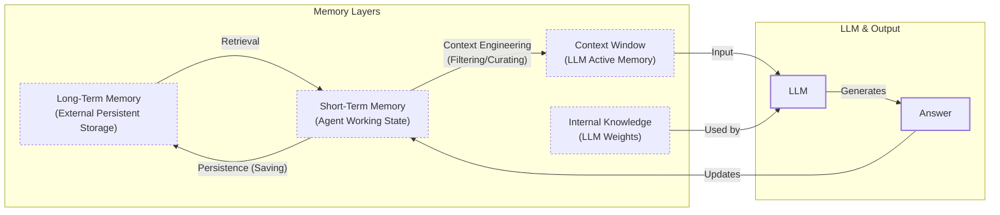
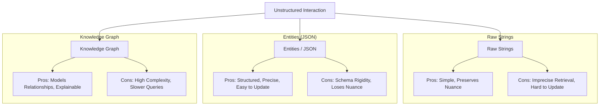

# How Does Memory for AI Agents Work?

In our previous lessons, we built a foundation in AI Engineering, covering context engineering, structured outputs, and building agents that can reason and use tools. As we build more complex applications, a core challenge emerges: making agents that remember. An agent without memory is like an intern with amnesia. They cannot recall previous conversations or learn from experience because LLMs are fundamentally stateless. Their knowledge is vast but frozen in time, unable to update after training—a problem known as “continual learning” [[1]](https://arxiv.org/html/2510.17281v2).

We use the context window as a “working memory,” but this is a limited solution. Rising costs and the “lost in the middle” problem, where models ignore information in long prompts, make large contexts inefficient [[2]](https://arxiv.org/abs/2307.03172). Memory tools provide the continuity and adaptability agents need. In this article, we will explore the fundamental layers of agent memory, detail the types of long-term memory, and weigh the trade-offs of different storage approaches. We will walk through a hands-on implementation and discuss real-world best practices. To start, how can we think about memory in a useful way to build agents? We can borrow concepts from biology and cognitive science to understand how memory works in humans.

## The Layers of Memory: Internal, Short-Term, and Long-Term

To build effective agents, we can borrow terms from cognitive science to categorize memory into three layers [[3]](https://arxiv.org/html/2309.02427).

**Internal Knowledge** is the static, pre-trained information in the LLM’s weights. It is powerful for general reasoning but frozen at the time of training.

**Short-Term Memory** is the agent's working state, or RAM. It holds the current conversation and retrieved data, which is then filtered into the context window for a single LLM call [[4]](https://www.ibm.com/think/topics/ai-agent-memory).

**Long-Term Memory** is the external, persistent storage, or disk. It provides continuity and personalization across sessions by saving and retrieving information as needed [[5]](https://decodingml.substack.com/p/memory-the-secret-sauce-of-ai-agents).



Image 1: A flowchart illustrating the hierarchical relationship and dynamic data flow between an AI agent's memory layers.

The dynamic is simple: information is retrieved from long-term memory into short-term memory, engineered into the context window, and then used by the LLM. To better understand long-term memory, we can break it down further.

## Long-Term Memory: Semantic, Episodic, and Procedural

Long-term memory is not a single bucket of text. It consists of three distinct types, each serving a different role in making an agent “intelligent” [[3]](https://arxiv.org/html/2309.02427), [[6]](https://www.newsletter.swirlai.com/p/memory-in-agent-systems).

**Semantic Memory (Facts & Knowledge)** is the agent’s encyclopedia. It stores individual pieces of knowledge or “facts,” such as *“The user is a vegetarian”* or `{"dog": "User has a dog named George"}`. This memory provides a reliable source of truth, allowing an agent to recall user preferences or domain-specific information without searching a noisy conversation history.

**Episodic Memory (Experiences & History)** is the agent’s personal diary. It records past interactions with a timestamp, capturing *“what happened and when.”* A semantic fact might be *“User is frustrated with his brother,”* but an episodic memory adds context: *“On Tuesday, the user expressed frustration that their brother, Mark, always forgets their birthday.”* This allows for more nuanced and empathetic interactions over time [[7]](https://www.youtube.com/watch?v=7AmhgMAJIT4&list=PLDV8PPvY5K8VlygSJcp3__mhToZMBoiwX&index=112).

**Procedural Memory (Skills & How-To)** is the agent’s muscle memory. It contains learned workflows and “how-to” knowledge, often encoded as reusable tools or defined action sequences. For example, a `MonthlyReportIntent` procedure would define the steps: 1) Query sales DB, 2) Summarize findings, 3) Email user. This makes the agent’s behavior on common tasks reliable and predictable [[8]](https://arxiv.org/html/2508.06433v2).

Now that we have an idea of what to save and the benefits of specific memory types, we must decide *how* to store it. What are the trade-offs between different approaches?

## Storing Memories: Pros and Cons of Different Approaches

The way an agent’s memories are stored is an architectural decision that impacts performance, complexity, and scalability. There is no one-size-fits-all solution; the ideal approach depends on the product's use case. Let's explore the trade-offs of three primary methods.



Image 2: A diagram visualizing the trade-offs between the three primary memory storage approaches.

**Storing memories as raw strings** is the simplest method. It is fast to set up and preserves the full nuance of interactions. However, retrieval can be imprecise, and updating facts is difficult, often leading to contradictions. For example, a query for "brother's job" might return multiple, conflicting past conversations [[9]](https://www.decodingai.com/p/how-does-memory-for-ai-agents-work).

**Storing memories as entities (JSON-like structures)** offers precision and easy updates. By transforming interactions into structured data like `{"brother": {"job": "Software Engineer"}}`, agents can retrieve specific facts without ambiguity. The downside is the upfront complexity of schema design, which can be rigid. This process can also strip away conversational nuance; the factual memory `"user_likes": ["cats"]` is far less representative than the original message, "Petting my cat is the best part of my day" [[10]](https://danielp1.substack.com/p/memex-20-memory-the-missing-piece).

**Storing memories in a knowledge graph** is the most advanced approach, excelling at representing complex relationships and temporal events. This method provides superior contextual awareness and auditability, as reasoning paths like `(User) -> [HAS_BROTHER] -> (Mark)` are explicit. However, it comes with the highest complexity and cost, making it overkill for simpler use cases where graph traversals might be slower than simple vector lookups [[11]](https://www.octoco.ai/blog/knowledge-graphs-as-memory).

A key part of managing memory is handling updates and conflicts. When new information contradicts old facts, the system needs a way to resolve it. This is not just a technical problem but also a user experience one. The agent, not the user, should be responsible for maintaining the integrity of its own knowledge.

The choice should be guided by your product’s needs. Start simple and evolve as complexity grows. Now that we know what to save and how to store it, let's look at some code examples using available memory tools.

## Memory Implementations with Code Examples

Let's look at how to implement these memory types. While RAG is the mechanism for *retrieving* information, a topic for our next lesson, the creation of high-quality memories is an equally important, preceding step. We will use the `mem0` open-source library to demonstrate a simple "raw string" storage approach. `mem0` is a memory layer for AI agents that can be configured with different LLMs, embedding models, and vector stores [[12]](https://arxiv.org/html/2504.19413).

### Setup

First, we will set up our environment. We will use Gemini for the LLM and embeddings, with a local ChromaDB instance for storage.

1.  We configure `mem0` with Gemini models and a local ChromaDB vector store.

    ```python
    import os
    from typing import Optional
    from google import genai
    from mem0 import Memory
    
    # Assumes GOOGLE_API_KEY is set in the environment
    client = genai.Client()
    MODEL_ID = "gemini-1.5-flash"
    
    MEM0_CONFIG = {
        "embedder": {
            "provider": "gemini",
            "config": { "model": "text-embedding-004" },
        },
        "vector_store": {
            "provider": "chroma",
            "config": { "path": "/tmp/chroma_mem0" },
        },
        "llm": {
            "provider": "gemini",
            "config": { "model": MODEL_ID },
        },
    }
    
    memory = Memory.from_config(MEM0_CONFIG)
    MEM_USER_ID = "student_1"
    memory.delete_all(user_id=MEM_USER_ID)
    ```

2.  We define helper functions to add and search for memories, tagging each with a category.

    ```python
    def mem_add_text(text: str, category: str = "semantic", **meta) -> str:
        """Add a single text memory without LLM-based fact extraction."""
        metadata = {"category": category, **meta}
        memory.add(text, user_id=MEM_USER_ID, metadata=metadata, infer=False)
        return f"Saved {category} memory."
    
    def mem_search(query: str, limit: int = 5, category: Optional[str] = None) -> list[dict]:
        """Search memories, with optional client-side category filtering."""
        res = memory.search(query, user_id=MEM_USER_ID, limit=limit) or {}
        items = res.get("results", [])
        if category:
            items = [r for r in items if r.get("metadata", {}).get("category") == category]
        return items
    ```

### Semantic Memory: Extracting Facts

Semantic memory is created through a deliberate extraction pipeline. After a conversation, the unstructured text is passed to an LLM with a prompt designed to extract factual data. This process turns messy conversation threads into a queryable knowledge base. Retrieval often uses a hybrid search, combining keyword filtering for known entities with a vector search for semantic relevance.

1.  We insert a few facts about the user into our semantic memory.

    ```python
    facts: list[str] = [
        "User prefers vegetarian meals.",
        "User has a dog named George.",
        "User is allergic to gluten.",
        "User's brother is named Mark and is a software engineer.",
    ]
    for f in facts:
        mem_add_text(f, category="semantic")
    ```

2.  Now, we can search for this specific information using a natural language query.

    ```python
    results = memory.search("brother job", user_id=MEM_USER_ID, limit=1)
    print(results["results"][0]["memory"])
    ```

    It outputs:

    ```text
    User's brother is named Mark and is a software engineer.
    ```

### Episodic Memory: The Log of Events

Episodic memory functions as a chronological log of events. An LLM can read conversation messages and summarize the key insights, facts, or events that occurred, which are then stored with a timestamp. Retrieval from episodic memory is often a blend of temporal and semantic queries. A simple retrieval might filter by a date range, while a more robust approach uses semantic search to find similar conversations and then re-ranks the results by recency.

1.  We define a short dialogue and use an LLM to summarize it into a concise episode.

    ```python
    dialogue = [
        {"role": "user", "content": "I'm stressed about my project deadline on Friday."},
        {"role": "assistant", "content": "I’m here to help—what’s the blocker?"},
        {"role": "user", "content": "Mainly testing. I also prefer working at night."},
        {"role": "assistant", "content": "Okay, we can split testing into two sessions."},
    ]
    
    episodic_prompt = f"Summarize the following turns as one concise 'episode' (1–2 sentences).\n\n{dialogue}"
    episode_summary = client.models.generate_content(model=MODEL_ID, contents=episodic_prompt)
    episode = episode_summary.text.strip()
    ```

2.  We save this summary as an episodic memory, along with metadata about the interaction.

    ```python
    mem_add_text(episode, category="episodic", summarized=True, turns=4)
    ```

3.  Later, we can search for this "experience" to recall the context of that interaction.

    ```python
    hits = mem_search("deadline stress", limit=1, category="episodic")
    print(f"{hits[0]['memory']}\n")
    ```

    It outputs:

    ```text
    A user, stressed about a Friday project deadline because of testing and a preference for working at night, is advised to split the testing work into two manageable sessions.
    ```

### Procedural Memory: Defining and Learning Skills

Procedural memory can be created by developers or learned from user interactions. Retrieval is an intent-matching and function-calling process. The agent receives descriptions of all available procedures in its context and compares the user's request against them to find a semantic match. If a match is found, it executes the corresponding procedure.

1.  We define a multi-step procedure as a text block.

    ```python
    procedure_name = "monthly_report"
    steps = [
        "Query sales DB for the last 30 days.",
        "Summarize top 5 insights.",
        "Ask user whether to email or display.",
    ]
    procedure_text = f"Procedure: {procedure_name}\nSteps:\n" + "\n".join(f"{i + 1}. {s}" for i, s in enumerate(steps))
    
    mem_add_text(procedure_text, category="procedure", procedure_name=procedure_name)
    ```

2.  When the user's intent matches the procedure, the agent can retrieve and execute it.

    ```python
    results = mem_search("how to create a monthly report", category="procedure", limit=1)
    if results:
        print(results[0]["memory"])
    ```

    It outputs:

    ```text
    Procedure: monthly_report
    Steps:
    1. Query sales DB for the last 30 days.
    2. Summarize top 5 insights.
    3. Ask user whether to email or display.
    ```

## Real-World Lessons: Challenges and Best Practices

Moving from these examples to a reliable, production-ready system requires navigating complex trade-offs that are constantly evolving with the technology. Here are some of the most important lessons learned from building and scaling agent memory systems.

One of the biggest changes has been **re-evaluating compression**. Just two years ago, small context windows forced ruthless compression, which is inherently lossy. Today, with million-token contexts, the best practice is to lean towards less compression. The raw conversational history is the ultimate source of truth, containing emotional subtext that extraction often misses [[7]](https://www.youtube.com/watch?v=7AmhgMAJIT4&list=PLDV8PPvY5K8VlygSJcp3__mhToZMBoiwX&index=112). Design your system to work with the most complete version of history that is feasible.

Another key lesson is **designing for the product**. There is no "perfect" memory architecture. The most common failure is over-engineering a system for a product that does not need it. The product's goal should dictate the memory architecture, not the other way around [[13]](https://machinelearningmastery.com/beyond-short-term-memory-the-3-types-of-long-term-memory-ai-agents-need/).
-   For a Q&A bot over internal documents, a simple RAG pipeline is the best starting point.
-   For a long-term personal AI companion, rich episodic memories are beneficial to capture the narrative of your relationship.
-   For a task-automation agent, procedural memories are key, allowing the agent to recall and execute multi-step workflows reliably.

Finally, consider **the human factor**. Memory exists to make the agent smarter, not to give the user a new job. Users should not be asked to "garden their agent's memories" [[7]](https://www.youtube.com/watch?v=7AmhgMAJIT4&list=PLDV8PPvY5K8VlygSJcp3__mhToZMBoiwX&index=112). This breaks the illusion of a capable assistant. Memory management should be an autonomous function, with the agent learning from corrections in the natural flow of conversation [[14]](https://towardsdatascience.com/a-practical-guide-to-memory-for-autonomous-llm-agents/).

## Conclusion

Memory is the component that transforms a stateless chat application into a personalized agent. It is the current engineering solution to the problem of continual learning. By engineering the context window, we allow agents to “learn” and adapt over time. While today's memory tools are a workaround for true continual learning, they are a powerful and necessary step toward building more intelligent systems that can maintain conversational continuity and build relationships with users. Understanding how to design and build these memory systems is a core skill for any AI Engineer.

In our next lesson, we will explore Retrieval-Augmented Generation (RAG) in detail, showing how agents retrieve the right information from these memory stores. From there, our journey will continue into handling multimodal data, building production-ready research and writing agents, and implementing robust monitoring and evaluation pipelines. We will also explore advanced concepts like the Model Context Protocol (MCP) to create truly scalable AI systems that are ready for the real world.

## References

- [1] Wang, L., Zhang, X., Su, H., & Zhu, J. (2025). A Comprehensive Survey of Continual Learning. arXiv. [https://arxiv.org/html/2510.17281v2](https://arxiv.org/html/2510.17281v2)
- [2] Liu, N. F., Lin, K., Hewitt, J., Paranjape, A., Bevilacqua, M., Petroni, F., & Liang, P. (2023). Lost in the Middle: How Language Models Use Long Contexts. arXiv. [https://arxiv.org/abs/2307.03172](https://arxiv.org/abs/2307.03172)
- [3] Sumers, T. R., Yao, S., Narasimhan, K., & Griffiths, T. L. (2023). Cognitive Architectures for Language Agents. arXiv. [https://arxiv.org/html/2309.02427](https://arxiv.org/html/2309.02427)
- [4] What is AI agent memory?. (n.d.). IBM. [https://www.ibm.com/think/topics/ai-agent-memory](https://www.ibm.com/think/topics/ai-agent-memory)
- [5] Iusztin, P. (2024, May 21). Memory: The secret sauce of AI agents. Decoding AI Magazine. [https://decodingml.substack.com/p/memory-the-secret-sauce-of-ai-agents](https://decodingml.substack.com/p/memory-the-secret-sauce-of-ai-agents)
- [6] Griciūnas, A. (2024, October 30). Memory in Agent Systems. SwirlAI Newsletter. [https://www.newsletter.swirlai.com/p/memory-in-agent-systems](https://www.newsletter.swirlai.com/p/memory-in-agent-systems)
- [7] Whitmore, S. (2025, June 18). What is the perfect memory architecture?. YouTube. [https://www.youtube.com/watch?v=7AmhgMAJIT4&list=PLDV8PPvY5K8VlygSJcp3__mhToZMBoiwX&index=112](https://www.youtube.com/watch?v=7AmhgMAJIT4&list=PLDV8PPvY5K8VlygSJcp3__mhToZMBoiwX&index=112)
- [8] Mem^p: A Framework for Procedural Memory in Agents. (n.d.). arXiv. [https://arxiv.org/html/2508.06433v2](https://arxiv.org/html/2508.06433v2)
- [9] Iusztin, P. (2025, December 2). How Does Memory for AI Agents Work?. Decoding AI Magazine. [https://www.decodingai.com/p/how-does-memory-for-ai-agents-work](https://www.decodingai.com/p/how-does-memory-for-ai-agents-work)
- [10] Chalef, D. (2024, June 25). Memex 2.0: Memory The Missing Piece for Real Intelligence. Substack. [https://danielp1.substack.com/p/memex-20-memory-the-missing-piece](https://danielp1.substack.com/p/memex-20-memory-the-missing-piece)
- [11] Lintvelt, H. (n.d.). Knowledge Graphs as Memory: Why Your AI Agent Needs to Think in Relationships. OctoCo. [https://www.octoco.ai/blog/knowledge-graphs-as-memory](https://www.octoco.ai/blog/knowledge-graphs-as-memory)
- [12] Chhikara, P. (2025). Mem0: Building Production-Ready AI Agents with Scalable Long-Term Memory. arXiv. [https://arxiv.org/html/2504.19413](https://arxiv.org/html/2504.19413)
- [13] Beyond Short-term Memory: The 3 Types of Long-term Memory AI Agents Need. (n.d.). MachineLearningMastery.com. [https://machinelearningmastery.com/beyond-short-term-memory-the-3-types-of-long-term-memory-ai-agents-need/](https://machinelearningmastery.com/beyond-short-term-memory-the-3-types-of-long-term-memory-ai-agents-need/)
- [14] Lawson, N. (2026, April 17). A Practical Guide to Memory for Autonomous LLM Agents. Towards Data Science. [https://towardsdatascience.com/a-practical-guide-to-memory-for-autonomous-llm-agents/](https://towardsdatascience.com/a-practical-guide-to-memory-for-autonomous-llm-agents/)